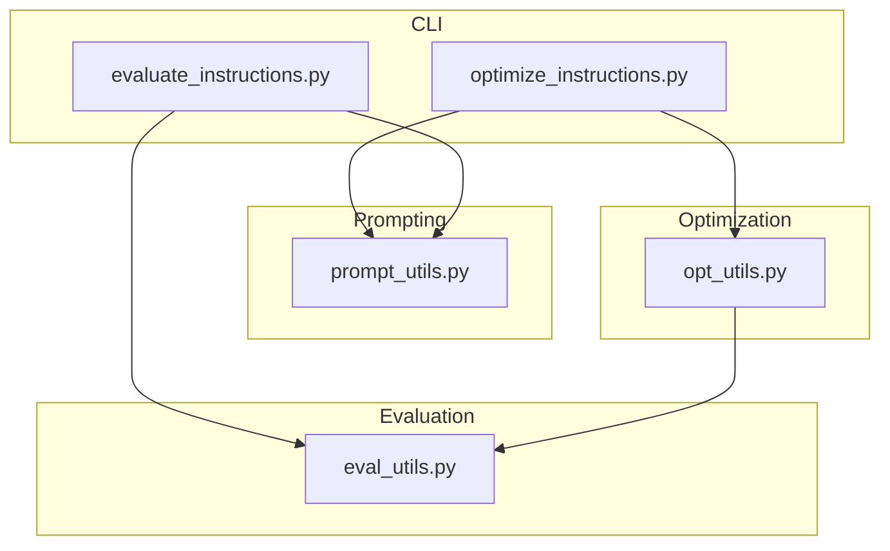
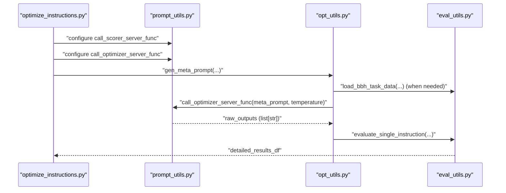
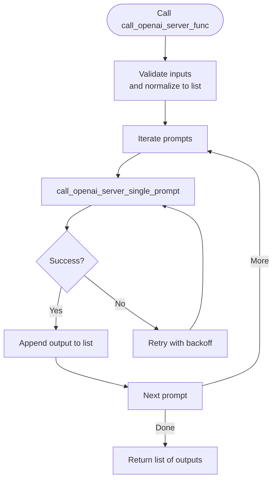
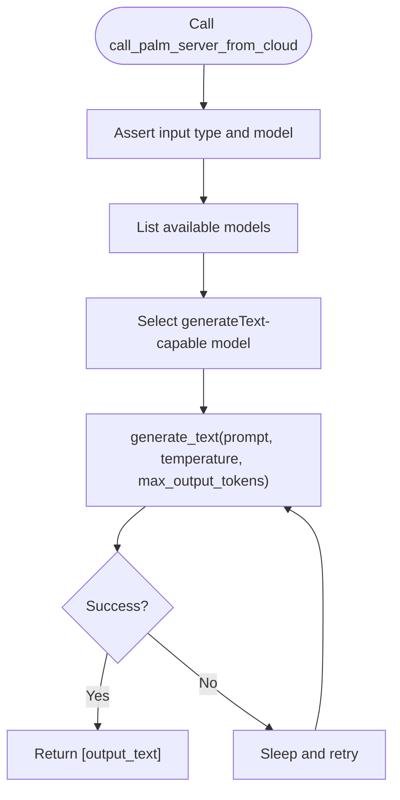
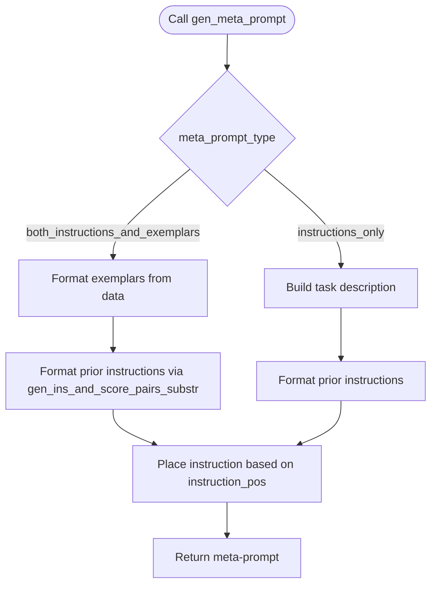
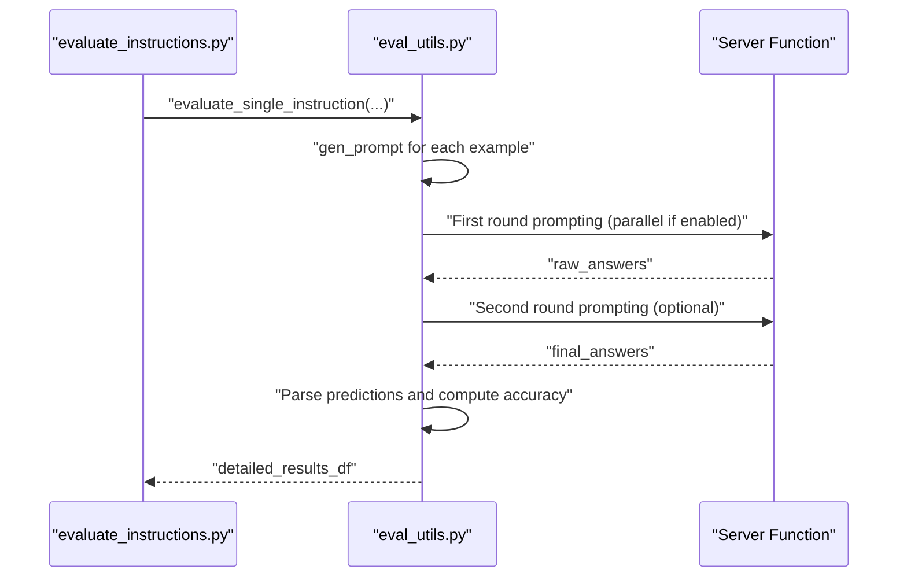
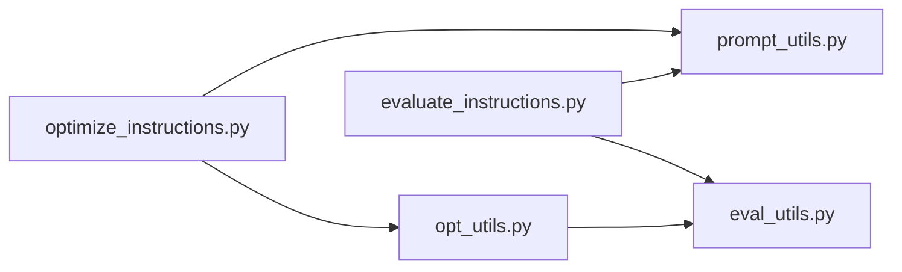

# API Reference

<cite>
**Referenced Files in This Document**
- [prompt_utils.py](file://opro/prompt_utils.py)
- [opt_utils.py](file://opro/optimization/opt_utils.py)
- [eval_utils.py](file://opro/evaluation/eval_utils.py)
- [optimize_instructions.py](file://opro/optimization/optimize_instructions.py)
- [evaluate_instructions.py](file://opro/evaluation/evaluate_instructions.py)
</cite>

## Table of Contents
1. [Introduction](#introduction)
2. [Project Structure](#project-structure)
3. [Core Components](#core-components)
4. [Architecture Overview](#architecture-overview)
5. [Detailed Component Analysis](#detailed-component-analysis)
6. [Dependency Analysis](#dependency-analysis)
7. [Performance Considerations](#performance-considerations)
8. [Troubleshooting Guide](#troubleshooting-guide)
9. [Conclusion](#conclusion)

## Introduction
This document provides API documentation for the internal utility functions in opro that power prompting, optimization, and evaluation workflows. It focuses on:
- Prompting utilities for OpenAI and Google Cloud models
- Optimization utilities for constructing meta-prompts and orchestrating instruction evolution
- Evaluation utilities for data loading, prompt construction, answer extraction, and scoring

It also includes invocation examples from the main scripts, expected input formats, edge cases, thread-safety considerations, rate-limiting behavior, and performance characteristics.

## Project Structure
The relevant modules are organized by functionality:
- Prompting utilities: opro/prompt_utils.py
- Optimization utilities: opro/optimization/opt_utils.py
- Evaluation utilities: opro/evaluation/eval_utils.py
- Command-line entry points: opro/optimization/optimize_instructions.py and opro/evaluation/evaluate_instructions.py

**Diagram sources**
- [prompt_utils.py](file://opro/prompt_utils.py#L1-L133)
- [opt_utils.py](file://opro/optimization/opt_utils.py#L1-L120)
- [eval_utils.py](file://opro/evaluation/eval_utils.py#L1-L120)
- [optimize_instructions.py](file://opro/optimization/optimize_instructions.py#L1-L120)
- [evaluate_instructions.py](file://opro/evaluation/evaluate_instructions.py#L1-L120)

**Section sources**
- [prompt_utils.py](file://opro/prompt_utils.py#L1-L133)
- [opt_utils.py](file://opro/optimization/opt_utils.py#L1-L120)
- [eval_utils.py](file://opro/evaluation/eval_utils.py#L1-L120)
- [optimize_instructions.py](file://opro/optimization/optimize_instructions.py#L1-L120)
- [evaluate_instructions.py](file://opro/evaluation/evaluate_instructions.py#L1-L120)

## Core Components

### Prompt Utilities (OpenAI and Google Cloud)
- call_openai_server_func
  - Purpose: Call OpenAI ChatCompletion API with a single prompt or a list of prompts
  - Parameters:
    - inputs: str or list[str]; input prompt(s)
    - model: str; defaults to "gpt-3.5-turbo"
    - max_decode_steps: int; defaults to 20
    - temperature: float; defaults to 0.8
  - Returns: list[str]; one output per input prompt
  - Error handling:
    - Timeout, RateLimitError, APIError, APIConnectionError, ServiceUnavailableError, OSError
    - Automatic retry with exponential-like backoff and re-invocation
  - Expected input formats:
    - inputs can be a single string or a list of strings
    - model must be a supported OpenAI chat model identifier
  - Edge cases:
    - Non-string inputs are coerced to list via internal helper
    - On errors, prints retry message and sleeps before retry
  - Thread safety: Not inherently thread-safe; retries are sequential per call
  - Rate limiting considerations: Built-in retry on rate limit; caller should stagger requests if invoking concurrently
  - Performance: Linear in number of prompts; each call performs network I/O and JSON parsing

- call_palm_server_from_cloud
  - Purpose: Call Google Cloud PaLM text-bison model via generate_text
  - Parameters:
    - input_text: str; required
    - model: str; fixed to "text-bison-001"
    - max_decode_steps: int; defaults to 20
    - temperature: float; defaults to 0.8
  - Returns: list[str]; single-element list containing the generated text
  - Error handling:
    - General exception handling with retry and sleep
  - Expected input formats:
    - input_text must be a non-empty string
    - model must be "text-bison-001"
  - Edge cases:
    - Asserts input type and model name
    - Retry mechanism on failure
  - Thread safety: Not inherently thread-safe; retries are sequential per call
  - Rate limiting considerations: No explicit rate-limit handling; relies on retry
  - Performance: Single decode per call; network I/O dominates

**Section sources**
- [prompt_utils.py](file://opro/prompt_utils.py#L21-L133)

### Optimization Utilities (Meta-Prompt Generation and Evolution)
- gen_meta_prompt
  - Purpose: Construct a meta-prompt for instruction refinement, incorporating prior instructions and optional few-shot exemplars
  - Parameters:
    - old_instructions_and_scores: list[tuple[str, float, int]]; prior instructions, scores, and step indices
    - instruction_pos: str; placement of instruction in prompt, one of {"before_Q", "Q_begin", "Q_end", "A_begin"}
    - optimizer_llm_name: str; optimizer model identifier, e.g., "gpt-3.5-turbo", "gpt-4", or "text-bison"
    - old_instruction_score_threshold: float; min score threshold for including prior instructions
    - max_num_instructions: int; max number of prior instructions to include
    - meta_prompt_type: str; "both_instructions_and_exemplars" or "instructions_only"
    - few_shot_qa_pairs: bool; include few-shot QA exemplars
    - include_qa: bool; include "Q:" and "A:" markers
    - data: list or pd.DataFrame; raw dataset
    - few_shot_index_list: list[int]; indices of exemplars to include
    - instructions_before_exemplars: bool; place prior instructions before exemplars
    - num_score_buckets: int or np.inf; bucketize scores for display
    - dataset_name: str; one of {"mmlu", "bbh", "gsm8k"}
    - task_name: str; task identifier (used for task description when instructions_only)
  - Returns: str; constructed meta-prompt
  - Role in optimization:
    - Provides context to the optimizer LLM to generate improved instructions
    - Controls whether to include prior instructions and exemplars
  - Expected input formats:
    - old_instructions_and_scores: list of tuples with (instruction, score, step_index)
    - data: depends on dataset_name and meta_prompt_type
    - few_shot_index_list: integer indices into data
  - Edge cases:
    - Assertions enforce valid instruction_pos, meta_prompt_type, dataset_name, and score bucketing
    - Different behavior for GPT vs PaLM optimizers
    - Conditional inclusion of exemplars and instruction placement
  - Thread safety: Pure function; no shared mutable state
  - Rate limiting considerations: No built-in rate limiting; caller manages concurrency
  - Performance: Linear in number of included exemplars and prior instructions

- gen_ins_and_score_pairs_substr
  - Purpose: Build a formatted string of prior instruction-score pairs for inclusion in meta-prompt
  - Parameters:
    - old_instructions_and_scores: list[tuple[str, float, int]]
    - old_instruction_score_threshold: float
    - max_num_instructions: int
    - return_str_only: bool; controls return type
    - num_score_buckets: int or np.inf
  - Returns:
    - If return_str_only: str; concatenated pairs
    - Else: tuple[str, list[tuple[str, float, int]]]; (pairs string, filtered list)
  - Complexity: O(n) over included instructions
  - Edge cases: Sorting by score and truncation by max_num_instructions

- run_evolution
  - Purpose: Orchestrates the instruction evolution loop, meta-prompt generation, instruction generation, evaluation, and logging
  - Key responsibilities:
    - Loads datasets and splits indices
    - Builds meta-prompts with gen_meta_prompt
    - Calls optimizer server function to generate instructions
    - Evaluates instructions via eval_utils.evaluate_single_instruction
    - Manages few-shot selection criteria and temperature schedules
  - Expected input formats:
    - kwargs include dataset_name, instruction_pos, optimizer_llm_name, call_scorer_server_func, call_optimizer_server_func, and many configuration flags
  - Edge cases:
    - Multiple dataset types and task-specific handling
    - Temperature scheduling and bucketization of scores
  - Thread safety: Uses multiprocessing pool for parallel evaluation; thread-safe within worker boundaries
  - Rate limiting considerations: Managed by caller-provided server functions and CLI configuration
  - Performance: Dominated by model calls and evaluation; batching and parallelism reduce wall-clock time

**Section sources**
- [opt_utils.py](file://opro/optimization/opt_utils.py#L52-L335)
- [opt_utils.py](file://opro/optimization/opt_utils.py#L338-L800)

### Evaluation Utilities (Data Loading and Answer Extraction)
- gen_prompt
  - Purpose: Construct a prompt for a given instruction and data example
  - Parameters:
    - data: list or pd.DataFrame or dict; dataset container
    - instruction: str; instruction text
    - idx: int; index of example
    - include_qa: bool; include "Q:" and "A:" markers
    - instruction_pos: str; placement of instruction
    - dataset_name: str; one of {"mmlu", "bbh", "gsm8k", "multiarith", "aqua"}
  - Returns: str; composed prompt
  - Expected input formats:
    - data shape varies by dataset_name
    - instruction_pos must be one of {"before_Q", "Q_begin", "Q_end", "A_begin"}
  - Edge cases:
    - Different formatting for each dataset
    - Optional inclusion of question text

- fetch_true_answer
  - Purpose: Retrieve the ground-truth answer for a given example
  - Parameters:
    - data: list or pd.DataFrame or dict
    - idx: int
    - dataset_name: str
  - Returns: str or int; true answer
  - Expected input formats:
    - data structure depends on dataset_name

- evaluate_single_instruction
  - Purpose: Evaluate a single instruction across a subset of dataset examples
  - Parameters:
    - data: list or pd.DataFrame or dict
    - instruction: str
    - eval_index_all: list[int] or np.ndarray
    - batch_size: int
    - call_server_func: callable; server function wrapper
    - dataset_name: str
    - num_servers: int
    - extract_final_answer_by_prompting_again: bool
    - instruction_pos: str
    - is_multiple_choice: bool or list[bool]
    - include_qa: bool
    - evaluate_in_parallel: bool
    - num_decodes: int
    - max_retry: int
    - sleep_time: int
    - prediction_treat_as_number: bool or "adaptive"
    - prediction_treat_as_bool: bool
    - prediction_num_decimals: int
    - is_gpt_model: bool
    - verbose: bool
  - Returns: pd.DataFrame; columns include raw_prompt, raw_answer, parsed_answer, true_answer, accuracy
  - Expected input formats:
    - eval_index_all must match data length/type
    - call_server_func must accept a prompt or list of prompts and optional max_decode_steps
  - Edge cases:
    - Parallel execution via multiprocessing pool
    - Two-stage prompting for answer extraction when enabled
    - Adaptive normalization for numeric/boolean predictions
  - Thread safety: Uses multiprocessing Pool; safe for concurrent server calls
  - Rate limiting considerations: Caller should configure server-side batching and throttling
  - Performance: Heavily influenced by model latency and parallelism; batching reduces overhead

- Additional helpers:
  - instruction_to_filename, polish_sentence, remove_punctuation_from_string, _split_by_Q, _get_index_from_symbol, _get_answer_text, _get_accuracy, get_accuracy_of_list
  - These support filename sanitization, answer parsing, and accuracy computation

**Section sources**
- [eval_utils.py](file://opro/evaluation/eval_utils.py#L164-L260)
- [eval_utils.py](file://opro/evaluation/eval_utils.py#L262-L380)
- [eval_utils.py](file://opro/evaluation/eval_utils.py#L381-L800)

## Architecture Overview
The CLI scripts wire together prompting, optimization, and evaluation utilities:
- optimize_instructions.py sets up OpenAI/PaLM server wrappers, constructs meta-prompts, and invokes run_evolution
- evaluate_instructions.py loads datasets, builds prompts, and evaluates instructions via evaluate_single_instruction

**Diagram sources**
- [optimize_instructions.py](file://opro/optimization/optimize_instructions.py#L240-L360)
- [opt_utils.py](file://opro/optimization/opt_utils.py#L690-L740)
- [eval_utils.py](file://opro/evaluation/eval_utils.py#L536-L760)
- [prompt_utils.py](file://opro/prompt_utils.py#L87-L133)

## Detailed Component Analysis

### call_openai_server_func
- Behavior:
  - Accepts a single prompt or a list of prompts
  - Invokes OpenAI ChatCompletion with provided model, temperature, and max tokens
  - Returns a list of outputs, one per input
- Error handling:
  - Catches timeout, rate limit, API error, connection error, service unavailable, and OS errors
  - Prints retry message and sleeps before reattempt
- Invocation example (from CLI):
  - The CLI constructs a partial function with model, max_decode_steps, and temperature, then calls it with a test prompt
- Thread safety:
  - Not thread-safe; retries are sequential per call
- Rate limiting:
  - Built-in retry; caller should manage concurrency and backoff
- Performance:
  - O(n) over number of prompts; dominated by network latency

**Diagram sources**
- [prompt_utils.py](file://opro/prompt_utils.py#L87-L103)

**Section sources**
- [prompt_utils.py](file://opro/prompt_utils.py#L87-L103)
- [optimize_instructions.py](file://opro/optimization/optimize_instructions.py#L290-L310)
- [evaluate_instructions.py](file://opro/evaluation/evaluate_instructions.py#L288-L300)

### call_palm_server_from_cloud
- Behavior:
  - Validates input type and model name
  - Lists available models and selects one with generateText support
  - Generates text with temperature and max_output_tokens
  - Returns a single-element list with the result
- Error handling:
  - General exception handling with retry and sleep
- Invocation example (from CLI):
  - The CLI constructs a partial function with model, temperature, and max_decode_steps, then calls it with a test prompt
- Thread safety:
  - Not thread-safe; retries are sequential per call
- Rate limiting:
  - No explicit rate-limit handling; relies on retry
- Performance:
  - Single decode per call; network I/O dominates

**Diagram sources**
- [prompt_utils.py](file://opro/prompt_utils.py#L105-L133)

**Section sources**
- [prompt_utils.py](file://opro/prompt_utils.py#L105-L133)
- [optimize_instructions.py](file://opro/optimization/optimize_instructions.py#L258-L270)
- [evaluate_instructions.py](file://opro/evaluation/evaluate_instructions.py#L258-L270)

### gen_meta_prompt
- Behavior:
  - Builds a structured meta-prompt combining prior instructions and optional few-shot exemplars
  - Supports two modes: both_instructions_and_exemplars and instructions_only
  - Places instruction according to instruction_pos
- Data handling:
  - Uses gen_ins_and_score_pairs_substr to format prior instructions
  - Optionally formats dataset exemplars based on dataset_name and include_qa
- Invocation example (from CLI):
  - The CLI constructs meta-prompts during evolution and passes them to optimizer server function
- Thread safety:
  - Pure function; no shared state
- Rate limiting:
  - No built-in rate limiting
- Performance:
  - Linear in number of included exemplars and prior instructions

**Diagram sources**
- [opt_utils.py](file://opro/optimization/opt_utils.py#L90-L335)

**Section sources**
- [opt_utils.py](file://opro/optimization/opt_utils.py#L90-L335)
- [optimize_instructions.py](file://opro/optimization/optimize_instructions.py#L690-L725)

### evaluate_single_instruction
- Behavior:
  - Generates prompts for each example in eval_index_all
  - Optionally performs parallel prompting using a multiprocessing pool
  - Second round of prompting to extract final answers when configured
  - Parses predictions and computes accuracy using multiple heuristics
- Data handling:
  - Uses gen_prompt to construct prompts
  - Uses fetch_true_answer to retrieve ground truths
  - Uses _get_accuracy and get_accuracy_of_list for scoring
- Invocation example (from CLI):
  - The CLI calls evaluate_single_instruction with dataset-specific parameters and saves results
- Thread safety:
  - Uses multiprocessing Pool; safe for concurrent server calls
- Rate limiting:
  - Caller should configure server-side batching and throttling
- Performance:
  - Heavily influenced by model latency; parallelism reduces wall-clock time

**Diagram sources**
- [evaluate_instructions.py](file://opro/evaluation/evaluate_instructions.py#L673-L740)
- [eval_utils.py](file://opro/evaluation/eval_utils.py#L536-L800)

**Section sources**
- [eval_utils.py](file://opro/evaluation/eval_utils.py#L536-L800)
- [evaluate_instructions.py](file://opro/evaluation/evaluate_instructions.py#L673-L740)

## Dependency Analysis
- optimize_instructions.py depends on:
  - prompt_utils for server wrappers
  - opt_utils for meta-prompt generation and evolution orchestration
- evaluate_instructions.py depends on:
  - prompt_utils for server wrappers
  - eval_utils for prompt construction, evaluation, and scoring
- opt_utils depends on:
  - eval_utils for dataset-specific helpers and evaluation integration

**Diagram sources**
- [optimize_instructions.py](file://opro/optimization/optimize_instructions.py#L54-L120)
- [evaluate_instructions.py](file://opro/evaluation/evaluate_instructions.py#L52-L120)
- [opt_utils.py](file://opro/optimization/opt_utils.py#L1-L40)
- [eval_utils.py](file://opro/evaluation/eval_utils.py#L1-L40)

**Section sources**
- [optimize_instructions.py](file://opro/optimization/optimize_instructions.py#L54-L120)
- [evaluate_instructions.py](file://opro/evaluation/evaluate_instructions.py#L52-L120)
- [opt_utils.py](file://opro/optimization/opt_utils.py#L1-L40)
- [eval_utils.py](file://opro/evaluation/eval_utils.py#L1-L40)

## Performance Considerations
- Prompting utilities:
  - call_openai_server_func and call_palm_server_from_cloud are I/O bound; performance scales with number of prompts and model latency
  - Use batching and retries judiciously; consider rate-limiting policies
- Optimization utilities:
  - gen_meta_prompt is O(n) in included exemplars and prior instructions
  - run_evolution benefits from parallel evaluation and batching
- Evaluation utilities:
  - evaluate_single_instruction is dominated by model latency; parallel execution via multiprocessing pool reduces wall-clock time
  - Consider server-side batching and appropriate max_decode_steps to balance quality and throughput

[No sources needed since this section provides general guidance]

## Troubleshooting Guide
- OpenAI-related errors:
  - Timeout, RateLimitError, APIError, APIConnectionError, ServiceUnavailableError, OSError
  - Resolution: The functions automatically retry with backoff; ensure API keys are configured and network connectivity is stable
- PaLM-related errors:
  - General exceptions trigger retry; ensure model name is "text-bison-001" and API key is configured
- Dataset mismatches:
  - gen_prompt and fetch_true_answer assert valid dataset_name; ensure dataset_name matches the loaded data structure
- Instruction position and meta-prompt type:
  - gen_meta_prompt asserts valid instruction_pos and meta_prompt_type; ensure correct values are passed
- Parallel evaluation:
  - evaluate_single_instruction uses multiprocessing; ensure server functions are thread-safe and properly configured

**Section sources**
- [prompt_utils.py](file://opro/prompt_utils.py#L21-L133)
- [eval_utils.py](file://opro/evaluation/eval_utils.py#L164-L260)
- [opt_utils.py](file://opro/optimization/opt_utils.py#L90-L160)

## Conclusion
The internal utilities in opro provide a cohesive pipeline for instruction optimization and evaluation:
- Prompting utilities wrap OpenAI and Google Cloud APIs with robust error handling and retry logic
- Optimization utilities construct context-rich meta-prompts and orchestrate the evolution process
- Evaluation utilities handle data loading, prompt construction, answer extraction, and scoring with configurable parallelism

By following the documented parameters, expected input formats, and considering thread-safety and rate-limiting, users can reliably integrate these utilities into their workflows.