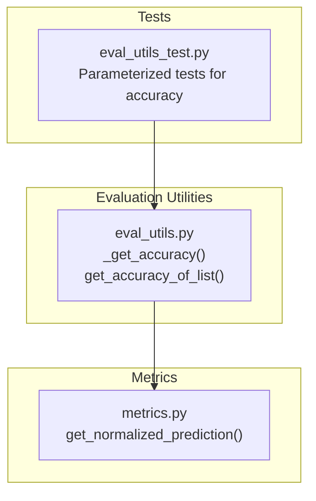
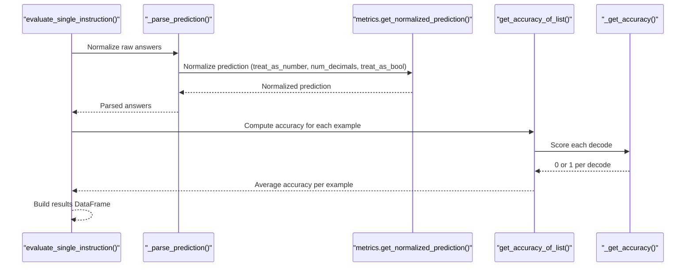
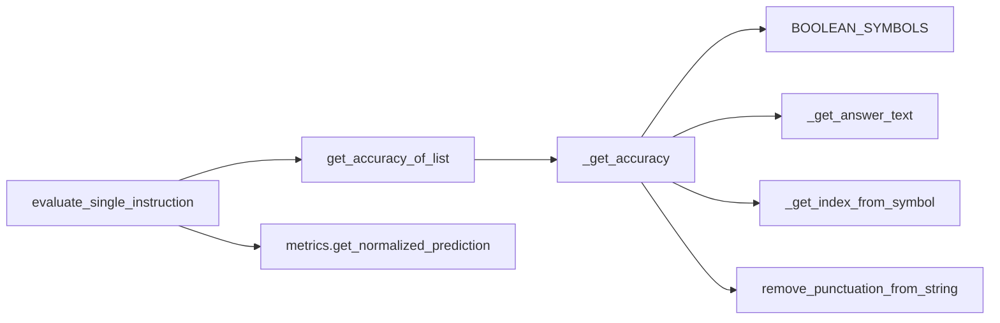

# Accuracy Calculation

<cite>
**Referenced Files in This Document**
- [eval_utils.py](file://opro/evaluation/eval_utils.py)
- [metrics.py](file://opro/evaluation/metrics.py)
- [eval_utils_test.py](file://opro/evaluation/eval_utils_test.py)
</cite>

## Table of Contents
1. [Introduction](#introduction)
2. [Project Structure](#project-structure)
3. [Core Components](#core-components)
4. [Architecture Overview](#architecture-overview)
5. [Detailed Component Analysis](#detailed-component-analysis)
6. [Dependency Analysis](#dependency-analysis)
7. [Performance Considerations](#performance-considerations)
8. [Troubleshooting Guide](#troubleshooting-guide)
9. [Conclusion](#conclusion)

## Introduction
This document explains the accuracy evaluation functions in the evaluation utilities module, focusing on:
- _get_accuracy: Single-prediction accuracy scoring across multiple evaluation modes
- get_accuracy_of_list: Aggregation of multiple decodes into a single accuracy score

It details how these functions handle:
- Exact match
- Choice text matching
- Inclusion logic
- Boolean normalization using predefined symbol sets
- Integration with metrics.get_normalized_prediction for numeric/boolean answer handling
- Parameters: true_answer, pred_answer, input_text, treat_include_as_correct
- Usage patterns for single predictions and n-shot evaluations
- Common issues and performance considerations for parallel accuracy computation

## Project Structure
The accuracy evaluation logic resides in:
- opro/evaluation/eval_utils.py: Contains _get_accuracy and get_accuracy_of_list, plus helpers for prompt construction and evaluation orchestration
- opro/evaluation/metrics.py: Provides numeric/boolean normalization routines used during evaluation
- opro/evaluation/eval_utils_test.py: Unit tests demonstrating expected behaviors for accuracy scoring

**Diagram sources**
- [eval_utils.py](file://opro/evaluation/eval_utils.py#L380-L533)
- [metrics.py](file://opro/evaluation/metrics.py#L188-L343)
- [eval_utils_test.py](file://opro/evaluation/eval_utils_test.py#L148-L173)

**Section sources**
- [eval_utils.py](file://opro/evaluation/eval_utils.py#L380-L533)
- [metrics.py](file://opro/evaluation/metrics.py#L188-L343)
- [eval_utils_test.py](file://opro/evaluation/eval_utils_test.py#L148-L173)

## Core Components
- _get_accuracy(true_answer, pred_answer, input_text="", treat_include_as_correct=False)
  - Computes a single accuracy score (0 or 1) for one decoded prediction
  - Supports multiple evaluation modes: exact match, choice text matching, inclusion logic, and boolean normalization
  - Uses input_text to resolve multiple-choice answer texts and to enforce exclusion of other choices
  - Treats include-as-correct mode when enabled
- get_accuracy_of_list(true_answer, pred_answer_list, input_text="", treat_include_as_correct=False)
  - Aggregates multiple decodes by averaging per-mode scores computed by _get_accuracy
  - Returns a floating-point accuracy in [0, 1]

Key integration points:
- Boolean normalization uses predefined symbol groups
- Inclusion logic ensures correctness when the true answer text is included while other choice texts are excluded
- Numeric/boolean normalization is integrated via metrics.get_normalized_prediction during the broader evaluation pipeline

**Section sources**
- [eval_utils.py](file://opro/evaluation/eval_utils.py#L380-L533)
- [metrics.py](file://opro/evaluation/metrics.py#L188-L343)

## Architecture Overview
The evaluation pipeline integrates accuracy scoring with prediction normalization and decoding:

**Diagram sources**
- [eval_utils.py](file://opro/evaluation/eval_utils.py#L800-L863)
- [metrics.py](file://opro/evaluation/metrics.py#L188-L343)

## Detailed Component Analysis

### _get_accuracy: Single-Prediction Scoring
Behavior and modes:
- Exact match: Compares normalized pred_answer and true_answer, including punctuation removal for non-file contexts
- Choice text matching: When input_text is provided, resolves the true answer’s choice text and checks if pred_answer equals or matches the text (with punctuation stripping)
- Inclusion logic: Ensures the true answer text is included in pred_answer and excludes other choice texts
- Boolean normalization: Recognizes true/false-like symbols across multiple symbol sets and converts numeric 0/1 to boolean equivalents for comparison

Parameters:
- true_answer: Ground-truth label or symbol (e.g., "A", "(B)", "true", "yes")
- pred_answer: Model output for a single decode
- input_text: Prompt or question text containing choices; used to extract choice texts and enforce exclusivity
- treat_include_as_correct: If true, marks a prediction correct if true_answer is included in pred_answer

Processing steps:
1. Normalize true_answer and pred_answer to lowercase
2. If input_text is provided and contains choices:
   - Expand single-letter symbols to bracketed form
   - Extract true answer text and other choice texts
3. Compute four conditions:
   - Exact match (including punctuation-stripped variant)
   - Choice text exact match (when input_text is present)
   - Inclusion of true choice text with exclusion of others
   - Boolean match using BOOLEAN_SYMBOLS and numeric 0/1 conversion
4. Combine conditions with OR; if treat_include_as_correct is true, also accept when true_answer is included in pred_answer
5. Return 1 if any condition holds, else 0

Common evaluation modes:
- Symbol-only match: e.g., "(A)" vs "(B)"
- Text-only match: e.g., "east" vs "west"
- Inclusion with exclusivity: e.g., "east west" includes the correct text and excludes others
- Boolean normalization: e.g., "true", "yes", "1" mapped to the same boolean meaning

Integration with numeric/boolean normalization:
- During broader evaluation, predictions are normalized via metrics.get_normalized_prediction before being passed to _get_accuracy
- This ensures numeric rounding and boolean symbol normalization occur prior to scoring

**Section sources**
- [eval_utils.py](file://opro/evaluation/eval_utils.py#L380-L497)
- [metrics.py](file://opro/evaluation/metrics.py#L188-L343)

### get_accuracy_of_list: Aggregation Across Multiple Decodes
Purpose:
- Given a list of predictions from multiple decodes, compute an average accuracy score per example

Behavior:
- Applies _get_accuracy to each decode in pred_answer_list
- Averages the resulting 0/1 scores to produce a float in [0, 1]
- Honors treat_include_as_correct consistently across all decodes

Usage:
- Typical for n-shot or multi-decode evaluation where multiple outputs are produced per example

**Section sources**
- [eval_utils.py](file://opro/evaluation/eval_utils.py#L499-L533)

### Example Workflows

#### Single Prediction Accuracy
- Input: true_answer, pred_answer, input_text (optional), treat_include_as_correct (optional)
- Output: 0 or 1
- Modes covered: exact match, choice text match, inclusion with exclusivity, boolean normalization

Reference paths:
- [_get_accuracy](file://opro/evaluation/eval_utils.py#L380-L497)

#### N-Shot Evaluation Accuracy
- Input: true_answer, pred_answer_list (multiple decodes), input_text (optional), treat_include_as_correct (optional)
- Output: float in [0, 1]
- Aggregation: arithmetic mean of per-decode scores

Reference paths:
- [get_accuracy_of_list](file://opro/evaluation/eval_utils.py#L499-L533)

#### Integration with Numeric/Boolean Normalization
- During evaluation, predictions are normalized using metrics.get_normalized_prediction with:
  - treat_as_number
  - num_decimals
  - treat_as_bool
- These normalized predictions are then scored by _get_accuracy

Reference paths:
- [metrics.get_normalized_prediction](file://opro/evaluation/metrics.py#L188-L343)
- [evaluate_single_instruction parsing](file://opro/evaluation/eval_utils.py#L800-L863)

## Dependency Analysis
Relationships:
- _get_accuracy depends on:
  - Choice extraction helpers (_get_answer_text, _get_index_from_symbol)
  - Boolean symbol groups (BOOLEAN_SYMBOLS)
  - Punctuation removal helper (remove_punctuation_from_string)
- get_accuracy_of_list depends on:
  - _get_accuracy for per-decode scoring
  - NumPy average for aggregation
- Numeric/boolean normalization is externalized to metrics.get_normalized_prediction

**Diagram sources**
- [eval_utils.py](file://opro/evaluation/eval_utils.py#L380-L533)
- [metrics.py](file://opro/evaluation/metrics.py#L188-L343)

**Section sources**
- [eval_utils.py](file://opro/evaluation/eval_utils.py#L380-L533)
- [metrics.py](file://opro/evaluation/metrics.py#L188-L343)

## Performance Considerations
- Parallel accuracy computation:
  - The broader evaluation pipeline supports parallel prompting and decoding
  - While _get_accuracy and get_accuracy_of_list are lightweight, aggregating across many examples benefits from batching and vectorized operations
- Inclusion logic cost:
  - Choice text extraction and exclusivity checks involve string operations and regex; keep input_text minimal and well-formed to reduce overhead
- Boolean normalization:
  - Symbol group lookups are constant-time; avoid repeated conversions by normalizing predictions upstream
- Memory footprint:
  - get_accuracy_of_list computes per-decode scores; for very large num_decodes, consider streaming or chunked processing if needed

[No sources needed since this section provides general guidance]

## Troubleshooting Guide
Common issues and resolutions:
- Malformed predictions:
  - Ensure predictions are normalized (numbers rounded, boolean symbols standardized) before passing to _get_accuracy
  - Reference: [metrics.get_normalized_prediction](file://opro/evaluation/metrics.py#L188-L343)
- Ambiguous answer formats:
  - For multiple-choice, provide input_text to enable choice text matching and inclusion/exclusion logic
  - Verify that choices are bracketed and ordered consistently
- Mixed numeric and textual answers:
  - Use treat_as_number and treat_as_bool flags appropriately during normalization to avoid miscomparisons
- Overly lenient inclusion mode:
  - treat_include_as_correct can increase recall but may introduce false positives; use judiciously, especially for numeric targets

Validation via tests:
- Single-prediction tests cover symbol/text matching, inclusion with punctuation, and boolean normalization
- Multi-decode tests demonstrate averaging behavior across decodes

Reference paths:
- [eval_utils_test single-prediction tests](file://opro/evaluation/eval_utils_test.py#L148-L303)
- [eval_utils_test multi-decode tests](file://opro/evaluation/eval_utils_test.py#L152-L173)

**Section sources**
- [eval_utils_test.py](file://opro/evaluation/eval_utils_test.py#L148-L173)
- [metrics.py](file://opro/evaluation/metrics.py#L188-L343)

## Conclusion
The accuracy evaluation utilities implement robust scoring across multiple modalities:
- _get_accuracy handles exact match, choice text matching, inclusion with exclusivity, and boolean normalization
- get_accuracy_of_list aggregates multi-decode predictions via averaging
- Integration with metrics.get_normalized_prediction ensures consistent numeric and boolean handling
- Tests validate expected behaviors for diverse scenarios, including punctuation, symbol forms, and boolean semantics

[No sources needed since this section summarizes without analyzing specific files]