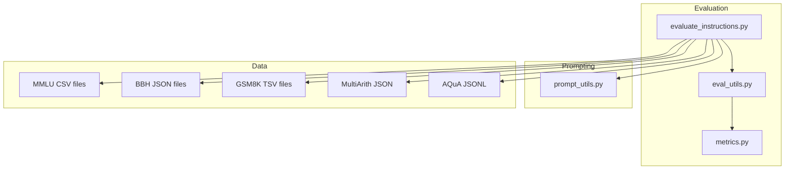
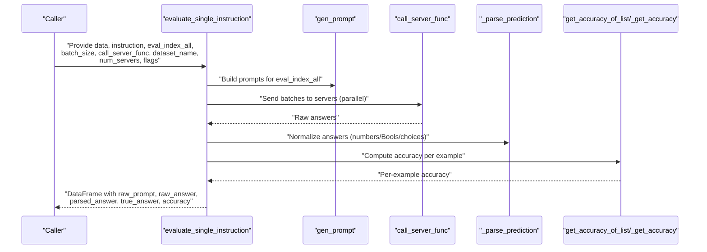
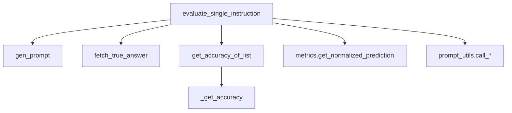

# Evaluation Utilities

<cite>
**Referenced Files in This Document**
- [eval_utils.py](file://opro/evaluation/eval_utils.py)
- [metrics.py](file://opro/evaluation/metrics.py)
- [evaluate_instructions.py](file://opro/evaluation/evaluate_instructions.py)
- [prompt_utils.py](file://opro/prompt_utils.py)
- [eval_utils_test.py](file://opro/evaluation/eval_utils_test.py)
</cite>

## Table of Contents
1. [Introduction](#introduction)
2. [Project Structure](#project-structure)
3. [Core Components](#core-components)
4. [Architecture Overview](#architecture-overview)
5. [Detailed Component Analysis](#detailed-component-analysis)
6. [Dependency Analysis](#dependency-analysis)
7. [Performance Considerations](#performance-considerations)
8. [Troubleshooting Guide](#troubleshooting-guide)
9. [Conclusion](#conclusion)

## Introduction
This document provides API documentation for the evaluation utility functions in opro/evaluation/eval_utils.py. It focuses on:
- evaluate_single_instruction: end-to-end evaluation of a single instruction across multiple datasets and benchmarks.
- gen_prompt: dataset-specific prompt construction for MMLU, BBH, GSM8K, MultiArith, and AQuA.
- fetch_true_answer and get_accuracy_of_list: retrieving ground-truth answers and computing accuracy across multiple decoding attempts.
- Accuracy calculation logic, input formats, parallel evaluation support, and handling of diverse answer formats.

The goal is to help users understand how to construct prompts, parse model outputs, and compute reliable accuracy metrics for benchmark evaluation.

## Project Structure
The evaluation utilities reside in the opro/evaluation package and integrate with prompt utilities and metrics.

**Diagram sources**
- [eval_utils.py](file://opro/evaluation/eval_utils.py#L1-L917)
- [metrics.py](file://opro/evaluation/metrics.py#L1-L496)
- [evaluate_instructions.py](file://opro/evaluation/evaluate_instructions.py#L1-L770)
- [prompt_utils.py](file://opro/prompt_utils.py#L1-L133)

**Section sources**
- [eval_utils.py](file://opro/evaluation/eval_utils.py#L1-L917)
- [metrics.py](file://opro/evaluation/metrics.py#L1-L496)
- [evaluate_instructions.py](file://opro/evaluation/evaluate_instructions.py#L1-L770)
- [prompt_utils.py](file://opro/prompt_utils.py#L1-L133)

## Core Components
- gen_prompt: Builds dataset-specific prompts from raw data and an instruction, with configurable positions for instruction placement and QA markers.
- fetch_true_answer: Retrieves the correct answer for a given example index across supported datasets.
- _get_accuracy and get_accuracy_of_list: Implements robust accuracy computation for both single and multiple decoding attempts, including symbol, text, and Boolean matching.
- evaluate_single_instruction: Orchestrates prompt generation, server calls (with optional parallelism), answer extraction, normalization, and accuracy aggregation into a DataFrame.

Key return types:
- evaluate_single_instruction returns a pandas DataFrame with columns: index_in_raw_dataset, raw_prompt, raw_answer, parsed_answer, true_answer, accuracy. Optionally includes second-round prompt and answer columns when prompted again.

Accuracy calculation highlights:
- Exact symbol match (with bracket normalization).
- Text match against answer choices for multiple-choice questions.
- Boolean match semantics across multiple symbol sets.
- Optional inclusion-based scoring when numeric targets are expected.

Parallel evaluation:
- Multithreading batching across multiple servers for throughput.
- Optional second round prompting to improve final answer extraction.

**Section sources**
- [eval_utils.py](file://opro/evaluation/eval_utils.py#L164-L259)
- [eval_utils.py](file://opro/evaluation/eval_utils.py#L262-L286)
- [eval_utils.py](file://opro/evaluation/eval_utils.py#L381-L497)
- [eval_utils.py](file://opro/evaluation/eval_utils.py#L499-L534)
- [eval_utils.py](file://opro/evaluation/eval_utils.py#L536-L864)

## Architecture Overview
The evaluation pipeline integrates prompt construction, model serving, answer parsing, and accuracy computation.

**Diagram sources**
- [eval_utils.py](file://opro/evaluation/eval_utils.py#L536-L864)
- [metrics.py](file://opro/evaluation/metrics.py#L188-L343)

## Detailed Component Analysis

### evaluate_single_instruction
Purpose:
- Evaluate a single instruction across selected indices of a dataset.
- Supports multiple datasets and benchmarks with dataset-specific prompt construction and answer handling.

Parameters:
- data: list or pandas DataFrame depending on dataset.
- instruction: str instruction to embed in prompts.
- eval_index_all: list or np.ndarray of indices to evaluate.
- batch_size: int for model serving batching.
- call_server_func: function to call the inference server.
- dataset_name: str among {"mmlu","bbh","gsm8k","multiarith","aqua"}.
- num_servers: int for parallel batching across servers.
- extract_final_answer_by_prompting_again: bool to add a final extraction prompt.
- instruction_pos: str among {"before_Q","Q_begin","Q_end","A_begin"}.
- is_multiple_choice: bool or list of bool per example.
- include_qa: bool to include "Q:" and "A:" markers.
- evaluate_in_parallel: bool to enable multithreading.
- num_decodes: int for multiple decoding attempts.
- max_retry: int for retry attempts on server calls.
- sleep_time: int seconds to sleep between retries.
- prediction_treat_as_number: bool or "adaptive".
- prediction_treat_as_bool: bool.
- prediction_num_decimals: int for rounding numbers.
- is_gpt_model: bool to handle special answer formats (e.g., boxed).
- verbose: bool for progress logging.

Return type:
- pandas.DataFrame with columns:
  - index_in_raw_dataset
  - raw_prompt
  - raw_answer
  - parsed_answer
  - true_answer
  - accuracy
  - Optionally: raw_prompt_second_round, raw_answer_second_round (when prompted again)

Accuracy calculation:
- For each example, aggregates multiple decoding attempts using get_accuracy_of_list.
- Uses _get_accuracy with dataset-specific logic:
  - Symbol matching for multiple-choice (with bracket normalization).
  - Text matching against answer choices for multiple-choice.
  - Boolean matching across predefined symbol sets.
  - Optional inclusion-based scoring when targets are numeric.

Parallel evaluation:
- Groups prompts into batches sized by batch_size.
- Distributes batches across num_servers using multithreading.
- Supports second-round prompting to improve final answer extraction.

Performance characteristics:
- Parallelism scales with num_servers and batch_size.
- Second-round prompting adds latency but improves extraction quality for some models.
- Parsing and accuracy computation are vectorized via map and list comprehensions.

Example usage:
- See evaluate_instructions.py for end-to-end usage with dataset selection, model configuration, and saving results.

**Section sources**
- [eval_utils.py](file://opro/evaluation/eval_utils.py#L536-L864)
- [metrics.py](file://opro/evaluation/metrics.py#L188-L343)
- [evaluate_instructions.py](file://opro/evaluation/evaluate_instructions.py#L549-L766)

### gen_prompt
Purpose:
- Construct dataset-specific prompts from raw data and an instruction.

Supported datasets:
- mmlu: DataFrame rows with question and four choices; builds a 4-option prompt.
- bbh: list of dicts with "input" and "target"; uses input as question.
- gsm8k: DataFrame with first column as question and second as answer.
- multiarith: dict with "sQuestion" and "lSolutions"; uses first solution as target.
- aqua: list of dicts with "question", "options", and "correct".

Instruction placement:
- before_Q: instruction before Q marker.
- Q_begin: instruction at the beginning of the question.
- Q_end: instruction at the end of the question.
- A_begin: instruction at the beginning of the answer.

QA markers:
- include_qa=True adds "Q: " and "A:" markers; include_qa=False omits them.

Input formats:
- mmlu: pandas DataFrame row-wise access.
- bbh: list of dicts.
- gsm8k: pandas DataFrame.
- multiarith: list of dicts.
- aqua: list of dicts.

Output:
- str prompt constructed according to dataset and instruction position.

**Section sources**
- [eval_utils.py](file://opro/evaluation/eval_utils.py#L164-L259)

### fetch_true_answer
Purpose:
- Retrieve the correct answer for a given example index and dataset.

Supported datasets:
- mmlu: last column of DataFrame row.
- bbh: "target" field of dict.
- gsm8k: second column of DataFrame row.
- multiarith: integer cast of first solution.
- aqua: "correct" field of dict.

Behavior:
- Asserts dataset_name is valid.
- Returns the appropriate answer field based on dataset.

**Section sources**
- [eval_utils.py](file://opro/evaluation/eval_utils.py#L262-L286)

### get_accuracy_of_list
Purpose:
- Compute accuracy across multiple decoding attempts for a single example.

Inputs:
- true_answer: str or list (list form not supported; assertion enforces scalar).
- pred_answer_list: list of answers from multiple decodes.
- input_text: str for multiple-choice questions to enable text-based checks.
- treat_include_as_correct: bool to treat as correct if true_answer is included in any prediction.

Logic:
- Applies _get_accuracy to each prediction in the list.
- Returns the mean of computed accuracies.

**Section sources**
- [eval_utils.py](file://opro/evaluation/eval_utils.py#L499-L534)
- [eval_utils.py](file://opro/evaluation/eval_utils.py#L381-L497)

### Accuracy Calculation (_get_accuracy)
Highlights:
- Normalizes both true and predicted answers to lowercase.
- Handles symbol-based matching for multiple-choice (e.g., "(A)" vs "a").
- Extracts answer text from input_text for multiple-choice and checks inclusion/exclusion of other choices.
- Boolean matching across predefined symbol sets (e.g., {"false","true"}, {"no","yes"}, {"invalid","valid"}).
- Optional inclusion-based scoring when treat_include_as_correct is enabled.

Edge cases:
- Removes punctuation for comparison when not treating as filename.
- Strips extra markers and handles boxed answers for GPT models.

**Section sources**
- [eval_utils.py](file://opro/evaluation/eval_utils.py#L381-L497)
- [metrics.py](file://opro/evaluation/metrics.py#L188-L343)

### Parallel Evaluation and Server Integration
- Multithreading batching:
  - Prompts are grouped into batches sized by batch_size.
  - Batches are distributed across num_servers with round-robin server indices.
  - Pool-based parallelism executes batches concurrently.
- Retry and sleep:
  - _prompting_to_get_raw_answers retries on exceptions with exponential-like sleeps.
- Second-round prompting:
  - Optional refinement to extract final answers by appending a final extraction instruction.
- Model-specific parsing:
  - Special handling for GPT models with boxed answers.
  - Metrics-based normalization for numbers, Booleans, and textual answers.

**Section sources**
- [eval_utils.py](file://opro/evaluation/eval_utils.py#L338-L379)
- [eval_utils.py](file://opro/evaluation/eval_utils.py#L646-L745)
- [metrics.py](file://opro/evaluation/metrics.py#L188-L343)
- [prompt_utils.py](file://opro/prompt_utils.py#L1-L133)

## Dependency Analysis
- evaluate_single_instruction depends on:
  - gen_prompt for prompt construction.
  - fetch_true_answer for ground truth retrieval.
  - get_accuracy_of_list and _get_accuracy for accuracy computation.
  - metrics.get_normalized_prediction for answer normalization.
  - call_server_func for model inference.
- gen_prompt depends on dataset-specific loaders and helpers.
- fetch_true_answer depends on dataset-specific indexing.
- get_accuracy_of_list depends on _get_accuracy and metrics utilities.

**Diagram sources**
- [eval_utils.py](file://opro/evaluation/eval_utils.py#L164-L864)
- [metrics.py](file://opro/evaluation/metrics.py#L188-L343)
- [prompt_utils.py](file://opro/prompt_utils.py#L1-L133)

**Section sources**
- [eval_utils.py](file://opro/evaluation/eval_utils.py#L536-L864)
- [metrics.py](file://opro/evaluation/metrics.py#L188-L343)
- [prompt_utils.py](file://opro/prompt_utils.py#L1-L133)

## Performance Considerations
- Parallelism:
  - Increase num_servers and batch_size to improve throughput; monitor server capacity.
  - evaluate_in_parallel should be disabled for GPT models due to rate limits and streaming behavior.
- Decoding:
  - num_decodes increases accuracy but also latency; balance with resource constraints.
- Second-round prompting:
  - Improves extraction quality but doubles inference cost; use judiciously.
- Answer normalization:
  - metrics.get_normalized_prediction reduces parsing ambiguity; tune treat_as_number and num_decimals for numeric tasks.

[No sources needed since this section provides general guidance]

## Troubleshooting Guide
Common issues and resolutions:
- No server output after retries:
  - _prompting_to_get_raw_answers asserts non-empty outputs; verify API keys and network connectivity.
- Unexpected accuracy scores:
  - Ensure dataset_name and instruction_pos match data formats.
  - For numeric targets, set prediction_treat_as_number appropriately; for Boolean targets, set prediction_treat_as_bool.
- Incorrect multiple-choice parsing:
  - Confirm input_text contains consecutive bracketed choices for text-based matching.
- GPT model answer formats:
  - For boxed answers, is_gpt_model should be True to enable special parsing.

Validation via tests:
- eval_utils_test.py includes parameterized tests for accuracy computation, symbol/text extraction, and normalization behavior.

**Section sources**
- [eval_utils.py](file://opro/evaluation/eval_utils.py#L338-L379)
- [eval_utils_test.py](file://opro/evaluation/eval_utils_test.py#L1-L307)

## Conclusion
The evaluation utilities provide a robust framework for constructing dataset-specific prompts, extracting and normalizing model outputs, and computing accurate accuracy metrics across diverse benchmarks. Users can configure parallelism, answer normalization, and second-round prompting to tailor evaluations to their models and datasets. The modular design enables easy extension to new datasets and evaluation modes.