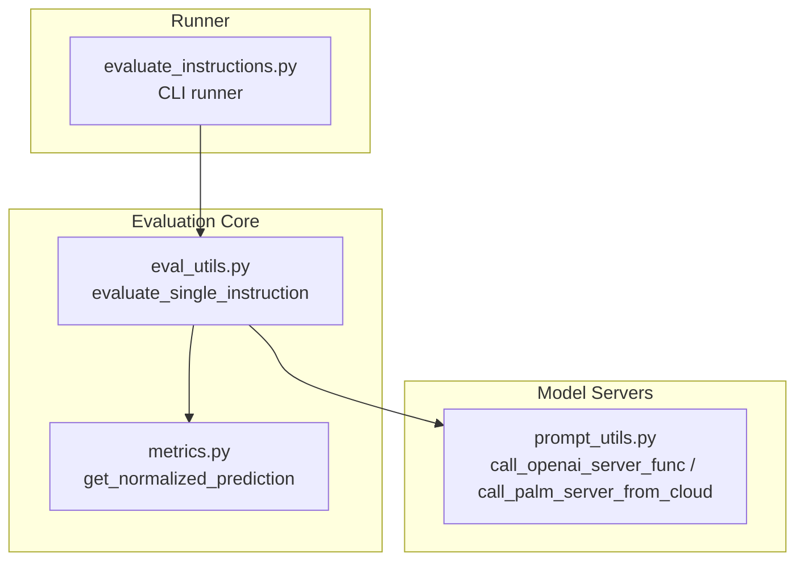
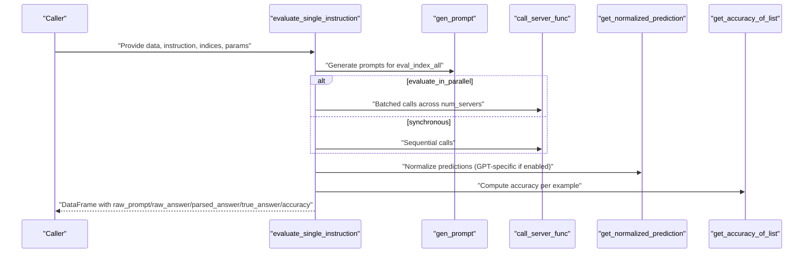
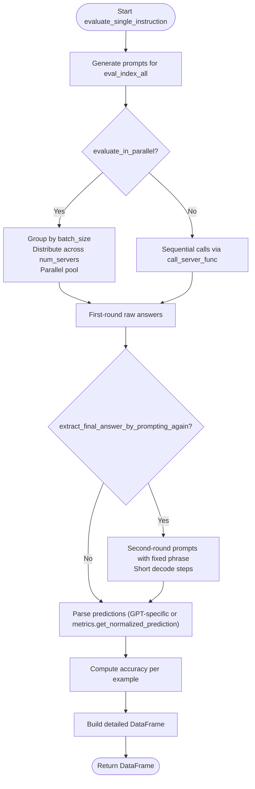
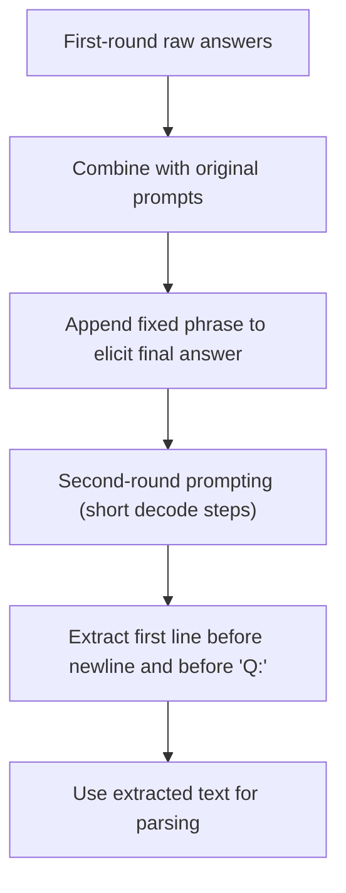
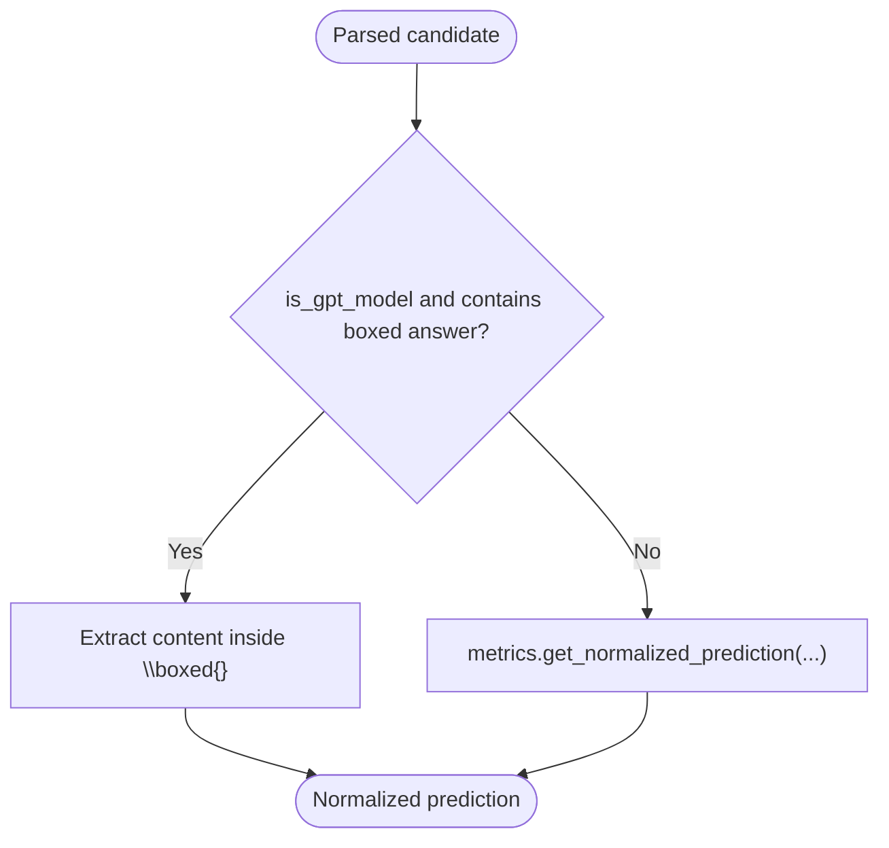
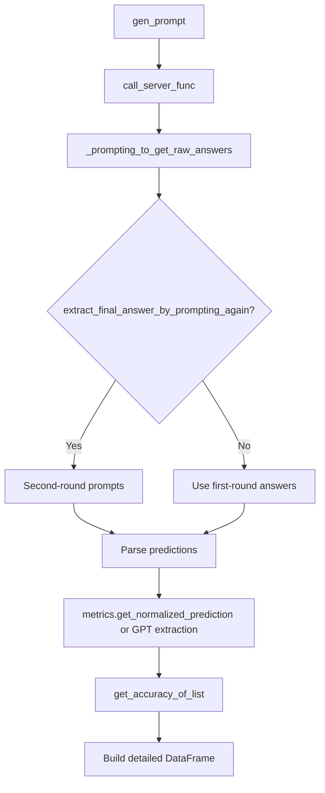
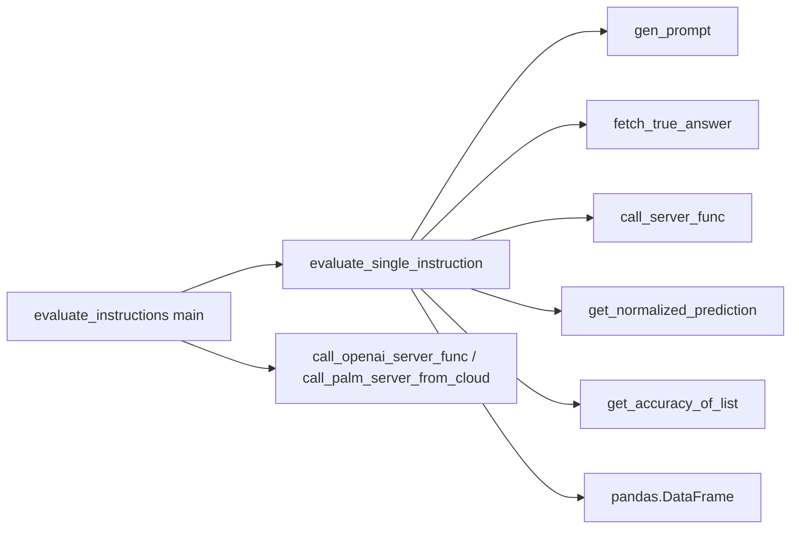

# Single Instruction Evaluation

<cite>
**Referenced Files in This Document**
- [eval_utils.py](file://opro/evaluation/eval_utils.py)
- [evaluate_instructions.py](file://opro/evaluation/evaluate_instructions.py)
- [prompt_utils.py](file://opro/prompt_utils.py)
- [metrics.py](file://opro/evaluation/metrics.py)
</cite>

## Table of Contents
1. [Introduction](#introduction)
2. [Project Structure](#project-structure)
3. [Core Components](#core-components)
4. [Architecture Overview](#architecture-overview)
5. [Detailed Component Analysis](#detailed-component-analysis)
6. [Dependency Analysis](#dependency-analysis)
7. [Performance Considerations](#performance-considerations)
8. [Troubleshooting Guide](#troubleshooting-guide)
9. [Conclusion](#conclusion)

## Introduction
This document explains the primary evaluation entry point for a single instruction: the evaluate_single_instruction function. It orchestrates prompt generation, model querying, optional second-round answer extraction, prediction normalization, and accuracy computation. It also documents all parameters, shows how to configure synchronous versus parallel evaluation, demonstrates second-round answer extraction, and highlights GPT-specific parsing behavior. Finally, it describes the end-to-end data flow from prompt creation to the resulting DataFrame and offers guidance on performance tuning and common issues.

## Project Structure
The evaluation pipeline spans several modules:
- opro/evaluation/eval_utils.py: Core evaluation orchestration, prompt generation, accuracy computation, and result packaging.
- opro/evaluation/evaluate_instructions.py: CLI-driven end-to-end evaluation runner that invokes evaluate_single_instruction for multiple datasets and tasks.
- opro/prompt_utils.py: Model-server adapters for OpenAI and Google Cloud models, including retry and timeout handling.
- opro/evaluation/metrics.py: Prediction normalization and accuracy helpers used during parsing and scoring.

**Diagram sources**
- [eval_utils.py](file://opro/evaluation/eval_utils.py#L536-L917)
- [evaluate_instructions.py](file://opro/evaluation/evaluate_instructions.py#L670-L766)
- [prompt_utils.py](file://opro/prompt_utils.py#L29-L146)
- [metrics.py](file://opro/evaluation/metrics.py#L188-L343)

**Section sources**
- [eval_utils.py](file://opro/evaluation/eval_utils.py#L536-L917)
- [evaluate_instructions.py](file://opro/evaluation/evaluate_instructions.py#L670-L766)
- [prompt_utils.py](file://opro/prompt_utils.py#L29-L146)
- [metrics.py](file://opro/evaluation/metrics.py#L188-L343)

## Core Components
- evaluate_single_instruction: The main function that:
  - Generates prompts for a subset of examples.
  - Queries the model server (optionally in parallel).
  - Optionally performs a second round of prompting to extract final answers.
  - Parses predictions (with GPT-specific handling).
  - Computes accuracy per example and returns a detailed DataFrame.
- Helper functions:
  - gen_prompt: Builds dataset-specific prompts with configurable instruction placement.
  - fetch_true_answer: Retrieves ground-truth answers for each example.
  - _prompting_to_get_raw_answers: Calls the server with retry and sleep logic.
  - get_accuracy_of_list/_get_accuracy: Computes correctness with multiple-choice and boolean handling.
  - get_normalized_prediction: Normalizes predictions for numeric/boolean/string comparisons.

**Section sources**
- [eval_utils.py](file://opro/evaluation/eval_utils.py#L164-L259)
- [eval_utils.py](file://opro/evaluation/eval_utils.py#L262-L286)
- [eval_utils.py](file://opro/evaluation/eval_utils.py#L338-L379)
- [eval_utils.py](file://opro/evaluation/eval_utils.py#L381-L497)
- [metrics.py](file://opro/evaluation/metrics.py#L188-L343)

## Architecture Overview
The evaluation flow is a pipeline from prompt generation to final accuracy and DataFrame output. It supports two modes:
- Synchronous: one prompt at a time.
- Parallel: batching and distributing requests across multiple servers using threads.

**Diagram sources**
- [eval_utils.py](file://opro/evaluation/eval_utils.py#L536-L917)
- [prompt_utils.py](file://opro/prompt_utils.py#L29-L146)
- [metrics.py](file://opro/evaluation/metrics.py#L188-L343)

## Detailed Component Analysis

### evaluate_single_instruction: Role and Responsibilities
- Purpose: Evaluate a single instruction on a subset of examples, returning a detailed per-example report.
- Inputs:
  - data: Dataset container (DataFrame/list/json depending on dataset).
  - instruction: Instruction string to embed in prompts.
  - eval_index_all: Indices of examples to evaluate.
  - batch_size: Batch size for model serving.
  - call_server_func: Function to call the inference server.
  - dataset_name: Dataset identifier (e.g., mmlu, bbh, gsm8k, multiarith, aqua).
  - num_servers: Number of servers to distribute batches across.
  - extract_final_answer_by_prompting_again: Whether to prompt a second time to extract final answer.
  - instruction_pos: Where to place the instruction in the prompt (before_Q, Q_begin, Q_end, A_begin).
  - is_multiple_choice: Boolean or list indicating multiple-choice per example.
  - include_qa: Whether to include Q:/A: markers in prompts.
  - evaluate_in_parallel: Whether to parallelize first-round prompting.
  - num_decodes: Number of decodes per example.
  - max_retry: Maximum retries for server calls.
  - sleep_time: Sleep seconds between retries.
  - prediction_treat_as_number: Treat predictions as numbers; supports "adaptive".
  - prediction_treat_as_bool: Treat predictions as booleans.
  - prediction_num_decimals: Decimal rounding for numeric predictions.
  - is_gpt_model: Whether the model is GPT (affects parsing).
  - verbose: Print progress.
- Output: A pandas DataFrame with columns:
  - index_in_raw_dataset
  - raw_prompt
  - raw_answer
  - parsed_answer
  - true_answer
  - accuracy
  - (optional) raw_prompt_second_round, raw_answer_second_round (when second-round extraction is enabled)

Key behaviors:
- Prompt generation: gen_prompt constructs dataset-specific prompts with instruction placement controlled by instruction_pos and include_qa.
- First-round prompting: Either sequential or parallel batching across num_servers.
- Second-round prompting: Optional; adds a fixed phrase to encourage final answer extraction and short decode steps.
- Parsing: If is_gpt_model is True, extracts boxed answers; otherwise delegates to get_normalized_prediction with treat_as_number/num_decimals/treat_as_bool.
- Accuracy: get_accuracy_of_list aggregates multiple decodes per example and applies dataset-specific correctness rules.

**Section sources**
- [eval_utils.py](file://opro/evaluation/eval_utils.py#L536-L917)

### Parameter Reference
- data: Dataset container (DataFrame/list/json).
- instruction: Instruction string.
- eval_index_all: Indices to evaluate.
- batch_size: Serving batch size.
- call_server_func: Function to call the model server.
- dataset_name: One of mmlu, bbh, gsm8k, multiarith, aqua.
- num_servers: Number of servers for parallel distribution.
- extract_final_answer_by_prompting_again: Enable second-round extraction.
- instruction_pos: One of before_Q, Q_begin, Q_end, A_begin.
- is_multiple_choice: Boolean or list of Booleans.
- include_qa: Include Q:/A: markers.
- evaluate_in_parallel: Parallelize first round.
- num_decodes: Number of decodes per example.
- max_retry: Retry attempts.
- sleep_time: Seconds to sleep between retries.
- prediction_treat_as_number: Treat as number or "adaptive".
- prediction_treat_as_bool: Treat as boolean.
- prediction_num_decimals: Decimal rounding for numbers.
- is_gpt_model: GPT-specific parsing.
- verbose: Progress logging.

**Section sources**
- [eval_utils.py](file://opro/evaluation/eval_utils.py#L536-L602)

### Synchronous vs. Parallel Evaluation
- Synchronous mode:
  - Evaluates prompts sequentially.
  - Uses call_server_func for each prompt.
  - Suitable for GPT models or when parallelism is not desired.
- Parallel mode:
  - Batches prompts by batch_size and distributes across num_servers.
  - Uses multithreading to call _prompting_to_get_raw_answers concurrently.
  - Improves throughput for batch-capable models.

**Diagram sources**
- [eval_utils.py](file://opro/evaluation/eval_utils.py#L646-L756)
- [eval_utils.py](file://opro/evaluation/eval_utils.py#L757-L863)

**Section sources**
- [eval_utils.py](file://opro/evaluation/eval_utils.py#L646-L756)
- [eval_utils.py](file://opro/evaluation/eval_utils.py#L757-L863)

### Second-Round Answer Extraction
- When enabled, the function:
  - Concatenates the first-round raw answer to the original prompt.
  - Appends a fixed phrase to encourage final answer extraction.
  - Issues a second round of prompts with shorter decode steps.
  - Extracts the final answer from the second-round output using a simple rule.
- This improves parsing reliability for models that produce long rationales before the final answer.

**Diagram sources**
- [eval_utils.py](file://opro/evaluation/eval_utils.py#L713-L748)
- [eval_utils.py](file://opro/evaluation/eval_utils.py#L769-L777)

**Section sources**
- [eval_utils.py](file://opro/evaluation/eval_utils.py#L713-L748)
- [eval_utils.py](file://opro/evaluation/eval_utils.py#L769-L777)

### GPT-Specific Parsing
- If is_gpt_model is True, the function checks for a boxed answer pattern and extracts the content inside the box.
- Otherwise, it delegates to metrics.get_normalized_prediction with treat_as_number, num_decimals, and treat_as_bool.

**Diagram sources**
- [eval_utils.py](file://opro/evaluation/eval_utils.py#L788-L800)
- [metrics.py](file://opro/evaluation/metrics.py#L188-L343)

**Section sources**
- [eval_utils.py](file://opro/evaluation/eval_utils.py#L788-L800)
- [metrics.py](file://opro/evaluation/metrics.py#L188-L343)

### Data Flow and Final Accuracy Calculation
- Prompt generation: gen_prompt builds dataset-specific prompts.
- Model querying: _prompting_to_get_raw_answers wraps call_server_func with retries and sleeps.
- Prediction parsing: _parse_prediction chooses GPT extraction or metrics normalization.
- Accuracy computation: get_accuracy_of_list aggregates multiple decodes per example and applies correctness rules (symbol/text/boolean).
- DataFrame construction: The function compiles index, prompts, raw answers, parsed answers, true answers, and accuracy into a structured DataFrame.

**Diagram sources**
- [eval_utils.py](file://opro/evaluation/eval_utils.py#L536-L917)
- [metrics.py](file://opro/evaluation/metrics.py#L188-L343)

**Section sources**
- [eval_utils.py](file://opro/evaluation/eval_utils.py#L536-L917)
- [metrics.py](file://opro/evaluation/metrics.py#L188-L343)

### Example Usage Patterns
- Synchronous evaluation:
  - Set evaluate_in_parallel=False.
  - Keep batch_size=1 and num_servers=1.
  - Use call_server_func that returns a list of outputs per prompt.
- Parallel evaluation:
  - Set evaluate_in_parallel=True.
  - Configure batch_size and num_servers according to model capacity.
  - Ensure call_server_func supports batching and returns per-batch outputs.
- Second-round extraction:
  - Set extract_final_answer_by_prompting_again=True.
  - Optionally adjust max_decode_steps for the second round.
- GPT-specific parsing:
  - Set is_gpt_model=True to enable boxed-answer extraction.
  - Optionally tune treat_as_number/treat_as_bool/num_decimals for numeric tasks.

These patterns are demonstrated in the CLI runner that calls evaluate_single_instruction for various datasets and tasks.

**Section sources**
- [evaluate_instructions.py](file://opro/evaluation/evaluate_instructions.py#L670-L766)
- [prompt_utils.py](file://opro/prompt_utils.py#L29-L146)

## Dependency Analysis
- evaluate_single_instruction depends on:
  - gen_prompt and fetch_true_answer for prompt construction and truth retrieval.
  - _prompting_to_get_raw_answers for robust server calls with retries.
  - metrics.get_normalized_prediction for normalization and accuracy computation.
  - pandas for DataFrame construction.
- The CLI runner composes model-server adapters (OpenAI or PaLM) and passes call_server_func to evaluate_single_instruction.

**Diagram sources**
- [eval_utils.py](file://opro/evaluation/eval_utils.py#L536-L917)
- [evaluate_instructions.py](file://opro/evaluation/evaluate_instructions.py#L670-L766)
- [prompt_utils.py](file://opro/prompt_utils.py#L29-L146)
- [metrics.py](file://opro/evaluation/metrics.py#L188-L343)

**Section sources**
- [eval_utils.py](file://opro/evaluation/eval_utils.py#L536-L917)
- [evaluate_instructions.py](file://opro/evaluation/evaluate_instructions.py#L670-L766)
- [prompt_utils.py](file://opro/prompt_utils.py#L29-L146)
- [metrics.py](file://opro/evaluation/metrics.py#L188-L343)

## Performance Considerations
- Batch size:
  - Larger batch_size reduces overhead but increases memory and latency per batch.
  - Tune to match model serving limits and server capacity.
- Parallelization:
  - evaluate_in_parallel=True with appropriate num_servers can improve throughput.
  - Ensure call_server_func supports batching; otherwise, parallelism may not help.
- Retries and sleep:
  - max_retry and sleep_time balance resilience against rate limits/timeouts.
  - Increase sleep_time cautiously to avoid long evaluation runs.
- Second-round extraction:
  - Short decode steps reduce cost and latency for the second round.
  - Only enable when needed; some models already yield clean final answers.
- GPT-specific parsing:
  - is_gpt_model=True enables boxed-answer extraction, reducing parsing ambiguity for GPT models.

[No sources needed since this section provides general guidance]

## Troubleshooting Guide
Common issues and remedies:
- API timeouts or rate limits:
  - The server adapters handle timeouts and rate limits with retries and sleeps. If failures persist, increase max_retry and sleep_time.
  - For OpenAI, the adapter retries on Timeout, RateLimitError, APIError, APIConnectionError, ServiceUnavailableError, and OS errors.
  - For PaLM, the adapter retries on exceptions with a fixed sleep interval.
- No output after retries:
  - _prompting_to_get_raw_answers asserts that outputs are non-empty after all retries. If this fails, inspect server availability and credentials.
- Parsing failures:
  - For numeric tasks, set prediction_treat_as_number=True and adjust prediction_num_decimals.
  - For boolean tasks, set prediction_treat_as_bool=True.
  - For GPT models, set is_gpt_model=True to enable boxed-answer extraction.
- Accuracy anomalies:
  - For multiple-choice, ensure is_multiple_choice aligns with the task.
  - For tasks with numeric answers, consider "adaptive" treatment of prediction_treat_as_number to match target types.

**Section sources**
- [prompt_utils.py](file://opro/prompt_utils.py#L29-L146)
- [eval_utils.py](file://opro/evaluation/eval_utils.py#L338-L379)
- [metrics.py](file://opro/evaluation/metrics.py#L188-L343)

## Conclusion
evaluate_single_instruction is the central orchestrator for single-instruction evaluation. It cleanly separates concerns across prompt generation, model querying, answer extraction, parsing, and accuracy computation. By tuning batch_size, parallelization, and parsing parameters—especially for GPT models—you can achieve robust, efficient evaluations across diverse datasets. The CLI runner demonstrates practical configurations for synchronous and parallel modes, second-round extraction, and GPT-specific parsing.