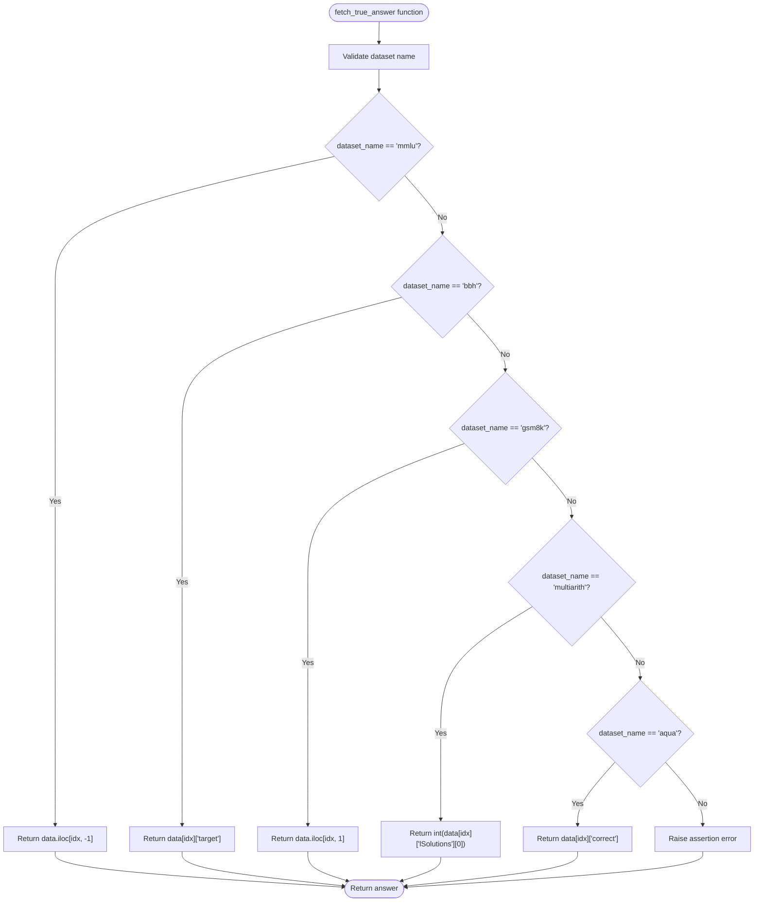
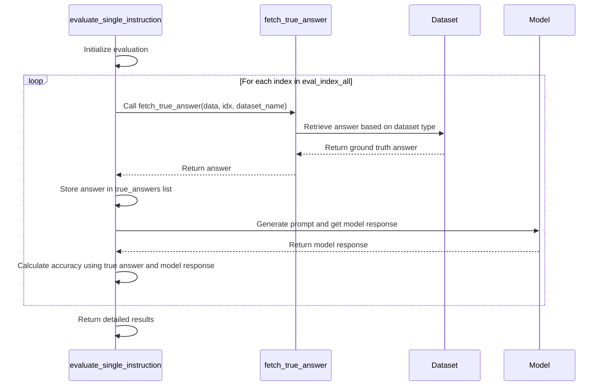

# True Answer Extraction

<cite>
**Referenced Files in This Document**   
- [eval_utils.py](file://opro/evaluation/eval_utils.py)
- [evaluate_instructions.py](file://opro/evaluation/evaluate_instructions.py)
- [MultiArith.json](file://data/MultiArith-data/MultiArith.json)
- [gsm_test.tsv](file://data/gsm_data/gsm_test.tsv)
- [AQuA.json](file://data/AQuA-data/AQuA.json)
</cite>

## Table of Contents
1. [Introduction](#introduction)
2. [Function Overview](#function-overview)
3. [Dataset-Specific Indexing Logic](#dataset-specific-indexing-logic)
4. [Parameter Details](#parameter-details)
5. [Code Examples](#code-examples)
6. [Integration with Evaluation Pipeline](#integration-with-evaluation-pipeline)
7. [Error Handling and Common Issues](#error-handling-and-common-issues)
8. [Performance Considerations](#performance-considerations)
9. [Conclusion](#conclusion)

## Introduction
The `fetch_true_answer` function in `opro/evaluation/eval_utils.py` serves as a critical component in the evaluation framework for benchmarking language models across multiple datasets. This function provides a unified interface for retrieving ground truth answers from diverse benchmark datasets, each with its own unique data structure and answer representation format. By implementing dataset-specific indexing logic, the function enables consistent answer extraction across MMLU, BBH, GSM8K, MultiArith, and AQuA benchmarks, facilitating cross-dataset evaluation and comparison of model performance.

**Section sources**
- [eval_utils.py](file://opro/evaluation/eval_utils.py#L262-L286)

## Function Overview
The `fetch_true_answer` function is designed to retrieve ground truth answers from various benchmark datasets using dataset-specific indexing logic. The function takes three parameters: `data` (the dataset object), `idx` (the example index), and `dataset_name` (a string identifying the dataset). It first validates that the provided dataset name is one of the supported datasets (MMLU, BBH, GSM8K, MultiArith, or AQuA) before applying the appropriate indexing strategy.

The function's primary purpose is to abstract the differences in data structure across various benchmarks, providing a consistent interface for answer retrieval. This abstraction is essential for the evaluation framework, as it allows the same evaluation pipeline to be applied across multiple datasets without modification. The function returns the ground truth answer in its native format (string, integer, or float), which is then used in the accuracy calculation process.



**Diagram sources**
- [eval_utils.py](file://opro/evaluation/eval_utils.py#L262-L286)

**Section sources**
- [eval_utils.py](file://opro/evaluation/eval_utils.py#L262-L286)

## Dataset-Specific Indexing Logic
The `fetch_true_answer` function implements distinct indexing strategies for each supported benchmark dataset, reflecting the unique structure of each dataset. These strategies are designed to extract the ground truth answer from the appropriate location within each dataset's data structure.

For the MMLU (Measuring Massive Multitask Language Understanding) dataset, the function retrieves the answer from the last column of the DataFrame using `data.iloc[idx, -1]`. This approach is consistent with the MMLU dataset structure, where each row represents a multiple-choice question with the answer options in the first columns and the correct answer (in ABCD format) in the final column.

In the BBH (BIG-Bench Hard) dataset, answers are stored in a dictionary format within a list, with the target answer accessible via the 'target' field. The function retrieves this using `data[idx]["target"]`, where each index corresponds to a specific task instance with its input and target fields.

For the GSM8K dataset, which contains grade school math problems, the function extracts the answer from the second column (index 1) of the DataFrame using `data.iloc[idx, 1]`. This reflects the dataset's structure where the first column contains the problem statement and the second column contains the numerical answer.

The MultiArith dataset, which contains arithmetic word problems, stores solutions in a JSON format with a 'lSolutions' field containing a list of solutions. The function retrieves the first solution using `int(data[idx]["lSolutions"][0])`, converting it to an integer for consistency.

Finally, for the AQuA (Algebra Question Answering) dataset, answers are stored in a JSON format with a 'correct' field indicating the correct multiple-choice option (A, B, C, D, or E). The function retrieves this using `data[idx]["correct"]`.

```mermaid
flowchart TD
subgraph MMLU["MMLU Dataset"]
MMLU_Input["Question: 'What is 2+2?'\nChoices: (A) 3 (B) 4 (C) 5 (D) 6"]
MMLU_Answer["Answer: 'B'"]
MMLU_Input --> MMLU_Answer
end
subgraph BBH["BBH Dataset"]
BBH_Input["Input: 'Is the following sentence syntactically correct? \"Colorless green ideas sleep furiously.\"'"]
BBH_Answer["Target: 'yes'"]
BBH_Input --> BBH_Answer
end
subgraph GSM8K["GSM8K Dataset"]
GSM8K_Input["Problem: 'Janet's ducks lay 16 eggs per day. She eats three for breakfast every morning and bakes muffins for her friends every day with four. She sells the remainder at the farmers' market daily for $2 per fresh duck egg. How much in dollars does she make every day at the farmers' market?'"]
GSM8K_Answer["Answer: 18"]
GSM8K_Input --> GSM8K_Answer
end
subgraph MultiArith["MultiArith Dataset"]
MultiArith_Input["Question: 'For Halloween Debby and her sister combined the candy they received. Debby had 32 pieces of candy while her sister had 42. If they ate 35 pieces the first night, how many pieces do they have left?'"]
MultiArith_Answer["Solution: 39.0"]
MultiArith_Input --> MultiArith_Answer
end
subgraph AQuA["AQuA Dataset"]
AQuA_Input["Question: 'A car is being driven, in a straight line and at a uniform speed, towards the base of a vertical tower. The top of the tower is observed from the car and, in the process, it takes 10 minutes for the angle of elevation to change from 45° to 60°. After how much more time will this car reach the base of the tower?'"]
AQuA_Options["Options: A)5(√3 + 1) B)6(√3 + √2) C)7(√3 – 1) D)8(√3 – 2) E)None of these"]
AQuA_Answer["Correct: A"]
AQuA_Input --> AQuA_Options
AQuA_Options --> AQuA_Answer
end
style MMLU fill:#f9f,stroke:#333
style BBH fill:#bbf,stroke:#333
style GSM8K fill:#f96,stroke:#333
style MultiArith fill:#6f9,stroke:#333
style AQuA fill:#69f,stroke:#333
```

**Diagram sources**
- [eval_utils.py](file://opro/evaluation/eval_utils.py#L275-L285)
- [gsm_test.tsv](file://data/gsm_data/gsm_test.tsv)
- [MultiArith.json](file://data/MultiArith-data/MultiArith.json)
- [AQuA.json](file://data/AQuA-data/AQuA.json)

**Section sources**
- [eval_utils.py](file://opro/evaluation/eval_utils.py#L275-L285)

## Parameter Details
The `fetch_true_answer` function accepts three parameters that define its behavior and operation:

**data**: This parameter represents the dataset object from which the ground truth answer will be retrieved. The type and structure of this parameter vary depending on the dataset:
- For MMLU and GSM8K datasets, it is a pandas DataFrame
- For BBH and AQuA datasets, it is a list of dictionaries
- For MultiArith dataset, it is a list of JSON objects

The function is designed to handle these different data structures transparently, providing a consistent interface regardless of the underlying data format.

**idx**: This integer parameter specifies the index of the example from which to retrieve the answer. It represents the position of the specific question or problem within the dataset. The function uses this index to access the corresponding row in a DataFrame or the corresponding element in a list.

**dataset_name**: This string parameter identifies which benchmark dataset is being used. The function converts this parameter to lowercase and validates that it is one of the supported datasets: "mmlu", "bbh", "gsm8k", "multiarith", or "aqua". This parameter determines which indexing strategy will be applied to retrieve the answer.

The function includes validation to ensure that only supported datasets are processed, raising an assertion error if an unsupported dataset name is provided. This validation helps prevent errors and ensures that the function operates correctly within the evaluation framework.

```mermaid
classDiagram
class fetch_true_answer {
+data : DataFrame or List
+idx : int
+dataset_name : str
+return : str or int or float
+fetch_true_answer(data, idx, dataset_name)
}
note right of fetch_true_answer
Parameters :
- data : Dataset object (DataFrame or List)
- idx : Example index (integer)
- dataset_name : Dataset identifier (string)
Returns :
- Ground truth answer in native format
end
```

**Diagram sources**
- [eval_utils.py](file://opro/evaluation/eval_utils.py#L262-L286)

**Section sources**
- [eval_utils.py](file://opro/evaluation/eval_utils.py#L262-L286)

## Code Examples
The following examples demonstrate how to use the `fetch_true_answer` function with different datasets:

**MMLU Example**:
```python
# Load MMLU test data
import pandas as pd
mmlu_data = pd.read_csv("data/MMLU-data/test/abstract_algebra_test.csv", header=None)
# Retrieve answer for first example
answer = fetch_true_answer(mmlu_data, 0, "mmlu")
# Returns the answer from the last column of the first row
```

**BBH Example**:
```python
# Load BBH task data
bbh_data = load_bbh_task_data("boolean_expressions")
# Retrieve answer for first example
answer = fetch_true_answer(bbh_data, 0, "bbh")
# Returns the value of the 'target' field from the first dictionary
```

**GSM8K Example**:
```python
# Load GSM8K test data
gsm_data = pd.read_csv("data/gsm_data/gsm_test.tsv", sep="\t", header=None)
# Retrieve answer for first example
answer = fetch_true_answer(gsm_data, 0, "gsm8k")
# Returns the value from the second column of the first row
```

**MultiArith Example**:
```python
# Load MultiArith data
import json
with open("data/MultiArith-data/MultiArith.json", "r") as f:
    multiarith_data = json.load(f)
# Retrieve answer for first example
answer = fetch_true_answer(multiarith_data, 0, "multiarith")
# Returns the first solution as an integer
```

**AQuA Example**:
```python
# Load AQuA data
aqua_data = read_jsonl("data/AQuA-data/AQuA.json")
# Retrieve answer for first example
answer = fetch_true_answer(aqua_data, 0, "aqua")
# Returns the value of the 'correct' field from the first dictionary
```

These examples illustrate the consistent interface provided by the `fetch_true_answer` function, despite the different data structures and answer formats used by each benchmark dataset.

**Section sources**
- [eval_utils.py](file://opro/evaluation/eval_utils.py#L262-L286)
- [evaluate_instructions.py](file://opro/evaluation/evaluate_instructions.py#L555-L557)

## Integration with Evaluation Pipeline
The `fetch_true_answer` function is a critical component of the evaluation pipeline, specifically integrated with the `evaluate_single_instruction` function. This integration enables consistent answer extraction across multiple datasets, facilitating cross-dataset evaluation of language model performance.

In the evaluation pipeline, the `evaluate_single_instruction` function processes a batch of examples from a specified dataset. For each example, it first generates a prompt using the `gen_prompt` function, then sends the prompt to the language model to obtain a response. The model's response is then compared to the ground truth answer retrieved by `fetch_true_answer`.

The integration occurs in the following steps:
1. The evaluation function iterates through the specified indices (`eval_index_all`)
2. For each index, it calls `fetch_true_answer` to retrieve the ground truth answer
3. The retrieved answers are stored in a list (`true_answers`)
4. These answers are later used to calculate accuracy metrics by comparing them with the model's predictions

This design enables the evaluation framework to handle multiple datasets with different data structures and answer formats through a unified interface. The consistent answer extraction provided by `fetch_true_answer` ensures that accuracy calculations are performed correctly regardless of the dataset being evaluated.



**Diagram sources**
- [eval_utils.py](file://opro/evaluation/eval_utils.py#L628-L631)
- [evaluate_instructions.py](file://opro/evaluation/evaluate_instructions.py#L536-L557)

**Section sources**
- [evaluate_instructions.py](file://opro/evaluation/evaluate_instructions.py#L536-L557)

## Error Handling and Common Issues
The `fetch_true_answer` function includes several error handling mechanisms to ensure robust operation:

**Dataset Validation**: The function validates that the provided `dataset_name` is one of the supported datasets ("mmlu", "bbh", "gsm8k", "multiarith", or "aqua"). If an unsupported dataset name is provided, the function raises an assertion error with a descriptive message.

**Index Validation**: While the function does not explicitly validate the `idx` parameter, improper indexing will result in standard Python exceptions (IndexError for DataFrames, KeyError for dictionaries). These exceptions are typically handled by the calling function in the evaluation pipeline.

**Data Structure Assumptions**: The function assumes that the input data has the expected structure for each dataset type. For example, it assumes that MMLU and GSM8K data are provided as pandas DataFrames, while BBH, AQuA, and MultiArith data are provided as lists of dictionaries or JSON objects.

Common issues that may arise when using this function include:

**Index Out of Bounds**: This occurs when the provided `idx` exceeds the size of the dataset. This can be prevented by ensuring that the index is within the valid range for the dataset.

**Missing Target Fields**: In BBH and AQuA datasets, if the 'target' or 'correct' fields are missing from the data, a KeyError will be raised. This can occur if the data is corrupted or improperly formatted.

**Type Conversion Errors**: In the MultiArith dataset, the function attempts to convert the solution to an integer. If the solution cannot be converted (e.g., if it's a string that doesn't represent a number), a ValueError will be raised.

To mitigate these issues, the evaluation framework typically includes data validation and error handling at higher levels, ensuring that the data is properly formatted before being passed to `fetch_true_answer`.

**Section sources**
- [eval_utils.py](file://opro/evaluation/eval_utils.py#L264-L274)

## Performance Considerations
The `fetch_true_answer` function is designed for efficiency in large-scale evaluation scenarios. Its performance characteristics are optimized for the typical use case of evaluating language models across multiple datasets.

**Time Complexity**: The function has O(1) time complexity for all supported datasets, as it performs a single indexing operation to retrieve the answer. This constant time complexity ensures that the function scales well with the number of examples being evaluated.

**Memory Efficiency**: The function does not create additional data structures or store intermediate results, making it memory efficient. It simply retrieves a reference to the answer value from the existing data structure.

**Caching Considerations**: Since the function is typically called repeatedly during evaluation, caching the results of `fetch_true_answer` calls could provide performance benefits in scenarios where the same examples are evaluated multiple times. However, the current implementation does not include caching, as the overhead of the indexing operations is minimal.

**Parallel Processing**: The evaluation framework supports parallel processing through the `evaluate_in_parallel` parameter in `evaluate_single_instruction`. When enabled, multiple instances of `fetch_true_answer` can be executed concurrently, taking advantage of multi-core processors to speed up the evaluation process.

**I/O Optimization**: For datasets stored in files, the evaluation framework typically loads the entire dataset into memory before evaluation begins. This minimizes I/O operations during the evaluation process, allowing `fetch_true_answer` to operate on in-memory data structures for maximum performance.

These performance characteristics make the `fetch_true_answer` function well-suited for large-scale evaluation of language models across multiple benchmark datasets.

**Section sources**
- [eval_utils.py](file://opro/evaluation/eval_utils.py#L262-L286)

## Conclusion
The `fetch_true_answer` function plays a crucial role in the OPRO evaluation framework by providing a unified interface for retrieving ground truth answers from diverse benchmark datasets. By implementing dataset-specific indexing logic for MMLU, BBH, GSM8K, MultiArith, and AQuA datasets, the function enables consistent answer extraction across different data structures and formats.

This abstraction is essential for cross-dataset evaluation, allowing researchers to compare model performance across multiple benchmarks using a standardized evaluation pipeline. The function's design prioritizes both correctness and performance, with O(1) time complexity and minimal memory overhead, making it suitable for large-scale evaluation scenarios.

The integration of `fetch_true_answer` with the broader evaluation framework, particularly the `evaluate_single_instruction` function, demonstrates a well-structured approach to benchmarking language models. By separating the concerns of answer retrieval and accuracy calculation, the framework maintains modularity and flexibility while ensuring consistent evaluation across datasets.

As language model evaluation continues to evolve, functions like `fetch_true_answer` will remain critical components of robust evaluation frameworks, enabling fair and comprehensive assessment of model capabilities across diverse tasks and domains.

**Section sources**
- [eval_utils.py](file://opro/evaluation/eval_utils.py#L262-L286)
- [evaluate_instructions.py](file://opro/evaluation/evaluate_instructions.py#L536-L557)