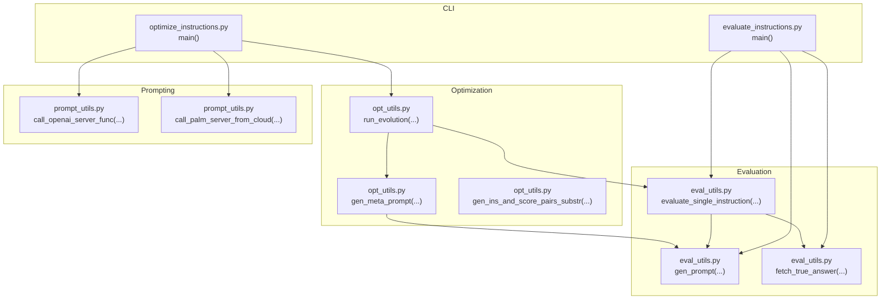
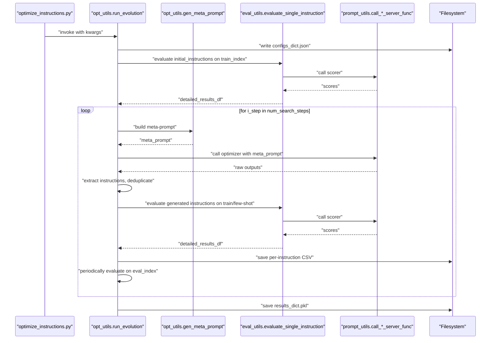
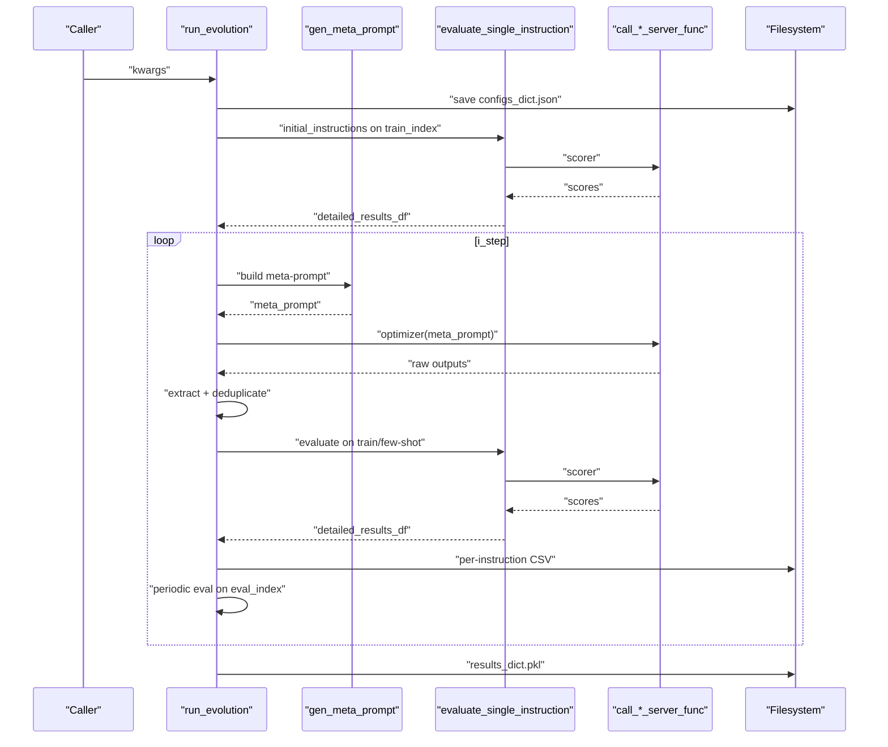
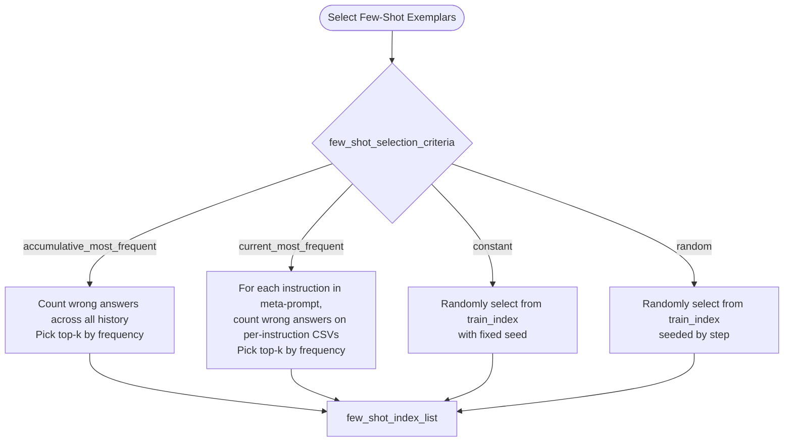
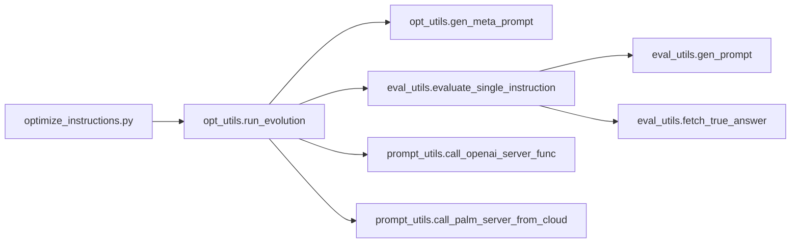

# Evolution Workflow Orchestration

<cite>
**Referenced Files in This Document**
- [README.md](file://README.md)
- [opt_utils.py](file://opro/optimization/opt_utils.py)
- [optimize_instructions.py](file://opro/optimization/optimize_instructions.py)
- [eval_utils.py](file://opro/evaluation/eval_utils.py)
- [evaluate_instructions.py](file://opro/evaluation/evaluate_instructions.py)
- [prompt_utils.py](file://opro/prompt_utils.py)
</cite>

## Table of Contents
1. [Introduction](#introduction)
2. [Project Structure](#project-structure)
3. [Core Components](#core-components)
4. [Architecture Overview](#architecture-overview)
5. [Detailed Component Analysis](#detailed-component-analysis)
6. [Dependency Analysis](#dependency-analysis)
7. [Performance Considerations](#performance-considerations)
8. [Troubleshooting Guide](#troubleshooting-guide)
9. [Conclusion](#conclusion)
10. [Appendices](#appendices)

## Introduction
This document provides comprehensive API documentation for the run_evolution function, the core orchestration engine for iterative prompt optimization. It explains all 49 kwargs parameters, the end-to-end workflow (initialization, configuration validation, initial instruction evaluation, iterative optimization loop, meta-prompt generation, instruction generation, deduplication, evaluation), and internal data structures. It also covers usage examples for MMLU, BBH, and GSM8K, error handling, performance considerations, and integration patterns with external systems.

## Project Structure
The evolution workflow spans several modules:
- Optimization orchestration: run_evolution and helper utilities
- Evaluation utilities: prompt construction, scoring, and parallel evaluation
- CLI entry points: end-to-end scripts for optimization and evaluation
- Prompting utilities: wrappers for OpenAI and Google Cloud model APIs

**Diagram sources**
- [opt_utils.py](file://opro/optimization/opt_utils.py#L338-L1036)
- [eval_utils.py](file://opro/evaluation/eval_utils.py#L164-L917)
- [optimize_instructions.py](file://opro/optimization/optimize_instructions.py#L1-L800)
- [evaluate_instructions.py](file://opro/evaluation/evaluate_instructions.py#L1-L770)
- [prompt_utils.py](file://opro/prompt_utils.py#L1-L146)

**Section sources**
- [README.md](file://README.md#L1-L79)
- [opt_utils.py](file://opro/optimization/opt_utils.py#L338-L1036)
- [eval_utils.py](file://opro/evaluation/eval_utils.py#L164-L917)
- [optimize_instructions.py](file://opro/optimization/optimize_instructions.py#L1-L800)
- [evaluate_instructions.py](file://opro/evaluation/evaluate_instructions.py#L1-L770)
- [prompt_utils.py](file://opro/prompt_utils.py#L1-L146)

## Core Components
- run_evolution: orchestrates the full evolutionary process, including initialization, meta-prompt generation, instruction generation, deduplication, evaluation, and persistence.
- gen_meta_prompt: constructs the meta-prompt for the optimizer, optionally including previous instructions and few-shot exemplars.
- evaluate_single_instruction: evaluates a single instruction on selected dataset indices, with optional parallelism and answer extraction strategies.
- CLI entry points: optimize_instructions.py and evaluate_instructions.py demonstrate usage and configuration.

Key responsibilities:
- Parameter validation and defaults
- Dataset splitting and indexing
- Temperature scheduling
- Few-shot exemplar selection strategies
- Deduplication and caching
- Persistence of intermediate and final results

**Section sources**
- [opt_utils.py](file://opro/optimization/opt_utils.py#L338-L1036)
- [eval_utils.py](file://opro/evaluation/eval_utils.py#L536-L917)
- [optimize_instructions.py](file://opro/optimization/optimize_instructions.py#L1-L800)
- [evaluate_instructions.py](file://opro/evaluation/evaluate_instructions.py#L1-L770)

## Architecture Overview
The run_evolution function coordinates:
- Initialization: loads datasets, splits indices, initializes counters and dictionaries.
- Iterative loop: generates meta-prompts, asks the optimizer for new instructions, filters and deduplicates, evaluates on training/few-shot sets, records metrics, and periodically evaluates on held-out validation.
- Persistence: saves configurations, results, and per-instruction CSVs.

**Diagram sources**
- [opt_utils.py](file://opro/optimization/opt_utils.py#L338-L1036)
- [eval_utils.py](file://opro/evaluation/eval_utils.py#L536-L917)
- [optimize_instructions.py](file://opro/optimization/optimize_instructions.py#L736-L800)
- [prompt_utils.py](file://opro/prompt_utils.py#L95-L146)

## Detailed Component Analysis

### run_evolution API Reference
The function accepts the following kwargs. Descriptions are grouped by functional areas.

- Optimization horizon and iteration control
  - num_search_steps: integer number of evolutionary steps to run.
  - eval_interval: integer interval (in steps) for periodic evaluation on the validation set.
  - num_generated_instructions_in_each_step: integer number of candidate instructions to generate per step; influences how many decodes are requested from the optimizer.

- Model configurations
  - scorer_llm_dict: dict containing model_type, temperature, batch_size, num_servers, max_decode_steps, and optionally num_decodes. Used to configure the scorer (evaluation) model.
  - optimizer_llm_dict: dict containing model_type, temperature, batch_size, num_servers, max_decode_steps, and optionally num_decodes. Used to configure the optimizer (instruction generation) model.
  - call_scorer_server_func: callable that invokes the scorer model with appropriate parameters.
  - call_optimizer_server_func: callable that invokes the optimizer model with appropriate parameters.

- Temperature scheduling
  - optimizer_llm_temperature: float baseline temperature for the optimizer.
  - optimizer_llm_temperature_schedule: string, either "constant" or "linear_increase".
  - optimizer_llm_temperature_end: float end temperature for linear schedule (ignored if schedule is "constant").

- Dataset management and indexing
  - dataset_name: string among {"mmlu","bbh","gsm8k"}.
  - tasks_all: list of task identifiers (e.g., ("test","subject_test.csv") for MMLU).
  - num_examples: integer total number of examples in the combined dataset.
  - root_data_folder_path: string path to the data directory.
  - train_ratio/eval_ratio/test_ratio: floats summing to at most 1; train_index and eval_index are derived internally.
  - train_index/eval_index: arrays of indices for training and evaluation.

- Instruction lifecycle
  - initial_instructions: list of seed instructions to evaluate first.
  - instruction_pos: string among {"before_Q","Q_begin","Q_end","A_begin"} controlling where the instruction appears in prompts.
  - multiple_choice_tasks: set of task names considered multiple-choice; used to set is_multiple_choice flags during evaluation.

- Evaluation controls
  - extract_final_answer_by_prompting_again: boolean; if True, performs a second round of prompting to extract final answers.
  - include_qa: boolean; whether to include "Q:" and "A:" markers in prompts.
  - evaluate_in_parallel: boolean; enables multithreading for evaluation batches.
  - prediction_treat_as_number/prediction_treat_as_bool/prediction_num_decimals: flags controlling normalization of predictions for numeric/boolean tasks.
  - is_gpt_model: boolean flag used when parsing GPT-style boxed answers.

- Few-shot selection and meta-prompt composition
  - few_shot_qa_pairs: boolean; whether to include few-shot exemplars in the meta-prompt.
  - few_shot_selection_criteria: string among {"accumulative_most_frequent","current_most_frequent","constant","random"}.
  - num_few_shot_questions_for_instruction_refinement: integer number of exemplars to select per step.
  - evaluate_generated_ins_on_few_shot / evaluate_old_ins_on_few_shot: booleans to enable per-step evaluation on few-shot exemplars for generated and old instructions respectively.
  - meta_prompt_type: string among {"both_instructions_and_exemplars","instructions_only"}.
  - meta_prompt_instructions_before_exemplars: boolean controlling order of instruction-score pairs vs exemplars.
  - num_score_buckets: integer or np.inf; bins continuous scores for display in meta-prompts.
  - old_instruction_score_threshold: float threshold for including old instructions in meta-prompts.

- Persistence and logging
  - save_folder: string path to the output directory.
  - result_by_instruction_folder: string path to per-instruction CSV storage.
  - verbose: boolean enabling additional console logs.

Internal data structures maintained by run_evolution:
- old_instructions_and_scores: list of tuples (instruction, score, step_index) for newly accepted instructions.
- old_instructions_and_scores_raw: list of tuples including skipped instructions with NaN scores.
- meta_prompts: list of tuples (meta_prompt, step_index) for inspection/debugging.
- instruction_score_dict: dict mapping instruction to its latest score.
- detailed_results_df_by_instruction_dict: dict mapping instruction to its detailed evaluation DataFrame.
- generated_ins_on_few_shot_results_dict / old_ins_on_few_shot_results_dict: dicts keyed by step index storing per-instruction evaluation results on few-shot exemplars.
- few_shot_index_list_by_step_dict: dict mapping step index to the selected few-shot indices.
- eval_detailed_results_df_dict / instruction_eval_score_dict: dicts for periodic validation evaluation.
- wrong_questions_from_start_counter: Counter tracking which training examples were answered incorrectly by any instruction seen so far.

Workflow highlights:
- Initial instruction evaluation: runs evaluate_single_instruction on initial_instructions using train_index.
- Iterative loop:
  - Select few-shot exemplars according to criteria.
  - Build meta-prompt via gen_meta_prompt.
  - Call optimizer to generate instructions.
  - Post-process outputs to extract instructions, deduplicate, and filter.
  - Evaluate generated instructions on training and optionally on few-shot exemplars.
  - Periodically evaluate on eval_index and record eval_results.
- Persistence: write configs_dict.json, per-instruction CSVs, and results_dict.pkl.

Advanced usage:
- Custom few-shot selection:
  - accumulative_most_frequent: selects exemplars most frequently misclassified across all history.
  - current_most_frequent: selects exemplars most frequently misclassified by current meta-prompt instructions.
  - constant/random: fixed or randomized selection.
- Temperature scheduling:
  - constant: uses optimizer_llm_temperature throughout.
  - linear_increase: linearly interpolates from optimizer_llm_temperature to optimizer_llm_temperature_end over num_search_steps.

Side effects:
- Writes JSON configuration file to save_folder/configs_dict.json.
- Writes per-instruction CSV files to result_by_instruction_folder.
- Writes pickled results_dict.pkl to save_folder.

**Section sources**
- [opt_utils.py](file://opro/optimization/opt_utils.py#L338-L1036)
- [eval_utils.py](file://opro/evaluation/eval_utils.py#L536-L917)

### Internal Data Structures and Complexity
- old_instructions_and_scores: grows with accepted instructions; append operations are O(1); sorting for meta-prompts is O(n log n) per step.
- instruction_score_dict: hash map for O(1) average-time updates and lookups.
- wrong_questions_from_start_counter: Counter for O(1) increments; used to select exemplars in accumulative_most_frequent.
- few_shot_index_list_by_step_dict: O(1) per-step insertion; memory scales with num_search_steps.
- eval_detailed_results_df_dict/instruction_eval_score_dict: O(1) per instruction per eval_interval steps.

Complexity considerations:
- Few-shot selection: O(n) for current_most_frequent per step due to reading per-instruction CSVs and counting.
- Parallel evaluation: multithreading reduces wall-clock time; overhead depends on batch_size and num_servers.

**Section sources**
- [opt_utils.py](file://opro/optimization/opt_utils.py#L338-L1036)

### API Workflow Sequence

**Diagram sources**
- [opt_utils.py](file://opro/optimization/opt_utils.py#L338-L1036)
- [eval_utils.py](file://opro/evaluation/eval_utils.py#L536-L917)
- [prompt_utils.py](file://opro/prompt_utils.py#L95-L146)

### Few-Shot Selection Strategies

**Diagram sources**
- [opt_utils.py](file://opro/optimization/opt_utils.py#L586-L720)

## Dependency Analysis
- run_evolution depends on:
  - gen_meta_prompt for constructing optimizer prompts.
  - evaluate_single_instruction for scoring instructions.
  - prompt_utils for invoking external model APIs.
- CLI scripts provide concrete configurations and demonstrate usage patterns.

**Diagram sources**
- [optimize_instructions.py](file://opro/optimization/optimize_instructions.py#L736-L800)
- [opt_utils.py](file://opro/optimization/opt_utils.py#L338-L1036)
- [eval_utils.py](file://opro/evaluation/eval_utils.py#L164-L917)
- [prompt_utils.py](file://opro/prompt_utils.py#L95-L146)

**Section sources**
- [optimize_instructions.py](file://opro/optimization/optimize_instructions.py#L1-L800)
- [opt_utils.py](file://opro/optimization/opt_utils.py#L338-L1036)
- [eval_utils.py](file://opro/evaluation/eval_utils.py#L164-L917)
- [prompt_utils.py](file://opro/prompt_utils.py#L1-L146)

## Performance Considerations
- Parallel evaluation:
  - evaluate_in_parallel=True leverages multithreading to reduce latency when batch_size and num_servers are configured appropriately.
  - For GPT models, evaluate_in_parallel should be False to avoid concurrency issues with streaming or rate limits.
- Batch sizing:
  - batch_size in scorer_llm_dict controls chunking of evaluation requests.
  - num_servers determines how many concurrent threads are used for batching.
- Few-shot selection:
  - current_most_frequent reads per-instruction CSVs; consider caching or limiting eval_interval to reduce overhead.
- Temperature scheduling:
  - linear_increase increases exploration early; tune optimizer_llm_temperature_end to balance diversity and stability.
- Early stopping:
  - old_instruction_score_threshold can prune low-quality instructions from meta-prompts to reduce noise.

[No sources needed since this section provides general guidance]

## Troubleshooting Guide
Common issues and remedies:
- Invalid dataset or instruction position:
  - Ensure dataset_name is one of {"mmlu","bbh","gsm8k"} and instruction_pos is one of {"before_Q","Q_begin","Q_end","A_begin"}.
- API key errors:
  - For OpenAI models, provide openai_api_key; for Google Cloud models, provide palm_api_key.
- Model availability:
  - prompt_utils raises ImportError if google.generativeai is unavailable; use OpenAI models or fix environment.
- Evaluation failures:
  - evaluate_single_instruction retries on transient errors; adjust max_retry and sleep_time if needed.
- Extremely long instructions:
  - run_evolution skips instructions exceeding a length threshold; trim or refine optimizer prompts/meta-prompt.
- Numeric/boolean parsing:
  - prediction_treat_as_number and prediction_treat_as_bool influence normalization; set appropriately for dataset types.

**Section sources**
- [opt_utils.py](file://opro/optimization/opt_utils.py#L338-L1036)
- [eval_utils.py](file://opro/evaluation/eval_utils.py#L536-L917)
- [prompt_utils.py](file://opro/prompt_utils.py#L1-L146)

## Conclusion
The run_evolution function provides a robust, configurable framework for iterative prompt optimization. By combining meta-prompt engineering, controlled instruction generation, deduplication, and periodic evaluation, it systematically improves instruction quality across benchmarks. Proper configuration of model parameters, dataset splits, and few-shot strategies yields strong performance gains with manageable computational costs.

[No sources needed since this section summarizes without analyzing specific files]

## Appendices

### Usage Examples

- MMLU STEM optimization
  - Configure dataset_name="mmlu", task_name="STEM", instruction_pos="Q_begin".
  - Use initial_instructions with seed prompts.
  - Set num_search_steps and eval_interval based on budget.
  - Example invocation path: [optimize_instructions.py](file://opro/optimization/optimize_instructions.py#L736-L800)

- BBH optimization
  - Configure dataset_name="bbh", task_name="logical_deduction_five_objects", instruction_pos="A_begin".
  - Enable few_shot_qa_pairs and set few_shot_selection_criteria to "current_most_frequent" for dynamic focus.
  - Example invocation path: [optimize_instructions.py](file://opro/optimization/optimize_instructions.py#L736-L800)

- GSM8K optimization
  - Configure dataset_name="gsm8k", task_name="train", instruction_pos="Q_end".
  - Set prediction_treat_as_number=True and adjust num_few_shot_questions_for_instruction_refinement.
  - Example invocation path: [optimize_instructions.py](file://opro/optimization/optimize_instructions.py#L736-L800)

- Evaluation of existing instructions
  - Use evaluate_instructions.py to score curated instructions on training/test folds.
  - Example invocation path: [evaluate_instructions.py](file://opro/evaluation/evaluate_instructions.py#L1-L770)

**Section sources**
- [optimize_instructions.py](file://opro/optimization/optimize_instructions.py#L1-L800)
- [evaluate_instructions.py](file://opro/evaluation/evaluate_instructions.py#L1-L770)