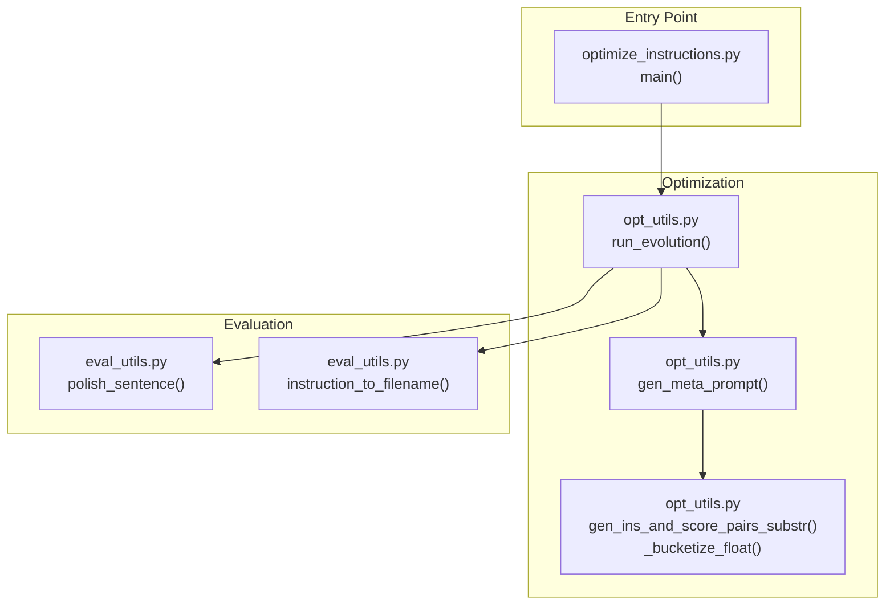
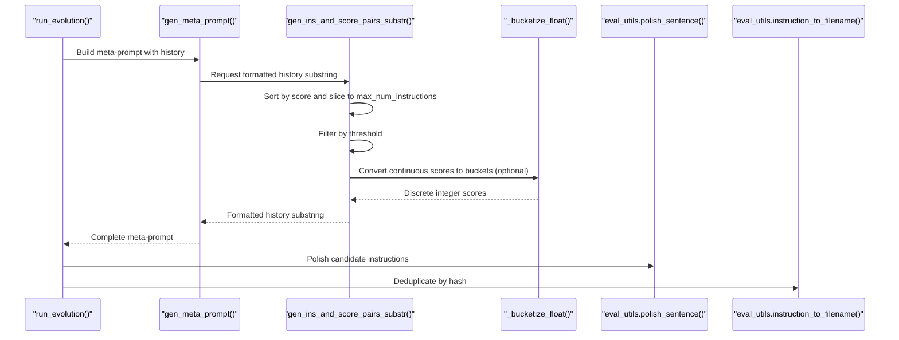
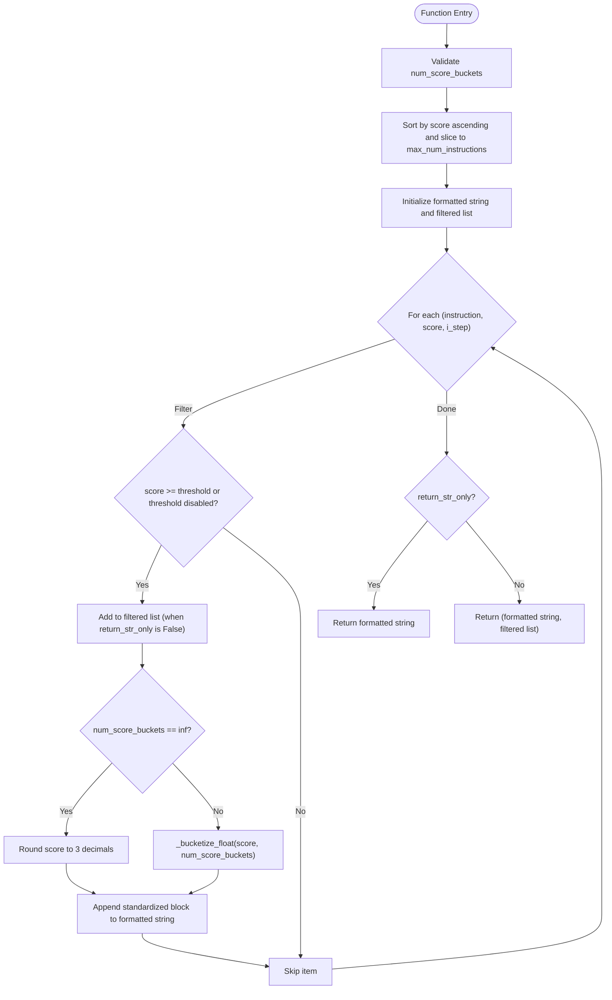
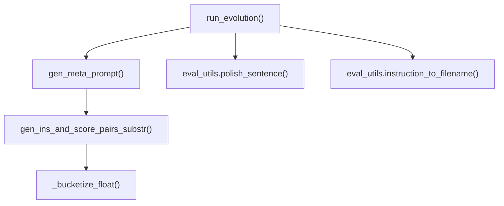

# Instruction-Score Pair Management

<cite>
**Referenced Files in This Document**
- [opt_utils.py](file://opro/optimization/opt_utils.py)
- [optimize_instructions.py](file://opro/optimization/opt_utils.py)
- [eval_utils.py](file://opro/evaluation/eval_utils.py)
</cite>

## Table of Contents
1. [Introduction](#introduction)
2. [Project Structure](#project-structure)
3. [Core Components](#core-components)
4. [Architecture Overview](#architecture-overview)
5. [Detailed Component Analysis](#detailed-component-analysis)
6. [Dependency Analysis](#dependency-analysis)
7. [Performance Considerations](#performance-considerations)
8. [Troubleshooting Guide](#troubleshooting-guide)
9. [Conclusion](#conclusion)

## Introduction
This document explains the purpose and behavior of the gen_ins_and_score_pairs_substr function, which formats historical instruction-performance data for inclusion in meta-prompts. It covers parameters, sorting and filtering logic, score discretization via bucketization, and the standardized text format used across the system. It also describes how this function integrates with gen_meta_prompt and run_evolution, and how score bucketing influences optimizer LLM interpretation.

## Project Structure
The function resides in the optimization utilities module and is used by the main evolution loop and meta-prompt generator. The evaluation utilities provide helper functions used during instruction processing and deduplication.

**Diagram sources**
- [opt_utils.py](file://opro/optimization/opt_utils.py#L47-L88)
- [opt_utils.py](file://opro/optimization/opt_utils.py#L90-L347)
- [opt_utils.py](file://opro/optimization/opt_utils.py#L338-L807)
- [eval_utils.py](file://opro/evaluation/eval_utils.py#L90-L118)
- [eval_utils.py](file://opro/evaluation/eval_utils.py#L76-L88)
- [optimize_instructions.py](file://opro/optimization/opt_utils.py#L736-L799)

**Section sources**
- [opt_utils.py](file://opro/optimization/opt_utils.py#L47-L88)
- [opt_utils.py](file://opro/optimization/opt_utils.py#L90-L347)
- [opt_utils.py](file://opro/optimization/opt_utils.py#L338-L807)
- [eval_utils.py](file://opro/evaluation/eval_utils.py#L76-L118)
- [optimize_instructions.py](file://opro/optimization/opt_utils.py#L736-L799)

## Core Components
- gen_ins_and_score_pairs_substr: Formats historical instruction-score pairs into a standardized string and optionally returns a filtered subset for downstream use.
- _bucketize_float: Converts continuous accuracy scores into discrete integer buckets for clearer LLM interpretation.
- gen_meta_prompt: Builds the meta-prompt that includes the formatted instruction-score history.
- run_evolution: Orchestrates the iterative process that generates new instructions, evaluates them, and updates the history.

Key responsibilities:
- Sort and truncate historical pairs by score.
- Filter by a minimum score threshold.
- Optionally bucket continuous scores into discrete integers.
- Construct a standardized text block for each pair.
- Return either the formatted string alone or both the string and the filtered list.

**Section sources**
- [opt_utils.py](file://opro/optimization/opt_utils.py#L47-L88)
- [opt_utils.py](file://opro/optimization/opt_utils.py#L90-L347)
- [opt_utils.py](file://opro/optimization/opt_utils.py#L338-L807)

## Architecture Overview
The function participates in a pipeline where:
- Historical instruction-score pairs are maintained in memory.
- At each evolution step, the function produces a formatted substring and a filtered list.
- gen_meta_prompt composes the full meta-prompt by appending this substring.
- run_evolution drives the loop, calling gen_meta_prompt and parsing optimizer outputs.

**Diagram sources**
- [opt_utils.py](file://opro/optimization/opt_utils.py#L52-L88)
- [opt_utils.py](file://opro/optimization/opt_utils.py#L90-L347)
- [opt_utils.py](file://opro/optimization/opt_utils.py#L338-L807)
- [eval_utils.py](file://opro/evaluation/eval_utils.py#L90-L118)
- [eval_utils.py](file://opro/evaluation/eval_utils.py#L76-L88)

## Detailed Component Analysis

### gen_ins_and_score_pairs_substr
Purpose:
- Transform a list of (instruction, score, i_step) tuples into a standardized textual history for meta-prompts.
- Apply sorting, truncation, threshold filtering, and optional score bucketing.
- Return either a formatted string or both the string and the filtered list.

Parameters:
- old_instructions_and_scores: List of tuples (instruction, score, i_step). The function expects numeric scores and uses the third element to retain step metadata when filtering.
- old_instruction_score_threshold: Minimum score threshold for inclusion. Defaults to a small positive value; zero or falsy disables filtering.
- max_num_instructions: Maximum number of recent pairs to include after sorting by score.
- return_str_only: Controls return type:
  - True: returns only the formatted string.
  - False: returns a tuple of (formatted string, filtered list).
- num_score_buckets: Integer buckets for discretizing continuous scores. If set to np.inf, scores remain continuous (rounded to a fixed decimal place).

Processing logic:
- Sort by score ascending, then take the last max_num_instructions entries (highest scores retained).
- Iterate through the selected items and include those meeting the threshold.
- For each included item:
  - Append to the filtered list (when return_str_only is False).
  - Compute score_to_show:
    - If num_score_buckets == np.inf: round score to three decimals.
    - Else: map score in [0,1] to an integer in [0, ..., num_score_buckets-1] using _bucketize_float.
  - Append a standardized block to the formatted string:
    - text:<newline><instruction><newline>score:<newline><score_to_show><newline>
- Return:
  - If return_str_only: the constructed string.
  - Else: (formatted string, filtered list).

Standardized text format:
- Each pair is represented as a block with two lines for text and one line for score, separated by blank lines.

Integration points:
- Called by gen_meta_prompt when building the instruction-score portion of the meta-prompt.
- Used by run_evolution to prepare history for few-shot selection and meta-prompt construction.

Edge cases and behavior:
- Empty input list: Produces an empty string and an empty filtered list.
- Extreme threshold:
  - Zero or falsy: Includes all pairs after truncation.
  - Very high threshold: May yield an empty filtered list and string.
- Large histories:
  - Sorting and slicing are O(n log n) and O(n) respectively; truncation limits cost.
- Score bucketing:
  - Requires scores in [0,1]; assertion enforces this.
  - Discretization improves interpretability for LLMs that prefer integer labels.

Return values:
- Formatted string containing blocks for included pairs.
- Filtered list of (instruction, score, i_step) tuples used for downstream selection (e.g., few-shot exemplars).

**Section sources**
- [opt_utils.py](file://opro/optimization/opt_utils.py#L52-L88)
- [opt_utils.py](file://opro/optimization/opt_utils.py#L47-L50)

#### Algorithm Flow

**Diagram sources**
- [opt_utils.py](file://opro/optimization/opt_utils.py#L52-L88)
- [opt_utils.py](file://opro/optimization/opt_utils.py#L47-L50)

### Integration with gen_meta_prompt and run_evolution
- gen_meta_prompt:
  - Calls gen_ins_and_score_pairs_substr with return_str_only=True to build the instruction-score portion of the meta-prompt.
  - Uses num_score_buckets to control whether scores appear as continuous floats or discrete integers in the meta-prompt.
- run_evolution:
  - Invokes gen_ins_and_score_pairs_substr with return_str_only=False to obtain both the formatted string and the filtered list.
  - Uses the filtered list to compute few-shot exemplars for the current step (e.g., most frequent wrong questions).
  - Applies polish_sentence to normalize candidate instructions and instruction_to_filename to deduplicate by hash.

Impact of score bucketing on optimizer LLM interpretation:
- Discrete integer scores can improve clarity for LLMs that interpret integer labels more reliably than floating-point values.
- Continuous scores (rounded to three decimals) preserve granularity when bucketing is disabled.

**Section sources**
- [opt_utils.py](file://opro/optimization/opt_utils.py#L184-L191)
- [opt_utils.py](file://opro/optimization/opt_utils.py#L621-L629)
- [opt_utils.py](file://opro/optimization/opt_utils.py#L785-L801)
- [eval_utils.py](file://opro/evaluation/eval_utils.py#L90-L118)
- [eval_utils.py](file://opro/evaluation/eval_utils.py#L76-L88)

### Example: Input/Output Transformation
- Input: List of tuples [(instruction_A, score_A, step_A), (instruction_B, score_B, step_B), ...]
- Sorting: Pairs are sorted by score ascending; highest scores are kept up to max_num_instructions.
- Filtering: Only pairs with score >= threshold are included.
- Bucketing: If num_score_buckets is finite, scores are mapped to integers in [0, ..., num_score_buckets-1].
- Output string: Concatenated standardized blocks for included pairs.
- Optional filtered list: Same pairs as included, retaining step metadata.

Note: The function does not return the list of included instructions; it returns the filtered list only when return_str_only is False.

**Section sources**
- [opt_utils.py](file://opro/optimization/opt_utils.py#L52-L88)

## Dependency Analysis
- gen_ins_and_score_pairs_substr depends on:
  - _bucketize_float for score discretization.
  - Standard Python sorting and slicing for efficient truncation.
- gen_meta_prompt depends on:
  - gen_ins_and_score_pairs_substr for constructing the instruction-score history segment.
  - Dataset-specific helpers for formatting exemplars.
- run_evolution depends on:
  - gen_meta_prompt to assemble prompts.
  - eval_utils.polish_sentence and eval_utils.instruction_to_filename for post-processing and deduplication.

**Diagram sources**
- [opt_utils.py](file://opro/optimization/opt_utils.py#L47-L88)
- [opt_utils.py](file://opro/optimization/opt_utils.py#L90-L347)
- [opt_utils.py](file://opro/optimization/opt_utils.py#L338-L807)
- [eval_utils.py](file://opro/evaluation/eval_utils.py#L90-L118)
- [eval_utils.py](file://opro/evaluation/eval_utils.py#L76-L88)

**Section sources**
- [opt_utils.py](file://opro/optimization/opt_utils.py#L47-L88)
- [opt_utils.py](file://opro/optimization/opt_utils.py#L90-L347)
- [opt_utils.py](file://opro/optimization/opt_utils.py#L338-L807)
- [eval_utils.py](file://opro/evaluation/eval_utils.py#L76-L118)

## Performance Considerations
- Sorting cost: O(n log n) for sorting by score; acceptable for moderate history sizes.
- Truncation cost: O(n) for slicing to max_num_instructions.
- Filtering cost: O(n) for iterating through the truncated list.
- Bucketing cost: O(1) per item; negligible overhead.
- Memory: Stores formatted string and filtered list; memory scales with the number of included items.

Recommendations:
- Keep max_num_instructions reasonable to bound memory and prompt size.
- Use bucketing when optimizer LLMs benefit from integer labels.
- Disable bucketing for fine-grained score comparisons in downstream analytics.

[No sources needed since this section provides general guidance]

## Troubleshooting Guide
Common issues and debugging tips:
- Malformed outputs:
  - Verify that the optimizer LLM output contains the expected markers for extracting instructions (e.g., tags for GPT models or bracketed text for text-bison).
  - Inspect the intermediate formatted string produced by gen_ins_and_score_pairs_substr to confirm the expected structure.
- Unexpected empty history:
  - Check old_instruction_score_threshold; if too high, no items will pass filtering.
  - Confirm max_num_instructions is sufficient to include desired items.
- Incorrect score interpretation:
  - Ensure num_score_buckets is set appropriately; np.inf preserves continuous scores, while an integer enables bucketing.
  - Validate that scores are in [0,1]; _bucketize_float asserts this.
- Duplicate instructions:
  - Use eval_utils.instruction_to_filename with md5 hashing to detect duplicates before adding new instructions to the history.
- Extremely long instructions:
  - run_evolution skips instructions exceeding a length threshold; trim or refine instructions accordingly.

**Section sources**
- [opt_utils.py](file://opro/optimization/opt_utils.py#L52-L88)
- [opt_utils.py](file://opro/optimization/opt_utils.py#L47-L50)
- [opt_utils.py](file://opro/optimization/opt_utils.py#L785-L801)
- [eval_utils.py](file://opro/evaluation/eval_utils.py#L76-L88)

## Conclusion
gen_ins_and_score_pairs_substr is a central utility for transforming historical instruction-performance data into a structured, readable format suitable for meta-prompts. Its sorting, truncation, threshold filtering, and optional bucketing enable efficient and interpretable history presentation to optimizer LLMs. Proper configuration of parameters—especially num_score_buckets—can significantly impact how well the optimizer interprets and learns from past performance.

[No sources needed since this section summarizes without analyzing specific files]