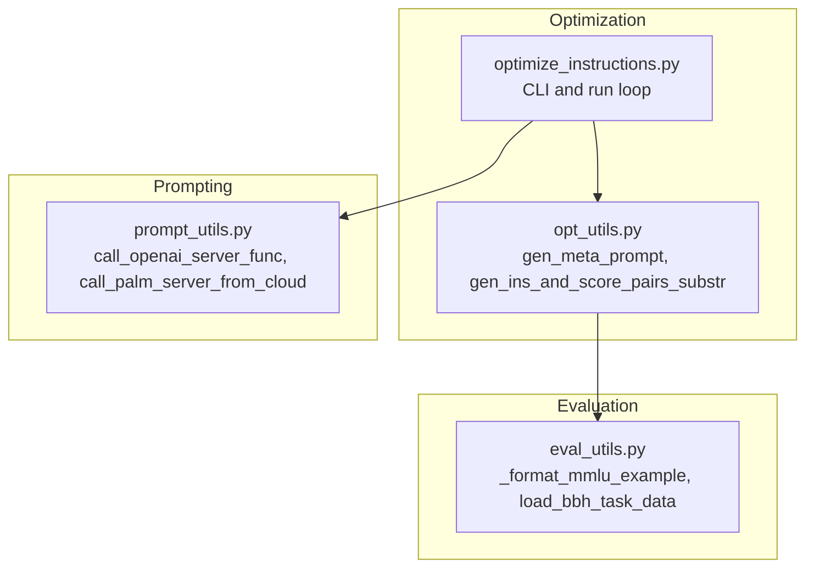
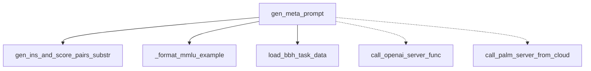

# Meta Prompt Generation

<cite>
**Referenced Files in This Document**
- [opt_utils.py](file://opro/optimization/opt_utils.py)
- [optimize_instructions.py](file://opro/optimization/optimize_instructions.py)
- [eval_utils.py](file://opro/evaluation/eval_utils.py)
- [prompt_utils.py](file://opro/prompt_utils.py)
</cite>

## Table of Contents
1. [Introduction](#introduction)
2. [Project Structure](#project-structure)
3. [Core Components](#core-components)
4. [Architecture Overview](#architecture-overview)
5. [Detailed Component Analysis](#detailed-component-analysis)
6. [Dependency Analysis](#dependency-analysis)
7. [Performance Considerations](#performance-considerations)
8. [Troubleshooting Guide](#troubleshooting-guide)
9. [Conclusion](#conclusion)

## Introduction
This document provides comprehensive API documentation for the gen_meta_prompt function located in opro/optimization/opt_utils.py. The function constructs a structured meta-prompt used by an optimizer LLM to generate improved instructions or starting sentences for downstream tasks. It supports two operational modes:
- Both instructions and exemplars: combines historical instruction-score pairs with few-shot QA examples from datasets (MMLU, BBH, GSM8K).
- Instructions only: focuses solely on historical instruction-score pairs with contextual task description for pre-trained optimizers.

The function enforces strict assertions for supported models, dataset names, instruction positions, and score bucketization. It also adapts formatting for OpenAI and Google (PaLM) models and integrates dataset-specific formatting via evaluation utilities.

## Project Structure
The meta-prompt generation pipeline spans several modules:
- opro/optimization/opt_utils.py: Contains gen_meta_prompt and helper utilities.
- opro/optimization/optimize_instructions.py: CLI entrypoint that orchestrates the optimization loop and invokes gen_meta_prompt.
- opro/evaluation/eval_utils.py: Provides dataset-specific formatting helpers and BBH data loading.
- opro/prompt_utils.py: Wraps OpenAI and Google Cloud model calls used by the optimization workflow.



**Diagram sources**
- [opt_utils.py](file://opro/optimization/opt_utils.py#L90-L335)
- [optimize_instructions.py](file://opro/optimization/optimize_instructions.py#L104-L800)
- [eval_utils.py](file://opro/evaluation/eval_utils.py#L126-L150)
- [prompt_utils.py](file://opro/prompt_utils.py#L21-L133)

**Section sources**
- [opt_utils.py](file://opro/optimization/opt_utils.py#L90-L335)
- [optimize_instructions.py](file://opro/optimization/optimize_instructions.py#L104-L800)
- [eval_utils.py](file://opro/evaluation/eval_utils.py#L126-L150)
- [prompt_utils.py](file://opro/prompt_utils.py#L21-L133)

## Core Components
- gen_meta_prompt: Builds a meta-prompt string combining historical instruction-score pairs and optional few-shot QA examples, tailored to the optimizer LLM and dataset.
- gen_ins_and_score_pairs_substr: Generates a compact substring of historical instruction-score pairs with optional filtering and bucketization.
- Helper utilities: Assertions, dataset formatters, and model-specific formatting logic.

Key responsibilities:
- Parameter validation and model/dataset compatibility checks.
- Instruction-score pair filtering and formatting.
- Few-shot QA example construction for MMLU, BBH, and GSM8K.
- Model-specific prompt scaffolding for OpenAI vs Google models.
- Ordering control between instruction-score pairs and exemplars.

**Section sources**
- [opt_utils.py](file://opro/optimization/opt_utils.py#L90-L335)
- [opt_utils.py](file://opro/optimization/opt_utils.py#L52-L87)

## Architecture Overview
The optimization loop uses gen_meta_prompt to construct prompts passed to the optimizer LLM. The loop selects few-shot examples, builds the meta-prompt, and decodes new instructions or starting sentences depending on the mode and instruction position.

```mermaid
sequenceDiagram
participant CLI as "optimize_instructions.py"
participant OPT as "opt_utils.gen_meta_prompt"
participant EVAL as "eval_utils (formatting)"
participant LLM as "prompt_utils (OpenAI/Google)"
CLI->>OPT : Build meta-prompt with parameters
OPT->>EVAL : Format dataset-specific examples (_format_mmlu_example, BBH loader)
OPT-->>CLI : Return meta_prompt string
CLI->>LLM : Call optimizer with meta_prompt
LLM-->>CLI : Raw outputs
CLI->>CLI : Parse outputs (instruction or starting sentence)
CLI-->>CLI : Evaluate and update history
```

**Diagram sources**
- [optimize_instructions.py](file://opro/optimization/optimize_instructions.py#L692-L724)
- [opt_utils.py](file://opro/optimization/opt_utils.py#L90-L335)
- [eval_utils.py](file://opro/evaluation/eval_utils.py#L126-L150)
- [prompt_utils.py](file://opro/prompt_utils.py#L21-L133)

## Detailed Component Analysis

### gen_meta_prompt API Definition
Purpose:
- Construct a structured meta-prompt for an optimizer LLM to generate improved instructions or starting sentences.

Parameters:
- old_instructions_and_scores: list of (instruction, score, i_step) tuples. Used to build historical instruction-score substrings.
- instruction_pos: positioning options controlling where the instruction or starting sentence is placed in few-shot examples. Supported values: "before_Q", "Q_begin", "Q_end", "A_begin".
- optimizer_llm_name: supported models: "gpt-3.5-turbo", "gpt-4", "text-bison". Formatting differs by model family.
- old_instruction_score_threshold: float threshold to filter historical instructions by score.
- max_num_instructions: int limit on the number of historical instructions included.
- meta_prompt_type: "both_instructions_and_exemplars" or "instructions_only".
- few_shot_qa_pairs: bool inclusion of few-shot QA examples.
- include_qa: bool toggles presence of "Q:" and "A:" markers in few-shot examples.
- data: raw dataset container (DataFrame for MMLU/GSM8K, list for BBH).
- few_shot_index_list: indices of selected few-shot examples.
- instructions_before_exemplars: bool ordering control between historical instructions and exemplars.
- num_score_buckets: int or np.inf for quantizing scores to integer buckets.
- dataset_name: "mmlu", "bbh", or "gsm8k".
- task_name: contextual label used when meta_prompt_type == "instructions_only".

Return value:
- Formatted string prompt designed to guide the optimizer LLM to produce a new instruction or starting sentence.

Behavior highlights:
- Validates instruction_pos, meta_prompt_type, dataset_name, and num_score_buckets.
- Selects model-specific scaffolding and instruction extraction logic.
- Integrates historical instruction-score pairs via gen_ins_and_score_pairs_substr.
- Constructs few-shot QA examples using dataset-specific formatters.
- Enforces ordering between instruction-score pairs and exemplars.
- Adds model-specific instruction-generation instructions.

Error conditions:
- Invalid instruction_pos or meta_prompt_type.
- Unsupported dataset_name.
- Invalid num_score_buckets (must be np.inf or int).
- Unsupported optimizer_llm_name.
- Mismatched instruction positions for "instructions_only" mode.

Role in optimization loop:
- Called within the optimization loop to generate prompts for each iteration.
- Drives instruction refinement by exposing recent successful instructions and relevant examples.

Concrete examples of generated meta-prompts:
- OpenAI GPT-3.5/4 with both instructions and exemplars:
  - Instruction mode: Meta-prompt includes historical instructions with scores and few-shot QA examples with "Q:" and "A:" markers, positioned according to instruction_pos. Ends with instruction-generation instruction.
  - Starting sentence mode (A_begin): Meta-prompt includes historical starting sentences with scores and few-shot QA examples, ending with a request to generate a new starting sentence.
- Google text-bison with both instructions and exemplars:
  - Uses a different preamble and exemplar formatting tailored to text-bison, including explicit guidance on bracketed text output.
- Instructions-only mode:
  - Meta-prompt includes a contextual instruction-generation instruction and historical instruction-score pairs with a "<TEXT>...</TEXT>" wrapper for text-bison.

How it handles model formatting differences:
- OpenAI models: Uses "<INS>" and "</INS>" markers for instructions and "<Start>" and "</Start>" for starting sentences; includes explicit instruction-generation instructions.
- Google text-bison: Uses bracketed text "[...]" and a different instruction-generation instruction; exemplars include "output:" lines.

Few-shot example integration:
- MMLU: Uses _format_mmlu_example to build question text and extracts true answers from DataFrame.
- BBH: Loads task data via load_bbh_task_data and uses "input" and "target" fields.
- GSM8K: Uses DataFrame columns to build question and answer pairs.

Structural constraints enforcement:
- Assertions validate instruction_pos, meta_prompt_type, dataset_name, and num_score_buckets.
- Additional assertions ensure correct instruction positions for "instructions_only" mode.

**Section sources**
- [opt_utils.py](file://opro/optimization/opt_utils.py#L90-L335)
- [opt_utils.py](file://opro/optimization/opt_utils.py#L52-L87)
- [eval_utils.py](file://opro/evaluation/eval_utils.py#L126-L150)
- [eval_utils.py](file://opro/evaluation/eval_utils.py#L877-L916)
- [optimize_instructions.py](file://opro/optimization/optimize_instructions.py#L104-L188)

### gen_ins_and_score_pairs_substr
Purpose:
- Generate a compact substring representing historical instruction-score pairs, with optional filtering and bucketization.

Parameters:
- old_instructions_and_scores: list of (instruction, score, i_step).
- old_instruction_score_threshold: float threshold to filter low-scoring instructions.
- max_num_instructions: int limit on the number of pairs included.
- return_str_only: bool to return only the string or also the filtered list.
- num_score_buckets: int or np.inf for score quantization.

Behavior:
- Sorts by score and slices to the last max_num_instructions entries.
- Filters by score threshold.
- Formats each pair as a "text:\n{instruction}\nscore:\n{score}" block.
- Applies rounding or bucketization to scores.

**Section sources**
- [opt_utils.py](file://opro/optimization/opt_utils.py#L52-L87)

### Model-specific Prompt Construction
- OpenAI GPT-3.5/4:
  - Instruction mode: preamble mentions generating "<INS>... </INS>".
  - Starting sentence mode: preamble mentions generating "<Start>... </Start>".
  - Few-shot examples: include "Q:" and "A:" markers; ground-truth answers appended as "Ground truth answer:".
- Google text-bison:
  - Preamble emphasizes bracketed text output.
  - Few-shot examples: include "input:" and "output:" lines; exemplar text describes replacement of "<INS>" with old text.

**Section sources**
- [opt_utils.py](file://opro/optimization/opt_utils.py#L161-L295)

### Dataset Integration
- MMLU: Uses _format_mmlu_example to build question text and extracts the true answer from DataFrame.
- BBH: Uses load_bbh_task_data to load JSON examples and reads "input" and "target".
- GSM8K: Reads question and answer from DataFrame columns.

**Section sources**
- [eval_utils.py](file://opro/evaluation/eval_utils.py#L126-L150)
- [eval_utils.py](file://opro/evaluation/eval_utils.py#L877-L916)

### Optimization Loop Integration
- The optimization loop calls gen_meta_prompt to build prompts for each iteration.
- Few-shot indices are selected based on criteria (accumulative, current, random, constant).
- Outputs are parsed differently depending on model and meta_prompt_type:
  - OpenAI: Extracts text between "<INS>" and "</INS>" or "<Start>" and "</Start>" markers.
  - text-bison: Extracts bracketed text from model outputs.
  - Instructions-only mode: Parses "<TEXT>...</TEXT>" blocks.

**Section sources**
- [optimize_instructions.py](file://opro/optimization/optimize_instructions.py#L692-L724)
- [opt_utils.py](file://opro/optimization/opt_utils.py#L732-L783)

## Dependency Analysis
- gen_meta_prompt depends on:
  - gen_ins_and_score_pairs_substr for historical instruction-score formatting.
  - eval_utils for dataset-specific formatting (MMLU and BBH).
  - prompt_utils for model calls (used by the optimization loop).
- The optimization loop orchestrates:
  - Data loading and splitting.
  - Few-shot selection.
  - Meta-prompt generation.
  - Output parsing and evaluation.



**Diagram sources**
- [opt_utils.py](file://opro/optimization/opt_utils.py#L90-L335)
- [opt_utils.py](file://opro/optimization/opt_utils.py#L52-L87)
- [eval_utils.py](file://opro/evaluation/eval_utils.py#L126-L150)
- [eval_utils.py](file://opro/evaluation/eval_utils.py#L877-L916)
- [prompt_utils.py](file://opro/prompt_utils.py#L21-L133)

**Section sources**
- [opt_utils.py](file://opro/optimization/opt_utils.py#L90-L335)
- [eval_utils.py](file://opro/evaluation/eval_utils.py#L126-L150)
- [eval_utils.py](file://opro/evaluation/eval_utils.py#L877-L916)
- [prompt_utils.py](file://opro/prompt_utils.py#L21-L133)

## Performance Considerations
- Historical instruction filtering:
  - Sorting and slicing by score is O(n log n) plus O(n) for filtering; capped by max_num_instructions.
  - Filtering by threshold reduces subsequent string concatenation cost.
- Score bucketization:
  - Bucketization reduces string length and improves readability; use np.inf for floating-point scores.
- Few-shot example construction:
  - Iterating over few_shot_index_list scales linearly with the number of exemplars.
  - Dataset-specific formatting adds minimal overhead.
- Model output parsing:
  - OpenAI: String scanning for markers; bounded by batch size.
  - text-bison: Bracket extraction; bounded by batch size.
- Recommendations:
  - Keep max_num_instructions moderate to balance context length and performance.
  - Use num_score_buckets judiciously to reduce prompt size.
  - Limit few_shot_index_list to a small, representative subset.

[No sources needed since this section provides general guidance]

## Troubleshooting Guide
Common errors and resolutions:
- Invalid instruction_pos:
  - Symptom: Assertion failure for instruction_pos.
  - Resolution: Use one of "before_Q", "Q_begin", "Q_end", "A_begin".
- Invalid meta_prompt_type:
  - Symptom: Assertion failure for meta_prompt_type.
  - Resolution: Use "both_instructions_and_exemplars" or "instructions_only".
- Unsupported dataset_name:
  - Symptom: Assertion failure for dataset_name.
  - Resolution: Use "mmlu", "bbh", or "gsm8k".
- Invalid num_score_buckets:
  - Symptom: Assertion failure for num_score_buckets.
  - Resolution: Provide an int or np.inf.
- Unsupported optimizer_llm_name:
  - Symptom: Unhandled model name in formatting logic.
  - Resolution: Use "gpt-3.5-turbo", "gpt-4", or "text-bison".
- Mismatched instruction positions for instructions_only:
  - Symptom: Assertion failure for instruction_pos in instructions_only mode.
  - Resolution: Use "Q_begin", "Q_end", or "A_begin" for instructions_only.
- Exemplar formatting issues:
  - Symptom: Incorrect Q/A markers or missing dataset-specific formatting.
  - Resolution: Ensure include_qa aligns with dataset formatting and instruction_pos placement.

**Section sources**
- [opt_utils.py](file://opro/optimization/opt_utils.py#L140-L160)
- [opt_utils.py](file://opro/optimization/opt_utils.py#L296-L335)

## Conclusion
The gen_meta_prompt function is central to the instruction optimization loop. It dynamically composes a meta-prompt tailored to the optimizer LLM and dataset, integrating historical instruction performance and few-shot examples. Its robust assertions and dataset-aware formatting ensure reliable operation across MMLU, BBH, and GSM8K tasks. By carefully tuning parameters like max_num_instructions, num_score_buckets, and few-shot selection criteria, users can balance prompt quality and computational efficiency.