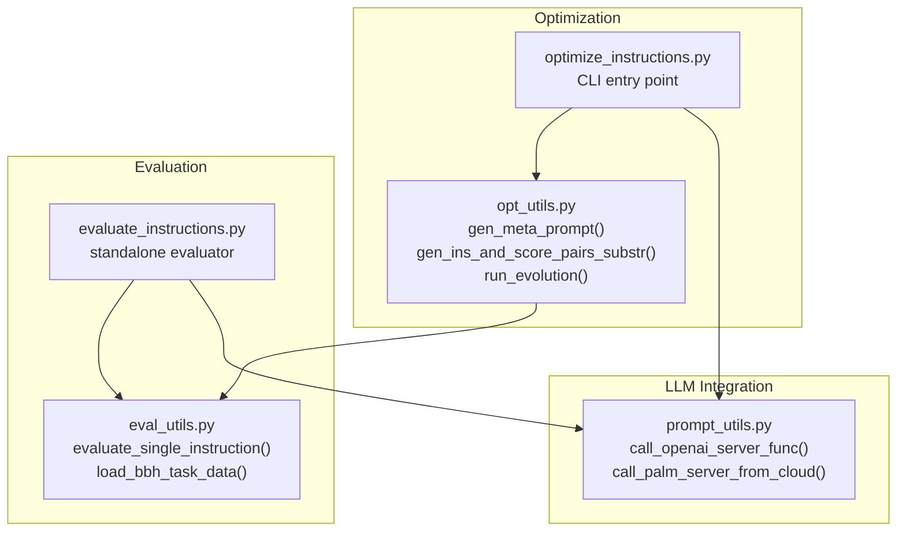
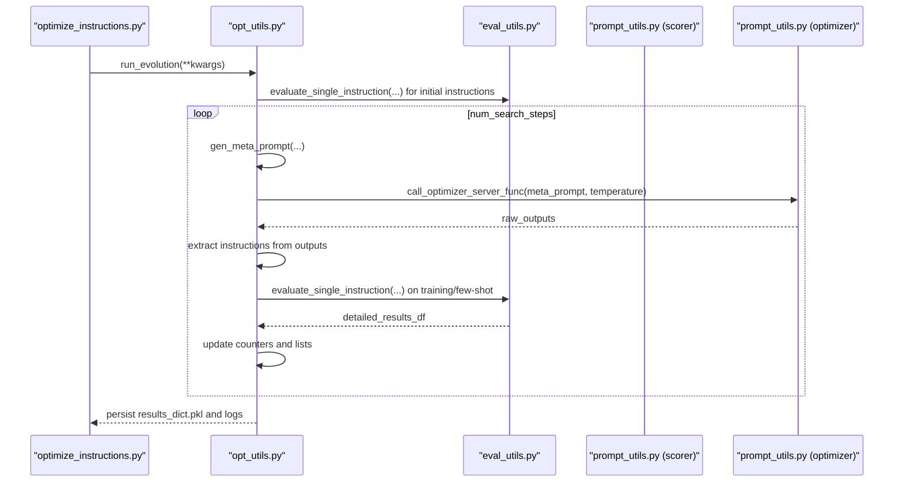
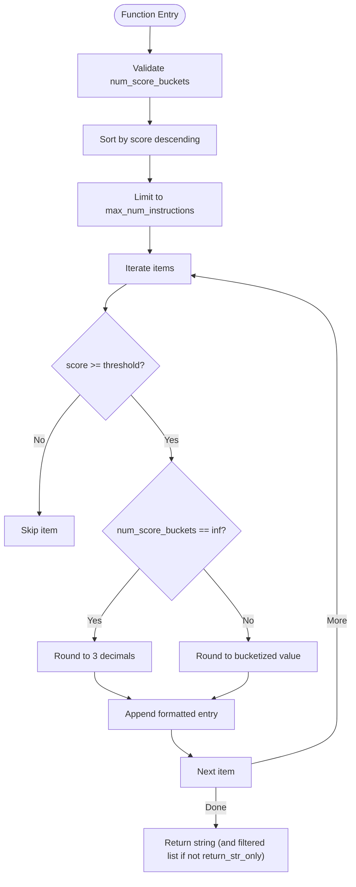
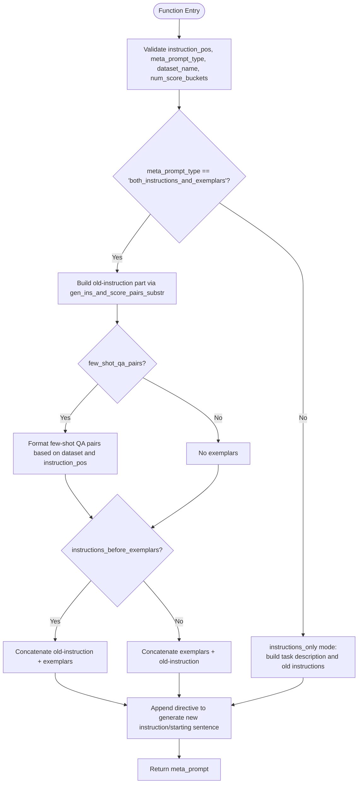
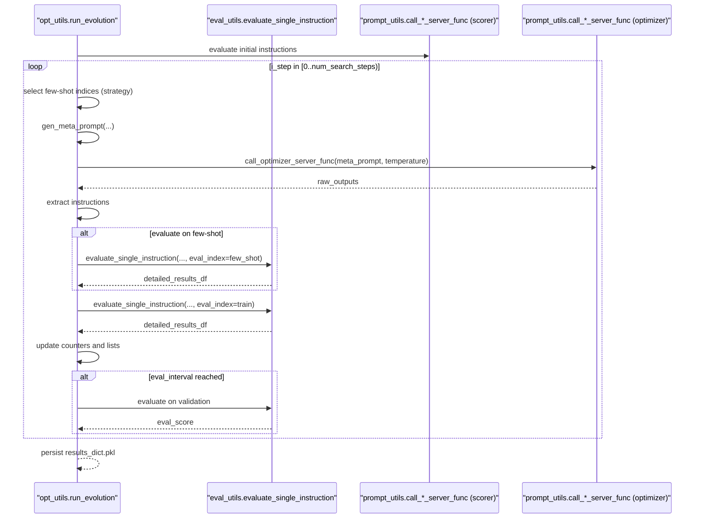
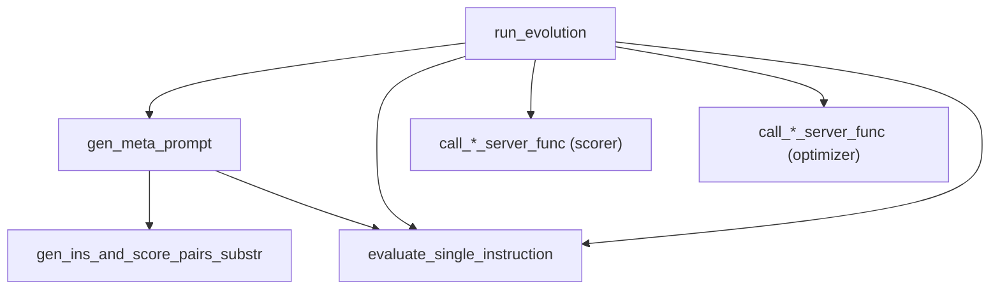

# Optimization Utilities

<cite>
**Referenced Files in This Document**
- [opt_utils.py](file://opro/optimization/opt_utils.py)
- [optimize_instructions.py](file://opro/optimization/optimize_instructions.py)
- [eval_utils.py](file://opro/evaluation/eval_utils.py)
- [evaluate_instructions.py](file://opro/evaluation/evaluate_instructions.py)
- [prompt_utils.py](file://opro/prompt_utils.py)
</cite>

## Table of Contents
1. [Introduction](#introduction)
2. [Project Structure](#project-structure)
3. [Core Components](#core-components)
4. [Architecture Overview](#architecture-overview)
5. [Detailed Component Analysis](#detailed-component-analysis)
6. [Dependency Analysis](#dependency-analysis)
7. [Performance Considerations](#performance-considerations)
8. [Troubleshooting Guide](#troubleshooting-guide)
9. [Conclusion](#conclusion)

## Introduction
This document provides API documentation for the optimization utility functions in opro/optimization/opt_utils.py, focusing on:
- gen_meta_prompt: constructs a meta-prompt for instruction rewriting, including optional few-shot QA exemplars and score bucketing.
- gen_ins_and_score_pairs_substr: generates a formatted string of prior instructions and scores, with optional filtering and bucketing.
- run_evolution: orchestrates the end-to-end evolutionary optimization loop, coordinating LLM calls, evaluation, and result persistence.

It also explains how these utilities integrate with LLM APIs via prompt_utils.py, how they coordinate the prompt optimization workflow, and how to invoke them effectively.

## Project Structure
The optimization utilities live under opro/optimization and are consumed by the CLI entry point optimize_instructions.py. Evaluation utilities in opro/evaluation provide helper functions for prompt construction and scoring.

**Diagram sources**
- [opt_utils.py](file://opro/optimization/opt_utils.py#L52-L1036)
- [optimize_instructions.py](file://opro/optimization/optimize_instructions.py#L736-L800)
- [eval_utils.py](file://opro/evaluation/eval_utils.py#L866-L916)
- [evaluate_instructions.py](file://opro/evaluation/evaluate_instructions.py#L549-L766)
- [prompt_utils.py](file://opro/prompt_utils.py#L21-L133)

**Section sources**
- [opt_utils.py](file://opro/optimization/opt_utils.py#L1-L1036)
- [optimize_instructions.py](file://opro/optimization/optimize_instructions.py#L1-L800)
- [eval_utils.py](file://opro/evaluation/eval_utils.py#L1-L916)
- [evaluate_instructions.py](file://opro/evaluation/evaluate_instructions.py#L1-L770)
- [prompt_utils.py](file://opro/prompt_utils.py#L1-L133)

## Core Components
- gen_ins_and_score_pairs_substr(old_instructions_and_scores, old_instruction_score_threshold, max_num_instructions, return_str_only, num_score_buckets)
  - Purpose: Build a formatted string of prior instructions and scores, with optional filtering by threshold and bucketing of scores.
  - Parameters:
    - old_instructions_and_scores: list of (instruction, score, i_step)
    - old_instruction_score_threshold: float threshold for inclusion
    - max_num_instructions: int maximum number of prior instructions to include
    - return_str_only: bool controls whether to return only the string or also the filtered list used internally
    - num_score_buckets: int or np.inf for rounding scores into discrete buckets
  - Returns: string (and optionally the filtered list used internally)
  - Edge cases: Handles empty input, sorts by score descending, applies threshold, and rounds scores according to bucketization policy.

- gen_meta_prompt(...)
  - Purpose: Construct a meta-prompt tailored for instruction rewriting, optionally including few-shot QA exemplars and dataset/task descriptions.
  - Key parameters:
    - old_instructions_and_scores: list of (instruction, score, i_step)
    - instruction_pos: str among {"before_Q", "Q_begin", "Q_end", "A_begin"}
    - optimizer_llm_name: str among {"gpt-3.5-turbo", "gpt-4", "text-bison"}
    - old_instruction_score_threshold, max_num_instructions, meta_prompt_type, few_shot_qa_pairs, include_qa, data, few_shot_index_list, instructions_before_exemplars, num_score_buckets, dataset_name, task_name
  - Returns: string (the constructed meta-prompt)
  - Behavior: Selects instruction placement, adds previous instructions and scores, conditionally adds few-shot QA pairs, and appends a directive to generate a new instruction or starting sentence.

- run_evolution(**kwargs)
  - Purpose: End-to-end orchestration of the evolutionary optimization loop.
  - Responsibilities:
    - Initialize configuration dictionaries and logging
    - Evaluate initial instructions
    - Loop over num_search_steps:
      - Select few-shot exemplars (various strategies)
      - Generate meta-prompt
      - Call optimizer LLM to produce candidate instructions
      - Filter candidates and deduplicate
      - Evaluate candidates on training set and/or few-shot exemplars
      - Track wrong questions and update counters
      - Periodically evaluate on validation set
    - Persist results and intermediate artifacts
  - Key kwargs include: num_search_steps, old_instruction_score_threshold, scorer_llm_dict, optimizer_llm_dict, extract_final_answer_by_prompting_again, include_qa, evaluate_in_parallel, tasks_all, train_ratio, eval_ratio, test_ratio, train_index, eval_index, dataset_name, task_name, num_examples, root_data_folder_path, optimizer_llm_temperature, optimizer_llm_temperature_schedule, optimizer_llm_temperature_end, initial_instructions, multiple_choice_tasks, raw_data, call_scorer_server_func, call_optimizer_server_func, instruction_pos, prediction_treat_as_number, prediction_treat_as_bool, result_by_instruction_folder, few_shot_qa_pairs, num_score_buckets, max_num_instructions, meta_prompt_type, meta_prompt_instructions_before_exemplars, few_shot_selection_criteria, optimizer_llm_name, num_generated_instructions_in_each_step, evaluate_generated_ins_on_few_shot, num_few_shot_questions_for_instruction_refinement, evaluate_old_ins_on_few_shot, eval_interval, save_folder, verbose.

**Section sources**
- [opt_utils.py](file://opro/optimization/opt_utils.py#L52-L335)
- [opt_utils.py](file://opro/optimization/opt_utils.py#L338-L1036)

## Architecture Overview
The optimization pipeline integrates CLI configuration, prompt construction, LLM calls, and evaluation.

**Diagram sources**
- [optimize_instructions.py](file://opro/optimization/optimize_instructions.py#L736-L800)
- [opt_utils.py](file://opro/optimization/opt_utils.py#L338-L1036)
- [eval_utils.py](file://opro/evaluation/eval_utils.py#L866-L916)
- [prompt_utils.py](file://opro/prompt_utils.py#L21-L133)

## Detailed Component Analysis

### gen_ins_and_score_pairs_substr
- Role: Formats prior instruction-score pairs into a string suitable for inclusion in a meta-prompt. Supports threshold filtering and score bucketization.
- Input format: List of tuples (instruction: string, score: float, i_step: int).
- Output: String with entries formatted as "text:\n{instruction}\nscore:\n{score}". Optionally returns the filtered list used internally.
- Edge cases:
  - Threshold filtering: only includes entries with score >= threshold.
  - Bucketization: Rounds scores to discrete buckets when num_score_buckets is an integer; otherwise rounds to 3 decimal places.
  - Sorting: Sorts by score descending and limits to max_num_instructions.
- Complexity:
  - Sorting: O(n log n)
  - Iteration: O(n)
  - Overall: O(n log n)

**Diagram sources**
- [opt_utils.py](file://opro/optimization/opt_utils.py#L52-L88)

**Section sources**
- [opt_utils.py](file://opro/optimization/opt_utils.py#L52-L88)

### gen_meta_prompt
- Role: Builds a meta-prompt for instruction rewriting, with two modes:
  - Both instructions and exemplars: includes prior instructions and few-shot QA pairs.
  - Instructions only: instructs the optimizer to write a new text based on dataset/task description.
- Instruction placement:
  - before_Q: place instruction before the question
  - Q_begin: place instruction at the beginning of the question
  - Q_end: place instruction at the end of the question
  - A_begin: place instruction at the beginning of the answer (specialized for answer-starting sentence generation)
- Few-shot exemplars:
  - When enabled, selects QA pairs from data using indices in few_shot_index_list and formats them according to dataset and instruction_pos.
- Dataset/task description:
  - For instructions_only mode, constructs a task description based on dataset_name and task_name.
- Score presentation:
  - Uses gen_ins_and_score_pairs_substr to render prior instructions and scores, with optional bucketization.
- LLM-specific behavior:
  - For GPT models, expects instruction markers <INS> or <Start>.
  - For text-bison, expects bracketed text and writes within brackets.

**Diagram sources**
- [opt_utils.py](file://opro/optimization/opt_utils.py#L90-L335)

**Section sources**
- [opt_utils.py](file://opro/optimization/opt_utils.py#L90-L335)

### run_evolution
- Role: Orchestrates the full evolutionary optimization loop, including initialization, few-shot selection strategies, meta-prompt generation, optimizer calls, candidate extraction, evaluation, and result persistence.
- Initialization:
  - Loads kwargs, asserts constraints, saves configs to JSON, initializes tracking structures (lists, dicts, counters).
- Few-shot selection strategies:
  - accumulative_most_frequent: selects exemplars that were consistently wrong across history.
  - current_most_frequent: counts wrong occurrences among current instructions and selects most frequent.
  - constant: randomly samples a fixed number of exemplars.
  - random: random sampling per step.
- Meta-prompt generation:
  - Calls gen_meta_prompt with current context and selected exemplars.
- Candidate generation:
  - Calls optimizer server function with the meta-prompt and current temperature schedule.
  - Extracts instructions from raw outputs depending on model and instruction_pos.
- Evaluation:
  - Evaluates generated instructions on training set and/or few-shot exemplars (configurable).
  - Updates counters for wrong questions and maintains per-instruction result caches.
- Validation and persistence:
  - Periodically evaluates on validation set at intervals.
  - Saves results_dict.pkl with meta-prompts, instruction histories, evaluation results, and few-shot indices.

**Diagram sources**
- [opt_utils.py](file://opro/optimization/opt_utils.py#L338-L1036)
- [eval_utils.py](file://opro/evaluation/eval_utils.py#L866-L916)
- [prompt_utils.py](file://opro/prompt_utils.py#L21-L133)

**Section sources**
- [opt_utils.py](file://opro/optimization/opt_utils.py#L338-L1036)

## Dependency Analysis
- opt_utils.gen_meta_prompt depends on:
  - gen_ins_and_score_pairs_substr for rendering prior instructions and scores.
  - eval_utils._format_mmlu_example and load_bbh_task_data for formatting dataset exemplars.
- opt_utils.run_evolution depends on:
  - eval_utils.evaluate_single_instruction for scoring instructions.
  - prompt_utils.call_openai_server_func and call_palm_server_from_cloud for LLM calls.
  - opt_utils.gen_meta_prompt and gen_ins_and_score_pairs_substr for prompt construction.

**Diagram sources**
- [opt_utils.py](file://opro/optimization/opt_utils.py#L52-L335)
- [opt_utils.py](file://opro/optimization/opt_utils.py#L338-L1036)
- [eval_utils.py](file://opro/evaluation/eval_utils.py#L866-L916)
- [prompt_utils.py](file://opro/prompt_utils.py#L21-L133)

**Section sources**
- [opt_utils.py](file://opro/optimization/opt_utils.py#L52-L335)
- [opt_utils.py](file://opro/optimization/opt_utils.py#L338-L1036)
- [eval_utils.py](file://opro/evaluation/eval_utils.py#L866-L916)
- [prompt_utils.py](file://opro/prompt_utils.py#L21-L133)

## Performance Considerations
- Few-shot selection:
  - Strategies like current_most_frequent require reading per-instruction CSVs and counting wrong answers, which scales with the number of instructions and evaluation steps.
  - Consider caching and limiting the number of instructions considered per step via max_num_instructions.
- Temperature scheduling:
  - Linear increase can improve exploration early, but increases LLM cost and latency. Monitor optimizer_llm_temperature_end and schedule carefully.
- Batch sizes and decoding:
  - The number of generated instructions per step is controlled by num_generated_instructions_in_each_step and the underlying model serving parameters. Tune to balance throughput and quality.
- Data size:
  - Large datasets (e.g., MMLU) and many tasks increase evaluation time. Consider reducing eval_interval or using fewer exemplars.
- Output parsing:
  - For GPT models, instruction extraction relies on markers (<INS>, <Start>). Ensure consistent formatting to avoid mis-parsing.

[No sources needed since this section provides general guidance]

## Troubleshooting Guide
- Invalid instruction positions or dataset names:
  - gen_meta_prompt asserts instruction_pos and dataset_name. Ensure values are within supported sets.
- Few-shot QA pair formatting:
  - When include_qa is True, instruction_pos affects placement of <INS> or <Start>. Verify instruction_pos aligns with dataset conventions.
- Score bucketization:
  - num_score_buckets must be np.inf or an integer. Ensure consistent bucketization across runs for reproducibility.
- LLM API errors:
  - prompt_utils wraps OpenAI and PaLM calls with retries and timeouts. If failures persist, check API keys and quotas.
- Duplicate instructions:
  - run_evolution deduplicates by MD5 hash. If identical instructions appear, confirm hashing and filtering logic.
- Evaluation failures:
  - run_evolution reads cached CSVs when re-evaluating. If files are missing or corrupted, re-run evaluation for that instruction.

**Section sources**
- [opt_utils.py](file://opro/optimization/opt_utils.py#L90-L139)
- [opt_utils.py](file://opro/optimization/opt_utils.py#L403-L413)
- [opt_utils.py](file://opro/optimization/opt_utils.py#L800-L823)
- [prompt_utils.py](file://opro/prompt_utils.py#L21-L133)

## Conclusion
The optimization utilities provide a robust framework for evolving instructions via meta-prompts and iterative evaluation. gen_meta_prompt and gen_ins_and_score_pairs_substr enable flexible prompt construction with score visualization and exemplar integration. run_evolution coordinates the entire workflow, integrating LLM APIs and evaluation utilities to iteratively improve instruction quality across datasets and tasks.