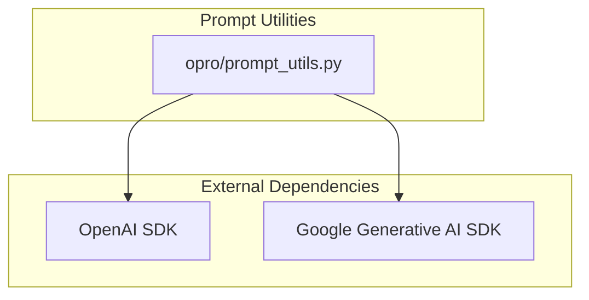
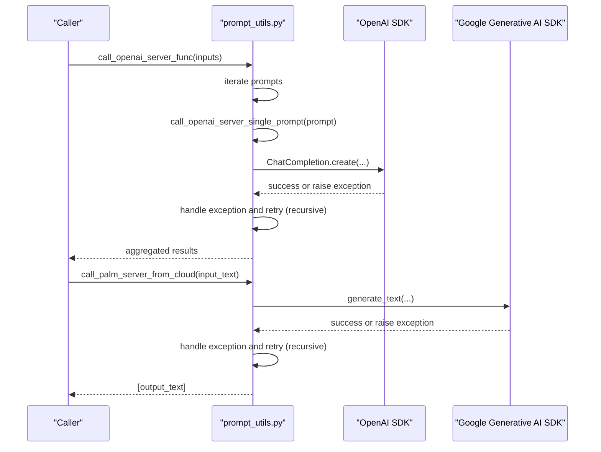
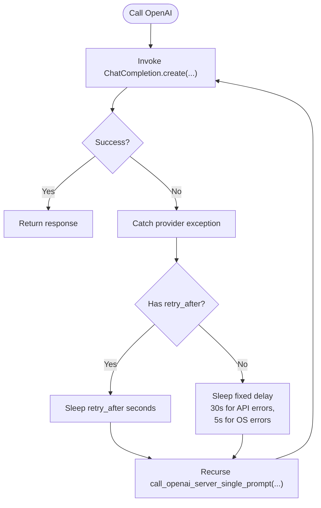
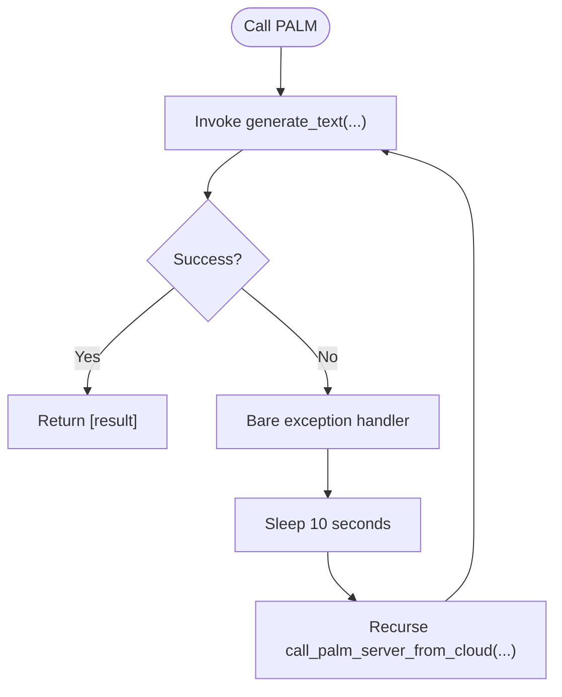

# Error Handling and Retry Mechanisms

<cite>
**Referenced Files in This Document**
- [prompt_utils.py](file://opro/prompt_utils.py)
- [README.md](file://README.md)
- [test_setup.py](file://test_setup.py)
</cite>

## Table of Contents
1. [Introduction](#introduction)
2. [Project Structure](#project-structure)
3. [Core Components](#core-components)
4. [Architecture Overview](#architecture-overview)
5. [Detailed Component Analysis](#detailed-component-analysis)
6. [Dependency Analysis](#dependency-analysis)
7. [Performance Considerations](#performance-considerations)
8. [Troubleshooting Guide](#troubleshooting-guide)
9. [Conclusion](#conclusion)

## Introduction
This document focuses on error handling and retry strategies implemented in the OpenAI and Google Cloud PALM prompt utilities. It analyzes the retry logic for OpenAI calls, the handling of various exceptions, and the recursive retry behavior in both OpenAI and PALM client functions. It also highlights the absence of explicit maximum retry limits, the implications of recursion, and provides guidance for robust client-side error handling, monitoring, and configuration.

## Project Structure
The error handling and retry logic is primarily implemented in a single module responsible for prompting two major providers:
- OpenAI Chat Completions
- Google PALM Text Generation

**Diagram sources**
- [prompt_utils.py](file://opro/prompt_utils.py#L1-L133)

**Section sources**
- [prompt_utils.py](file://opro/prompt_utils.py#L1-L133)
- [README.md](file://README.md#L14-L23)

## Core Components
- call_openai_server_single_prompt: Implements provider-specific exception handling and recursive retries for OpenAI calls.
- call_openai_server_func: Iterates over prompts and delegates to the single-prompt function.
- call_palm_server_from_cloud: Calls the PALM text generation API with a broad exception handler and recursive retry.

Key behaviors:
- OpenAI exceptions are caught individually and retried with a delay derived from the exception’s retry_after field when present; otherwise a fixed delay is used.
- PALM uses a bare exception handler with a fixed 10-second retry interval and recursive retry.
- No explicit maximum retry count is enforced in either function.

**Section sources**
- [prompt_utils.py](file://opro/prompt_utils.py#L21-L133)

## Architecture Overview
The prompt utilities act as thin wrappers around external SDKs. They encapsulate error handling and retry logic close to the API boundary to improve resilience.

**Diagram sources**
- [prompt_utils.py](file://opro/prompt_utils.py#L21-L133)

## Detailed Component Analysis

### OpenAI Single-Prompt Call: call_openai_server_single_prompt
Behavior summary:
- Catches provider-specific exceptions and logs a message indicating the type of error.
- Uses the exception’s retry_after attribute if available; otherwise falls back to a fixed delay.
- Recursively retries by calling itself with the same parameters.

Exception categories and retry behavior:
- Timeout: Uses retry_after if present; otherwise 30 seconds.
- RateLimitError: Uses retry_after if present; otherwise 30 seconds.
- APIError: Uses retry_after if present; otherwise 30 seconds.
- APIConnectionError: Uses retry_after if present; otherwise 30 seconds.
- ServiceUnavailableError: Uses retry_after if present; otherwise 30 seconds.
- OSError: Fixed 5 seconds.

Recursive retry implications:
- The function retries by calling itself recursively with the same arguments.
- There is no maximum retry count; the recursion depth grows until success or until a non-retryable error occurs.
- Risk: Deep recursion can lead to stack exhaustion if failures persist.

Delay logic:
- Prefer exception.retry_after when available.
- Otherwise, use a fixed delay:
  - 30 seconds for most OpenAI errors.
  - 5 seconds for OS errors.

**Diagram sources**
- [prompt_utils.py](file://opro/prompt_utils.py#L21-L84)

**Section sources**
- [prompt_utils.py](file://opro/prompt_utils.py#L21-L84)

### OpenAI Batch Call: call_openai_server_func
Behavior summary:
- Accepts a single prompt or a list of prompts.
- Iterates through inputs and calls the single-prompt function for each.
- Aggregates results in order.

Implications:
- Each individual prompt is retried independently according to the single-prompt function’s logic.
- No cross-prompt retry coordination is performed.

**Section sources**
- [prompt_utils.py](file://opro/prompt_utils.py#L87-L103)

### PALM Cloud Call: call_palm_server_from_cloud
Behavior summary:
- Calls the PALM text generation API.
- Uses a bare exception handler (catch-all) with a fixed 10-second retry interval.
- Recursively retries by calling itself with the same parameters.

Risk assessment:
- Bare exception handling can mask unexpected errors.
- Recursive retry without a maximum bound increases risk of deep recursion and potential stack overflow.
- No distinction between transient and permanent failures.

**Diagram sources**
- [prompt_utils.py](file://opro/prompt_utils.py#L105-L133)

**Section sources**
- [prompt_utils.py](file://opro/prompt_utils.py#L105-L133)

## Dependency Analysis
- External SDKs:
  - OpenAI SDK: Used for Chat Completions and raises provider-specific exceptions.
  - Google Generative AI SDK: Used for PALM text generation.
- Internal dependencies:
  - prompt_utils.py depends on these SDKs for API calls.
  - The module does not depend on other internal modules in this repository.

Potential circular dependencies:
- None observed within prompt_utils.py.

Integration points:
- The functions are intended to be called from higher-level orchestration scripts and evaluation modules.

**Section sources**
- [prompt_utils.py](file://opro/prompt_utils.py#L1-L133)
- [README.md](file://README.md#L14-L23)

## Performance Considerations
- Recursive retries can increase latency significantly if failures persist.
- Excessive recursion risks stack overflow and memory pressure.
- Using retry_after when available is preferable to fixed delays to avoid unnecessary blocking.
- Fixed delays:
  - 30 seconds for most OpenAI errors.
  - 5 seconds for OS errors.
  - 10 seconds for PALM.

Recommendations:
- Introduce a maximum retry count to cap recursion depth.
- Add jitter to delays to avoid thundering herd effects.
- Consider exponential backoff with full jitter.
- Log retry attempts and elapsed time for observability.
- Avoid bare exception handlers; catch specific exceptions to prevent masking.

[No sources needed since this section provides general guidance]

## Troubleshooting Guide

Common issues and diagnostics:
- Authentication failures:
  - Verify API keys are configured and accessible to the runtime environment.
  - Confirm the environment variables are set before invoking the functions.
  - Reference the setup script for environment checks and basic connectivity testing.

- Network and connection errors:
  - OS-level errors trigger a shorter 5-second retry; confirm local network stability.
  - For OpenAI, inspect the exception’s retry_after field to align manual retries with provider guidance.

- Provider-side throttling or service unavailability:
  - RateLimitError and ServiceUnavailableError use retry_after when provided; otherwise fall back to 30 seconds.
  - Monitor logs to detect recurring rate limits and adjust client-side concurrency.

- PALM-specific issues:
  - The bare exception handler retries every 10 seconds; consider adding explicit logging of the caught exception type.
  - If failures persist, consider adding a maximum retry limit to prevent stack overflow.

Debugging tips:
- Enable verbose logging around the call sites to capture retry counts and delays.
- Temporarily reduce batch sizes to isolate problematic prompts.
- Validate endpoint reachability and firewall rules for outbound HTTPS traffic.
- For OpenAI, review the exception type and retry_after to inform manual intervention timing.

**Section sources**
- [test_setup.py](file://test_setup.py#L1-L45)
- [prompt_utils.py](file://opro/prompt_utils.py#L21-L133)

## Conclusion
The prompt utilities implement a pragmatic, though risky, retry strategy:
- OpenAI functions handle provider-specific exceptions and prefer retry_after when available, falling back to fixed delays.
- PALM uses a bare exception handler with a fixed 10-second retry interval and recursive calls.
- Both approaches lack explicit maximum retry limits, increasing the risk of deep recursion and potential stack overflow.
- Recommendations include enforcing maximum retry counts, adopting exponential backoff with jitter, catching specific exceptions, and enhancing observability to monitor failure patterns and tune timeouts accordingly.

[No sources needed since this section summarizes without analyzing specific files]