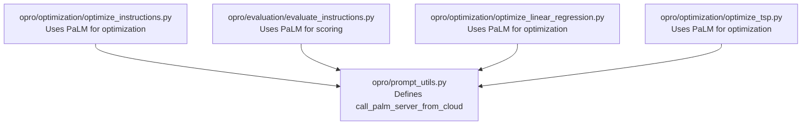
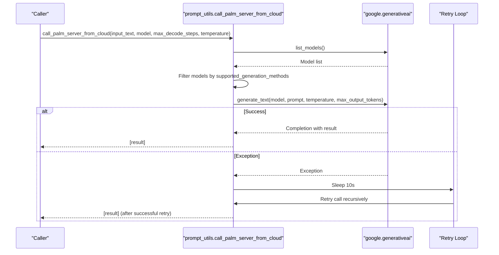
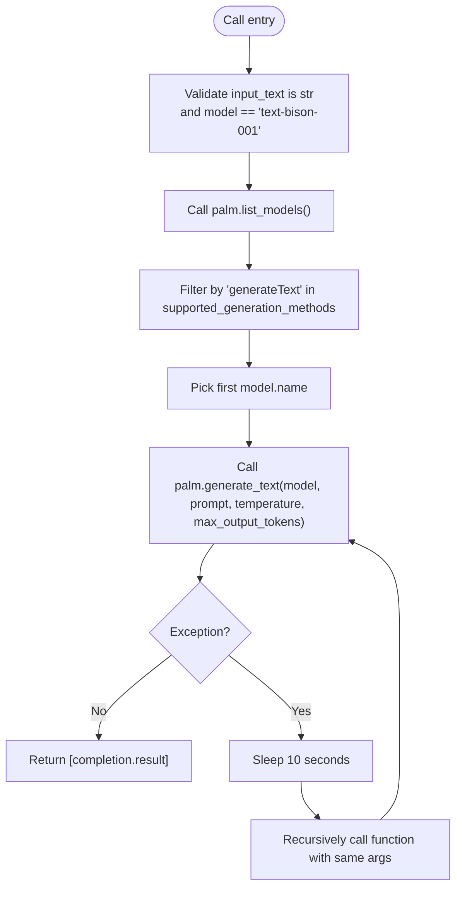
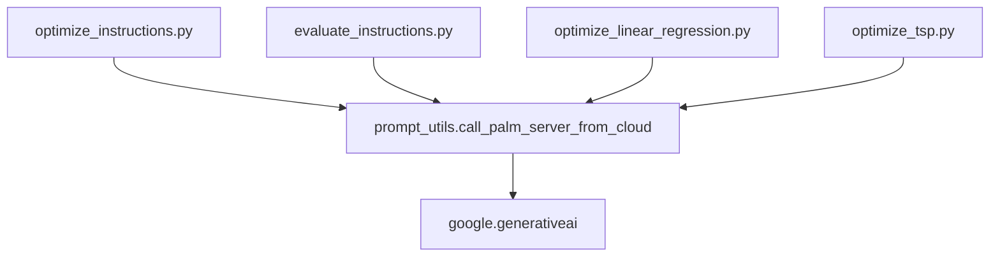

# Google PaLM Integration

<cite>
**Referenced Files in This Document**
- [prompt_utils.py](file://opro/prompt_utils.py)
- [README.md](file://README.md)
- [optimize_instructions.py](file://opro/optimization/optimize_instructions.py)
- [evaluate_instructions.py](file://opro/evaluation/evaluate_instructions.py)
- [optimize_linear_regression.py](file://opro/optimization/optimize_linear_regression.py)
- [optimize_tsp.py](file://opro/optimization/optimize_tsp.py)
</cite>

## Table of Contents
1. [Introduction](#introduction)
2. [Project Structure](#project-structure)
3. [Core Components](#core-components)
4. [Architecture Overview](#architecture-overview)
5. [Detailed Component Analysis](#detailed-component-analysis)
6. [Dependency Analysis](#dependency-analysis)
7. [Performance Considerations](#performance-considerations)
8. [Troubleshooting Guide](#troubleshooting-guide)
9. [Conclusion](#conclusion)
10. [Appendices](#appendices)

## Introduction
This document provides API documentation for the Google PaLM integration exposed via the function call_palm_server_from_cloud in opro/prompt_utils.py. It explains the function’s inputs, model discovery and selection, return value semantics, error handling and retry behavior, authentication requirements, and how it integrates with higher-level modules for prompt optimization and evaluation workflows.

## Project Structure
The Google PaLM integration is implemented in a single utility module and consumed by multiple scripts that orchestrate prompt optimization and evaluation.



**Diagram sources**
- [prompt_utils.py](file://opro/prompt_utils.py#L105-L132)
- [optimize_instructions.py](file://opro/optimization/optimize_instructions.py#L264-L330)
- [evaluate_instructions.py](file://opro/evaluation/evaluate_instructions.py#L259-L270)
- [optimize_linear_regression.py](file://opro/optimization/optimize_linear_regression.py#L129-L134)
- [optimize_tsp.py](file://opro/optimization/optimize_tsp.py#L132-L137)

**Section sources**
- [prompt_utils.py](file://opro/prompt_utils.py#L105-L132)
- [README.md](file://README.md#L14-L24)

## Core Components
- call_palm_server_from_cloud(input_text, model="text-bison-001", max_decode_steps=20, temperature=0.8)
  - Purpose: Invoke the Google PaLM text-bison model via the Cloud API and return a single generated text wrapped in a list.
  - Inputs:
    - input_text: str — The prompt text to send to the model.
    - model: str — Must be "text-bison-001".
    - max_decode_steps: int — Controls the maximum number of tokens to generate.
    - temperature: float — Sampling temperature for generation.
  - Behavior:
    - Validates input types and model name.
    - Discovers available models via palm.list_models() and filters by supported_generation_methods containing "generateText".
    - Selects the first model from the filtered list and calls palm.generate_text().
    - Returns a single-element list containing the generated text.
  - Error handling and retry:
    - On any exception, sleeps for 10 seconds and retries the call recursively.
  - Authentication:
    - Requires google.generativeai to be configured with an API key prior to calling this function.

**Section sources**
- [prompt_utils.py](file://opro/prompt_utils.py#L105-L132)

## Architecture Overview
The integration sits behind a thin wrapper that discovers the correct model and invokes the underlying API. Higher-level modules configure authentication and then call into this wrapper to obtain model outputs during optimization and evaluation.



**Diagram sources**
- [prompt_utils.py](file://opro/prompt_utils.py#L105-L132)

## Detailed Component Analysis

### call_palm_server_from_cloud
- Input validation:
  - Enforces input_text is a string.
  - Enforces model equals "text-bison-001".
- Model discovery:
  - Calls palm.list_models() and filters models whose supported_generation_methods include "generateText".
  - Uses the first model from the filtered list.
- Generation:
  - Invokes palm.generate_text() with the selected model, prompt, temperature, and max_output_tokens.
  - Extracts the generated text from completion.result.
- Output:
  - Returns a single-element list [output_text].
- Error handling and retry:
  - Catches any exception, prints a message, sleeps for 10 seconds, and retries the call recursively.



**Diagram sources**
- [prompt_utils.py](file://opro/prompt_utils.py#L105-L132)

**Section sources**
- [prompt_utils.py](file://opro/prompt_utils.py#L105-L132)

### Authentication and Configuration
- The function requires google.generativeai to be configured with an API key before invocation.
- In higher-level scripts, authentication is configured as follows:
  - For PaLM: palm.configure(api_key=...) is called with the provided key.
  - For OpenAI: openai.api_key is set similarly.
- The README lists the required dependency google.generativeai.

**Section sources**
- [README.md](file://README.md#L14-L24)
- [optimize_instructions.py](file://opro/optimization/optimize_instructions.py#L190-L199)
- [evaluate_instructions.py](file://opro/evaluation/evaluate_instructions.py#L184-L193)

### Integration with Optimization and Evaluation Workflows
- Optimization scripts:
  - Partially bind call_palm_server_from_cloud with fixed model and generation parameters.
  - Use the returned single-element list to extract the string for downstream processing.
- Evaluation script:
  - Creates a partial function around call_palm_server_from_cloud for the scorer.
  - Tests the scorer by invoking it with a short prompt and printing the result.

```mermaid
sequenceDiagram
participant Opt as "Optimization Script"
participant Eval as "Evaluation Script"
participant PU as "prompt_utils.call_palm_server_from_cloud"
participant PALM as "google.generativeai"
Opt->>PU : Partially bound call with model="text-bison-001"<br/>and temperature/max_decode_steps
Opt->>PU : Call with prompt
PU->>PALM : generate_text(...)
PALM-->>PU : Completion
PU-->>Opt : ["generated text"]
Opt->>Opt : Extract [0] for scoring/optimization
Eval->>PU : Partially bound call (scorer)
Eval->>PU : Test call with short prompt
PU->>PALM : generate_text(...)
PALM-->>PU : Completion
PU-->>Eval : ["generated text"]
Eval->>Eval : Print result
```

**Diagram sources**
- [optimize_instructions.py](file://opro/optimization/optimize_instructions.py#L301-L330)
- [evaluate_instructions.py](file://opro/evaluation/evaluate_instructions.py#L259-L270)
- [prompt_utils.py](file://opro/prompt_utils.py#L105-L132)

**Section sources**
- [optimize_instructions.py](file://opro/optimization/optimize_instructions.py#L301-L330)
- [evaluate_instructions.py](file://opro/evaluation/evaluate_instructions.py#L259-L270)

## Dependency Analysis
- Internal dependencies:
  - prompt_utils depends on google.generativeai for model discovery and generation.
  - Optimization and evaluation scripts depend on prompt_utils for model calls.
- External dependencies:
  - google.generativeai is required for PaLM integration.



**Diagram sources**
- [prompt_utils.py](file://opro/prompt_utils.py#L16-L18)
- [optimize_instructions.py](file://opro/optimization/optimize_instructions.py#L55-L60)
- [evaluate_instructions.py](file://opro/evaluation/evaluate_instructions.py#L52-L60)
- [optimize_linear_regression.py](file://opro/optimization/optimize_linear_regression.py#L42-L42)
- [optimize_tsp.py](file://opro/optimization/optimize_tsp.py#L44-L44)

**Section sources**
- [prompt_utils.py](file://opro/prompt_utils.py#L16-L18)
- [README.md](file://README.md#L14-L24)

## Performance Considerations
- Latency:
  - Expect network latency plus model generation time. The function performs a model discovery call and a generation call per invocation.
- Throughput:
  - The function returns a single-element list; callers should batch prompts externally if they need multiple generations concurrently.
- Rate limiting:
  - The function itself does not implement explicit rate limiting; it retries on exceptions with a fixed 10-second delay. Configure your environment and keys appropriately to handle provider quotas.
- Token budget:
  - max_decode_steps controls output length; larger values increase latency and cost.

[No sources needed since this section provides general guidance]

## Troubleshooting Guide
- Authentication failures:
  - Ensure google.generativeai is configured with a valid API key before calling the function.
- Unsupported model:
  - The function asserts model must be "text-bison-001". Passing any other value will raise an assertion error.
- Exceptions during generation:
  - The function catches any exception, waits 10 seconds, and retries. If the issue persists, the caller may need to inspect logs and adjust parameters.
- Output shape:
  - The function returns a single-element list. When using in higher-level scripts, extract the first element to obtain the raw string.

**Section sources**
- [prompt_utils.py](file://opro/prompt_utils.py#L105-L132)
- [optimize_instructions.py](file://opro/optimization/optimize_instructions.py#L190-L199)
- [evaluate_instructions.py](file://opro/evaluation/evaluate_instructions.py#L184-L193)

## Conclusion
The call_palm_server_from_cloud function provides a straightforward interface to the Google PaLM text-bison model via the Cloud API. It validates inputs, discovers the appropriate model, generates text, and returns a single-element list. Authentication must be configured beforehand, and the function includes a simple retry mechanism on failure. Higher-level modules integrate this function for prompt optimization and evaluation workflows.

[No sources needed since this section summarizes without analyzing specific files]

## Appendices

### API Reference: call_palm_server_from_cloud
- Function signature: call_palm_server_from_cloud(input_text, model="text-bison-001", max_decode_steps=20, temperature=0.8)
- Inputs:
  - input_text: str — The prompt text.
  - model: str — Must be "text-bison-001".
  - max_decode_steps: int — Maximum number of tokens to generate.
  - temperature: float — Sampling temperature.
- Returns:
  - list[str] — A single-element list containing the generated text.
- Behavior:
  - Validates input types and model name.
  - Discovers models via palm.list_models() and filters by supported_generation_methods containing "generateText".
  - Generates text using palm.generate_text() and returns [completion.result].
- Exceptions:
  - On any exception, sleeps for 10 seconds and retries recursively.

**Section sources**
- [prompt_utils.py](file://opro/prompt_utils.py#L105-L132)

### Usage Examples
- Basic usage:
  - Configure authentication with palm.configure(api_key=...) before calling.
  - Call the function with a prompt string and desired parameters.
  - Extract the first element from the returned list to get the generated text.
- Integration examples:
  - Optimization scripts partially bind the function with fixed parameters and call it with prompts.
  - Evaluation scripts partially bind the function for the scorer and test it with a short prompt.

**Section sources**
- [optimize_instructions.py](file://opro/optimization/optimize_instructions.py#L301-L330)
- [evaluate_instructions.py](file://opro/evaluation/evaluate_instructions.py#L259-L270)