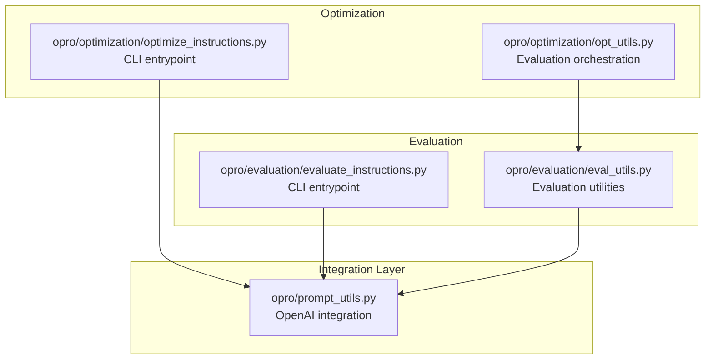
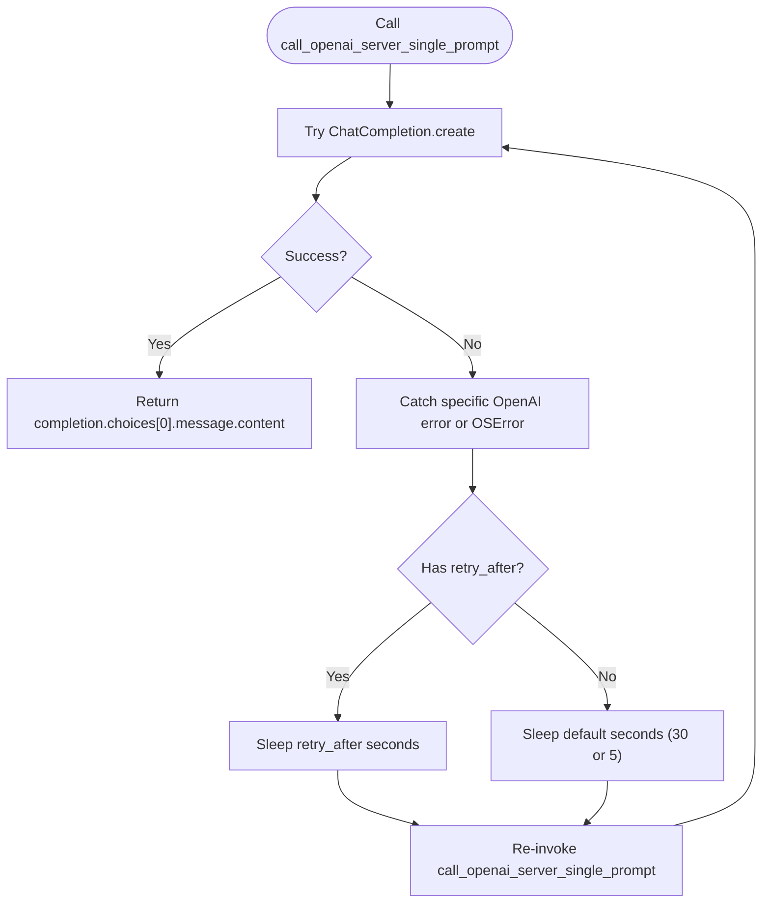
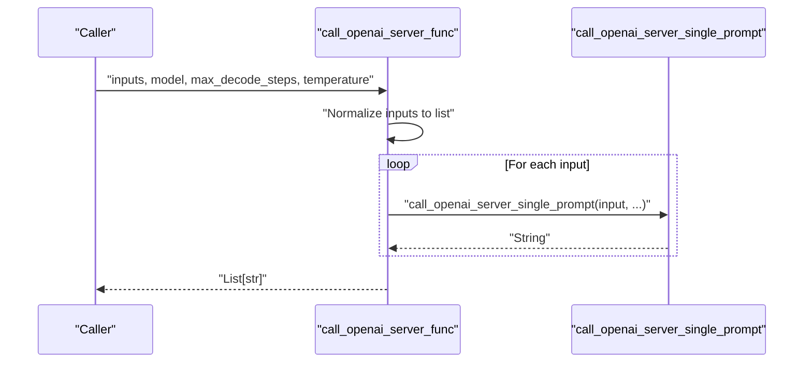
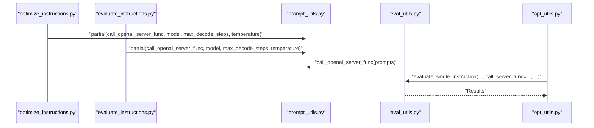
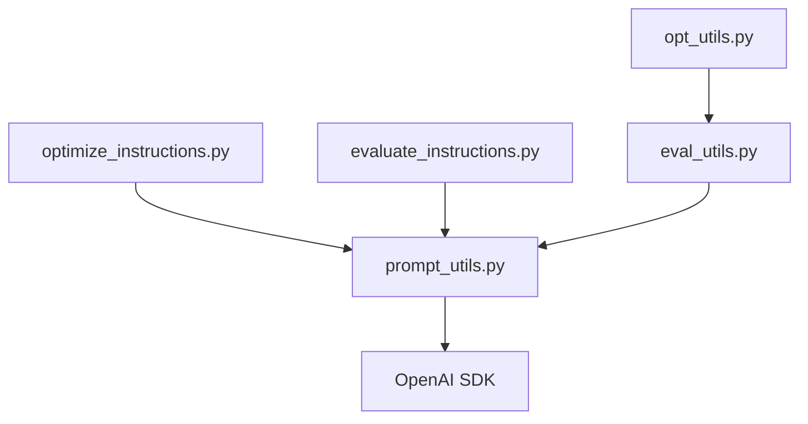

# OpenAI Integration

<cite>
**Referenced Files in This Document**
- [prompt_utils.py](file://opro/prompt_utils.py)
- [optimize_instructions.py](file://opro/optimization/optimize_instructions.py)
- [evaluate_instructions.py](file://opro/evaluation/evaluate_instructions.py)
- [eval_utils.py](file://opro/evaluation/eval_utils.py)
- [opt_utils.py](file://opro/optimization/opt_utils.py)
</cite>

## Table of Contents
1. [Introduction](#introduction)
2. [Project Structure](#project-structure)
3. [Core Components](#core-components)
4. [Architecture Overview](#architecture-overview)
5. [Detailed Component Analysis](#detailed-component-analysis)
6. [Dependency Analysis](#dependency-analysis)
7. [Performance Considerations](#performance-considerations)
8. [Troubleshooting Guide](#troubleshooting-guide)
9. [Conclusion](#conclusion)
10. [Appendices](#appendices)

## Introduction
This document describes the OpenAI integration functions in the repository’s prompt utilities module. It focuses on two primary functions:
- call_openai_server_single_prompt: synchronous single prompt invocation with robust error handling and retry logic.
- call_openai_server_func: batch wrapper that iterates over inputs and invokes the single prompt function for each.

It also explains how these functions are used by the optimization and evaluation modules to generate and score prompts, along with best practices for rate limiting, thread safety, and performance implications of synchronous retries.

## Project Structure
The OpenAI integration resides in a dedicated module and is consumed by both optimization and evaluation scripts. The following diagram shows the relevant parts of the repository structure and how the modules interact.



**Diagram sources**
- [prompt_utils.py](file://opro/prompt_utils.py#L21-L103)
- [optimize_instructions.py](file://opro/optimization/optimize_instructions.py#L290-L310)
- [evaluate_instructions.py](file://opro/evaluation/evaluate_instructions.py#L288-L300)
- [eval_utils.py](file://opro/evaluation/eval_utils.py#L340-L379)
- [opt_utils.py](file://opro/optimization/opt_utils.py#L520-L542)

**Section sources**
- [prompt_utils.py](file://opro/prompt_utils.py#L1-L133)
- [optimize_instructions.py](file://opro/optimization/optimize_instructions.py#L288-L310)
- [evaluate_instructions.py](file://opro/evaluation/evaluate_instructions.py#L288-L300)
- [eval_utils.py](file://opro/evaluation/eval_utils.py#L340-L379)
- [opt_utils.py](file://opro/optimization/opt_utils.py#L520-L542)

## Core Components
- call_openai_server_single_prompt
  - Purpose: Invoke the OpenAI ChatCompletion API with a single prompt string.
  - Parameters:
    - prompt: Input string to send to the model.
    - model: Model identifier (default: "gpt-3.5-turbo").
    - temperature: Sampling temperature (default: 0.8).
    - max_decode_steps: Maximum tokens to generate (default: 20).
  - Return type: String containing the model’s response content.
  - Error handling: Catches and retries on Timeout, RateLimitError, APIError, APIConnectionError, ServiceUnavailableError, and OSError. On each error, prints a message and sleeps for a computed or fixed interval before retrying.
  - Retry logic:
    - For errors with a retry_after attribute, uses that value; otherwise defaults to 30 seconds for most OpenAI errors and 5 seconds for OSError.
- call_openai_server_func
  - Purpose: Batch wrapper that accepts either a single string or a list of strings and returns a list of strings.
  - Behavior: Converts a single string to a list, then iterates over inputs, invoking call_openai_server_single_prompt for each input, and collects results in order.

**Section sources**
- [prompt_utils.py](file://opro/prompt_utils.py#L21-L103)

## Architecture Overview
The integration functions are used by CLI entrypoints that configure API keys and model parameters, then pass a partialized function to downstream evaluation or optimization utilities.

```mermaid
sequenceDiagram
participant CLI as "CLI Entrypoint"
participant Config as "Model Config"
participant PU as "prompt_utils.py"
participant Eval as "eval_utils.py"
participant Opt as "opt_utils.py"
CLI->>Config : "Set API keys and model params"
CLI->>PU : "partial(call_openai_server_func, model, max_decode_steps, temperature)"
CLI->>Eval : "call_scorer_server_func = partial(...)"
CLI->>Opt : "call_scorer_server_func / call_optimizer_server_func"
Eval->>PU : "call_openai_server_func(prompts)"
Opt->>PU : "call_openai_server_func(prompts)"
PU-->>Eval : "List[str]"
PU-->>Opt : "List[str]"
```

**Diagram sources**
- [optimize_instructions.py](file://opro/optimization/optimize_instructions.py#L290-L310)
- [evaluate_instructions.py](file://opro/evaluation/evaluate_instructions.py#L288-L300)
- [eval_utils.py](file://opro/evaluation/eval_utils.py#L340-L379)
- [opt_utils.py](file://opro/optimization/opt_utils.py#L520-L542)
- [prompt_utils.py](file://opro/prompt_utils.py#L87-L103)

## Detailed Component Analysis

### call_openai_server_single_prompt
- Implementation highlights:
  - Uses openai.ChatCompletion.create with model, temperature, max_tokens, and a single-user message.
  - Extracts the assistant’s response content from choices[0].message.content.
  - Comprehensive exception handling with retry logic for:
    - Timeout
    - RateLimitError
    - APIError
    - APIConnectionError
    - ServiceUnavailableError
    - OSError
  - Retry intervals:
    - For errors with retry_after attribute: use that value.
    - Otherwise: 30 seconds for most OpenAI-related errors; 5 seconds for OSError.
  - Recursively retries by calling itself with the same parameters.



**Diagram sources**
- [prompt_utils.py](file://opro/prompt_utils.py#L21-L85)

**Section sources**
- [prompt_utils.py](file://opro/prompt_utils.py#L21-L85)

### call_openai_server_func
- Implementation highlights:
  - Accepts either a single string or a list of strings.
  - Normalizes single string to a list.
  - Iterates over inputs and calls call_openai_server_single_prompt for each.
  - Returns a list of strings in the same order as the inputs.



**Diagram sources**
- [prompt_utils.py](file://opro/prompt_utils.py#L87-L103)

**Section sources**
- [prompt_utils.py](file://opro/prompt_utils.py#L87-L103)

### Usage in Optimization and Evaluation Modules
- Optimization:
  - The optimization entrypoint configures OpenAI API keys and creates a partialized function using call_openai_server_func with model, max_decode_steps, and temperature.
  - It tests the server by invoking the partialized function with a short prompt.
  - The scoring and optimization loops rely on call_scorer_server_func and call_optimizer_server_func to generate candidate instructions and evaluate them.
- Evaluation:
  - The evaluation entrypoint similarly configures OpenAI and constructs call_scorer_server_func.
  - It passes this function to evaluation utilities, which call it to obtain model outputs for scoring.



**Diagram sources**
- [optimize_instructions.py](file://opro/optimization/optimize_instructions.py#L290-L310)
- [evaluate_instructions.py](file://opro/evaluation/evaluate_instructions.py#L288-L300)
- [eval_utils.py](file://opro/evaluation/eval_utils.py#L340-L379)
- [opt_utils.py](file://opro/optimization/opt_utils.py#L520-L542)
- [prompt_utils.py](file://opro/prompt_utils.py#L87-L103)

**Section sources**
- [optimize_instructions.py](file://opro/optimization/optimize_instructions.py#L290-L310)
- [evaluate_instructions.py](file://opro/evaluation/evaluate_instructions.py#L288-L300)
- [eval_utils.py](file://opro/evaluation/eval_utils.py#L340-L379)
- [opt_utils.py](file://opro/optimization/opt_utils.py#L520-L542)
- [prompt_utils.py](file://opro/prompt_utils.py#L87-L103)

## Dependency Analysis
- Internal dependencies:
  - Both optimization and evaluation entrypoints import prompt_utils and construct partialized functions for OpenAI.
  - Evaluation utilities accept a call_server_func parameter and invoke it to obtain model outputs.
- External dependencies:
  - The functions depend on the OpenAI SDK for ChatCompletion and error types.
  - They use time.sleep for retry delays.



**Diagram sources**
- [optimize_instructions.py](file://opro/optimization/optimize_instructions.py#L290-L310)
- [evaluate_instructions.py](file://opro/evaluation/evaluate_instructions.py#L288-L300)
- [eval_utils.py](file://opro/evaluation/eval_utils.py#L340-L379)
- [opt_utils.py](file://opro/optimization/opt_utils.py#L520-L542)
- [prompt_utils.py](file://opro/prompt_utils.py#L16-L20)

**Section sources**
- [optimize_instructions.py](file://opro/optimization/optimize_instructions.py#L290-L310)
- [evaluate_instructions.py](file://opro/evaluation/evaluate_instructions.py#L288-L300)
- [eval_utils.py](file://opro/evaluation/eval_utils.py#L340-L379)
- [opt_utils.py](file://opro/optimization/opt_utils.py#L520-L542)
- [prompt_utils.py](file://opro/prompt_utils.py#L16-L20)

## Performance Considerations
- Synchronous retries:
  - The functions perform blocking sleeps during retries, which can significantly increase latency when encountering frequent rate limits or transient errors.
  - For high-throughput scenarios, consider asynchronous retries or concurrency controls to avoid blocking the main thread.
- Batch processing:
  - call_openai_server_func processes inputs sequentially. For improved throughput, consider parallelizing calls while respecting rate limits and avoiding burst spikes.
- Token budget:
  - max_decode_steps controls output length. Larger values increase cost and latency; tune based on task requirements.
- Temperature:
  - Higher temperature increases randomness. For deterministic scoring or optimization, keep temperature low.

[No sources needed since this section provides general guidance]

## Troubleshooting Guide
Common issues and remedies:
- Rate limit exceeded:
  - The function retries automatically after a delay. If errors persist, reduce batch size or temperature, or increase sleep intervals externally.
- Timeout or service unavailability:
  - The function retries with a default delay. Consider adding jitter or exponential backoff if needed.
- API connection errors:
  - Retries with a small delay. Verify network connectivity and API key configuration.
- OSError:
  - Retries quickly; investigate underlying OS/network issues.

Operational tips:
- Monitor logs for retry messages to gauge error frequency.
- For evaluation and optimization loops, consider wrapping call_server_func with higher-level retry logic (as seen in evaluation utilities) to handle transient failures across batches.

**Section sources**
- [prompt_utils.py](file://opro/prompt_utils.py#L36-L84)
- [eval_utils.py](file://opro/evaluation/eval_utils.py#L340-L379)

## Conclusion
The OpenAI integration functions provide a simple, robust interface for single and batch prompt invocations with built-in retry logic for common API errors. They are integrated into both optimization and evaluation workflows to generate and score prompts. For production-scale usage, consider asynchronous retries, concurrency controls, and careful tuning of model parameters to balance quality, cost, and performance.

[No sources needed since this section summarizes without analyzing specific files]

## Appendices

### API Reference

- call_openai_server_single_prompt
  - Parameters:
    - prompt: string
    - model: string (default: "gpt-3.5-turbo")
    - temperature: float (default: 0.8)
    - max_decode_steps: int (default: 20)
  - Returns: string
  - Exceptions handled: Timeout, RateLimitError, APIError, APIConnectionError, ServiceUnavailableError, OSError
  - Retry intervals: Uses retry_after when available; otherwise 30 seconds for most OpenAI errors, 5 seconds for OSError

- call_openai_server_func
  - Parameters:
    - inputs: string or list[str]
    - model: string (default: "gpt-3.5-turbo")
    - temperature: float (default: 0.8)
    - max_decode_steps: int (default: 20)
  - Returns: list[str]

**Section sources**
- [prompt_utils.py](file://opro/prompt_utils.py#L21-L103)

### Example Usage References
- Single prompt invocation:
  - See the test call in optimization entrypoint where a short prompt is passed to the partialized function.
  - See the test call in evaluation entrypoint where a short prompt is passed to the partialized function.

- Batch prompt invocation:
  - The evaluation entrypoint constructs call_scorer_server_func and passes lists of prompts to it.
  - The optimization entrypoint constructs call_optimizer_server_func and passes lists of prompts to it.

**Section sources**
- [optimize_instructions.py](file://opro/optimization/optimize_instructions.py#L356-L368)
- [evaluate_instructions.py](file://opro/evaluation/evaluate_instructions.py#L297-L302)
- [eval_utils.py](file://opro/evaluation/eval_utils.py#L675-L716)
- [opt_utils.py](file://opro/optimization/opt_utils.py#L520-L542)