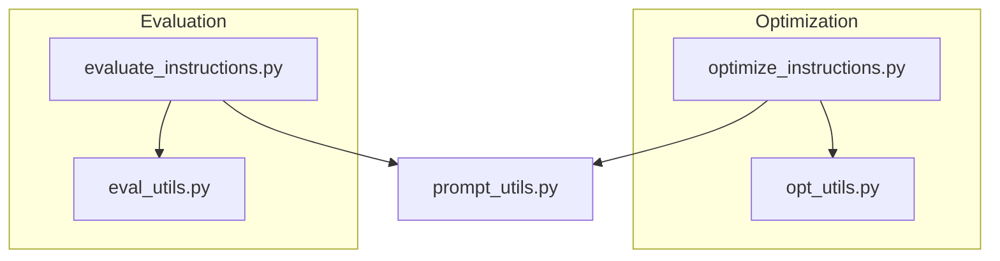
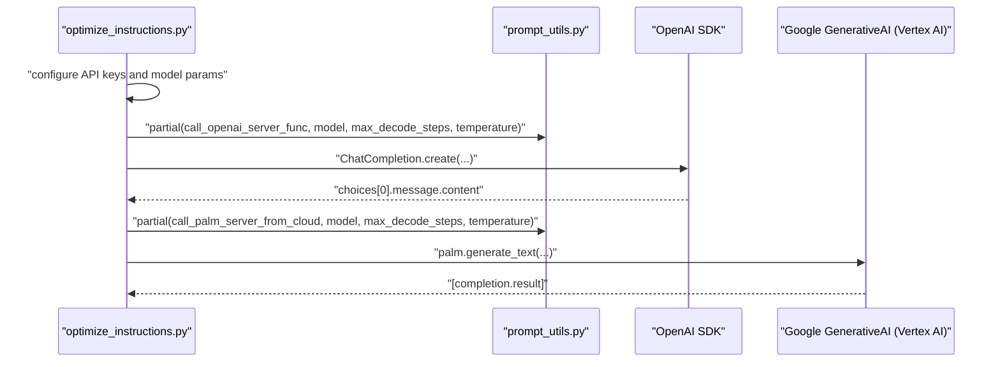
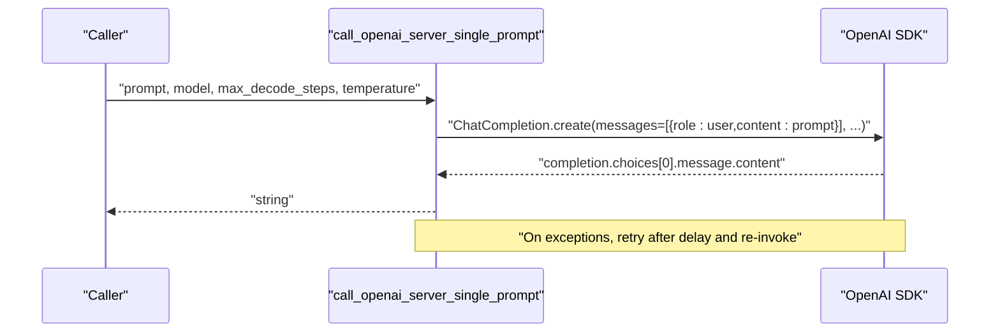
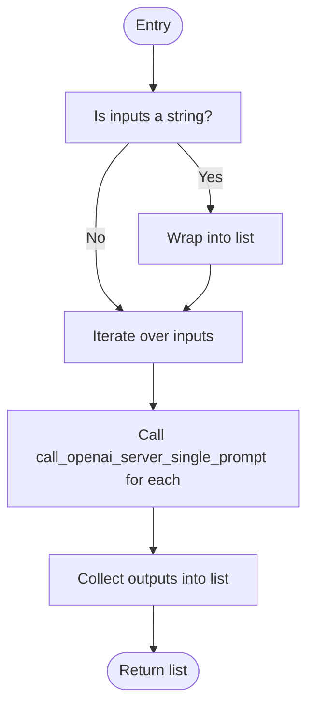
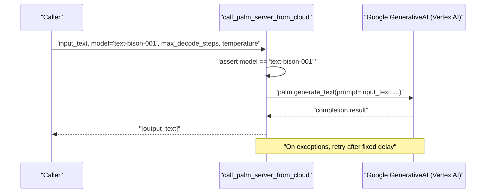
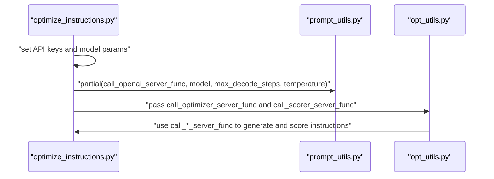
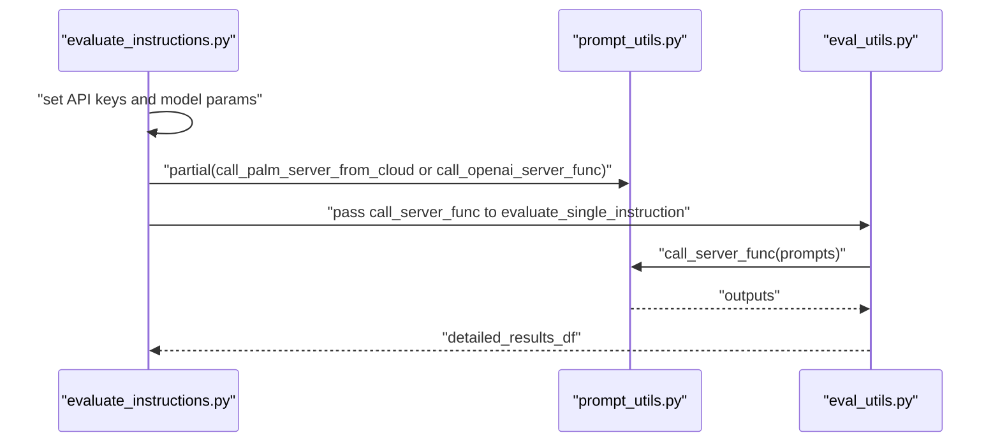
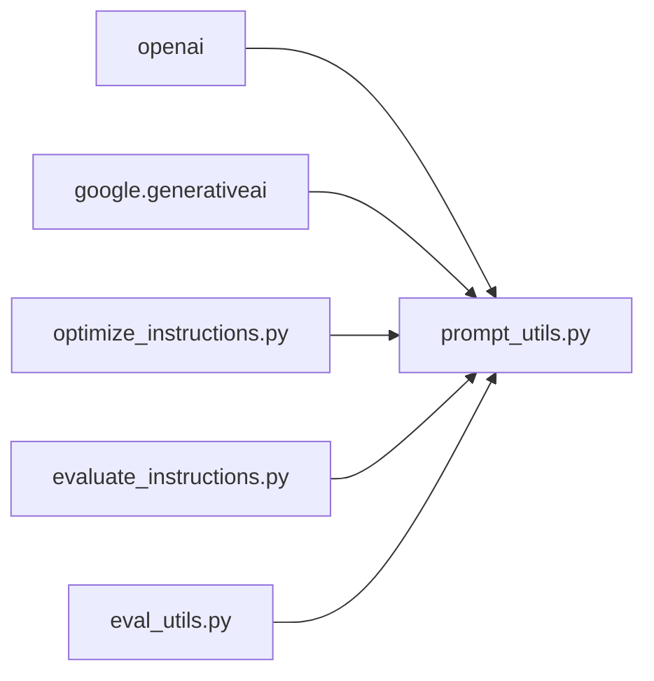

# Prompt Utilities

<cite>
**Referenced Files in This Document**
- [prompt_utils.py](file://opro/prompt_utils.py)
- [optimize_instructions.py](file://opro/optimization/optimize_instructions.py)
- [evaluate_instructions.py](file://opro/evaluation/evaluate_instructions.py)
- [opt_utils.py](file://opro/optimization/opt_utils.py)
- [eval_utils.py](file://opro/evaluation/eval_utils.py)
- [README.md](file://README.md)
</cite>

## Table of Contents
1. [Introduction](#introduction)
2. [Project Structure](#project-structure)
3. [Core Components](#core-components)
4. [Architecture Overview](#architecture-overview)
5. [Detailed Component Analysis](#detailed-component-analysis)
6. [Dependency Analysis](#dependency-analysis)
7. [Performance Considerations](#performance-considerations)
8. [Troubleshooting Guide](#troubleshooting-guide)
9. [Conclusion](#conclusion)

## Introduction
This document provides API documentation for the prompt utility functions in opro/prompt_utils.py. It covers:
- call_openai_server_single_prompt: single prompt interface to OpenAI Chat Completions
- call_openai_server_func: batch prompt interface to OpenAI Chat Completions
- call_palm_server_from_cloud: single prompt interface to Google PaLM Text Bison via Vertex AI

It also documents expected inputs, return types, error conditions, retry behavior, rate limiting considerations, performance characteristics, thread safety, and error recovery mechanisms. Finally, it explains how these utilities are used by higher-level optimization and evaluation modules.

## Project Structure
The prompt utilities are used by:
- Optimization pipeline: configure OpenAI or PaLM as scorer or optimizer and call the prompt utilities during instruction evolution
- Evaluation pipeline: configure a scorer model and call the prompt utilities to evaluate instructions

**Diagram sources**
- [optimize_instructions.py](file://opro/optimization/optimize_instructions.py#L240-L368)
- [evaluate_instructions.py](file://opro/evaluation/evaluate_instructions.py#L238-L303)
- [prompt_utils.py](file://opro/prompt_utils.py#L21-L133)

**Section sources**
- [README.md](file://README.md#L14-L24)
- [optimize_instructions.py](file://opro/optimization/optimize_instructions.py#L240-L368)
- [evaluate_instructions.py](file://opro/evaluation/evaluate_instructions.py#L238-L303)

## Core Components
- call_openai_server_single_prompt(prompt, model="gpt-3.5-turbo", max_decode_steps=20, temperature=0.8)
  - Purpose: Call OpenAI Chat Completions with a single string prompt
  - Returns: string (the model’s message content)
  - Errors handled: Timeout, RateLimitError, APIError, APIConnectionError, ServiceUnavailableError, OSError
  - Retry behavior: On errors, prints a message and retries after a computed or fixed delay
- call_openai_server_func(inputs, model="gpt-3.5-turbo", max_decode_steps=20, temperature=0.8)
  - Purpose: Call OpenAI Chat Completions with a list of prompts
  - Returns: list of strings (one per input)
  - Behavior: Converts a single string input to a list and iterates over inputs, calling the single-prompt function for each
- call_palm_server_from_cloud(input_text, model="text-bison-001", max_decode_steps=20, temperature=0.8)
  - Purpose: Call Google PaLM Text Bison via Vertex AI generate_text
  - Returns: list containing a single string (the generated text)
  - Model requirement: Asserts model name equals "text-bison-001"
  - Retry behavior: On exceptions, prints a message and retries after a fixed delay

**Section sources**
- [prompt_utils.py](file://opro/prompt_utils.py#L21-L133)

## Architecture Overview
The prompt utilities integrate with higher-level modules via partial functions and flags-driven configuration. The optimization and evaluation scripts set up API keys, configure model parameters, and pass callables to downstream utilities.

**Diagram sources**
- [optimize_instructions.py](file://opro/optimization/optimize_instructions.py#L240-L368)
- [prompt_utils.py](file://opro/prompt_utils.py#L21-L133)

## Detailed Component Analysis

### call_openai_server_single_prompt
- Parameters
  - prompt: string (the user message content)
  - model: string (default "gpt-3.5-turbo")
  - max_decode_steps: integer (default 20)
  - temperature: float (default 0.8)
- Returns
  - string: the model’s message content
- Error conditions and handling
  - Timeout: retry after retry_after seconds or default 30 seconds
  - RateLimitError: retry after retry_after seconds or default 30 seconds
  - APIError: retry after retry_after seconds or default 30 seconds
  - APIConnectionError: retry after retry_after seconds or default 30 seconds
  - ServiceUnavailableError: retry after retry_after seconds or default 30 seconds
  - OSError: retry after 5 seconds
- Thread safety
  - The function performs blocking I/O and recursion for retries; it is not inherently thread-safe. Concurrent callers should manage synchronization externally.
- Performance characteristics
  - Single prompt call; latency dominated by network and model response time. Retries add additional latency on error.
- Example usage
  - See optimization script test calls and partial usage patterns.

**Diagram sources**
- [prompt_utils.py](file://opro/prompt_utils.py#L21-L84)

**Section sources**
- [prompt_utils.py](file://opro/prompt_utils.py#L21-L84)

### call_openai_server_func
- Parameters
  - inputs: string or list of strings
  - model: string (default "gpt-3.5-turbo")
  - max_decode_steps: integer (default 20)
  - temperature: float (default 0.8)
- Returns
  - list of strings: one output per input
- Processing logic
  - If inputs is a string, wraps it into a list
  - Iterates over inputs and calls call_openai_server_single_prompt for each
- Thread safety
  - Not inherently thread-safe due to potential recursive retries and shared state; external synchronization is recommended.
- Performance characteristics
  - Batch-like behavior via iteration; overall latency scales with number of inputs and error rates.

**Diagram sources**
- [prompt_utils.py](file://opro/prompt_utils.py#L87-L103)

**Section sources**
- [prompt_utils.py](file://opro/prompt_utils.py#L87-L103)

### call_palm_server_from_cloud
- Parameters
  - input_text: string (asserted)
  - model: string (asserted to be "text-bison-001")
  - max_decode_steps: integer (default 20)
  - temperature: float (default 0.8)
- Returns
  - list containing a single string: [output_text]
- Model requirements
  - Requires Vertex AI configured with a valid API key
  - Asserts model name equals "text-bison-001"
- Retry behavior
  - On any exception, prints a message and retries after a fixed delay
- Thread safety
  - Not inherently thread-safe; external synchronization recommended.
- Performance characteristics
  - Single prompt call; latency depends on network and model response time; retry adds overhead.

**Diagram sources**
- [prompt_utils.py](file://opro/prompt_utils.py#L105-L133)

**Section sources**
- [prompt_utils.py](file://opro/prompt_utils.py#L105-L133)

### Usage in Optimization Pipeline
- The optimization script configures OpenAI or PaLM as scorer or optimizer and creates partial functions bound to model parameters.
- These partial functions are passed to the optimization utilities and evaluation utilities.

**Diagram sources**
- [optimize_instructions.py](file://opro/optimization/optimize_instructions.py#L240-L368)
- [opt_utils.py](file://opro/optimization/opt_utils.py#L568-L799)

**Section sources**
- [optimize_instructions.py](file://opro/optimization/optimize_instructions.py#L240-L368)
- [opt_utils.py](file://opro/optimization/opt_utils.py#L568-L799)

### Usage in Evaluation Pipeline
- The evaluation script configures the scorer model and creates a partial function bound to model parameters.
- The evaluation utilities call the scorer function to compute instruction scores.

**Diagram sources**
- [evaluate_instructions.py](file://opro/evaluation/evaluate_instructions.py#L238-L303)
- [eval_utils.py](file://opro/evaluation/eval_utils.py#L536-L760)

**Section sources**
- [evaluate_instructions.py](file://opro/evaluation/evaluate_instructions.py#L238-L303)
- [eval_utils.py](file://opro/evaluation/eval_utils.py#L536-L760)

## Dependency Analysis
- External dependencies
  - OpenAI SDK for Chat Completions
  - Google GenerativeAI (Vertex AI) for PaLM Text Bison
- Internal dependencies
  - Optimization and evaluation scripts depend on prompt utilities via partial functions
  - Evaluation utilities depend on prompt utilities to obtain raw answers

**Diagram sources**
- [prompt_utils.py](file://opro/prompt_utils.py#L16-L19)
- [optimize_instructions.py](file://opro/optimization/optimize_instructions.py#L54-L61)
- [evaluate_instructions.py](file://opro/evaluation/evaluate_instructions.py#L52-L60)
- [eval_utils.py](file://opro/evaluation/eval_utils.py#L31-L34)

**Section sources**
- [prompt_utils.py](file://opro/prompt_utils.py#L16-L19)
- [README.md](file://README.md#L14-L24)

## Performance Considerations
- Latency
  - Each call performs network I/O; latency is dominated by model response time and retries.
- Throughput
  - call_openai_server_func serially iterates over inputs; parallelism is not implemented inside the function itself.
- Concurrency
  - Not thread-safe; concurrent calls may interfere with retries and shared state.
- Cost
  - Calling OpenAI or PaLM APIs can be expensive; consider reducing max_decode_steps or limiting calls during development.

[No sources needed since this section provides general guidance]

## Troubleshooting Guide
- Common error conditions and retry behavior
  - OpenAI
    - Timeout: retry after retry_after seconds or default 30 seconds
    - RateLimitError: retry after retry_after seconds or default 30 seconds
    - APIError: retry after retry_after seconds or default 30 seconds
    - APIConnectionError: retry after retry_after seconds or default 30 seconds
    - ServiceUnavailableError: retry after retry_after seconds or default 30 seconds
    - OSError: retry after 5 seconds
  - PaLM
    - Any exception: retry after a fixed delay
- Recommendations
  - Increase delays cautiously to respect quotas
  - Reduce max_decode_steps to reduce cost and latency
  - Use partial functions to standardize model parameters across the pipeline
  - For OpenAI, ensure API key is configured before calling

**Section sources**
- [prompt_utils.py](file://opro/prompt_utils.py#L36-L84)
- [prompt_utils.py](file://opro/prompt_utils.py#L117-L133)

## Conclusion
The prompt utilities provide simple, robust interfaces to OpenAI and Google PaLM APIs with built-in retry logic for common transient errors. They are integrated into the optimization and evaluation pipelines via partial functions, enabling consistent configuration and reuse across experiments. Users should be mindful of rate limits, cost, and thread safety when invoking these utilities at scale.