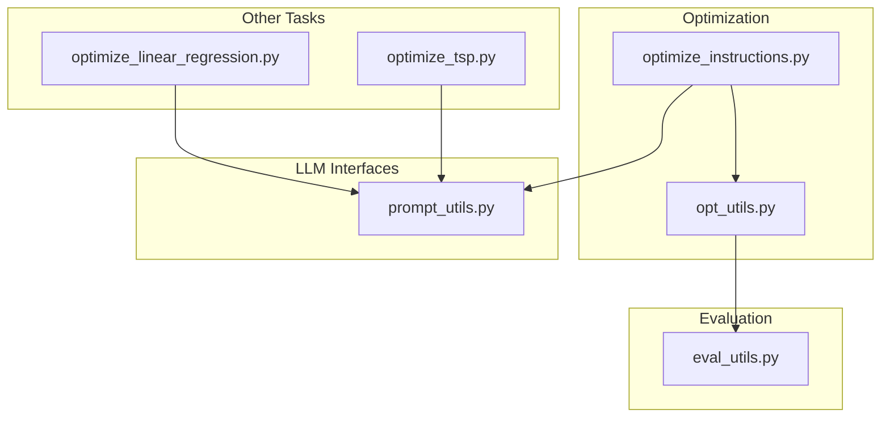
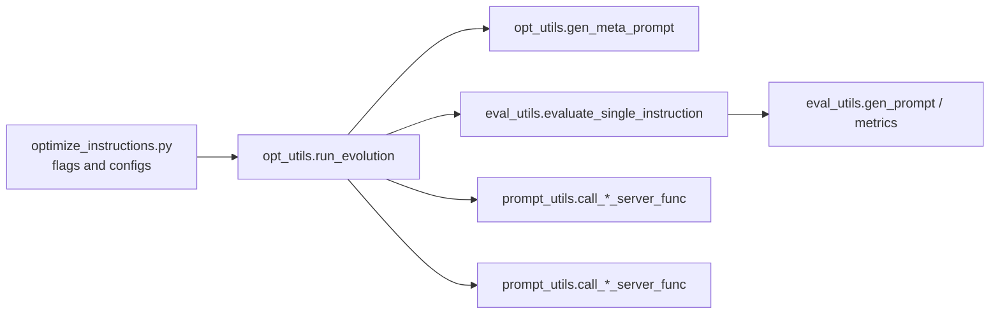

# Advanced Configuration

<cite>
**Referenced Files in This Document**
- [README.md](file://README.md)
- [optimize_instructions.py](file://opro/optimization/optimize_instructions.py)
- [opt_utils.py](file://opro/optimization/opt_utils.py)
- [prompt_utils.py](file://opro/prompt_utils.py)
- [eval_utils.py](file://opro/evaluation/eval_utils.py)
- [optimize_linear_regression.py](file://opro/optimization/optimize_linear_regression.py)
- [optimize_tsp.py](file://opro/optimization/optimize_tsp.py)
</cite>

## Table of Contents
1. [Introduction](#introduction)
2. [Project Structure](#project-structure)
3. [Core Components](#core-components)
4. [Architecture Overview](#architecture-overview)
5. [Detailed Component Analysis](#detailed-component-analysis)
6. [Dependency Analysis](#dependency-analysis)
7. [Performance Considerations](#performance-considerations)
8. [Troubleshooting Guide](#troubleshooting-guide)
9. [Conclusion](#conclusion)
10. [Appendices](#appendices)

## Introduction
This document provides advanced configuration guidance for the opro optimization framework. It focuses on less commonly used parameters such as custom temperature schedules, score bucketing strategies, few-shot QA pair inclusion, and meta-prompt templating options. It also explains how to tune parameters like num_generated_instructions_in_each_step and old_instruction_score_threshold to optimize behavior across problem types, and how different meta_prompt_types influence optimizer behavior. Guidance is provided for balancing batch sizes and decode steps for performance versus quality trade-offs, along with example configuration profiles for rapid prototyping and production optimization. Finally, it covers environment variable usage and configuration file patterns, and discusses the implications of settings on API costs and optimization convergence.

## Project Structure
The optimization pipeline centers around a prompt optimization script that orchestrates scoring and optimization using external LLM APIs. Supporting modules handle prompting, evaluation, and meta-prompt construction.



**Diagram sources**
- [optimize_instructions.py](file://opro/optimization/optimize_instructions.py#L1-L120)
- [opt_utils.py](file://opro/optimization/opt_utils.py#L1-L120)
- [eval_utils.py](file://opro/evaluation/eval_utils.py#L1-L120)
- [prompt_utils.py](file://opro/prompt_utils.py#L1-L133)
- [optimize_linear_regression.py](file://opro/optimization/optimize_linear_regression.py#L1-L120)
- [optimize_tsp.py](file://opro/optimization/optimize_tsp.py#L1-L120)

**Section sources**
- [README.md](file://README.md#L1-L79)
- [optimize_instructions.py](file://opro/optimization/optimize_instructions.py#L1-L120)

## Core Components
- Prompt optimization entrypoint: defines flags for scorer/optimizer models, dataset/task selection, instruction position, and meta-prompt type. It constructs model-specific serving configurations and initializes the evolution loop.
- Meta-prompt generator: builds the meta-prompt from historical instructions and optionally few-shot QA exemplars, controlling instruction placement and formatting.
- Evolution engine: manages the iterative process, including temperature scheduling, few-shot selection criteria, score bucketing, and evaluation cadence.
- Scoring and evaluation utilities: generate prompts, call LLMs, parse outputs, and compute accuracy metrics.
- LLM interface wrappers: encapsulate API calls and error handling for OpenAI and PaLM models.

Key advanced configuration parameters:
- Temperature scheduling: constant or linear increase during evolution.
- Score bucketing: integer bucketization of floating accuracy scores.
- Few-shot QA inclusion: toggles exemplars in meta-prompt and selection criteria.
- Meta-prompt type: “both_instructions_and_exemplars” vs “instructions_only”.
- Instruction generation controls: num_generated_instructions_in_each_step, old_instruction_score_threshold.
- Batch size and decode steps: model serving parameters affecting throughput and quality.

**Section sources**
- [optimize_instructions.py](file://opro/optimization/optimize_instructions.py#L680-L800)
- [opt_utils.py](file://opro/optimization/opt_utils.py#L400-L430)
- [opt_utils.py](file://opro/optimization/opt_utils.py#L433-L790)
- [opt_utils.py](file://opro/optimization/opt_utils.py#L90-L170)
- [eval_utils.py](file://opro/evaluation/eval_utils.py#L536-L800)
- [prompt_utils.py](file://opro/prompt_utils.py#L21-L133)

## Architecture Overview
The optimization workflow integrates configuration, meta-prompt construction, instruction generation, scoring, and evaluation.

```mermaid
sequenceDiagram
participant CLI as "optimize_instructions.py"
participant OU as "opt_utils.run_evolution"
participant MP as "opt_utils.gen_meta_prompt"
participant OPT as "prompt_utils.call_*_server_func"
participant SC as "prompt_utils.call_*_server_func"
participant EVAL as "eval_utils.evaluate_single_instruction"
CLI->>OU : "Initialize configs and flags"
OU->>MP : "Build meta-prompt with history and exemplars"
MP-->>OU : "Meta-prompt string"
OU->>OPT : "Generate instructions (temperature schedule)"
OPT-->>OU : "Raw outputs"
OU->>EVAL : "Score instructions on training data"
EVAL-->>OU : "Accuracy metrics"
OU-->>CLI : "Save results and configs"
```

**Diagram sources**
- [optimize_instructions.py](file://opro/optimization/optimize_instructions.py#L680-L800)
- [opt_utils.py](file://opro/optimization/opt_utils.py#L338-L430)
- [opt_utils.py](file://opro/optimization/opt_utils.py#L690-L790)
- [eval_utils.py](file://opro/evaluation/eval_utils.py#L536-L800)
- [prompt_utils.py](file://opro/prompt_utils.py#L21-L133)

## Detailed Component Analysis

### Advanced Configuration Parameters

#### Temperature Schedules
- Purpose: Control exploration/exploitation balance during instruction generation.
- Options:
  - Constant temperature: fixed across steps.
  - Linear increase: ramp from a starting temperature to a configurable end temperature over the course of evolution.
- Implementation:
  - Temperature schedule and end temperature are saved to JSON and applied per step.
  - During each step, the current temperature is computed and passed to the optimizer LLM call.
- Tuning guidance:
  - Start with constant temperature for stability.
  - Use linear increase to encourage diversity early, then converge with lower temperature later.

**Section sources**
- [opt_utils.py](file://opro/optimization/opt_utils.py#L400-L430)
- [opt_utils.py](file://opro/optimization/opt_utils.py#L568-L585)

#### Score Bucketing Strategies
- Purpose: Reduce noise and stabilize meta-prompt presentation by grouping continuous accuracy scores into discrete buckets.
- Controls:
  - num_score_buckets: integer number of buckets; defaults to a large value to effectively disable bucketization.
  - Bucketization function rounds normalized scores to bucket indices.
- Impact:
  - Smaller bucket counts reduce granularity and may improve signal-to-noise in meta-prompts.
  - Larger counts preserve precision for fine-grained comparisons.
- Practical note:
  - Bucketization is applied when constructing instruction-score substrings for the meta-prompt.

**Section sources**
- [opt_utils.py](file://opro/optimization/opt_utils.py#L47-L51)
- [opt_utils.py](file://opro/optimization/opt_utils.py#L52-L88)
- [opt_utils.py](file://opro/optimization/opt_utils.py#L90-L170)

#### Few-Shot QA Pair Inclusion
- Purpose: Provide recent or representative examples to guide instruction refinement.
- Controls:
  - few_shot_qa_pairs: toggle inclusion of exemplars in meta-prompt.
  - few_shot_selection_criteria: accumulative_most_frequent, current_most_frequent, random, constant.
  - num_few_shot_questions_for_instruction_refinement: number of exemplars selected per step.
  - evaluate_generated_ins_on_few_shot and evaluate_old_ins_on_few_shot: toggles for evaluation cadence.
- Behavior:
  - Selection criteria determine which training examples are shown as exemplars.
  - Exemplars are inserted before or after instruction-score history depending on instructions_before_exemplars.
- Tuning guidance:
  - Use current_most_frequent to focus on mistakes made by recently shown instructions.
  - Use accumulative_most_frequent to target persistent difficulties across the run.
  - Use random or constant for broader coverage or reproducibility.

**Section sources**
- [optimize_instructions.py](file://opro/optimization/optimize_instructions.py#L701-L723)
- [opt_utils.py](file://opro/optimization/opt_utils.py#L586-L707)
- [opt_utils.py](file://opro/optimization/opt_utils.py#L709-L790)

#### Meta-Prompt Templating Options
- Types:
  - both_instructions_and_exemplars: includes historical instruction-score pairs and dataset exemplars.
  - instructions_only: includes only historical instruction-score pairs without dataset exemplars.
- Instruction placement:
  - instruction_pos: before_Q, Q_begin, Q_end, A_begin.
- Formatting:
  - Optimizer-specific instructions differ for GPT vs PaLM.
  - Exemplars include question-answer pairs and optional QA markers.
- Tuning guidance:
  - Use both_instructions_and_exemplars for fine-tuned optimizers.
  - Use instructions_only for pre-trained optimizers to reduce prompt length and focus on instruction history.

**Section sources**
- [optimize_instructions.py](file://opro/optimization/optimize_instructions.py#L89-L101)
- [opt_utils.py](file://opro/optimization/opt_utils.py#L90-L170)
- [opt_utils.py](file://opro/optimization/opt_utils.py#L171-L335)

#### Instruction Generation Controls
- num_generated_instructions_in_each_step: number of candidate instructions generated per step; independent of model serving decodes.
- old_instruction_score_threshold: minimum score threshold for including historical instructions in meta-prompts.
- Tuning guidance:
  - Increase num_generated_instructions_in_each_step to boost exploration; monitor API costs.
  - Adjust old_instruction_score_threshold to filter low-quality history and reduce prompt clutter.

**Section sources**
- [optimize_instructions.py](file://opro/optimization/optimize_instructions.py#L701-L723)
- [opt_utils.py](file://opro/optimization/opt_utils.py#L338-L430)

### Environment Variables and Configuration Files
- Environment variables:
  - OPENAI_API_KEY and PALM_API_KEY are required when using GPT or PaLM models, respectively.
- Configuration files:
  - configs_dict.json is saved during evolution to capture model and runtime settings.
  - Additional task-specific configs are saved in separate JSON files for linear regression and TSP.

**Section sources**
- [optimize_instructions.py](file://opro/optimization/optimize_instructions.py#L60-L108)
- [opt_utils.py](file://opro/optimization/opt_utils.py#L414-L426)
- [optimize_linear_regression.py](file://opro/optimization/optimize_linear_regression.py#L312-L355)
- [optimize_tsp.py](file://opro/optimization/optimize_tsp.py#L352-L355)

### Performance Tuning: Batch Sizes and Decode Steps
- Model serving parameters:
  - batch_size: number of prompts processed per server call.
  - max_decode_steps: maximum tokens for decoding.
  - num_decodes: number of outputs per prompt (scorer).
  - num_servers: number of inference servers used in parallel evaluation.
- Trade-offs:
  - Larger batch_size increases throughput but may raise latency and memory pressure.
  - Higher max_decode_steps improves output completeness but increases cost and latency.
  - num_decodes affects scoring robustness; higher values improve accuracy estimation but increase cost.
- Recommendations:
  - Start with conservative batch_size and adjust based on observed throughput and latency.
  - Use parallel evaluation for GPT scorers; disable for OpenAI models to avoid rate limits.
  - Tune max_decode_steps according to task complexity and model behavior.

**Section sources**
- [optimize_instructions.py](file://opro/optimization/optimize_instructions.py#L240-L354)
- [optimize_instructions.py](file://opro/optimization/optimize_instructions.py#L356-L369)
- [eval_utils.py](file://opro/evaluation/eval_utils.py#L536-L800)
- [prompt_utils.py](file://opro/prompt_utils.py#L21-L133)

### Problem-Type Optimization Guidance
- Numerical tasks (e.g., GSM8K):
  - Treat predictions as numbers; adjust prediction_treat_as_number accordingly.
  - Consider fewer exemplars and simpler instruction positions to reduce noise.
- Multiple-choice tasks (e.g., MMLU):
  - Use instruction positions that place instructions near the question or answer start.
  - Include QA markers to improve parsing.
- Boolean tasks (e.g., BBH):
  - Use boolean-aware parsing and consider instruction positions that emphasize answer extraction.
- General:
  - Evaluate periodically using eval_interval to monitor convergence.
  - Adjust num_generated_instructions_in_each_step and old_instruction_score_threshold to balance exploration and exploitation.

**Section sources**
- [optimize_instructions.py](file://opro/optimization/optimize_instructions.py#L578-L606)
- [eval_utils.py](file://opro/evaluation/eval_utils.py#L536-L800)

### Example Configuration Profiles
- Rapid prototyping:
  - Use instructions_only meta-prompt type.
  - Set few_shot_qa_pairs=False to reduce prompt length.
  - Use constant temperature schedule.
  - Keep num_generated_instructions_in_each_step moderate and eval_interval higher to reduce cost.
  - Use small batch_size and modest max_decode_steps.
- Production optimization:
  - Use both_instructions_and_exemplars meta-prompt type.
  - Enable few_shot_qa_pairs with current_most_frequent selection.
  - Use linear_increase temperature schedule with a higher end temperature.
  - Increase num_generated_instructions_in_each_step and decrease old_instruction_score_threshold to include more history.
  - Use parallel evaluation for GPT scorers and larger batch_size where feasible.

**Section sources**
- [optimize_instructions.py](file://opro/optimization/optimize_instructions.py#L701-L723)
- [opt_utils.py](file://opro/optimization/opt_utils.py#L586-L707)
- [opt_utils.py](file://opro/optimization/opt_utils.py#L568-L585)

### API Cost Implications and Convergence
- Cost drivers:
  - Number of optimization steps × number of generated instructions per step × model serving parameters.
  - Few-shot exemplars increase prompt length and thus cost.
  - Parallel evaluation and higher num_decodes increase cost.
- Convergence:
  - Monitor eval_interval and accuracy trends to detect saturation.
  - Use score bucketing and thresholds to stabilize meta-prompts and reduce unnecessary churn.
  - Temperature scheduling influences exploration; tune to balance speed and quality.

**Section sources**
- [README.md](file://README.md#L59-L62)
- [opt_utils.py](file://opro/optimization/opt_utils.py#L414-L426)
- [opt_utils.py](file://opro/optimization/opt_utils.py#L568-L585)

## Dependency Analysis
The optimization pipeline depends on:
- Flag-driven configuration resolution.
- Model-specific serving wrappers for OpenAI and PaLM.
- Evaluation utilities for scoring and parsing.
- Meta-prompt construction integrating historical instructions and exemplars.



**Diagram sources**
- [optimize_instructions.py](file://opro/optimization/optimize_instructions.py#L680-L800)
- [opt_utils.py](file://opro/optimization/opt_utils.py#L338-L430)
- [eval_utils.py](file://opro/evaluation/eval_utils.py#L164-L260)
- [prompt_utils.py](file://opro/prompt_utils.py#L21-L133)

**Section sources**
- [optimize_instructions.py](file://opro/optimization/optimize_instructions.py#L680-L800)
- [opt_utils.py](file://opro/optimization/opt_utils.py#L338-L430)
- [eval_utils.py](file://opro/evaluation/eval_utils.py#L164-L260)
- [prompt_utils.py](file://opro/prompt_utils.py#L21-L133)

## Performance Considerations
- Throughput vs. quality:
  - Increase batch_size and num_decodes cautiously; measure latency and cost.
  - Use parallel evaluation judiciously; ensure server capacity.
- Prompt engineering:
  - Few-shot inclusion improves quality but increases cost; use selection criteria to balance.
  - Meta-prompt type impacts model behavior; choose based on optimizer finetuning.
- Temperature scheduling:
  - Linear increase can accelerate discovery; monitor accuracy to avoid over-exploration.

[No sources needed since this section provides general guidance]

## Troubleshooting Guide
- API errors and retries:
  - OpenAI wrapper handles timeouts, rate limits, API errors, connection errors, service unavailability, and OS errors with retry logic.
- Evaluation failures:
  - Retry mechanism and explicit assertions prevent silent failures; inspect logs for retry counts and sleep durations.
- Prompt formatting:
  - Ensure instruction_pos and dataset-specific formatting are correct; mismatches can lead to parsing errors.

**Section sources**
- [prompt_utils.py](file://opro/prompt_utils.py#L21-L133)
- [eval_utils.py](file://opro/evaluation/eval_utils.py#L338-L379)

## Conclusion
Advanced configuration in opro enables precise control over the optimization process. By tuning temperature schedules, score bucketing, few-shot exemplars, and meta-prompt templates—and by thoughtfully managing batch sizes and decode steps—you can balance quality and cost while adapting to different problem types. Use the provided configuration profiles as starting points and iterate based on convergence signals and budget constraints.

[No sources needed since this section summarizes without analyzing specific files]

## Appendices

### Appendix A: Parameter Reference
- Temperature scheduling:
  - optimizer_llm_temperature_schedule: constant | linear_increase
  - optimizer_llm_temperature_end: end temperature for linear increase
- Score bucketing:
  - num_score_buckets: integer or infinite
- Few-shot QA:
  - few_shot_qa_pairs: boolean
  - few_shot_selection_criteria: accumulative_most_frequent | current_most_frequent | random | constant
  - num_few_shot_questions_for_instruction_refinement: integer
  - evaluate_generated_ins_on_few_shot: boolean
  - evaluate_old_ins_on_few_shot: boolean
- Meta-prompt:
  - meta_prompt_type: both_instructions_and_exemplars | instructions_only
  - meta_prompt_instructions_before_exemplars: boolean
  - instruction_pos: before_Q | Q_begin | Q_end | A_begin
- Instruction generation:
  - num_generated_instructions_in_each_step: integer
  - old_instruction_score_threshold: float
- Serving parameters:
  - batch_size, max_decode_steps, num_decodes, num_servers

**Section sources**
- [opt_utils.py](file://opro/optimization/opt_utils.py#L400-L430)
- [opt_utils.py](file://opro/optimization/opt_utils.py#L586-L707)
- [opt_utils.py](file://opro/optimization/opt_utils.py#L90-L170)
- [optimize_instructions.py](file://opro/optimization/optimize_instructions.py#L701-L723)