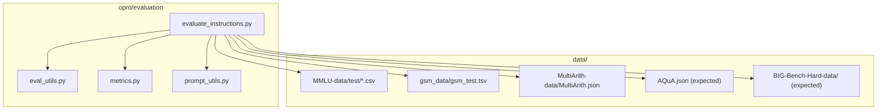
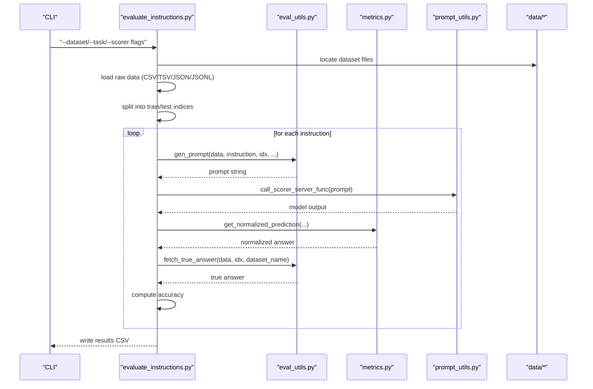
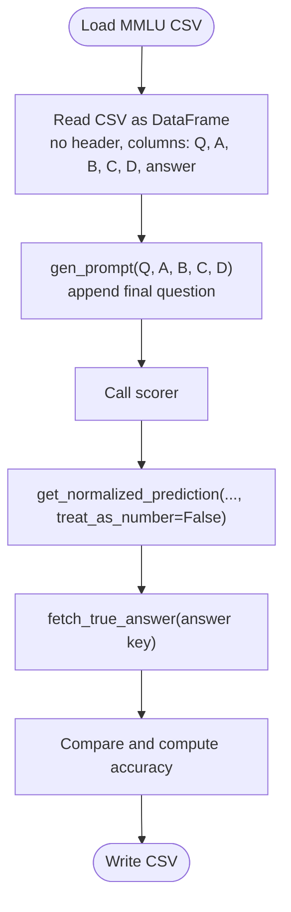
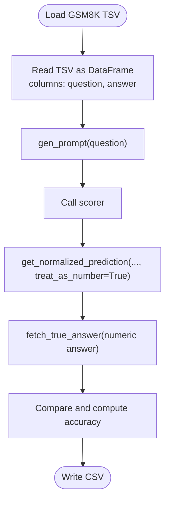
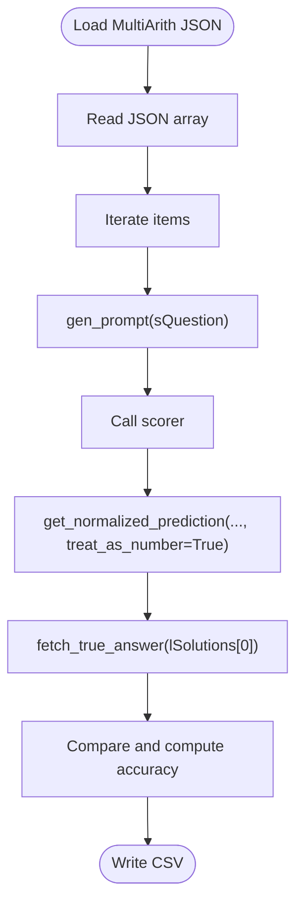
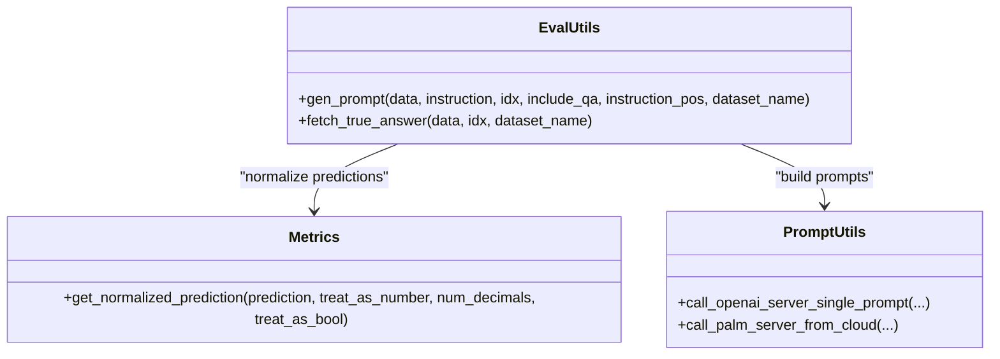

# Benchmark Datasets

<cite>
**Referenced Files in This Document**
- [data/README.md](file://data/README.md)
- [data/MMLU-data/test/abstract_algebra_test.csv](file://data/MMLU-data/test/abstract_algebra_test.csv)
- [data/gsm_data/gsm_test.tsv](file://data/gsm_data/gsm_test.tsv)
- [data/MultiArith-data/MultiArith.json](file://data/MultiArith-data/MultiArith.json)
- [opro/evaluation/evaluate_instructions.py](file://opro/evaluation/evaluate_instructions.py)
- [opro/evaluation/eval_utils.py](file://opro/evaluation/eval_utils.py)
- [opro/evaluation/metrics.py](file://opro/evaluation/metrics.py)
- [opro/prompt_utils.py](file://opro/prompt_utils.py)
</cite>

## Table of Contents
1. [Introduction](#introduction)
2. [Project Structure](#project-structure)
3. [Core Components](#core-components)
4. [Architecture Overview](#architecture-overview)
5. [Detailed Component Analysis](#detailed-component-analysis)
6. [Dependency Analysis](#dependency-analysis)
7. [Performance Considerations](#performance-considerations)
8. [Troubleshooting Guide](#troubleshooting-guide)
9. [Conclusion](#conclusion)
10. [Appendices](#appendices)

## Introduction
This document describes the benchmark datasets supported by opro and how they are loaded and processed during evaluation. It covers:
- Dataset formats and schemas for MMLU, GSM8K, MultiArith, and others
- How datasets are discovered, loaded, and transformed into prompts
- Evaluation-time preprocessing and answer parsing
- Organization of the data/ directory and conventions for adding new datasets
- Licensing and usage context
- Performance considerations for large datasets

## Project Structure
The datasets live under the data/ directory. The evaluation scripts discover and load datasets according to the dataset name and task specification.

**Diagram sources**
- [opro/evaluation/evaluate_instructions.py](file://opro/evaluation/evaluate_instructions.py#L208-L221)
- [data/README.md](file://data/README.md#L1-L31)

**Section sources**
- [data/README.md](file://data/README.md#L1-L31)
- [opro/evaluation/evaluate_instructions.py](file://opro/evaluation/evaluate_instructions.py#L208-L221)

## Core Components
- Dataset loaders: The evaluation script selects a loader based on dataset_name and task_name, then loads raw data into memory.
- Prompt construction: The eval_utils.gen_prompt function builds a model prompt from raw data, instruction, and instruction placement.
- Answer extraction and scoring: The metrics module normalizes predictions and computes accuracy; true answers are fetched via eval_utils.fetch_true_answer.

Key behaviors:
- MMLU: CSV files without header; first column is the question; choices follow; last column is the answer key.
- GSM8K: TSV with question in column 0 and numeric answer in column 1.
- MultiArith: JSON array of items with fields including sQuestion and lSolutions.
- AQuA: JSONL with one item per line; each item has fields like question, options, and correct.
- BBH: Task-specific subdirectories and files; handled via a dedicated loader.

**Section sources**
- [opro/evaluation/evaluate_instructions.py](file://opro/evaluation/evaluate_instructions.py#L505-L526)
- [opro/evaluation/eval_utils.py](file://opro/evaluation/eval_utils.py#L126-L151)
- [opro/evaluation/eval_utils.py](file://opro/evaluation/eval_utils.py#L153-L161)
- [opro/evaluation/eval_utils.py](file://opro/evaluation/eval_utils.py#L164-L259)
- [opro/evaluation/eval_utils.py](file://opro/evaluation/eval_utils.py#L262-L286)
- [opro/evaluation/metrics.py](file://opro/evaluation/metrics.py#L64-L77)

## Architecture Overview
The evaluation pipeline:
1. Parse flags and select dataset/task
2. Locate dataset files and load raw data
3. Split into train/test folds
4. For each instruction, generate prompts and call the scorer
5. Extract and normalize model outputs
6. Compare to ground truth and compute accuracy

**Diagram sources**
- [opro/evaluation/evaluate_instructions.py](file://opro/evaluation/evaluate_instructions.py#L549-L766)
- [opro/evaluation/eval_utils.py](file://opro/evaluation/eval_utils.py#L164-L259)
- [opro/evaluation/eval_utils.py](file://opro/evaluation/eval_utils.py#L262-L286)
- [opro/evaluation/metrics.py](file://opro/evaluation/metrics.py#L188-L200)
- [opro/prompt_utils.py](file://opro/prompt_utils.py#L21-L133)

## Detailed Component Analysis

### MMLU (57 subject areas in CSV format)
- File organization: data/MMLU-data/test/*.csv
- Schema:
  - Column 0: Question text
  - Columns 1–4: Choices A–D
  - Last column: Answer key (single letter A–D)
- Loading and preprocessing:
  - Loaded as a DataFrame with no header; each row is one question
  - gen_prompt constructs a multiple-choice prompt with choices and a final question
  - fetch_true_answer returns the answer key from the last column
- Example entry (first row of a typical CSV):
  - Question text in column 0
  - Choices in columns 1–4
  - Answer key in the last column
- Notes:
  - The evaluation script enumerates all CSV files in the test folder and concatenates them into a single dataset for evaluation.

**Diagram sources**
- [opro/evaluation/eval_utils.py](file://opro/evaluation/eval_utils.py#L126-L151)
- [opro/evaluation/eval_utils.py](file://opro/evaluation/eval_utils.py#L164-L259)
- [opro/evaluation/eval_utils.py](file://opro/evaluation/eval_utils.py#L262-L286)
- [opro/evaluation/evaluate_instructions.py](file://opro/evaluation/evaluate_instructions.py#L556-L569)

**Section sources**
- [data/MMLU-data/test/abstract_algebra_test.csv](file://data/MMLU-data/test/abstract_algebra_test.csv#L1-L20)
- [opro/evaluation/eval_utils.py](file://opro/evaluation/eval_utils.py#L126-L151)
- [opro/evaluation/eval_utils.py](file://opro/evaluation/eval_utils.py#L164-L259)
- [opro/evaluation/eval_utils.py](file://opro/evaluation/eval_utils.py#L262-L286)
- [opro/evaluation/evaluate_instructions.py](file://opro/evaluation/evaluate_instructions.py#L556-L569)

### GSM8K (Grade school math problems in TSV)
- File organization: data/gsm_data/gsm_test.tsv
- Schema:
  - Column 0: Question text
  - Column 1: Numeric answer
- Loading and preprocessing:
  - Loaded as a DataFrame from TSV with no header
  - gen_prompt uses the question text from column 0
  - fetch_true_answer returns the numeric answer from column 1
  - The metrics module recognizes GSM8K answers by a special marker and normalizes numeric predictions
- Example entry (first row of the TSV):
  - Question text in column 0
  - Numeric answer in column 1

**Diagram sources**
- [opro/evaluation/evaluate_instructions.py](file://opro/evaluation/evaluate_instructions.py#L583-L592)
- [opro/evaluation/eval_utils.py](file://opro/evaluation/eval_utils.py#L214-L216)
- [opro/evaluation/eval_utils.py](file://opro/evaluation/eval_utils.py#L279-L281)
- [opro/evaluation/metrics.py](file://opro/evaluation/metrics.py#L64-L77)

**Section sources**
- [data/gsm_data/gsm_test.tsv](file://data/gsm_data/gsm_test.tsv#L1-L20)
- [opro/evaluation/evaluate_instructions.py](file://opro/evaluation/evaluate_instructions.py#L583-L592)
- [opro/evaluation/eval_utils.py](file://opro/evaluation/eval_utils.py#L214-L216)
- [opro/evaluation/eval_utils.py](file://opro/evaluation/eval_utils.py#L279-L281)
- [opro/evaluation/metrics.py](file://opro/evaluation/metrics.py#L64-L77)

### MultiArith (Multi-step arithmetic in JSON)
- File organization: data/MultiArith-data/MultiArith.json
- Schema:
  - Array of items
  - Each item includes:
    - sQuestion: Question text
    - lSolutions: Array of numeric solutions
    - iIndex: Index
    - lEquations/lAlignments: Auxiliary fields (not used for evaluation)
- Loading and preprocessing:
  - Loaded as a JSON array
  - gen_prompt uses sQuestion
  - fetch_true_answer returns the first solution from lSolutions
  - Treat as numeric for scoring
- Example entry (first item of the JSON):
  - sQuestion: Question text
  - lSolutions: Array of numeric solutions

**Diagram sources**
- [opro/evaluation/evaluate_instructions.py](file://opro/evaluation/evaluate_instructions.py#L619-L628)
- [opro/evaluation/eval_utils.py](file://opro/evaluation/eval_utils.py#L218-L218)
- [opro/evaluation/eval_utils.py](file://opro/evaluation/eval_utils.py#L282-L282)

**Section sources**
- [data/MultiArith-data/MultiArith.json](file://data/MultiArith-data/MultiArith.json#L1-L40)
- [opro/evaluation/evaluate_instructions.py](file://opro/evaluation/evaluate_instructions.py#L619-L628)
- [opro/evaluation/eval_utils.py](file://opro/evaluation/eval_utils.py#L218-L218)
- [opro/evaluation/eval_utils.py](file://opro/evaluation/eval_utils.py#L282-L282)

### AQuA (Additional dataset)
- Expected location: data/AQuA.json
- Loading and preprocessing:
  - Loaded as JSONL via a helper function
  - gen_prompt constructs a multiple-choice prompt from question and options
  - fetch_true_answer returns the correct option identifier
- Notes:
  - The evaluation script expects a single AQuA.json file in the data root.

**Section sources**
- [opro/evaluation/evaluate_instructions.py](file://opro/evaluation/evaluate_instructions.py#L609-L618)
- [opro/evaluation/eval_utils.py](file://opro/evaluation/eval_utils.py#L153-L161)
- [opro/evaluation/eval_utils.py](file://opro/evaluation/eval_utils.py#L284-L285)

### BBH (Big-Bench Hard)
- Expected location: data/BIG-Bench-Hard-data/
- Loading and preprocessing:
  - Tasks are enumerated and loaded individually
  - Some tasks are numeric; others are boolean
  - gen_prompt uses the input field for BBH
  - fetch_true_answer uses the target field for BBH
- Notes:
  - The evaluation script defines sets of numeric and boolean tasks.

**Section sources**
- [opro/evaluation/evaluate_instructions.py](file://opro/evaluation/evaluate_instructions.py#L468-L504)
- [opro/evaluation/evaluate_instructions.py](file://opro/evaluation/evaluate_instructions.py#L570-L582)
- [opro/evaluation/eval_utils.py](file://opro/evaluation/eval_utils.py#L214-L214)
- [opro/evaluation/eval_utils.py](file://opro/evaluation/eval_utils.py#L277-L278)

### Prompt Construction and Answer Extraction
- gen_prompt builds prompts with configurable instruction placement:
  - before_Q, Q_begin, Q_end, A_begin
  - For MMLU/GSM8K/MultiArith/AQuA, the question text is extracted from the dataset and formatted accordingly
- fetch_true_answer retrieves the ground-truth answer from the dataset:
  - MMLU: last column
  - GSM8K: column 1
  - MultiArith: first solution
  - AQuA: correct field
- get_normalized_prediction:
  - For numeric tasks, strips units and normalizes decimals
  - For GSM8K, uses a special marker to extract the answer
  - For boolean tasks, maps “yes/no” variants to canonical forms

**Diagram sources**
- [opro/evaluation/eval_utils.py](file://opro/evaluation/eval_utils.py#L164-L259)
- [opro/evaluation/eval_utils.py](file://opro/evaluation/eval_utils.py#L262-L286)
- [opro/evaluation/metrics.py](file://opro/evaluation/metrics.py#L188-L200)
- [opro/prompt_utils.py](file://opro/prompt_utils.py#L21-L133)

**Section sources**
- [opro/evaluation/eval_utils.py](file://opro/evaluation/eval_utils.py#L164-L259)
- [opro/evaluation/eval_utils.py](file://opro/evaluation/eval_utils.py#L262-L286)
- [opro/evaluation/metrics.py](file://opro/evaluation/metrics.py#L64-L77)
- [opro/evaluation/metrics.py](file://opro/evaluation/metrics.py#L188-L200)
- [opro/prompt_utils.py](file://opro/prompt_utils.py#L21-L133)

## Dependency Analysis
- Dataset discovery depends on dataset_name and task_name flags
- Data loading paths are determined by dataset_name and directory layout
- Prompt construction depends on dataset_name to select the correct formatter
- Answer extraction depends on dataset_name to select the correct field accessor
- Scoring depends on dataset-specific normalization rules

**Diagram sources**
- [opro/evaluation/evaluate_instructions.py](file://opro/evaluation/evaluate_instructions.py#L125-L177)
- [opro/evaluation/evaluate_instructions.py](file://opro/evaluation/evaluate_instructions.py#L549-L766)
- [opro/evaluation/eval_utils.py](file://opro/evaluation/eval_utils.py#L164-L259)
- [opro/evaluation/metrics.py](file://opro/evaluation/metrics.py#L188-L200)

**Section sources**
- [opro/evaluation/evaluate_instructions.py](file://opro/evaluation/evaluate_instructions.py#L125-L177)
- [opro/evaluation/evaluate_instructions.py](file://opro/evaluation/evaluate_instructions.py#L549-L766)
- [opro/evaluation/eval_utils.py](file://opro/evaluation/eval_utils.py#L164-L259)
- [opro/evaluation/metrics.py](file://opro/evaluation/metrics.py#L188-L200)

## Performance Considerations
- Memory usage:
  - MMLU: CSV files are concatenated into a single DataFrame; memory scales with number of rows and columns
  - GSM8K: TSV is loaded into a DataFrame; memory scales with number of rows
  - MultiArith: JSON array loaded into memory; memory scales with number of items
  - AQuA: JSONL loaded into a list; memory scales with number of items
- Batch sizes:
  - The evaluation script sets batch_size=1 for both GPT and PaLM scorers
  - This reduces memory pressure but increases latency
- I/O:
  - Reading large TSV/CSV/JSON files can dominate runtime
  - Consider pre-splitting datasets and caching if repeated evaluations are performed
- Parallelism:
  - The evaluation script disables parallel evaluation by default
  - For large datasets, consider enabling parallelism cautiously and tuning batch sizes

[No sources needed since this section provides general guidance]

## Troubleshooting Guide
- Dataset not found:
  - Ensure dataset_name matches supported values and the data directory layout is correct
  - Verify the exact path used by the evaluation script for each dataset
- Wrong answer format:
  - For GSM8K, ensure the answer follows the expected marker convention
  - For AQuA, ensure options and correct keys are present
- Incorrect prompt construction:
  - Confirm instruction_pos is one of before_Q, Q_begin, Q_end, A_begin
  - Verify dataset_name is one of mmlu, gsm8k, multiarith, aqua, bbh
- Scoring issues:
  - For numeric tasks, confirm normalization settings and decimal precision
  - For boolean tasks, confirm label mapping

**Section sources**
- [opro/evaluation/evaluate_instructions.py](file://opro/evaluation/evaluate_instructions.py#L125-L177)
- [opro/evaluation/eval_utils.py](file://opro/evaluation/eval_utils.py#L164-L259)
- [opro/evaluation/metrics.py](file://opro/evaluation/metrics.py#L64-L77)

## Conclusion
opro supports several benchmark datasets with distinct schemas and evaluation modes:
- MMLU: CSV with multiple-choice questions and answer keys
- GSM8K: TSV with question-answer pairs for grade-school math
- MultiArith: JSON with multi-step arithmetic questions and numeric solutions
- AQuA: JSONL with multiple-choice questions and correct answers
- BBH: Task-specific subdirectories with specialized handling

The evaluation pipeline loads datasets, constructs prompts, calls a scorer, normalizes outputs, and computes accuracy. Proper dataset organization and schema adherence are essential for reliable evaluation.

[No sources needed since this section summarizes without analyzing specific files]

## Appendices

### Dataset Licensing and Usage Context
- The data/README.md indicates that all source data is copyrighted by original authors and not officially supported by Google.
- Users should adhere to the original licenses and usage terms of each dataset provider.

**Section sources**
- [data/README.md](file://data/README.md#L26-L31)

### Adding a New Dataset
- Supported dataset names are validated in the evaluation script
- Add a new branch in the dataset loader to:
  - Resolve the data path
  - Load raw data into the expected structure (DataFrame, list, or dict)
  - Define prediction_treat_as_number/bool/is_multiple_choice
  - Optionally define a custom formatter in eval_utils.gen_prompt
- Ensure the dataset adheres to the expected field semantics for answer extraction and prompt construction.

**Section sources**
- [opro/evaluation/evaluate_instructions.py](file://opro/evaluation/evaluate_instructions.py#L125-L177)
- [opro/evaluation/evaluate_instructions.py](file://opro/evaluation/evaluate_instructions.py#L549-L766)
- [opro/evaluation/eval_utils.py](file://opro/evaluation/eval_utils.py#L164-L259)
- [opro/evaluation/eval_utils.py](file://opro/evaluation/eval_utils.py#L262-L286)