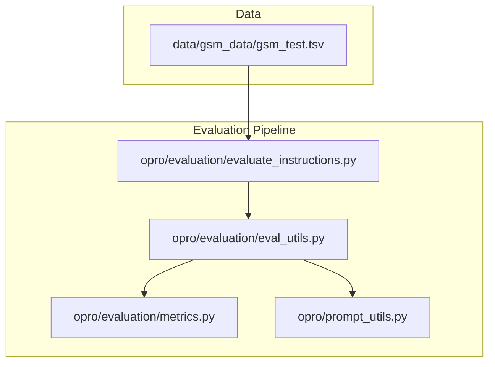
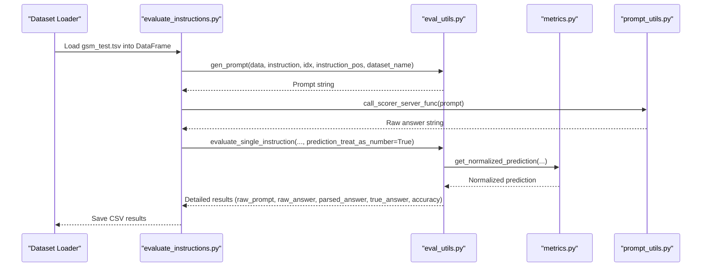
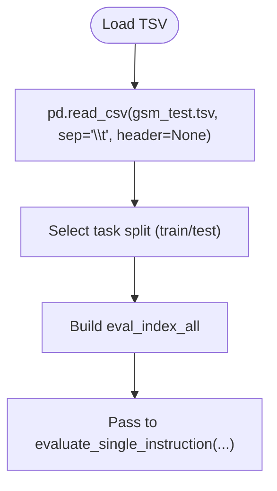
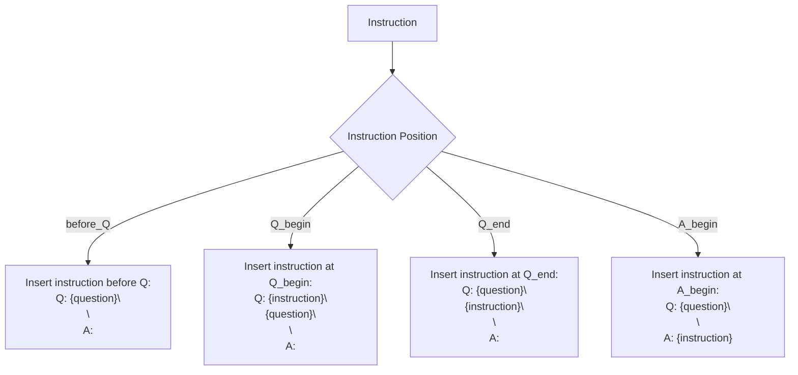
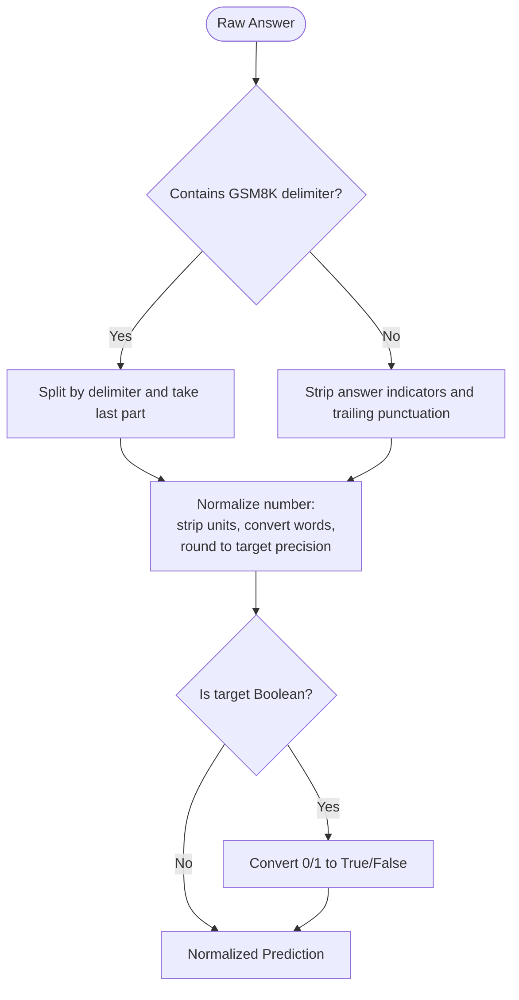
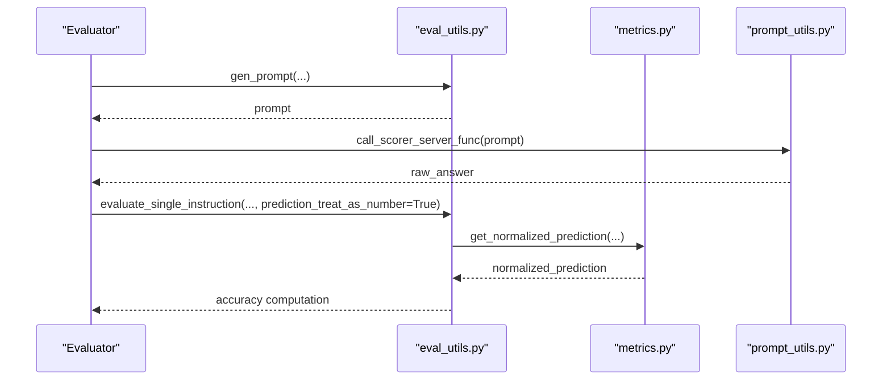
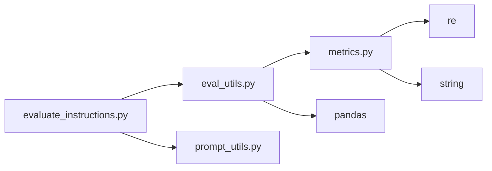

# GSM8K Dataset

<cite>
**Referenced Files in This Document**
- [gsm_test.tsv](file://data/gsm_data/gsm_test.tsv)
- [evaluate_instructions.py](file://opro/evaluation/evaluate_instructions.py)
- [eval_utils.py](file://opro/evaluation/eval_utils.py)
- [metrics.py](file://opro/evaluation/metrics.py)
- [prompt_utils.py](file://opro/prompt_utils.py)
- [data/README.md](file://data/README.md)
</cite>

## Table of Contents
1. [Introduction](#introduction)
2. [Project Structure](#project-structure)
3. [Core Components](#core-components)
4. [Architecture Overview](#architecture-overview)
5. [Detailed Component Analysis](#detailed-component-analysis)
6. [Dependency Analysis](#dependency-analysis)
7. [Performance Considerations](#performance-considerations)
8. [Troubleshooting Guide](#troubleshooting-guide)
9. [Conclusion](#conclusion)
10. [Appendices](#appendices)

## Introduction
This document provides comprehensive data model documentation for the GSM8K (Grade School Math) dataset used in opro. It explains the TSV file structure, how the dataset is loaded and parsed, how the rationale and final answer are separated, and how the evaluation pipeline transforms entries for scoring. It also covers preprocessing requirements, evaluation context, and performance considerations for large-scale evaluations.

## Project Structure
The GSM8K dataset resides under the data folder and is consumed by the evaluation pipeline. The evaluation script loads the dataset, constructs prompts, calls the scorer model, parses the model output, and computes accuracy.

**Diagram sources**
- [gsm_test.tsv](file://data/gsm_data/gsm_test.tsv#L1-L20)
- [evaluate_instructions.py](file://opro/evaluation/evaluate_instructions.py#L580-L620)
- [eval_utils.py](file://opro/evaluation/eval_utils.py#L536-L800)
- [metrics.py](file://opro/evaluation/metrics.py#L1-L120)
- [prompt_utils.py](file://opro/prompt_utils.py#L1-L133)

**Section sources**
- [data/README.md](file://data/README.md#L1-L31)
- [evaluate_instructions.py](file://opro/evaluation/evaluate_instructions.py#L580-L620)

## Core Components
- Dataset file: TSV with three tab-separated columns representing question, answer, and rationale.
- Loader: Reads TSV into a DataFrame and selects the appropriate task split.
- Prompt generator: Builds prompts with configurable instruction placement.
- Scoring: Calls the model, extracts final answers, normalizes predictions, and computes accuracy.

Key responsibilities:
- Data loading and indexing for train/test folds.
- Prompt construction with instruction placement options.
- Final answer extraction and normalization tailored for GSM8K.
- Accuracy computation for numerical targets.

**Section sources**
- [gsm_test.tsv](file://data/gsm_data/gsm_test.tsv#L1-L20)
- [evaluate_instructions.py](file://opro/evaluation/evaluate_instructions.py#L580-L620)
- [eval_utils.py](file://opro/evaluation/eval_utils.py#L164-L260)
- [metrics.py](file://opro/evaluation/metrics.py#L70-L120)

## Architecture Overview
The evaluation flow for GSM8K:

**Diagram sources**
- [evaluate_instructions.py](file://opro/evaluation/evaluate_instructions.py#L580-L766)
- [eval_utils.py](file://opro/evaluation/eval_utils.py#L536-L800)
- [metrics.py](file://opro/evaluation/metrics.py#L188-L343)
- [prompt_utils.py](file://opro/prompt_utils.py#L21-L133)

## Detailed Component Analysis

### TSV File Structure (gsm_test.tsv)
- Format: Tab-separated values.
- Columns:
  - Column 0: question (word problem statement)
  - Column 1: answer (gold answer label)
  - Column 2: rationale (step-by-step explanation ending with the boxed final answer)
- Example entry (illustrative):
  - Question: "Janet’s ducks lay 16 eggs per day. She eats three for breakfast every morning and bakes muffins for her friends every day with four. She sells the remainder at the farmers' market daily for $2 per fresh duck egg. How much in dollars does she make every day at the farmers' market?"
  - Answer: "18"
  - Rationale: "Janet sells 16 - 3 - 4 = 9 duck eggs a day. She makes 9 * 2 = $18 every day at the farmer’s market. #### 18"

Parsing logic:
- The answer column contains the numeric target.
- The rationale column contains the full step-by-step solution and ends with a delimiter indicating the final boxed answer.

**Section sources**
- [gsm_test.tsv](file://data/gsm_data/gsm_test.tsv#L1-L20)

### Data Loading and Task Split
- The loader reads the TSV file and stores it as a DataFrame.
- For GSM8K, the task name corresponds to the split (train or test).
- The evaluation script constructs train/test indices and passes them to the evaluator.

**Diagram sources**
- [evaluate_instructions.py](file://opro/evaluation/evaluate_instructions.py#L580-L620)

**Section sources**
- [evaluate_instructions.py](file://opro/evaluation/evaluate_instructions.py#L580-L620)

### Prompt Construction and Instruction Placement
- The prompt generator builds a prompt from the selected example and instruction.
- Supported positions for instruction placement:
  - before_Q: instruction inserted before the question segment
  - Q_begin: instruction inserted at the beginning of the question
  - Q_end: instruction appended at the end of the question
  - A_begin: instruction inserted at the beginning of the answer segment
- For GSM8K, the question is taken from the first column; the answer is taken from the second column.

**Diagram sources**
- [eval_utils.py](file://opro/evaluation/eval_utils.py#L164-L260)

**Section sources**
- [eval_utils.py](file://opro/evaluation/eval_utils.py#L164-L260)

### Final Answer Extraction and Normalization (GSM8K)
- GSM8K rationale ends with a specific delimiter indicating the final boxed answer.
- The parser recognizes this delimiter and extracts the final answer portion.
- For numerical targets, the parser strips units, normalizes decimals, converts words to digits, and rounds to the precision of the target.
- Special handling for GPT models that output answers in a boxed format.

**Diagram sources**
- [metrics.py](file://opro/evaluation/metrics.py#L70-L120)
- [metrics.py](file://opro/evaluation/metrics.py#L188-L343)

**Section sources**
- [metrics.py](file://opro/evaluation/metrics.py#L70-L120)
- [metrics.py](file://opro/evaluation/metrics.py#L188-L343)

### Evaluation Pipeline and Accuracy Computation
- The evaluator calls the scorer model with constructed prompts.
- It collects raw answers, optionally performs a second round to extract final answers, and normalizes predictions.
- Accuracy is computed using a specialized routine that checks exact equality for non-numbers and numeric equality within tolerance for numbers.

**Diagram sources**
- [evaluate_instructions.py](file://opro/evaluation/evaluate_instructions.py#L680-L766)
- [eval_utils.py](file://opro/evaluation/eval_utils.py#L536-L800)
- [metrics.py](file://opro/evaluation/metrics.py#L443-L496)
- [prompt_utils.py](file://opro/prompt_utils.py#L21-L133)

**Section sources**
- [evaluate_instructions.py](file://opro/evaluation/evaluate_instructions.py#L680-L766)
- [eval_utils.py](file://opro/evaluation/eval_utils.py#L536-L800)
- [metrics.py](file://opro/evaluation/metrics.py#L443-L496)

### Concrete Example Transformation
- Input entry (illustrative):
  - Question: "Janet’s ducks lay 16 eggs per day. ..."
  - Answer: "18"
  - Rationale: "Janet sells 16 - 3 - 4 = 9 duck eggs a day. She makes 9 * 2 = $18 every day at the farmer’s market. #### 18"
- During evaluation:
  - The loader reads the entry and selects the answer column as the gold target.
  - The prompt is constructed according to the chosen instruction position.
  - The model generates a response that includes a rationale and a final boxed answer.
  - The parser extracts the final answer after the GSM8K delimiter and normalizes it.
  - The evaluator compares the normalized prediction with the gold target and records accuracy.

**Section sources**
- [gsm_test.tsv](file://data/gsm_data/gsm_test.tsv#L1-L20)
- [metrics.py](file://opro/evaluation/metrics.py#L70-L120)
- [eval_utils.py](file://opro/evaluation/eval_utils.py#L788-L800)

## Dependency Analysis
- evaluate_instructions.py depends on:
  - eval_utils.py for prompt generation, evaluation loop, and accuracy computation.
  - metrics.py for answer normalization and accuracy calculation.
  - prompt_utils.py for model API calls.
- eval_utils.py depends on:
  - metrics.py for normalization routines.
  - pandas for DataFrame operations.
- metrics.py depends on:
  - regular expressions and string utilities for parsing.
  - immutabledict for word-to-number mapping.

**Diagram sources**
- [evaluate_instructions.py](file://opro/evaluation/evaluate_instructions.py#L580-L766)
- [eval_utils.py](file://opro/evaluation/eval_utils.py#L536-L800)
- [metrics.py](file://opro/evaluation/metrics.py#L1-L120)
- [prompt_utils.py](file://opro/prompt_utils.py#L1-L133)

**Section sources**
- [evaluate_instructions.py](file://opro/evaluation/evaluate_instructions.py#L580-L766)
- [eval_utils.py](file://opro/evaluation/eval_utils.py#L536-L800)
- [metrics.py](file://opro/evaluation/metrics.py#L1-L120)

## Performance Considerations
- Memory:
  - The dataset is loaded as a single DataFrame; for large-scale evaluations, consider chunking or streaming if memory pressure arises.
  - Keep batch sizes small when using cloud APIs to reduce memory footprint.
- Parsing:
  - GSM8K rationale can be long; ensure max_decode_steps is sufficient for the second round extraction.
  - Normalize only when necessary to avoid repeated conversions.
- Throughput:
  - Use parallel prompting where supported; the evaluator supports multithreading batching.
  - Tune batch_size and num_servers to match API quotas and latency.
- I/O:
  - Pre-download and cache the TSV locally to minimize network overhead.
  - Use compressed storage if disk bandwidth is constrained.

[No sources needed since this section provides general guidance]

## Troubleshooting Guide
- Model timeouts or rate limits:
  - The prompt utilities handle retries and backoff for OpenAI and PaLM APIs.
- Missing final answer:
  - If the model does not include the boxed answer, the evaluator can perform a second round prompt to extract the final answer.
- Incorrect accuracy:
  - Verify that prediction_treat_as_number is enabled for GSM8K numerical targets.
  - Ensure the delimiter-based extraction is functioning (GSM8K delimiter).
- Data shape mismatches:
  - Confirm that the TSV is tab-separated and has three columns as expected.

**Section sources**
- [prompt_utils.py](file://opro/prompt_utils.py#L21-L133)
- [eval_utils.py](file://opro/evaluation/eval_utils.py#L713-L777)
- [metrics.py](file://opro/evaluation/metrics.py#L70-L120)

## Conclusion
The GSM8K dataset in opro is structured as a TSV with question, answer, and rationale. The evaluation pipeline loads the dataset, constructs prompts with configurable instruction placement, calls the scorer model, extracts and normalizes the final answer, and computes accuracy. The parser is specifically tuned for GSM8K’s boxed answer format and numerical targets. Proper batching, normalization, and delimiter handling ensure robust and efficient large-scale evaluations.

[No sources needed since this section summarizes without analyzing specific files]

## Appendices

### Dataset Origin, Licensing, and Evaluation Context
- Origin: The dataset is downloaded from the OpenAI grade-school math repository.
- Licensing: The repository README indicates all copyrights belong to the original benchmark authors and is not an officially supported Google product.
- Evaluation context: GSM8K is used to benchmark instruction-following and multi-step arithmetic reasoning capabilities of LLMs. It focuses on grade-school level math problems with step-by-step rationales and final boxed solutions.

**Section sources**
- [data/README.md](file://data/README.md#L1-L31)