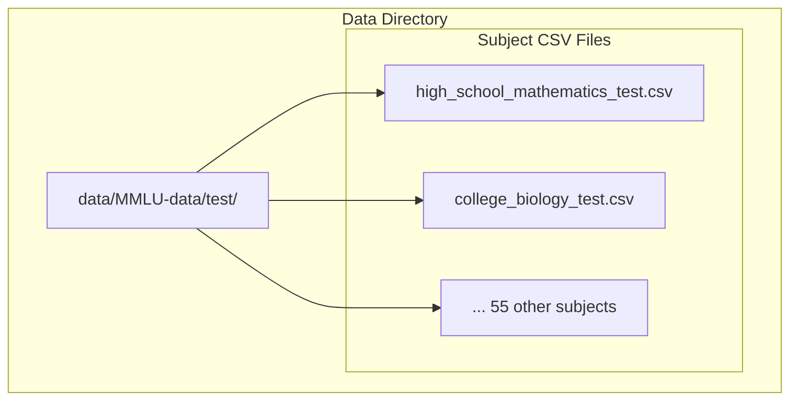
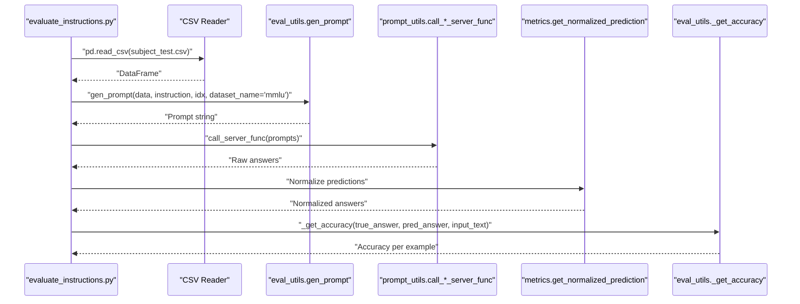
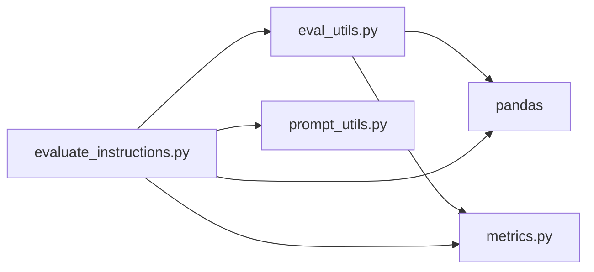

# MMLU Dataset

<cite>
**Referenced Files in This Document**
- [README.md](file://data/README.md)
- [evaluate_instructions.py](file://opro/evaluation/evaluate_instructions.py)
- [eval_utils.py](file://opro/evaluation/eval_utils.py)
- [metrics.py](file://opro/evaluation/metrics.py)
- [prompt_utils.py](file://opro/prompt_utils.py)
- [college_biology_test.csv](file://data/MMLU-data/test/college_biology_test.csv)
- [high_school_mathematics_test.csv](file://data/MMLU-data/test/high_school_mathematics_test.csv)
</cite>

## Table of Contents
1. [Introduction](#introduction)
2. [Project Structure](#project-structure)
3. [Core Components](#core-components)
4. [Architecture Overview](#architecture-overview)
5. [Detailed Component Analysis](#detailed-component-analysis)
6. [Dependency Analysis](#dependency-analysis)
7. [Performance Considerations](#performance-considerations)
8. [Troubleshooting Guide](#troubleshooting-guide)
9. [Conclusion](#conclusion)
10. [Appendices](#appendices)

## Introduction
This document provides comprehensive data model documentation for the MMLU (Massive Multitask Language Understanding) dataset used in opro. It explains the structure of the 57 subject-specific CSV files in the test split, the schema fields, and how the data is loaded and parsed during evaluation workflows. It also covers prompt formatting, example entries from different domains, directory organization, usage limitations, and licensing considerations.

## Project Structure
The MMLU test split is organized as a flat directory of CSV files, one per subject. Each CSV file contains rows representing multiple-choice questions with four answer choices and a correct answer index.

**Diagram sources**
- [README.md](file://data/README.md#L9-L15)
- [college_biology_test.csv](file://data/MMLU-data/test/college_biology_test.csv#L1-L20)
- [high_school_mathematics_test.csv](file://data/MMLU-data/test/high_school_mathematics_test.csv#L1-L20)

**Section sources**
- [README.md](file://data/README.md#L9-L15)

## Core Components
- Data files: 57 CSV files in data/MMLU-data/test/, one per subject.
- Schema fields:
  - Question text (first column)
  - Four answer choices (columns 2–5)
  - Correct answer index (last column, one of A, B, C, D)
- Directory organization: flat structure with filenames following the pattern <subject>_test.csv.

**Section sources**
- [college_biology_test.csv](file://data/MMLU-data/test/college_biology_test.csv#L1-L20)
- [high_school_mathematics_test.csv](file://data/MMLU-data/test/high_school_mathematics_test.csv#L1-L20)

## Architecture Overview
The evaluation pipeline loads a subject CSV, constructs prompts, sends them to a model server, parses the model output, and computes accuracy. The following diagram maps the key components and their interactions.

**Diagram sources**
- [evaluate_instructions.py](file://opro/evaluation/evaluate_instructions.py#L555-L745)
- [eval_utils.py](file://opro/evaluation/eval_utils.py#L164-L259)
- [metrics.py](file://opro/evaluation/metrics.py#L188-L343)
- [prompt_utils.py](file://opro/prompt_utils.py#L21-L133)

## Detailed Component Analysis

### Data Model: CSV Schema and Fields
- Question text: First column.
- Choices: Columns 2–5 correspond to choices A–D.
- Correct answer: Last column contains the correct choice index (A, B, C, or D).
- Indexing: Rows are 0-indexed in the DataFrame; the correct answer index is fetched via iloc.

Examples:
- [college_biology_test.csv](file://data/MMLU-data/test/college_biology_test.csv#L1-L20)
- [high_school_mathematics_test.csv](file://data/MMLU-data/test/high_school_mathematics_test.csv#L1-L20)

**Section sources**
- [college_biology_test.csv](file://data/MMLU-data/test/college_biology_test.csv#L1-L20)
- [high_school_mathematics_test.csv](file://data/MMLU-data/test/high_school_mathematics_test.csv#L1-L20)

### Loading and Parsing Workflow
- Loading: The evaluator reads each subject CSV into a pandas DataFrame.
- Prompt construction: The prompt is built by combining the question text and choices, and appending a standardized ending to elicit a choice response.
- Model inference: Prompts are sent to the selected model server (OpenAI or Google PaLM).
- Answer extraction: Predictions are normalized to extract the final answer symbol or text.
- Accuracy computation: The true answer is compared to the normalized prediction using multiple matching strategies.

Key functions:
- Data loading and indexing: [evaluate_instructions.py](file://opro/evaluation/evaluate_instructions.py#L555-L570)
- Prompt generation: [eval_utils.gen_prompt](file://opro/evaluation/eval_utils.py#L164-L259)
- True answer fetching: [eval_utils.fetch_true_answer](file://opro/evaluation/eval_utils.py#L262-L286)
- Answer normalization: [metrics.get_normalized_prediction](file://opro/evaluation/metrics.py#L188-L343)
- Accuracy calculation: [eval_utils._get_accuracy](file://opro/evaluation/eval_utils.py#L381-L491)

**Section sources**
- [evaluate_instructions.py](file://opro/evaluation/evaluate_instructions.py#L555-L745)
- [eval_utils.py](file://opro/evaluation/eval_utils.py#L164-L259)
- [metrics.py](file://opro/evaluation/metrics.py#L188-L343)

### Prompt Formatting Details
- MMLU prompts are constructed from the question text and choices A–D, then appended with a standardized ending to request the answer in the format (A) (B) (C) (D).
- The instruction can be positioned at the beginning of the question, end of the question, beginning of the answer, or before the question.

References:
- [eval_utils._format_mmlu_example](file://opro/evaluation/eval_utils.py#L126-L151)
- [eval_utils.gen_prompt](file://opro/evaluation/eval_utils.py#L164-L259)

**Section sources**
- [eval_utils.py](file://opro/evaluation/eval_utils.py#L126-L151)
- [eval_utils.py](file://opro/evaluation/eval_utils.py#L164-L259)

### Example Entries by Domain
- College Biology: [college_biology_test.csv](file://data/MMLU-data/test/college_biology_test.csv#L1-L20)
- High School Mathematics: [high_school_mathematics_test.csv](file://data/MMLU-data/test/high_school_mathematics_test.csv#L1-L20)

These files illustrate the CSV structure with question text, four choices, and a correct answer index.

**Section sources**
- [college_biology_test.csv](file://data/MMLU-data/test/college_biology_test.csv#L1-L20)
- [high_school_mathematics_test.csv](file://data/MMLU-data/test/high_school_mathematics_test.csv#L1-L20)

### Directory Organization and Naming Conventions
- Directory: data/MMLU-data/test/
- Files: <subject>_test.csv (e.g., high_school_mathematics_test.csv, college_biology_test.csv)
- Category mapping: The evaluator filters tasks by category using a mapping from subject to discipline (STEM, humanities, social sciences, other).

References:
- [evaluate_instructions.py](file://opro/evaluation/evaluate_instructions.py#L307-L385)

**Section sources**
- [evaluate_instructions.py](file://opro/evaluation/evaluate_instructions.py#L307-L385)

### Usage Limitations and Headroom Notes
- The README notes that MMLU exhibits small headroom for prompt optimization compared to other benchmarks, typically less than 10% for the four categories.

Reference:
- [README.md](file://data/README.md#L11-L12)

**Section sources**
- [README.md](file://data/README.md#L11-L12)

### Licensing and Attribution
- The README states that all copyrights belong to the original benchmark authors and includes a disclaimer that this is not an officially supported Google product.

Reference:
- [README.md](file://data/README.md#L28-L31)

**Section sources**
- [README.md](file://data/README.md#L28-L31)

## Dependency Analysis
The evaluation pipeline depends on pandas for CSV loading, a prompt generation module for constructing prompts, a model server wrapper for inference, and a metrics module for normalization and accuracy computation.

**Diagram sources**
- [evaluate_instructions.py](file://opro/evaluation/evaluate_instructions.py#L555-L745)
- [eval_utils.py](file://opro/evaluation/eval_utils.py#L164-L259)
- [metrics.py](file://opro/evaluation/metrics.py#L188-L343)
- [prompt_utils.py](file://opro/prompt_utils.py#L21-L133)

**Section sources**
- [evaluate_instructions.py](file://opro/evaluation/evaluate_instructions.py#L555-L745)
- [eval_utils.py](file://opro/evaluation/eval_utils.py#L164-L259)
- [metrics.py](file://opro/evaluation/metrics.py#L188-L343)
- [prompt_utils.py](file://opro/prompt_utils.py#L21-L133)

## Performance Considerations
- Loading multiple CSV files: Reading each subject CSV into memory can be memory-intensive if evaluating many subjects concurrently. Consider streaming or batching reads.
- Parallel inference: The evaluator supports multithreading for prompt batches; adjust batch size and server count according to model throughput.
- Prompt construction: Building prompts per example is lightweight, but repeated normalization and accuracy checks can dominate runtime for large datasets.
- Selective subject loading: Filter subjects by category or name before loading to reduce memory footprint.

[No sources needed since this section provides general guidance]

## Troubleshooting Guide
- No server output after retries: The prompting loop asserts that outputs are produced; ensure API keys and network connectivity are configured.
- Incorrect answer extraction: Verify that the model output includes a choice symbol or text that matches the expected format; normalization routines rely on bracketed symbols and delimited patterns.
- Accuracy mismatch: Confirm that the correct answer index aligns with the DataFrame column layout and that normalization treats the answer as a symbol or text appropriately.

**Section sources**
- [eval_utils.py](file://opro/evaluation/eval_utils.py#L338-L379)
- [metrics.py](file://opro/evaluation/metrics.py#L188-L343)

## Conclusion
The MMLU dataset in opro is structured as 57 CSV files, each containing a multiple-choice question, four choices, and a correct answer index. The evaluation pipeline loads these files, constructs standardized prompts, queries a model server, normalizes predictions, and computes accuracy. While MMLU shows limited headroom for prompt optimization, it remains a robust benchmark across STEM, humanities, social sciences, and other domains. Proper configuration of model servers and careful handling of answer normalization are key to reliable evaluations.

[No sources needed since this section summarizes without analyzing specific files]

## Appendices

### Appendix A: Example Entry Paths
- College Biology example: [college_biology_test.csv](file://data/MMLU-data/test/college_biology_test.csv#L1-L20)
- High School Mathematics example: [high_school_mathematics_test.csv](file://data/MMLU-data/test/high_school_mathematics_test.csv#L1-L20)

**Section sources**
- [college_biology_test.csv](file://data/MMLU-data/test/college_biology_test.csv#L1-L20)
- [high_school_mathematics_test.csv](file://data/MMLU-data/test/high_school_mathematics_test.csv#L1-L20)