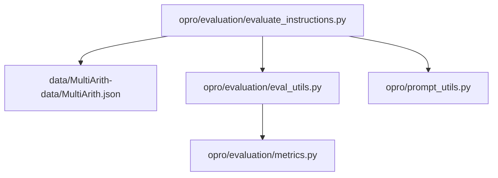
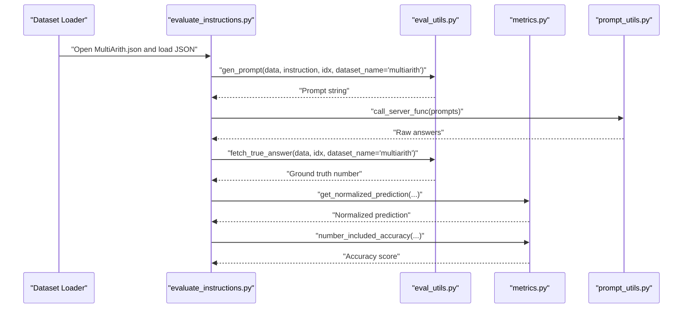
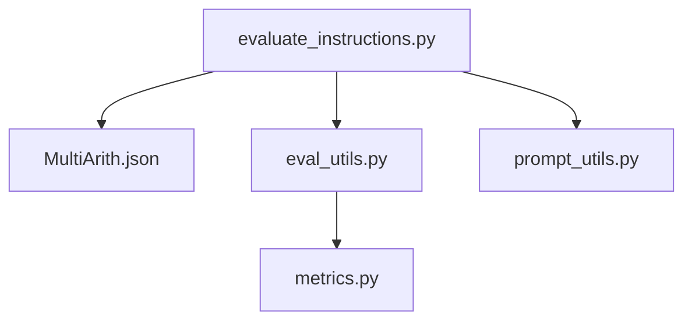

# MultiArith Dataset

<cite>
**Referenced Files in This Document**
- [MultiArith.json](file://data/MultiArith-data/MultiArith.json)
- [README.md](file://data/README.md)
- [evaluate_instructions.py](file://opro/evaluation/evaluate_instructions.py)
- [eval_utils.py](file://opro/evaluation/eval_utils.py)
- [metrics.py](file://opro/evaluation/metrics.py)
- [prompt_utils.py](file://opro/prompt_utils.py)
</cite>

## Table of Contents
1. [Introduction](#introduction)
2. [Project Structure](#project-structure)
3. [Core Components](#core-components)
4. [Architecture Overview](#architecture-overview)
5. [Detailed Component Analysis](#detailed-component-analysis)
6. [Dependency Analysis](#dependency-analysis)
7. [Performance Considerations](#performance-considerations)
8. [Troubleshooting Guide](#troubleshooting-guide)
9. [Conclusion](#conclusion)
10. [Appendices](#appendices)

## Introduction
This document describes the MultiArith dataset used in the opro evaluation pipeline. It focuses on the JSON structure of MultiArith.json, how the dataset is loaded and processed during evaluation, and how prompts are constructed and scored. The dataset consists of multi-step arithmetic word problems, each with a problem statement and a numeric answer. The evaluation pipeline parses the JSON, builds prompts, sends them to a model, extracts and normalizes the predicted answer, and computes accuracy.

## Project Structure
The MultiArith dataset resides under the data directory and is consumed by the evaluation scripts in the opro package.

**Diagram sources**
- [MultiArith.json](file://data/MultiArith-data/MultiArith.json#L1-L20)
- [evaluate_instructions.py](file://opro/evaluation/evaluate_instructions.py#L582-L628)
- [eval_utils.py](file://opro/evaluation/eval_utils.py#L164-L220)
- [metrics.py](file://opro/evaluation/metrics.py#L188-L343)
- [prompt_utils.py](file://opro/prompt_utils.py#L21-L103)

**Section sources**
- [README.md](file://data/README.md#L16-L21)

## Core Components
- Dataset file: MultiArith.json is a JSON array where each element is a problem record.
- Evaluation loader: Loads the JSON file and sets dataset-specific flags for numerical output.
- Prompt generator: Builds a prompt from the dataset record for a given instruction and position.
- True answer extractor: Retrieves the numeric ground truth answer from the dataset record.
- Scoring and parsing: Normalizes predictions and compares them to the ground truth.

Key responsibilities:
- Loading and indexing the dataset entries.
- Constructing prompts with optional instruction placement.
- Extracting numeric answers and normalizing model outputs.
- Computing accuracy using normalized targets and predictions.

**Section sources**
- [evaluate_instructions.py](file://opro/evaluation/evaluate_instructions.py#L582-L628)
- [eval_utils.py](file://opro/evaluation/eval_utils.py#L164-L220)
- [eval_utils.py](file://opro/evaluation/eval_utils.py#L262-L286)
- [metrics.py](file://opro/evaluation/metrics.py#L188-L343)

## Architecture Overview
The evaluation flow for MultiArith involves loading the dataset, generating prompts, invoking a model, parsing the output, and computing accuracy.

**Diagram sources**
- [evaluate_instructions.py](file://opro/evaluation/evaluate_instructions.py#L650-L770)
- [eval_utils.py](file://opro/evaluation/eval_utils.py#L164-L220)
- [eval_utils.py](file://opro/evaluation/eval_utils.py#L262-L286)
- [metrics.py](file://opro/evaluation/metrics.py#L188-L343)
- [prompt_utils.py](file://opro/prompt_utils.py#L21-L103)

## Detailed Component Analysis

### MultiArith JSON Schema
Each entry in MultiArith.json is a record with the following fields:
- sQuestion: The problem statement as a string.
- lSolutions: A list containing the numeric answer (first element).
- lEquations: A list of equation strings representing the computation steps.
- lAlignments: A list of integer offsets aligning text spans to positions in the problem text.
- iIndex: An integer index for the record.

The dataset is a JSON array of such records. The evaluation code expects:
- Question text: accessed via sQuestion.
- Ground truth answer: accessed via lSolutions[0].

These fields enable constructing prompts and extracting the correct numeric answer for scoring.

**Section sources**
- [MultiArith.json](file://data/MultiArith-data/MultiArith.json#L1-L20)
- [MultiArith.json](file://data/MultiArith-data/MultiArith.json#L800-L820)
- [eval_utils.py](file://opro/evaluation/eval_utils.py#L262-L286)

### Dataset Loading and Indexing
The evaluation script loads MultiArith.json and configures the evaluation pipeline for numerical tasks:
- Opens the JSON file and loads it into memory.
- Sets prediction_treat_as_number to True for numerical output.
- Uses sequential indices for evaluation.

The loader also defines task categories and flags for MultiArith, marking it as a numerical task.

**Section sources**
- [evaluate_instructions.py](file://opro/evaluation/evaluate_instructions.py#L582-L628)
- [evaluate_instructions.py](file://opro/evaluation/evaluate_instructions.py#L509-L550)

### Prompt Construction for MultiArith
The prompt generator constructs a prompt from the dataset record:
- Selects the question text from sQuestion.
- Supports multiple instruction placements (before Q, at Q_begin, at Q_end, at A_begin).
- Optionally includes “Q:” and “A:” markers.

This allows flexible instruction placement and consistent prompt formatting across datasets.

**Section sources**
- [eval_utils.py](file://opro/evaluation/eval_utils.py#L164-L220)

### Ground Truth Extraction
The true answer extractor retrieves the numeric answer from the dataset record:
- For MultiArith, returns int(lSolutions[0]).

This ensures the evaluation pipeline treats the answer as a number for scoring.

**Section sources**
- [eval_utils.py](file://opro/evaluation/eval_utils.py#L262-L286)

### Prediction Parsing and Scoring
Prediction normalization and scoring:
- Normalization strips answer indicators, units, and punctuation, and converts words to numbers when applicable.
- For numerical targets, the system rounds to the same precision as the target and compares floats within a tolerance.
- Accuracy is computed as a percentage across the dataset.

This robust parsing improves correctness when models output varied formats.

**Section sources**
- [metrics.py](file://opro/evaluation/metrics.py#L188-L343)
- [metrics.py](file://opro/evaluation/metrics.py#L443-L496)

### Model Interaction
The evaluation invokes a model server function to obtain raw answers. The prompt utilities handle retries and error conditions for OpenAI and PaLM endpoints.

**Section sources**
- [prompt_utils.py](file://opro/prompt_utils.py#L21-L103)

### Sample Entry and Prompt Formatting
A typical entry includes:
- sQuestion: The problem statement.
- lSolutions: The numeric answer.
- lEquations: Stepwise equations.
- lAlignments: Text alignment indices.
- iIndex: Record index.

The prompt generator builds a prompt using the instruction and the selected question text. The evaluation pipeline then compares the normalized prediction to the ground truth.

**Section sources**
- [MultiArith.json](file://data/MultiArith-data/MultiArith.json#L1-L20)
- [eval_utils.py](file://opro/evaluation/eval_utils.py#L164-L220)
- [eval_utils.py](file://opro/evaluation/eval_utils.py#L262-L286)

## Dependency Analysis
The evaluation pipeline depends on:
- Dataset loader to read MultiArith.json.
- Prompt generator to assemble prompts.
- True answer extractor to obtain numeric targets.
- Metrics module for normalization and accuracy.
- Model utilities for inference calls.

**Diagram sources**
- [evaluate_instructions.py](file://opro/evaluation/evaluate_instructions.py#L582-L628)
- [eval_utils.py](file://opro/evaluation/eval_utils.py#L164-L220)
- [metrics.py](file://opro/evaluation/metrics.py#L188-L343)
- [prompt_utils.py](file://opro/prompt_utils.py#L21-L103)

**Section sources**
- [evaluate_instructions.py](file://opro/evaluation/evaluate_instructions.py#L650-L770)
- [eval_utils.py](file://opro/evaluation/eval_utils.py#L536-L602)

## Performance Considerations
- JSON parsing: The dataset is a single JSON array. Loading is straightforward and efficient for moderate sizes. For very large datasets, consider streaming or chunked processing.
- Memory usage: Loading the entire dataset into memory is acceptable for typical sizes. For batch processing, ensure sufficient RAM to hold the dataset plus concurrent prompt batches.
- Parallelization: The evaluation supports parallel prompting with a configurable number of servers. Adjust batch_size and num_servers to balance throughput and resource usage.
- Parsing overhead: Normalization and accuracy computation are lightweight compared to model inference. Focus optimization on model serving latency and rate limits.

[No sources needed since this section provides general guidance]

## Troubleshooting Guide
Common issues and resolutions:
- JSON loading errors: Verify the file path and ensure the JSON is valid. Confirm the dataset name is set to multiarith in the evaluation script.
- Missing fields: Ensure sQuestion and lSolutions exist in each record. The evaluator expects lSolutions[0] to be a number.
- Model timeouts or rate limits: The prompt utilities implement retries and backoff. Check network connectivity and API quotas.
- Incorrect accuracy: Review normalization rules and ensure predictions are numeric. The metrics module rounds to the target’s precision.

**Section sources**
- [evaluate_instructions.py](file://opro/evaluation/evaluate_instructions.py#L582-L628)
- [eval_utils.py](file://opro/evaluation/eval_utils.py#L536-L602)
- [prompt_utils.py](file://opro/prompt_utils.py#L21-L103)
- [metrics.py](file://opro/evaluation/metrics.py#L188-L343)

## Conclusion
The MultiArith dataset provides a structured set of multi-step arithmetic word problems. The evaluation pipeline loads the dataset, constructs prompts, obtains model outputs, normalizes predictions, and computes accuracy. The design emphasizes flexibility in prompt construction and robust parsing for numerical answers, enabling reliable evaluation of LLMs on sequential reasoning and numerical computation tasks.

[No sources needed since this section summarizes without analyzing specific files]

## Appendices

### Dataset Origin and Intended Use
- Origin: The MultiArith dataset is included in the repository alongside other benchmarks.
- Intended use: Evaluating LLMs on multi-step arithmetic word problems, focusing on sequential reasoning and numerical accuracy.

**Section sources**
- [README.md](file://data/README.md#L16-L21)