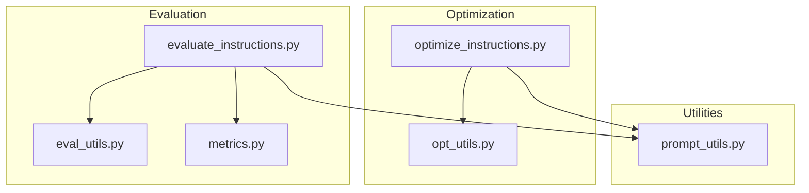
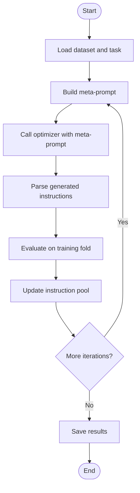
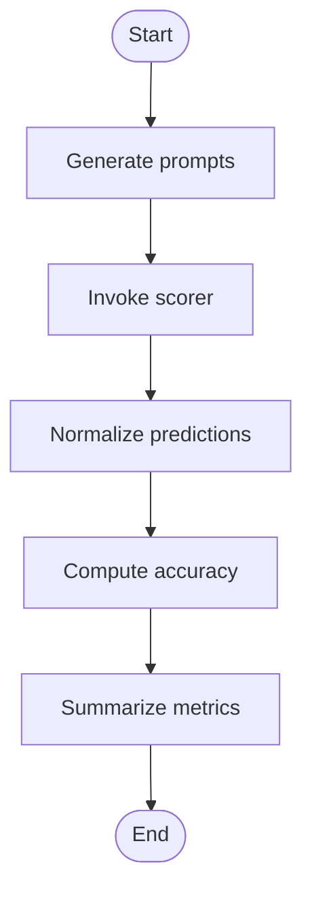
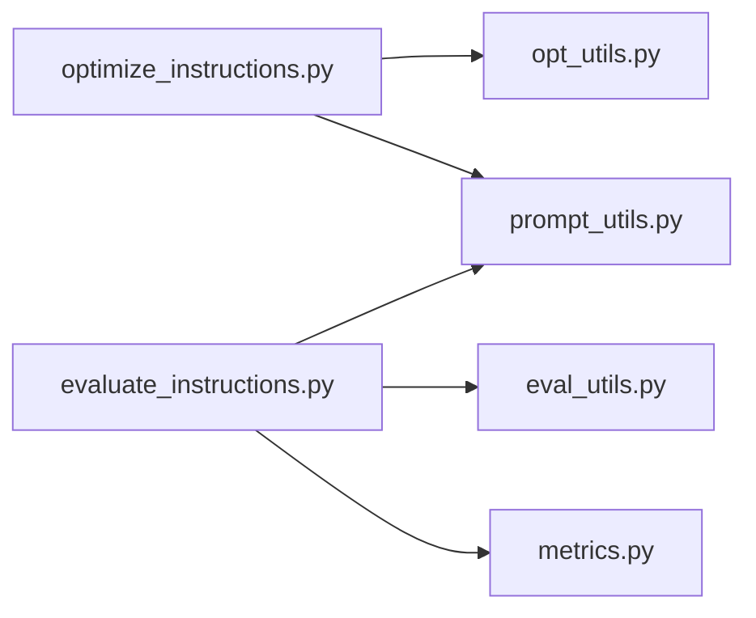

# Citation and References

<cite>
**Referenced Files in This Document**
- [README.md](file://README.md)
- [CONTRIBUTING.md](file://CONTRIBUTING.md)
- [data/README.md](file://data/README.md)
- [opro/optimization/optimize_instructions.py](file://opro/optimization/optimize_instructions.py)
- [opro/optimization/opt_utils.py](file://opro/optimization/opt_utils.py)
- [opro/evaluation/evaluate_instructions.py](file://opro/evaluation/evaluate_instructions.py)
- [opro/evaluation/eval_utils.py](file://opro/evaluation/eval_utils.py)
- [opro/evaluation/metrics.py](file://opro/evaluation/metrics.py)
- [opro/prompt_utils.py](file://opro/prompt_utils.py)
</cite>

## Table of Contents
1. [Introduction](#introduction)
2. [Project Structure](#project-structure)
3. [Core Components](#core-components)
4. [Architecture Overview](#architecture-overview)
5. [Detailed Component Analysis](#detailed-component-analysis)
6. [Dependency Analysis](#dependency-analysis)
7. [Performance Considerations](#performance-considerations)
8. [Troubleshooting Guide](#troubleshooting-guide)
9. [Conclusion](#conclusion)
10. [Appendices](#appendices)

## Introduction
This document provides comprehensive citation and reference material for the opro project, including the official BibTeX entry, usage guidance for citing the work, links to the original arXiv paper and full author list, and contextual references to foundational prompt engineering and large language model (LLM) optimization literature. It also documents supported models, benchmark datasets, and practical guidance for accessing official APIs and datasets.

## Project Structure
The repository is organized around two primary workflows:
- Prompt optimization: evolving instructions via an optimizer LLM guided by a scorer LLM and dataset-specific evaluation.
- Prompt evaluation: scoring and comparing candidate instructions on held-out datasets.

Key modules:
- Optimization pipeline: defines meta-prompts, evolution loop, and instruction generation/selection.
- Evaluation pipeline: constructs prompts, invokes scorers, parses answers, and computes accuracy.
- Utilities: shared prompt construction, answer parsing, and API wrappers for OpenAI and Google PaLM.



**Diagram sources**
- [opro/optimization/optimize_instructions.py](file://opro/optimization/optimize_instructions.py#L1-L120)
- [opro/optimization/opt_utils.py](file://opro/optimization/opt_utils.py#L90-L160)
- [opro/evaluation/evaluate_instructions.py](file://opro/evaluation/evaluate_instructions.py#L1-L120)
- [opro/evaluation/eval_utils.py](file://opro/evaluation/eval_utils.py#L160-L260)
- [opro/evaluation/metrics.py](file://opro/evaluation/metrics.py#L180-L240)
- [opro/prompt_utils.py](file://opro/prompt_utils.py#L1-L60)

**Section sources**
- [README.md](file://README.md#L1-L79)
- [opro/optimization/optimize_instructions.py](file://opro/optimization/optimize_instructions.py#L1-L120)
- [opro/evaluation/evaluate_instructions.py](file://opro/evaluation/evaluate_instructions.py#L1-L120)

## Core Components
- Prompt optimization workflow:
  - Defines supported models and datasets, sets up scorer and optimizer configurations, loads data, and runs an evolutionary loop to generate and refine instructions.
- Prompt evaluation workflow:
  - Builds prompts according to instruction position and dataset, invokes the scorer, normalizes predictions, and computes accuracy.
- Utilities:
  - Meta-prompt generation, prompt construction, answer extraction and normalization, and API wrappers for OpenAI and Google PaLM.

**Section sources**
- [opro/optimization/optimize_instructions.py](file://opro/optimization/optimize_instructions.py#L100-L220)
- [opro/optimization/opt_utils.py](file://opro/optimization/opt_utils.py#L90-L160)
- [opro/evaluation/evaluate_instructions.py](file://opro/evaluation/evaluate_instructions.py#L180-L260)
- [opro/evaluation/eval_utils.py](file://opro/evaluation/eval_utils.py#L160-L260)
- [opro/evaluation/metrics.py](file://opro/evaluation/metrics.py#L180-L240)
- [opro/prompt_utils.py](file://opro/prompt_utils.py#L1-L60)

## Architecture Overview
The system orchestrates two LLMs: a scorer (used to evaluate instructions) and an optimizer (used to propose improved instructions). Data loaders and prompt builders feed into evaluation and optimization loops, with results saved to output directories.

```mermaid
sequenceDiagram
participant CLI as "CLI"
participant Opt as "optimize_instructions.py"
participant Util as "opt_utils.py"
participant Eval as "eval_utils.py"
participant Sc as "prompt_utils.py (scorer)"
participant Op as "prompt_utils.py (optimizer)"
CLI->>Opt : "Run optimization with flags"
Opt->>Sc : "Configure scorer"
Opt->>Op : "Configure optimizer"
Opt->>Util : "Load dataset and construct meta-prompt"
Opt->>Op : "Call optimizer with meta-prompt"
Op-->>Opt : "Generated instructions"
Opt->>Eval : "Evaluate instructions on training fold"
Eval->>Sc : "Score predictions"
Sc-->>Eval : "Raw answers"
Eval-->>Opt : "Accuracy metrics"
Opt->>Opt : "Evolve and repeat"
```

**Diagram sources**
- [opro/optimization/optimize_instructions.py](file://opro/optimization/optimize_instructions.py#L100-L220)
- [opro/optimization/opt_utils.py](file://opro/optimization/opt_utils.py#L338-L420)
- [opro/evaluation/eval_utils.py](file://opro/evaluation/eval_utils.py#L536-L620)
- [opro/prompt_utils.py](file://opro/prompt_utils.py#L1-L60)

## Detailed Component Analysis

### Prompt Optimization Workflow
- Dataset and model selection:
  - Supports MMLU, BBH, and GSM8K; scorer and optimizer can be text-bison, gpt-3.5-turbo, or gpt-4.
- Meta-prompt construction:
  - Incorporates prior instructions and exemplars depending on meta-prompt type and instruction position.
- Evolution loop:
  - Generates candidate instructions, evaluates them, and evolves toward higher-scoring instructions.



**Diagram sources**
- [opro/optimization/optimize_instructions.py](file://opro/optimization/optimize_instructions.py#L100-L220)
- [opro/optimization/opt_utils.py](file://opro/optimization/opt_utils.py#L90-L160)
- [opro/optimization/opt_utils.py](file://opro/optimization/opt_utils.py#L338-L420)

**Section sources**
- [opro/optimization/optimize_instructions.py](file://opro/optimization/optimize_instructions.py#L100-L220)
- [opro/optimization/opt_utils.py](file://opro/optimization/opt_utils.py#L90-L160)
- [opro/optimization/opt_utils.py](file://opro/optimization/opt_utils.py#L338-L420)

### Prompt Evaluation Workflow
- Prompt construction:
  - Places instruction at before_Q, Q_begin, Q_end, or A_begin depending on configuration.
- Answer parsing:
  - Normalizes predictions for multiple-choice, numeric, and Boolean tasks.
- Accuracy computation:
  - Computes per-example accuracy and aggregates statistics.



**Diagram sources**
- [opro/evaluation/evaluate_instructions.py](file://opro/evaluation/evaluate_instructions.py#L536-L620)
- [opro/evaluation/eval_utils.py](file://opro/evaluation/eval_utils.py#L536-L620)
- [opro/evaluation/metrics.py](file://opro/evaluation/metrics.py#L180-L240)

**Section sources**
- [opro/evaluation/evaluate_instructions.py](file://opro/evaluation/evaluate_instructions.py#L536-L620)
- [opro/evaluation/eval_utils.py](file://opro/evaluation/eval_utils.py#L536-L620)
- [opro/evaluation/metrics.py](file://opro/evaluation/metrics.py#L180-L240)

### API and Model Support
- Supported models:
  - text-bison (Google Vertex AI) and GPT models (OpenAI).
- API usage:
  - Requires API keys for OpenAI and Google PaLM when using cloud-hosted models.
- Cost considerations:
  - The repository warns about potential API costs for optimization and evaluation.

**Section sources**
- [README.md](file://README.md#L54-L63)
- [opro/optimization/optimize_instructions.py](file://opro/optimization/optimize_instructions.py#L180-L210)
- [opro/evaluation/evaluate_instructions.py](file://opro/evaluation/evaluate_instructions.py#L180-L210)
- [opro/prompt_utils.py](file://opro/prompt_utils.py#L1-L60)

### Benchmark Datasets
- Included datasets:
  - GSM8K, MMLU, Big-Bench Hard (BBH), MultiArith, AQuA.
- Notes:
  - Some datasets are included in the repository; others are referenced with official download links.

**Section sources**
- [data/README.md](file://data/README.md#L1-L31)

## Dependency Analysis
- External libraries used:
  - openai, google.generativeai, pandas, numpy, absl-py, immutabledict.
- Internal module dependencies:
  - Optimization scripts depend on opt_utils and prompt_utils.
  - Evaluation scripts depend on eval_utils, metrics, and prompt_utils.



**Diagram sources**
- [opro/optimization/optimize_instructions.py](file://opro/optimization/optimize_instructions.py#L1-L120)
- [opro/optimization/opt_utils.py](file://opro/optimization/opt_utils.py#L1-L60)
- [opro/evaluation/evaluate_instructions.py](file://opro/evaluation/evaluate_instructions.py#L1-L120)
- [opro/evaluation/eval_utils.py](file://opro/evaluation/eval_utils.py#L1-L60)
- [opro/evaluation/metrics.py](file://opro/evaluation/metrics.py#L1-L60)
- [opro/prompt_utils.py](file://opro/prompt_utils.py#L1-L60)

**Section sources**
- [README.md](file://README.md#L14-L24)
- [opro/optimization/optimize_instructions.py](file://opro/optimization/optimize_instructions.py#L1-L120)
- [opro/evaluation/evaluate_instructions.py](file://opro/evaluation/evaluate_instructions.py#L1-L120)

## Performance Considerations
- Batch sizes and decoding parameters:
  - Scaler and optimizer configurations include temperature, max_decode_steps, batch_size, and num_decodes tailored to model serving constraints.
- Parallel evaluation:
  - Multithreading is used for parallel prompting when appropriate; note that GPT models should avoid parallelism in first round to prevent rate-limiting.
- Few-shot exemplars:
  - Few-shot QA pairs can improve instruction refinement; selection criteria include random, accumulative-most-frequent, and current-most-frequent.

**Section sources**
- [opro/optimization/optimize_instructions.py](file://opro/optimization/optimize_instructions.py#L240-L360)
- [opro/optimization/opt_utils.py](file://opro/optimization/opt_utils.py#L568-L720)
- [opro/evaluation/evaluate_instructions.py](file://opro/evaluation/evaluate_instructions.py#L238-L305)
- [opro/evaluation/eval_utils.py](file://opro/evaluation/eval_utils.py#L646-L709)

## Troubleshooting Guide
- API errors:
  - OpenAI wrapper handles timeouts, rate limits, API errors, service unavailability, and connection errors with retry logic.
- PaLM wrapper:
  - Uses list_models to discover a compatible model and retries on failures.
- Retry and sleep:
  - Evaluation routines include configurable max_retry and sleep_time to handle transient server issues.

**Section sources**
- [opro/prompt_utils.py](file://opro/prompt_utils.py#L21-L85)
- [opro/prompt_utils.py](file://opro/prompt_utils.py#L105-L133)
- [opro/evaluation/eval_utils.py](file://opro/evaluation/eval_utils.py#L338-L379)

## Conclusion
This document consolidates the official citation, usage guidance, and references for the opro project. It provides a structured overview of the system’s architecture, workflows, and dependencies, and directs users to the original paper, datasets, and model APIs for reproducible research.

## Appendices

### Official Citation and Usage Guidance
- Official BibTeX entry:
  - Provided in the repository’s README for citing the paper when using code or results in academic work.
- When to cite:
  - Use the citation whenever you leverage the optimization or evaluation workflows, datasets, or results presented in the paper.

**Section sources**
- [README.md](file://README.md#L63-L75)

### Original Paper and Author List
- Paper link and author list:
  - The README provides the arXiv link and author list for the paper “Large Language Models as Optimizers.”

**Section sources**
- [README.md](file://README.md#L1-L13)

### Foundational Works in Prompt Engineering and LLM Optimization
- Prompt engineering:
  - Classic prompt strategies, few-shot learning, and chain-of-thought reasoning are widely documented in the literature and underpin opro’s meta-prompt design.
- LLM optimization:
  - Related areas include automated prompt tuning, instruction distillation, and self-improving systems using LLMs as optimizers.

[No sources needed since this section provides general guidance]

### Related Projects and Tools in LLM Optimization
- Automated prompt tuning and instruction optimization:
  - Tools and frameworks that explore prompt spaces, use reinforcement learning, or evolutionary strategies to improve task performance.
- Prompt abstraction and composition:
  - Systems that compose and evolve instruction templates across tasks and domains.

[No sources needed since this section provides general guidance]

### API Documentation for Supported Models
- OpenAI:
  - Reference the official OpenAI API documentation for model capabilities, rate limits, and usage.
- Google PaLM (Vertex AI):
  - Reference the official Vertex AI documentation for text models and deployment options.

[No sources needed since this section provides general guidance]

### Benchmark Datasets and Official Repositories
- MMLU:
  - Official repository referenced in the data README.
- GSM8K:
  - Official repository referenced in the data README.
- Big-Bench Hard (BBH):
  - Official repository referenced in the data README.
- AQuA and MultiArith:
  - Official repositories referenced in the data README.

**Section sources**
- [data/README.md](file://data/README.md#L1-L31)

### Licensing Information
- Code license:
  - The repository uses the Apache License, Version 2.0, as indicated by the headers in core modules.
- Third-party dependencies:
  - External libraries are listed in the README under dependency requirements.

**Section sources**
- [opro/optimization/optimize_instructions.py](file://opro/optimization/optimize_instructions.py#L1-L20)
- [opro/evaluation/evaluate_instructions.py](file://opro/evaluation/evaluate_instructions.py#L1-L20)
- [opro/evaluation/eval_utils.py](file://opro/evaluation/eval_utils.py#L1-L20)
- [opro/evaluation/metrics.py](file://opro/evaluation/metrics.py#L1-L20)
- [opro/prompt_utils.py](file://opro/prompt_utils.py#L1-L20)
- [README.md](file://README.md#L14-L24)

### Contribution Guidelines
- Contributor License Agreement (CLA):
  - Contributors must sign a CLA; the repository links to the Google CLA page.

**Section sources**
- [CONTRIBUTING.md](file://CONTRIBUTING.md#L1-L33)