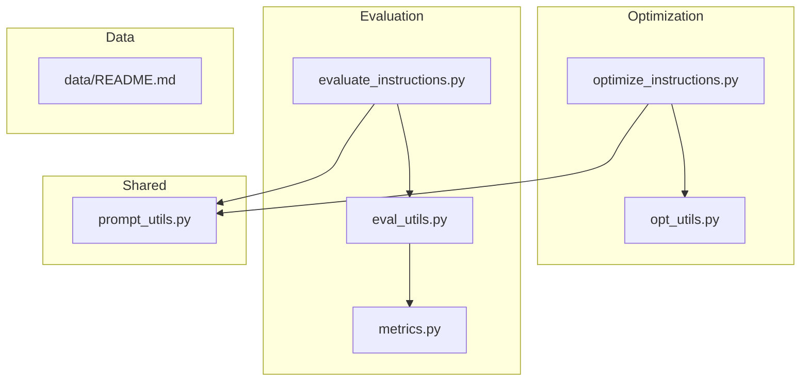
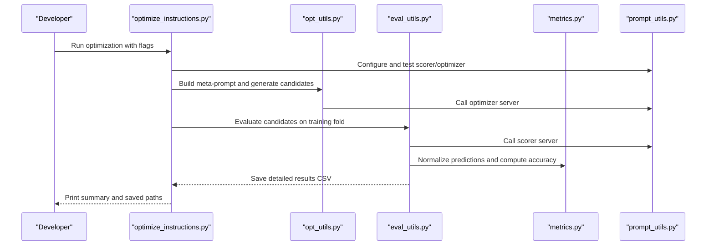
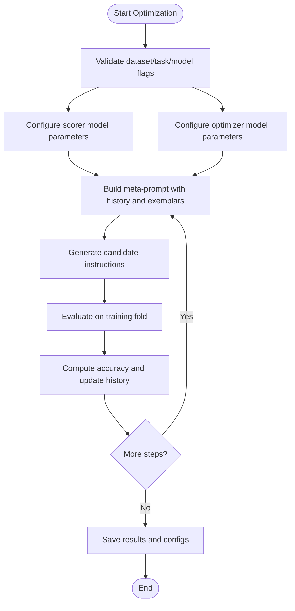
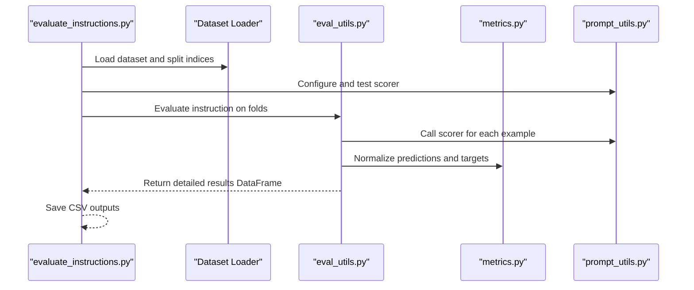
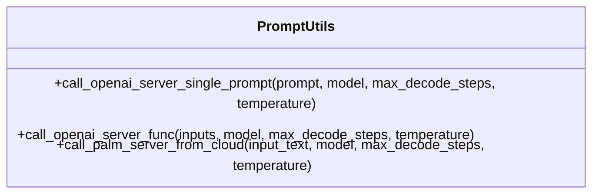
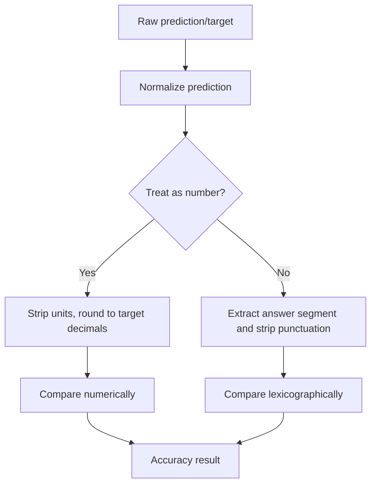
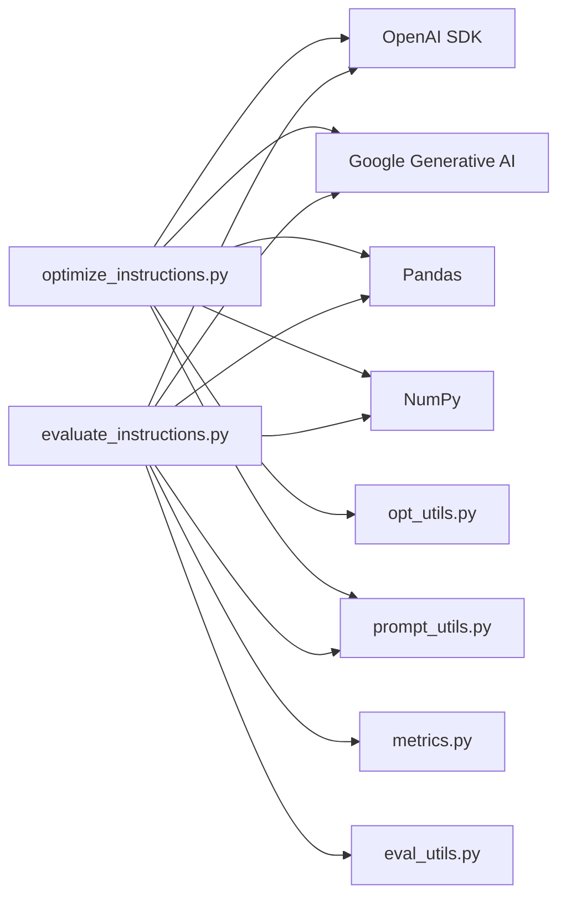

# Contribution Guidelines

<cite>
**Referenced Files in This Document**
- [CONTRIBUTING.md](file://CONTRIBUTING.md)
- [README.md](file://README.md)
- [data/README.md](file://data/README.md)
- [opro/optimization/optimize_instructions.py](file://opro/optimization/optimize_instructions.py)
- [opro/evaluation/evaluate_instructions.py](file://opro/evaluation/evaluate_instructions.py)
- [opro/optimization/opt_utils.py](file://opro/optimization/opt_utils.py)
- [opro/evaluation/eval_utils.py](file://opro/evaluation/eval_utils.py)
- [opro/evaluation/metrics.py](file://opro/evaluation/metrics.py)
- [opro/prompt_utils.py](file://opro/prompt_utils.py)
</cite>

## Table of Contents
1. [Introduction](#introduction)
2. [Project Structure](#project-structure)
3. [Core Components](#core-components)
4. [Architecture Overview](#architecture-overview)
5. [Detailed Component Analysis](#detailed-component-analysis)
6. [Dependency Analysis](#dependency-analysis)
7. [Performance Considerations](#performance-considerations)
8. [Troubleshooting Guide](#troubleshooting-guide)
9. [Conclusion](#conclusion)
10. [Appendices](#appendices)

## Introduction
This document consolidates the contribution process for the opro project, derived from the repository’s contribution policy and developer-facing documentation. It explains how to sign the Contributor License Agreement (CLA), adhere to community guidelines, submit pull requests, and meet code review expectations. It also provides practical guidance for setting up a development environment aligned with the production setup, writing tests, documenting changes, and maintaining code quality. Finally, it outlines how to propose new features and report bugs effectively, and clarifies expectations around code style, documentation updates, and backward compatibility.

## Project Structure
The repository organizes functionality into two primary areas:
- Optimization pipeline: prompt optimization scripts and utilities
- Evaluation pipeline: instruction evaluation scripts and utilities
- Shared utilities: prompt abstraction and evaluation metrics
- Data: benchmark datasets and usage notes

**Diagram sources**
- [opro/optimization/optimize_instructions.py](file://opro/optimization/optimize_instructions.py#L1-L120)
- [opro/optimization/opt_utils.py](file://opro/optimization/opt_utils.py#L1-L120)
- [opro/evaluation/evaluate_instructions.py](file://opro/evaluation/evaluate_instructions.py#L1-L120)
- [opro/evaluation/eval_utils.py](file://opro/evaluation/eval_utils.py#L1-L60)
- [opro/evaluation/metrics.py](file://opro/evaluation/metrics.py#L1-L60)
- [opro/prompt_utils.py](file://opro/prompt_utils.py#L1-L40)
- [data/README.md](file://data/README.md#L1-L31)

**Section sources**
- [README.md](file://README.md#L1-L79)
- [data/README.md](file://data/README.md#L1-L31)

## Core Components
- Optimization pipeline: end-to-end prompt optimization with configurable scorers and optimizers, dataset selection, and saving results.
- Evaluation pipeline: instruction scoring across datasets and folds, with robust model configuration and result persistence.
- Prompt utilities: unified interface for calling OpenAI and Google Cloud models with retry logic and error handling.
- Evaluation utilities and metrics: normalization, parsing, and accuracy computation for diverse task types.

Key responsibilities:
- Optimize: orchestrate meta-prompts, generate candidate instructions, score them, and evolve toward better instructions.
- Evaluate: load datasets, split folds, call scorers, compute accuracy, and persist detailed results.
- Utilities: abstract model calls and handle transient API errors gracefully.

**Section sources**
- [opro/optimization/optimize_instructions.py](file://opro/optimization/optimize_instructions.py#L1-L220)
- [opro/evaluation/evaluate_instructions.py](file://opro/evaluation/evaluate_instructions.py#L1-L220)
- [opro/prompt_utils.py](file://opro/prompt_utils.py#L1-L133)
- [opro/evaluation/eval_utils.py](file://opro/evaluation/eval_utils.py#L1-L120)
- [opro/evaluation/metrics.py](file://opro/evaluation/metrics.py#L1-L120)

## Architecture Overview
The system integrates command-line entry points with shared utilities and evaluation metrics. The optimization script builds meta-prompts, generates instructions, and evaluates them using the scorer. The evaluation script loads datasets, computes scores, and writes CSV outputs. Both pipelines rely on prompt utilities for model calls and on evaluation utilities for accuracy computations.

**Diagram sources**
- [opro/optimization/optimize_instructions.py](file://opro/optimization/optimize_instructions.py#L100-L220)
- [opro/optimization/opt_utils.py](file://opro/optimization/opt_utils.py#L338-L470)
- [opro/evaluation/evaluate_instructions.py](file://opro/evaluation/evaluate_instructions.py#L290-L420)
- [opro/evaluation/eval_utils.py](file://opro/evaluation/eval_utils.py#L120-L220)
- [opro/evaluation/metrics.py](file://opro/evaluation/metrics.py#L340-L496)
- [opro/prompt_utils.py](file://opro/prompt_utils.py#L80-L133)

## Detailed Component Analysis

### Contribution Process and Pull Requests
- All contributions require a signed Contributor License Agreement (CLA) from the contributor or their employer.
- Contributions follow Google’s Open Source Community Guidelines.
- Submissions, including project members, require review via GitHub pull requests.

Practical steps:
- Fork the repository and create a feature branch.
- Commit changes with clear, descriptive messages.
- Open a pull request targeting the default branch.
- Ensure CI checks pass and address reviewer feedback promptly.

**Section sources**
- [CONTRIBUTING.md](file://CONTRIBUTING.md#L1-L33)

### Development Environment Setup
- Python version and dependencies are documented in the project README.
- Scripts expect API keys for OpenAI and Google Cloud models.
- Data assets are organized under the data directory; ensure datasets are downloaded and placed according to the data README.

Recommended setup:
- Use the Python version specified in the README.
- Install dependencies as listed.
- Configure environment variables for API keys.
- Verify model availability and credentials before running scripts.

**Section sources**
- [README.md](file://README.md#L14-L24)
- [README.md](file://README.md#L25-L62)
- [data/README.md](file://data/README.md#L1-L31)

### Code Review Expectations
- Reviews apply to all submissions, including maintainers.
- Use GitHub pull requests for collaboration and feedback.
- Ensure changes align with project goals, maintainability, and test coverage.

Review checklist:
- Clear problem statement and proposed solution.
- Minimal, focused changes.
- Passing tests and documentation updates.
- No regressions in performance or correctness.

**Section sources**
- [CONTRIBUTING.md](file://CONTRIBUTING.md#L26-L33)

### Writing Tests and Maintaining Quality
- Tests are implemented using the Abseil testing framework and parameterized test cases.
- Test coverage includes normalization, parsing, and accuracy computations.
- Tests validate edge cases and expected behaviors for various inputs.

Best practices:
- Add tests for new functions and significant logic changes.
- Prefer parameterized tests to cover multiple scenarios.
- Keep tests deterministic and fast; avoid external network calls when possible.
- Validate error handling paths and boundary conditions.

**Section sources**
- [opro/evaluation/eval_utils_test.py](file://opro/evaluation/eval_utils_test.py#L1-L120)
- [opro/evaluation/eval_utils_test.py](file://opro/evaluation/eval_utils_test.py#L120-L220)
- [opro/evaluation/eval_utils_test.py](file://opro/evaluation/eval_utils_test.py#L220-L307)

### Documentation Updates
- Update the README when adding new features, changing dependencies, or altering usage instructions.
- Keep data README synchronized with dataset availability and licensing notes.
- Provide clear descriptions of command-line flags and expected outputs.

**Section sources**
- [README.md](file://README.md#L1-L79)
- [data/README.md](file://data/README.md#L1-L31)

### Backward Compatibility
- Maintain stable command-line interfaces and flag names.
- Avoid breaking changes to core evaluation and optimization APIs.
- Introduce deprecations with migration guidance and timelines.

Guidelines:
- Preserve existing function signatures and behavior for core modules.
- Add new flags and features with sensible defaults.
- Document breaking changes in release notes.

[No sources needed since this section provides general guidance]

### Proposing New Features and Reporting Bugs
- Use GitHub Issues to propose features and report bugs.
- Provide clear problem statements, reproduction steps, and expected vs. actual behavior.
- Include environment details, Python version, and dependency versions.
- For bug reports, attach relevant logs and sample commands.

**Section sources**
- [CONTRIBUTING.md](file://CONTRIBUTING.md#L1-L33)

### Code Style and Standards
- Follow the project’s established patterns for imports, function naming, and module organization.
- Keep functions cohesive and avoid tight coupling between modules.
- Use clear docstrings and comments for complex logic.

[No sources needed since this section provides general guidance]

### Optimization Pipeline Deep Dive
The optimization pipeline orchestrates instruction evolution:
- Validates dataset/task/model combinations.
- Configures scorer and optimizer model parameters.
- Builds meta-prompts with historical instructions and optional exemplars.
- Generates candidate instructions and evaluates them on training/validation sets.
- Persists results and maintains evolving instruction pools.

**Diagram sources**
- [opro/optimization/optimize_instructions.py](file://opro/optimization/optimize_instructions.py#L100-L220)
- [opro/optimization/opt_utils.py](file://opro/optimization/opt_utils.py#L90-L200)
- [opro/optimization/opt_utils.py](file://opro/optimization/opt_utils.py#L338-L520)

**Section sources**
- [opro/optimization/optimize_instructions.py](file://opro/optimization/optimize_instructions.py#L100-L220)
- [opro/optimization/opt_utils.py](file://opro/optimization/opt_utils.py#L90-L200)
- [opro/optimization/opt_utils.py](file://opro/optimization/opt_utils.py#L338-L520)

### Evaluation Pipeline Deep Dive
The evaluation pipeline:
- Loads datasets and splits into training/test folds.
- Calls the configured scorer to compute per-example accuracy.
- Normalizes predictions and targets using metrics utilities.
- Writes detailed CSV outputs and aggregates averages.

**Diagram sources**
- [opro/evaluation/evaluate_instructions.py](file://opro/evaluation/evaluate_instructions.py#L290-L420)
- [opro/evaluation/eval_utils.py](file://opro/evaluation/eval_utils.py#L120-L220)
- [opro/evaluation/metrics.py](file://opro/evaluation/metrics.py#L340-L496)
- [opro/prompt_utils.py](file://opro/prompt_utils.py#L80-L133)

**Section sources**
- [opro/evaluation/evaluate_instructions.py](file://opro/evaluation/evaluate_instructions.py#L290-L420)
- [opro/evaluation/eval_utils.py](file://opro/evaluation/eval_utils.py#L120-L220)
- [opro/evaluation/metrics.py](file://opro/evaluation/metrics.py#L340-L496)

### Prompt Utilities Deep Dive
Prompt utilities encapsulate model interactions:
- Unified functions for OpenAI and Google Cloud models.
- Robust error handling with retries for timeouts, rate limits, and service errors.
- Consistent input/output handling across providers.

**Diagram sources**
- [opro/prompt_utils.py](file://opro/prompt_utils.py#L1-L133)

**Section sources**
- [opro/prompt_utils.py](file://opro/prompt_utils.py#L1-L133)

### Metrics and Evaluation Utilities Deep Dive
Metrics utilities provide:
- Prediction normalization for numbers, booleans, and bracketed choices.
- Accuracy computation for multiple-choice, boolean, and numeric tasks.
- Robust handling of multilingual delimiters and answer indicators.

**Diagram sources**
- [opro/evaluation/metrics.py](file://opro/evaluation/metrics.py#L157-L343)
- [opro/evaluation/metrics.py](file://opro/evaluation/metrics.py#L443-L496)

**Section sources**
- [opro/evaluation/metrics.py](file://opro/evaluation/metrics.py#L157-L343)
- [opro/evaluation/metrics.py](file://opro/evaluation/metrics.py#L443-L496)
- [opro/evaluation/eval_utils.py](file://opro/evaluation/eval_utils.py#L1-L120)

## Dependency Analysis
External dependencies and integrations:
- OpenAI and Google Generative AI SDKs for model calls.
- Abseil for flag parsing and application entry points.
- Pandas for data loading and CSV outputs.
- NumPy for random splits and numerical operations.
- Immutabledict for immutable mappings.

**Diagram sources**
- [opro/optimization/optimize_instructions.py](file://opro/optimization/optimize_instructions.py#L44-L70)
- [opro/evaluation/evaluate_instructions.py](file://opro/evaluation/evaluate_instructions.py#L41-L70)
- [opro/evaluation/metrics.py](file://opro/evaluation/metrics.py#L1-L30)
- [opro/optimization/opt_utils.py](file://opro/optimization/opt_utils.py#L1-L35)
- [opro/evaluation/eval_utils.py](file://opro/evaluation/eval_utils.py#L1-L20)
- [opro/prompt_utils.py](file://opro/prompt_utils.py#L1-L20)

**Section sources**
- [opro/optimization/optimize_instructions.py](file://opro/optimization/optimize_instructions.py#L44-L70)
- [opro/evaluation/evaluate_instructions.py](file://opro/evaluation/evaluate_instructions.py#L41-L70)
- [opro/evaluation/metrics.py](file://opro/evaluation/metrics.py#L1-L30)
- [opro/optimization/opt_utils.py](file://opro/optimization/opt_utils.py#L1-L35)
- [opro/evaluation/eval_utils.py](file://opro/evaluation/eval_utils.py#L1-L20)
- [opro/prompt_utils.py](file://opro/prompt_utils.py#L1-L20)

## Performance Considerations
- API costs: The README warns about potential costs when calling external APIs. Consider limiting dataset sizes or reducing decode steps during experimentation.
- Batch sizing: Model configuration includes batch size and decoding parameters; tune these to balance throughput and cost.
- Retry logic: Prompt utilities include retry mechanisms for transient failures; ensure appropriate backoff and monitoring.
- Data splits: Use representative splits and avoid unnecessary recomputation by caching results.

[No sources needed since this section provides general guidance]

## Troubleshooting Guide
Common issues and resolutions:
- API key errors: Ensure OpenAI or Google Cloud API keys are provided and valid.
- Rate limits and timeouts: The prompt utilities implement retries; monitor logs and adjust sleep/backoff if needed.
- Dataset path errors: Confirm dataset files exist under the data directory as described in the data README.
- Model availability: Verify model names and versions match supported configurations.

**Section sources**
- [opro/optimization/optimize_instructions.py](file://opro/optimization/optimize_instructions.py#L180-L210)
- [opro/evaluation/evaluate_instructions.py](file://opro/evaluation/evaluate_instructions.py#L180-L210)
- [opro/prompt_utils.py](file://opro/prompt_utils.py#L20-L133)
- [data/README.md](file://data/README.md#L1-L31)

## Conclusion
By following the contribution guidelines, using the documented development setup, and adhering to code review expectations, contributors can efficiently add features, fix bugs, and improve the project. The optimization and evaluation pipelines are designed for reproducibility and extensibility, with clear separation of concerns and robust utilities for model interactions and accuracy computation.

[No sources needed since this section summarizes without analyzing specific files]

## Appendices

### Quickstart Commands
- Prompt optimization: see usage instructions in the optimization script’s header.
- Instruction evaluation: see usage instructions in the evaluation script’s header.

**Section sources**
- [opro/optimization/optimize_instructions.py](file://opro/optimization/optimize_instructions.py#L16-L42)
- [opro/evaluation/evaluate_instructions.py](file://opro/evaluation/evaluate_instructions.py#L14-L40)