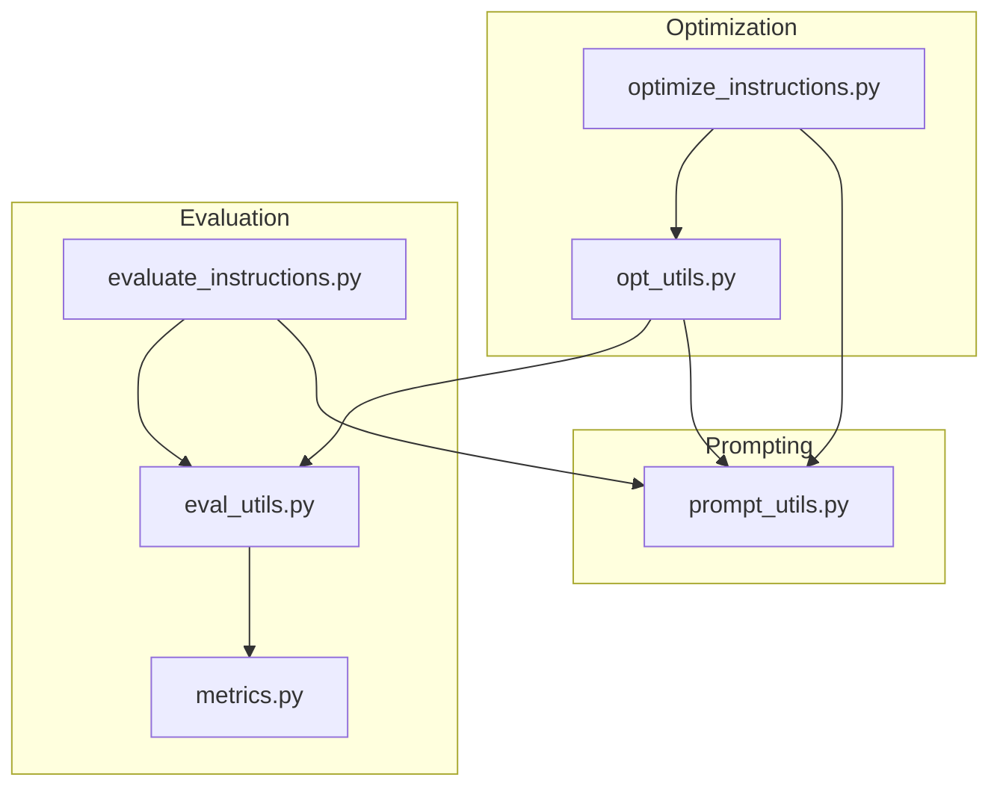
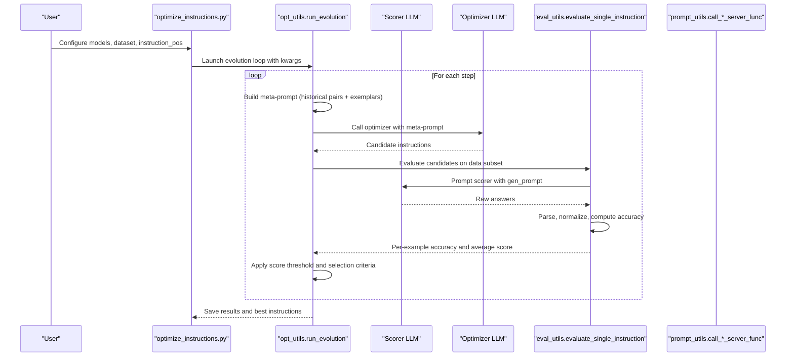
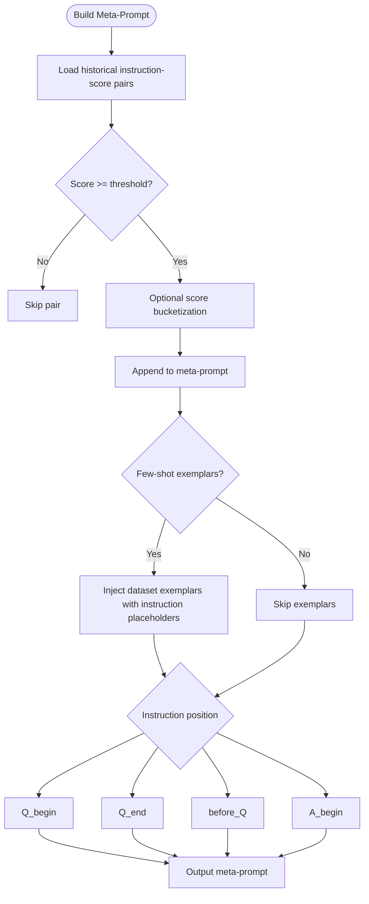
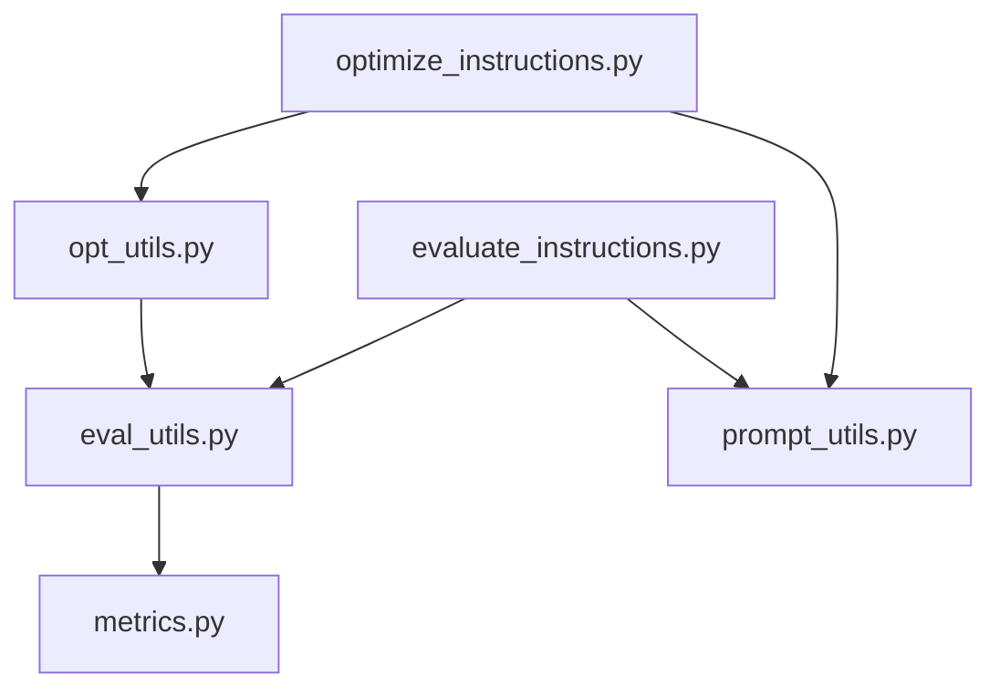

# Core Concepts

<cite>
**Referenced Files in This Document**
- [README.md](file://README.md)
- [optimize_instructions.py](file://opro/optimization/optimize_instructions.py)
- [opt_utils.py](file://opro/optimization/opt_utils.py)
- [prompt_utils.py](file://opro/prompt_utils.py)
- [evaluate_instructions.py](file://opro/evaluation/evaluate_instructions.py)
- [eval_utils.py](file://opro/evaluation/eval_utils.py)
- [metrics.py](file://opro/evaluation/metrics.py)
</cite>

## Table of Contents
1. [Introduction](#introduction)
2. [Project Structure](#project-structure)
3. [Core Components](#core-components)
4. [Architecture Overview](#architecture-overview)
5. [Detailed Component Analysis](#detailed-component-analysis)
6. [Dependency Analysis](#dependency-analysis)
7. [Performance Considerations](#performance-considerations)
8. [Troubleshooting Guide](#troubleshooting-guide)
9. [Conclusion](#conclusion)

## Introduction
This document explains the fundamental abstractions in opro, focusing on how two distinct LLMs cooperate: a scorer LLM that evaluates instruction quality and an optimizer LLM that generates improved instructions. It clarifies the structure of meta-prompts, the concept of instruction-score pairs, and how feedback from the scorer drives instruction improvement. It also explains how temperature, max_decode_steps, and batch_size control LLM behavior during optimization, and how “instruction position” (Q_begin vs Q_end) affects prompt formatting. Concrete examples from the codebase illustrate how historical instruction-performance data is transformed into optimization signals, and how iterative refinement and score thresholds influence instruction selection.

## Project Structure
The repository organizes functionality into three main areas:
- Optimization: orchestrates instruction search and meta-prompt construction
- Evaluation: measures instruction quality using a scorer LLM
- Prompting utilities: low-level wrappers for external model APIs

**Diagram sources**
- [optimize_instructions.py](file://opro/optimization/optimize_instructions.py#L1-L120)
- [opt_utils.py](file://opro/optimization/opt_utils.py#L1-L120)
- [evaluate_instructions.py](file://opro/evaluation/evaluate_instructions.py#L1-L120)
- [eval_utils.py](file://opro/evaluation/eval_utils.py#L1-L120)
- [metrics.py](file://opro/evaluation/metrics.py#L1-L120)
- [prompt_utils.py](file://opro/prompt_utils.py#L1-L120)

**Section sources**
- [README.md](file://README.md#L1-L79)
- [optimize_instructions.py](file://opro/optimization/optimize_instructions.py#L1-L120)
- [opt_utils.py](file://opro/optimization/opt_utils.py#L1-L120)
- [evaluate_instructions.py](file://opro/evaluation/evaluate_instructions.py#L1-L120)
- [eval_utils.py](file://opro/evaluation/eval_utils.py#L1-L120)
- [metrics.py](file://opro/evaluation/metrics.py#L1-L120)
- [prompt_utils.py](file://opro/prompt_utils.py#L1-L120)

## Core Components
- Optimizer LLM: Generates candidate instructions based on meta-prompts and historical performance signals.
- Scorer LLM: Evaluates candidate instructions on held-out examples and returns accuracy metrics.
- Meta-prompts: Structured prompts that embed historical instruction-score pairs and exemplars to guide the optimizer.
- Instruction-score pairs: Historical records of prior instructions and their measured performance, used as feedback signals.
- Instruction position: Controls where the instruction is placed in the formatted prompt (before_Q, Q_begin, Q_end, A_begin).
- Iterative refinement: Repeated cycles of generating candidates, scoring them, and selecting the best-performing instructions to inform future generations.

Key implementation anchors:
- Meta-prompt construction and exemplar injection: [gen_meta_prompt](file://opro/optimization/opt_utils.py#L90-L335)
- Instruction-score pair aggregation: [gen_ins_and_score_pairs_substr](file://opro/optimization/opt_utils.py#L52-L88)
- Instruction evaluation pipeline: [evaluate_single_instruction](file://opro/evaluation/eval_utils.py#L536-L800)
- Prompt formatting for different datasets and positions: [gen_prompt](file://opro/evaluation/eval_utils.py#L164-L259)
- Scoring and normalization: [metrics.get_normalized_prediction](file://opro/evaluation/metrics.py#L188-L343)

**Section sources**
- [opt_utils.py](file://opro/optimization/opt_utils.py#L52-L335)
- [eval_utils.py](file://opro/evaluation/eval_utils.py#L164-L800)
- [metrics.py](file://opro/evaluation/metrics.py#L188-L343)

## Architecture Overview
The system alternates between two roles:
- Scoring: The scorer LLM evaluates candidate instructions on a subset of data and computes per-example accuracy.
- Optimizing: The optimizer LLM reads a meta-prompt containing historical instruction-score pairs and exemplars, then proposes new instructions designed to improve performance.

**Diagram sources**
- [optimize_instructions.py](file://opro/optimization/optimize_instructions.py#L700-L800)
- [opt_utils.py](file://opro/optimization/opt_utils.py#L528-L1012)
- [eval_utils.py](file://opro/evaluation/eval_utils.py#L536-L800)
- [prompt_utils.py](file://opro/prompt_utils.py#L21-L133)

## Detailed Component Analysis

### Optimizer vs Scorer LLMs
- Optimizer LLM: Receives a meta-prompt and produces candidate instructions. Its behavior is controlled by temperature, max_decode_steps, and batch_size. The optimizer’s temperature determines exploration; higher values increase diversity, lower values favor determinism. Batch size controls how many prompts are sent to the serving endpoint in parallel.
- Scorer LLM: Consumes prompts built by gen_prompt and returns raw answers. Its temperature is typically set to zero for deterministic decoding. Batch size and max_decode_steps are configured to balance throughput and output length.

Behavioral controls:
- Temperature: Configured per model in [optimize_instructions.py](file://opro/optimization/optimize_instructions.py#L240-L354) and [optimize_instructions.py](file://opro/optimization/optimize_instructions.py#L300-L354).
- Max_decode_steps: Limits output length for both models in [optimize_instructions.py](file://opro/optimization/optimize_instructions.py#L240-L354) and [optimize_instructions.py](file://opro/optimization/optimize_instructions.py#L300-L354).
- Batch_size: Serves as the serving batch size for both models in [optimize_instructions.py](file://opro/optimization/optimize_instructions.py#L240-L354) and [optimize_instructions.py](file://opro/optimization/optimize_instructions.py#L300-L354).

Selection and thresholding:
- Score threshold: Discards instructions below a threshold to filter poor candidates. See [run_evolution](file://opro/optimization/opt_utils.py#L528-L567) and [run_evolution](file://opro/optimization/opt_utils.py#L728-L783).
- Few-shot exemplars: Selected based on frequent wrong questions or random subsets to focus learning on challenging cases. See [run_evolution](file://opro/optimization/opt_utils.py#L588-L688).

**Section sources**
- [optimize_instructions.py](file://opro/optimization/optimize_instructions.py#L240-L354)
- [optimize_instructions.py](file://opro/optimization/optimize_instructions.py#L300-L354)
- [opt_utils.py](file://opro/optimization/opt_utils.py#L528-L567)
- [opt_utils.py](file://opro/optimization/opt_utils.py#L588-L688)
- [opt_utils.py](file://opro/optimization/opt_utils.py#L728-L783)

### Meta-Prompts and Instruction-Score Pairs
Meta-prompts combine:
- Historical instruction-score pairs: Encourages the optimizer to propose novel instructions that outperform previous ones.
- Few-shot exemplars: Demonstrates how the instruction should be applied to concrete examples.
- Task and dataset context: Helps the optimizer tailor instructions to the specific domain.

Instruction-score pairs:
- Aggregation: Sorts by score and filters by threshold; optionally buckets scores for compactness. See [gen_ins_and_score_pairs_substr](file://opro/optimization/opt_utils.py#L52-L88).
- Presentation: Outputs a structured string of instruction-score entries for inclusion in the meta-prompt. See [gen_meta_prompt](file://opro/optimization/opt_utils.py#L184-L191).

Meta-prompt construction:
- Instruction placement: Supports before_Q, Q_begin, Q_end, A_begin. See [gen_meta_prompt](file://opro/optimization/opt_utils.py#L140-L149) and [gen_meta_prompt](file://opro/optimization/opt_utils.py#L221-L233).
- Exemplars: Injects dataset-specific examples with placeholders for the instruction. See [gen_meta_prompt](file://opro/optimization/opt_utils.py#L210-L254).

Example anchor:
- Meta-prompt building and instruction extraction: [gen_meta_prompt](file://opro/optimization/opt_utils.py#L90-L335)

**Diagram sources**
- [opt_utils.py](file://opro/optimization/opt_utils.py#L52-L88)
- [opt_utils.py](file://opro/optimization/opt_utils.py#L90-L335)

**Section sources**
- [opt_utils.py](file://opro/optimization/opt_utils.py#L52-L88)
- [opt_utils.py](file://opro/optimization/opt_utils.py#L90-L335)

### Instruction Position and Prompt Formatting
Instruction position defines where the instruction appears in the prompt:
- before_Q: Instruction before the question block
- Q_begin: Instruction at the beginning of the question
- Q_end: Instruction at the end of the question
- A_begin: Instruction at the beginning of the answer

Formatting logic:
- Dataset-specific formatting is handled by gen_prompt, which constructs the question text and answer delimiter according to dataset conventions. See [gen_prompt](file://opro/evaluation/eval_utils.py#L164-L259).
- Meta-prompt formatting injects instruction placeholders at the chosen position. See [gen_meta_prompt](file://opro/optimization/opt_utils.py#L221-L233).

Practical effect:
- Q_begin/Q_end place the instruction inside the question context, encouraging the model to condition on the instruction when answering.
- A_begin places the instruction at the start of the answer, guiding the model to produce a response conditioned on the instruction.

**Section sources**
- [eval_utils.py](file://opro/evaluation/eval_utils.py#L164-L259)
- [opt_utils.py](file://opro/optimization/opt_utils.py#L221-L233)

### Iterative Refinement and Selection Criteria
The optimization loop iteratively:
- Builds a meta-prompt with recent instruction-score pairs and selected exemplars
- Generates candidate instructions
- Scores them using the evaluator
- Applies a score threshold and selection criteria (e.g., frequent wrong questions, random selection)
- Retains the best instructions to inform future generations

Selection mechanisms:
- Current-most-frequent wrong questions: Focus on exemplars that current instructions still misclassify. See [run_evolution](file://opro/optimization/opt_utils.py#L615-L688).
- Accumulative-most-frequent wrong questions: Use a global counter across steps. See [run_evolution](file://opro/optimization/opt_utils.py#L588-L614).
- Random/Constant: Baselines for comparison. See [run_evolution](file://opro/optimization/opt_utils.py#L670-L688).

Thresholding:
- Instructions below a score threshold are discarded to reduce noise. See [run_evolution](file://opro/optimization/opt_utils.py#L528-L567) and [run_evolution](file://opro/optimization/opt_utils.py#L728-L783).

**Section sources**
- [opt_utils.py](file://opro/optimization/opt_utils.py#L588-L688)
- [opt_utils.py](file://opro/optimization/opt_utils.py#L528-L567)
- [opt_utils.py](file://opro/optimization/opt_utils.py#L728-L783)

### Example Meta-Prompt Construction
The function [gen_meta_prompt](file://opro/optimization/opt_utils.py#L90-L335) builds a meta-prompt by:
- Selecting historical instruction-score pairs filtered by threshold and optionally bucketized
- Optionally injecting few-shot exemplars from the dataset
- Placing the instruction at the chosen position (before_Q, Q_begin, Q_end, A_begin)
- Adding explicit instructions to the optimizer to propose novel, higher-scoring instructions

This meta-prompt serves as the optimization signal: the optimizer learns to propose instructions that improve performance on the dataset and exemplars.

**Section sources**
- [opt_utils.py](file://opro/optimization/opt_utils.py#L90-L335)

## Dependency Analysis
The optimization and evaluation modules depend on shared utilities for prompt formatting and scoring.

**Diagram sources**
- [optimize_instructions.py](file://opro/optimization/optimize_instructions.py#L1-L120)
- [opt_utils.py](file://opro/optimization/opt_utils.py#L1-L120)
- [eval_utils.py](file://opro/evaluation/eval_utils.py#L1-L120)
- [metrics.py](file://opro/evaluation/metrics.py#L1-L120)
- [prompt_utils.py](file://opro/prompt_utils.py#L1-L120)
- [evaluate_instructions.py](file://opro/evaluation/evaluate_instructions.py#L1-L120)

**Section sources**
- [optimize_instructions.py](file://opro/optimization/optimize_instructions.py#L1-L120)
- [opt_utils.py](file://opro/optimization/opt_utils.py#L1-L120)
- [eval_utils.py](file://opro/evaluation/eval_utils.py#L1-L120)
- [metrics.py](file://opro/evaluation/metrics.py#L1-L120)
- [prompt_utils.py](file://opro/prompt_utils.py#L1-L120)
- [evaluate_instructions.py](file://opro/evaluation/evaluate_instructions.py#L1-L120)

## Performance Considerations
- Temperature scheduling: The optimizer’s temperature can be scheduled to increase linearly over steps to encourage exploration early and exploit later. See [run_evolution](file://opro/optimization/opt_utils.py#L573-L581).
- Batch size: Controls throughput; larger batches increase speed but require more memory and may increase latency. See [optimize_instructions.py](file://opro/optimization/optimize_instructions.py#L240-L354).
- Max_decode_steps: Limits output length; too small may truncate answers, too large may waste resources. See [optimize_instructions.py](file://opro/optimization/optimize_instructions.py#L240-L354).
- Few-shot selection: Reducing the number of exemplars narrows focus and reduces cost, but may limit generalization. See [run_evolution](file://opro/optimization/opt_utils.py#L670-L688).

[No sources needed since this section provides general guidance]

## Troubleshooting Guide
Common issues and mitigations:
- Rate limits and timeouts: The prompt utilities wrap API calls with retry logic and backoff. See [prompt_utils.py](file://opro/prompt_utils.py#L21-L133).
- Model configuration mismatches: Ensure serving batch sizes and max_decode_steps match the model’s capabilities. See [optimize_instructions.py](file://opro/optimization/optimize_instructions.py#L240-L354).
- Parsing failures: The evaluator normalizes predictions and handles multiple formats; adjust treat_as_number/bool and num_decimals as needed. See [eval_utils.py](file://opro/evaluation/eval_utils.py#L788-L800) and [metrics.py](file://opro/evaluation/metrics.py#L188-L343).
- Low-quality candidates: Increase temperature or adjust score threshold to improve signal-to-noise. See [run_evolution](file://opro/optimization/opt_utils.py#L528-L567).

**Section sources**
- [prompt_utils.py](file://opro/prompt_utils.py#L21-L133)
- [optimize_instructions.py](file://opro/optimization/optimize_instructions.py#L240-L354)
- [eval_utils.py](file://opro/evaluation/eval_utils.py#L788-L800)
- [metrics.py](file://opro/evaluation/metrics.py#L188-L343)
- [opt_utils.py](file://opro/optimization/opt_utils.py#L528-L567)

## Conclusion
opro’s core idea is to use a scorer LLM to quantify instruction quality and an optimizer LLM to propose improvements guided by historical performance signals embedded in meta-prompts. The instruction position influences how the model conditions on the instruction, while temperature, max_decode_steps, and batch_size shape the optimizer’s exploration and throughput. Iterative refinement with score thresholds and strategic few-shot exemplars enables steady improvement over time.