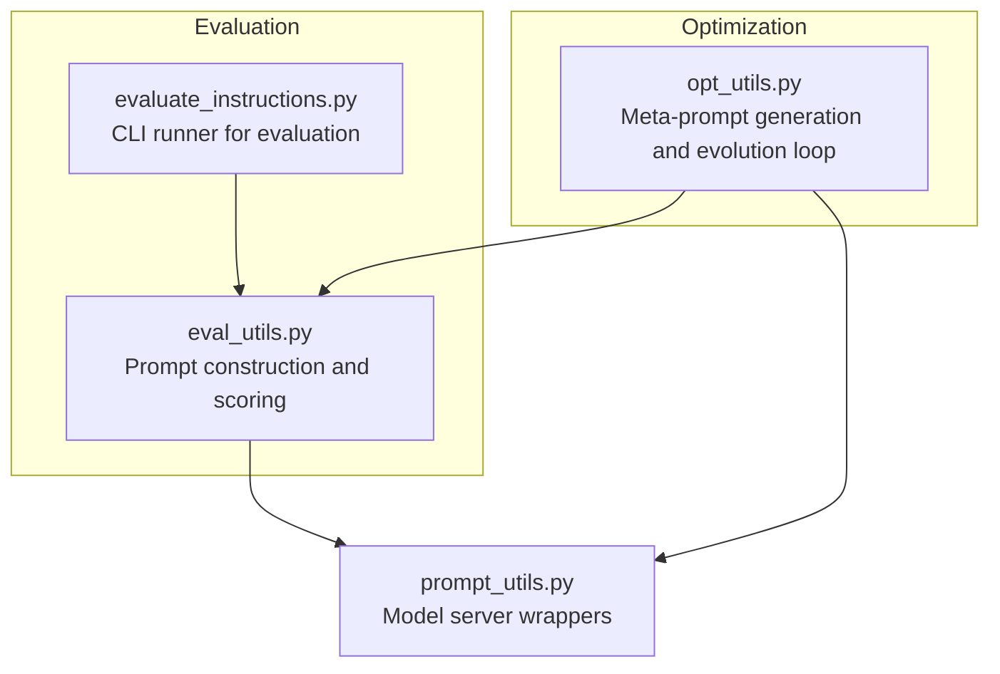
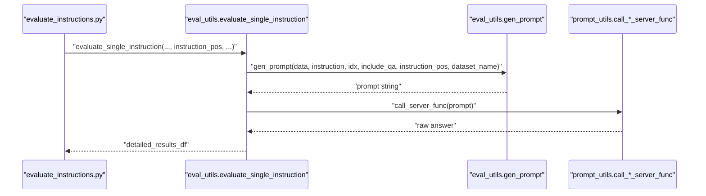
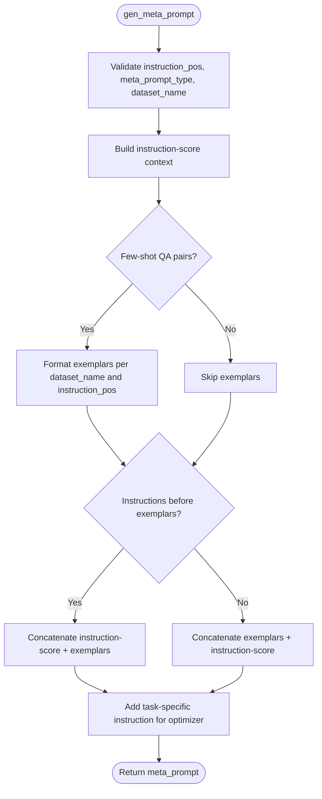
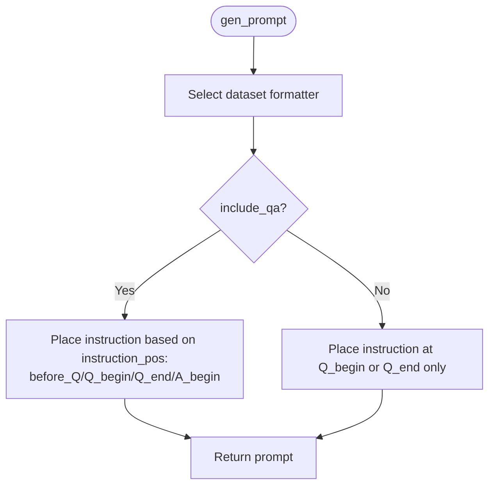
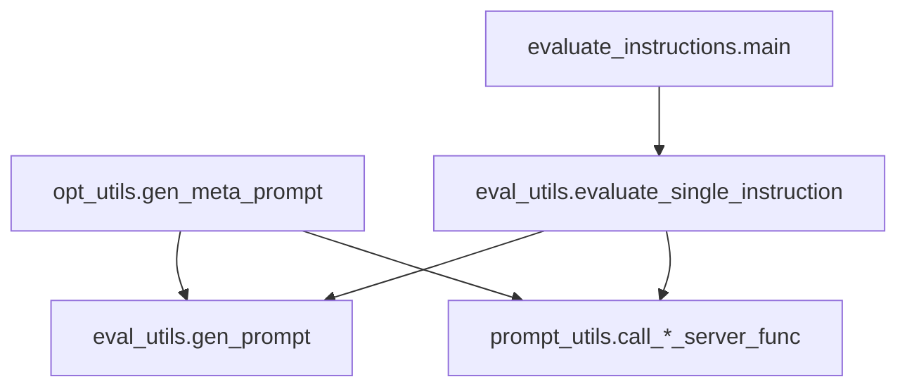

# Instruction Positioning Strategies

<cite>
**Referenced Files in This Document**
- [opt_utils.py](file://opro/optimization/opt_utils.py)
- [eval_utils.py](file://opro/evaluation/eval_utils.py)
- [evaluate_instructions.py](file://opro/evaluation/evaluate_instructions.py)
- [prompt_utils.py](file://opro/prompt_utils.py)
</cite>

## Table of Contents
1. [Introduction](#introduction)
2. [Project Structure](#project-structure)
3. [Core Components](#core-components)
4. [Architecture Overview](#architecture-overview)
5. [Detailed Component Analysis](#detailed-component-analysis)
6. [Dependency Analysis](#dependency-analysis)
7. [Performance Considerations](#performance-considerations)
8. [Troubleshooting Guide](#troubleshooting-guide)
9. [Conclusion](#conclusion)

## Introduction
This document explains the instruction positioning strategies used in opro, focusing on the instruction_pos parameter that controls where an instruction is placed within prompts. The four valid positions are:
- before_Q: before the question segment
- Q_begin: at the beginning of the question
- Q_end: at the end of the question
- A_begin: at the beginning of the answer

We describe how instruction_pos influences prompt construction during both meta-prompt generation (optimization phase) and single-instruction evaluation (evaluation phase). We also explain dataset-specific constraints and provide guidance for selecting optimal positioning strategies and troubleshooting common formatting issues.

## Project Structure
The instruction positioning logic spans two primary modules:
- Optimization utilities: generate meta-prompts and orchestrate instruction refinement loops
- Evaluation utilities: construct prompts for scoring individual instructions and compute accuracy

**Diagram sources**
- [opt_utils.py](file://opro/optimization/opt_utils.py#L90-L335)
- [eval_utils.py](file://opro/evaluation/eval_utils.py#L164-L259)
- [evaluate_instructions.py](file://opro/evaluation/evaluate_instructions.py#L548-L745)
- [prompt_utils.py](file://opro/prompt_utils.py#L21-L133)

**Section sources**
- [opt_utils.py](file://opro/optimization/opt_utils.py#L90-L335)
- [eval_utils.py](file://opro/evaluation/eval_utils.py#L164-L259)
- [evaluate_instructions.py](file://opro/evaluation/evaluate_instructions.py#L548-L745)
- [prompt_utils.py](file://opro/prompt_utils.py#L21-L133)

## Core Components
- Meta-prompt generation (instruction rewriting): gen_meta_prompt constructs a structured prompt for optimizing instructions, conditioning on instruction_pos, dataset_name, and model type.
- Single-instruction prompt construction: gen_prompt builds a per-example prompt for evaluation, conditioning on instruction_pos and dataset_name.
- Evaluation pipeline: evaluate_single_instruction orchestrates prompt generation, model inference, and accuracy computation, passing instruction_pos through to gen_prompt.

Key constraints:
- instruction_pos must be one of before_Q, Q_begin, Q_end, A_begin
- dataset_name must be one of mmlu, bbh, gsm8k (and others in evaluation contexts)
- include_qa toggles whether Q: and A: markers are used in prompts

**Section sources**
- [opt_utils.py](file://opro/optimization/opt_utils.py#L90-L335)
- [eval_utils.py](file://opro/evaluation/eval_utils.py#L164-L259)
- [evaluate_instructions.py](file://opro/evaluation/evaluate_instructions.py#L195-L204)

## Architecture Overview
The instruction positioning strategy is enforced consistently across:
- Meta-prompt construction: determines how exemplars and instruction-score pairs are embedded
- Per-example prompt construction: determines how the instruction appears in each test instance
- Model server calls: inference is performed with the constructed prompts

**Diagram sources**
- [evaluate_instructions.py](file://opro/evaluation/evaluate_instructions.py#L673-L745)
- [eval_utils.py](file://opro/evaluation/eval_utils.py#L536-L864)
- [prompt_utils.py](file://opro/prompt_utils.py#L21-L133)

## Detailed Component Analysis

### Meta-Prompt Generation (Optimization Phase)
The gen_meta_prompt function builds a meta-prompt for instruction refinement. It:
- Validates instruction_pos and dataset_name
- Builds an instruction-score context block
- Optionally adds few-shot QA exemplars
- Adds a task-specific instruction-generation instruction
- Supports two meta_prompt_type modes:
  - both_instructions_and_exemplars: includes instruction-score pairs and exemplars
  - instructions_only: only instruction-score pairs (used with pre-trained optimizers)

Position-specific effects in exemplar formatting:
- before_Q: places the instruction before the question marker
- Q_begin: inserts the instruction at the beginning of the question
- Q_end: appends the instruction at the end of the question
- A_begin: places the instruction at the beginning of the answer segment

Dataset-specific formatting:
- mmlu: uses a dedicated formatter and expects the last column as the answer
- bbh: uses input/target fields
- gsm8k: uses first column as question and second as answer

Model-specific instructions:
- GPT models receive instructions framed around <INS> or <Start> markers
- text-bison receives instructions framed around square-bracketed text

**Diagram sources**
- [opt_utils.py](file://opro/optimization/opt_utils.py#L90-L335)

**Section sources**
- [opt_utils.py](file://opro/optimization/opt_utils.py#L90-L335)

### Single-Instruction Prompt Construction (Evaluation Phase)
The gen_prompt function constructs a single example prompt for evaluation. It:
- Selects dataset-specific question formatting
- Places the instruction according to instruction_pos
- Handles include_qa to toggle Q:/A: markers
- Supports the same four positions as in meta-prompt generation

Position-specific effects:
- before_Q: instruction appears before the Q: marker
- Q_begin: instruction inserted at the start of the question
- Q_end: instruction appended at the end of the question
- A_begin: instruction inserted at the start of the answer segment

**Diagram sources**
- [eval_utils.py](file://opro/evaluation/eval_utils.py#L164-L259)

**Section sources**
- [eval_utils.py](file://opro/evaluation/eval_utils.py#L164-L259)

### Practical Implications by Position
- before_Q: Prepares contextual background before the question. Useful when the instruction sets up domain knowledge or task framing.
- Q_begin: Modifies the question’s beginning to guide reasoning or clarify intent. Good for multi-step reasoning tasks.
- Q_end: Appends the instruction at the end of the question. Useful when the instruction should not alter the question wording but still guide the answer.
- A_begin: Controls answer generation by placing the instruction at the start of the answer segment. Effective for structured answer extraction or constrained output formatting.

Guidance:
- Choose Q_begin or Q_end for question-centric tasks where the instruction should influence reasoning flow.
- Choose A_begin for tasks requiring strict answer formatting or extraction.
- Use before_Q when the instruction acts as a preamble or policy statement.

**Section sources**
- [opt_utils.py](file://opro/optimization/opt_utils.py#L140-L160)
- [eval_utils.py](file://opro/evaluation/eval_utils.py#L201-L210)

### Dataset-Specific Constraints
- Validation: instruction_pos is validated to be one of the four positions.
- dataset_name constraints:
  - Optimization: instruction_pos is validated to be one of mmlu, bbh, gsm8k.
  - Evaluation CLI: dataset_name is validated to be one of mmlu, bbh, gsm8k, multiarith, aqua.
- Formatting differences:
  - mmlu: question plus multiple-choice options; answer in last column
  - bbh: input/target fields
  - gsm8k: first column question, second column answer

These constraints ensure consistent prompt construction and evaluation across datasets.

**Section sources**
- [opt_utils.py](file://opro/optimization/opt_utils.py#L154-L159)
- [evaluate_instructions.py](file://opro/evaluation/evaluate_instructions.py#L125-L134)
- [eval_utils.py](file://opro/evaluation/eval_utils.py#L211-L222)

### Example: How instruction_pos Affects Final Prompt Structure
- before_Q: instruction precedes Q:, then question and A:
- Q_begin: Q: begins with instruction, then question and A:
- Q_end: Q: ends with question, then instruction, then A:
- A_begin: Q: ends with question, then A: begins with instruction

These placements are reflected in the conditional branches within gen_prompt and in the exemplar formatting logic inside gen_meta_prompt.

**Section sources**
- [eval_utils.py](file://opro/evaluation/eval_utils.py#L224-L249)
- [opt_utils.py](file://opro/optimization/opt_utils.py#L220-L246)

### Selection Guidance and Troubleshooting
- Selecting a position:
  - Reasoning-heavy tasks: Q_begin or Q_end
  - Extraction tasks: A_begin
  - Framing tasks: before_Q
- Troubleshooting formatting issues:
  - Ensure include_qa matches the model’s expected input format
  - Verify dataset_name matches the actual dataset to avoid misformatted exemplars
  - Confirm instruction_pos is one of the supported values
  - For GPT models, ensure the instruction is wrapped with <INS> or <Start> markers as expected by the meta-prompt construction

**Section sources**
- [opt_utils.py](file://opro/optimization/opt_utils.py#L140-L160)
- [eval_utils.py](file://opro/evaluation/eval_utils.py#L201-L210)
- [evaluate_instructions.py](file://opro/evaluation/evaluate_instructions.py#L195-L204)

## Dependency Analysis
The instruction positioning logic depends on:
- Dataset formatters and loaders
- Model server wrappers for inference
- CLI configuration for evaluation

**Diagram sources**
- [opt_utils.py](file://opro/optimization/opt_utils.py#L90-L335)
- [eval_utils.py](file://opro/evaluation/eval_utils.py#L164-L864)
- [evaluate_instructions.py](file://opro/evaluation/evaluate_instructions.py#L548-L745)
- [prompt_utils.py](file://opro/prompt_utils.py#L21-L133)

**Section sources**
- [opt_utils.py](file://opro/optimization/opt_utils.py#L90-L335)
- [eval_utils.py](file://opro/evaluation/eval_utils.py#L164-L864)
- [evaluate_instructions.py](file://opro/evaluation/evaluate_instructions.py#L548-L745)
- [prompt_utils.py](file://opro/prompt_utils.py#L21-L133)

## Performance Considerations
- Few-shot selection criteria influence how many exemplars are included in meta-prompts, affecting both runtime and instruction quality.
- Parallel evaluation reduces latency for large datasets, but model-specific constraints (e.g., GPT models) may require careful batching.
- Temperature schedules in the optimization loop can affect diversity and stability of generated instructions.

[No sources needed since this section provides general guidance]

## Troubleshooting Guide
Common issues and resolutions:
- Invalid instruction_pos: Ensure it is one of before_Q, Q_begin, Q_end, A_begin.
- Unsupported dataset_name: Ensure dataset_name is one of mmlu, bbh, gsm8k (or the evaluation-supported set).
- Formatting mismatch with include_qa: Align include_qa with the model’s expected input format.
- Exemplar formatting errors: Verify dataset_name and the corresponding formatter is used.

**Section sources**
- [opt_utils.py](file://opro/optimization/opt_utils.py#L140-L160)
- [evaluate_instructions.py](file://opro/evaluation/evaluate_instructions.py#L125-L134)
- [eval_utils.py](file://opro/evaluation/eval_utils.py#L201-L210)

## Conclusion
Instruction positioning is a powerful mechanism to steer model behavior by controlling where an instruction appears in prompts. The four positions—before_Q, Q_begin, Q_end, A_begin—each offer distinct advantages depending on the task type and desired control over reasoning or answer generation. By validating instruction_pos and dataset_name, and by aligning include_qa with model expectations, users can reliably construct prompts that improve instruction quality and evaluation outcomes.