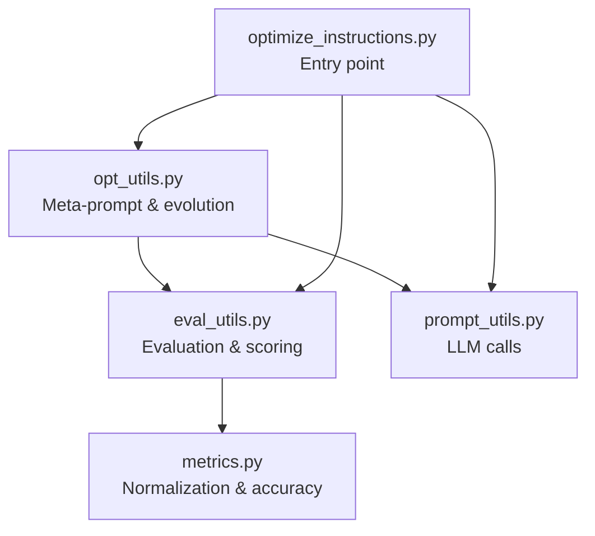
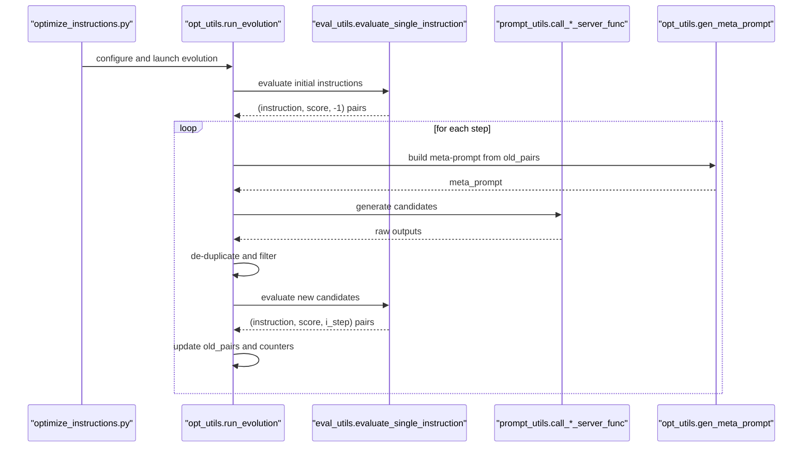
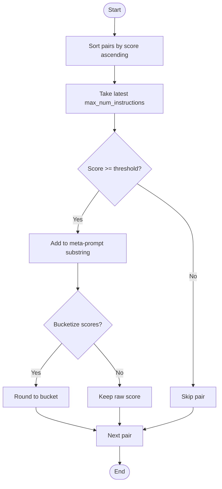
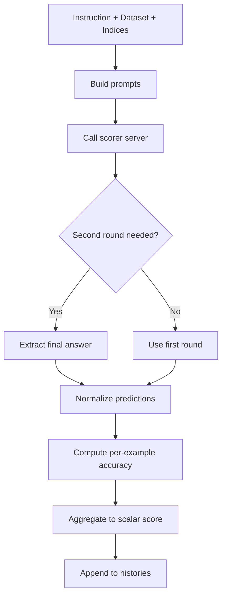
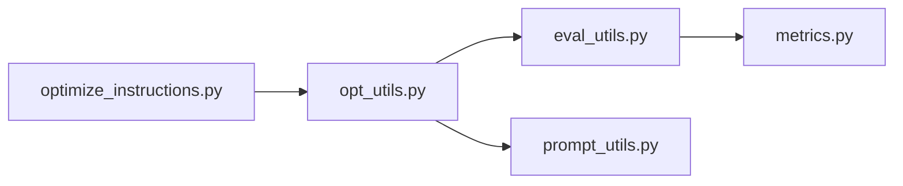

# Instruction-Score Pairs and Iterative Refinement

<cite>
**Referenced Files in This Document**
- [opt_utils.py](file://opro/optimization/opt_utils.py)
- [optimize_instructions.py](file://opro/optimization/optimize_instructions.py)
- [evaluate_instructions.py](file://opro/evaluation/evaluate_instructions.py)
- [eval_utils.py](file://opro/evaluation/eval_utils.py)
- [prompt_utils.py](file://opro/prompt_utils.py)
- [metrics.py](file://opro/evaluation/metrics.py)
</cite>

## Table of Contents
1. [Introduction](#introduction)
2. [Project Structure](#project-structure)
3. [Core Components](#core-components)
4. [Architecture Overview](#architecture-overview)
5. [Detailed Component Analysis](#detailed-component-analysis)
6. [Dependency Analysis](#dependency-analysis)
7. [Performance Considerations](#performance-considerations)
8. [Troubleshooting Guide](#troubleshooting-guide)
9. [Conclusion](#conclusion)
10. [Appendices](#appendices)

## Introduction
This document explains how instruction-score pairs serve as the fundamental unit of optimization in opro. Each pair consists of:
- An instruction text
- Its performance score (accuracy) computed on held-out examples
- The step index of its generation

These pairs are maintained in lists and dictionaries and drive iterative refinement through a meta-prompt mechanism. The system filters and sorts prior pairs by score, limits their inclusion by a configurable threshold, and uses them to guide the optimizer LLM in generating new, higher-performing instructions. Redundancy prevention is handled by hashing and deduplication sets, while progress is tracked across generations via dedicated lists and evaluation results.

## Project Structure
The optimization pipeline centers around:
- Optimization utilities that construct meta-prompts and orchestrate evolution
- A driver script that wires model configs and datasets
- Evaluation utilities that compute per-example accuracy and aggregate scores
- Prompt utilities that call external LLM APIs
- Metrics utilities that normalize predictions and compute accuracy

**Diagram sources**
- [optimize_instructions.py](file://opro/optimization/optimize_instructions.py#L736-L800)
- [opt_utils.py](file://opro/optimization/opt_utils.py#L338-L800)
- [eval_utils.py](file://opro/evaluation/eval_utils.py#L536-L917)
- [prompt_utils.py](file://opro/prompt_utils.py#L1-L133)
- [metrics.py](file://opro/evaluation/metrics.py#L1-L496)

**Section sources**
- [optimize_instructions.py](file://opro/optimization/optimize_instructions.py#L1-L200)
- [opt_utils.py](file://opro/optimization/opt_utils.py#L338-L800)

## Core Components
- Instruction-score pairs: stored as triples (instruction, score, step_index)
  - Maintained in:
    - old_instructions_and_scores: sorted by score, filtered by threshold, limited by count
    - old_instructions_and_scores_raw: retains all generated pairs including skipped ones
  - Used to construct meta-prompts and guide new instruction generation
- Meta-prompt construction: gen_meta_prompt builds a context that includes prior instruction-score pairs and optional few-shot exemplars
- Scoring and evaluation: evaluate_single_instruction computes per-example accuracy and aggregates to a scalar score
- Deduplication and caching:
  - instruction_score_dict prevents redundant evaluations
  - old_instruction_md5_hashstrings_set avoids duplicate instructions
- Progress tracking:
  - eval_results records periodic evaluation snapshots
  - wrong_questions_from_start_counter counts frequently wrong questions to inform few-shot selection

**Section sources**
- [opt_utils.py](file://opro/optimization/opt_utils.py#L432-L470)
- [opt_utils.py](file://opro/optimization/opt_utils.py#L520-L560)
- [opt_utils.py](file://opro/optimization/opt_utils.py#L690-L750)
- [eval_utils.py](file://opro/evaluation/eval_utils.py#L536-L917)

## Architecture Overview
The iterative refinement loop proceeds as follows:
1. Initialize with seed instructions and evaluate them to produce baseline pairs
2. At each step:
   - Select few-shot exemplars (optional) based on historical wrong answers
   - Build a meta-prompt from prior pairs (filtered by threshold and sorted by score)
   - Generate new candidate instructions from the optimizer LLM
   - De-duplicate candidates and skip duplicates
   - Evaluate candidates and append to the history
   - Optionally record evaluation snapshots

**Diagram sources**
- [optimize_instructions.py](file://opro/optimization/optimize_instructions.py#L736-L800)
- [opt_utils.py](file://opro/optimization/opt_utils.py#L338-L800)
- [eval_utils.py](file://opro/evaluation/eval_utils.py#L536-L917)
- [prompt_utils.py](file://opro/prompt_utils.py#L1-L133)

## Detailed Component Analysis

### Instruction-Score Pair Representation and Storage
- Data structure: list of triples (instruction, score, step_index)
- Two histories:
  - old_instructions_and_scores: filtered and sorted by score, limited by max count
  - old_instructions_and_scores_raw: includes all pairs, including skipped ones (NaN score)
- Dictionary for deduplication: instruction_score_dict maps instruction to score
- Hash set for duplicate avoidance: old_instruction_md5_hashstrings_set stores MD5 hashes of instructions

Key behaviors:
- Initial evaluation populates both histories and the dictionary
- New candidates are appended only if not previously hashed
- Skipped instructions (e.g., NaN scores) remain in raw history for debugging

**Section sources**
- [opt_utils.py](file://opro/optimization/opt_utils.py#L432-L470)
- [opt_utils.py](file://opro/optimization/opt_utils.py#L520-L560)
- [opt_utils.py](file://opro/optimization/opt_utils.py#L790-L800)

### Filtering and Sorting with Thresholds
- gen_ins_and_score_pairs_substr filters prior pairs by a minimum score threshold and sorts by score ascending, then takes the top-k by max_num_instructions
- Sorting order ensures higher-scoring pairs appear later in the constructed substring, enabling downstream selection of “higher than all above”
- num_score_buckets optionally rounds scores to discrete buckets for presentation

**Diagram sources**
- [opt_utils.py](file://opro/optimization/opt_utils.py#L52-L88)

**Section sources**
- [opt_utils.py](file://opro/optimization/opt_utils.py#L52-L88)

### Meta-Prompt Construction and Few-Shot Selection
- gen_meta_prompt composes:
  - Prior instruction-score pairs (filtered and sorted)
  - Optional few-shot QA exemplars selected by criteria:
    - accumulative_most_frequent: global wrong-question counter
    - current_most_frequent: wrong-question counter from current meta-prompt
    - random or constant sampling
- The meta-prompt instructs the optimizer to propose new instructions that exceed the highest prior score

Few-shot selection logic:
- For current_most_frequent, it reads per-instruction CSVs from result_by_instruction_folder and recomputes wrong-question counts from recent pairs

**Section sources**
- [opt_utils.py](file://opro/optimization/opt_utils.py#L90-L136)
- [opt_utils.py](file://opro/optimization/opt_utils.py#L615-L688)
- [opt_utils.py](file://opro/optimization/opt_utils.py#L690-L750)

### Candidate Generation and De-duplication
- The optimizer generates multiple candidates per step; extraction depends on model and meta-prompt type
- De-duplication uses MD5 hash of instruction text; duplicates are skipped and logged
- Non-evaluated candidates (e.g., NaN scores) are retained in raw history for debugging

**Section sources**
- [opt_utils.py](file://opro/optimization/opt_utils.py#L730-L800)

### Scoring and Accuracy Computation
- evaluate_single_instruction:
  - Builds prompts per example
  - Calls the scorer server (parallel or serial)
  - Optionally performs a second round to extract final answers
  - Normalizes predictions via metrics.get_normalized_prediction
  - Computes per-example accuracy and aggregates to a scalar score
- The scalar score is used to rank and filter prior pairs

**Diagram sources**
- [eval_utils.py](file://opro/evaluation/eval_utils.py#L536-L917)
- [metrics.py](file://opro/evaluation/metrics.py#L188-L343)

**Section sources**
- [eval_utils.py](file://opro/evaluation/eval_utils.py#L536-L917)
- [metrics.py](file://opro/evaluation/metrics.py#L188-L343)

### Role of instruction_score_dict and old_instruction_md5_hashstrings_set
- instruction_score_dict: maps instruction text to its score; used to prevent re-evaluation of identical instructions
- old_instruction_md5_hashstrings_set: stores MD5 hashes of instructions; used to skip duplicates during generation

Together, these ensure efficient reuse of evaluations and avoid redundant computation.

**Section sources**
- [opt_utils.py](file://opro/optimization/opt_utils.py#L438-L450)
- [opt_utils.py](file://opro/optimization/opt_utils.py#L790-L800)

### Tracking Performance Evolution and Progress
- old_instructions_and_scores_raw: captures all generated pairs, including skipped ones, enabling inspection of NaN scores and skipped instructions
- eval_results: periodically records (i_step, instruction, detailed_results_df) snapshots for evaluation
- wrong_questions_from_start_counter: counts frequently wrong questions to guide few-shot selection

Interpretation tips:
- NaN scores indicate skipped instructions (e.g., failed evaluation or below threshold)
- Increasing average scores across steps signal improvement
- Frequent wrong-question spikes can justify focusing on those exemplars

**Section sources**
- [opt_utils.py](file://opro/optimization/opt_utils.py#L432-L470)
- [opt_utils.py](file://opro/optimization/opt_utils.py#L568-L750)

## Dependency Analysis
- optimize_instructions.py orchestrates the end-to-end pipeline, passing model configs and dataset metadata to opt_utils.run_evolution
- opt_utils.py depends on eval_utils for evaluation and prompt_utils for LLM calls
- eval_utils.py depends on metrics.py for normalization and accuracy computation
- prompt_utils.py encapsulates API calls to OpenAI and Google Cloud models

**Diagram sources**
- [optimize_instructions.py](file://opro/optimization/optimize_instructions.py#L736-L800)
- [opt_utils.py](file://opro/optimization/opt_utils.py#L338-L800)
- [eval_utils.py](file://opro/evaluation/eval_utils.py#L536-L917)
- [prompt_utils.py](file://opro/prompt_utils.py#L1-L133)
- [metrics.py](file://opro/evaluation/metrics.py#L1-L496)

**Section sources**
- [optimize_instructions.py](file://opro/optimization/optimize_instructions.py#L736-L800)
- [opt_utils.py](file://opro/optimization/opt_utils.py#L338-L800)
- [eval_utils.py](file://opro/evaluation/eval_utils.py#L536-L917)
- [prompt_utils.py](file://opro/prompt_utils.py#L1-L133)
- [metrics.py](file://opro/evaluation/metrics.py#L1-L496)

## Performance Considerations
- Temperature scheduling: linear increase over steps can improve exploration early, then stabilize later
- Batch sizes and parallelism: controlled by model serving configs; parallel evaluation reduces wall-clock time
- Few-shot selection: focusing on frequent wrong questions improves targeted refinement
- Score bucketization: reduces meta-prompt verbosity and can stabilize instruction selection

[No sources needed since this section provides general guidance]

## Troubleshooting Guide
Common issues and debugging strategies:
- NaN scores:
  - Indicates skipped instructions; inspect old_instructions_and_scores_raw to locate problematic entries
  - Check server logs and retry settings in prompt_utils
- Duplicate instructions:
  - Verify old_instruction_md5_hashstrings_set and instruction_score_dict are populated
  - Confirm polish_sentence and hashing logic are consistent
- Poor convergence:
  - Lower old_instruction_score_threshold to include more prior pairs
  - Increase num_generated_instructions_in_each_step or adjust few-shot selection criteria
  - Inspect eval_results snapshots to identify steps with regressions

**Section sources**
- [opt_utils.py](file://opro/optimization/opt_utils.py#L432-L470)
- [opt_utils.py](file://opro/optimization/opt_utils.py#L790-L800)
- [prompt_utils.py](file://opro/prompt_utils.py#L1-L133)

## Conclusion
Instruction-score pairs are the backbone of opro’s iterative optimization. By filtering and ranking prior pairs, constraining their inclusion with a threshold, and leveraging them in meta-prompts, the system steers the optimizer toward higher-performing instructions. Deduplication and caching reduce redundant work, while detailed histories and evaluation snapshots enable robust debugging and progress monitoring.

[No sources needed since this section summarizes without analyzing specific files]

## Appendices

### How to Interpret Instruction-Score Data for Debugging
- Use old_instructions_and_scores_raw to:
  - Identify skipped instructions (NaN scores)
  - Locate instructions that failed evaluation or were below threshold
- Use eval_results to:
  - Compare performance across steps
  - Spot drops in accuracy that correlate with specific few-shot selections
- Use instruction_score_dict to:
  - Confirm whether an instruction was already evaluated
  - Detect subtle differences in instruction text that still hash to the same value

**Section sources**
- [opt_utils.py](file://opro/optimization/opt_utils.py#L432-L470)
- [opt_utils.py](file://opro/optimization/opt_utils.py#L568-L750)