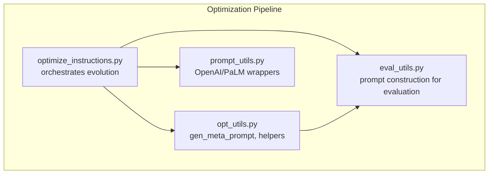
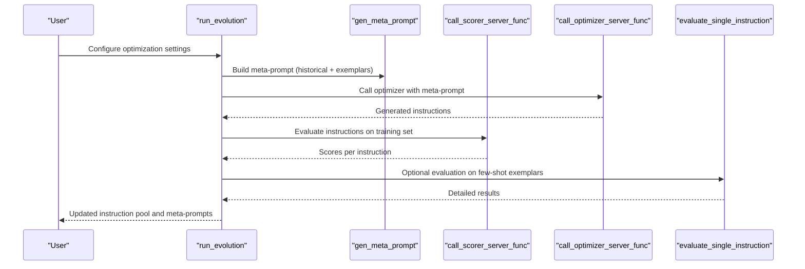
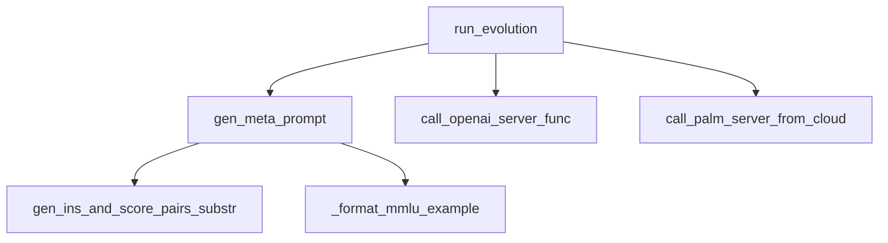

# Meta-Prompt Structure and Generation

<cite>
**Referenced Files in This Document**
- [opt_utils.py](file://opro/optimization/opt_utils.py)
- [optimize_instructions.py](file://opro/optimization/optimize_instructions.py)
- [prompt_utils.py](file://opro/prompt_utils.py)
- [eval_utils.py](file://opro/evaluation/eval_utils.py)
- [README.md](file://README.md)
</cite>

## Table of Contents
1. [Introduction](#introduction)
2. [Project Structure](#project-structure)
3. [Core Components](#core-components)
4. [Architecture Overview](#architecture-overview)
5. [Detailed Component Analysis](#detailed-component-analysis)
6. [Dependency Analysis](#dependency-analysis)
7. [Performance Considerations](#performance-considerations)
8. [Troubleshooting Guide](#troubleshooting-guide)
9. [Conclusion](#conclusion)

## Introduction
This document explains how meta-prompts are structured and generated in opro, focusing on the gen_meta_prompt function in opt_utils.py. It describes how historical instruction-score pairs are combined with dataset exemplars to form optimization signals for the optimizer LLM. It covers the two meta_prompt_type modes (“both_instructions_and_exemplars” for fine-tuned optimizers and “instructions_only” for pre-trained models), how filtering and limits are applied to old instructions, how few-shot QA pairs are incorporated, and how model-specific formatting affects the final prompt. It also explains how instructions_before_exemplars controls prompt organization and how instruction positions (before_Q, Q_begin, Q_end, A_begin) influence the final instruction generation directive. Finally, it provides troubleshooting guidance for common meta-prompt issues.

## Project Structure
The meta-prompt generation pipeline spans several modules:
- opt_utils.py: Contains gen_meta_prompt and helper functions for building meta-prompts and managing instruction history.
- optimize_instructions.py: Orchestrates the optimization loop, constructs meta-prompts, and calls the optimizer.
- prompt_utils.py: Provides server-side wrappers for OpenAI and PaLM models used during optimization.
- eval_utils.py: Defines prompt construction for evaluation and scoring; used to validate meta-prompt formatting and to evaluate instructions.

**Diagram sources**
- [optimize_instructions.py](file://opro/optimization/optimize_instructions.py#L736-L800)
- [opt_utils.py](file://opro/optimization/opt_utils.py#L89-L335)
- [prompt_utils.py](file://opro/prompt_utils.py#L21-L133)
- [eval_utils.py](file://opro/evaluation/eval_utils.py#L164-L259)

**Section sources**
- [README.md](file://README.md#L26-L45)
- [optimize_instructions.py](file://opro/optimization/optimize_instructions.py#L736-L800)

## Core Components
- gen_meta_prompt: Builds the meta-prompt string for instruction rewriting, combining historical instruction-score pairs and dataset exemplars, and tailoring directives to the optimizer model and instruction position.
- gen_ins_and_score_pairs_substr: Filters and formats historical instruction-score pairs according to thresholds and limits, optionally bucketizing scores.
- run_evolution: Drives the optimization loop, selects few-shot exemplars, builds meta-prompts, and extracts new instructions from optimizer outputs.

Key parameters influencing meta-prompt construction:
- old_instruction_score_threshold: Minimum score to include old instructions.
- max_num_instructions: Upper bound on the number of old instructions included.
- meta_prompt_type: Controls whether exemplars are included (“both_instructions_and_exemplars”) or not (“instructions_only”).
- few_shot_qa_pairs: Whether to include few-shot QA exemplars.
- few_shot_index_list: Indices of exemplars selected for inclusion.
- instructions_before_exemplars: Whether to place historical instruction-score pairs before exemplars.
- instruction_pos: Position of the instruction in the prompt (before_Q, Q_begin, Q_end, A_begin).
- dataset_name/task_name: Dataset/task metadata used for task descriptions in “instructions_only” mode.
- num_score_buckets: Bucketization of scores for display.

**Section sources**
- [opt_utils.py](file://opro/optimization/opt_utils.py#L52-L87)
- [opt_utils.py](file://opro/optimization/opt_utils.py#L89-L335)
- [opt_utils.py](file://opro/optimization/opt_utils.py#L338-L804)

## Architecture Overview
The optimization loop integrates meta-prompt generation with model calls and evaluation:

**Diagram sources**
- [opt_utils.py](file://opro/optimization/opt_utils.py#L690-L724)
- [opt_utils.py](file://opro/optimization/opt_utils.py#L732-L783)
- [opt_utils.py](file://opro/optimization/opt_utils.py#L522-L541)
- [eval_utils.py](file://opro/evaluation/eval_utils.py#L535-L734)
- [prompt_utils.py](file://opro/prompt_utils.py#L21-L133)

## Detailed Component Analysis

### gen_meta_prompt: Structure and Modes
The function composes a meta-prompt with two primary parts:
- Historical instruction-score pairs: generated by gen_ins_and_score_pairs_substr and filtered by threshold and count limits.
- Few-shot QA exemplars: conditionally included based on few_shot_qa_pairs and dataset-specific formatting.

Two modes:
- both_instructions_and_exemplars: Used with fine-tuned optimizers (e.g., GPT models). Includes historical instruction-score pairs and QA exemplars, with model-specific instruction directives.
- instructions_only: Used with pre-trained optimizers (e.g., text-bison). Omits exemplars and focuses on historical instruction-score pairs with a task description.

Model-specific directives:
- For GPT models: instruction generation directive differs depending on instruction_pos. When instruction_pos is A_begin, the directive targets a starting sentence directive; otherwise, it targets an instruction directive.
- For text-bison: the directive instructs writing a new text in brackets, distinct from old ones and with a high score.

Instruction placement:
- instruction_pos controls where the instruction appears in the prompt:
  - before_Q: Instruction placed before the question segment.
  - Q_begin: Instruction inserted at the beginning of the question.
  - Q_end: Instruction appended at the end of the question.
  - A_begin: Instruction placed at the beginning of the answer.

Exemplar formatting differences:
- GPT models: Exemplars include explicit “Q:” and “A:” markers and ground-truth answers.
- text-bison: Exemplars use “input:”, “Q:”, “A:” markers and “output:” for ground-truth answers, with explanatory text describing how to apply the instruction.

Instructions-before-exemplars ordering:
- When instructions_before_exemplars is True, historical instruction-score pairs appear before exemplars; otherwise, exemplars appear first.

Score bucketization:
- num_score_buckets can convert floating scores into integer buckets for compactness and readability.

**Section sources**
- [opt_utils.py](file://opro/optimization/opt_utils.py#L89-L335)
- [opt_utils.py](file://opro/optimization/opt_utils.py#L52-L87)

### gen_ins_and_score_pairs_substr: Filtering and Limiting
Behavior:
- Sorts historical instruction-score pairs by score and slices to the latest max_num_instructions.
- Filters by old_instruction_score_threshold: only includes pairs with score greater than or equal to the threshold.
- Supports score bucketization via num_score_buckets to reduce precision for display.

Outputs:
- Returns either a formatted string of instruction-score pairs or both the string and the filtered subset used in the meta-prompt.

Complexity:
- Sorting by score is O(n log n); slicing and filtering are O(n), where n is the number of historical pairs.

**Section sources**
- [opt_utils.py](file://opro/optimization/opt_utils.py#L52-L87)

### run_evolution: Few-Shot Selection and Meta-Prompt Assembly
Few-shot selection criteria:
- accumulative_most_frequent: Selects exemplars most frequently misclassified across the entire run.
- current_most_frequent: Selects exemplars most frequently misclassified by the current set of instructions in the meta-prompt.
- constant: Randomly selects a fixed number of exemplars from training indices.
- random: Randomly selects exemplars per step.

Meta-prompt assembly:
- Calls gen_meta_prompt with the selected few-shot indices and other configuration flags.
- Prints the assembled meta-prompt for inspection.

Instruction extraction:
- For fine-tuned optimizers (GPT), extracts content between special markers (<INS> or <Start>) from model outputs.
- For pre-trained optimizers (text-bison), extracts content within square brackets.
- For “instructions_only” mode, parses tagged content from model outputs.

Post-processing:
- Removes duplicates and filters out instructions that are too long, contain unwanted substrings, or violate dataset-specific constraints.

**Section sources**
- [opt_utils.py](file://opro/optimization/opt_utils.py#L338-L804)
- [opt_utils.py](file://opro/optimization/opt_utils.py#L690-L724)
- [opt_utils.py](file://opro/optimization/opt_utils.py#L732-L783)

### Model-Specific Formatting and Final Instruction Generation Directive
- GPT models:
  - instruction_pos == A_begin: Final directive targets a starting sentence directive.
  - Other positions: Final directive targets an instruction directive.
  - Exemplars: Include “Q:”, “A:”, and ground-truth answers.
- text-bison:
  - Final directive instructs writing a new text in brackets.
  - Exemplars: Use “input:”, “Q:”, “A:”, and “output:” with explanatory text.

**Section sources**
- [opt_utils.py](file://opro/optimization/opt_utils.py#L161-L295)
- [opt_utils.py](file://opro/optimization/opt_utils.py#L296-L335)

### Example Prompt Organization Scenarios
- Instructions before exemplars:
  - Historical instruction-score pairs precede exemplars when instructions_before_exemplars is True.
- Exemplars before instructions:
  - Exemplars precede historical pairs when instructions_before_exemplars is False.

These arrangements influence how the optimizer interprets the optimization signal.

**Section sources**
- [opt_utils.py](file://opro/optimization/opt_utils.py#L256-L267)

### Instruction Positions and Their Effects
- before_Q: Places the instruction before the question segment.
- Q_begin: Inserts the instruction at the beginning of the question.
- Q_end: Appends the instruction at the end of the question.
- A_begin: Places the instruction at the beginning of the answer.

Final instruction generation directive adapts to instruction_pos and model type, guiding the optimizer to produce appropriate instruction forms.

**Section sources**
- [opt_utils.py](file://opro/optimization/opt_utils.py#L140-L149)
- [opt_utils.py](file://opro/optimization/opt_utils.py#L271-L295)

## Dependency Analysis
- gen_meta_prompt depends on:
  - gen_ins_and_score_pairs_substr for historical instruction-score pair formatting.
  - eval_utils for dataset-specific formatting of exemplars (e.g., MMLU formatting).
- run_evolution orchestrates:
  - Few-shot selection and meta-prompt construction.
  - Model calls via prompt_utils wrappers.
  - Evaluation via eval_utils.

**Diagram sources**
- [opt_utils.py](file://opro/optimization/opt_utils.py#L52-L87)
- [opt_utils.py](file://opro/optimization/opt_utils.py#L89-L335)
- [eval_utils.py](file://opro/evaluation/eval_utils.py#L126-L150)
- [prompt_utils.py](file://opro/prompt_utils.py#L21-L133)

**Section sources**
- [opt_utils.py](file://opro/optimization/opt_utils.py#L52-L87)
- [opt_utils.py](file://opro/optimization/opt_utils.py#L89-L335)
- [eval_utils.py](file://opro/evaluation/eval_utils.py#L126-L150)
- [prompt_utils.py](file://opro/prompt_utils.py#L21-L133)

## Performance Considerations
- Few-shot selection:
  - Using frequent misclassification counters can increase runtime but improves signal relevance.
- Score bucketization:
  - Reduces verbosity and can improve readability when displaying many historical pairs.
- Max number of instructions:
  - Limiting max_num_instructions keeps the meta-prompt concise and reduces token usage.
- Parallel evaluation:
  - When evaluating instructions, consider evaluate_in_parallel to speed up scoring; note that for GPT models, parallelism may require careful handling due to rate limits.

[No sources needed since this section provides general guidance]

## Troubleshooting Guide
Common meta-prompt issues and resolutions:
- Malformed outputs:
  - Fine-tuned optimizers (GPT): Ensure outputs contain the expected markers (<INS> or <Start>) for extraction. If missing, adjust the final instruction generation directive or refine few-shot exemplars.
  - Pre-trained optimizers (text-bison): Ensure outputs are enclosed in square brackets; extraction relies on bracketed content.
- Score bucketization anomalies:
  - If scores appear unexpected, verify num_score_buckets and rounding behavior; adjust to balance readability and fidelity.
- Exemplar formatting mismatches:
  - For GPT models, confirm “Q:”, “A:”, and ground-truth answer formatting.
  - For text-bison, confirm “input:”, “Q:”, “A:”, and “output:” formatting and explanatory text.
- Instruction position mismatch:
  - Verify instruction_pos aligns with dataset conventions and model expectations; incorrect placement can degrade instruction quality.
- Excessive token usage:
  - Reduce max_num_instructions or enable score bucketization to compress historical instruction-score pairs.
- Few-shot selection bias:
  - Try different few_shot_selection_criteria to stabilize learning signals.

**Section sources**
- [opt_utils.py](file://opro/optimization/opt_utils.py#L732-L783)
- [opt_utils.py](file://opro/optimization/opt_utils.py#L296-L335)

## Conclusion
The gen_meta_prompt function in opt_utils.py is central to constructing optimization signals for the optimizer LLM. By combining historical instruction-score pairs with dataset exemplars and tailoring directives to model and instruction position, it enables effective instruction refinement across datasets and tasks. The run_evolution loop coordinates few-shot selection, meta-prompt assembly, and instruction extraction, while eval_utils ensures consistent prompt formatting for evaluation. Proper configuration of thresholds, limits, and formatting options yields robust meta-prompts that guide the optimizer toward high-quality instructions.