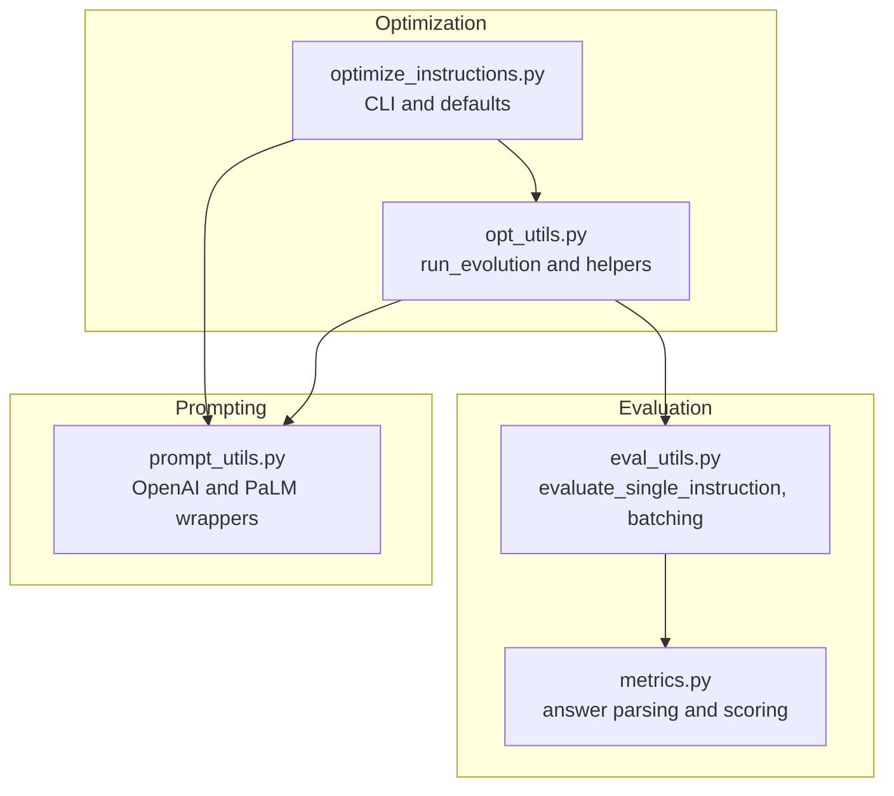
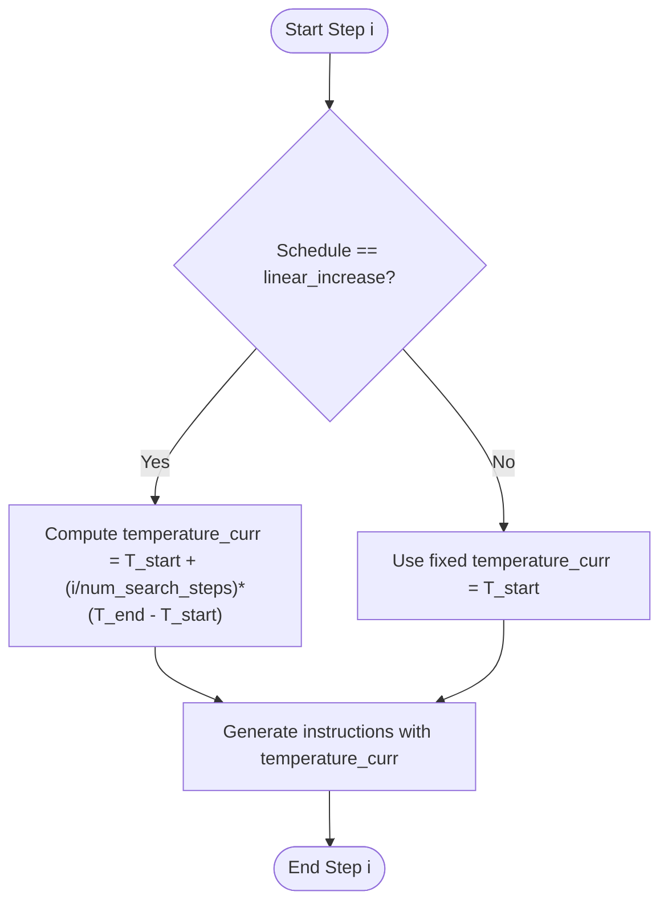
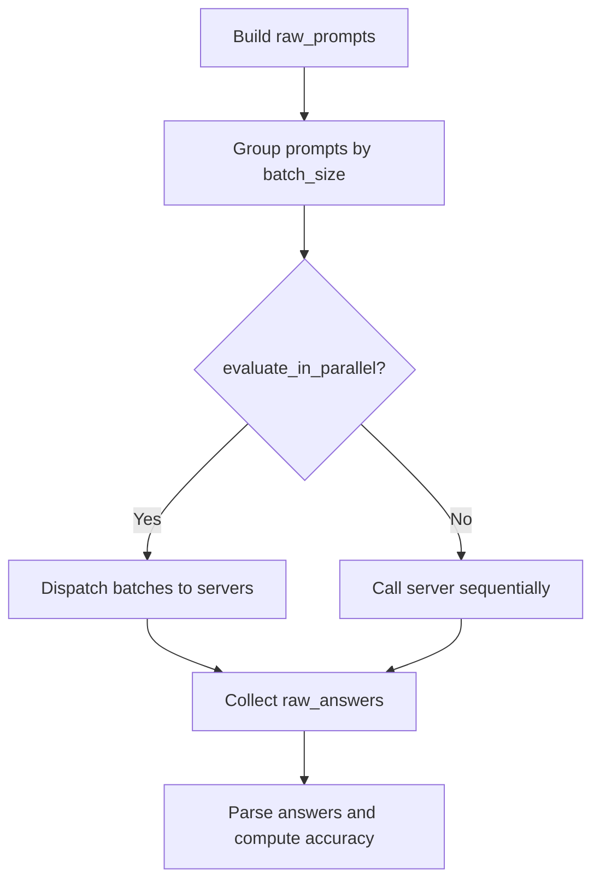
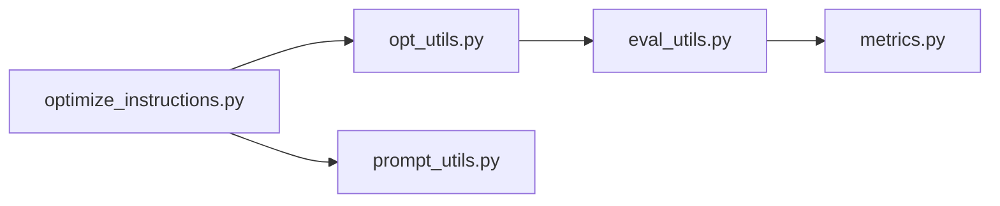

# Optimization Parameters and Configuration

<cite>
**Referenced Files in This Document**
- [optimize_instructions.py](file://opro/optimization/optimize_instructions.py)
- [opt_utils.py](file://opro/optimization/opt_utils.py)
- [prompt_utils.py](file://opro/prompt_utils.py)
- [eval_utils.py](file://opro/evaluation/eval_utils.py)
- [metrics.py](file://opro/evaluation/metrics.py)
</cite>

## Table of Contents
1. [Introduction](#introduction)
2. [Project Structure](#project-structure)
3. [Core Components](#core-components)
4. [Architecture Overview](#architecture-overview)
5. [Detailed Component Analysis](#detailed-component-analysis)
6. [Dependency Analysis](#dependency-analysis)
7. [Performance Considerations](#performance-considerations)
8. [Troubleshooting Guide](#troubleshooting-guide)
9. [Conclusion](#conclusion)

## Introduction
This document explains the key optimization parameters that control the behavior of the opro system’s instruction optimization pipeline. It focuses on how temperature control is implemented via optimizer_llm_temperature and its scheduling via optimizer_llm_temperature_schedule (constant or linear_increase), how batch_size controls parallel evaluation throughput, and how num_generated_instructions_in_each_step determines search breadth. It also covers how old_instruction_score_threshold filters historical instructions for meta-prompt inclusion and how max_num_instructions caps prompt length. Evaluation parameters such as eval_interval and num_few_shot_questions_for_instruction_refinement are documented, with concrete examples from the code showing how these parameters are passed through kwargs and asserted for validity. Finally, performance implications and best practices for tuning and troubleshooting are provided.

## Project Structure
The optimization pipeline spans several modules:
- Optimization entry and configuration: optimize_instructions.py
- Evolution loop and parameter orchestration: opt_utils.py
- Prompting utilities for OpenAI and Google models: prompt_utils.py
- Evaluation utilities and metrics: eval_utils.py and metrics.py



**Diagram sources**
- [optimize_instructions.py](file://opro/optimization/optimize_instructions.py#L736-L800)
- [opt_utils.py](file://opro/optimization/opt_utils.py#L338-L426)
- [eval_utils.py](file://opro/evaluation/eval_utils.py#L536-L735)
- [metrics.py](file://opro/evaluation/metrics.py#L1-L200)
- [prompt_utils.py](file://opro/prompt_utils.py#L21-L133)

**Section sources**
- [optimize_instructions.py](file://opro/optimization/optimize_instructions.py#L736-L800)
- [opt_utils.py](file://opro/optimization/opt_utils.py#L338-L426)

## Core Components
This section documents the core parameters and their roles in shaping the optimization behavior.

- optimizer_llm_temperature
  - Purpose: Controls randomness/exploitation in instruction generation by the optimizer LLM.
  - Default and usage: The optimizer LLM temperature is read from optimizer_llm_dict and passed to the optimizer server call. In the CLI entry, the optimizer LLM temperature is set in the optimizer configuration dictionary.
  - Impact: Higher temperature increases diversity and exploration; lower temperature favors consistency and stability.

- optimizer_llm_temperature_schedule
  - Purpose: Schedules how temperature changes over the search steps.
  - Values: constant or linear_increase.
  - Behavior: When linear_increase is selected, temperature grows from the initial value toward optimizer_llm_temperature_end over num_search_steps.

- num_generated_instructions_in_each_step
  - Purpose: Determines the number of candidate instructions generated per step.
  - Mechanism: The loop continues until remaining_num_instructions_to_generate becomes non-positive, consuming batch_size per iteration depending on meta_prompt_type.

- batch_size
  - Purpose: Controls the number of parallel evaluations and batching in the scorer.
  - Role in evaluation: The evaluator groups prompts into batches of size batch_size and dispatches them to servers in parallel when evaluate_in_parallel is enabled.

- old_instruction_score_threshold
  - Purpose: Filters historical instructions included in the meta-prompt based on their score.
  - Behavior: Only instructions with score >= threshold are included; otherwise skipped.

- max_num_instructions
  - Purpose: Caps the number of historical instructions appended to the meta-prompt.
  - Behavior: The list is truncated to the most recent max_num_instructions entries.

- eval_interval
  - Purpose: Controls how frequently the system evaluates current instructions on the validation set during evolution.

- num_few_shot_questions_for_instruction_refinement
  - Purpose: Controls the number of few-shot exemplars used to refine instructions in each step.

**Section sources**
- [optimize_instructions.py](file://opro/optimization/optimize_instructions.py#L681-L740)
- [opt_utils.py](file://opro/optimization/opt_utils.py#L338-L426)
- [opt_utils.py](file://opro/optimization/opt_utils.py#L568-L600)
- [opt_utils.py](file://opro/optimization/opt_utils.py#L732-L783)
- [opt_utils.py](file://opro/optimization/opt_utils.py#L902-L923)
- [eval_utils.py](file://opro/evaluation/eval_utils.py#L646-L709)

## Architecture Overview
The optimization process is orchestrated by run_evolution, which:
- Reads kwargs passed from the CLI entrypoint
- Schedules optimizer temperature per step
- Builds meta-prompts with filtered historical instructions
- Generates candidate instructions and evaluates them
- Periodically evaluates on validation set according to eval_interval

```mermaid
sequenceDiagram
participant CLI as "optimize_instructions.py"
participant EV as "opt_utils.run_evolution"
participant META as "gen_meta_prompt"
participant OPT as "call_optimizer_server_func"
participant SC as "call_scorer_server_func"
participant EVAL as "evaluate_single_instruction"
CLI->>EV : "kwargs including optimizer_llm_temperature,<br/>schedule, batch_size, thresholds, etc."
EV->>EV : "assert schedule and dataset"
EV->>EV : "for i_step in num_search_steps"
EV->>EV : "compute temperature_curr (schedule)"
EV->>META : "build meta-prompt with old_instruction_score_threshold,<br/>max_num_instructions"
META-->>EV : "meta_prompt"
EV->>OPT : "generate N instructions (N = num_generated_instructions_in_each_step)"
OPT-->>EV : "raw_outputs"
EV->>EVAL : "evaluate generated instructions (batch_size)"
EVAL-->>EV : "scores"
EV->>EV : "periodic eval on validation (eval_interval)"
EV-->>CLI : "results"
```

**Diagram sources**
- [optimize_instructions.py](file://opro/optimization/optimize_instructions.py#L736-L800)
- [opt_utils.py](file://opro/optimization/opt_utils.py#L338-L426)
- [opt_utils.py](file://opro/optimization/opt_utils.py#L692-L724)
- [opt_utils.py](file://opro/optimization/opt_utils.py#L732-L783)
- [opt_utils.py](file://opro/optimization/opt_utils.py#L902-L923)
- [eval_utils.py](file://opro/evaluation/eval_utils.py#L536-L735)

## Detailed Component Analysis

### Temperature Control and Scheduling
- Parameter: optimizer_llm_temperature
  - Source: optimizer_llm_dict["temperature"] (set in CLI entrypoint)
  - Usage: Passed to call_optimizer_server_func during instruction generation
- Schedule: optimizer_llm_temperature_schedule
  - Supported values: constant, linear_increase
  - Implementation: At each step, temperature_curr is computed; if linear_increase, it increases from the initial temperature toward optimizer_llm_temperature_end proportionally to step progress
- Effect on behavior:
  - Lower temperature favors consistency and stable instruction reuse
  - Higher temperature encourages exploration and diversity in instruction generation



**Diagram sources**
- [opt_utils.py](file://opro/optimization/opt_utils.py#L568-L584)

**Section sources**
- [optimize_instructions.py](file://opro/optimization/optimize_instructions.py#L699-L700)
- [opt_utils.py](file://opro/optimization/opt_utils.py#L338-L426)
- [opt_utils.py](file://opro/optimization/opt_utils.py#L568-L584)

### Parallel Evaluation and Batch Size
- Parameter: batch_size
  - Source: scorer_llm_dict["batch_size"] (set in CLI entrypoint)
  - Role in evaluation: The evaluator groups prompts into batches of size batch_size and dispatches them to servers in parallel when evaluate_in_parallel is True
  - Impact: Larger batch_size increases throughput but may increase memory usage and latency per batch; smaller batch_size reduces memory footprint but may increase total runtime



**Diagram sources**
- [eval_utils.py](file://opro/evaluation/eval_utils.py#L646-L709)

**Section sources**
- [optimize_instructions.py](file://opro/optimization/optimize_instructions.py#L240-L300)
- [opt_utils.py](file://opro/optimization/opt_utils.py#L427-L430)
- [eval_utils.py](file://opro/evaluation/eval_utils.py#L646-L709)

### Search Breadth and Generation Rate
- Parameter: num_generated_instructions_in_each_step
  - Purpose: Controls how many new instructions are generated per step
  - Mechanism: The loop subtracts batch_size (or adjusted by meta_prompt_type) from remaining_num_instructions_to_generate until it reaches zero
  - Impact: Larger values increase search breadth and exploration but also increase evaluation cost

**Section sources**
- [opt_utils.py](file://opro/optimization/opt_utils.py#L727-L783)

### Meta-Prompt Construction and Historical Filtering
- Parameters:
  - old_instruction_score_threshold: Only instructions with score >= threshold are included
  - max_num_instructions: Limits the number of historical instructions appended to the meta-prompt
- Behavior:
  - gen_ins_and_score_pairs_substr sorts by score and truncates to max_num_instructions
  - gen_meta_prompt composes the meta-prompt with instruction-score pairs and optional few-shot exemplars

**Section sources**
- [opt_utils.py](file://opro/optimization/opt_utils.py#L52-L88)
- [opt_utils.py](file://opro/optimization/opt_utils.py#L90-L136)

### Few-Shot Selection and Refinement
- Parameter: num_few_shot_questions_for_instruction_refinement
  - Purpose: Controls how many exemplars are used to refine instructions in each step
  - Strategies:
    - accumulative_most_frequent: selects exemplars that were most often wrong across history
    - current_most_frequent: selects exemplars most often wrong by current instructions
    - random: randomly samples from training set
    - constant: fixed selection across steps

**Section sources**
- [opt_utils.py](file://opro/optimization/opt_utils.py#L588-L688)

### Validation and Evaluation Intervals
- Parameter: eval_interval
  - Purpose: How often to compute validation accuracy for current-step instructions
  - Usage: The loop periodically evaluates on validation set according to eval_interval

**Section sources**
- [optimize_instructions.py](file://opro/optimization/optimize_instructions.py#L723-L726)
- [opt_utils.py](file://opro/optimization/opt_utils.py#L984-L1010)

### Passing and Asserting Parameters
- Parameters passed via kwargs to run_evolution include:
  - num_search_steps, old_instruction_score_threshold, scorer_llm_dict, optimizer_llm_dict, extract_final_answer_by_prompting_again, include_qa, evaluate_in_parallel, tasks_all, train_ratio, eval_ratio, test_ratio, train_index, eval_index, dataset_name, task_name, num_examples, root_data_folder_path, optimizer_llm_temperature, optimizer_llm_temperature_schedule, optimizer_llm_temperature_end, initial_instructions, multiple_choice_tasks, raw_data, call_scorer_server_func, call_optimizer_server_func, instruction_pos, prediction_treat_as_number, prediction_treat_as_bool, result_by_instruction_folder, few_shot_qa_pairs, num_score_buckets, max_num_instructions, meta_prompt_type, meta_prompt_instructions_before_exemplars, few_shot_selection_criteria, optimizer_llm_name, num_generated_instructions_in_each_step, evaluate_generated_ins_on_few_shot, num_few_shot_questions_for_instruction_refinement, evaluate_old_ins_on_few_shot, eval_interval, save_folder
- Assertions performed inside run_evolution:
  - optimizer_llm_temperature_schedule ∈ {constant, linear_increase}
  - dataset_name ∈ {mmlu, bbh, gsm8k}

**Section sources**
- [optimize_instructions.py](file://opro/optimization/optimize_instructions.py#L744-L799)
- [opt_utils.py](file://opro/optimization/opt_utils.py#L338-L426)

## Dependency Analysis
The following diagram shows how the key modules depend on each other during optimization:



**Diagram sources**
- [optimize_instructions.py](file://opro/optimization/optimize_instructions.py#L736-L800)
- [opt_utils.py](file://opro/optimization/opt_utils.py#L338-L426)
- [eval_utils.py](file://opro/evaluation/eval_utils.py#L536-L735)
- [metrics.py](file://opro/evaluation/metrics.py#L1-L200)
- [prompt_utils.py](file://opro/prompt_utils.py#L21-L133)

**Section sources**
- [optimize_instructions.py](file://opro/optimization/optimize_instructions.py#L736-L800)
- [opt_utils.py](file://opro/optimization/opt_utils.py#L338-L426)
- [eval_utils.py](file://opro/evaluation/eval_utils.py#L536-L735)

## Performance Considerations
- Temperature scheduling
  - Linear increase can accelerate early exploration and stabilize later convergence; however, ensure T_end is not excessively high to avoid divergence
  - Constant temperature keeps behavior stable but may reduce adaptivity over time
- Batch size
  - Larger batch_size improves throughput but increases memory pressure; tune to fit GPU/CPU capacity
  - Smaller batch_size reduces memory usage but may increase total evaluation time
- Search breadth
  - Increasing num_generated_instructions_in_each_step expands search space; monitor runtime and memory accordingly
- Prompt length
  - max_num_instructions prevents meta-prompt from growing too large; consider dataset size and model context window
- Few-shot sampling
  - Using current_most_frequent can improve refinement speed by focusing on recent failures; random/constant may offer broader coverage

[No sources needed since this section provides general guidance]

## Troubleshooting Guide
Common configuration issues and remedies:
- Invalid schedule or dataset
  - Symptom: Assertion failure for optimizer_llm_temperature_schedule or dataset_name
  - Fix: Ensure schedule is constant or linear_increase and dataset_name is one of mmlu, bbh, gsm8k
  - Section sources
    - [opt_utils.py](file://opro/optimization/opt_utils.py#L404-L413)
- Missing API keys
  - Symptom: Assertion errors requiring OpenAI or PaLM API keys
  - Fix: Provide openai_api_key or palm_api_key when using GPT or PaLM models
  - Section sources
    - [optimize_instructions.py](file://opro/optimization/optimize_instructions.py#L190-L209)
- Excessive prompt length or too many historical instructions
  - Symptom: Meta-prompt too large; consider reducing max_num_instructions or increasing old_instruction_score_threshold
  - Section sources
    - [opt_utils.py](file://opro/optimization/opt_utils.py#L52-L88)
    - [opt_utils.py](file://opro/optimization/opt_utils.py#L90-L136)
- Evaluation slowness
  - Symptom: Long evaluation times
  - Mitigation: Reduce batch_size, num_generated_instructions_in_each_step, or eval_interval; ensure evaluate_in_parallel is enabled for supported models
  - Section sources
    - [opt_utils.py](file://opro/optimization/opt_utils.py#L427-L430)
    - [eval_utils.py](file://opro/evaluation/eval_utils.py#L646-L709)
- Convergence instability
  - Symptom: Oscillation or poor convergence
  - Mitigation: Decrease optimizer_llm_temperature or switch to constant schedule; reduce num_generated_instructions_in_each_step
  - Section sources
    - [opt_utils.py](file://opro/optimization/opt_utils.py#L568-L584)
    - [opt_utils.py](file://opro/optimization/opt_utils.py#L727-L783)

## Conclusion
The opro system’s optimization behavior is governed by a tight interplay of temperature scheduling, batch sizing, search breadth, and meta-prompt construction. Proper tuning of optimizer_llm_temperature and optimizer_llm_temperature_schedule enables a balance between exploration and exploitation. batch_size directly impacts throughput and resource usage, while num_generated_instructions_in_each_step controls search breadth. Filtering and capping mechanisms (old_instruction_score_threshold and max_num_instructions) keep the meta-prompt manageable and relevant. eval_interval and num_few_shot_questions_for_instruction_refinement shape evaluation cadence and focus. By aligning these parameters with computational resources and dataset characteristics, practitioners can achieve robust and efficient instruction optimization.