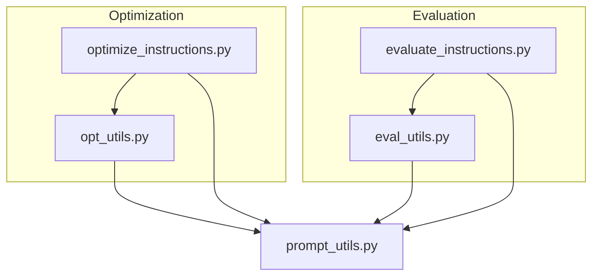
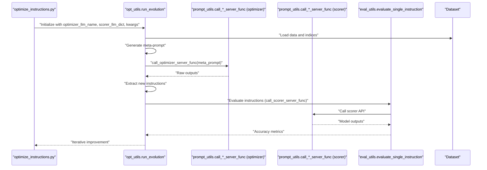
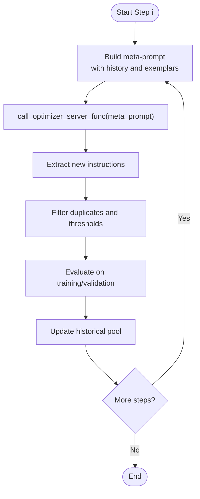
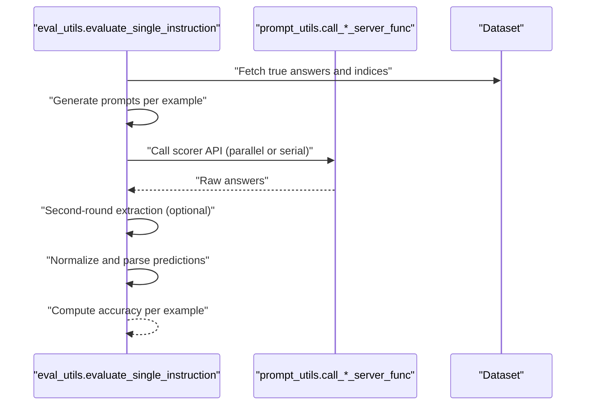
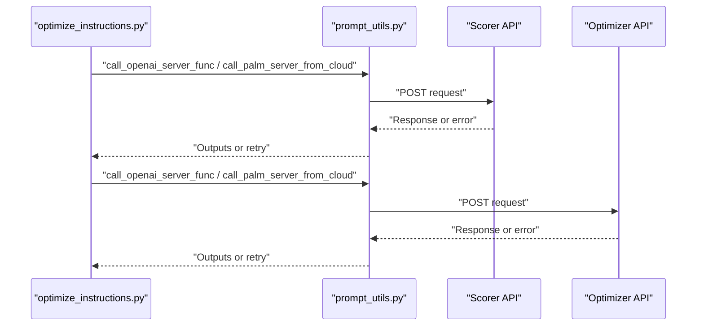
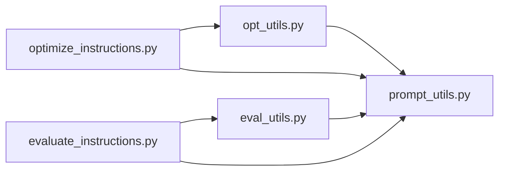

# Optimizer and Scorer LLMs

<cite>
**Referenced Files in This Document**
- [README.md](file://README.md)
- [opt_utils.py](file://opro/optimization/opt_utils.py)
- [optimize_instructions.py](file://opro/optimization/optimize_instructions.py)
- [prompt_utils.py](file://opro/prompt_utils.py)
- [evaluate_instructions.py](file://opro/evaluation/evaluate_instructions.py)
- [eval_utils.py](file://opro/evaluation/eval_utils.py)
</cite>

## Table of Contents
1. [Introduction](#introduction)
2. [Project Structure](#project-structure)
3. [Core Components](#core-components)
4. [Architecture Overview](#architecture-overview)
5. [Detailed Component Analysis](#detailed-component-analysis)
6. [Dependency Analysis](#dependency-analysis)
7. [Performance Considerations](#performance-considerations)
8. [Troubleshooting Guide](#troubleshooting-guide)
9. [Conclusion](#conclusion)
10. [Appendices](#appendices)

## Introduction
This document explains the distinct roles of optimizer and scorer LLMs in the opro system and how they collaborate in a feedback loop to evolve high-performing instructions. The optimizer LLM (e.g., GPT-3.5-turbo, text-bison) generates new candidate instructions by analyzing historical instruction-score pairs. The scorer LLM evaluates the performance of these instructions on benchmark tasks. The system orchestrates this process through configurable functions and parameters, including optimizer_llm_name and scorer_llm_dict, enabling flexible model selection and robust API handling.

## Project Structure
The opro system organizes functionality around:
- Optimization pipeline: constructs meta-prompts, invokes optimizer, and manages evolution loops.
- Evaluation pipeline: evaluates instructions with a scorer LLM and computes accuracy metrics.
- Prompt utilities: wraps OpenAI and Google Cloud model APIs with resilient invocation and retry logic.
- CLI entry points: scripts to run optimization and evaluation with model and dataset configuration.

**Diagram sources**
- [optimize_instructions.py](file://opro/optimization/optimize_instructions.py#L1-L120)
- [opt_utils.py](file://opro/optimization/opt_utils.py#L1-L120)
- [evaluate_instructions.py](file://opro/evaluation/evaluate_instructions.py#L1-L120)
- [eval_utils.py](file://opro/evaluation/eval_utils.py#L1-L120)
- [prompt_utils.py](file://opro/prompt_utils.py#L1-L60)

**Section sources**
- [README.md](file://README.md#L25-L52)

## Core Components
- Optimizer LLM role:
  - Generates new instructions by analyzing historical instruction-score pairs.
  - Uses meta-prompts tailored to model type and instruction placement.
  - Invoked via call_optimizer_server_func with model-specific parameters.
- Scorer LLM role:
  - Evaluates instructions on benchmark tasks and returns accuracy metrics.
  - Handles multiple datasets and formats, with robust extraction and parsing logic.
  - Invoked via call_scorer_server_func with model-specific parameters.
- Feedback loop:
  - Initial instructions are scored, then new candidates are generated and scored iteratively.
  - Historical performance informs future meta-prompts and selection criteria.

Key configuration parameters:
- optimizer_llm_name: selects the optimizer model family (e.g., GPT-3.5-turbo, text-bison).
- scorer_llm_dict: encapsulates model type and serving parameters (e.g., temperature, batch size, num_servers).
- run_evolution kwargs: orchestrates the end-to-end process, including thresholds, sampling, and evaluation intervals.

**Section sources**
- [opt_utils.py](file://opro/optimization/opt_utils.py#L90-L120)
- [opt_utils.py](file://opro/optimization/opt_utils.py#L338-L426)
- [optimize_instructions.py](file://opro/optimization/optimize_instructions.py#L338-L400)
- [evaluate_instructions.py](file://opro/evaluation/evaluate_instructions.py#L238-L303)
- [eval_utils.py](file://opro/evaluation/eval_utils.py#L536-L760)

## Architecture Overview
The system separates concerns between optimizer and scorer:
- Optimizer path: meta-prompt construction -> call_optimizer_server_func -> instruction extraction -> scoring pipeline.
- Scoring path: instruction evaluation -> raw answer collection -> final answer extraction -> accuracy computation.

**Diagram sources**
- [optimize_instructions.py](file://opro/optimization/optimize_instructions.py#L338-L400)
- [opt_utils.py](file://opro/optimization/opt_utils.py#L692-L799)
- [eval_utils.py](file://opro/evaluation/eval_utils.py#L536-L760)
- [prompt_utils.py](file://opro/prompt_utils.py#L21-L133)

## Detailed Component Analysis

### Optimizer LLM: Generation and Meta-Prompts
- Meta-prompt construction:
  - gen_meta_prompt builds contextual prompts combining historical instruction-score pairs and optional few-shot QA exemplars.
  - Model-aware formatting distinguishes GPT vs text-bison prompts and instruction positions (before_Q, Q_begin, Q_end, A_begin).
- Instruction generation:
  - run_evolution calls call_optimizer_server_func with temperature scheduling and batch decoding.
  - Extracts new instructions from model outputs using model-specific delimiters or tag parsing.
- Few-shot exemplars:
  - Selects problematic or frequent wrong questions to guide refinement.
  - Supports multiple selection criteria (accumulative/current/fixed/random).

**Diagram sources**
- [opt_utils.py](file://opro/optimization/opt_utils.py#L90-L120)
- [opt_utils.py](file://opro/optimization/opt_utils.py#L692-L799)
- [opt_utils.py](file://opro/optimization/opt_utils.py#L732-L783)

**Section sources**
- [opt_utils.py](file://opro/optimization/opt_utils.py#L90-L120)
- [opt_utils.py](file://opro/optimization/opt_utils.py#L692-L799)
- [opt_utils.py](file://opro/optimization/opt_utils.py#L732-L783)

### Scorer LLM: Evaluation and Metrics
- Evaluation pipeline:
  - evaluate_single_instruction composes prompts, invokes scorer, and parses results.
  - Supports parallel prompting, second-round answer extraction, and normalization.
- Accuracy computation:
  - Robust matching logic covers exact match, choice text inclusion, Boolean symbols, and adaptive numeric/boolean treatment.
- Dataset-specific handling:
  - Formats vary by dataset (MMLU, BBH, GSM8K, MultiArith, AQuA) with appropriate true-answer fetching and prompt templates.

**Diagram sources**
- [eval_utils.py](file://opro/evaluation/eval_utils.py#L536-L760)
- [evaluate_instructions.py](file://opro/evaluation/evaluate_instructions.py#L673-L745)

**Section sources**
- [eval_utils.py](file://opro/evaluation/eval_utils.py#L536-L760)
- [evaluate_instructions.py](file://opro/evaluation/evaluate_instructions.py#L238-L303)

### API Invocation Patterns: call_optimizer_server_func and call_scorer_server_func
- Optimizer invocation:
  - optimize_instructions.py configures call_optimizer_server_func for GPT or text-bison with model-specific parameters (temperature, max_decode_steps, batch_size).
  - Tests the optimizer endpoint and prints outputs.
- Scorer invocation:
  - optimize_instructions.py configures call_scorer_server_func similarly for GPT or text-bison.
  - evaluate_instructions.py also configures and tests the scorer endpoint.
- Both rely on prompt_utils wrappers for resilience:
  - call_openai_server_func and call_palm_server_from_cloud handle timeouts, rate limits, and service errors with retries and sleep-backoff.

**Diagram sources**
- [optimize_instructions.py](file://opro/optimization/optimize_instructions.py#L338-L400)
- [evaluate_instructions.py](file://opro/evaluation/evaluate_instructions.py#L238-L303)
- [prompt_utils.py](file://opro/prompt_utils.py#L21-L133)

**Section sources**
- [optimize_instructions.py](file://opro/optimization/optimize_instructions.py#L338-L400)
- [evaluate_instructions.py](file://opro/evaluation/evaluate_instructions.py#L238-L303)
- [prompt_utils.py](file://opro/prompt_utils.py#L21-L133)

### Configuration Parameters and Their Impact
- optimizer_llm_name:
  - Determines meta-prompt formatting and instruction extraction logic.
  - Controls temperature scheduling and decoding parameters during generation.
- scorer_llm_dict:
  - Encapsulates model type and serving parameters (temperature, batch_size, num_servers).
  - Influences evaluation throughput and accuracy stability.
- run_evolution kwargs:
  - old_instruction_score_threshold: filters low-performing historical instructions.
  - num_generated_instructions_in_each_step: controls exploration breadth.
  - few_shot_selection_criteria: shapes meta-prompts to focus on hard examples.
  - meta_prompt_type and instruction_pos: tailor how instructions are embedded in prompts.

Impact on optimization effectiveness:
- Higher optimizer temperature increases diversity but may reduce coherence.
- Larger batch sizes improve throughput but increase API costs.
- Few-shot exemplars grounded in frequent wrong answers improve targeted refinement.

**Section sources**
- [opt_utils.py](file://opro/optimization/opt_utils.py#L90-L120)
- [opt_utils.py](file://opro/optimization/opt_utils.py#L338-L426)
- [opt_utils.py](file://opro/optimization/opt_utils.py#L732-L783)
- [optimize_instructions.py](file://opro/optimization/optimize_instructions.py#L682-L740)

## Dependency Analysis
- Coupling:
  - optimize_instructions.py depends on opt_utils.py for orchestration and prompt construction.
  - Both pipelines depend on prompt_utils.py for API resilience and on eval_utils.py for evaluation.
- Cohesion:
  - opt_utils.py centralizes meta-prompt building and evolution logic.
  - eval_utils.py centralizes evaluation and metric computation.
- External dependencies:
  - OpenAI and Google Generative AI SDKs for model APIs.
  - Abseil flags for CLI configuration.

**Diagram sources**
- [optimize_instructions.py](file://opro/optimization/optimize_instructions.py#L1-L120)
- [opt_utils.py](file://opro/optimization/opt_utils.py#L1-L120)
- [evaluate_instructions.py](file://opro/evaluation/evaluate_instructions.py#L1-L120)
- [eval_utils.py](file://opro/evaluation/eval_utils.py#L1-L120)
- [prompt_utils.py](file://opro/prompt_utils.py#L1-L60)

**Section sources**
- [optimize_instructions.py](file://opro/optimization/optimize_instructions.py#L1-L120)
- [opt_utils.py](file://opro/optimization/opt_utils.py#L1-L120)
- [evaluate_instructions.py](file://opro/evaluation/evaluate_instructions.py#L1-L120)
- [eval_utils.py](file://opro/evaluation/eval_utils.py#L1-L120)
- [prompt_utils.py](file://opro/prompt_utils.py#L1-L60)

## Performance Considerations
- API cost control:
  - Reduce num_decodes, batch_size, and num_servers where feasible.
  - Limit num_generated_instructions_in_each_step and num_search_steps.
- Throughput tuning:
  - Increase batch_size and num_servers cautiously; ensure model serving configs match.
  - Use parallel evaluation where supported (avoid for GPT models per evaluation settings).
- Stability:
  - Lower scorer temperature to reduce variance in evaluations.
  - Use fewer few-shot exemplars to speed up meta-prompt generation.

[No sources needed since this section provides general guidance]

## Troubleshooting Guide
Common issues and remedies:
- API rate limits and timeouts:
  - prompt_utils.py wraps OpenAI and Google Cloud calls with retry-on-error logic and sleep-backoff.
  - Tune max_retry and sleep_time in evaluation utilities to handle transient failures.
- Model availability:
  - Ensure API keys are configured for selected models (OpenAI or Google).
  - Verify model names and supported generations in prompt_utils.py.
- Output parsing:
  - For GPT models, final answer extraction may require second-round prompting and LaTeX box parsing.
  - For text-bison, ensure meta-prompt formatting matches expected square-bracket outputs.

Best practices:
- Start with conservative hyperparameters and scale gradually.
- Monitor API costs and adjust batch sizes accordingly.
- Prefer fewer, high-quality few-shot exemplars over large sets.

**Section sources**
- [prompt_utils.py](file://opro/prompt_utils.py#L21-L133)
- [eval_utils.py](file://opro/evaluation/eval_utils.py#L338-L379)
- [evaluate_instructions.py](file://opro/evaluation/evaluate_instructions.py#L296-L303)

## Conclusion
The opro system leverages optimizer and scorer LLMs in a complementary manner: the optimizer explores new instruction variants guided by historical performance, while the scorer provides reliable accuracy assessments on benchmarks. By configuring optimizer_llm_name and scorer_llm_dict appropriately and using robust API wrappers, the system achieves effective instruction evolution with controlled costs and improved reliability.

[No sources needed since this section summarizes without analyzing specific files]

## Appendices

### Best Practices for Optimizer-Scorer Pair Selection
- Use stronger scorers (e.g., GPT-4) for more accurate evaluations when cost allows.
- Use text-bison for cost-effective evaluations or when paired with strong optimizer diversity.
- Align meta-prompt formatting with the optimizer model family to maximize instruction quality.

[No sources needed since this section provides general guidance]