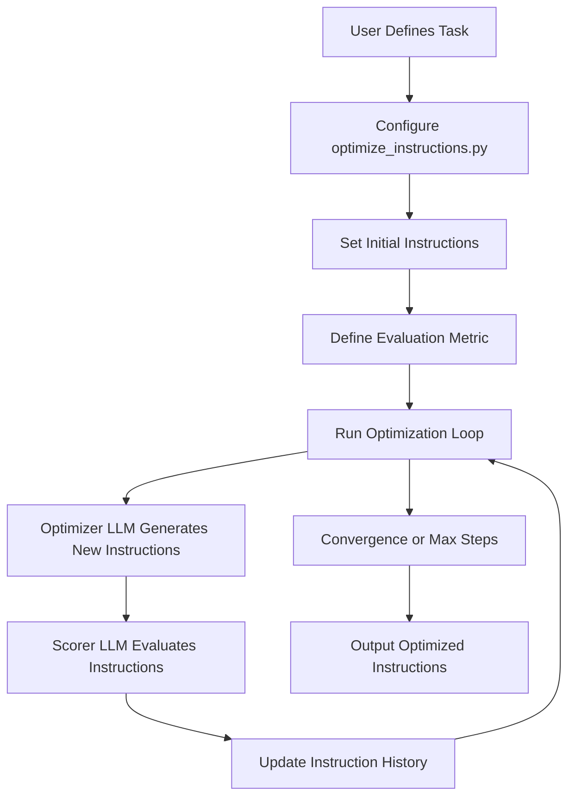
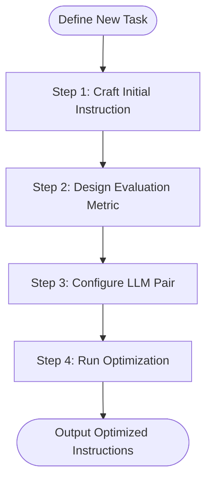

# Custom Domain Adaptation

<cite>
**Referenced Files in This Document**   
- [prompt_utils.py](file://opro/prompt_utils.py)
- [optimize_instructions.py](file://opro/optimization/optimize_instructions.py)
- [optimize_linear_regression.py](file://opro/optimization/optimize_linear_regression.py)
- [optimize_tsp.py](file://opro/optimization/optimize_tsp.py)
- [evaluate_instructions.py](file://opro/evaluation/evaluate_instructions.py)
- [opt_utils.py](file://opro/optimization/opt_utils.py)
- [BBH-boolean_expressions-s-text-bison-o-palm-2-l-it.txt](file://misc/prompt_history/BBH-boolean_expressions-s-text-bison-o-palm-2-l-it.txt)
</cite>

## Table of Contents
1. [Introduction](#introduction)
2. [Core Architecture and Workflow](#core-architecture-and-workflow)
3. [Modifying Meta-Prompt Templates](#modifying-meta-prompt-templates)
4. [Defining a New Optimization Task](#defining-a-new-optimization-task)
5. [Domain-Specific Meta-Prompt Examples](#domain-specific-meta-prompt-examples)
6. [Instruction Evolution Patterns](#instruction-evolution-patterns)
7. [Challenges in Evaluation and Scoring](#challenges-in-evaluation-and-scoring)
8. [Leveraging Historical Results](#leveraging-historical-results)
9. [Best Practices for Iterative Refinement](#best-practices-for-iterative-refinement)
10. [Conclusion](#conclusion)

## Introduction
This document provides a comprehensive guide for adapting the opro framework to new domains beyond its provided examples. The opro system is designed for automated prompt optimization, using an optimizer-scorer LLM pair to evolve instruction sets for improved performance on specific tasks. By understanding the core components and workflows, users can extend the system to domains such as code generation, creative writing, or customer service chatbots. This guide details the process of modifying meta-prompt templates in `prompt_utils.py`, defining new optimization tasks, and configuring the optimizer-scorer pair. It uses the existing linear regression and TSP examples as templates and provides practical guidance for overcoming challenges in evaluation and refinement.

## Core Architecture and Workflow

The opro framework operates on a meta-optimization principle, where an optimizer LLM generates new instructions based on the performance history of previous instructions, as evaluated by a scorer LLM. This process is orchestrated through a series of Python modules that handle prompting, evaluation, and optimization.



**Diagram sources**
- [optimize_instructions.py](file://opro/optimization/optimize_instructions.py)
- [opt_utils.py](file://opro/optimization/opt_utils.py)

**Section sources**
- [optimize_instructions.py](file://opro/optimization/optimize_instructions.py)
- [opt_utils.py](file://opro/optimization/opt_utils.py)

## Modifying Meta-Prompt Templates

The meta-prompt is the core mechanism by which the optimizer LLM is guided to generate improved instructions. The template for this prompt is defined in the `gen_meta_prompt` function within `opt_utils.py`. This function dynamically constructs a prompt that includes a history of previous instructions and their scores, along with optional few-shot examples from the dataset.

To adapt the meta-prompt for a new domain, users must modify the `gen_meta_prompt` function to reflect the specific requirements of the target application. The function accepts several parameters that control its behavior:

- **old_instructions_and_scores**: A list of tuples containing previous instructions, their scores, and the step at which they were generated.
- **instruction_pos**: The position where the instruction should be inserted in the prompt (e.g., "A_begin", "Q_begin").
- **optimizer_llm_name**: The name of the LLM used for optimization (e.g., "gpt-3.5-turbo", "text-bison").
- **meta_prompt_type**: Determines whether the prompt includes both instructions and exemplars or only instructions.
- **few_shot_qa_pairs**: A boolean indicating whether to include few-shot QA pairs in the meta-prompt.

For domains like code generation, the meta-prompt might emphasize syntactic correctness and efficiency, while for creative writing, it might focus on narrative coherence and stylistic elements. The key is to craft a meta-prompt that clearly communicates the desired qualities of the instruction to the optimizer LLM.

**Section sources**
- [opt_utils.py](file://opro/optimization/opt_utils.py#L90-L335)

## Defining a New Optimization Task

Creating a new optimization task involves several key steps: crafting the initial instruction, designing the evaluation metric, and configuring the optimizer-scorer LLM pair. This process is exemplified by the `optimize_linear_regression.py` and `optimize_tsp.py` scripts, which serve as templates for new tasks.

### Step 1: Crafting the Initial Instruction
The initial instruction is the starting point for the optimization process. It is defined in the `initial_instructions` list within the optimization script. For a code generation task, an initial instruction might be "Write a Python function to sort a list of integers." For a customer service chatbot, it could be "Respond to the customer's inquiry in a polite and helpful manner."

### Step 2: Designing the Evaluation Metric
The evaluation metric is crucial for guiding the optimization process. In the linear regression example, the metric is the mean squared error of the model's predictions. For a TSP (Traveling Salesman Problem) task, it is the total distance of the tour. For subjective domains, the metric must be carefully designed to capture the desired qualities.

### Step 3: Configuring the Optimizer-Scorer LLM Pair
The optimizer and scorer LLMs are configured through command-line arguments. The optimizer LLM generates new instructions, while the scorer LLM evaluates their performance. The choice of LLMs can significantly impact the optimization process. For example, using a fine-tuned model as the scorer can provide more reliable evaluations.

The configuration is handled in the `main` function of the optimization script, where parameters such as `num_points`, `max_num_steps`, and `optimizer_llm_name` are set. These parameters must be tuned for the specific task to ensure effective optimization.



**Diagram sources**
- [optimize_linear_regression.py](file://opro/optimization/optimize_linear_regression.py)
- [optimize_tsp.py](file://opro/optimization/optimize_tsp.py)

**Section sources**
- [optimize_linear_regression.py](file://opro/optimization/optimize_linear_regression.py#L60-L80)
- [optimize_tsp.py](file://opro/optimization/optimize_tsp.py#L67-L73)

## Domain-Specific Meta-Prompt Examples

To illustrate the adaptation process, consider the following examples for different domains:

### Code Generation
For a code generation task, the meta-prompt might be designed to emphasize code correctness and efficiency. An example meta-prompt could be:
```
Your task is to generate a piece of code that solves the given problem. Below are some previous code snippets with their scores. The score ranges from 0 to 100, where higher scores indicate better code quality. Generate a new code snippet that is different from all the previous ones and has a higher score.
```

### Creative Writing
For creative writing, the meta-prompt might focus on narrative elements and style. An example could be:
```
Your task is to generate a short story that captures the essence of the given prompt. Below are some previous stories with their scores. The score ranges from 0 to 100, where higher scores indicate more engaging and coherent stories. Generate a new story that is different from all the previous ones and has a higher score.
```

### Customer Service Chatbots
For a customer service chatbot, the meta-prompt might emphasize politeness and helpfulness. An example could be:
```
Your task is to generate a response to the customer's inquiry. Below are some previous responses with their scores. The score ranges from 0 to 100, where higher scores indicate more polite and helpful responses. Generate a new response that is different from all the previous ones and has a higher score.
```

These examples demonstrate how the meta-prompt can be tailored to the specific requirements of each domain, guiding the optimizer LLM to generate instructions that meet the desired criteria.

**Section sources**
- [opt_utils.py](file://opro/optimization/opt_utils.py#L90-L335)

## Instruction Evolution Patterns

The evolution of instructions over time can be observed in the prompt history files, such as `BBH-boolean_expressions-s-text-bison-o-palm-2-l-it.txt`. These files record the training accuracy and the instruction at each step of the optimization process. By analyzing these files, users can identify patterns in how instructions evolve and improve.

For example, in the boolean expressions task, the initial instructions are simple logical statements. As the optimization progresses, the instructions become more complex and nuanced, incorporating multiple logical operators and parentheses. The training accuracy generally increases over time, indicating that the optimizer LLM is successfully generating more effective instructions.

Understanding these patterns can help users design better initial instructions and evaluation metrics, as well as anticipate the types of improvements that the optimizer LLM is likely to make.

**Section sources**
- [BBH-boolean_expressions-s-text-bison-o-palm-2-l-it.txt](file://misc/prompt_history/BBH-boolean_expressions-s-text-bison-o-palm-2-l-it.txt)

## Challenges in Evaluation and Scoring

Defining reliable evaluation criteria for subjective domains is a significant challenge. In objective domains like linear regression, the evaluation metric is straightforward (e.g., mean squared error). However, in subjective domains like creative writing, it is more difficult to define a metric that captures the desired qualities.

One strategy is to use human-in-the-loop scoring, where human evaluators provide scores for the generated instructions. This approach can provide more reliable evaluations but is time-consuming and expensive. Another strategy is to use proxy metrics, such as the length of the response or the use of specific keywords, which can be automatically computed but may not fully capture the desired qualities.

The choice of evaluation metric must be carefully considered to ensure that the optimization process is guided in the right direction. A poorly designed metric can lead to suboptimal instructions that perform well on the metric but poorly in practice.

**Section sources**
- [evaluate_instructions.py](file://opro/evaluation/evaluate_instructions.py)
- [opt_utils.py](file://opro/optimization/opt_utils.py)

## Leveraging Historical Results

The `misc/prompt_history/` directory contains a wealth of information that can be used to inform the design of meta-prompts for new tasks. By analyzing the prompt history files, users can gain insights into how instructions evolve over time and what types of instructions are most effective.

For example, the `BBH-boolean_expressions-s-text-bison-o-palm-2-l-it.txt` file shows that the optimizer LLM tends to generate instructions that are more complex and nuanced as the optimization progresses. This suggests that for new tasks, it may be beneficial to start with simple instructions and allow the optimizer LLM to gradually increase their complexity.

Additionally, the prompt history files can be used to identify common patterns in the types of instructions that perform well. These patterns can be incorporated into the meta-prompt to guide the optimizer LLM towards generating more effective instructions.

**Section sources**
- [misc/prompt_history/BBH-boolean_expressions-s-text-bison-o-palm-2-l-it.txt](file://misc/prompt_history/BBH-boolean_expressions-s-text-bison-o-palm-2-l-it.txt)

## Best Practices for Iterative Refinement

Iterative refinement is key to achieving optimal results with the opro framework. The following best practices can help users get the most out of the system:

1. **Start with a Clear Objective**: Clearly define the goal of the optimization task and the criteria for success.
2. **Use a Diverse Initial Instruction Set**: Include a variety of initial instructions to provide a broad starting point for the optimizer LLM.
3. **Monitor the Optimization Process**: Regularly review the generated instructions and their scores to ensure that the optimization is progressing in the right direction.
4. **Adjust Parameters as Needed**: Tune parameters such as `num_search_steps` and `optimizer_llm_temperature` to achieve the best results.
5. **Validate Results**: Test the optimized instructions on a separate validation set to ensure that they generalize well to new data.

By following these best practices, users can effectively adapt the opro framework to new domains and achieve high-quality results.

**Section sources**
- [optimize_instructions.py](file://opro/optimization/optimize_instructions.py)
- [opt_utils.py](file://opro/optimization/opt_utils.py)

## Conclusion
Adapting the opro framework to new domains requires a deep understanding of its architecture and workflows. By modifying the meta-prompt templates, defining appropriate evaluation metrics, and leveraging historical results, users can extend the system to a wide range of applications. The key is to carefully design the optimization process to ensure that the generated instructions meet the desired criteria. With iterative refinement and careful validation, the opro framework can be a powerful tool for improving the performance of LLMs on specific tasks.