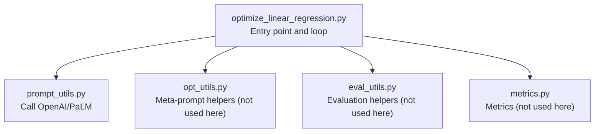
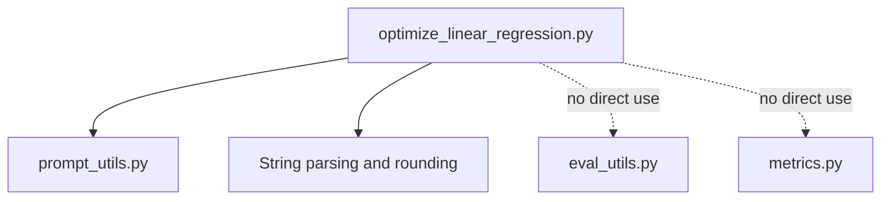

# Linear Regression Optimization

<cite>
**Referenced Files in This Document**
- [optimize_linear_regression.py](file://opro/optimization/optimize_linear_regression.py)
- [prompt_utils.py](file://opro/prompt_utils.py)
- [opt_utils.py](file://opro/optimization/opt_utils.py)
- [eval_utils.py](file://opro/evaluation/eval_utils.py)
- [metrics.py](file://opro/evaluation/metrics.py)
</cite>

## Table of Contents
1. [Introduction](#introduction)
2. [Project Structure](#project-structure)
3. [Core Components](#core-components)
4. [Architecture Overview](#architecture-overview)
5. [Detailed Component Analysis](#detailed-component-analysis)
6. [Dependency Analysis](#dependency-analysis)
7. [Performance Considerations](#performance-considerations)
8. [Troubleshooting Guide](#troubleshooting-guide)
9. [Conclusion](#conclusion)
10. [Appendices](#appendices)

## Introduction
This document explains how the repository formulates linear regression as a prompt optimization task and demonstrates how an optimizer LLM proposes improved instructions while a scorer LLM evaluates performance. It focuses on the end-to-end workflow in the linear regression optimization script, including synthetic data generation, meta-prompt design, parsing of optimizer outputs, and iterative refinement. Practical guidance is provided for configuring hyperparameters such as the number of optimization steps, batch sizes, and evaluation metrics. Finally, it outlines how this example serves as a template for optimizing other mathematical reasoning tasks and highlights common pitfalls with mitigation strategies.

## Project Structure
The linear regression optimization is implemented in a single script that orchestrates synthetic data generation, meta-prompt construction, optimizer LLM calls, output parsing, and evaluation. Supporting utilities handle model calls, evaluation, and metrics.



**Diagram sources**
- [optimize_linear_regression.py](file://opro/optimization/optimize_linear_regression.py#L1-L120)
- [prompt_utils.py](file://opro/prompt_utils.py#L1-L133)
- [opt_utils.py](file://opro/optimization/opt_utils.py#L1-L120)
- [eval_utils.py](file://opro/evaluation/eval_utils.py#L1-L120)
- [metrics.py](file://opro/evaluation/metrics.py#L1-L120)

**Section sources**
- [optimize_linear_regression.py](file://opro/optimization/optimize_linear_regression.py#L1-L120)

## Core Components
- Synthetic data generator: Creates X and y for a linear function plus Gaussian noise.
- Loss evaluator: Computes squared residuals for candidate (w, b) pairs.
- Meta-prompt generator: Builds a structured prompt for the optimizer LLM containing past (w, b, z) pairs and a clear instruction to propose a better point.
- Output parser: Extracts [w, b] from optimizer outputs and rounds to configured precision.
- Optimizer LLM: Proposes new (w, b) candidates.
- Scoring: Not used in this script; the loss itself acts as the metric.

Key implementation references:
- Synthetic data and loss: [evaluate_loss](file://opro/optimization/optimize_linear_regression.py#L169-L172)
- Meta-prompt construction: [gen_meta_prompt](file://opro/optimization/optimize_linear_regression.py#L173-L238)
- Output extraction and parsing: [extract_string_in_square_brackets](file://opro/optimization/optimize_linear_regression.py#L239-L249), [parse_output](file://opro/optimization/optimize_linear_regression.py#L250-L269)
- Model calls: [call_openai_server_func](file://opro/prompt_utils.py#L87-L103), [call_palm_server_from_cloud](file://opro/prompt_utils.py#L105-L133)

**Section sources**
- [optimize_linear_regression.py](file://opro/optimization/optimize_linear_regression.py#L169-L269)
- [prompt_utils.py](file://opro/prompt_utils.py#L87-L133)

## Architecture Overview
The optimization loop alternates between proposing new candidates and evaluating them. The optimizer LLM receives a meta-prompt summarizing prior trials and is asked to propose a new (w, b) with a lower loss than any seen so far. Proposed points are parsed, rounded, and scored using the loss function. The process repeats until convergence or a stopping criterion.

```mermaid
sequenceDiagram
participant Rep as "Runner"
participant Gen as "Synthetic Data Generator"
participant Eval as "Loss Evaluator"
participant Prompt as "Meta-Prompt Builder"
participant Opt as "Optimizer LLM"
participant Parse as "Output Parser"
participant Store as "History Collector"
Rep->>Gen : Generate X, y
Rep->>Eval : Evaluate loss at (w_true, b_true)
Rep->>Store : Initialize history with random (w,b) and losses
loop Steps
Rep->>Prompt : Build meta-prompt from history
Prompt-->>Rep : Meta-prompt
Rep->>Opt : Call optimizer with meta-prompt
Opt-->>Rep : Raw outputs
Rep->>Parse : Extract [w,b] and round
Parse-->>Rep : Rounded candidates
Rep->>Eval : Compute loss for each candidate
Eval-->>Rep : New z values
Rep->>Store : Append candidates and losses
alt Found optimal
Rep-->>Rep : Break
end
end
```

**Diagram sources**
- [optimize_linear_regression.py](file://opro/optimization/optimize_linear_regression.py#L270-L420)
- [prompt_utils.py](file://opro/prompt_utils.py#L87-L133)

## Detailed Component Analysis

### Problem Formulation: Linear Regression as Prompt Optimization
- Objective: Minimize the loss function over two parameters w (slope) and b (intercept).
- Loss definition: Sum of squared residuals for synthetic data.
- Iterative improvement: At each step, the optimizer LLM is presented with a curated set of past (w, b, z) pairs and asked to propose a new point with a lower z than any existing one.

Implementation references:
- Loss function: [evaluate_loss](file://opro/optimization/optimize_linear_regression.py#L169-L172)
- Synthetic data generation: [X and y creation](file://opro/optimization/optimize_linear_regression.py#L277-L282)
- Initial candidates: [random initialization](file://opro/optimization/optimize_linear_regression.py#L284-L289)

**Section sources**
- [optimize_linear_regression.py](file://opro/optimization/optimize_linear_regression.py#L169-L289)

### Meta-Prompt Design
The meta-prompt communicates:
- The goal: minimize a function with two inputs (w, b).
- A curated history of past trials, sorted by decreasing z (lower is better).
- An explicit instruction to propose a new (w, b) pair that improves upon all previous ones.
- Formatting constraints: outputs must end with a pair [w, b].

Key references:
- History truncation and sorting: [old_value_pairs substr building](file://opro/optimization/optimize_linear_regression.py#L195-L218)
- Instruction framing: [meta-prompt composition](file://opro/optimization/optimize_linear_regression.py#L218-L237)

Practical tips:
- Limit the number of exemplars to reduce prompt length and improve signal-to-noise.
- Round inputs/outputs consistently to reduce noise and stabilize parsing.

**Section sources**
- [optimize_linear_regression.py](file://opro/optimization/optimize_linear_regression.py#L195-L237)

### Optimizer LLM Behavior and Output Parsing
- The optimizer LLM is called with the meta-prompt and returns raw outputs.
- Extraction and parsing:
  - Extract bracketed content containing [w, b].
  - Split by commas, strip equals signs and whitespace, convert to floats.
  - Round to the configured number of decimals and deduplicate.

References:
- Raw call: [call_openai_server_func](file://opro/prompt_utils.py#L87-L103), [call_palm_server_from_cloud](file://opro/prompt_utils.py#L105-L133)
- Extraction: [extract_string_in_square_brackets](file://opro/optimization/optimize_linear_regression.py#L239-L249)
- Parsing: [parse_output](file://opro/optimization/optimize_linear_regression.py#L250-L269)

**Section sources**
- [prompt_utils.py](file://opro/prompt_utils.py#L87-L133)
- [optimize_linear_regression.py](file://opro/optimization/optimize_linear_regression.py#L239-L269)

### Evaluation and Convergence
- Evaluation: Compute loss for each proposed (w, b) and append to history.
- Convergence: Stop when the true (w_true, b_true) is proposed or after a fixed number of steps.
- Persistence: Save configs and results incrementally to JSON.

References:
- Loss evaluation and history update: [per-step evaluation](file://opro/optimization/optimize_linear_regression.py#L392-L401)
- Early stop condition: [found_optimal check](file://opro/optimization/optimize_linear_regression.py#L394-L397)
- Results persistence: [results JSON writes](file://opro/optimization/optimize_linear_regression.py#L404-L412)

**Section sources**
- [optimize_linear_regression.py](file://opro/optimization/optimize_linear_regression.py#L392-L412)

### Step-by-Step Example: Iteration Walkthrough
- Initialization:
  - Generate X and y from synthetic data.
  - Initialize a small set of random (w, b) candidates and compute their losses.
- Iteration i:
  - Build meta-prompt from the latest history.
  - Call the optimizer LLM with the meta-prompt.
  - Extract and parse outputs to obtain [w, b] pairs.
  - Round and deduplicate proposals.
  - Evaluate loss for each candidate and append to history.
  - Record meta-prompts, raw outputs, and history for later inspection.
- Termination:
  - Stop if the true parameters are found or after max steps.

References:
- Loop and iteration logic: [step loop](file://opro/optimization/optimize_linear_regression.py#L341-L419)

**Section sources**
- [optimize_linear_regression.py](file://opro/optimization/optimize_linear_regression.py#L341-L419)

### Practical Hyperparameters and Configuration
- Data generation:
  - num_points: number of synthetic points.
  - w_true, b_true: ground-truth parameters.
- Optimization loop:
  - max_num_steps: maximum iterations.
  - num_reps: number of repeated runs for robustness.
  - num_generated_points_in_each_step: number of candidates proposed per step.
- Meta-prompt:
  - max_num_pairs: maximum exemplars retained in the meta-prompt.
  - num_input_decimals, num_output_decimals: rounding precision for stability.
- Model configuration:
  - optimizer_llm_name: "gpt-3.5-turbo", "gpt-4", or "text-bison".
  - openai_api_key, palm_api_key: required for respective providers.
  - batch_size and decoding parameters are set internally for the chosen model.

References:
- Experiment configuration: [main configuration](file://opro/optimization/optimize_linear_regression.py#L61-L71)
- Model selection and server setup: [optimizer server setup](file://opro/optimization/optimize_linear_regression.py#L109-L157)
- Model call wrappers: [prompt_utils](file://opro/prompt_utils.py#L87-L133)

**Section sources**
- [optimize_linear_regression.py](file://opro/optimization/optimize_linear_regression.py#L61-L71)
- [optimize_linear_regression.py](file://opro/optimization/optimize_linear_regression.py#L109-L157)
- [prompt_utils.py](file://opro/prompt_utils.py#L87-L133)

### Template for Other Mathematical Reasoning Tasks
This script demonstrates a general framework:
- Define a scalar objective function over discrete parameters.
- Generate synthetic data and compute objective values.
- Construct a meta-prompt that summarizes past trials and asks for improvements.
- Parse and evaluate proposed candidates.
- Iterate until convergence or budget exhaustion.

Template steps:
- Replace the objective function and data generation with the target task’s formulation.
- Adjust meta-prompt structure to reflect the task’s parameterization and constraints.
- Tune rounding and exemplar limits to balance diversity and stability.
- Persist histories and logs for analysis.

References:
- Objective and data: [evaluate_loss and synthetic generation](file://opro/optimization/optimize_linear_regression.py#L169-L282)
- Meta-prompt design: [gen_meta_prompt](file://opro/optimization/optimize_linear_regression.py#L173-L238)
- Iteration and persistence: [loop and results](file://opro/optimization/optimize_linear_regression.py#L341-L419)

**Section sources**
- [optimize_linear_regression.py](file://opro/optimization/optimize_linear_regression.py#L169-L238)
- [optimize_linear_regression.py](file://opro/optimization/optimize_linear_regression.py#L341-L419)

## Dependency Analysis
The linear regression optimization script depends on:
- Model call utilities for OpenAI and Google Cloud models.
- Internal parsing and rounding logic for candidate extraction.
- No external evaluation or metrics modules are used in this script.



**Diagram sources**
- [optimize_linear_regression.py](file://opro/optimization/optimize_linear_regression.py#L1-L120)
- [prompt_utils.py](file://opro/prompt_utils.py#L1-L133)
- [eval_utils.py](file://opro/evaluation/eval_utils.py#L1-L120)
- [metrics.py](file://opro/evaluation/metrics.py#L1-L120)

**Section sources**
- [optimize_linear_regression.py](file://opro/optimization/optimize_linear_regression.py#L1-L120)
- [prompt_utils.py](file://opro/prompt_utils.py#L1-L133)

## Performance Considerations
- Prompt length: Limit max_num_pairs to keep the meta-prompt concise and focused.
- Rounding: Use num_input_decimals and num_output_decimals to reduce noise and parsing ambiguity.
- Batch size: The optimizer batch_size is set to 1; adjust only if your deployment allows larger batches.
- Diversity vs. repetition: Deduplication prevents redundant evaluations, but too aggressive rounding can stifle exploration.
- Early stopping: Stop when the true parameters are found to save compute.

[No sources needed since this section provides general guidance]

## Troubleshooting Guide
Common issues and mitigations:
- Overfitting to synthetic data:
  - Mitigation: Use multiple repetitions (num_reps) and vary seeds for X and y generation.
  - Reference: [repetitions and seeds](file://opro/optimization/optimize_linear_regression.py#L273-L289)
- Unstable updates:
  - Mitigation: Reduce num_generated_points_in_each_step to decrease variance per iteration.
  - Reference: [generation budget](file://opro/optimization/optimize_linear_regression.py#L69-L71)
- Parsing failures:
  - Mitigation: Increase num_output_decimals for clearer numeric outputs; ensure outputs end with [w, b].
  - References: [extraction and parsing](file://opro/optimization/optimize_linear_regression.py#L239-L269)
- API throttling or timeouts:
  - Mitigation: Use the built-in retry logic in prompt_utils; ensure correct API keys and model availability.
  - References: [OpenAI and PaLM wrappers](file://opro/prompt_utils.py#L21-L133)
- Convergence criteria:
  - Mitigation: Track num_convergence_steps and adjust max_num_steps accordingly.
  - Reference: [convergence tracking](file://opro/optimization/optimize_linear_regression.py#L412-L419)

**Section sources**
- [optimize_linear_regression.py](file://opro/optimization/optimize_linear_regression.py#L69-L71)
- [optimize_linear_regression.py](file://opro/optimization/optimize_linear_regression.py#L273-L289)
- [optimize_linear_regression.py](file://opro/optimization/optimize_linear_regression.py#L412-L419)
- [prompt_utils.py](file://opro/prompt_utils.py#L21-L133)

## Conclusion
This script demonstrates a clean, modular approach to formulating linear regression as a prompt optimization problem. By constructing a meta-prompt that summarizes past trials and instructing the optimizer LLM to propose improvements, the system iteratively refines parameter estimates. The design is extensible to other mathematical reasoning tasks by adapting the objective function, data generation, and meta-prompt structure. Proper configuration of rounding, exemplar limits, and iteration budgets yields robust and reproducible results.

[No sources needed since this section summarizes without analyzing specific files]

## Appendices

### Concrete Input/Output Examples (by reference)
- Synthetic data generation and loss evaluation:
  - [X and y creation](file://opro/optimization/optimize_linear_regression.py#L277-L282)
  - [evaluate_loss](file://opro/optimization/optimize_linear_regression.py#L169-L172)
- Meta-prompt construction:
  - [gen_meta_prompt](file://opro/optimization/optimize_linear_regression.py#L173-L238)
- Output parsing:
  - [extract_string_in_square_brackets](file://opro/optimization/optimize_linear_regression.py#L239-L249)
  - [parse_output](file://opro/optimization/optimize_linear_regression.py#L250-L269)
- Model calls:
  - [call_openai_server_func](file://opro/prompt_utils.py#L87-L103)
  - [call_palm_server_from_cloud](file://opro/prompt_utils.py#L105-L133)

**Section sources**
- [optimize_linear_regression.py](file://opro/optimization/optimize_linear_regression.py#L169-L269)
- [prompt_utils.py](file://opro/prompt_utils.py#L87-L133)