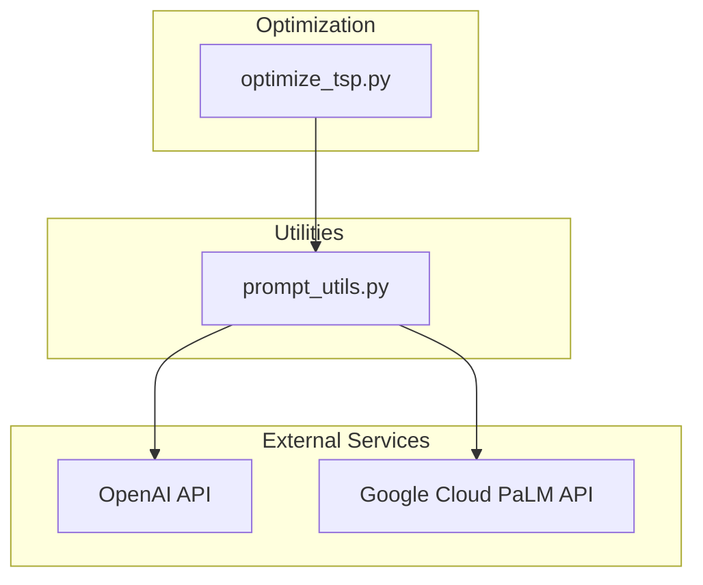
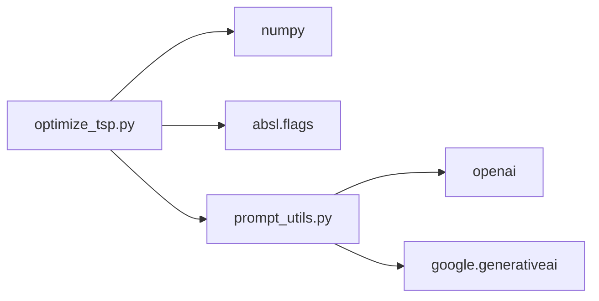

# Traveling Salesman Problem Optimization

<cite>
**Referenced Files in This Document**
- [optimize_tsp.py](file://opro/optimization/optimize_tsp.py)
- [prompt_utils.py](file://opro/prompt_utils.py)
- [README.md](file://README.md)
</cite>

## Table of Contents
1. [Introduction](#introduction)
2. [Project Structure](#project-structure)
3. [Core Components](#core-components)
4. [Architecture Overview](#architecture-overview)
5. [Detailed Component Analysis](#detailed-component-analysis)
6. [Dependency Analysis](#dependency-analysis)
7. [Performance Considerations](#performance-considerations)
8. [Troubleshooting Guide](#troubleshooting-guide)
9. [Conclusion](#conclusion)
10. [Appendices](#appendices)

## Introduction
This document explains how the repository implements combinatorial optimization for the Traveling Salesman Problem (TSP) using Large Language Model (LLM) prompt engineering. The approach treats the optimizer LLM as an instruction designer that iteratively improves a meta-prompt to guide a solver LLM to produce shorter Hamiltonian cycles. The system encodes cities and distances in prompts, steers the LLM toward heuristic strategies (e.g., nearest neighbor, farthest insertion), and evaluates solutions by total path length. We also analyze how the optimizer LLM evolves instructions across optimization steps, discuss evaluation of approximate solutions, and address balancing exploration versus exploitation in instruction search. Guidance is provided for adapting this framework to other routing and scheduling problems, along with limitations and practical workarounds.

## Project Structure
The TSP optimization pipeline lives under the optimization module and interacts with shared prompting utilities:
- opro/optimization/optimize_tsp.py: orchestrates TSP optimization, including prompt generation, LLM calls, solution parsing, and evaluation.
- opro/prompt_utils.py: provides unified functions to call OpenAI and Google Cloud text-bison models.
- README.md: project overview and usage pointers.



**Diagram sources**
- [optimize_tsp.py](file://opro/optimization/optimize_tsp.py#L1-L120)
- [prompt_utils.py](file://opro/prompt_utils.py#L1-L133)

**Section sources**
- [README.md](file://README.md#L1-L79)

## Core Components
- Meta-prompt generator: builds a prompt that lists prior traces and lengths, instructing the solver LLM to propose a new trace with a lower length than any prior.
- Solver LLM: decodes candidate tours from the meta-prompt and returns structured outputs.
- Solution parser: extracts integer sequences from the solver’s output and validates permutation properties.
- Distance evaluator: computes Euclidean tour length with rounding rules.
- Starting heuristics: nearest neighbor, farthest insertion, and dynamic programming baseline for ground truth initialization.
- Optimization loop: iterates steps, collects proposed solutions, updates history, and persists results.

Key implementation references:
- Meta-prompt generation and decoding loop: [optimize_tsp.py](file://opro/optimization/optimize_tsp.py#L254-L311)
- Solution parsing and validation: [optimize_tsp.py](file://opro/optimization/optimize_tsp.py#L293-L311)
- Distance evaluation: [optimize_tsp.py](file://opro/optimization/optimize_tsp.py#L172-L185)
- Starting heuristics and ground truth generation: [optimize_tsp.py](file://opro/optimization/optimize_tsp.py#L187-L253)
- LLM server calls: [optimize_tsp.py](file://opro/optimization/optimize_tsp.py#L112-L160), [prompt_utils.py](file://opro/prompt_utils.py#L21-L133)

**Section sources**
- [optimize_tsp.py](file://opro/optimization/optimize_tsp.py#L172-L311)
- [prompt_utils.py](file://opro/prompt_utils.py#L21-L133)

## Architecture Overview
The system alternates between two roles:
- Optimizer LLM: designs meta-prompts to improve solver performance by exposing prior successful traces and lengths.
- Solver LLM: produces candidate tours from the meta-prompt and returns them in a structured format.

```mermaid
sequenceDiagram
participant User as "User"
participant TSP as "optimize_tsp.py"
participant PU as "prompt_utils.py"
participant Opt as "Optimizer LLM"
participant Sol as "Solver LLM"
User->>TSP : Configure experiment and run main()
TSP->>PU : Initialize optimizer server function
TSP->>TSP : Generate ground truth tour (heuristic or DP)
loop Optimization Steps
TSP->>TSP : Build meta-prompt from prior traces and lengths
TSP->>Opt : Call optimizer with meta-prompt
Opt-->>TSP : Proposed instructions (implicit)
TSP->>Sol : Call solver with meta-prompt
Sol-->>TSP : Candidate tour string
TSP->>TSP : Parse and validate tour
TSP->>TSP : Evaluate tour length
TSP->>TSP : Update history and save results
end
```

**Diagram sources**
- [optimize_tsp.py](file://opro/optimization/optimize_tsp.py#L112-L160)
- [optimize_tsp.py](file://opro/optimization/optimize_tsp.py#L336-L427)
- [prompt_utils.py](file://opro/prompt_utils.py#L21-L133)

## Detailed Component Analysis

### Prompt Encoding of Cities and Distances
- City representation: The meta-prompt enumerates points with identifiers and coordinates, enabling the solver LLM to reason about spatial relationships.
- Distance encoding: Distances are Euclidean and rounded according to configured decimal precision. The evaluator sums segment distances and closes the cycle.
- Historical context: The prompt includes a curated set of prior traces and lengths, sorted by decreasing length (lower is better), to bias the solver toward improvement.

Implementation references:
- City list rendering and historical exemplars: [optimize_tsp.py](file://opro/optimization/optimize_tsp.py#L254-L291)
- Distance computation and rounding: [optimize_tsp.py](file://opro/optimization/optimize_tsp.py#L172-L185)

**Section sources**
- [optimize_tsp.py](file://opro/optimization/optimize_tsp.py#L172-L291)

### Heuristic Strategies Encoded in Instructions
- Instructional steering: The meta-prompt asks the solver to propose a new trace with a lower length than any prior, implicitly encouraging improvement over the population of known solutions.
- Starting heuristics: The system initializes with a heuristic tour (nearest neighbor or farthest insertion) and optionally a dynamic programming baseline for small instances. These provide strong initial solutions and ground truth for evaluation.
- Implicit strategy discovery: The optimizer LLM can encode strategies (e.g., greedy insertion, local search heuristics) within the meta-prompt, guiding the solver to discover improved tours.

Implementation references:
- Starting heuristics and DP baseline: [optimize_tsp.py](file://opro/optimization/optimize_tsp.py#L187-L253)
- Meta-prompt instruction framing: [optimize_tsp.py](file://opro/optimization/optimize_tsp.py#L254-L291)

**Section sources**
- [optimize_tsp.py](file://opro/optimization/optimize_tsp.py#L187-L291)

### Solution Parsing and Validation
- Output extraction: The system looks for a delimited trace and parses comma-separated integers into a tour.
- Validation checks: Ensures the parsed sequence forms a permutation of indices and starts at the designated origin.
- Robustness: Invalid or malformed outputs are ignored to prevent degradation.

Implementation references:
- Parser and validation: [optimize_tsp.py](file://opro/optimization/optimize_tsp.py#L293-L311)

**Section sources**
- [optimize_tsp.py](file://opro/optimization/optimize_tsp.py#L293-L311)

### Evaluation of Total Path Length
- Metric: Sum of Euclidean distances between consecutive cities, plus return to origin.
- Rounding: Results are rounded to configured decimals or cast to integers.
- Ground truth: A strong baseline is computed using nearest neighbor, farthest insertion, or dynamic programming.

Implementation references:
- Distance evaluation: [optimize_tsp.py](file://opro/optimization/optimize_tsp.py#L172-L185)
- Ground truth generation: [optimize_tsp.py](file://opro/optimization/optimize_tsp.py#L187-L253)

**Section sources**
- [optimize_tsp.py](file://opro/optimization/optimize_tsp.py#L172-L253)

### Optimization Loop Evolution and Instruction Search
- Iterative refinement: At each step, the system builds a meta-prompt from recent traces and lengths, requests new candidates, evaluates them, and updates the history.
- Exploration vs. exploitation: The prompt includes a bounded set of prior exemplars, balancing exposure to past successes (exploitation) with diversity (exploration).
- Temperature and decoding: The optimizer LLM uses a temperature tuned for creativity; decoding multiple candidates per step increases diversity.

Implementation references:
- Meta-prompt building and decoding loop: [optimize_tsp.py](file://opro/optimization/optimize_tsp.py#L336-L427)
- LLM server configuration: [optimize_tsp.py](file://opro/optimization/optimize_tsp.py#L112-L160)

**Section sources**
- [optimize_tsp.py](file://opro/optimization/optimize_tsp.py#L112-L160)
- [optimize_tsp.py](file://opro/optimization/optimize_tsp.py#L336-L427)

### Concrete Example: Instruction Evolution Across Steps
- Step 0: The meta-prompt presents randomly generated coordinates and a small set of prior traces with lengths. The solver proposes a candidate tour.
- Step 1: The prompt adds the new candidate to the exemplar set, sorted by length, and requests another improvement.
- Subsequent steps: The exemplar pool grows, and the solver increasingly targets tours below the current best.

This iterative process demonstrates how the optimizer LLM learns to refine instructions that steer the solver toward better solutions.

**Section sources**
- [optimize_tsp.py](file://opro/optimization/optimize_tsp.py#L254-L291)
- [optimize_tsp.py](file://opro/optimization/optimize_tsp.py#L336-L427)

### Adapting the Framework to Other Routing/Scheduling Problems
- Problem encoding: Replace coordinate-based distance with problem-specific constraints and costs in the prompt.
- Instructional framing: Ask the solver to produce feasible solutions that minimize total cost or satisfy constraints.
- Evaluation: Define a metric appropriate to the problem (e.g., makespan, total travel time, resource utilization).
- Heuristics: Encode domain-specific heuristics (e.g., earliest deadline, capacity constraints) as part of the meta-prompt.

[No sources needed since this section provides general guidance]

## Dependency Analysis
- Internal dependencies:
  - optimize_tsp.py depends on prompt_utils.py for model calls.
  - The script uses numpy for geometry and random initialization.
- External dependencies:
  - OpenAI and Google Cloud APIs for LLM inference.
  - Abseil flags for CLI configuration.



**Diagram sources**
- [optimize_tsp.py](file://opro/optimization/optimize_tsp.py#L1-L120)
- [prompt_utils.py](file://opro/prompt_utils.py#L1-L133)

**Section sources**
- [optimize_tsp.py](file://opro/optimization/optimize_tsp.py#L1-L120)
- [prompt_utils.py](file://opro/prompt_utils.py#L1-L133)

## Performance Considerations
- Scalability with city count:
  - Dynamic programming baseline scales poorly with city count; the system uses it only for small instances to establish ground truth.
  - For larger instances, rely on heuristic initialization (nearest neighbor or farthest insertion) and instruction-driven improvement.
- Decoding diversity:
  - Increasing the number of decoded solutions per step improves exploration but raises API costs and latency.
- Prompt size and exemplars:
  - Limiting the number of prior exemplars keeps prompts concise and focused.
- Numerical precision:
  - Rounding reduces noise in distance reporting and parsing.

[No sources needed since this section provides general guidance]

## Troubleshooting Guide
- API key configuration:
  - Ensure the correct provider keys are supplied for the chosen optimizer model.
- Rate limits and timeouts:
  - The prompt utilities handle retries and backoff for rate limit and timeout errors.
- Output parsing failures:
  - Invalid or malformed tours are ignored; increase decoding diversity or adjust instruction framing to improve output quality.
- Hallucinations in path construction:
  - Validate permutations and enforce start nodes; consider adding explicit constraints in the meta-prompt.

**Section sources**
- [optimize_tsp.py](file://opro/optimization/optimize_tsp.py#L112-L160)
- [prompt_utils.py](file://opro/prompt_utils.py#L21-L133)

## Conclusion
The TSP optimization framework demonstrates how LLMs can act as optimizers by iteratively refining meta-prompts that guide a solver LLM to discover improved tours. By encoding cities and distances in prompts, leveraging strong starting heuristics, and evaluating solutions by total path length, the system achieves competitive results. The approach generalizes to other routing and scheduling problems by adjusting problem encoding, evaluation metrics, and instructional framing.

[No sources needed since this section summarizes without analyzing specific files]

## Appendices
- Usage notes:
  - The README outlines supported models and provides quickstart guidance for running the TSP optimization script.

**Section sources**
- [README.md](file://README.md#L1-L79)