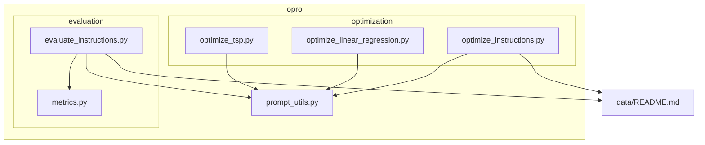
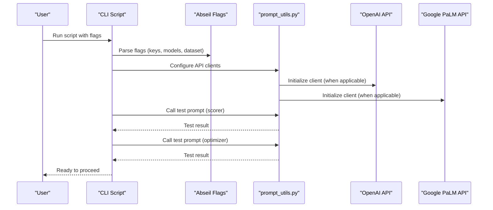
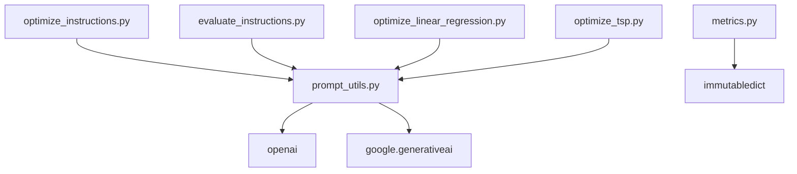

# Installation and Setup

<cite>
**Referenced Files in This Document**
- [README.md](file://README.md)
- [optimize_instructions.py](file://opro/optimization/optimize_instructions.py)
- [evaluate_instructions.py](file://opro/evaluation/evaluate_instructions.py)
- [optimize_linear_regression.py](file://opro/optimization/optimize_linear_regression.py)
- [optimize_tsp.py](file://opro/optimization/optimize_tsp.py)
- [prompt_utils.py](file://opro/prompt_utils.py)
- [metrics.py](file://opro/evaluation/metrics.py)
- [data/README.md](file://data/README.md)
</cite>

## Table of Contents
1. [Introduction](#introduction)
2. [Project Structure](#project-structure)
3. [Core Components](#core-components)
4. [Architecture Overview](#architecture-overview)
5. [Detailed Component Analysis](#detailed-component-analysis)
6. [Dependency Analysis](#dependency-analysis)
7. [Performance Considerations](#performance-considerations)
8. [Troubleshooting Guide](#troubleshooting-guide)
9. [Conclusion](#conclusion)
10. [Appendices](#appendices)

## Introduction
This guide provides a complete, beginner-friendly installation and setup procedure for the opro CLI tool. It covers:
- Creating and activating a Python 3.10.13 environment
- Installing required dependencies with exact version specifications
- Configuring API keys for OpenAI and Google PaLM services
- Passing API keys via command-line arguments
- Verifying both optimizer and scorer APIs are functioning
- Troubleshooting common pitfalls such as incorrect Python versions, missing API keys, network restrictions, and authentication errors
- Security best practices for handling API credentials
- Guidance for automated deployment scenarios

## Project Structure
The repository organizes the CLI into modular scripts under the opro package:
- Optimization scripts: prompt optimization, linear regression optimization, and TSP optimization
- Evaluation script: scoring and evaluation of instructions
- Utilities: shared prompting helpers and evaluation metrics
- Data: benchmark datasets and usage notes

**Diagram sources**
- [optimize_instructions.py](file://opro/optimization/optimize_instructions.py#L1-L120)
- [evaluate_instructions.py](file://opro/evaluation/evaluate_instructions.py#L1-L120)
- [optimize_linear_regression.py](file://opro/optimization/optimize_linear_regression.py#L1-L120)
- [optimize_tsp.py](file://opro/optimization/optimize_tsp.py#L1-L120)
- [prompt_utils.py](file://opro/prompt_utils.py#L1-L60)
- [metrics.py](file://opro/evaluation/metrics.py#L1-L60)
- [data/README.md](file://data/README.md#L1-L31)

**Section sources**
- [README.md](file://README.md#L14-L24)
- [data/README.md](file://data/README.md#L1-L31)

## Core Components
- CLI entry points:
  - Prompt optimization: [optimize_instructions.py](file://opro/optimization/optimize_instructions.py#L1-L120)
  - Instruction evaluation: [evaluate_instructions.py](file://opro/evaluation/evaluate_instructions.py#L1-L120)
  - Linear regression optimization: [optimize_linear_regression.py](file://opro/optimization/optimize_linear_regression.py#L1-L120)
  - TSP optimization: [optimize_tsp.py](file://opro/optimization/optimize_tsp.py#L1-L120)
- Shared utilities:
  - Prompting helpers: [prompt_utils.py](file://opro/prompt_utils.py#L1-L133)
  - Metrics and normalization: [metrics.py](file://opro/evaluation/metrics.py#L1-L120)

Key setup requirements:
- Python 3.10.13
- Dependencies: absl-py, google.generativeai, immutabledict, openai
- API keys for OpenAI and Google PaLM

**Section sources**
- [README.md](file://README.md#L14-L24)
- [optimize_instructions.py](file://opro/optimization/optimize_instructions.py#L1-L120)
- [evaluate_instructions.py](file://opro/evaluation/evaluate_instructions.py#L1-L120)
- [optimize_linear_regression.py](file://opro/optimization/optimize_linear_regression.py#L1-L120)
- [optimize_tsp.py](file://opro/optimization/optimize_tsp.py#L1-L120)
- [prompt_utils.py](file://opro/prompt_utils.py#L1-L133)
- [metrics.py](file://opro/evaluation/metrics.py#L1-L120)

## Architecture Overview
The CLI architecture centers around Abseil flags for argument parsing and shared prompting utilities. Each script validates arguments, configures API clients, and performs a “test call” to verify both scorer and optimizer endpoints before proceeding.

**Diagram sources**
- [optimize_instructions.py](file://opro/optimization/optimize_instructions.py#L104-L210)
- [evaluate_instructions.py](file://opro/evaluation/evaluate_instructions.py#L98-L200)
- [optimize_linear_regression.py](file://opro/optimization/optimize_linear_regression.py#L60-L120)
- [optimize_tsp.py](file://opro/optimization/optimize_tsp.py#L62-L120)
- [prompt_utils.py](file://opro/prompt_utils.py#L1-L133)

## Detailed Component Analysis

### Environment and Dependency Setup
- Python version: Use Python 3.10.13 as verified by the project.
- Install dependencies with exact versions:
  - absl-py (2.0.0)
  - google.generativeai (0.1.0)
  - immutabledict (3.0.0)
  - openai (0.27.2)
- Install using pip with pinned versions as listed in the README.

Security note:
- Store API keys securely and avoid committing them to version control.

Verification:
- After installation, run a quick test call to both scorer and optimizer endpoints in each script to confirm connectivity.

**Section sources**
- [README.md](file://README.md#L14-L24)
- [optimize_instructions.py](file://opro/optimization/optimize_instructions.py#L104-L210)
- [evaluate_instructions.py](file://opro/evaluation/evaluate_instructions.py#L98-L200)
- [optimize_linear_regression.py](file://opro/optimization/optimize_linear_regression.py#L60-L120)
- [optimize_tsp.py](file://opro/optimization/optimize_tsp.py#L62-L120)

### Command-Line Arguments and API Keys
Each CLI script defines flags for API keys and model selection:
- Scorer API key flag: --palm_api_key (PaLM) or --openai_api_key (OpenAI)
- Optimizer API key flag: --palm_api_key or --openai_api_key
- Model flags: --scorer and --optimizer
- Dataset and task flags: --dataset and --task
- Additional flags vary by script (e.g., --instruction_pos, --meta_prompt_type)

Examples from the repository:
- Quickstart for optimization: [README.md](file://README.md#L30-L45)
- Quickstart for evaluation: [README.md](file://README.md#L38-L45)

Best practice:
- Pass API keys as command-line arguments to avoid hardcoding credentials.

**Section sources**
- [README.md](file://README.md#L25-L45)
- [optimize_instructions.py](file://opro/optimization/optimize_instructions.py#L63-L103)
- [evaluate_instructions.py](file://opro/evaluation/evaluate_instructions.py#L63-L97)
- [optimize_linear_regression.py](file://opro/optimization/optimize_linear_regression.py#L49-L70)
- [optimize_tsp.py](file://opro/optimization/optimize_tsp.py#L52-L61)

### Verification Workflow
All scripts perform a “test call” to both scorer and optimizer endpoints before proceeding:
- Scorer test call: [optimize_instructions.py](file://opro/optimization/optimize_instructions.py#L356-L369), [evaluate_instructions.py](file://opro/evaluation/evaluate_instructions.py#L297-L303), [optimize_linear_regression.py](file://opro/optimization/optimize_linear_regression.py#L159-L166), [optimize_tsp.py](file://opro/optimization/optimize_tsp.py#L162-L169)
- Optimizer test call: [optimize_instructions.py](file://opro/optimization/optimize_instructions.py#L362-L369), [optimize_linear_regression.py](file://opro/optimization/optimize_linear_regression.py#L160-L166), [optimize_tsp.py](file://opro/optimization/optimize_tsp.py#L163-L169)

If the test calls succeed, the scripts print confirmation and continue with the selected operation.

**Section sources**
- [optimize_instructions.py](file://opro/optimization/optimize_instructions.py#L356-L369)
- [evaluate_instructions.py](file://opro/evaluation/evaluate_instructions.py#L297-L303)
- [optimize_linear_regression.py](file://opro/optimization/optimize_linear_regression.py#L159-L166)
- [optimize_tsp.py](file://opro/optimization/optimize_tsp.py#L162-L169)

### API Client Configuration
- OpenAI client initialization:
  - Set API key and configure client in scripts that use OpenAI models.
  - Reference: [optimize_instructions.py](file://opro/optimization/optimize_instructions.py#L190-L209), [evaluate_instructions.py](file://opro/evaluation/evaluate_instructions.py#L184-L194), [optimize_linear_regression.py](file://opro/optimization/optimize_linear_regression.py#L82-L91), [optimize_tsp.py](file://opro/optimization/optimize_tsp.py#L85-L94)
- Google PaLM client initialization:
  - Configure client with API key for PaLM models.
  - Reference: [optimize_instructions.py](file://opro/optimization/optimize_instructions.py#L190-L209), [evaluate_instructions.py](file://opro/evaluation/evaluate_instructions.py#L184-L194), [optimize_linear_regression.py](file://opro/optimization/optimize_linear_regression.py#L82-L91), [optimize_tsp.py](file://opro/optimization/optimize_tsp.py#L85-L94)

**Section sources**
- [optimize_instructions.py](file://opro/optimization/optimize_instructions.py#L190-L209)
- [evaluate_instructions.py](file://opro/evaluation/evaluate_instructions.py#L184-L194)
- [optimize_linear_regression.py](file://opro/optimization/optimize_linear_regression.py#L82-L91)
- [optimize_tsp.py](file://opro/optimization/optimize_tsp.py#L85-L94)

### Data Preparation
- Benchmark datasets included:
  - GSM8K, MMLU, BBH, MultiArith, AQuA
- Data notes and sources: [data/README.md](file://data/README.md#L1-L31)

Ensure the data directory structure matches expectations before running scripts.

**Section sources**
- [data/README.md](file://data/README.md#L1-L31)

## Dependency Analysis
The CLI scripts depend on:
- Abseil flags for argument parsing
- OpenAI SDK for GPT models
- Google Generative AI SDK for PaLM models
- immutabledict for immutable mappings
- pandas and numpy for data handling
- Shared utilities for API calls

**Diagram sources**
- [optimize_instructions.py](file://opro/optimization/optimize_instructions.py#L52-L63)
- [evaluate_instructions.py](file://opro/evaluation/evaluate_instructions.py#L52-L62)
- [optimize_linear_regression.py](file://opro/optimization/optimize_linear_regression.py#L41-L50)
- [optimize_tsp.py](file://opro/optimization/optimize_tsp.py#L43-L51)
- [prompt_utils.py](file://opro/prompt_utils.py#L16-L20)
- [metrics.py](file://opro/evaluation/metrics.py#L22-L31)

**Section sources**
- [optimize_instructions.py](file://opro/optimization/optimize_instructions.py#L52-L63)
- [evaluate_instructions.py](file://opro/evaluation/evaluate_instructions.py#L52-L62)
- [optimize_linear_regression.py](file://opro/optimization/optimize_linear_regression.py#L41-L50)
- [optimize_tsp.py](file://opro/optimization/optimize_tsp.py#L43-L51)
- [prompt_utils.py](file://opro/prompt_utils.py#L16-L20)
- [metrics.py](file://opro/evaluation/metrics.py#L22-L31)

## Performance Considerations
- Cost awareness: The README warns about potential API costs for prompt optimization and evaluation. Start with smaller datasets or fewer steps to estimate costs before full-scale runs.
- Batch sizes and decoding: Scripts configure batch sizes and decoding parameters for both scorer and optimizer models. Adjust these based on your environment and service limits.
- Retry and backoff: The prompting utilities implement retry logic for rate limits and timeouts. Expect delays during heavy usage.

[No sources needed since this section provides general guidance]

## Troubleshooting Guide

Common pitfalls and resolutions:
- Incorrect Python version
  - Symptom: Import errors or incompatible syntax.
  - Fix: Use Python 3.10.13 as specified in the README.
  - Reference: [README.md](file://README.md#L14-L18)

- Missing API keys
  - Symptom: Assertion failures requiring API keys for OpenAI or PaLM.
  - Fix: Provide --openai_api_key or --palm_api_key as command-line arguments.
  - References:
    - [optimize_instructions.py](file://opro/optimization/optimize_instructions.py#L190-L209)
    - [evaluate_instructions.py](file://opro/evaluation/evaluate_instructions.py#L184-L194)
    - [optimize_linear_regression.py](file://opro/optimization/optimize_linear_regression.py#L82-L91)
    - [optimize_tsp.py](file://opro/optimization/optimize_tsp.py#L85-L94)

- Network restrictions and authentication errors
  - Symptom: Timeout, rate limit, or connection errors when calling APIs.
  - Fix: Verify firewall/proxy settings, ensure API keys are valid, and retry after cooldown periods.
  - References:
    - [prompt_utils.py](file://opro/prompt_utils.py#L36-L85)
    - [prompt_utils.py](file://opro/prompt_utils.py#L105-L133)

- Dependency conflicts
  - Symptom: Module import errors or version mismatches.
  - Fix: Install exact versions from the README and use a clean virtual environment.
  - Reference: [README.md](file://README.md#L14-L24)

- API connectivity verification
  - Symptom: Uncertainty about endpoint availability.
  - Fix: Run the built-in test calls in each script to validate both scorer and optimizer endpoints.
  - References:
    - [optimize_instructions.py](file://opro/optimization/optimize_instructions.py#L356-L369)
    - [evaluate_instructions.py](file://opro/evaluation/evaluate_instructions.py#L297-L303)
    - [optimize_linear_regression.py](file://opro/optimization/optimize_linear_regression.py#L159-L166)
    - [optimize_tsp.py](file://opro/optimization/optimize_tsp.py#L162-L169)

Security best practices:
- Never commit API keys to version control.
- Use environment variables or secure secret managers in production.
- Limit key scopes to least privilege necessary.
- Rotate keys periodically.

[No sources needed since this section provides general guidance]

## Conclusion
By following this guide, you can reliably install the opro CLI tool, configure API credentials, and verify both optimizer and scorer endpoints. Use the provided verification steps to catch issues early, and adopt the security and cost-awareness practices outlined above for safe and efficient operation.

[No sources needed since this section summarizes without analyzing specific files]

## Appendices

### A. Exact pip Installation Commands
Install dependencies with the exact versions specified in the README:
- absl-py==2.0.0
- google.generativeai==0.1.0
- immutabledict==3.0.0
- openai==0.27.2

Example command (install in a fresh Python 3.10.13 virtual environment):
- pip install absl-py==2.0.0 google.generativeai==0.1.0 immutabledict==3.0.0 openai==0.27.2

[No sources needed since this section provides general guidance]

### B. Example CLI Commands
- Prompt optimization:
  - python optimize_instructions.py --optimizer="gpt-3.5-turbo" --scorer="text-bison" --instruction_pos="Q_begin" --dataset="gsm8k" --task="train" --palm_api_key="<your_palm_api_key>" --openai_api_key="<your_openai_api_key>"
  - Reference: [README.md](file://README.md#L30-L45)

- Prompt evaluation:
  - python evaluate_instructions.py --scorer="text-bison" --dataset="gsm8k" --task="test" --instruction_pos="Q_begin" --evaluate_training_fold=false --evaluate_test_fold=true --palm_api_key="<your_palm_api_key>"
  - Reference: [README.md](file://README.md#L38-L45)

[No sources needed since this section provides general guidance]