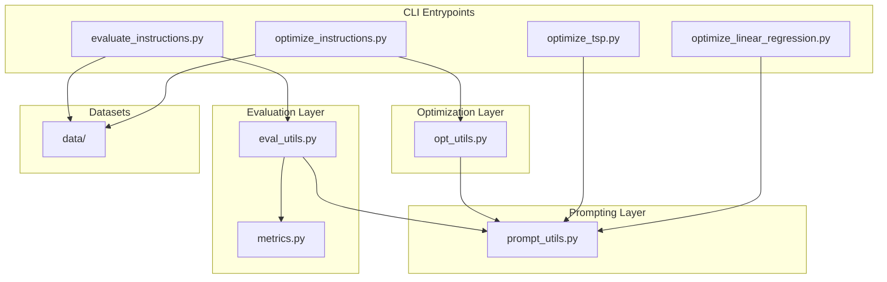
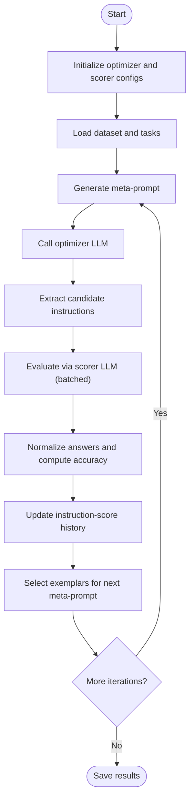
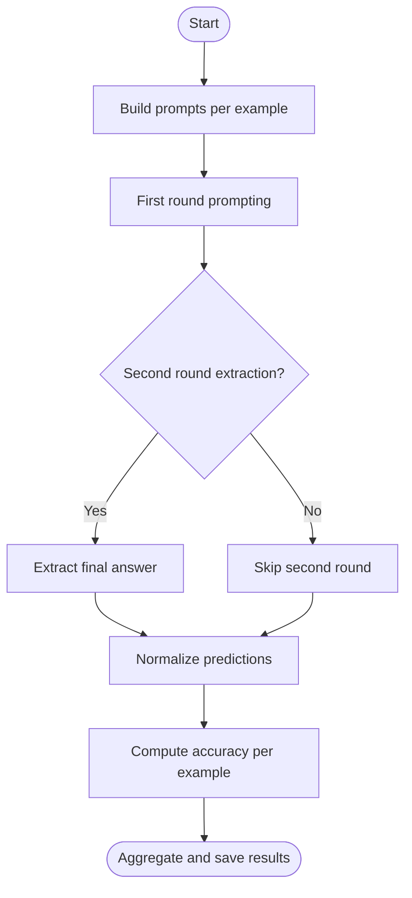
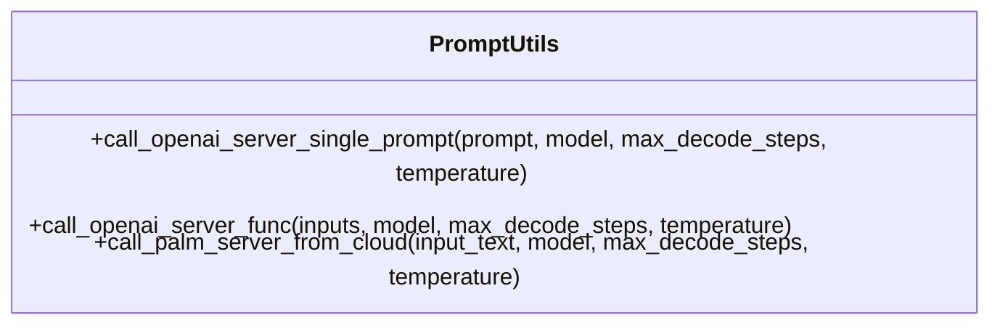
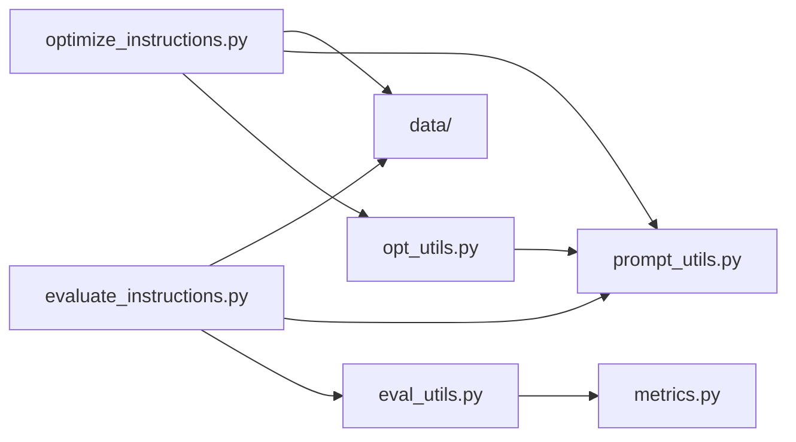

# Project Overview

<cite>
**Referenced Files in This Document**
- [README.md](file://README.md)
- [CONTRIBUTING.md](file://CONTRIBUTING.md)
- [data/README.md](file://data/README.md)
- [opro/prompt_utils.py](file://opro/prompt_utils.py)
- [opro/optimization/optimize_instructions.py](file://opro/optimization/optimize_instructions.py)
- [opro/optimization/opt_utils.py](file://opro/optimization/opt_utils.py)
- [opro/optimization/optimize_linear_regression.py](file://opro/optimization/optimize_linear_regression.py)
- [opro/optimization/optimize_tsp.py](file://opro/optimization/optimize_tsp.py)
- [opro/evaluation/evaluate_instructions.py](file://opro/evaluation/evaluate_instructions.py)
- [opro/evaluation/eval_utils.py](file://opro/evaluation/eval_utils.py)
- [opro/evaluation/metrics.py](file://opro/evaluation/metrics.py)
</cite>

## Table of Contents
1. [Introduction](#introduction)
2. [Project Structure](#project-structure)
3. [Core Components](#core-components)
4. [Architecture Overview](#architecture-overview)
5. [Detailed Component Analysis](#detailed-component-analysis)
6. [Dependency Analysis](#dependency-analysis)
7. [Performance Considerations](#performance-considerations)
8. [Troubleshooting Guide](#troubleshooting-guide)
9. [Conclusion](#conclusion)
10. [Appendices](#appendices)

## Introduction
This project implements a CLI tool that uses large language models (LLMs) as optimizers to iteratively refine instructions for other LLMs (called scorers). The system separates the optimization loop (optimizer LLM) from the evaluation pipeline (scorer LLM), enabling meta-level prompt engineering across multiple benchmark datasets. It supports multiple providers (OpenAI and Google PaLM) and integrates with diverse benchmarks such as MMLU, BIG-Bench Hard (BBH), and GSM8K. The workflow centers on generating meta-prompts, invoking optimizer LLMs to propose improved instructions, evaluating these instructions via scorer LLMs, and iterating until convergence.

## Project Structure
The repository is organized into:
- opro/optimization: optimization scripts and utilities for prompt optimization and auxiliary tasks (linear regression, TSP).
- opro/evaluation: evaluation scripts and utilities for scoring instructions on benchmarks.
- opro/prompt_utils.py: unified client wrappers for OpenAI and Google PaLM APIs.
- data/: benchmark datasets (MMLU, BBH, GSM8K, MultiArith, AQuA).
- Top-level README and contributing guidelines.



**Diagram sources**
- [opro/optimization/optimize_instructions.py](file://opro/optimization/optimize_instructions.py#L1-L120)
- [opro/optimization/opt_utils.py](file://opro/optimization/opt_utils.py#L1-L120)
- [opro/evaluation/evaluate_instructions.py](file://opro/evaluation/evaluate_instructions.py#L1-L120)
- [opro/evaluation/eval_utils.py](file://opro/evaluation/eval_utils.py#L1-L120)
- [opro/evaluation/metrics.py](file://opro/evaluation/metrics.py#L1-L120)
- [opro/prompt_utils.py](file://opro/prompt_utils.py#L1-L133)
- [data/README.md](file://data/README.md#L1-L31)

**Section sources**
- [README.md](file://README.md#L1-L79)
- [data/README.md](file://data/README.md#L1-L31)

## Core Components
- CLI entrypoints:
  - Prompt optimization: opro/optimization/optimize_instructions.py
  - Instruction evaluation: opro/evaluation/evaluate_instructions.py
  - Auxiliary optimization tasks: opro/optimization/optimize_linear_regression.py, opro/optimization/optimize_tsp.py
- Optimization engine: opro/optimization/opt_utils.py orchestrates meta-prompts, instruction generation, and iteration.
- Evaluation engine: opro/evaluation/eval_utils.py generates prompts, invokes scorers, parses outputs, and computes accuracy.
- Metrics: opro/evaluation/metrics.py normalizes predictions and computes accuracy.
- Prompting layer: opro/prompt_utils.py wraps OpenAI and Google PaLM API calls with robust error handling and retries.

Key concepts:
- Optimizer LLM: the LLM that proposes new instructions (e.g., GPT-3.5-Turbo, GPT-4, text-bison).
- Scorer LLM: the LLM used to evaluate instructions (e.g., GPT-3.5-Turbo, GPT-4, text-bison).
- Meta-prompt: a structured prompt containing prior instruction-score pairs and exemplars to guide the optimizer.
- Instruction-score pairs: tuples of (instruction, score, step_index) maintained to inform future generations.
- Instruction positions: before_Q, Q_begin, Q_end, A_begin define where the instruction is placed in the prompt.

**Section sources**
- [opro/optimization/optimize_instructions.py](file://opro/optimization/optimize_instructions.py#L1-L200)
- [opro/optimization/opt_utils.py](file://opro/optimization/opt_utils.py#L90-L336)
- [opro/evaluation/evaluate_instructions.py](file://opro/evaluation/evaluate_instructions.py#L1-L200)
- [opro/evaluation/eval_utils.py](file://opro/evaluation/eval_utils.py#L164-L260)
- [opro/evaluation/metrics.py](file://opro/evaluation/metrics.py#L188-L343)
- [opro/prompt_utils.py](file://opro/prompt_utils.py#L21-L133)

## Architecture Overview
The system is split into two primary modules:
- Optimization module: builds meta-prompts, asks the optimizer LLM to propose new instructions, evaluates them, and updates the history of instruction-score pairs.
- Evaluation module: loads datasets, constructs prompts, invokes the scorer LLM, parses outputs, and computes accuracy.

```mermaid
sequenceDiagram
    participant User as "User"
    participant Opt as "optimize_instructions.py"
    participant Utils as "opt_utils.py"
    participant Eval as "eval_utils.py"
    participant Metrics as "metrics.py"
    participant Prompt as "prompt_utils.py"
    participant Data as "data/"
    User->>Opt: "Configure optimizer, scorer, dataset, task"
    Opt->>Prompt: "Test connectivity (scorer, optimizer)"
    Opt->>Data: "Load dataset and tasks"
    Opt->>Utils: "Initialize meta-prompt and selection criteria"
    loop Iteration
        Opt->>Utils: "Generate meta-prompt"
        Utils->>Prompt: "Call optimizer LLM"
        Prompt-->>Utils: "Generated instructions"
        Utils->>Eval: "Evaluate instructions (batched)"
        Eval->>Prompt: "Call scorer LLM"
        Prompt-->>Eval: "Raw answers"
        Eval->>Metrics: "Parse and normalize answers"
        Metrics-->>Eval: "Normalized results"
        Eval-->>Utils: "Accuracy per example"
        Utils->>Utils: "Update instruction-score history"
    end
    Opt-->>User: "Save results and logs"
```

**Diagram sources**
- [opro/optimization/optimize_instructions.py](file://opro/optimization/optimize_instructions.py#L200-L800)
- [opro/optimization/opt_utils.py](file://opro/optimization/opt_utils.py#L338-L800)
- [opro/evaluation/eval_utils.py](file://opro/evaluation/eval_utils.py#L536-L800)
- [opro/evaluation/metrics.py](file://opro/evaluation/metrics.py#L188-L343)
- [opro/prompt_utils.py](file://opro/prompt_utils.py#L21-L133)
- [data/README.md](file://data/README.md#L1-L31)

## Detailed Component Analysis

### Optimization Workflow
- Meta-prompt construction:
  - Incorporates prior instruction-score pairs and optional few-shot QA exemplars.
  - Supports two meta-prompt types: “both_instructions_and_exemplars” and “instructions_only.”
  - Controls placement of instructions via instruction_pos.
- Instruction generation:
  - Calls the optimizer LLM with the meta-prompt.
  - Extracts candidate instructions from model outputs.
- Evaluation and iteration:
  - Evaluates candidates via the scorer LLM.
  - Updates history and selects exemplars for the next meta-prompt based on selection criteria (random, accumulative_most_frequent, current_most_frequent, constant).
  - Saves intermediate results and maintains a capped history of instruction-score pairs.



**Diagram sources**
- [opro/optimization/opt_utils.py](file://opro/optimization/opt_utils.py#L338-L800)
- [opro/optimization/optimize_instructions.py](file://opro/optimization/optimize_instructions.py#L568-L800)
- [opro/evaluation/eval_utils.py](file://opro/evaluation/eval_utils.py#L536-L800)

**Section sources**
- [opro/optimization/opt_utils.py](file://opro/optimization/opt_utils.py#L90-L336)
- [opro/optimization/opt_utils.py](file://opro/optimization/opt_utils.py#L338-L800)
- [opro/optimization/optimize_instructions.py](file://opro/optimization/optimize_instructions.py#L568-L800)

### Evaluation Pipeline
- Prompt construction:
  - Builds prompts with configurable instruction positions and QA formatting.
- Scoring:
  - Invokes the scorer LLM with batching and optional parallelism.
  - Optionally performs a second round of prompting to extract final answers.
- Parsing and accuracy:
  - Uses metrics to normalize predictions and compute accuracy, handling multiple-choice, numeric, and Boolean targets.



**Diagram sources**
- [opro/evaluation/eval_utils.py](file://opro/evaluation/eval_utils.py#L536-L800)
- [opro/evaluation/metrics.py](file://opro/evaluation/metrics.py#L188-L343)

**Section sources**
- [opro/evaluation/evaluate_instructions.py](file://opro/evaluation/evaluate_instructions.py#L200-L770)
- [opro/evaluation/eval_utils.py](file://opro/evaluation/eval_utils.py#L164-L260)
- [opro/evaluation/eval_utils.py](file://opro/evaluation/eval_utils.py#L536-L800)
- [opro/evaluation/metrics.py](file://opro/evaluation/metrics.py#L188-L343)

### Prompting Layer
- Unified wrappers for OpenAI ChatCompletion and Google PaLM text generation.
- Robust error handling with retries for timeouts, rate limits, API errors, and service unavailability.
- Configurable decoding parameters (temperature, max_decode_steps, batch_size) and model selection.



**Diagram sources**
- [opro/prompt_utils.py](file://opro/prompt_utils.py#L21-L133)

**Section sources**
- [opro/prompt_utils.py](file://opro/prompt_utils.py#L21-L133)

### Benchmark Integrations
- Supported datasets include MMLU, BBH, GSM8K, MultiArith, and AQuA.
- Dataset-specific loaders and task filtering are integrated into the evaluation and optimization pipelines.

**Section sources**
- [data/README.md](file://data/README.md#L1-L31)
- [opro/evaluation/evaluate_instructions.py](file://opro/evaluation/evaluate_instructions.py#L200-L420)
- [opro/optimization/optimize_instructions.py](file://opro/optimization/optimize_instructions.py#L433-L630)

### Auxiliary Optimization Tasks
- Linear regression optimization: meta-prompt contains previous (w, b, loss) pairs; optimizer proposes new parameter pairs.
- TSP optimization: meta-prompt contains previous traces and distances; optimizer proposes new tours.

**Section sources**
- [opro/optimization/optimize_linear_regression.py](file://opro/optimization/optimize_linear_regression.py#L168-L424)
- [opro/optimization/optimize_tsp.py](file://opro/optimization/optimize_tsp.py#L254-L430)

## Dependency Analysis
- Coupling:
  - Optimization depends on evaluation utilities for scoring and metrics for normalization.
  - Both modules depend on prompt_utils for model calls.
  - Data loading is centralized in evaluation and optimization modules.
- Cohesion:
  - opt_utils encapsulates meta-prompt generation and iteration logic.
  - eval_utils centralizes prompt building, parsing, and accuracy computation.
- External dependencies:
  - OpenAI and Google Generative AI SDKs.
  - NumPy, Pandas, Abseil flags for CLI configuration.



**Diagram sources**
- [opro/optimization/optimize_instructions.py](file://opro/optimization/optimize_instructions.py#L1-L200)
- [opro/optimization/opt_utils.py](file://opro/optimization/opt_utils.py#L1-L120)
- [opro/evaluation/evaluate_instructions.py](file://opro/evaluation/evaluate_instructions.py#L1-L120)
- [opro/evaluation/eval_utils.py](file://opro/evaluation/eval_utils.py#L1-L120)
- [opro/evaluation/metrics.py](file://opro/evaluation/metrics.py#L1-L120)
- [opro/prompt_utils.py](file://opro/prompt_utils.py#L1-L133)
- [data/README.md](file://data/README.md#L1-L31)

**Section sources**
- [opro/optimization/optimize_instructions.py](file://opro/optimization/optimize_instructions.py#L1-L200)
- [opro/optimization/opt_utils.py](file://opro/optimization/opt_utils.py#L1-L120)
- [opro/evaluation/evaluate_instructions.py](file://opro/evaluation/evaluate_instructions.py#L1-L120)
- [opro/evaluation/eval_utils.py](file://opro/evaluation/eval_utils.py#L1-L120)
- [opro/evaluation/metrics.py](file://opro/evaluation/metrics.py#L1-L120)
- [opro/prompt_utils.py](file://opro/prompt_utils.py#L1-L133)
- [data/README.md](file://data/README.md#L1-L31)

## Performance Considerations
- API cost:
  - Prompt optimization and evaluation call external LLM APIs frequently; costs can accumulate quickly. The project includes explicit caution about API costs and recommends starting with smaller datasets or fewer steps.
- Parallelization trade-offs:
  - The evaluation pipeline supports multithreading for batching, but parallelism is disabled for GPT models in evaluation to avoid rate-limiting and concurrency issues.
  - Optimization loops can increase batch sizes and decoding parameters, impacting latency and cost.
- Temperature scheduling:
  - Optimization supports temperature schedules to balance exploration and exploitation during instruction generation.

Practical tips:
- Estimate costs before full runs; start with a subset of the dataset.
- Reduce num_generated_instructions_in_each_step and num_search_steps for pilot runs.
- Use text-bison for lower-cost evaluations when appropriate.

**Section sources**
- [README.md](file://README.md#L59-L66)
- [opro/optimization/optimize_instructions.py](file://opro/optimization/optimize_instructions.py#L682-L720)
- [opro/evaluation/evaluate_instructions.py](file://opro/evaluation/evaluate_instructions.py#L535-L542)
- [opro/evaluation/eval_utils.py](file://opro/evaluation/eval_utils.py#L646-L709)

## Troubleshooting Guide
Common issues and remedies:
- API errors and rate limits:
  - prompt_utils implements retries for timeouts, rate limits, API errors, and service unavailability. Inspect retry intervals and adjust sleep times if needed.
- Model connectivity:
  - Both optimization and evaluation test the scorer and optimizer servers before proceeding. Verify API keys and model availability.
- Output parsing:
  - eval_utils and metrics handle normalization and accuracy computation. If results seem inconsistent, review instruction positions and dataset-specific parsing logic.
- Parallelism:
  - For GPT models, parallel evaluation is disabled to prevent concurrency issues. Switch to sequential mode if encountering rate limits.

**Section sources**
- [opro/prompt_utils.py](file://opro/prompt_utils.py#L21-L133)
- [opro/evaluation/eval_utils.py](file://opro/evaluation/eval_utils.py#L338-L379)
- [opro/evaluation/evaluate_instructions.py](file://opro/evaluation/evaluate_instructions.py#L296-L303)

## Conclusion
The opro repository provides a robust framework for LLM-as-optimizer prompt engineering. By separating optimization and evaluation, it enables iterative refinement of instructions across multiple benchmarks and providers. The modular design, strong error handling, and configurable evaluation settings make it suitable for both research and production use. Users should carefully manage API costs and parallelization to achieve reliable and efficient experiments.

## Appendices

### Beginner Concepts and Terminology
- Optimizer LLM: the model that proposes improved instructions.
- Scorer LLM: the model used to evaluate instruction quality.
- Meta-prompt: a structured prompt that includes prior instruction-score pairs and exemplars to guide the optimizer.
- Instruction-score pairs: historical records of instructions and their performance scores.
- Instruction positions: before_Q, Q_begin, Q_end, A_begin define where the instruction is inserted in the prompt.

### Example: Math Reasoning Improvement
Consider a math reasoning task (e.g., GSM8K):
- Initial instruction: a basic instruction template.
- Meta-prompt: includes prior instructions with scores and a few incorrect examples to highlight common pitfalls.
- Optimizer LLM proposes refined instructions that reduce mistakes on those examples.
- Scorer LLM evaluates the new instructions on held-out examples; scores are recorded.
- Iteration continues, gradually improving instruction quality and downstream accuracy.

### Foundational Research
The project implements the LLM-as-optimizer paradigm described in the referenced paper. For background and theoretical foundations, consult the cited publication.

**Section sources**
- [README.md](file://README.md#L1-L14)