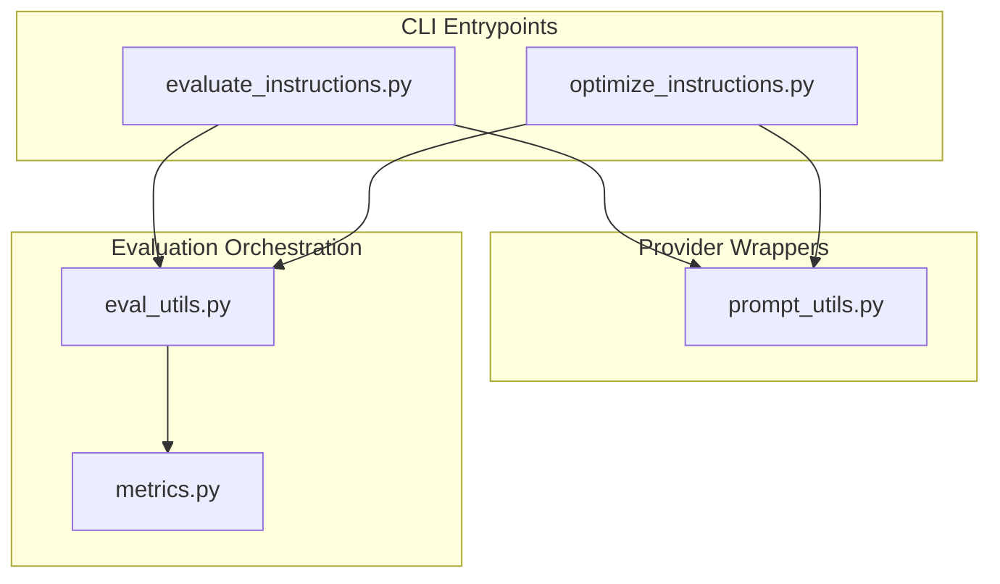
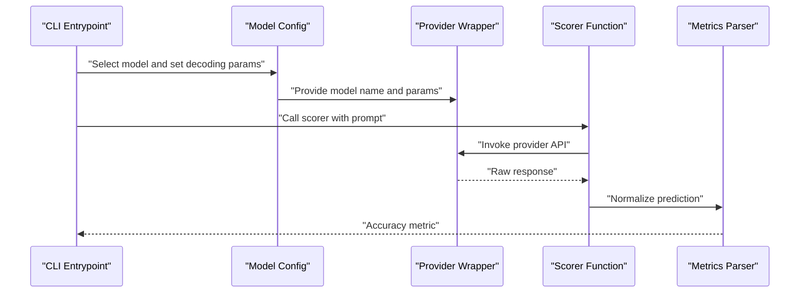
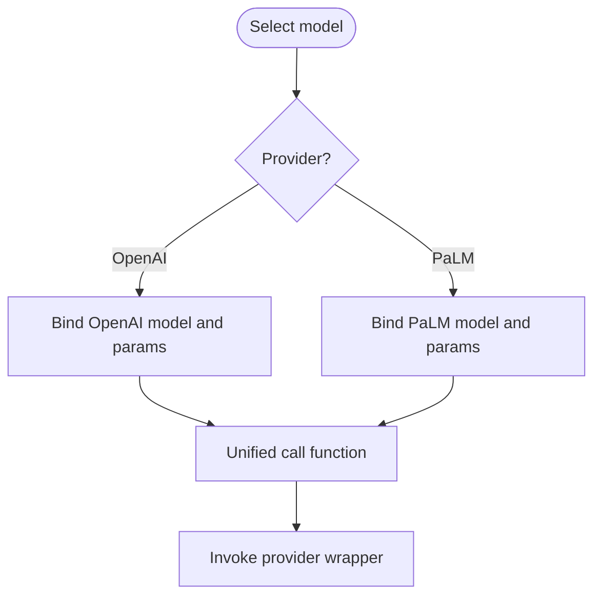
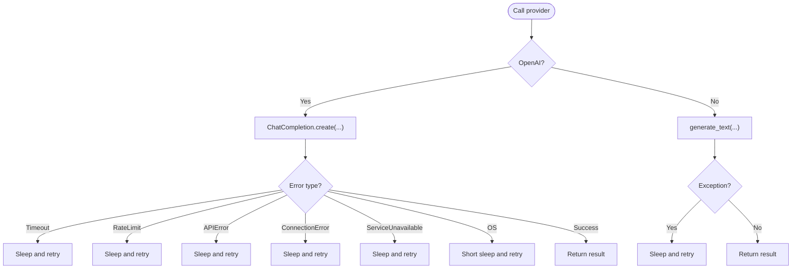
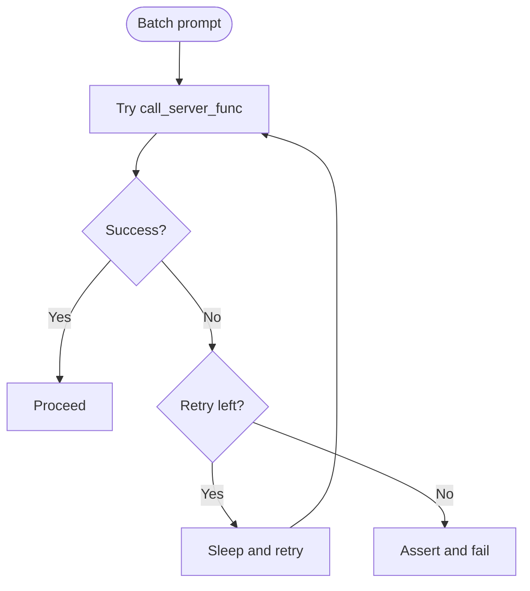
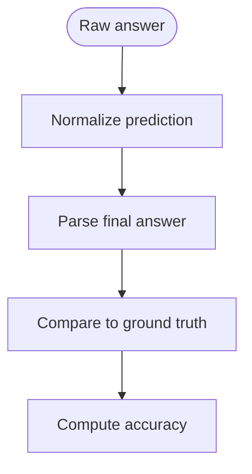
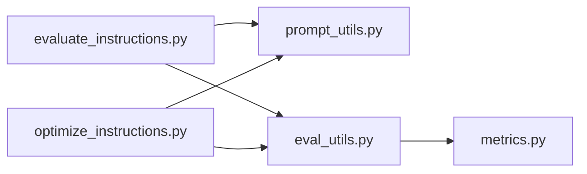

# API Integration

<cite>
**Referenced Files in This Document**
- [evaluate_instructions.py](file://opro/evaluation/evaluate_instructions.py)
- [optimize_instructions.py](file://opro/optimization/optimize_instructions.py)
- [prompt_utils.py](file://opro/prompt_utils.py)
- [eval_utils.py](file://opro/evaluation/eval_utils.py)
- [metrics.py](file://opro/evaluation/metrics.py)
</cite>

## Table of Contents
1. [Introduction](#introduction)
2. [Project Structure](#project-structure)
3. [Core Components](#core-components)
4. [Architecture Overview](#architecture-overview)
5. [Detailed Component Analysis](#detailed-component-analysis)
6. [Dependency Analysis](#dependency-analysis)
7. [Performance Considerations](#performance-considerations)
8. [Troubleshooting Guide](#troubleshooting-guide)
9. [Conclusion](#conclusion)
10. [Appendices](#appendices)

## Introduction
This document explains how the prompt evaluation system integrates with external Large Language Model (LLM) providers to obtain model responses for evaluation. It focuses on the unified abstraction that hides provider-specific differences, the configuration of API keys and decoding parameters, the retry and error-handling mechanisms, and practical guidance for optimizing performance and managing security.

## Project Structure
The API integration spans several modules:
- CLI entry points configure provider credentials and select models.
- Provider-specific wrappers encapsulate API calls and handle retries.
- Evaluation orchestration composes prompts, invokes scorers, and parses results.
- Metrics utilities normalize predictions for fair comparisons.

**Diagram sources**
- [evaluate_instructions.py](file://opro/evaluation/evaluate_instructions.py#L1-L303)
- [optimize_instructions.py](file://opro/optimization/optimize_instructions.py#L1-L369)
- [prompt_utils.py](file://opro/prompt_utils.py#L1-L133)
- [eval_utils.py](file://opro/evaluation/eval_utils.py#L1-L800)
- [metrics.py](file://opro/evaluation/metrics.py#L1-L496)

**Section sources**
- [evaluate_instructions.py](file://opro/evaluation/evaluate_instructions.py#L1-L303)
- [optimize_instructions.py](file://opro/optimization/optimize_instructions.py#L1-L369)
- [prompt_utils.py](file://opro/prompt_utils.py#L1-L133)
- [eval_utils.py](file://opro/evaluation/eval_utils.py#L1-L800)
- [metrics.py](file://opro/evaluation/metrics.py#L1-L496)

## Core Components
- Unified scorer and optimizer selection: Both evaluation and optimization scripts accept flags to choose between OpenAI models and Google PaLM models. They construct provider-specific partial functions that bind model names and decoding parameters.
- Provider wrappers: Two wrapper functions hide provider specifics:
  - OpenAI: chat-style completions with temperature and max tokens.
  - Google PaLM: text generation with temperature and max output tokens.
- Retry and error handling: Wrapper functions implement robust retry logic for timeouts, rate limits, API errors, connection issues, and service unavailability. A general-purpose retry loop is also used during evaluation to guard against transient failures.
- Decoding parameters: Temperature, max decode steps, batch size, number of decodes, and number of servers are configured per model type and reused across invocations.

**Section sources**
- [evaluate_instructions.py](file://opro/evaluation/evaluate_instructions.py#L236-L303)
- [optimize_instructions.py](file://opro/optimization/optimize_instructions.py#L240-L369)
- [prompt_utils.py](file://opro/prompt_utils.py#L21-L133)
- [eval_utils.py](file://opro/evaluation/eval_utils.py#L338-L379)

## Architecture Overview
The system routes evaluation and optimization tasks through a unified call interface that abstracts provider differences. The flow below shows how a prompt is evaluated using a scorer function.

**Diagram sources**
- [evaluate_instructions.py](file://opro/evaluation/evaluate_instructions.py#L236-L303)
- [prompt_utils.py](file://opro/prompt_utils.py#L21-L133)
- [eval_utils.py](file://opro/evaluation/eval_utils.py#L536-L800)
- [metrics.py](file://opro/evaluation/metrics.py#L188-L343)

## Detailed Component Analysis

### Unified Scorer/Optimizer Abstraction
Both evaluation and optimization scripts build a call function for the selected scorer and optimizer. The abstraction:
- Chooses between OpenAI and Google PaLM based on flags.
- Binds model name, temperature, max decode steps, and other parameters.
- Uses partial functions to standardize the call signature across providers.

Key behaviors:
- OpenAI: chat-style model name and token budget via max tokens.
- Google PaLM: text generation with temperature and max output tokens.

**Diagram sources**
- [evaluate_instructions.py](file://opro/evaluation/evaluate_instructions.py#L236-L303)
- [optimize_instructions.py](file://opro/optimization/optimize_instructions.py#L240-L369)

**Section sources**
- [evaluate_instructions.py](file://opro/evaluation/evaluate_instructions.py#L236-L303)
- [optimize_instructions.py](file://opro/optimization/optimize_instructions.py#L240-L369)

### Provider Wrapper Functions
The wrapper functions encapsulate provider-specific logic and implement retry strategies:
- OpenAI wrapper:
  - Chat-style completions with temperature and max tokens.
  - Handles timeout, rate limit, API error, connection error, and service unavailable errors with exponential-like backoff.
  - Re-raises OS errors with short backoff.
- Google PaLM wrapper:
  - Text generation with temperature and max output tokens.
  - Implements a simple retry with fixed delay on exceptions.

**Diagram sources**
- [prompt_utils.py](file://opro/prompt_utils.py#L21-L133)

**Section sources**
- [prompt_utils.py](file://opro/prompt_utils.py#L21-L133)

### Retry Mechanisms and Error Handling
- Provider wrappers:
  - OpenAI: distinct handlers for timeout, rate limit, API error, connection error, and service unavailable; uses retry-after when available, otherwise defaults to a fixed interval.
  - OS/network errors: short sleep and retry.
- General evaluation retry:
  - A dedicated loop retries failed batches with configurable max attempts and sleep intervals, asserting that outputs are produced after all retries.

**Diagram sources**
- [eval_utils.py](file://opro/evaluation/eval_utils.py#L338-L379)
- [prompt_utils.py](file://opro/prompt_utils.py#L21-L133)

**Section sources**
- [eval_utils.py](file://opro/evaluation/eval_utils.py#L338-L379)
- [prompt_utils.py](file://opro/prompt_utils.py#L21-L133)

### Configuration of API Keys and Decoding Parameters
- API keys:
  - OpenAI: configured via a command-line flag and assigned to the OpenAI client.
  - Google PaLM: configured via a command-line flag and passed to the provider library.
- Decoding parameters:
  - Temperature: deterministic for scorer models; exploratory for optimizer models.
  - Max decode steps: token budget for generation.
  - Batch size and number of servers: batching and parallelism controls.
  - Number of decodes: multiple outputs per input when supported.

These configurations are bound into partial functions and reused across invocations.

**Section sources**
- [evaluate_instructions.py](file://opro/evaluation/evaluate_instructions.py#L63-L120)
- [evaluate_instructions.py](file://opro/evaluation/evaluate_instructions.py#L236-L303)
- [optimize_instructions.py](file://opro/optimization/optimize_instructions.py#L65-L110)
- [optimize_instructions.py](file://opro/optimization/optimize_instructions.py#L240-L369)

### Prediction Parsing and Accuracy Computation
After receiving raw responses, the system normalizes predictions and computes accuracy:
- Normalization handles answer indicators, units, decimals, and boolean conversions.
- Accuracy computation compares normalized predictions to ground truth.

**Diagram sources**
- [metrics.py](file://opro/evaluation/metrics.py#L188-L343)
- [eval_utils.py](file://opro/evaluation/eval_utils.py#L536-L800)

**Section sources**
- [metrics.py](file://opro/evaluation/metrics.py#L188-L343)
- [eval_utils.py](file://opro/evaluation/eval_utils.py#L536-L800)

## Dependency Analysis
The following diagram shows how the key modules depend on each other for API integration:

**Diagram sources**
- [evaluate_instructions.py](file://opro/evaluation/evaluate_instructions.py#L1-L303)
- [optimize_instructions.py](file://opro/optimization/optimize_instructions.py#L1-L369)
- [prompt_utils.py](file://opro/prompt_utils.py#L1-L133)
- [eval_utils.py](file://opro/evaluation/eval_utils.py#L1-L800)
- [metrics.py](file://opro/evaluation/metrics.py#L1-L496)

**Section sources**
- [evaluate_instructions.py](file://opro/evaluation/evaluate_instructions.py#L1-L303)
- [optimize_instructions.py](file://opro/optimization/optimize_instructions.py#L1-L369)
- [prompt_utils.py](file://opro/prompt_utils.py#L1-L133)
- [eval_utils.py](file://opro/evaluation/eval_utils.py#L1-L800)
- [metrics.py](file://opro/evaluation/metrics.py#L1-L496)

## Performance Considerations
- Temperature:
  - Deterministic scoring: set to near-zero to reduce variance.
  - Exploratory optimization: higher temperature to encourage diverse outputs.
- Decode budget:
  - Use max decode steps appropriate for the task; smaller budgets for extraction rounds.
- Parallelism:
  - Batch prompts and distribute across servers to improve throughput.
  - Disable parallelism for OpenAI models when required by provider policies.
- Cost efficiency:
  - Reduce max decode steps for extraction passes.
  - Prefer deterministic scorers for bulk evaluations.
  - Monitor provider quotas and adjust concurrency accordingly.

[No sources needed since this section provides general guidance]

## Troubleshooting Guide
Common issues and remedies:
- Rate limiting:
  - The OpenAI wrapper retries with backoff when encountering rate limit errors.
  - Consider reducing concurrency or increasing sleep intervals.
- Timeouts and network errors:
  - The OpenAI wrapper retries on timeouts and connection errors.
  - Verify network connectivity and provider availability.
- Service unavailability:
  - The OpenAI wrapper retries on service unavailable errors.
- Provider misconfiguration:
  - Ensure API keys are provided and valid for the chosen provider.
  - Confirm model names and decoding parameters match provider capabilities.
- Batch failures:
  - The evaluation loop retries failed batches and asserts outcomes after all retries.

**Section sources**
- [prompt_utils.py](file://opro/prompt_utils.py#L21-L133)
- [eval_utils.py](file://opro/evaluation/eval_utils.py#L338-L379)
- [evaluate_instructions.py](file://opro/evaluation/evaluate_instructions.py#L63-L120)
- [optimize_instructions.py](file://opro/optimization/optimize_instructions.py#L190-L210)

## Conclusion
The system provides a clean abstraction over OpenAI and Google PaLM APIs, enabling consistent model invocation across evaluation and optimization workflows. Robust retry logic and standardized decoding parameters help manage provider variability, while careful configuration of keys and parameters supports performance and cost control.

[No sources needed since this section summarizes without analyzing specific files]

## Appendices

### Security Considerations for API Key Management
- Environment variables:
  - Prefer storing API keys in environment variables rather than embedding them in scripts.
  - Load keys from environment variables at runtime to avoid committing secrets.
- Least privilege:
  - Restrict API keys to the minimal permissions required for the tasks.
- Rotation and monitoring:
  - Regularly rotate keys and monitor usage to detect anomalies.
- CLI flags:
  - While flags are supported for convenience, avoid printing sensitive values and sanitize logs.

[No sources needed since this section provides general guidance]