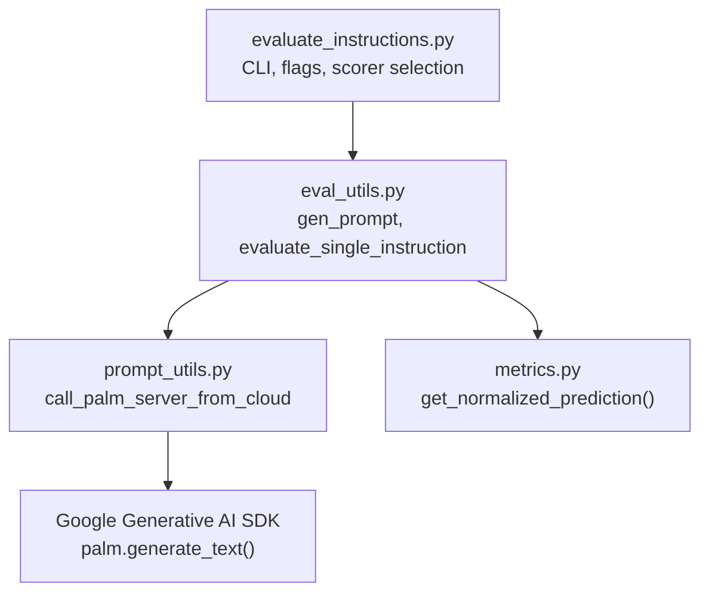
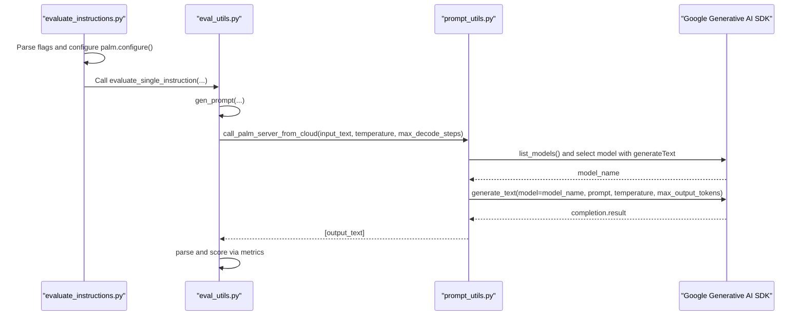
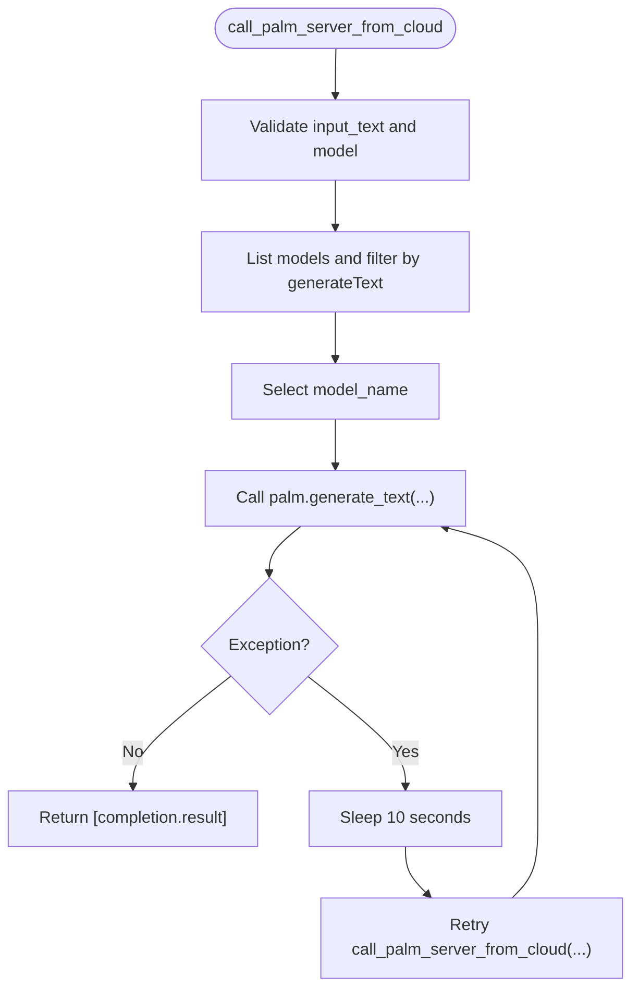
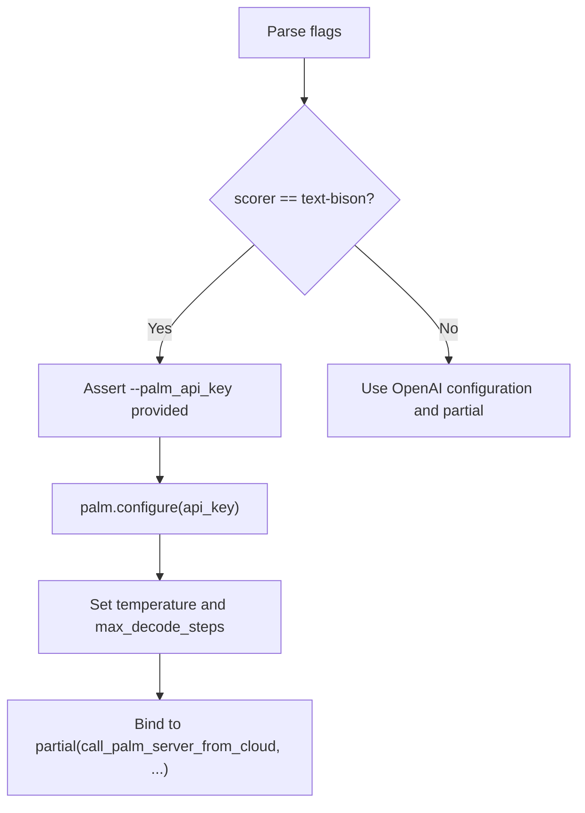
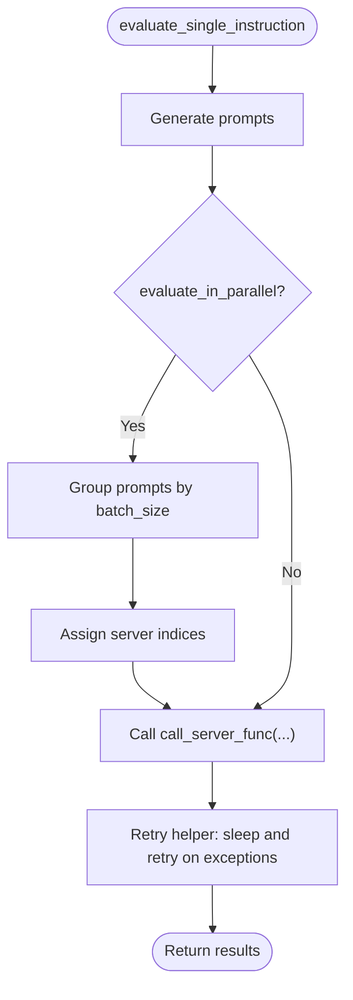
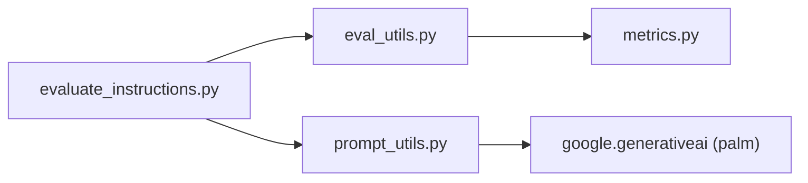

# Google PaLM Integration

<cite>
**Referenced Files in This Document**
- [evaluate_instructions.py](file://opro/evaluation/evaluate_instructions.py)
- [eval_utils.py](file://opro/evaluation/eval_utils.py)
- [prompt_utils.py](file://opro/prompt_utils.py)
- [metrics.py](file://opro/evaluation/metrics.py)
</cite>

## Table of Contents
1. [Introduction](#introduction)
2. [Project Structure](#project-structure)
3. [Core Components](#core-components)
4. [Architecture Overview](#architecture-overview)
5. [Detailed Component Analysis](#detailed-component-analysis)
6. [Dependency Analysis](#dependency-analysis)
7. [Performance Considerations](#performance-considerations)
8. [Troubleshooting Guide](#troubleshooting-guide)
9. [Conclusion](#conclusion)

## Introduction
This document explains how the prompt evaluation system integrates with Google’s Generative AI service using the text-bison model for instruction scoring. It covers configuration and secure handling of the PaLM API key via the --palm_api_key command-line flag, the implementation of call_palm_server_from_cloud, model initialization with palm.configure(), and text generation via palm.generate_text(). It also documents error handling and retry mechanisms for transient failures, parameter mapping from internal configuration to API calls, and guidance on quota management, request limits, and performance optimization. Finally, it addresses differences in response structure between PaLM and OpenAI APIs and how the system normalizes these differences.

## Project Structure
The integration spans several modules:
- Command-line entry and orchestration: evaluate_instructions.py
- Prompt construction and evaluation loop: eval_utils.py
- Model-specific prompting utilities: prompt_utils.py
- Final answer normalization and scoring: metrics.py

**Diagram sources**
- [evaluate_instructions.py](file://opro/evaluation/evaluate_instructions.py#L98-L303)
- [eval_utils.py](file://opro/evaluation/eval_utils.py#L164-L259)
- [prompt_utils.py](file://opro/prompt_utils.py#L105-L133)
- [metrics.py](file://opro/evaluation/metrics.py#L188-L343)

**Section sources**
- [evaluate_instructions.py](file://opro/evaluation/evaluate_instructions.py#L98-L303)
- [eval_utils.py](file://opro/evaluation/eval_utils.py#L164-L259)
- [prompt_utils.py](file://opro/prompt_utils.py#L105-L133)
- [metrics.py](file://opro/evaluation/metrics.py#L188-L343)

## Core Components
- CLI and configuration
  - The script defines flags for openai_api_key, palm_api_key, scorer, dataset, task, instruction_pos, and evaluation folds. It validates dataset/task combinations and scorer availability.
  - When selecting text-bison, it asserts that a PaLM API key is provided and configures the SDK globally via palm.configure().
- Scoring configuration for text-bison
  - Internal configuration sets temperature and max_decode_steps for the text-bison scorer and binds them to a partial function that calls the cloud API wrapper.
- PaLM API wrapper
  - call_palm_server_from_cloud initializes the model name from the SDK, invokes palm.generate_text with temperature and max_output_tokens, and returns a list containing the generated text. It includes a retry mechanism with a fixed 10-second delay on exceptions.
- Retry and robustness
  - The evaluation loop uses a generic retry helper that sleeps for a configurable duration and retries on exceptions. This complements the wrapper-level retry for transient failures.

**Section sources**
- [evaluate_instructions.py](file://opro/evaluation/evaluate_instructions.py#L118-L194)
- [evaluate_instructions.py](file://opro/evaluation/evaluate_instructions.py#L239-L271)
- [prompt_utils.py](file://opro/prompt_utils.py#L105-L133)
- [eval_utils.py](file://opro/evaluation/eval_utils.py#L350-L388)

## Architecture Overview
The system orchestrates instruction evaluation with a scorer model. For text-bison, the flow is:
- CLI parses flags and selects the scorer.
- The evaluator constructs prompts and calls the scorer via a partial function.
- The partial function delegates to call_palm_server_from_cloud.
- The wrapper lists available models, selects one with generateText support, and calls palm.generate_text.
- The wrapper returns the result as a list; the evaluator normalizes and scores the output.

**Diagram sources**
- [evaluate_instructions.py](file://opro/evaluation/evaluate_instructions.py#L118-L194)
- [evaluate_instructions.py](file://opro/evaluation/evaluate_instructions.py#L239-L271)
- [eval_utils.py](file://opro/evaluation/eval_utils.py#L164-L259)
- [prompt_utils.py](file://opro/prompt_utils.py#L105-L133)

## Detailed Component Analysis

### PaLM API Wrapper: call_palm_server_from_cloud
- Purpose: Encapsulate Google Generative AI SDK calls for text-bison.
- Initialization:
  - Validates input type and model name.
  - Lists available models and selects one whose supported_generation_methods include generateText.
- Generation:
  - Calls palm.generate_text with model, prompt, temperature, and max_output_tokens.
  - Returns the result as a single-element list to align with the expected interface.
- Error handling and retry:
  - On any exception, prints a message and retries after a fixed 10-second delay by recursively calling itself with the same parameters.

**Diagram sources**
- [prompt_utils.py](file://opro/prompt_utils.py#L105-L133)

**Section sources**
- [prompt_utils.py](file://opro/prompt_utils.py#L105-L133)

### Scorer Selection and Configuration in evaluate_instructions.py
- Scorer selection:
  - Supports "text-bison", "gpt-3.5-turbo", and "gpt-4".
  - For text-bison, asserts that --palm_api_key is provided and calls palm.configure(api_key=value).
- Scorer configuration:
  - Sets temperature and max_decode_steps for text-bison.
  - Binds these parameters to a partial function that wraps call_palm_server_from_cloud.
  - Stores scorer configuration in a dictionary for persistence.

**Diagram sources**
- [evaluate_instructions.py](file://opro/evaluation/evaluate_instructions.py#L178-L194)
- [evaluate_instructions.py](file://opro/evaluation/evaluate_instructions.py#L239-L271)

**Section sources**
- [evaluate_instructions.py](file://opro/evaluation/evaluate_instructions.py#L178-L194)
- [evaluate_instructions.py](file://opro/evaluation/evaluate_instructions.py#L239-L271)

### Evaluation Loop and Retry Behavior
- The evaluation loop calls evaluate_single_instruction with a call_server_func bound to the chosen scorer.
- Within the evaluation loop, a helper performs retries with a fixed sleep interval and max_retry count.
- The wrapper-level retry in call_palm_server_from_cloud adds an additional safety net for transient failures.

**Diagram sources**
- [eval_utils.py](file://opro/evaluation/eval_utils.py#L536-L759)
- [eval_utils.py](file://opro/evaluation/eval_utils.py#L350-L388)

**Section sources**
- [eval_utils.py](file://opro/evaluation/eval_utils.py#L536-L759)
- [eval_utils.py](file://opro/evaluation/eval_utils.py#L350-L388)

### Parameter Mapping: temperature and max_decode_steps
- Internal configuration:
  - For text-bison, temperature and max_decode_steps are set in evaluate_instructions.py and passed to the partial function.
- API mapping:
  - The wrapper maps max_decode_steps to max_output_tokens and passes temperature to palm.generate_text.
- OpenAI vs PaLM:
  - OpenAI uses max_tokens; PaLM uses max_output_tokens. The wrapper translates accordingly.

**Section sources**
- [evaluate_instructions.py](file://opro/evaluation/evaluate_instructions.py#L243-L257)
- [prompt_utils.py](file://opro/prompt_utils.py#L118-L123)

### Response Normalization Across APIs
- The system normalizes predictions to a common format regardless of API:
  - For GPT models, special handling is applied when the model returns boxed answers.
  - For non-GPT models, predictions are normalized via metrics.get_normalized_prediction(), which strips delimiters, handles numbers and booleans, and rounds appropriately.
- Differences addressed:
  - OpenAI returns structured JSON-like choices; PaLM returns raw text. The wrapper returns a single-element list, and the evaluator normalizes the text into a comparable form.

**Section sources**
- [eval_utils.py](file://opro/evaluation/eval_utils.py#L788-L821)
- [metrics.py](file://opro/evaluation/metrics.py#L188-L343)

## Dependency Analysis
- evaluate_instructions.py depends on:
  - prompt_utils for model-specific calls
  - eval_utils for prompt generation and evaluation
- eval_utils depends on:
  - metrics for normalization
  - prompt_utils indirectly via call_server_func
- prompt_utils depends on:
  - Google Generative AI SDK for palm operations

**Diagram sources**
- [evaluate_instructions.py](file://opro/evaluation/evaluate_instructions.py#L98-L303)
- [eval_utils.py](file://opro/evaluation/eval_utils.py#L164-L259)
- [prompt_utils.py](file://opro/prompt_utils.py#L105-L133)
- [metrics.py](file://opro/evaluation/metrics.py#L188-L343)

**Section sources**
- [evaluate_instructions.py](file://opro/evaluation/evaluate_instructions.py#L98-L303)
- [eval_utils.py](file://opro/evaluation/eval_utils.py#L164-L259)
- [prompt_utils.py](file://opro/prompt_utils.py#L105-L133)
- [metrics.py](file://opro/evaluation/metrics.py#L188-L343)

## Performance Considerations
- Temperature tuning:
  - For deterministic scoring, temperature is set to 0.0 for text-bison in the evaluation configuration.
- Decode steps:
  - max_decode_steps is set to a large value (e.g., 1024) to accommodate long-form reasoning tasks.
- Concurrency:
  - The evaluation loop supports parallel prompting with batching and server assignment. For text-bison, num_servers and batch_size are configured to match the wrapper’s expectations.
- Retry strategy:
  - Wrapper-level retry with a fixed 10-second delay reduces impact of transient failures.
  - Evaluation-level retry with configurable max_retry and sleep_time further improves resilience.

[No sources needed since this section provides general guidance]

## Troubleshooting Guide
- API key issues:
  - Ensure --palm_api_key is provided when selecting text-bison. The script asserts this condition and configures the SDK globally.
- Transient failures:
  - The wrapper retries on exceptions with a fixed 10-second delay. The evaluation loop also retries with a configurable sleep interval and max_retry count.
- Rate limits and quotas:
  - The system does not implement explicit rate limiting or quota checks. Monitor external quotas and adjust max_decode_steps and concurrency to stay within limits.
- Parameter mismatches:
  - Verify that max_decode_steps is mapped to max_output_tokens and temperature is passed consistently across wrappers.

**Section sources**
- [evaluate_instructions.py](file://opro/evaluation/evaluate_instructions.py#L185-L194)
- [prompt_utils.py](file://opro/prompt_utils.py#L105-L133)
- [eval_utils.py](file://opro/evaluation/eval_utils.py#L350-L388)

## Conclusion
The prompt evaluation system integrates Google’s text-bison model via a dedicated wrapper that initializes the SDK, selects a compatible model, and generates text with temperature and max_output_tokens. The configuration is driven by command-line flags and internal dictionaries, and the system normalizes responses across OpenAI and PaLM APIs. Robust retry mechanisms and careful parameter mapping ensure reliable scoring for instruction evaluation.