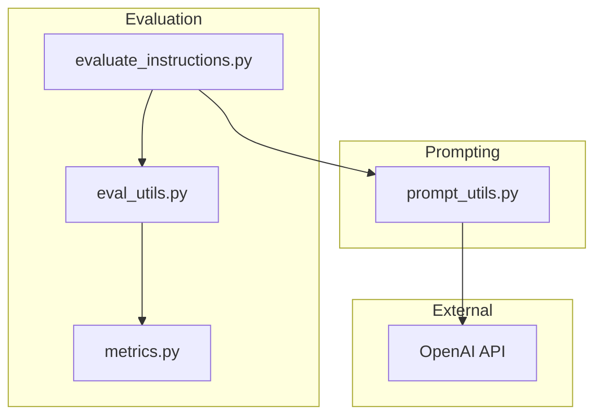
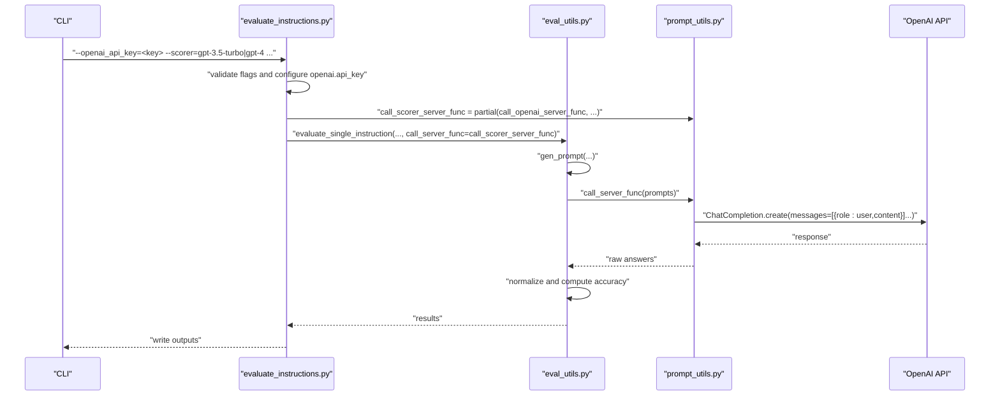
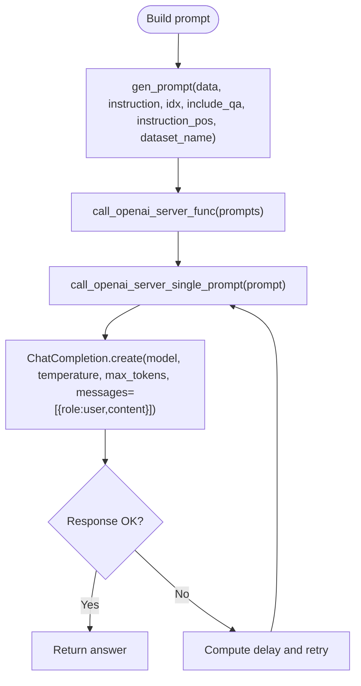
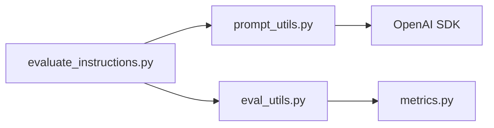

# OpenAI Integration

<cite>
**Referenced Files in This Document**
- [README.md](file://README.md)
- [evaluate_instructions.py](file://opro/evaluation/evaluate_instructions.py)
- [eval_utils.py](file://opro/evaluation/eval_utils.py)
- [prompt_utils.py](file://opro/prompt_utils.py)
- [metrics.py](file://opro/evaluation/metrics.py)
</cite>

## Table of Contents
1. [Introduction](#introduction)
2. [Project Structure](#project-structure)
3. [Core Components](#core-components)
4. [Architecture Overview](#architecture-overview)
5. [Detailed Component Analysis](#detailed-component-analysis)
6. [Dependency Analysis](#dependency-analysis)
7. [Performance Considerations](#performance-considerations)
8. [Troubleshooting Guide](#troubleshooting-guide)
9. [Conclusion](#conclusion)

## Introduction
This document explains how the prompt evaluation system integrates with the OpenAI API to evaluate instructions using models such as gpt-3.5-turbo and gpt-4. It covers configuration of API keys, abstraction of API calls, retry mechanisms for OpenAI-specific errors, prompt construction and sending via the ChatCompletion interface, integration points in the evaluation pipeline, and performance considerations including deterministic outputs and cost implications.

## Project Structure
The OpenAI integration spans three primary modules:
- Evaluation entrypoint that selects the scorer model and orchestrates evaluation
- Utilities that construct prompts and parse model outputs
- Prompt utilities that abstract OpenAI API calls and handle retries

**Diagram sources**
- [evaluate_instructions.py](file://opro/evaluation/evaluate_instructions.py#L98-L303)
- [eval_utils.py](file://opro/evaluation/eval_utils.py#L164-L259)
- [prompt_utils.py](file://opro/prompt_utils.py#L21-L103)
- [metrics.py](file://opro/evaluation/metrics.py#L188-L343)

**Section sources**
- [README.md](file://README.md#L14-L23)
- [evaluate_instructions.py](file://opro/evaluation/evaluate_instructions.py#L98-L303)

## Core Components
- OpenAI API key configuration via command-line flag and runtime setup
- Abstraction of OpenAI API calls with configurable temperature and max_decode_steps
- Retry handling for OpenAI-specific errors
- Prompt construction and sending via ChatCompletion interface
- Integration points in the evaluation pipeline for scoring and accuracy computation

**Section sources**
- [evaluate_instructions.py](file://opro/evaluation/evaluate_instructions.py#L63-L96)
- [evaluate_instructions.py](file://opro/evaluation/evaluate_instructions.py#L184-L193)
- [prompt_utils.py](file://opro/prompt_utils.py#L21-L103)
- [eval_utils.py](file://opro/evaluation/eval_utils.py#L164-L259)
- [metrics.py](file://opro/evaluation/metrics.py#L188-L343)

## Architecture Overview
The evaluation pipeline selects a scorer model (gpt-3.5-turbo or gpt-4), configures OpenAI credentials, constructs prompts, sends requests to the OpenAI API, parses outputs, and computes accuracy.

**Diagram sources**
- [evaluate_instructions.py](file://opro/evaluation/evaluate_instructions.py#L184-L193)
- [evaluate_instructions.py](file://opro/evaluation/evaluate_instructions.py#L272-L295)
- [eval_utils.py](file://opro/evaluation/eval_utils.py#L536-L800)
- [prompt_utils.py](file://opro/prompt_utils.py#L21-L103)

## Detailed Component Analysis

### OpenAI API Key Configuration and Security Best Practices
- The evaluation script defines an OpenAI API key flag and asserts that it is provided when selecting GPT models.
- The script sets the OpenAI client’s API key at runtime.
- Security recommendation: avoid embedding secrets in scripts. Prefer environment variables or secure secret managers. The repository demonstrates passing the key via a command-line flag; in production, load from environment variables and pass to the flag programmatically.

Key locations:
- Flag definition and assertion
- Runtime configuration of the OpenAI client

**Section sources**
- [evaluate_instructions.py](file://opro/evaluation/evaluate_instructions.py#L63-L96)
- [evaluate_instructions.py](file://opro/evaluation/evaluate_instructions.py#L184-L193)

### Abstraction of OpenAI Calls: call_openai_server_func
- The function accepts a single prompt or a list of prompts and returns a list of model responses.
- It delegates to a single-prompt variant that wraps the OpenAI ChatCompletion API.
- Configurable parameters include model name, max_decode_steps (mapped to max_tokens), and temperature.

Implementation highlights:
- Single-prompt wrapper handles OpenAI-specific exceptions and retries
- List wrapper iterates over inputs and aggregates outputs

**Section sources**
- [prompt_utils.py](file://opro/prompt_utils.py#L87-L103)
- [prompt_utils.py](file://opro/prompt_utils.py#L21-L86)

### Retry Mechanism for OpenAI Errors
The single-prompt wrapper implements robust retry logic for:
- Timeout
- RateLimitError
- APIError
- APIConnectionError
- ServiceUnavailableError
- OSError

Behavior:
- On each handled error, it computes a retry delay (using retry_after when available, otherwise a default)
- Sleeps and retries the same call recursively

Note: The evaluation utilities also include a separate retry loop around the server call function, which can be combined with the built-in retries.

**Section sources**
- [prompt_utils.py](file://opro/prompt_utils.py#L21-L86)
- [eval_utils.py](file://opro/evaluation/eval_utils.py#L338-L379)

### Prompt Construction and Sending via ChatCompletion
- Prompts are constructed per dataset and instruction position using a generator that composes question text and optional instruction placement.
- Responses are sent using the ChatCompletion interface with a user role message containing the prompt.
- The evaluation pipeline passes the constructed prompts to the OpenAI abstraction and receives raw answers.

**Diagram sources**
- [eval_utils.py](file://opro/evaluation/eval_utils.py#L164-L259)
- [prompt_utils.py](file://opro/prompt_utils.py#L21-L103)

**Section sources**
- [eval_utils.py](file://opro/evaluation/eval_utils.py#L164-L259)
- [prompt_utils.py](file://opro/prompt_utils.py#L21-L103)

### Integration Points in evaluate_instructions.py
- Model selection and configuration:
  - Scorer name validated against supported values including gpt-3.5-turbo and gpt-4
  - When GPT models are selected, the OpenAI API key is required and set on the client
  - Partially configured scorer function is created with model, temperature, and max_decode_steps
- Testing the scorer server by invoking the configured function with a short prompt
- Passing the scorer function to the evaluation utility for scoring

**Section sources**
- [evaluate_instructions.py](file://opro/evaluation/evaluate_instructions.py#L178-L193)
- [evaluate_instructions.py](file://opro/evaluation/evaluate_instructions.py#L272-L295)
- [evaluate_instructions.py](file://opro/evaluation/evaluate_instructions.py#L296-L303)

### Response Processing and Accuracy Evaluation
- After receiving raw answers, the evaluation pipeline optionally performs a second round of prompting to extract final answers.
- Predictions are normalized and accuracy is computed using dataset-specific heuristics and normalization rules.

Key processing steps:
- Optional second round extraction to improve final answer formatting
- Normalization of predictions and targets
- Accuracy computation tailored to multiple-choice, numeric, and Boolean outputs

**Section sources**
- [eval_utils.py](file://opro/evaluation/eval_utils.py#L713-L800)
- [metrics.py](file://opro/evaluation/metrics.py#L188-L343)

## Dependency Analysis
The evaluation pipeline depends on:
- OpenAI SDK for API calls
- Evaluation utilities for prompt construction and accuracy computation
- Metrics utilities for normalization and scoring

**Diagram sources**
- [evaluate_instructions.py](file://opro/evaluation/evaluate_instructions.py#L98-L303)
- [eval_utils.py](file://opro/evaluation/eval_utils.py#L164-L259)
- [prompt_utils.py](file://opro/prompt_utils.py#L21-L103)
- [metrics.py](file://opro/evaluation/metrics.py#L188-L343)

**Section sources**
- [README.md](file://README.md#L14-L23)
- [evaluate_instructions.py](file://opro/evaluation/evaluate_instructions.py#L98-L303)
- [eval_utils.py](file://opro/evaluation/eval_utils.py#L164-L259)
- [prompt_utils.py](file://opro/prompt_utils.py#L21-L103)
- [metrics.py](file://opro/evaluation/metrics.py#L188-L343)

## Performance Considerations
- Deterministic outputs:
  - Temperature is set to a deterministic value for GPT models during evaluation
  - max_decode_steps controls output length to reduce latency and cost
- Cost considerations:
  - The repository includes a caution about API costs; consider limiting dataset subsets or reducing max_decode_steps for exploratory runs
- Throughput:
  - The evaluation pipeline disables parallel prompting for GPT models by default to avoid rate-limiting and concurrency issues

**Section sources**
- [evaluate_instructions.py](file://opro/evaluation/evaluate_instructions.py#L272-L295)
- [README.md](file://README.md#L59-L62)
- [eval_utils.py](file://opro/evaluation/eval_utils.py#L536-L597)

## Troubleshooting Guide
Common issues and remedies:
- Missing API key:
  - Ensure the OpenAI API key flag is provided when selecting GPT models
- Rate limits and timeouts:
  - The single-prompt wrapper retries on rate limit and timeout errors; consider increasing delays or reducing request rate
- Connection errors:
  - The wrapper retries on connection-related errors; verify network connectivity and API availability
- Output parsing:
  - For GPT models, final answers may be wrapped in special formatting; the pipeline includes a second round of prompting to extract final answers reliably

Operational tips:
- Use the built-in retry logic in the prompt wrapper
- Monitor logs for retry messages and adjust delays if necessary
- Limit concurrent requests when using GPT models to avoid throttling

**Section sources**
- [evaluate_instructions.py](file://opro/evaluation/evaluate_instructions.py#L184-L193)
- [prompt_utils.py](file://opro/prompt_utils.py#L21-L86)
- [eval_utils.py](file://opro/evaluation/eval_utils.py#L338-L379)
- [eval_utils.py](file://opro/evaluation/eval_utils.py#L713-L745)

## Conclusion
The OpenAI integration in the evaluation system is encapsulated by a dedicated abstraction that handles API calls, error retries, and configurable decoding parameters. The evaluation pipeline wires this abstraction into prompt construction and accuracy computation, enabling robust and repeatable scoring of instructions across datasets. For production use, combine the built-in retries with environment-based secret management and careful cost monitoring.