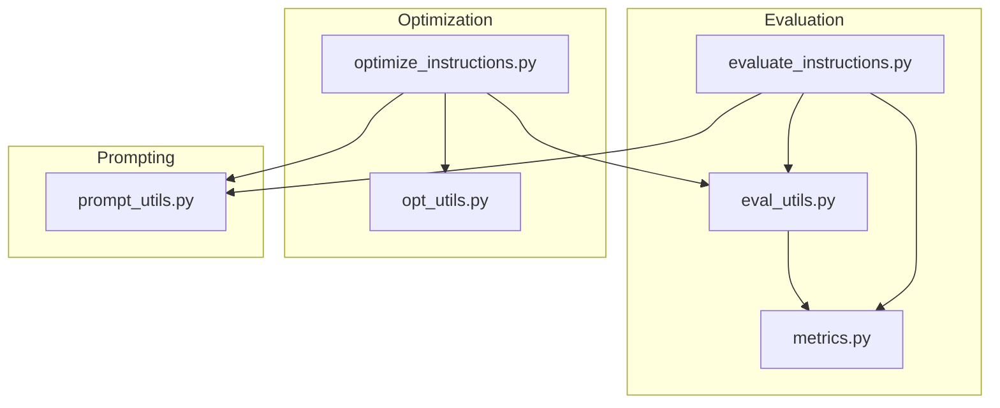
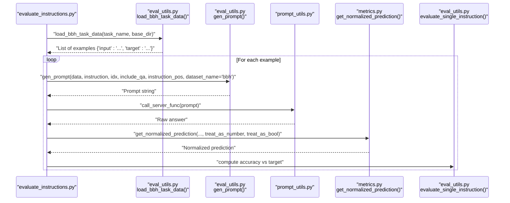
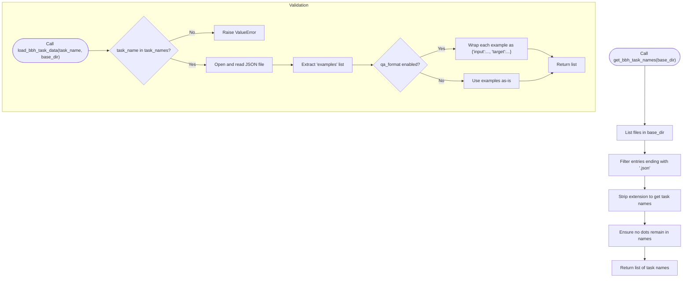
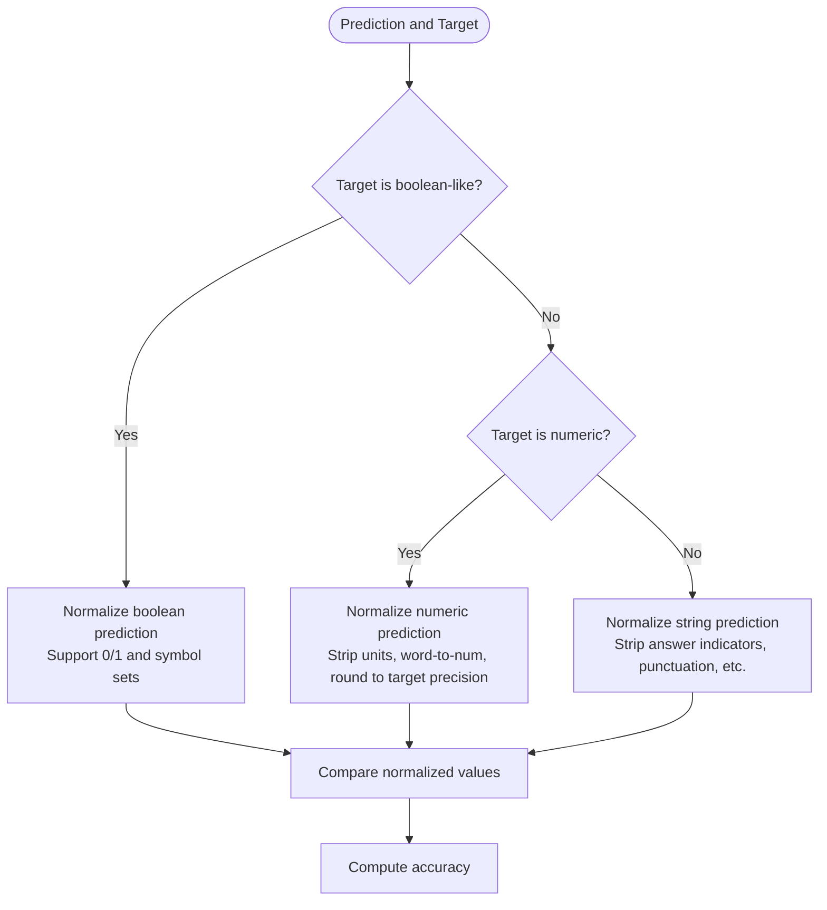
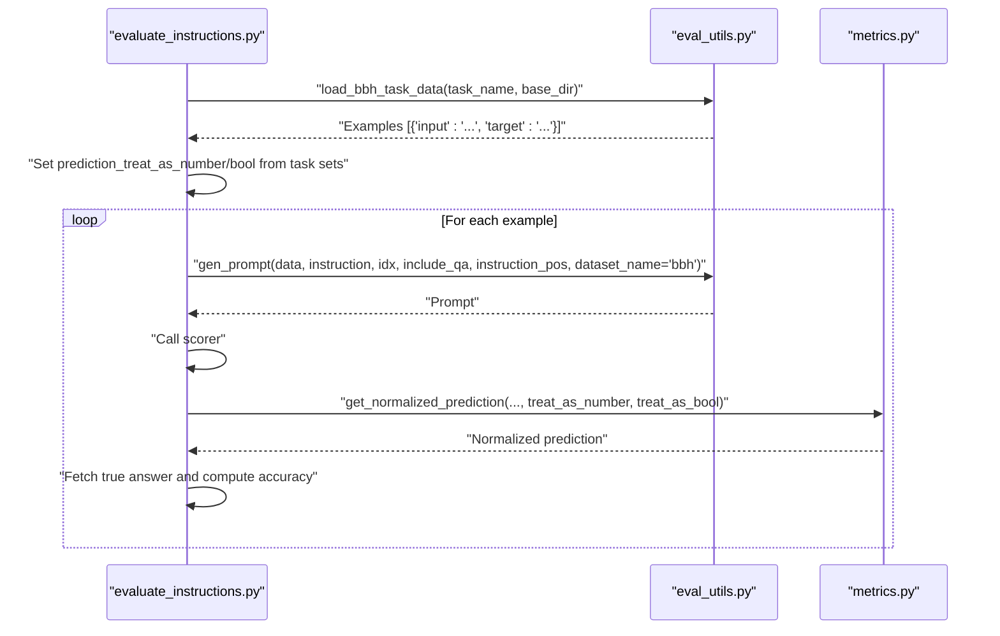
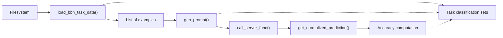

# BIG-Bench Hard (BBH) Dataset Handling

<cite>
**Referenced Files in This Document**
- [eval_utils.py](file://opro/evaluation/eval_utils.py)
- [evaluate_instructions.py](file://opro/evaluation/evaluate_instructions.py)
- [metrics.py](file://opro/evaluation/metrics.py)
- [optimize_instructions.py](file://opro/optimization/optimize_instructions.py)
- [opt_utils.py](file://opro/optimization/opt_utils.py)
- [prompt_utils.py](file://opro/prompt_utils.py)
</cite>

## Table of Contents
1. [Introduction](#introduction)
2. [Project Structure](#project-structure)
3. [Core Components](#core-components)
4. [Architecture Overview](#architecture-overview)
5. [Detailed Component Analysis](#detailed-component-analysis)
6. [Dependency Analysis](#dependency-analysis)
7. [Performance Considerations](#performance-considerations)
8. [Troubleshooting Guide](#troubleshooting-guide)
9. [Conclusion](#conclusion)
10. [Appendices](#appendices)

## Introduction
This document explains how the BIG-Bench Hard (BBH) dataset is handled in the prompt evaluation system. It focuses on:
- Loading BBH tasks from JSON files
- Validating task names
- Transforming raw examples into standardized input-target pairs
- Supporting different response types: boolean, multiple-choice, and numerical
- QA formatting with “Q:” and “A:” prefixes
- Handling BBH’s diverse task categories such as logical deduction, temporal sequences, and reasoning about colored objects
- Guidance for adding new BBH tasks and maintaining response-type mappings

## Project Structure
The BBH integration spans evaluation and optimization scripts, with shared utilities for data loading, prompt construction, and scoring.

**Diagram sources**
- [evaluate_instructions.py](file://opro/evaluation/evaluate_instructions.py#L555-L766)
- [eval_utils.py](file://opro/evaluation/eval_utils.py#L867-L916)
- [metrics.py](file://opro/evaluation/metrics.py#L188-L343)
- [optimize_instructions.py](file://opro/optimization/optimize_instructions.py#L578-L629)
- [opt_utils.py](file://opro/optimization/opt_utils.py#L486-L515)
- [prompt_utils.py](file://opro/prompt_utils.py#L21-L133)

**Section sources**
- [evaluate_instructions.py](file://opro/evaluation/evaluate_instructions.py#L208-L221)
- [optimize_instructions.py](file://opro/optimization/optimize_instructions.py#L211-L220)

## Core Components
- Task discovery and validation: get_bbh_task_names lists available JSON files and filters valid BBH task names.
- Data loader: load_bbh_task_data reads a single BBH task JSON file and returns a list of examples with standardized keys.
- Prompt construction: gen_prompt builds prompts for BBH using “Q:” and “A:” prefixes when enabled.
- Answer normalization and scoring: metrics.get_normalized_prediction and related utilities handle boolean, numerical, and multiple-choice parsing.
- Task classification: evaluation and optimization scripts define sets of tasks for boolean, multiple-choice, and numerical outputs.

**Section sources**
- [eval_utils.py](file://opro/evaluation/eval_utils.py#L867-L916)
- [eval_utils.py](file://opro/evaluation/eval_utils.py#L164-L259)
- [metrics.py](file://opro/evaluation/metrics.py#L188-L343)
- [evaluate_instructions.py](file://opro/evaluation/evaluate_instructions.py#L468-L504)
- [optimize_instructions.py](file://opro/optimization/optimize_instructions.py#L544-L577)

## Architecture Overview
The evaluation pipeline loads BBH tasks, constructs prompts, sends them to a scorer, parses the model output, and computes accuracy. Optimization augments this by evolving instructions using meta-prompts and exemplars.

**Diagram sources**
- [evaluate_instructions.py](file://opro/evaluation/evaluate_instructions.py#L555-L766)
- [eval_utils.py](file://opro/evaluation/eval_utils.py#L867-L916)
- [eval_utils.py](file://opro/evaluation/eval_utils.py#L164-L259)
- [metrics.py](file://opro/evaluation/metrics.py#L188-L343)
- [prompt_utils.py](file://opro/prompt_utils.py#L21-L133)

## Detailed Component Analysis

### BBH Task Discovery and Validation
- get_bbh_task_names scans the BBH data directory and enumerates JSON files, returning a list of valid task names derived from filenames.
- load_bbh_task_data validates the requested task name against the discovered list and raises an error if invalid.
- The loader reads the JSON file and extracts the “examples” field, returning a list of dictionaries with “input” and “target”.

**Diagram sources**
- [eval_utils.py](file://opro/evaluation/eval_utils.py#L870-L874)
- [eval_utils.py](file://opro/evaluation/eval_utils.py#L877-L916)

**Section sources**
- [eval_utils.py](file://opro/evaluation/eval_utils.py#L867-L916)

### QA Formatting Option
- The loader accepts a qa_format flag. When enabled, it wraps each example’s input and target into a standardized dictionary with “input” and “target” keys. This ensures consistent downstream processing regardless of raw JSON structure.
- QA formatting is also used during prompt construction and meta-prompt generation to consistently represent questions and answers.

**Section sources**
- [eval_utils.py](file://opro/evaluation/eval_utils.py#L877-L916)
- [opt_utils.py](file://opro/optimization/opt_utils.py#L209-L255)

### Response Type Support
- Boolean tasks: The system recognizes boolean-like targets and normalizes predictions accordingly. It supports multiple symbol sets (e.g., true/false, yes/no, valid/invalid) and converts numeric 0/1 to boolean strings when needed.
- Multiple-choice tasks: The system identifies multiple-choice questions and extracts the selected choice symbol or text. It compares against the correct answer using exact symbol match or inclusion of the correct choice text while excluding others.
- Numerical tasks: The system detects numeric targets and normalizes predictions by removing units, handling word-to-number conversions, rounding to the target’s precision, and performing numeric comparisons.

**Diagram sources**
- [metrics.py](file://opro/evaluation/metrics.py#L188-L343)
- [eval_utils.py](file://opro/evaluation/eval_utils.py#L381-L497)

**Section sources**
- [metrics.py](file://opro/evaluation/metrics.py#L188-L343)
- [eval_utils.py](file://opro/evaluation/eval_utils.py#L381-L497)

### Task Classification and Selection
- Evaluation and optimization scripts maintain explicit sets of BBH tasks categorized by response type:
  - Numerical tasks: object counting, multistep arithmetic two
  - Multiple-choice tasks: date understanding, disambiguation QA, geometric shapes, hyperbaton, logical deduction families, movie recommendation, penguins in a table, reasoning about colored objects, ruin names, salient translation error detection, snarks, temporal sequences, tracking shuffled objects families
  - Boolean tasks: boolean expressions, causal judgement, formal fallacies, navigate, sports understanding, web of lies
- These sets are used to configure treat_as_number and treat_as_bool flags and to decide is_multiple_choice for prompt construction.

**Section sources**
- [evaluate_instructions.py](file://opro/evaluation/evaluate_instructions.py#L468-L504)
- [optimize_instructions.py](file://opro/optimization/optimize_instructions.py#L544-L577)

### Prompt Construction for BBH
- gen_prompt constructs prompts for BBH by extracting the “input” field from examples and formatting it according to instruction_pos and include_qa.
- When include_qa is True, prompts are prefixed with “Q: ” and “A:” to standardize input and output formatting.

**Section sources**
- [eval_utils.py](file://opro/evaluation/eval_utils.py#L164-L259)

### Example Loading and Evaluation Flow
- evaluate_instructions.py loads BBH data by calling load_bbh_task_data, determines treat_as_number and treat_as_bool from the task classification sets, and evaluates instructions using eval_utils.evaluate_single_instruction.
- The evaluation pipeline generates prompts, calls the scorer, normalizes predictions, and computes accuracy.

**Diagram sources**
- [evaluate_instructions.py](file://opro/evaluation/evaluate_instructions.py#L555-L766)
- [eval_utils.py](file://opro/evaluation/eval_utils.py#L164-L259)
- [metrics.py](file://opro/evaluation/metrics.py#L188-L343)

**Section sources**
- [evaluate_instructions.py](file://opro/evaluation/evaluate_instructions.py#L555-L766)
- [eval_utils.py](file://opro/evaluation/eval_utils.py#L536-L800)
- [metrics.py](file://opro/evaluation/metrics.py#L188-L343)

## Dependency Analysis
- Data loading depends on filesystem access and JSON parsing.
- Prompt construction depends on dataset-specific formatting logic.
- Scoring depends on normalization utilities and accuracy computation.
- Optimization depends on evaluation utilities and meta-prompt generation.

**Diagram sources**
- [eval_utils.py](file://opro/evaluation/eval_utils.py#L867-L916)
- [eval_utils.py](file://opro/evaluation/eval_utils.py#L164-L259)
- [metrics.py](file://opro/evaluation/metrics.py#L188-L343)
- [evaluate_instructions.py](file://opro/evaluation/evaluate_instructions.py#L468-L504)
- [optimize_instructions.py](file://opro/optimization/optimize_instructions.py#L544-L577)

**Section sources**
- [eval_utils.py](file://opro/evaluation/eval_utils.py#L867-L916)
- [eval_utils.py](file://opro/evaluation/eval_utils.py#L164-L259)
- [metrics.py](file://opro/evaluation/metrics.py#L188-L343)
- [evaluate_instructions.py](file://opro/evaluation/evaluate_instructions.py#L468-L504)
- [optimize_instructions.py](file://opro/optimization/optimize_instructions.py#L544-L577)

## Performance Considerations
- Batch size and parallelism: The evaluation and optimization scripts configure batch sizes and server counts to balance throughput and latency.
- Retry and backoff: Prompt utilities implement retry logic for API errors to improve robustness.
- Adaptive normalization: For numerical tasks, normalization rounds to the target’s precision to reduce floating-point comparison overhead.

[No sources needed since this section provides general guidance]

## Troubleshooting Guide
- Invalid task name: If load_bbh_task_data is called with a task name not present in get_bbh_task_names, it raises a ValueError. Verify the task name and data directory path.
- Missing QA formatting: If QA prefixes are expected but not present, ensure qa_format is enabled when loading data or when constructing prompts.
- Incorrect response type classification: If boolean or numerical parsing yields unexpected results, confirm the task is classified correctly in the task sets and that treat_as_number/treat_as_bool flags are set appropriately.
- Model output parsing: For numerical outputs, ensure predictions are normalized using get_normalized_prediction with treat_as_number=True and appropriate num_decimals.

**Section sources**
- [eval_utils.py](file://opro/evaluation/eval_utils.py#L897-L901)
- [metrics.py](file://opro/evaluation/metrics.py#L188-L343)
- [prompt_utils.py](file://opro/prompt_utils.py#L21-L133)

## Conclusion
The BBH dataset handling integrates cleanly with the broader evaluation and optimization framework. It provides robust task discovery, standardized data transformation, flexible QA formatting, and precise normalization for multiple response types. Maintaining accurate task classification sets is essential for reliable evaluation and instruction optimization.

[No sources needed since this section summarizes without analyzing specific files]

## Appendices

### Adding a New BBH Task
Steps to add a new BBH task:
1. Place the task’s JSON file in the BBH data directory with the task name as the filename (without extension).
2. Confirm the task name appears in get_bbh_task_names by listing the directory contents.
3. Determine the response type:
   - Boolean: Add the task name to the boolean tasks set.
   - Multiple-choice: Add the task name to the multiple-choice tasks set.
   - Numerical: Add the task name to the numerical output tasks set.
4. Run evaluation or optimization with the new task name. The system will load the task data and apply the appropriate normalization and classification flags.

**Section sources**
- [eval_utils.py](file://opro/evaluation/eval_utils.py#L870-L874)
- [evaluate_instructions.py](file://opro/evaluation/evaluate_instructions.py#L468-L504)
- [optimize_instructions.py](file://opro/optimization/optimize_instructions.py#L544-L577)