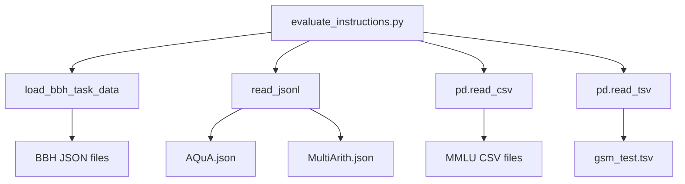

# Dataset Handling

<cite>
**Referenced Files in This Document**   
- [data\README.md](file://data/README.md)
- [opro\evaluation\evaluate_instructions.py](file://opro/evaluation/evaluate_instructions.py)
- [opro\evaluation\eval_utils.py](file://opro/evaluation/eval_utils.py)
- [opro\evaluation\metrics.py](file://opro/evaluation/metrics.py)
- [data\MMLU-data\test\abstract_algebra_test.csv](file://data/MMLU-data/test/abstract_algebra_test.csv)
- [data\gsm_data\gsm_test.tsv](file://data/gsm_data/gsm_test.tsv)
- [data\MultiArith-data\MultiArith.json](file://data/MultiArith-data/MultiArith.json)
- [data\AQuA-data\AQuA.json](file://data/AQuA-data/AQuA.json)
</cite>

## Table of Contents
1. [Introduction](#introduction)
2. [Supported Benchmark Datasets](#supported-benchmark-datasets)
3. [Dataset Loading and Processing](#dataset-loading-and-processing)
4. [Data Format Transformation](#data-format-transformation)
5. [Category Filtering and Task Configuration](#category-filtering-and-task-configuration)
6. [Input-Output Format Handling](#input-output-format-handling)
7. [Adding Support for New Datasets](#adding-support-for-new-datasets)
8. [Conclusion](#conclusion)

## Introduction
The prompt evaluation system supports multiple benchmark datasets for evaluating instruction effectiveness across various domains and question types. The system is designed to handle datasets with different data formats, structures, and input-output requirements, transforming them into a unified format for consistent evaluation. This document details the implementation of dataset handling capabilities, focusing on the support for MMLU, BBH, GSM8K, MultiArith, and AQuA benchmarks, and explains how the system processes these diverse datasets through specialized loading functions and format transformations.

**Section sources**
- [data\README.md](file://data/README.md#L1-L31)

## Supported Benchmark Datasets
The system supports five major benchmark datasets: Massive Multitask Language Understanding (MMLU), Big-Bench Hard (BBH), Grade School Math (GSM8K), MultiArith, and AQuA. Each dataset serves a specific purpose and contains questions in different formats and domains. MMLU covers a broad range of academic subjects across STEM, humanities, social sciences, and other categories. BBH includes challenging tasks that test reasoning abilities across various domains such as logical deduction, causal judgment, and temporal sequences. GSM8K focuses on grade school math word problems that require multi-step reasoning. MultiArith contains arithmetic word problems that involve multiple operations, while AQuA features multiple-choice questions that require quantitative reasoning with answer options.

The datasets are stored in the data directory with specific subdirectories for each benchmark. MMLU data is organized in CSV files categorized by subject, with each file containing questions and multiple-choice options. GSM8K data is stored in TSV format with questions, answers, and solution rationales. MultiArith and AQuA datasets are stored in JSON format, with MultiArith containing structured arithmetic problems and AQuA containing multiple-choice questions with options and correct answers. The system uses these different file formats and structures to load and process the data appropriately for evaluation.

**Section sources**
- [data\README.md](file://data/README.md#L1-L31)

## Dataset Loading and Processing
The system implements dataset-specific loading functions to handle the different data formats and structures of the supported benchmarks. For BBH datasets, the `load_bbh_task_data` function reads JSON files from the BIG-Bench-Hard-data directory, parsing the input and target fields for each task. This function handles the hierarchical structure of BBH tasks, where each task has its own JSON file containing multiple question-answer pairs. For AQuA and MultiArith datasets, the `read_jsonl` function processes JSON Lines format files, reading each line as a separate JSON object and collecting them into a list for evaluation.

The main evaluation script `evaluate_instructions.py` orchestrates the loading process by determining the appropriate data source based on the specified dataset and task parameters. It sets up the root data folder path according to the dataset type and calls the corresponding loading function. For MMLU datasets, it reads CSV files using pandas, while for GSM8K it reads TSV files with tab separation. The system validates the dataset and task names against predefined sets to ensure only supported benchmarks are processed. This modular approach allows the system to handle different file formats and directory structures while providing a consistent interface for the evaluation pipeline.

**Diagram sources**
- [opro\evaluation\evaluate_instructions.py](file://opro/evaluation/evaluate_instructions.py#L1-L770)
- [opro\evaluation\eval_utils.py](file://opro/evaluation/eval_utils.py#L1-L800)

**Section sources**
- [opro\evaluation\evaluate_instructions.py](file://opro/evaluation/evaluate_instructions.py#L1-L770)
- [opro\evaluation\eval_utils.py](file://opro/evaluation/eval_utils.py#L1-L800)

## Data Format Transformation
The system transforms raw data from various formats into a unified structure for consistent evaluation. For MMLU datasets, the `_format_mmlu_example` function processes CSV data by extracting the question and multiple-choice options, formatting them with standardized labels like "(A)", "(B)", etc., and appending a consistent question prompt. This ensures that all MMLU questions follow the same format regardless of their original structure in the CSV files. Similarly, for AQuA datasets, the `_format_aqua_example` function processes JSON data by extracting the question and options, formatting them with bracketed letters, and adding a standardized multiple-choice prompt.

The `gen_prompt` function serves as the central transformation mechanism, creating standardized prompts from the processed data. It supports different instruction positions (before question, at beginning of question, at end of question, or at beginning of answer) and can include or exclude "Q:" and "A:" markers based on the configuration. The function handles different dataset types by calling the appropriate formatting function for MMLU, BBH, GSM8K, MultiArith, or AQuA data. This transformation ensures that regardless of the original data format, the evaluation system receives consistently formatted prompts, enabling uniform processing and comparison across different benchmarks.

**Section sources**
- [opro\evaluation\eval_utils.py](file://opro/evaluation/eval_utils.py#L1-L800)

## Category Filtering and Task Configuration
The system implements sophisticated filtering mechanisms for MMLU datasets based on predefined categories and subcategories. The `mmlu_subcategories` dictionary maps each MMLU subject to its corresponding category (STEM, humanities, social sciences, or other), while the `mmlu_categories` dictionary defines the subjects included in each category. When evaluating MMLU data, the system filters tasks based on the specified category, selecting only those tasks whose subjects belong to the requested category. This allows focused evaluation on specific domains without processing irrelevant subjects.

For BBH benchmarks, the system supports task-specific configuration through predefined sets of tasks categorized by their output format requirements. The `numerical_output_tasks` set includes tasks that require numerical answers, such as "object_counting" and "multistep_arithmetic_two". The `multiple_choice_tasks` set contains tasks with multiple-choice answers, while the `boolean_tasks` set identifies tasks with boolean responses (true/false, yes/no, valid/invalid). This configuration enables the system to apply appropriate evaluation metrics and parsing rules based on the task type, ensuring accurate assessment of model performance across different question formats.

**Section sources**
- [opro\evaluation\evaluate_instructions.py](file://opro/evaluation/evaluate_instructions.py#L1-L770)

## Input-Output Format Handling
The system handles different input-output formats across datasets through specialized processing functions and configuration settings. For multiple-choice questions (MMLU, AQuA, and some BBH tasks), the system uses the `_get_accuracy` function to evaluate answers by checking for exact matches, choice text matches, or boolean symbol matches. This function handles various representations of correct answers, including bracketed letters, word forms, and boolean phrases, ensuring accurate evaluation regardless of how the model expresses its response.

For numerical answers (GSM8K, MultiArith, and numerical BBH tasks), the system employs the `get_normalized_prediction` function in `metrics.py` to parse and compare numerical outputs. This function extracts numerical values from model responses, handling various formats such as word numbers ("twenty"), decimal numbers, and expressions with units. It also supports adaptive number treatment, automatically detecting when a prediction should be treated as a number based on the target answer. For boolean responses (certain BBH tasks), the system recognizes multiple representations of true/false values and normalizes them for consistent evaluation, supporting phrases like "yes/no", "true/false", and "valid/invalid".

**Section sources**
- [opro\evaluation\eval_utils.py](file://opro/evaluation/eval_utils.py#L1-L800)
- [opro\evaluation\metrics.py](file://opro/evaluation/metrics.py#L1-L496)

## Adding Support for New Datasets
To add support for new datasets, developers should implement dataset-specific loading functions similar to `load_bbh_task_data` and `read_jsonl`, ensuring they return data in a format compatible with the evaluation pipeline. The new dataset must be added to the validation sets in `evaluate_instructions.py` to be recognized by the system. Developers should also update the `gen_prompt` function to handle the new dataset type, either by creating a new formatting function or adapting an existing one to the new data structure.

The data format specifications for new datasets should follow the patterns established by existing benchmarks: CSV for tabular data with multiple-choice questions, JSON or JSON Lines for structured data with complex fields, and TSV for simple question-answer pairs. The system expects each data entry to have clearly defined input (question) and output (answer) fields that can be extracted and formatted consistently. For multiple-choice questions, options should be identifiable through consistent formatting (e.g., bracketed letters), while numerical answers should be expressible in standard numerical format. The evaluation configuration should specify whether the dataset contains multiple-choice, numerical, or boolean tasks to ensure appropriate metric application.

**Section sources**
- [opro\evaluation\evaluate_instructions.py](file://opro/evaluation/evaluate_instructions.py#L1-L770)
- [opro\evaluation\eval_utils.py](file://opro/evaluation/eval_utils.py#L1-L800)

## Conclusion
The prompt evaluation system provides comprehensive support for multiple benchmark datasets through a flexible and extensible architecture. By implementing dataset-specific loading functions, standardized data transformation, and adaptive format handling, the system can process diverse data formats and structures while maintaining consistent evaluation criteria. The category filtering for MMLU and task-specific configuration for BBH enable focused analysis of model performance across different domains and question types. The system's design allows for straightforward addition of new datasets, ensuring its continued relevance as new benchmarks emerge in the field of prompt evaluation.