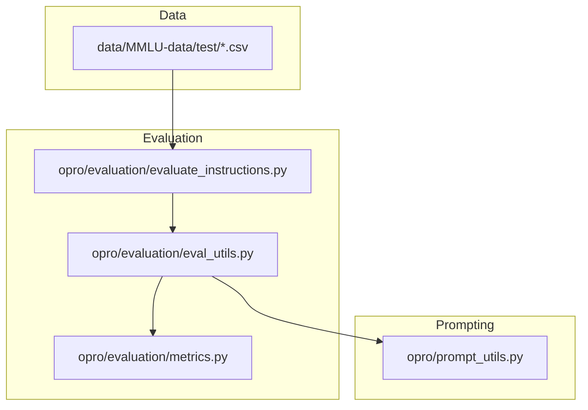
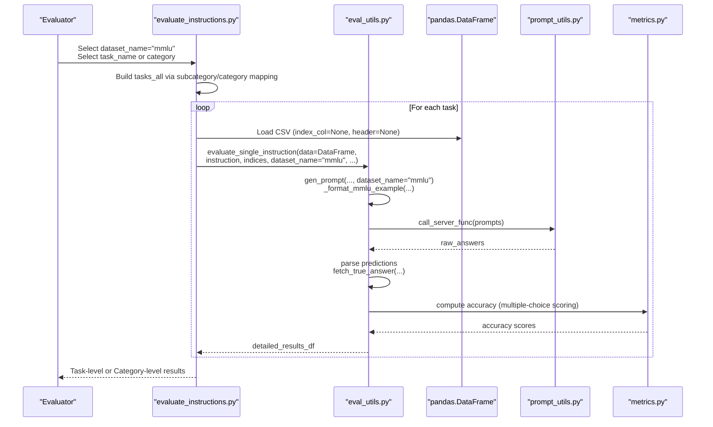
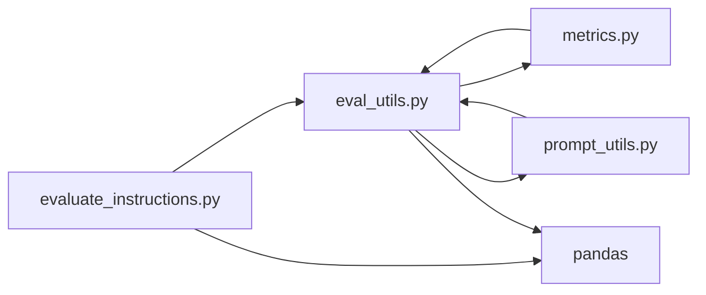
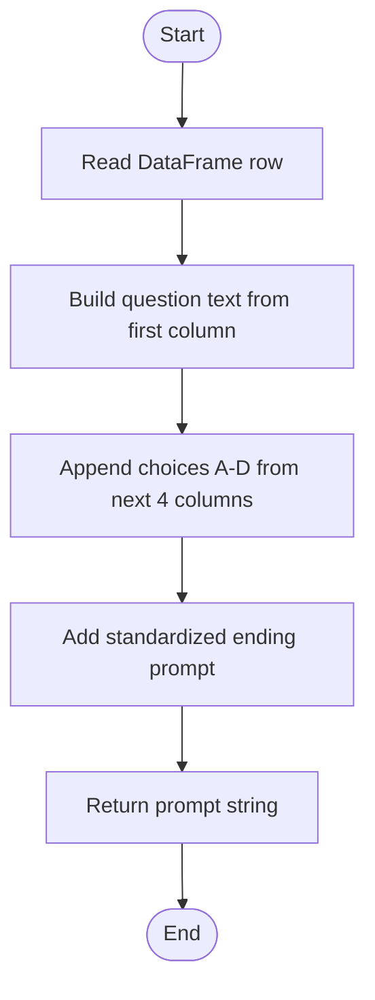

# MMLU Dataset Handling

<cite>
**Referenced Files in This Document**
- [eval_utils.py](file://opro/evaluation/eval_utils.py)
- [evaluate_instructions.py](file://opro/evaluation/evaluate_instructions.py)
- [metrics.py](file://opro/evaluation/metrics.py)
- [prompt_utils.py](file://opro/prompt_utils.py)
- [abstract_algebra_test.csv](file://data/MMLU-data/test/abstract_algebra_test.csv)
- [README.md](file://data/README.md)
</cite>

## Table of Contents
1. [Introduction](#introduction)
2. [Project Structure](#project-structure)
3. [Core Components](#core-components)
4. [Architecture Overview](#architecture-overview)
5. [Detailed Component Analysis](#detailed-component-analysis)
6. [Dependency Analysis](#dependency-analysis)
7. [Performance Considerations](#performance-considerations)
8. [Troubleshooting Guide](#troubleshooting-guide)
9. [Conclusion](#conclusion)
10. [Appendices](#appendices)

## Introduction
This document explains how the prompt evaluation system handles the Massive Multitask Language Understanding (MMLU) dataset. It covers:
- Loading MMLU test data from CSV files using pandas
- Processing multiple-choice questions with four answer choices (A, B, C, D)
- Category-based filtering using mappings for subcategories and categories
- Prompt generation via _format_mmlu_example
- Correct answer retrieval via fetch_true_answer
- Evaluation workflow supporting per-task and per-category evaluation modes
- Guidance on configuring task selection and handling the hierarchical structure of STEM, humanities, social sciences, and other categories

## Project Structure
The MMLU-related logic spans evaluation utilities, dataset configuration, and prompt generation helpers. The data is stored under data/MMLU-data/test with one CSV per task.

**Diagram sources**
- [evaluate_instructions.py](file://opro/evaluation/evaluate_instructions.py#L300-L499)
- [eval_utils.py](file://opro/evaluation/eval_utils.py#L120-L286)
- [metrics.py](file://opro/evaluation/metrics.py#L1-L120)
- [prompt_utils.py](file://opro/prompt_utils.py#L1-L133)

**Section sources**
- [README.md](file://data/README.md#L9-L15)
- [abstract_algebra_test.csv](file://data/MMLU-data/test/abstract_algebra_test.csv#L1-L20)

## Core Components
- MMLU CSV format and loader
  - CSV files are loaded without headers and indices, with columns representing question text, four choices, and the correct answer letter.
  - Loader reads each CSV into a DataFrame and concatenates across tasks for per-category evaluation.

- Prompt generation
  - _format_mmlu_example constructs the prompt text from a DataFrame row, appending choices A–D and a standardized ending prompt.

- True answer retrieval
  - fetch_true_answer returns the correct answer letter for MMLU from the last column of the DataFrame.

- Evaluation workflow
  - Per-task mode evaluates a single CSV file.
  - Per-category mode filters tasks by subcategory and category mappings, then concatenates selected tasks into a unified dataset.

**Section sources**
- [eval_utils.py](file://opro/evaluation/eval_utils.py#L120-L286)
- [evaluate_instructions.py](file://opro/evaluation/evaluate_instructions.py#L300-L499)
- [abstract_algebra_test.csv](file://data/MMLU-data/test/abstract_algebra_test.csv#L1-L20)

## Architecture Overview
The MMLU pipeline integrates data loading, prompt construction, inference, and scoring.

**Diagram sources**
- [evaluate_instructions.py](file://opro/evaluation/evaluate_instructions.py#L387-L499)
- [eval_utils.py](file://opro/evaluation/eval_utils.py#L164-L286)
- [metrics.py](file://opro/evaluation/metrics.py#L345-L496)
- [prompt_utils.py](file://opro/prompt_utils.py#L1-L133)

## Detailed Component Analysis

### MMLU CSV Format and Loader
- CSV structure
  - Each CSV contains rows with the question text, four choices, and the correct answer letter in the last column.
  - Example row layout: question, choice A, choice B, choice C, choice D, correct answer letter.

- Loader behavior
  - Per-task: Loads a single CSV into a DataFrame.
  - Per-category: Iterates over test folder CSVs, filters by subcategory and category mappings, and concatenates DataFrames.

- Data types and indexing
  - DataFrames are indexed by row number; true answers are accessed by column index.

**Section sources**
- [abstract_algebra_test.csv](file://data/MMLU-data/test/abstract_algebra_test.csv#L1-L20)
- [evaluate_instructions.py](file://opro/evaluation/evaluate_instructions.py#L555-L592)
- [evaluate_instructions.py](file://opro/evaluation/evaluate_instructions.py#L593-L629)

### Prompt Generation: _format_mmlu_example
- Purpose
  - Construct a standardized prompt string from a DataFrame row for MMLU, including the question and choices A–D.

- Implementation highlights
  - Uses the first column as the question stem.
  - Iterates over the next four columns to append choices A–D.
  - Adds a standardized ending prompt asking for the answer in (A) (B) (C) (D).

- Integration
  - Called by gen_prompt when dataset_name="mmlu".

**Section sources**
- [eval_utils.py](file://opro/evaluation/eval_utils.py#L126-L150)
- [eval_utils.py](file://opro/evaluation/eval_utils.py#L164-L211)

### True Answer Retrieval: fetch_true_answer
- Purpose
  - Extract the correct answer letter for a given row index from the dataset.

- Implementation highlights
  - For MMLU, returns the last column of the DataFrame row.

- Integration
  - Used during evaluation to collect ground-truth labels for scoring.

**Section sources**
- [eval_utils.py](file://opro/evaluation/eval_utils.py#L262-L286)

### Evaluation Workflow: Per-Task vs Per-Category
- Per-task mode
  - Loads a single CSV file and evaluates on its indices.
  - Suitable for focused task-level analysis.

- Per-category mode
  - Filters tasks by subcategory-to-category mapping and builds tasks_all as tuples of (folder, task_name).
  - Concatenates selected tasks into a unified dataset for evaluation.

- Splitting and scoring
  - Applies random splits for training/test folds.
  - Uses evaluate_single_instruction to generate prompts, call inference, parse answers, and compute accuracy.

**Section sources**
- [evaluate_instructions.py](file://opro/evaluation/evaluate_instructions.py#L387-L499)
- [evaluate_instructions.py](file://opro/evaluation/evaluate_instructions.py#L555-L749)
- [eval_utils.py](file://opro/evaluation/eval_utils.py#L536-L800)

### Scoring and Accuracy for Multiple-Choice
- Prediction normalization
  - Metrics module normalizes predictions and targets, extracting bracketed choices and handling numeric/boolean cases.

- Multiple-choice scoring logic
  - eval_utils computes accuracy considering exact symbol match, text match of the chosen option, exclusion of other options, and boolean match.

**Section sources**
- [metrics.py](file://opro/evaluation/metrics.py#L188-L343)
- [metrics.py](file://opro/evaluation/metrics.py#L345-L496)
- [eval_utils.py](file://opro/evaluation/eval_utils.py#L381-L497)

### Prompt Construction and Inference Integration
- gen_prompt
  - Builds prompts for MMLU using _format_mmlu_example and supports configurable instruction placement and QA formatting.

- Inference integration
  - evaluate_single_instruction orchestrates batching, parallelism, and retries, then passes raw answers to metrics for scoring.

**Section sources**
- [eval_utils.py](file://opro/evaluation/eval_utils.py#L164-L286)
- [eval_utils.py](file://opro/evaluation/eval_utils.py#L536-L800)
- [prompt_utils.py](file://opro/prompt_utils.py#L1-L133)

## Dependency Analysis
- Internal dependencies
  - evaluate_instructions.py depends on eval_utils.py for evaluation orchestration and on pandas for CSV loading.
  - eval_utils.py depends on metrics.py for scoring and on prompt_utils.py for inference calls.
  - metrics.py provides normalization and accuracy computation used by eval_utils.py.

- External dependencies
  - pandas for CSV loading and DataFrame manipulation.
  - OpenAI and PaLM client libraries for inference calls.

**Diagram sources**
- [evaluate_instructions.py](file://opro/evaluation/evaluate_instructions.py#L387-L499)
- [eval_utils.py](file://opro/evaluation/eval_utils.py#L164-L286)
- [metrics.py](file://opro/evaluation/metrics.py#L188-L343)
- [prompt_utils.py](file://opro/prompt_utils.py#L1-L133)

**Section sources**
- [evaluate_instructions.py](file://opro/evaluation/evaluate_instructions.py#L387-L499)
- [eval_utils.py](file://opro/evaluation/eval_utils.py#L164-L286)
- [metrics.py](file://opro/evaluation/metrics.py#L188-L343)
- [prompt_utils.py](file://opro/prompt_utils.py#L1-L133)

## Performance Considerations
- Parallel evaluation
  - Multithreading pools are used to distribute batches across multiple servers, reducing total runtime for large datasets.

- Batching and retries
  - Batch sizes and retry mechanisms help mitigate transient server issues and improve throughput.

- Memory usage
  - Concatenating multiple task DataFrames increases memory footprint; consider per-task evaluation for very large category sets.

[No sources needed since this section provides general guidance]

## Troubleshooting Guide
- CSV loading issues
  - Ensure CSVs are placed under data/MMLU-data/test and named consistently with the expected task names.
  - Verify that CSVs are loaded without headers and indices.

- Incorrect answer extraction
  - Confirm that the correct answer column is the last column and contains single-letter answer symbols A–D.

- Prompt formatting problems
  - Ensure _format_mmlu_example receives a DataFrame with the expected column order and that choices are appended in A–D order.

- Scoring mismatches
  - Check that predictions are bracketed choices (A–D) and that normalization aligns with expected formats.

**Section sources**
- [evaluate_instructions.py](file://opro/evaluation/evaluate_instructions.py#L555-L592)
- [eval_utils.py](file://opro/evaluation/eval_utils.py#L126-L150)
- [eval_utils.py](file://opro/evaluation/eval_utils.py#L262-L286)
- [metrics.py](file://opro/evaluation/metrics.py#L188-L343)

## Conclusion
The MMLU handling pipeline provides robust support for loading CSV-based multiple-choice data, constructing standardized prompts, and evaluating across both individual tasks and hierarchical categories. The modular design enables flexible configuration for per-task and per-category evaluation, while integrated scoring ensures accurate assessment of model performance.

[No sources needed since this section summarizes without analyzing specific files]

## Appendices

### Appendix A: CSV Row Layout and Column Order
- Question text
- Choice A
- Choice B
- Choice C
- Choice D
- Correct answer letter (A–D)

**Section sources**
- [abstract_algebra_test.csv](file://data/MMLU-data/test/abstract_algebra_test.csv#L1-L20)

### Appendix B: Category and Subcategory Mappings
- Subcategories map task names to coarse domains (e.g., math, health, physics).
- Categories group domains into STEM, humanities, social sciences, and other.

**Section sources**
- [evaluate_instructions.py](file://opro/evaluation/evaluate_instructions.py#L307-L365)
- [evaluate_instructions.py](file://opro/evaluation/evaluate_instructions.py#L367-L385)

### Appendix C: Prompt Generation Flow

**Diagram sources**
- [eval_utils.py](file://opro/evaluation/eval_utils.py#L126-L150)