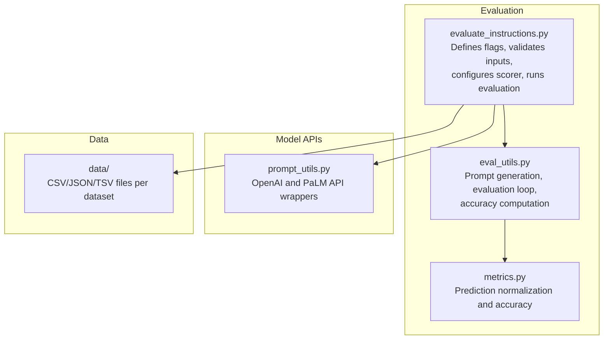
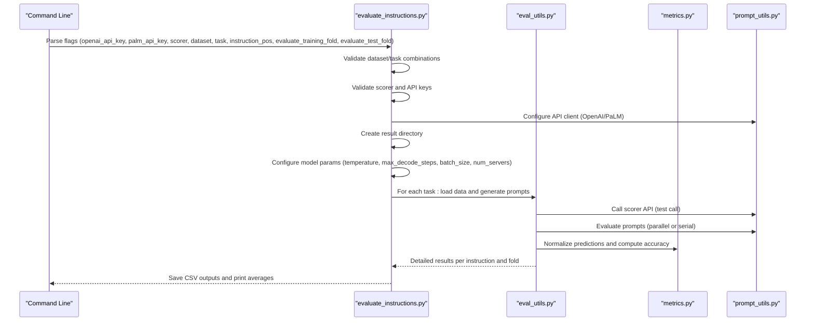
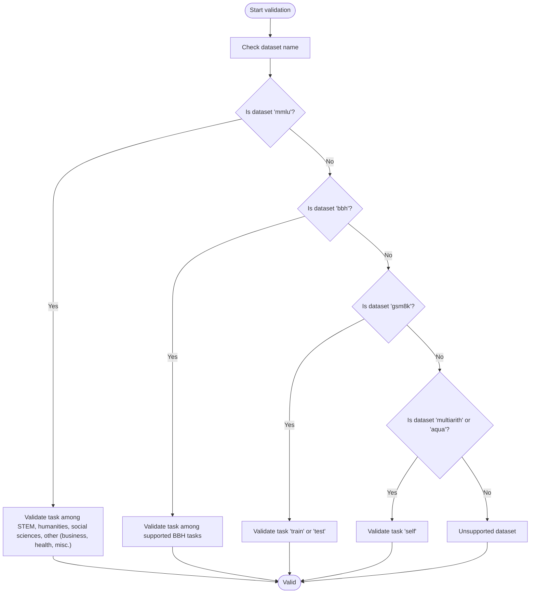
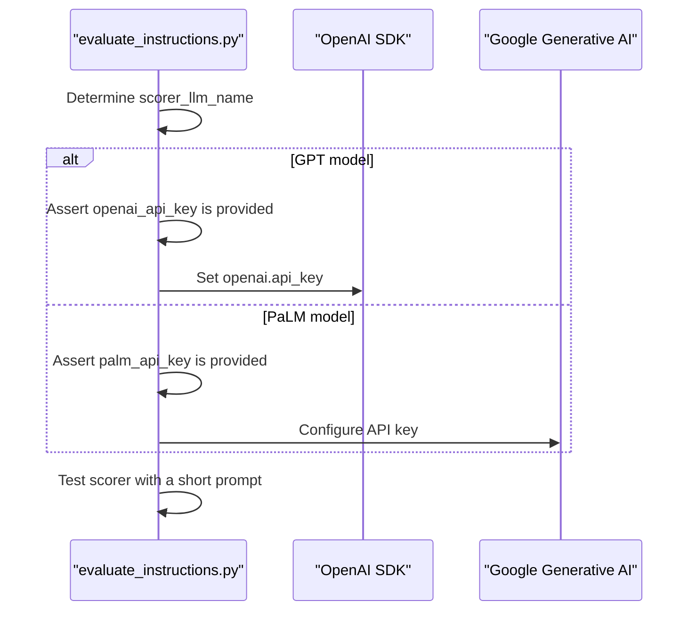
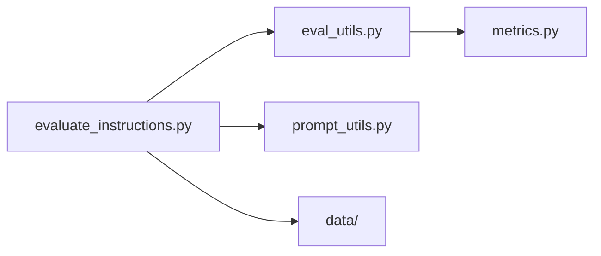

# Evaluation Configuration

<cite>
**Referenced Files in This Document**
- [evaluate_instructions.py](file://opro/evaluation/evaluate_instructions.py)
- [eval_utils.py](file://opro/evaluation/eval_utils.py)
- [prompt_utils.py](file://opro/prompt_utils.py)
- [metrics.py](file://opro/evaluation/metrics.py)
- [README.md](file://README.md)
</cite>

## Table of Contents
1. [Introduction](#introduction)
2. [Project Structure](#project-structure)
3. [Core Components](#core-components)
4. [Architecture Overview](#architecture-overview)
5. [Detailed Component Analysis](#detailed-component-analysis)
6. [Dependency Analysis](#dependency-analysis)
7. [Performance Considerations](#performance-considerations)
8. [Troubleshooting Guide](#troubleshooting-guide)
9. [Conclusion](#conclusion)

## Introduction
This document explains the evaluation configuration system used to initialize and validate parameters for running instruction evaluations. It focuses on how command-line flags are defined using absl.flags, how dataset-task combinations are validated, how model-specific parameters are configured for PaLM and GPT models, and how API keys and model availability are checked. It also provides examples of valid and invalid configurations and troubleshooting guidance for common errors.

## Project Structure
The evaluation pipeline centers around a single entry-point script that defines flags, validates inputs, configures the scorer model, and orchestrates evaluation across datasets and tasks.

**Diagram sources**
- [evaluate_instructions.py](file://opro/evaluation/evaluate_instructions.py#L63-L124)
- [eval_utils.py](file://opro/evaluation/eval_utils.py#L164-L259)
- [prompt_utils.py](file://opro/prompt_utils.py#L21-L133)
- [metrics.py](file://opro/evaluation/metrics.py#L188-L343)

**Section sources**
- [evaluate_instructions.py](file://opro/evaluation/evaluate_instructions.py#L63-L124)
- [README.md](file://README.md#L38-L45)

## Core Components
- Command-line flags defined with absl.flags:
  - API keys: openai_api_key, palm_api_key
  - Scorer model: scorer
  - Dataset and task: dataset, task
  - Instruction position: instruction_pos
  - Evaluation folds: evaluate_training_fold, evaluate_test_fold
- Validation logic:
  - Dataset names and allowed task names per dataset
  - Allowed scorer models
  - API key presence based on selected scorer
  - Instruction position values
- Model-specific configuration:
  - Temperature and max_decode_steps for PaLM and GPT
  - Batch size and server count defaults
- API availability checks:
  - Test call to the configured scorer server
- Output directory creation and per-task result storage

**Section sources**
- [evaluate_instructions.py](file://opro/evaluation/evaluate_instructions.py#L63-L204)
- [evaluate_instructions.py](file://opro/evaluation/evaluate_instructions.py#L238-L303)
- [evaluate_instructions.py](file://opro/evaluation/evaluate_instructions.py#L206-L237)

## Architecture Overview
The evaluation flow initializes flags, validates them, selects and configures the scorer, loads dataset-specific tasks, generates prompts, evaluates instructions, and writes results.

**Diagram sources**
- [evaluate_instructions.py](file://opro/evaluation/evaluate_instructions.py#L98-L204)
- [evaluate_instructions.py](file://opro/evaluation/evaluate_instructions.py#L238-L303)
- [eval_utils.py](file://opro/evaluation/eval_utils.py#L536-L800)
- [prompt_utils.py](file://opro/prompt_utils.py#L21-L133)
- [metrics.py](file://opro/evaluation/metrics.py#L188-L343)

## Detailed Component Analysis

### Flag Definitions and Initialization
- Flags defined:
  - openai_api_key: string
  - palm_api_key: string
  - scorer: string with default "text-bison"
  - dataset: string with default "gsm8k"
  - task: string with default "train"
  - instruction_pos: string with default "A_begin"
  - evaluate_training_fold: bool with default False
  - evaluate_test_fold: bool with default True
- These flags are read in main() and converted to lowercase where appropriate.

Validation and configuration logic:
- Dataset name must be one of: mmlu, bbh, gsm8k, multiarith, aqua
- Task name constraints:
  - mmlu: STEM, humanities, social sciences, other (business, health, misc.)
  - bbh: specific task names (e.g., boolean_expressions)
  - gsm8k: train or test
  - multiarith and aqua: task must be "self"
- Scorer must be one of: text-bison, gpt-3.5-turbo, gpt-4
- API key validation:
  - If scorer is a GPT model, openai_api_key must be provided
  - If scorer is text-bison, palm_api_key must be provided
- Instruction position must be one of: before_Q, Q_begin, Q_end, A_begin

Model-specific configuration:
- PaLM (text-bison):
  - temperature: 0.0
  - max_decode_steps: 1024
  - batch_size: 1
  - num_servers: 1
- GPT models (gpt-3.5-turbo, gpt-4):
  - temperature: 0.0
  - max_decode_steps: 1024
  - num_decodes: 1
  - batch_size: 1
  - num_servers: 1

API availability check:
- A test prompt is sent to the configured scorer to verify connectivity and basic functionality.

Output directory:
- Results are saved under outputs/scorer-outputs/<dataset>-<task>-s-<scorer>-<datetime>/ with per-task subfolders.

**Section sources**
- [evaluate_instructions.py](file://opro/evaluation/evaluate_instructions.py#L63-L204)
- [evaluate_instructions.py](file://opro/evaluation/evaluate_instructions.py#L238-L303)
- [evaluate_instructions.py](file://opro/evaluation/evaluate_instructions.py#L206-L237)

### Dataset-Task Validation Logic
The validation enforces dataset-task compatibility:
- mmlu: task must be one of STEM, humanities, social sciences, other (business, health, misc.)
- bbh: task must be one of the supported BBH tasks (e.g., boolean_expressions)
- gsm8k: task must be train or test
- multiarith and aqua: task must be "self"

These constraints ensure that the evaluation code only operates on supported combinations.

**Diagram sources**
- [evaluate_instructions.py](file://opro/evaluation/evaluate_instructions.py#L125-L177)

**Section sources**
- [evaluate_instructions.py](file://opro/evaluation/evaluate_instructions.py#L125-L177)

### API Key and Model Availability Validation
- API key validation:
  - For GPT models: openai_api_key must be non-empty; sets openai.api_key
  - For text-bison: palm_api_key must be non-empty; configures palm with the key
- Model availability check:
  - Sends a short test prompt to the configured scorer to verify API connectivity and basic response

**Diagram sources**
- [evaluate_instructions.py](file://opro/evaluation/evaluate_instructions.py#L184-L204)
- [evaluate_instructions.py](file://opro/evaluation/evaluate_instructions.py#L296-L303)
- [prompt_utils.py](file://opro/prompt_utils.py#L21-L133)

**Section sources**
- [evaluate_instructions.py](file://opro/evaluation/evaluate_instructions.py#L184-L204)
- [evaluate_instructions.py](file://opro/evaluation/evaluate_instructions.py#L296-L303)

### Model-Specific Parameter Configuration
- PaLM (text-bison):
  - temperature: 0.0
  - max_decode_steps: 1024
  - batch_size: 1
  - num_servers: 1
  - Uses prompt_utils.call_palm_server_from_cloud with model "text-bison-001"
- GPT models (gpt-3.5-turbo, gpt-4):
  - temperature: 0.0
  - max_decode_steps: 1024
  - num_decodes: 1
  - batch_size: 1
  - num_servers: 1
  - Uses prompt_utils.call_openai_server_func

These parameters are stored in a scorer configuration dictionary and saved alongside results.

**Section sources**
- [evaluate_instructions.py](file://opro/evaluation/evaluate_instructions.py#L238-L295)
- [prompt_utils.py](file://opro/prompt_utils.py#L21-L133)

### Instruction Position Configuration
Allowed instruction positions:
- before_Q: place instruction before the question
- Q_begin: place instruction at the beginning of the question
- Q_end: place instruction at the end of the question
- A_begin: place instruction at the beginning of the answer

The instruction position affects how prompts are constructed and influences downstream parsing expectations.

**Section sources**
- [evaluate_instructions.py](file://opro/evaluation/evaluate_instructions.py#L195-L204)
- [eval_utils.py](file://opro/evaluation/eval_utils.py#L164-L259)

### Example Configurations
- Valid configurations:
  - PaLM with MMLU STEM category
  - GPT-4 with BBH boolean_expressions
  - GPT-3.5-turbo with GSM8K test
  - PaLM with Aqua self
- Invalid configurations:
  - Using an unsupported dataset name
  - Using an unsupported task for a dataset (e.g., MMLU task not in STEM/humanities/social sciences/other)
  - Using an unsupported scorer model
  - Omitting API key for the chosen scorer
  - Using an unsupported instruction position

**Section sources**
- [evaluate_instructions.py](file://opro/evaluation/evaluate_instructions.py#L125-L204)

## Dependency Analysis
The evaluation script depends on:
- eval_utils for prompt generation, evaluation loop, and accuracy computation
- metrics for normalization and accuracy calculation
- prompt_utils for OpenAI and PaLM API calls
- Data files under data/ for each dataset

**Diagram sources**
- [evaluate_instructions.py](file://opro/evaluation/evaluate_instructions.py#L98-L204)
- [eval_utils.py](file://opro/evaluation/eval_utils.py#L536-L800)
- [metrics.py](file://opro/evaluation/metrics.py#L188-L343)
- [prompt_utils.py](file://opro/prompt_utils.py#L21-L133)

**Section sources**
- [evaluate_instructions.py](file://opro/evaluation/evaluate_instructions.py#L98-L204)
- [eval_utils.py](file://opro/evaluation/eval_utils.py#L536-L800)
- [metrics.py](file://opro/evaluation/metrics.py#L188-L343)
- [prompt_utils.py](file://opro/prompt_utils.py#L21-L133)

## Performance Considerations
- Parallel evaluation:
  - The evaluation loop can run in parallel using multiple threads when supported by the scorer configuration.
- Batch size and server count:
  - Both PaLM and GPT configurations set batch_size and num_servers to 1 by default, minimizing concurrency overhead.
- Decode steps:
  - max_decode_steps is set to 1024 for both models, balancing quality and latency.
- Retry and sleep:
  - The evaluation loop includes retry attempts and sleep intervals to handle transient API issues.

[No sources needed since this section provides general guidance]

## Troubleshooting Guide
Common configuration errors and resolutions:
- Missing API key:
  - Symptom: Assertion fails requiring an API key for the selected scorer
  - Resolution: Provide openai_api_key for GPT models or palm_api_key for text-bison
- Unsupported dataset-task combination:
  - Symptom: Assertion fails for dataset or task name
  - Resolution: Use allowed combinations (e.g., MMLU STEM, BBH boolean_expressions, GSM8K train/test, multiarith/aqua self)
- Unsupported scorer model:
  - Symptom: Assertion fails for scorer name
  - Resolution: Choose text-bison, gpt-3.5-turbo, or gpt-4
- Unsupported instruction position:
  - Symptom: Assertion fails for instruction_pos
  - Resolution: Use before_Q, Q_begin, Q_end, or A_begin
- API connectivity issues:
  - Symptom: Test call to scorer fails or returns no output
  - Resolution: Verify API credentials, network connectivity, and rate limits; check logs for retry messages

**Section sources**
- [evaluate_instructions.py](file://opro/evaluation/evaluate_instructions.py#L125-L204)
- [evaluate_instructions.py](file://opro/evaluation/evaluate_instructions.py#L296-L303)
- [eval_utils.py](file://opro/evaluation/eval_utils.py#L338-L379)

## Conclusion
The evaluation configuration system provides a robust framework for validating inputs, configuring model parameters, and ensuring API readiness. By enforcing strict dataset-task combinations and API key requirements, it minimizes runtime errors and improves reproducibility. The documented parameters and troubleshooting steps help users configure valid setups and resolve common issues efficiently.