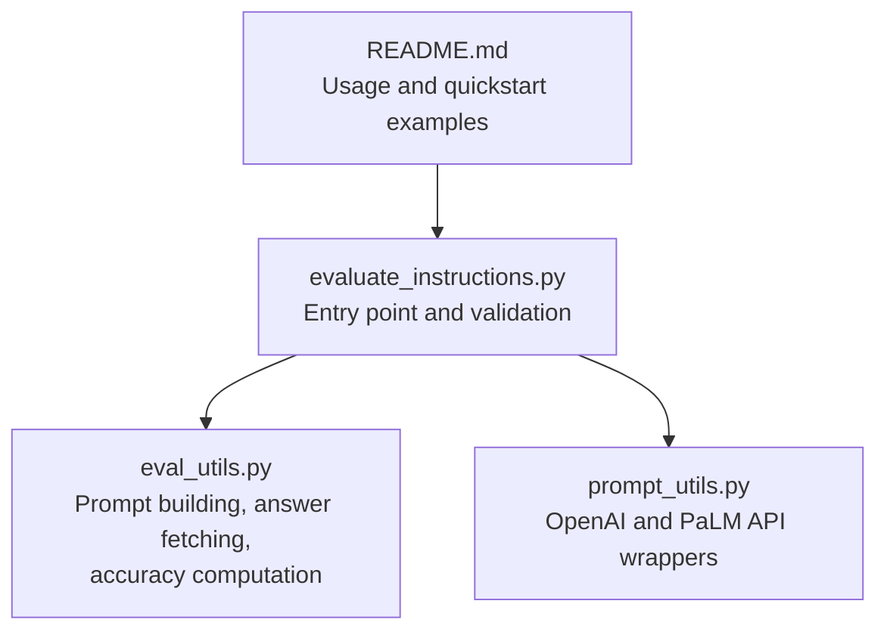
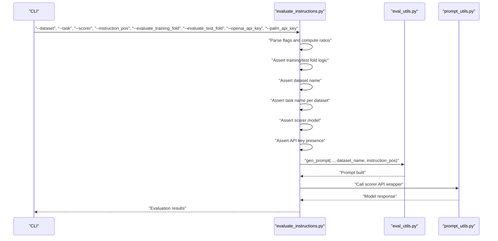
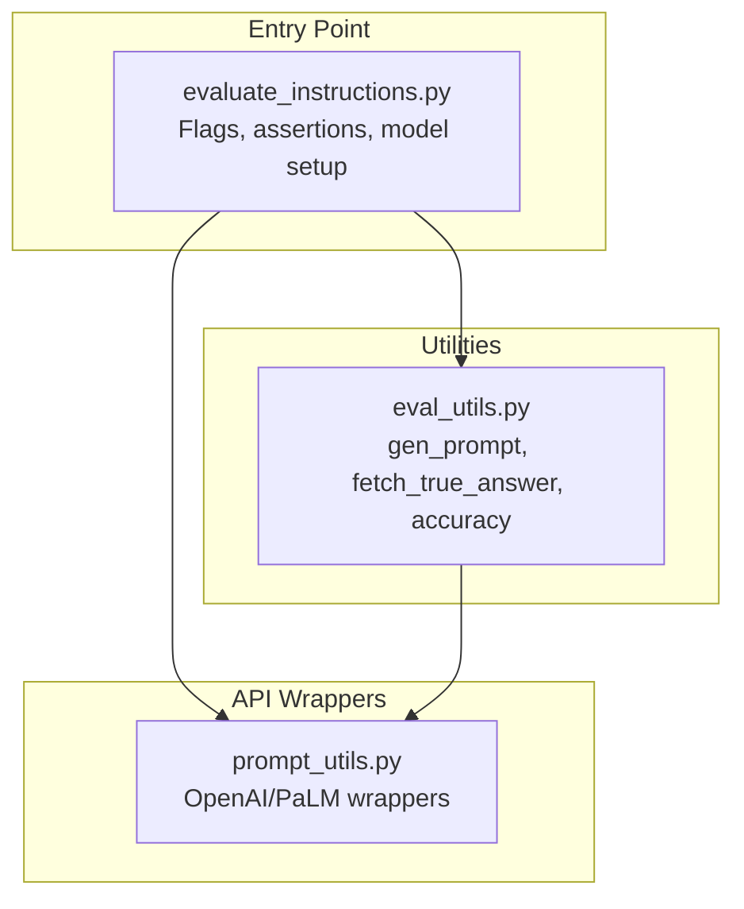

# Input Validation

<cite>
**Referenced Files in This Document**
- [evaluate_instructions.py](file://opro/evaluation/evaluate_instructions.py)
- [eval_utils.py](file://opro/evaluation/eval_utils.py)
- [prompt_utils.py](file://opro/prompt_utils.py)
- [README.md](file://README.md)
</cite>

## Table of Contents
1. [Introduction](#introduction)
2. [Project Structure](#project-structure)
3. [Core Components](#core-components)
4. [Architecture Overview](#architecture-overview)
5. [Detailed Component Analysis](#detailed-component-analysis)
6. [Dependency Analysis](#dependency-analysis)
7. [Performance Considerations](#performance-considerations)
8. [Troubleshooting Guide](#troubleshooting-guide)
9. [Conclusion](#conclusion)

## Introduction
This document explains the input validation system in the evaluation pipeline, focusing on the assertion checks and validation logic in evaluate_instructions.py. It covers:
- Dataset name validation against supported values
- Task name alignment with each dataset’s requirements
- Scorer model validation and API key presence requirements
- Instruction position constraints
- Training/test fold evaluation flags and their logical dependencies
- Example valid and invalid input combinations and the resulting error messages
- Troubleshooting guidance for common validation failures

## Project Structure
The evaluation pipeline is organized around a single entry point script that validates inputs and orchestrates scoring and evaluation. Supporting utilities provide prompt construction, answer extraction, and model API wrappers.

**Diagram sources**
- [evaluate_instructions.py](file://opro/evaluation/evaluate_instructions.py#L98-L205)
- [eval_utils.py](file://opro/evaluation/eval_utils.py#L164-L259)
- [prompt_utils.py](file://opro/prompt_utils.py#L29-L146)
- [README.md](file://README.md#L25-L45)

**Section sources**
- [evaluate_instructions.py](file://opro/evaluation/evaluate_instructions.py#L98-L205)
- [eval_utils.py](file://opro/evaluation/eval_utils.py#L164-L259)
- [prompt_utils.py](file://opro/prompt_utils.py#L29-L146)
- [README.md](file://README.md#L25-L45)

## Core Components
- Input flags and validation: The script defines flags for dataset, task, scorer model, instruction position, and training/test fold evaluation. It performs strict assertions to ensure correctness before proceeding.
- Prompt construction and answer handling: Utilities validate instruction positions and dataset names consistently with the entry point.
- Model API wrappers: The prompt utilities encapsulate OpenAI and PaLM API calls, including error handling and retries.

Key validation points:
- Dataset name must be one of: mmlu, bbh, gsm8k, multiarith, aqua
- Task name must match dataset-specific categories/tasks
- Scorer model must be one of: text-bison, gpt-3.5-turbo, gpt-4
- API key presence depends on the selected scorer model
- Instruction position must be one of: before_Q, Q_begin, Q_end, A_begin
- Training/test fold flags must satisfy logical constraints

**Section sources**
- [evaluate_instructions.py](file://opro/evaluation/evaluate_instructions.py#L110-L205)
- [eval_utils.py](file://opro/evaluation/eval_utils.py#L190-L259)
- [prompt_utils.py](file://opro/prompt_utils.py#L29-L146)

## Architecture Overview
The validation flow occurs at the start of the evaluation process. After parsing flags, the script asserts:
- At least one of training or test folds is enabled
- Test ratio bounds and consistency when both folds are used
- Dataset name membership
- Task name validity per dataset
- Scorer model selection and API key presence
- Instruction position validity

**Diagram sources**
- [evaluate_instructions.py](file://opro/evaluation/evaluate_instructions.py#L110-L205)
- [eval_utils.py](file://opro/evaluation/eval_utils.py#L164-L259)
- [prompt_utils.py](file://opro/prompt_utils.py#L29-L146)

## Detailed Component Analysis

### Dataset Name Validation
Supported datasets: mmlu, bbh, gsm8k, multiarith, aqua. The script enforces membership and raises an assertion error with a descriptive message if violated.

- Valid combinations:
  - dataset=mmlu with task in STEM, humanities, social sciences, or other (business, health, misc.)
  - dataset=bbh with task in the full list of BBH tasks
  - dataset=gsm8k with task in train, test
  - dataset=multiarith with task=self
  - dataset=aqua with task=self

- Invalid combinations:
  - Any dataset outside the supported set
  - mmlu with a task outside the allowed categories
  - bbh with a task not in the BBH task list
  - gsm8k with a task outside train/test
  - multiarith/aqua with a task not equal to self

Error behavior:
- Failing the dataset assertion triggers an assertion error with a message enumerating supported datasets.

**Section sources**
- [evaluate_instructions.py](file://opro/evaluation/evaluate_instructions.py#L125-L177)

### Task Name Alignment Per Dataset
Task constraints are dataset-specific:
- mmlu: task must be one of STEM, humanities, social sciences, or other (business, health, misc.)
- bbh: task must be one of the BBH task names
- gsm8k: task must be train or test
- multiarith: task must be self
- aqua: task must be self

Validation ensures that the chosen task aligns with the dataset’s structure and expected categories.

**Section sources**
- [evaluate_instructions.py](file://opro/evaluation/evaluate_instructions.py#L135-L177)

### Scorer Model Validation and API Key Presence
Scorer model validation:
- Allowed models: text-bison, gpt-3.5-turbo, gpt-4

API key requirements:
- If scorer is gpt-3.5-turbo or gpt-4, the OpenAI API key must be provided
- If scorer is text-bison, the PaLM API key must be provided

Failure modes:
- Missing OpenAI API key when using GPT models
- Missing PaLM API key when using text-bison
- Unsupported scorer model

Error behavior:
- Assertion errors indicate missing API keys or unsupported model names.

**Section sources**
- [evaluate_instructions.py](file://opro/evaluation/evaluate_instructions.py#L178-L194)
- [README.md](file://README.md#L54-L57)

### Instruction Position Constraints
Instruction position must be one of:
- before_Q
- Q_begin
- Q_end
- A_begin

These positions define how the instruction is placed relative to the question and answer segments in the prompt.

Validation also appears in the prompt utility module to ensure consistency.

**Section sources**
- [evaluate_instructions.py](file://opro/evaluation/evaluate_instructions.py#L195-L204)
- [eval_utils.py](file://opro/evaluation/eval_utils.py#L190-L259)

### Training/Test Fold Evaluation Flags and Logical Dependencies
Flag validation:
- At least one of evaluate_training_fold or evaluate_test_fold must be True
- If both are True, train_ratio + test_ratio must equal 1
- test_ratio must be greater than 0 and less than or equal to 1

Failure modes:
- Both flags set to False
- test_ratio <= 0 or test_ratio > 1
- train_ratio + test_ratio != 1 when both folds are evaluated

Error behavior:
- Assertion errors enforce these logical constraints.

**Section sources**
- [evaluate_instructions.py](file://opro/evaluation/evaluate_instructions.py#L110-L117)

### Prompt Construction and Instruction Position Validation
The prompt utility enforces dataset and instruction position constraints independently, ensuring consistency with the entry point validations.

- Dataset name must be one of mmlu, bbh, gsm8k, multiarith, aqua
- Instruction position must be one of before_Q, Q_begin, Q_end, A_begin
- Additional internal checks ensure include_qa and instruction_pos combinations are valid

These validations complement the entry point checks and prevent malformed prompts from being constructed.

**Section sources**
- [eval_utils.py](file://opro/evaluation/eval_utils.py#L190-L259)

## Dependency Analysis
The validation logic spans the entry point and utilities. The entry point sets up model configurations and API keys, while the utilities construct prompts and compute accuracy. The prompt utility also validates instruction positions and dataset names.

**Diagram sources**
- [evaluate_instructions.py](file://opro/evaluation/evaluate_instructions.py#L238-L303)
- [eval_utils.py](file://opro/evaluation/eval_utils.py#L164-L259)
- [prompt_utils.py](file://opro/prompt_utils.py#L29-L146)

**Section sources**
- [evaluate_instructions.py](file://opro/evaluation/evaluate_instructions.py#L238-L303)
- [eval_utils.py](file://opro/evaluation/eval_utils.py#L164-L259)
- [prompt_utils.py](file://opro/prompt_utils.py#L29-L146)

## Performance Considerations
- Assertions occur early to fail fast and avoid expensive model calls when inputs are invalid.
- The prompt utility includes robust retry logic for API calls, which indirectly affects runtime when validations pass.

[No sources needed since this section provides general guidance]

## Troubleshooting Guide

Common validation failures and resolutions:
- Unsupported dataset name
  - Symptom: Assertion error indicating dataset must be one of mmlu, bbh, gsm8k, multiarith, aqua
  - Resolution: Use one of the supported datasets
  - Section sources
    - [evaluate_instructions.py](file://opro/evaluation/evaluate_instructions.py#L125-L134)

- Invalid task name for a dataset
  - Symptom: Assertion error for task name not in allowed set
  - Resolution:
    - For mmlu: choose one of STEM, humanities, social sciences, or other (business, health, misc.)
    - For bbh: choose one of the BBH task names
    - For gsm8k: choose train or test
    - For multiarith/aqua: use self
  - Section sources
    - [evaluate_instructions.py](file://opro/evaluation/evaluate_instructions.py#L135-L177)

- Unsupported scorer model
  - Symptom: Assertion error for scorer model not in text-bison, gpt-3.5-turbo, gpt-4
  - Resolution: Select one of the supported models
  - Section sources
    - [evaluate_instructions.py](file://opro/evaluation/evaluate_instructions.py#L178-L182)
    - [README.md](file://README.md#L54-L57)

- Missing API key for selected scorer
  - Symptom: Assertion error stating OpenAI API key is required or PaLM API key is required
  - Resolution:
    - For gpt-3.5-turbo or gpt-4: provide --openai_api_key
    - For text-bison: provide --palm_api_key
  - Section sources
    - [evaluate_instructions.py](file://opro/evaluation/evaluate_instructions.py#L184-L194)

- Invalid instruction position
  - Symptom: Assertion error for instruction position not in before_Q, Q_begin, Q_end, A_begin
  - Resolution: Choose one of the allowed positions
  - Section sources
    - [evaluate_instructions.py](file://opro/evaluation/evaluate_instructions.py#L195-L204)
    - [eval_utils.py](file://opro/evaluation/eval_utils.py#L190-L259)

- Training/test fold logical inconsistencies
  - Symptom: Assertion errors for both folds disabled, invalid test ratio, or inconsistent train/test ratio sums
  - Resolution:
    - Enable at least one of evaluate_training_fold or evaluate_test_fold
    - Ensure test_ratio > 0 and test_ratio <= 1
    - If both folds are enabled, ensure train_ratio + test_ratio == 1
  - Section sources
    - [evaluate_instructions.py](file://opro/evaluation/evaluate_instructions.py#L110-L117)

## Conclusion
The input validation system in evaluate_instructions.py enforces strict constraints on dataset/task combinations, scorer model selection, API key presence, instruction position, and training/test fold logic. These checks ensure that downstream prompt construction and model calls operate on valid inputs, preventing runtime errors and wasted API usage. By following the guidance above, users can quickly diagnose and resolve validation failures.