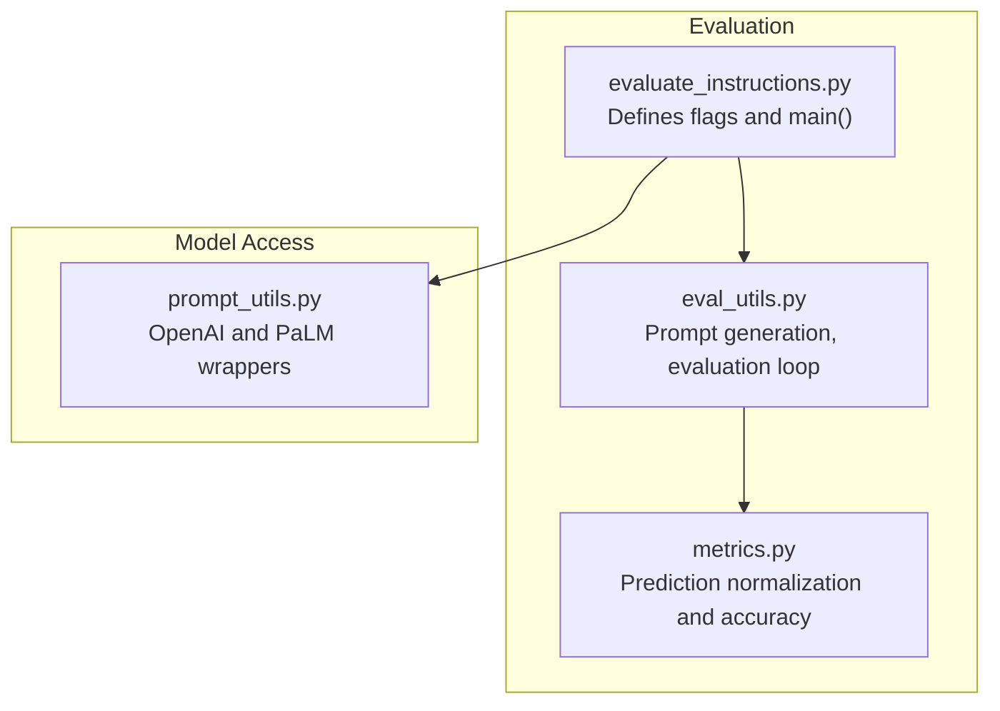
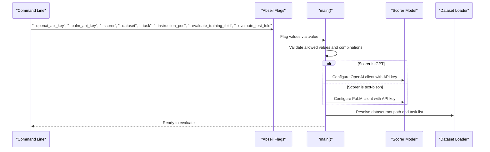
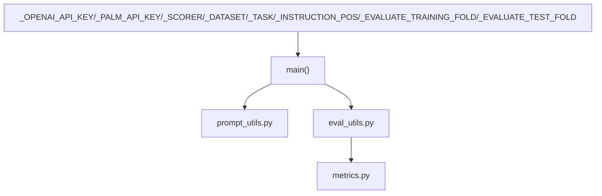

# Parameter Initialization

<cite>
**Referenced Files in This Document**
- [evaluate_instructions.py](file://opro/evaluation/evaluate_instructions.py)
- [eval_utils.py](file://opro/evaluation/eval_utils.py)
- [metrics.py](file://opro/evaluation/metrics.py)
- [prompt_utils.py](file://opro/prompt_utils.py)
</cite>

## Table of Contents
1. [Introduction](#introduction)
2. [Project Structure](#project-structure)
3. [Core Components](#core-components)
4. [Architecture Overview](#architecture-overview)
5. [Detailed Component Analysis](#detailed-component-analysis)
6. [Dependency Analysis](#dependency-analysis)
7. [Performance Considerations](#performance-considerations)
8. [Troubleshooting Guide](#troubleshooting-guide)
9. [Conclusion](#conclusion)

## Introduction
This document explains the parameter initialization process for the evaluation script focused on absl.flags definitions. It details how each command-line flag is defined, its purpose in the evaluation workflow, default values, data types, and required inputs. It also shows how these flags are accessed and used within the main function, and how they configure the evaluation environment. Finally, it covers common issues such as missing default values and type mismatches.

## Project Structure
The evaluation pipeline centers around a single script that defines and consumes flags, orchestrates model scoring, loads datasets, and writes results. Supporting utilities handle prompting, dataset-specific formatting, and accuracy computation.

**Diagram sources**
- [evaluate_instructions.py](file://opro/evaluation/evaluate_instructions.py#L63-L96)
- [eval_utils.py](file://opro/evaluation/eval_utils.py#L164-L259)
- [metrics.py](file://opro/evaluation/metrics.py#L188-L343)
- [prompt_utils.py](file://opro/prompt_utils.py#L29-L146)

**Section sources**
- [evaluate_instructions.py](file://opro/evaluation/evaluate_instructions.py#L63-L96)

## Core Components
This section documents each absl.flag definition, including its type, default value, and intended use in the evaluation workflow.

- _OPENAI_API_KEY
  - Type: string
  - Default: empty string
  - Purpose: Provides the API key for OpenAI models when the scorer is a GPT family model.
  - Required when: Scorer is a GPT model.
  - Usage: Retrieved via _OPENAI_API_KEY.value and assigned to the OpenAI client library.

- _PALM_API_KEY
  - Type: string
  - Default: empty string
  - Purpose: Provides the API key for Google PaLM models when the scorer is text-bison.
  - Required when: Scorer is text-bison.
  - Usage: Retrieved via _PALM_API_KEY.value and passed to the PaLM configuration.

- _SCORER
  - Type: string
  - Default: "text-bison"
  - Purpose: Selects the LLM used to score instructions.
  - Allowed values: "text-bison", "gpt-3.5-turbo", "gpt-4".
  - Usage: Lowercased and validated; determines which model wrapper is used.

- _DATASET
  - Type: string
  - Default: "gsm8k"
  - Purpose: Identifies the dataset family to evaluate on.
  - Allowed values: "mmlu", "bbh", "gsm8k", "multiarith", "aqua".
  - Usage: Lowercased and validated; controls dataset loading and task selection.

- _TASK
  - Type: string
  - Default: "train"
  - Purpose: Specifies the task or subset within the chosen dataset.
  - Allowed values depend on dataset:
    - mmlu: one of STEM, humanities, social sciences, other (business, health, misc.)
    - bbh: one of the BBH task names
    - gsm8k: "train" or "test"
    - multiarith/aqua: "self"
  - Usage: Lowercased and validated; influences data loading and task enumeration.

- _INSTRUCTION_POS
  - Type: string
  - Default: "A_begin"
  - Purpose: Controls where the instruction is placed in the prompt template.
  - Allowed values: "before_Q", "Q_begin", "Q_end", "A_begin".
  - Usage: Used by prompt generation to construct the final prompt.

- _EVALUATE_TRAINING_FOLD
  - Type: bool
  - Default: False
  - Purpose: Enables evaluation on the training fold.
  - Usage: Asserted to be combined with test fold evaluation in a way that respects split ratios.

- _EVALUATE_TEST_FOLD
  - Type: bool
  - Default: True
  - Purpose: Enables evaluation on the test fold.
  - Usage: Asserted to be combined with training fold evaluation in a way that respects split ratios.

Access and usage in main():
- Values are read via .value on each flag.
- Assertions enforce allowed values and combinations.
- The selected scorer determines which API key is required and how the model is configured.

**Section sources**
- [evaluate_instructions.py](file://opro/evaluation/evaluate_instructions.py#L63-L96)
- [evaluate_instructions.py](file://opro/evaluation/evaluate_instructions.py#L107-L124)
- [evaluate_instructions.py](file://opro/evaluation/evaluate_instructions.py#L125-L204)

## Architecture Overview
The initialization phase sets up the evaluation environment by reading flags, validating inputs, configuring the scorer model, and preparing data paths. The following sequence diagram maps the key steps from flag access to model configuration and data loading.

**Diagram sources**
- [evaluate_instructions.py](file://opro/evaluation/evaluate_instructions.py#L107-L124)
- [evaluate_instructions.py](file://opro/evaluation/evaluate_instructions.py#L184-L194)
- [evaluate_instructions.py](file://opro/evaluation/evaluate_instructions.py#L208-L221)

## Detailed Component Analysis

### Flag Definitions and Validation
- Flag definitions and defaults are declared near the top of the script.
- The main function reads flag values and performs:
  - Value normalization (e.g., lowercasing dataset and scorer names)
  - Allowed-value checks for dataset, task, scorer, and instruction position
  - Required-key assertions based on the selected scorer
  - Split-ratio assertions for training and test folds

Key validation points:
- Dataset name must be one of the supported families.
- Task name must match the dataset’s allowed values.
- Scorer must be one of the supported models.
- Instruction position must be one of the supported positions.
- At least one of training or test fold must be enabled.

These validations ensure the evaluation proceeds with consistent and supported configurations.

**Section sources**
- [evaluate_instructions.py](file://opro/evaluation/evaluate_instructions.py#L63-L96)
- [evaluate_instructions.py](file://opro/evaluation/evaluate_instructions.py#L125-L204)

### Scorer Selection and API Key Handling
- If the scorer is a GPT model, the OpenAI API key is required and the OpenAI client is configured.
- If the scorer is text-bison, the PaLM API key is required and the PaLM client is configured.
- The script selects appropriate model-specific parameters and wraps the model calls via helper functions.

This separation ensures that only the necessary credentials are required for the chosen model.

**Section sources**
- [evaluate_instructions.py](file://opro/evaluation/evaluate_instructions.py#L184-L194)
- [prompt_utils.py](file://opro/prompt_utils.py#L29-L146)

### Prompt Construction and Evaluation Loop
- The instruction position flag drives prompt construction, which affects how the instruction is embedded relative to the question and answer segments.
- The evaluation loop iterates over tasks and examples, constructs prompts, calls the scorer, parses answers, and computes accuracy using normalization utilities.

This demonstrates how the flags influence prompt templates and downstream evaluation behavior.

**Section sources**
- [eval_utils.py](file://opro/evaluation/eval_utils.py#L164-L259)
- [metrics.py](file://opro/evaluation/metrics.py#L188-L343)

### Example Usage in Initialization Phase
- The script reads all flags, validates them, and prepares:
  - API keys for the selected scorer
  - Dataset root path based on the dataset name
  - Task list and evaluation mode (training/test folds)
  - Scorer-specific configuration and model wrapper

These steps occur before any data loading or model calls, ensuring a robust and predictable evaluation environment.

**Section sources**
- [evaluate_instructions.py](file://opro/evaluation/evaluate_instructions.py#L107-L124)
- [evaluate_instructions.py](file://opro/evaluation/evaluate_instructions.py#L208-L221)

## Dependency Analysis
The following diagram shows how the flags and main function interact with supporting modules during initialization and evaluation.

**Diagram sources**
- [evaluate_instructions.py](file://opro/evaluation/evaluate_instructions.py#L63-L96)
- [evaluate_instructions.py](file://opro/evaluation/evaluate_instructions.py#L107-L124)
- [prompt_utils.py](file://opro/prompt_utils.py#L29-L146)
- [eval_utils.py](file://opro/evaluation/eval_utils.py#L164-L259)
- [metrics.py](file://opro/evaluation/metrics.py#L188-L343)

**Section sources**
- [evaluate_instructions.py](file://opro/evaluation/evaluate_instructions.py#L63-L96)
- [evaluate_instructions.py](file://opro/evaluation/evaluate_instructions.py#L107-L124)

## Performance Considerations
- Model configuration differences between GPT and text-bison affect throughput and cost. Choose the appropriate model and adjust decoding parameters accordingly.
- Parallel evaluation is disabled for GPT models in the evaluation loop, which reduces concurrency but avoids rate-limiting issues.
- Retry mechanisms in the prompt utilities help mitigate transient network or service errors.

[No sources needed since this section provides general guidance]

## Troubleshooting Guide
Common issues and resolutions:

- Missing API key for selected scorer
  - Symptom: Assertion failure requiring an API key for the chosen scorer.
  - Resolution: Provide the appropriate key via the corresponding flag.
  - Evidence: Assertions that require an OpenAI key for GPT models and a PaLM key for text-bison.

- Invalid dataset or task name
  - Symptom: Assertion failure for unsupported dataset or task.
  - Resolution: Use one of the allowed dataset/task combinations.
  - Evidence: Allowed-value checks for dataset and task.

- Unsupported scorer model
  - Symptom: Assertion failure for scorer name.
  - Resolution: Use one of the supported models.
  - Evidence: Allowed-value checks for scorer.

- Invalid instruction position
  - Symptom: Assertion failure for instruction placement.
  - Resolution: Use one of the allowed positions.
  - Evidence: Allowed-value checks for instruction position.

- Incorrect split ratio or fold combination
  - Symptom: Assertion failure for split ratios or fold flags.
  - Resolution: Ensure at least one fold is enabled and that ratios are valid.
  - Evidence: Assertions for training/test ratios and fold flags.

- Type mismatch in flag usage
  - Symptom: Unexpected behavior when comparing flag values.
  - Resolution: Ensure flags are read via .value and normalized (e.g., lowercasing) before comparisons.
  - Evidence: Lowercasing of dataset and scorer names in main.

**Section sources**
- [evaluate_instructions.py](file://opro/evaluation/evaluate_instructions.py#L125-L204)
- [evaluate_instructions.py](file://opro/evaluation/evaluate_instructions.py#L107-L124)

## Conclusion
The parameter initialization process in the evaluation script is centered on absl.flags that define the scorer model, dataset, task, instruction placement, and evaluation folds. The main function reads and validates these flags, configures the appropriate API client, resolves dataset paths, and prepares the evaluation loop. By adhering to the allowed values and required conditions, users can reliably initialize the evaluation environment and produce accurate results.