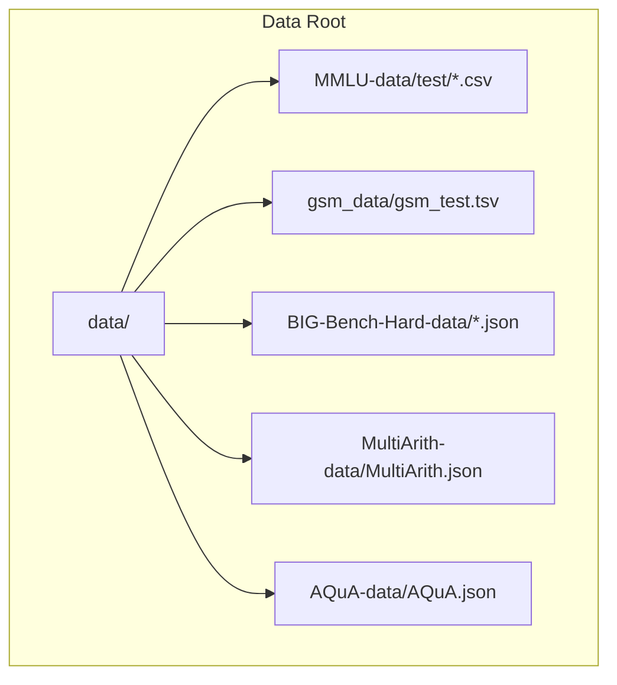
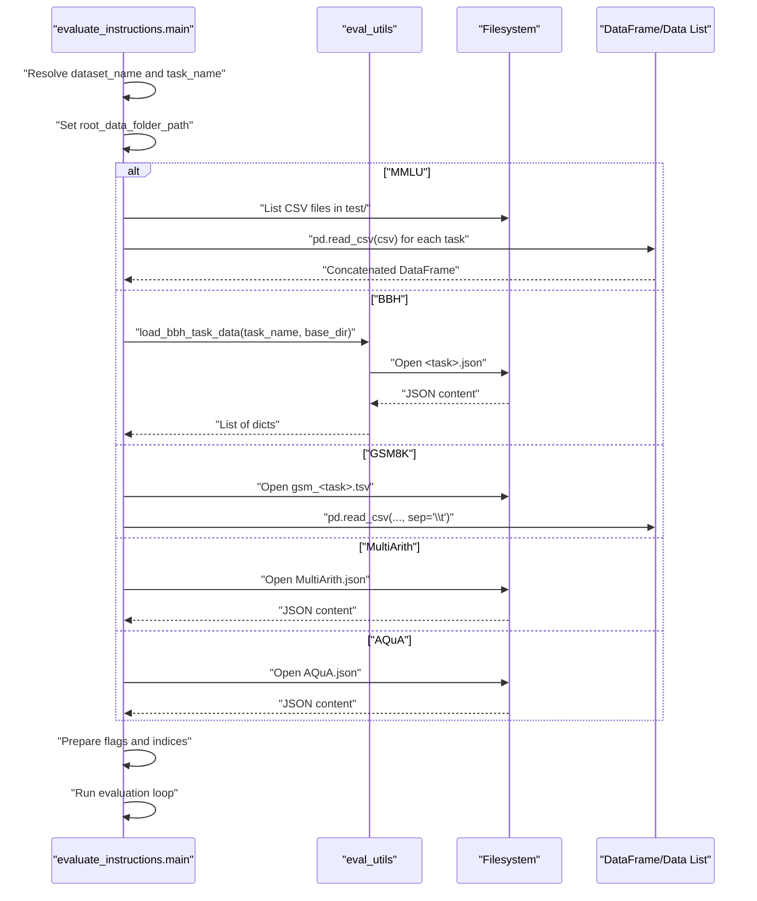
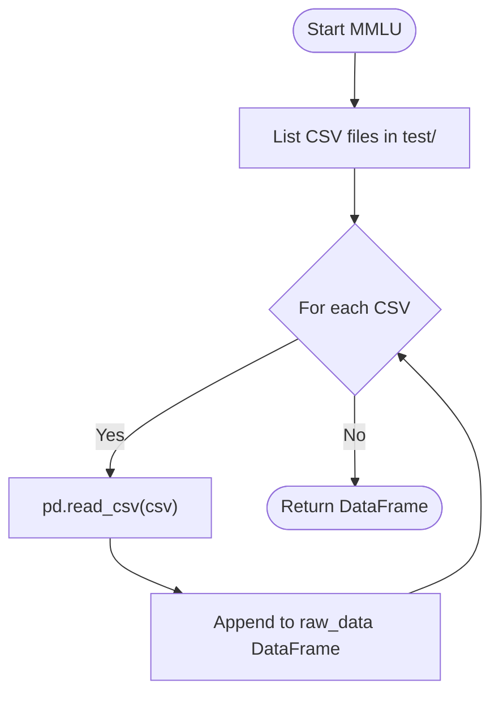
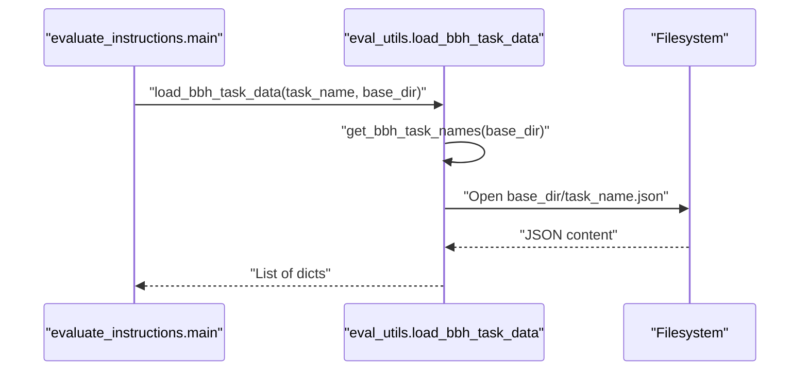
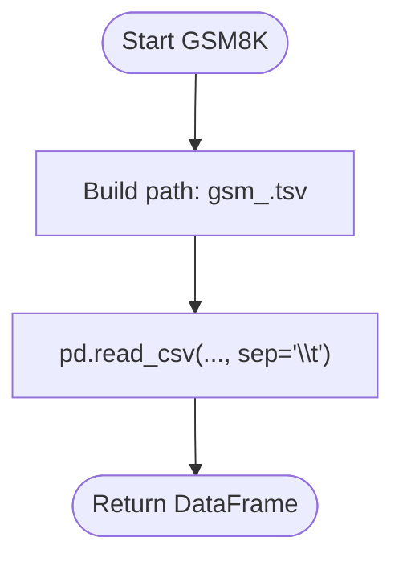
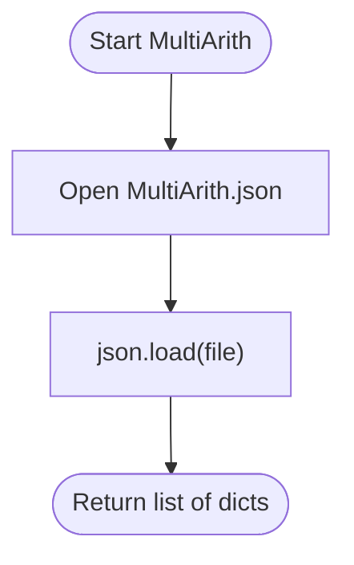
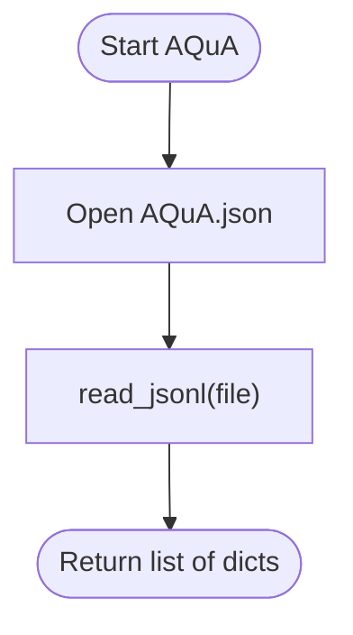
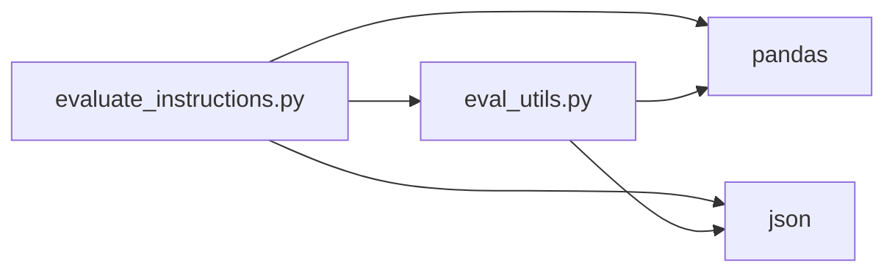

# Data Loading

<cite>
**Referenced Files in This Document**
- [evaluate_instructions.py](file://opro/evaluation/evaluate_instructions.py)
- [eval_utils.py](file://opro/evaluation/eval_utils.py)
- [README.md](file://data/README.md)
- [AQuA.json](file://data/AQuA-data/AQuA.json)
- [MultiArith.json](file://data/MultiArith-data/MultiArith.json)
- [gsm_test.tsv](file://data/gsm_data/gsm_test.tsv)
- [abstract_algebra_test.csv](file://data/MMLU-data/test/abstract_algebra_test.csv)
</cite>

## Table of Contents
1. [Introduction](#introduction)
2. [Project Structure](#project-structure)
3. [Core Components](#core-components)
4. [Architecture Overview](#architecture-overview)
5. [Detailed Component Analysis](#detailed-component-analysis)
6. [Dependency Analysis](#dependency-analysis)
7. [Performance Considerations](#performance-considerations)
8. [Troubleshooting Guide](#troubleshooting-guide)
9. [Conclusion](#conclusion)

## Introduction
This document explains how the data loading pipeline in evaluate_instructions.py selects and reads datasets across multiple formats. It focuses on:
- Determining the root data path based on dataset type (MMLU, BBH, GSM8K, MultiArith, AQuA)
- Loading data using appropriate methods:
  - pandas.read_csv for MMLU’s CSV files
  - pandas.read_csv with TSV delimiter for GSM8K
  - json.load for MultiArith and AQuA JSON files
  - eval_utils.load_bbh_task_data for BBH datasets
- Differences in raw data structure across datasets (DataFrame for MMLU/GSM8K, list for BBH, dict for MultiArith)
- Example workflows for each dataset type
- Error handling for missing files or incorrect formats

## Project Structure
The data directory organizes datasets by type:
- MMLU: CSV files under data/MMLU-data/test/
- GSM8K: TSV file under data/gsm_data/gsm_test.tsv
- BBH: JSON files under data/BIG-Bench-Hard-data/<task>.json
- MultiArith: JSON file under data/MultiArith-data/MultiArith.json
- AQuA: JSON file under data/AQuA-data/AQuA.json

**Diagram sources**
- [README.md](file://data/README.md#L1-L31)
- [evaluate_instructions.py](file://opro/evaluation/evaluate_instructions.py#L208-L221)

**Section sources**
- [README.md](file://data/README.md#L1-L31)
- [evaluate_instructions.py](file://opro/evaluation/evaluate_instructions.py#L208-L221)

## Core Components
- Dataset routing and root path resolution
  - The script maps dataset names to root folders and validates task names.
- Data loading per dataset
  - MMLU: reads CSV files per task and concatenates into a DataFrame
  - BBH: loads a single task via eval_utils.load_bbh_task_data returning a list of dicts
  - GSM8K: reads TSV with tab delimiter
  - MultiArith: loads a single JSON file containing a list of dicts
  - AQuA: loads a single JSON file containing a list of dicts
- Subsequent processing depends on raw data structure:
  - MMLU/GSM8K: DataFrame indexing and column-based access
  - BBH: list of dicts with keys “input” and “target”
  - MultiArith: list of dicts with keys including “sQuestion”, “lSolutions”

**Section sources**
- [evaluate_instructions.py](file://opro/evaluation/evaluate_instructions.py#L208-L221)
- [evaluate_instructions.py](file://opro/evaluation/evaluate_instructions.py#L555-L629)
- [eval_utils.py](file://opro/evaluation/eval_utils.py#L877-L917)

## Architecture Overview
The data loading flow is centralized in evaluate_instructions.py. It:
- Resolves dataset-specific root path
- Loads the dataset into memory using dataset-appropriate IO
- Prepares metadata (task lists, multiple-choice/boolean/numerical flags)
- Passes raw data to evaluation routines

**Diagram sources**
- [evaluate_instructions.py](file://opro/evaluation/evaluate_instructions.py#L208-L221)
- [evaluate_instructions.py](file://opro/evaluation/evaluate_instructions.py#L555-L629)
- [eval_utils.py](file://opro/evaluation/eval_utils.py#L877-L917)

## Detailed Component Analysis

### MMLU Data Loading
- Root path: data/MMLU-data/test/
- Method: pandas.read_csv for each CSV file in the test folder
- Data structure: DataFrame with columns representing question, choices, and answer
- Processing: Concatenates multiple CSVs into a single DataFrame

**Diagram sources**
- [evaluate_instructions.py](file://opro/evaluation/evaluate_instructions.py#L555-L570)
- [abstract_algebra_test.csv](file://data/MMLU-data/test/abstract_algebra_test.csv)

**Section sources**
- [evaluate_instructions.py](file://opro/evaluation/evaluate_instructions.py#L208-L221)
- [evaluate_instructions.py](file://opro/evaluation/evaluate_instructions.py#L555-L570)

### BBH Data Loading
- Root path: data/BIG-Bench-Hard-data/
- Method: eval_utils.load_bbh_task_data(task_name, base_dir)
- Data structure: list of dicts with keys “input” and “target”
- Validation: Task name checked against discovered JSON files

**Diagram sources**
- [evaluate_instructions.py](file://opro/evaluation/evaluate_instructions.py#L570-L582)
- [eval_utils.py](file://opro/evaluation/eval_utils.py#L877-L917)

**Section sources**
- [evaluate_instructions.py](file://opro/evaluation/evaluate_instructions.py#L570-L582)
- [eval_utils.py](file://opro/evaluation/eval_utils.py#L877-L917)

### GSM8K Data Loading
- Root path: data/gsm_data/
- Method: pandas.read_csv with sep='\t'
- Data structure: DataFrame (TSV rows)
- Processing: Uses first two columns for question and answer

**Diagram sources**
- [evaluate_instructions.py](file://opro/evaluation/evaluate_instructions.py#L583-L592)
- [gsm_test.tsv](file://data/gsm_data/gsm_test.tsv)

**Section sources**
- [evaluate_instructions.py](file://opro/evaluation/evaluate_instructions.py#L583-L592)

### MultiArith Data Loading
- Root path: data/MultiArith-data/
- Method: json.load on MultiArith.json
- Data structure: list of dicts
- Processing: Uses first solution as numeric answer

**Diagram sources**
- [evaluate_instructions.py](file://opro/evaluation/evaluate_instructions.py#L619-L628)
- [MultiArith.json](file://data/MultiArith-data/MultiArith.json)

**Section sources**
- [evaluate_instructions.py](file://opro/evaluation/evaluate_instructions.py#L619-L628)

### AQuA Data Loading
- Root path: data/AQuA-data/
- Method: eval_utils.read_jsonl on AQuA.json
- Data structure: list of dicts
- Processing: Treats each line as a separate example

**Diagram sources**
- [evaluate_instructions.py](file://opro/evaluation/evaluate_instructions.py#L609-L618)
- [eval_utils.py](file://opro/evaluation/eval_utils.py#L47-L51)
- [AQuA.json](file://data/AQuA-data/AQuA.json)

**Section sources**
- [evaluate_instructions.py](file://opro/evaluation/evaluate_instructions.py#L609-L618)
- [eval_utils.py](file://opro/evaluation/eval_utils.py#L47-L51)

## Dependency Analysis
- evaluate_instructions.py depends on:
  - pandas for CSV/TSV reading
  - json for JSON file reading
  - eval_utils for BBH loading and AQuA JSONL reader
- eval_utils.py provides:
  - load_bbh_task_data(task_name, base_dir)
  - read_jsonl(filepath) for AQuA
  - Helper functions for prompt construction and answer extraction

**Diagram sources**
- [evaluate_instructions.py](file://opro/evaluation/evaluate_instructions.py#L58-L60)
- [eval_utils.py](file://opro/evaluation/eval_utils.py#L1-L34)

**Section sources**
- [evaluate_instructions.py](file://opro/evaluation/evaluate_instructions.py#L58-L60)
- [eval_utils.py](file://opro/evaluation/eval_utils.py#L1-L34)

## Performance Considerations
- CSV/TSV reading is efficient for tabular data; ensure correct separator is used (comma vs tab)
- BBH and JSON datasets are small enough that memory usage is not a concern
- Concatenation of MMLU CSVs is straightforward; consider chunking if datasets grow large
- Using DataFrame indexing (iloc) and list iteration is linear in example count

[No sources needed since this section provides general guidance]

## Troubleshooting Guide
Common issues and remedies:
- Missing dataset root folder
  - Symptom: Path resolution fails or directory listing errors
  - Fix: Verify dataset name and confirm data/ layout matches expected structure
- Incorrect task name for BBH
  - Symptom: ValueError raised by load_bbh_task_data
  - Fix: Use a task name from the discovered list of BBH tasks
- Wrong delimiter for GSM8K
  - Symptom: Parsing errors or unexpected column counts
  - Fix: Ensure sep='\t' is used when reading TSV
- Missing AQuA/MultiArith files
  - Symptom: FileNotFoundError
  - Fix: Confirm file paths and names; AQuA is AQuA.json, MultiArith is MultiArith.json
- MMLU CSV format mismatch
  - Symptom: Column count or header issues
  - Fix: Ensure CSVs are unheadered and contain question, choices, and answer columns

**Section sources**
- [evaluate_instructions.py](file://opro/evaluation/evaluate_instructions.py#L208-L221)
- [eval_utils.py](file://opro/evaluation/eval_utils.py#L877-L917)

## Conclusion
The data loading pipeline in evaluate_instructions.py cleanly routes to dataset-specific loaders, normalizing raw data into structures suitable for downstream evaluation. MMLU and GSM8K produce DataFrames, BBH yields a list of dicts, and MultiArith and AQuA yield lists of dicts. Correct path resolution, appropriate IO methods, and careful handling of task names and delimiters ensure robust operation across formats.