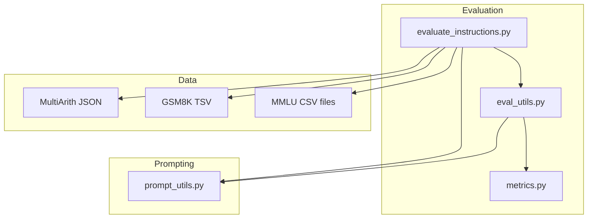
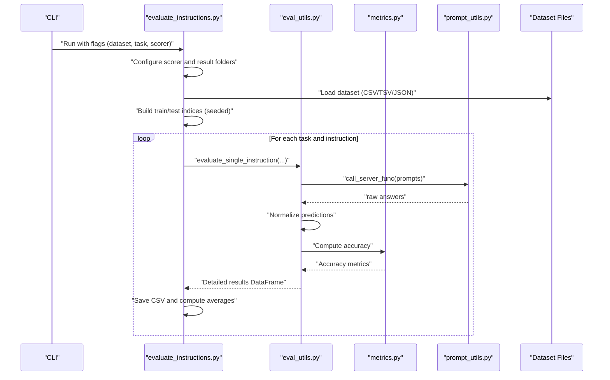
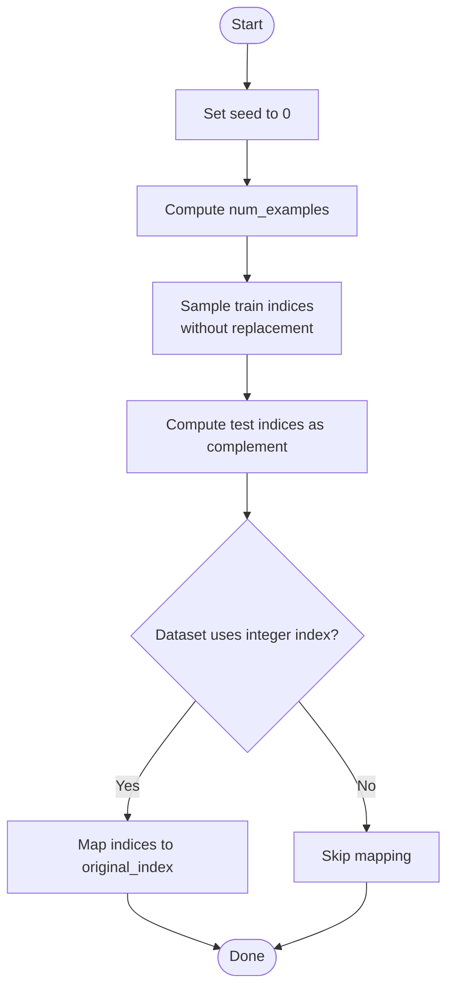
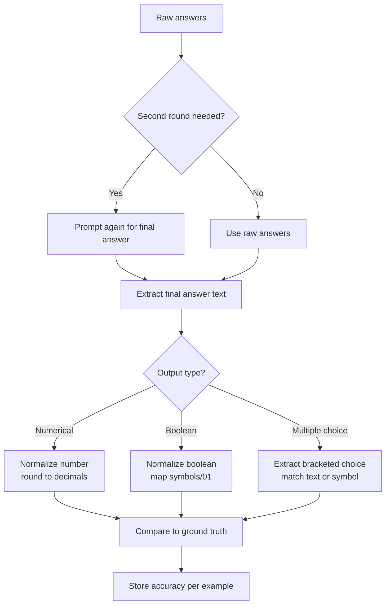
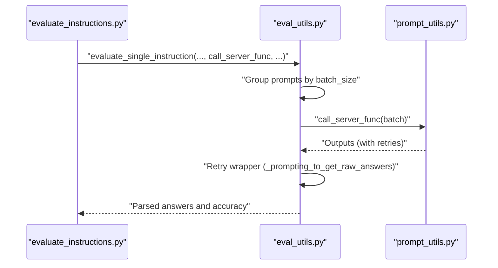
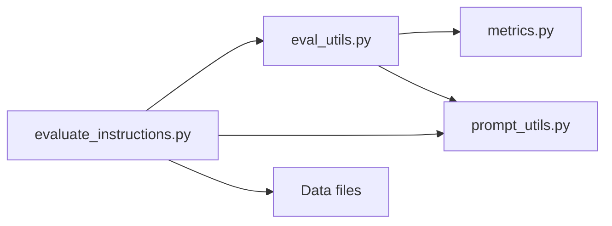

# Evaluation Execution

<cite>
**Referenced Files in This Document**
- [evaluate_instructions.py](file://opro/evaluation/evaluate_instructions.py)
- [eval_utils.py](file://opro/evaluation/eval_utils.py)
- [metrics.py](file://opro/evaluation/metrics.py)
- [prompt_utils.py](file://opro/prompt_utils.py)
- [README.md](file://data/README.md)
- [gsm_test.tsv](file://data/gsm_data/gsm_test.tsv)
- [MultiArith.json](file://data/MultiArith-data/MultiArith.json)
</cite>

## Table of Contents
1. [Introduction](#introduction)
2. [Project Structure](#project-structure)
3. [Core Components](#core-components)
4. [Architecture Overview](#architecture-overview)
5. [Detailed Component Analysis](#detailed-component-analysis)
6. [Dependency Analysis](#dependency-analysis)
7. [Performance Considerations](#performance-considerations)
8. [Troubleshooting Guide](#troubleshooting-guide)
9. [Conclusion](#conclusion)

## Introduction
This document explains the evaluation execution process centered on the core evaluation loop in evaluate_instructions.py. It covers how datasets are loaded across different formats (CSV for MMLU, TSV for GSM8K, JSON for MultiArith), how train-test splits are constructed deterministically, how the evaluation iterates over instructions and tasks, how different output types (multiple choice, boolean, numerical) are handled, and how accuracy is computed. It also documents batch processing and retry logic via the call_server_func parameter.

## Project Structure
The evaluation pipeline resides under opro/evaluation and consumes datasets from data/. The key files are:
- evaluate_instructions.py: orchestrates dataset loading, train-test split, iteration over instructions/tasks, and saving results.
- eval_utils.py: generates prompts, fetches ground-truth answers, parses predictions, computes accuracy, and manages batched inference and retries.
- metrics.py: normalization and accuracy computation helpers for numerical, boolean, and multiple-choice outputs.
- prompt_utils.py: low-level server calls for OpenAI and Google PaLM.
- data/README.md: dataset overview.
- data/gsm_data/gsm_test.tsv and data/MultiArith-data/MultiArith.json: example dataset files used by the evaluation.

**Diagram sources**
- [evaluate_instructions.py](file://opro/evaluation/evaluate_instructions.py#L1-L120)
- [eval_utils.py](file://opro/evaluation/eval_utils.py#L1-L120)
- [metrics.py](file://opro/evaluation/metrics.py#L1-L120)
- [prompt_utils.py](file://opro/prompt_utils.py#L1-L60)
- [README.md](file://data/README.md#L1-L31)

**Section sources**
- [README.md](file://data/README.md#L1-L31)

## Core Components
- Dataset loaders and task lists:
  - MMLU: CSV files in data/MMLU-data/test/, one task per file; tasks filtered by category.
  - GSM8K: TSV file in data/gsm_data/gsm_test.tsv.
  - MultiArith: JSON file in data/MultiArith-data/MultiArith.json.
- Train-test split:
  - Deterministic split using numpy.random with a fixed seed for reproducibility.
- Instruction/task iteration:
  - Loop over tasks and instructions, invoking eval_utils.evaluate_single_instruction with appropriate parameters.
- Output type handling:
  - Multiple choice, boolean, and numerical outputs are supported via flags and dataset-specific logic.
- Accuracy computation:
  - Normalization and accuracy calculation via metrics and eval_utils helpers.

**Section sources**
- [evaluate_instructions.py](file://opro/evaluation/evaluate_instructions.py#L527-L766)
- [eval_utils.py](file://opro/evaluation/eval_utils.py#L536-L821)
- [metrics.py](file://opro/evaluation/metrics.py#L188-L343)

## Architecture Overview
The evaluation loop follows a clear flow:
- Parse flags and configure scorer model.
- Select dataset and task(s).
- Load dataset into raw_data and infer output type flags.
- Construct deterministic train/test indices.
- Iterate over instructions and tasks, calling eval_utils.evaluate_single_instruction.
- Save detailed results and compute averages.

**Diagram sources**
- [evaluate_instructions.py](file://opro/evaluation/evaluate_instructions.py#L238-L766)
- [eval_utils.py](file://opro/evaluation/eval_utils.py#L536-L821)
- [metrics.py](file://opro/evaluation/metrics.py#L443-L496)
- [prompt_utils.py](file://opro/prompt_utils.py#L87-L133)

## Detailed Component Analysis

### Dataset Loading and Task Construction
- MMLU:
  - Loads CSV files from data/MMLU-data/test/.
  - Builds tasks from CSV filenames and filters by category.
  - Sets multiple_choice_tasks and flags for numerical/boolean outputs.
- GSM8K:
  - Reads TSV from data/gsm_data/gsm_test.tsv.
  - Treats predictions as numbers.
- MultiArith:
  - Loads JSON from data/MultiArith-data/MultiArith.json.
  - Treats predictions as numbers.
- BBH and AQuA:
  - BBH uses eval_utils.load_bbh_task_data and defines multiple_choice/boolean/numerical sets.
  - AQuA uses eval_utils.read_jsonl.

Key behaviors:
- Uses pandas for CSV/TSV and Python JSON for JSON.
- Determines prediction_treat_as_number, prediction_treat_as_bool, and is_multiple_choice per dataset/task.

**Section sources**
- [evaluate_instructions.py](file://opro/evaluation/evaluate_instructions.py#L527-L629)
- [gsm_test.tsv](file://data/gsm_data/gsm_test.tsv#L1-L20)
- [MultiArith.json](file://data/MultiArith-data/MultiArith.json#L1-L40)

### Train-Test Split and Reproducibility
- Fixed seed:
  - np.random.seed(0) ensures reproducible splits.
- Deterministic sampling:
  - Uses numpy.random.choice without replacement to select train indices.
  - Test indices are derived as the complement.
- Special handling for math-like datasets:
  - When original_index is integer-like, train/test indices are mapped back to original keys.

**Diagram sources**
- [evaluate_instructions.py](file://opro/evaluation/evaluate_instructions.py#L647-L671)

**Section sources**
- [evaluate_instructions.py](file://opro/evaluation/evaluate_instructions.py#L647-L671)

### Instruction and Task Iteration
- For each task in tasks_all:
  - Build raw_data and set flags for prediction types.
  - Create per-task result folder and save scorer configs.
  - Evaluate training fold and/or test fold by calling eval_utils.evaluate_single_instruction with:
    - data, instruction, eval_index_all (train/test), batch_size, call_server_func, dataset_name, num_servers, extract_final_answer_by_prompting_again, instruction_pos, is_multiple_choice, include_qa, evaluate_in_parallel, prediction_treat_as_number/bool, prediction_num_decimals, is_gpt_model, verbose, max_retry, sleep_time.

Results:
- Saves CSV files for training/test folds and concatenated results.
- Computes and prints average accuracy across folds.

**Section sources**
- [evaluate_instructions.py](file://opro/evaluation/evaluate_instructions.py#L673-L766)

### Prediction Parsing and Accuracy Computation
- Prediction extraction:
  - First round of prompting yields raw_answers.
  - Optional second round prompts to extract final answer.
  - Extracted answers are normalized according to dataset-specific flags.
- Numerical/Boolean/Multiple choice handling:
  - Numerical: normalization rounds to specified decimals; equality within epsilon.
  - Boolean: supports multiple symbol sets and 0/1 conversions.
  - Multiple choice: exact symbol match, exact text match, or inclusion checks.
- Accuracy aggregation:
  - Per-example accuracy stored in a DataFrame column.
  - Averages computed and printed.

**Diagram sources**
- [eval_utils.py](file://opro/evaluation/eval_utils.py#L732-L821)
- [metrics.py](file://opro/evaluation/metrics.py#L188-L343)

**Section sources**
- [eval_utils.py](file://opro/evaluation/eval_utils.py#L536-L821)
- [metrics.py](file://opro/evaluation/metrics.py#L443-L496)

### Batch Processing and Retry Logic
- Batch processing:
  - eval_utils.evaluate_single_instruction supports batching and parallelism.
  - Prompts are grouped by batch_size and distributed across num_servers.
  - Multithreading pool is used when evaluate_in_parallel is enabled.
- Retry logic:
  - _prompting_to_get_raw_answers retries on exceptions up to max_retry times with sleep_time delay.
  - prompt_utils.py wraps OpenAI and PaLM calls with explicit retry handling for common errors.

**Diagram sources**
- [evaluate_instructions.py](file://opro/evaluation/evaluate_instructions.py#L681-L735)
- [eval_utils.py](file://opro/evaluation/eval_utils.py#L646-L748)
- [prompt_utils.py](file://opro/prompt_utils.py#L87-L133)

**Section sources**
- [eval_utils.py](file://opro/evaluation/eval_utils.py#L646-L748)
- [prompt_utils.py](file://opro/prompt_utils.py#L21-L133)

### Example Workflows by Dataset Type
- MMLU:
  - Loads CSV files from data/MMLU-data/test/.
  - Filters tasks by category and marks multiple_choice_tasks.
  - Treats predictions as symbols; accuracy computed via multiple-choice rules.
- GSM8K:
  - Loads TSV from data/gsm_data/gsm_test.tsv.
  - Treats predictions as numbers; normalization rounds to specified decimals.
- MultiArith:
  - Loads JSON from data/MultiArith-data/MultiArith.json.
  - Treats predictions as numbers; normalization aligns with target decimals.

**Section sources**
- [evaluate_instructions.py](file://opro/evaluation/evaluate_instructions.py#L527-L629)
- [gsm_test.tsv](file://data/gsm_data/gsm_test.tsv#L1-L20)
- [MultiArith.json](file://data/MultiArith-data/MultiArith.json#L1-L40)

## Dependency Analysis
- evaluate_instructions.py depends on:
  - eval_utils for prompt generation, answer fetching, evaluation, and accuracy.
  - metrics for normalization and numerical/boolean comparisons.
  - prompt_utils for server calls.
  - pandas/numpy for data loading and indexing.
- eval_utils depends on:
  - metrics for normalization and accuracy.
  - prompt_utils for server calls.
  - pandas/numpy for data structures and indexing.
- prompt_utils depends on OpenAI and Google Generative AI SDKs.

**Diagram sources**
- [evaluate_instructions.py](file://opro/evaluation/evaluate_instructions.py#L1-L120)
- [eval_utils.py](file://opro/evaluation/eval_utils.py#L1-L120)
- [metrics.py](file://opro/evaluation/metrics.py#L1-L120)
- [prompt_utils.py](file://opro/prompt_utils.py#L1-L60)

**Section sources**
- [evaluate_instructions.py](file://opro/evaluation/evaluate_instructions.py#L1-L120)
- [eval_utils.py](file://opro/evaluation/eval_utils.py#L1-L120)

## Performance Considerations
- Deterministic randomness:
  - Fixed seed ensures reproducible splits; beneficial for fair comparisons across runs.
- Parallelism:
  - Multithreading pool distributes batches across servers; improves throughput for large evaluations.
- Batching:
  - Grouping prompts by batch_size reduces overhead and aligns with server capabilities.
- Retry strategy:
  - Controlled retries with sleep intervals mitigate transient network/server issues.

[No sources needed since this section provides general guidance]

## Troubleshooting Guide
- Timeout/Rate limit errors (OpenAI):
  - prompt_utils retries with exponential/backoff-like delays; adjust sleep_time if needed.
- Server unavailability (PaLM):
  - prompt_utils retries with fixed sleep interval; verify API key and model availability.
- No output after retries:
  - _prompting_to_get_raw_answers asserts non-empty outputs; investigate server outage or malformed prompts.
- Incorrect accuracy:
  - Verify prediction_treat_as_number/bool flags and instruction_pos alignment with dataset format.
- Non-deterministic results:
  - Ensure np.random.seed(0) is preserved and batch sizes are consistent.

**Section sources**
- [prompt_utils.py](file://opro/prompt_utils.py#L21-L133)
- [eval_utils.py](file://opro/evaluation/eval_utils.py#L338-L379)

## Conclusion
The evaluation execution process in evaluate_instructions.py integrates dataset-specific loading, deterministic train-test splits, robust prediction parsing, and configurable accuracy computation. Through eval_utils and metrics, it supports multiple output types and provides batched, parallelized inference with retry logic. The design enables reproducible, scalable evaluation across diverse benchmarks.