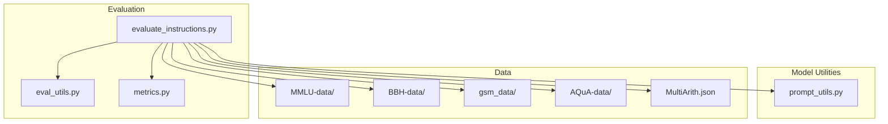
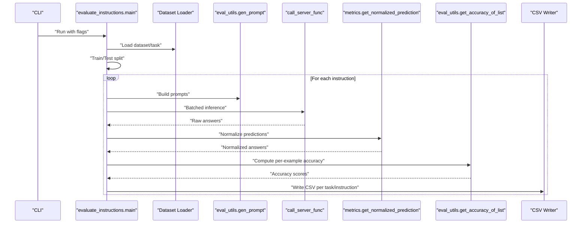
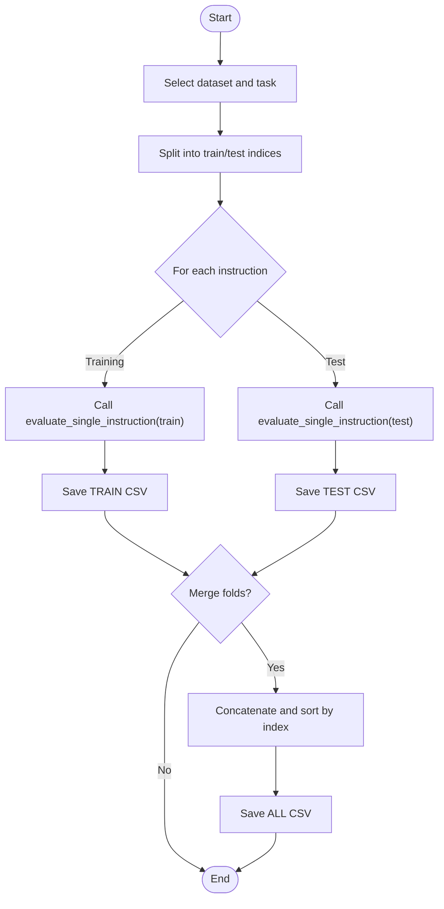
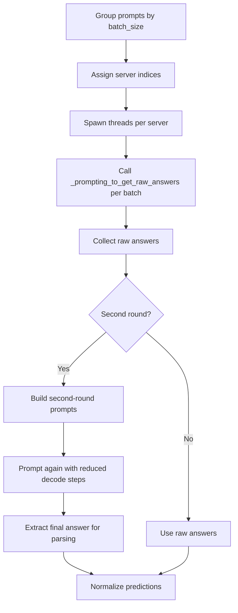
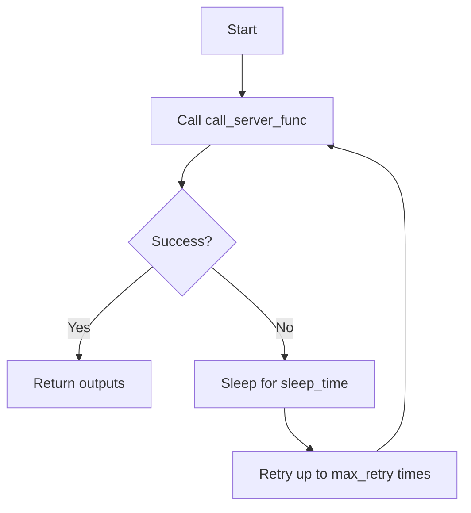
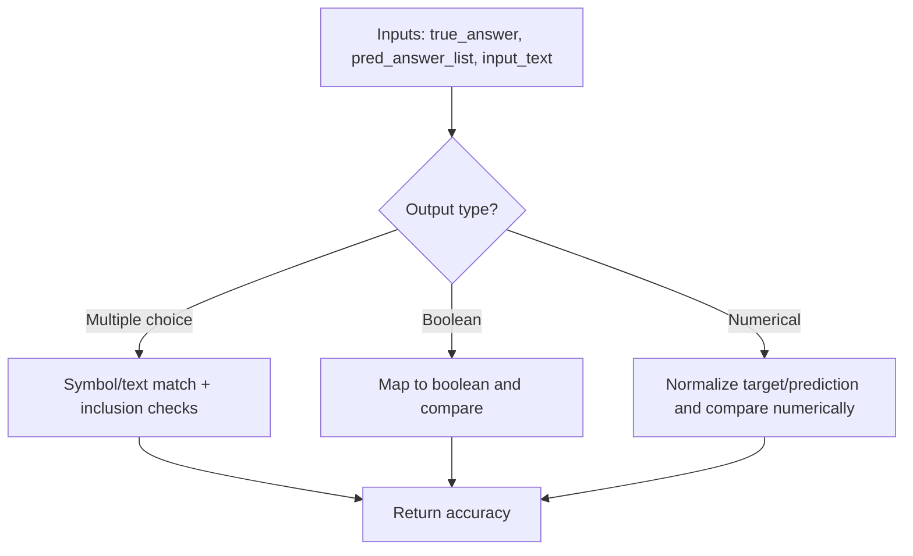
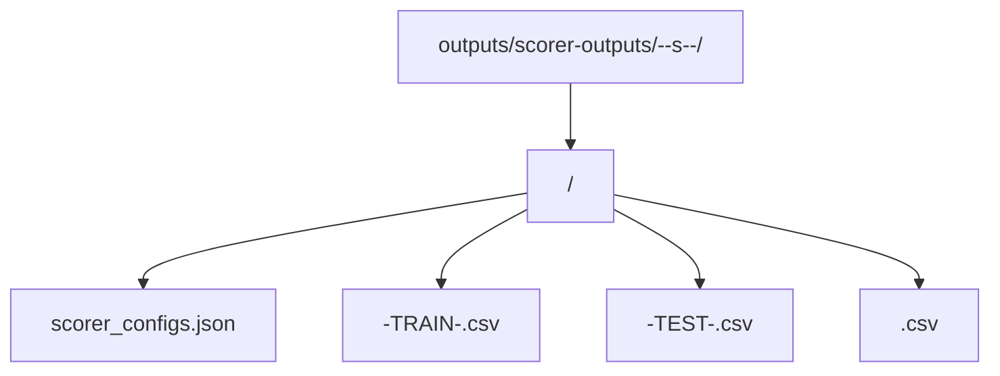
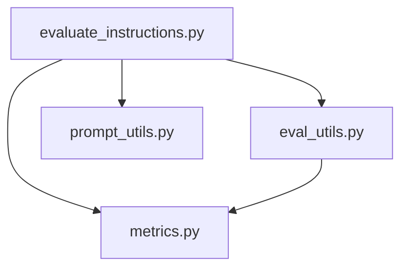

# Evaluation Loop

<cite>
**Referenced Files in This Document**
- [evaluate_instructions.py](file://opro/evaluation/evaluate_instructions.py)
- [eval_utils.py](file://opro/evaluation/eval_utils.py)
- [metrics.py](file://opro/evaluation/metrics.py)
- [prompt_utils.py](file://opro/prompt_utils.py)
- [README.md](file://README.md)
</cite>

## Table of Contents
1. [Introduction](#introduction)
2. [Project Structure](#project-structure)
3. [Core Components](#core-components)
4. [Architecture Overview](#architecture-overview)
5. [Detailed Component Analysis](#detailed-component-analysis)
6. [Dependency Analysis](#dependency-analysis)
7. [Performance Considerations](#performance-considerations)
8. [Troubleshooting Guide](#troubleshooting-guide)
9. [Conclusion](#conclusion)
10. [Appendices](#appendices)

## Introduction
This document explains the core evaluation loop implemented in evaluate_instructions.py. It describes how the system iterates through datasets and tasks, constructs prompts, calls the scoring model via call_server_func, computes accuracy using eval_utils.evaluate_single_instruction and metrics.get_normalized_prediction, and aggregates results into CSV files with standardized naming conventions. It also documents the differences in accuracy computation for multiple choice, boolean, and numerical outputs, and details the batch processing and retry logic with exponential backoff.

## Project Structure
The evaluation pipeline lives under opro/evaluation and integrates with prompt utilities for model calls.

**Diagram sources**
- [evaluate_instructions.py](file://opro/evaluation/evaluate_instructions.py#L98-L769)
- [eval_utils.py](file://opro/evaluation/eval_utils.py#L1-L917)
- [metrics.py](file://opro/evaluation/metrics.py#L1-L496)
- [prompt_utils.py](file://opro/prompt_utils.py#L1-L146)

**Section sources**
- [README.md](file://README.md#L37-L45)
- [evaluate_instructions.py](file://opro/evaluation/evaluate_instructions.py#L98-L140)

## Core Components
- Dataset selection and task enumeration:
  - MMLU: enumerates tasks by category and filters by subject subcategories.
  - BBH: supports a single task or a subset of tasks with known sets of multiple choice, boolean, and numerical tasks.
  - GSM8K: single task name mapped to train or test split.
  - AQuA: reads JSONL and treats as multiple choice.
  - MultiArith: reads JSON and treats as numerical.
- Scoring model configuration:
  - PaLM text-bison via cloud API with fixed temperature and max_decode_steps.
  - GPT models via OpenAI Chat API with fixed temperature and max_decode_steps.
- Evaluation loop:
  - Iterates over tasks and instructions.
  - Splits data into training and test folds.
  - Calls eval_utils.evaluate_single_instruction with appropriate parameters.
  - Saves CSV results with standardized filenames and metadata.

**Section sources**
- [evaluate_instructions.py](file://opro/evaluation/evaluate_instructions.py#L208-L295)
- [evaluate_instructions.py](file://opro/evaluation/evaluate_instructions.py#L387-L542)
- [evaluate_instructions.py](file://opro/evaluation/evaluate_instructions.py#L554-L766)

## Architecture Overview
The evaluation loop orchestrates data loading, prompt construction, model inference, answer normalization, accuracy computation, and result aggregation.

**Diagram sources**
- [evaluate_instructions.py](file://opro/evaluation/evaluate_instructions.py#L554-L766)
- [eval_utils.py](file://opro/evaluation/eval_utils.py#L164-L259)
- [eval_utils.py](file://opro/evaluation/eval_utils.py#L536-L864)
- [metrics.py](file://opro/evaluation/metrics.py#L188-L343)

## Detailed Component Analysis

### Evaluation Loop Control Flow
- Task enumeration:
  - MMLU: builds a list of (folder, task) tuples and filters by category membership.
  - BBH: defines sets of multiple choice, boolean, and numerical tasks.
  - GSM8K/AQuA/MultiArith: single task or self-contained dataset.
- Train/test split:
  - Uses a fixed seed and deterministic sampling to produce reproducible splits.
  - For math-like datasets with integer keys, indices are adjusted accordingly.
- Instruction iteration:
  - For each instruction, evaluates training and/or test folds independently.
  - Results are saved to CSV files with standardized naming conventions.

**Diagram sources**
- [evaluate_instructions.py](file://opro/evaluation/evaluate_instructions.py#L554-L766)

**Section sources**
- [evaluate_instructions.py](file://opro/evaluation/evaluate_instructions.py#L554-L766)

### Batch Processing and Parallelism
- Batch grouping:
  - Prompts are grouped by batch_size and distributed across num_servers.
- Parallelism:
  - Multithreading pool is used to dispatch batches to different servers concurrently.
- Second-round extraction:
  - Optional second round of prompting is used to improve final answer extraction for certain models.

**Diagram sources**
- [eval_utils.py](file://opro/evaluation/eval_utils.py#L646-L745)
- [eval_utils.py](file://opro/evaluation/eval_utils.py#L746-L864)

**Section sources**
- [eval_utils.py](file://opro/evaluation/eval_utils.py#L646-L745)
- [eval_utils.py](file://opro/evaluation/eval_utils.py#L746-L864)

### Retry Logic with Exponential Backoff
- First-round prompting:
  - Retries on exceptions with a fixed sleep_time between attempts.
- Model-specific utilities:
  - OpenAI client handles rate limits and timeouts with automatic retry and sleep.
  - PaLM client retries on failures with a fixed sleep interval.

**Diagram sources**
- [eval_utils.py](file://opro/evaluation/eval_utils.py#L338-L379)
- [prompt_utils.py](file://opro/prompt_utils.py#L29-L111)
- [prompt_utils.py](file://opro/prompt_utils.py#L113-L146)

**Section sources**
- [eval_utils.py](file://opro/evaluation/eval_utils.py#L338-L379)
- [prompt_utils.py](file://opro/prompt_utils.py#L29-L111)
- [prompt_utils.py](file://opro/prompt_utils.py#L113-L146)

### Accuracy Computation by Output Type
- Multiple choice:
  - Compares predicted symbol or text with true answer using symbol-to-text mapping and inclusion checks.
- Boolean:
  - Converts predictions to boolean equivalents and compares with true answer’s boolean interpretation.
- Numerical:
  - Normalizes predictions and targets using metrics.get_normalized_target_and_prediction, then compares numerically with tolerance.

**Diagram sources**
- [eval_utils.py](file://opro/evaluation/eval_utils.py#L381-L497)
- [metrics.py](file://opro/evaluation/metrics.py#L188-L343)
- [metrics.py](file://opro/evaluation/metrics.py#L345-L496)

**Section sources**
- [eval_utils.py](file://opro/evaluation/eval_utils.py#L381-L497)
- [metrics.py](file://opro/evaluation/metrics.py#L188-L343)
- [metrics.py](file://opro/evaluation/metrics.py#L345-L496)

### Result File Naming and Output Directory Structure
- Output directory:
  - Created under outputs/scorer-outputs with a timestamped subfolder named after dataset, task, scorer, and timestamp.
- Per-task subfolders:
  - Single-task result folders are created under the main output directory.
- Metadata:
  - scorer_configs.json is saved in each task folder with model configuration.
- CSV naming convention:
  - TRAIN CSV: {train_ratio}-TRAIN-{instruction_filename}.csv
  - TEST CSV: {test_ratio}-TEST-{instruction_filename}.csv
  - Combined CSV: {instruction_filename}.csv (concatenated and sorted by index)

**Diagram sources**
- [evaluate_instructions.py](file://opro/evaluation/evaluate_instructions.py#L222-L236)
- [evaluate_instructions.py](file://opro/evaluation/evaluate_instructions.py#L637-L766)

**Section sources**
- [evaluate_instructions.py](file://opro/evaluation/evaluate_instructions.py#L222-L236)
- [evaluate_instructions.py](file://opro/evaluation/evaluate_instructions.py#L637-L766)

### Example Workflows for Different Dataset Types
- MMLU:
  - Enumerates tasks by category, loads CSV rows, and evaluates each instruction across training/test splits.
- BBH:
  - Loads task JSON, identifies output types, and evaluates with appropriate accuracy checks.
- GSM8K:
  - Reads TSV, marks numerical output, and normalizes predictions accordingly.
- AQuA:
  - Reads JSONL, treats as multiple choice, and applies symbol/text matching.
- MultiArith:
  - Reads JSON, marks numerical output, and normalizes predictions numerically.

**Section sources**
- [evaluate_instructions.py](file://opro/evaluation/evaluate_instructions.py#L387-L542)
- [eval_utils.py](file://opro/evaluation/eval_utils.py#L866-L917)

## Dependency Analysis
The evaluation loop depends on:
- Dataset loaders and prompt generators in eval_utils.
- Metrics normalization and accuracy computation in metrics.
- Model call wrappers in prompt_utils.
- Flag-driven configuration and result saving in evaluate_instructions.

**Diagram sources**
- [evaluate_instructions.py](file://opro/evaluation/evaluate_instructions.py#L98-L140)
- [eval_utils.py](file://opro/evaluation/eval_utils.py#L1-L120)
- [metrics.py](file://opro/evaluation/metrics.py#L1-L60)
- [prompt_utils.py](file://opro/prompt_utils.py#L1-L40)

**Section sources**
- [evaluate_instructions.py](file://opro/evaluation/evaluate_instructions.py#L98-L140)
- [eval_utils.py](file://opro/evaluation/eval_utils.py#L1-L120)
- [metrics.py](file://opro/evaluation/metrics.py#L1-L60)
- [prompt_utils.py](file://opro/prompt_utils.py#L1-L40)

## Performance Considerations
- Batch size and server distribution:
  - Increasing batch_size reduces overhead but may increase latency; distributing across num_servers improves throughput.
- Parallelism:
  - Multithreading pool is used for batching; ensure evaluate_in_parallel is enabled for non-GPT models to maximize throughput.
- Decoding steps:
  - Reduced max_decode_steps in second-round prompting improves speed for final answer extraction.
- Retry strategy:
  - Fixed sleep_time and max_retry reduce API pressure; tune based on service quotas.

[No sources needed since this section provides general guidance]

## Troubleshooting Guide
- API key configuration:
  - Ensure the correct API key is provided for the selected scorer model.
- Timeout and rate limit errors:
  - OpenAI utilities handle retries automatically; PaLM utilities retry on failure.
- Output parsing issues:
  - For GPT models, boxed answers are extracted; otherwise, metrics.normalize is used.
- Accuracy mismatches:
  - Verify dataset-specific output types (multiple choice, boolean, numerical) and ensure prediction_treat_as_number/bool flags are set appropriately.

**Section sources**
- [evaluate_instructions.py](file://opro/evaluation/evaluate_instructions.py#L184-L193)
- [prompt_utils.py](file://opro/prompt_utils.py#L29-L111)
- [prompt_utils.py](file://opro/prompt_utils.py#L113-L146)
- [eval_utils.py](file://opro/evaluation/eval_utils.py#L788-L800)
- [metrics.py](file://opro/evaluation/metrics.py#L188-L343)

## Conclusion
The evaluation loop in evaluate_instructions.py provides a robust framework for assessing instruction quality across diverse datasets. It supports configurable model backends, flexible dataset handling, batched inference with parallelism, and rigorous accuracy computation tailored to output types. Results are systematically saved with clear naming conventions and metadata, enabling reproducible comparisons across instructions and tasks.

[No sources needed since this section summarizes without analyzing specific files]

## Appendices

### API Flags and Quickstart
- Flags:
  - scorer, dataset, task, instruction_pos, evaluate_training_fold, evaluate_test_fold, openai_api_key, palm_api_key.
- Quickstart:
  - Run the evaluation script with appropriate flags and API keys.

**Section sources**
- [README.md](file://README.md#L37-L45)
- [evaluate_instructions.py](file://opro/evaluation/evaluate_instructions.py#L26-L39)