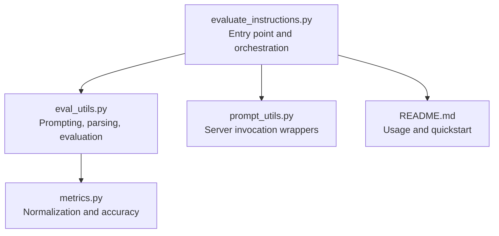
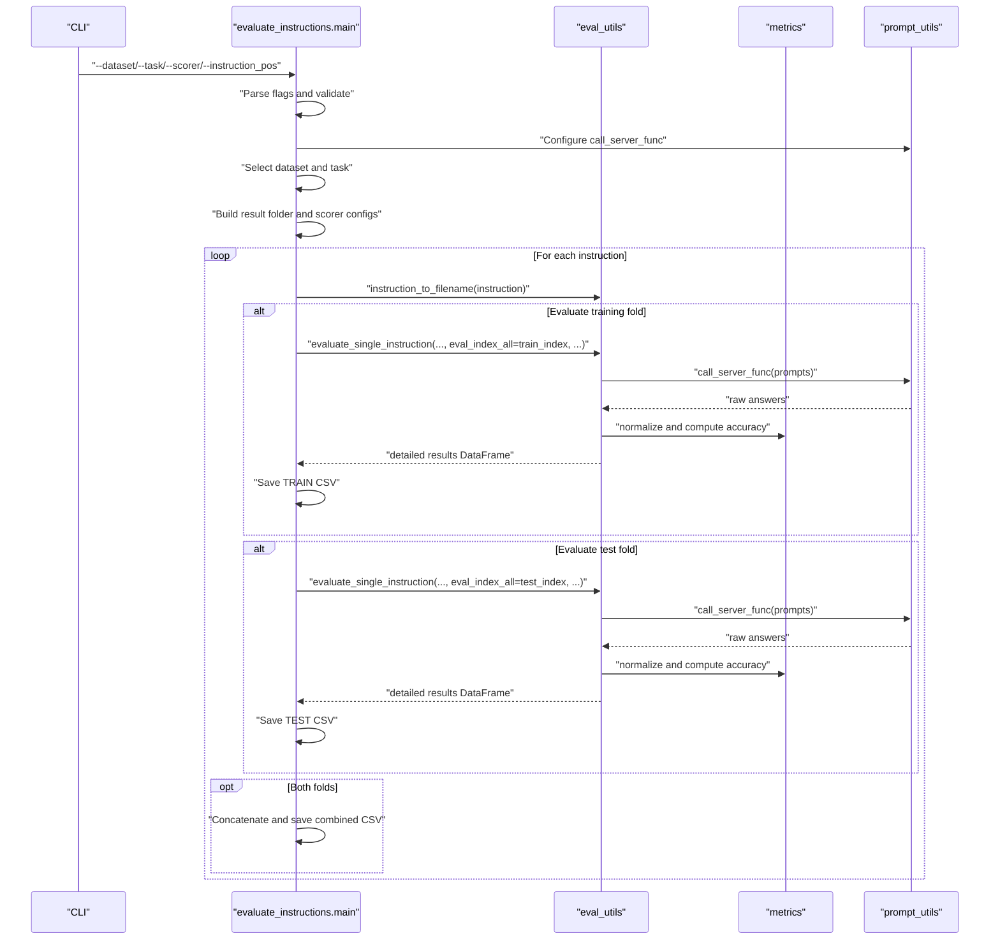
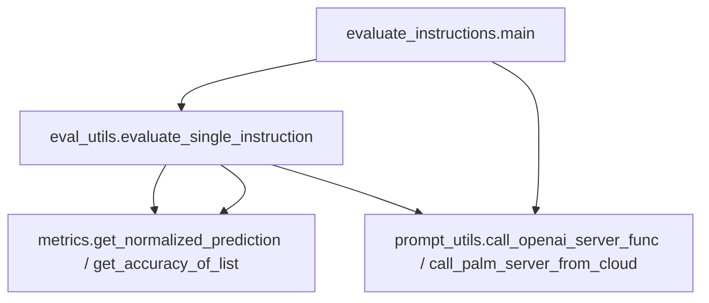

# Instruction Processing

<cite>
**Referenced Files in This Document**
- [evaluate_instructions.py](file://opro/evaluation/evaluate_instructions.py)
- [eval_utils.py](file://opro/evaluation/eval_utils.py)
- [metrics.py](file://opro/evaluation/metrics.py)
- [prompt_utils.py](file://opro/prompt_utils.py)
- [README.md](file://README.md)
</cite>

## Table of Contents
1. [Introduction](#introduction)
2. [Project Structure](#project-structure)
3. [Core Components](#core-components)
4. [Architecture Overview](#architecture-overview)
5. [Detailed Component Analysis](#detailed-component-analysis)
6. [Dependency Analysis](#dependency-analysis)
7. [Performance Considerations](#performance-considerations)
8. [Troubleshooting Guide](#troubleshooting-guide)
9. [Conclusion](#conclusion)

## Introduction
This document explains the instruction processing phase in the evaluation loop. It covers how instructions from the evaluation list are iterated over, transformed into filenames, and applied to training and test folds. It also documents how evaluation parameters are configured and passed to the evaluation pipeline, including batch sizing, server invocation, and accuracy computation settings. Finally, it describes how different dataset types are handled and how empty or special instruction formats are treated.

## Project Structure
The evaluation workflow is centered around a single script that orchestrates dataset loading, prompt construction, model scoring, and result serialization. Supporting utilities provide prompt generation, answer extraction, and accuracy computation.

**Diagram sources**
- [evaluate_instructions.py](file://opro/evaluation/evaluate_instructions.py#L98-L769)
- [eval_utils.py](file://opro/evaluation/eval_utils.py#L1-L917)
- [metrics.py](file://opro/evaluation/metrics.py#L1-L496)
- [prompt_utils.py](file://opro/prompt_utils.py#L1-L146)
- [README.md](file://README.md#L25-L45)

**Section sources**
- [README.md](file://README.md#L25-L45)

## Core Components
- Instruction iteration and selection:
  - The evaluation loop iterates over a predefined list of instructions and applies each to selected dataset tasks.
- Filename generation:
  - Each instruction is converted to a filename via a deterministic mapping to ensure reproducible result storage.
- Dataset-specific handling:
  - Different datasets (MMLU, BBH, GSM8K, Aqua, MultiArith) are loaded and prepared differently, with appropriate flags for multiple-choice, boolean, and numeric outputs.
- Evaluation configuration:
  - Batch size, server function, parallelism, and accuracy computation settings are configured per model and dataset.
- Training and test fold evaluation:
  - When enabled, each instruction is evaluated on both training and test folds, with results saved separately and aggregated when both are evaluated.

**Section sources**
- [evaluate_instructions.py](file://opro/evaluation/evaluate_instructions.py#L98-L769)
- [eval_utils.py](file://opro/evaluation/eval_utils.py#L76-L88)

## Architecture Overview
The instruction processing phase follows a clear pipeline: parse flags, configure model and server, load dataset, iterate instructions, construct prompts, call the model, normalize predictions, compute accuracy, and persist results.

**Diagram sources**
- [evaluate_instructions.py](file://opro/evaluation/evaluate_instructions.py#L98-L769)
- [eval_utils.py](file://opro/evaluation/eval_utils.py#L536-L917)
- [metrics.py](file://opro/evaluation/metrics.py#L188-L343)
- [prompt_utils.py](file://opro/prompt_utils.py#L29-L146)

## Detailed Component Analysis

### Instruction Iteration and Processing Loop
- Instructions are defined in the main function and iterated over in order.
- For each instruction, a filename is derived using the filename generator and results are saved under a per-task subdirectory.
- When both training and test folds are enabled, the instruction is evaluated on both sets, and the results are concatenated and saved together.

Key behaviors:
- Progress logging prints the current instruction index and content.
- Filenames are derived from instructions to ensure reproducible and unique result paths.
- Results are saved with explicit prefixes indicating fold ratios and filenames.

**Section sources**
- [evaluate_instructions.py](file://opro/evaluation/evaluate_instructions.py#L98-L124)
- [evaluate_instructions.py](file://opro/evaluation/evaluate_instructions.py#L673-L766)

### Instruction-to-Filename Conversion
- The filename generator converts an instruction string into a safe filesystem name.
- By default, a hash-based approach is used to avoid special characters and ensure uniqueness.
- An alternate mode can be used to derive a readable name, with special handling for empty instructions.

Role in result file naming:
- The filename is embedded into CSV filenames to identify the instruction associated with each evaluation run.
- This enables easy identification and comparison of results across different instructions.

**Section sources**
- [eval_utils.py](file://opro/evaluation/eval_utils.py#L76-L88)

### Applying Instructions to Training and Test Folds
- The evaluation loop conditionally evaluates training and test folds based on flags.
- For each fold, the evaluator constructs prompts for the subset of indices and calls the model.
- Results are saved per fold and, when both are evaluated, combined and sorted by original index.

Logging and printing:
- Progress statements indicate which fold is being evaluated and summarize average accuracy across items.

**Section sources**
- [evaluate_instructions.py](file://opro/evaluation/evaluate_instructions.py#L678-L766)

### Dataset Type Handling and Task Selection
- The script selects the dataset root and builds a list of tasks based on dataset type and task name.
- For MMLU, tasks are filtered by category; for BBH, a single task is used; for GSM8K, Aqua, and MultiArith, specific loaders are used.
- Flags constrain valid combinations (e.g., MMLU categories, BBH task names, GSM8K train/test).

Output flags:
- Multiple-choice, boolean, and numeric output flags are set per dataset to guide accuracy computation and normalization.

**Section sources**
- [evaluate_instructions.py](file://opro/evaluation/evaluate_instructions.py#L305-L526)

### Evaluation Parameter Configuration Passed to evaluate_single_instruction
- Batch size:
  - Fixed to a small value for both model families to reduce memory pressure and rate-limiting risk.
- Call server function:
  - Bound to either OpenAI or PaLM server wrapper with model-specific parameters.
- Accuracy computation settings:
  - Treat-as-number and treat-as-boolean flags are set per dataset and task.
  - Numeric decimals are controlled for rounding consistency.
- Parallelism:
  - Parallel evaluation is enabled for PaLM and disabled for GPT models in the evaluator.
- Additional flags:
  - Include QA markers, instruction position, and extraction strategies for final answers.

These parameters are passed consistently across training and test evaluations for each instruction.

**Section sources**
- [evaluate_instructions.py](file://opro/evaluation/evaluate_instructions.py#L527-L542)
- [evaluate_instructions.py](file://opro/evaluation/evaluate_instructions.py#L678-L766)
- [eval_utils.py](file://opro/evaluation/eval_utils.py#L536-L602)

### Example Workflows for Different Dataset Types
- MMLU:
  - Loads CSV files per task, determines multiple-choice flags, and computes accuracy accordingly.
- BBH:
  - Uses JSON-based examples, sets boolean and numeric flags based on task names.
- GSM8K:
  - Reads TSV files, treats predictions as numeric, and uses numeric accuracy checks.
- Aqua:
  - Loads JSONL data, treats predictions as categorical, and uses standard accuracy checks.
- MultiArith:
  - Loads JSON data, treats predictions as numeric, and uses numeric accuracy checks.

Each workflow sets dataset-specific flags and passes them to the evaluator.

**Section sources**
- [evaluate_instructions.py](file://opro/evaluation/evaluate_instructions.py#L527-L629)
- [eval_utils.py](file://opro/evaluation/eval_utils.py#L262-L286)

### Handling Empty Instructions and Special Formats
- Empty instruction:
  - The filename generator assigns a placeholder name for empty instructions, ensuring a valid and identifiable filename.
- Special instruction formats:
  - The prompt generator supports placing instructions before the question, at the beginning/end of the question, or at the beginning of the answer, depending on the instruction position setting.

These mechanisms ensure robustness across diverse instruction formats.

**Section sources**
- [eval_utils.py](file://opro/evaluation/eval_utils.py#L76-L88)
- [eval_utils.py](file://opro/evaluation/eval_utils.py#L164-L259)

## Dependency Analysis
The evaluation loop depends on several modules and their interplay:

**Diagram sources**
- [evaluate_instructions.py](file://opro/evaluation/evaluate_instructions.py#L296-L766)
- [eval_utils.py](file://opro/evaluation/eval_utils.py#L536-L917)
- [metrics.py](file://opro/evaluation/metrics.py#L188-L343)
- [prompt_utils.py](file://opro/prompt_utils.py#L29-L146)

**Section sources**
- [evaluate_instructions.py](file://opro/evaluation/evaluate_instructions.py#L296-L766)
- [eval_utils.py](file://opro/evaluation/eval_utils.py#L536-L917)

## Performance Considerations
- Batch size:
  - Small batch sizes are used to minimize resource contention and API rate limits.
- Parallelism:
  - Multithreading is used for PaLM; GPT models disable parallelism in the evaluator to avoid concurrency issues.
- Retry and sleep:
  - Server wrappers implement retries with backoff to handle transient failures.
- Output consolidation:
  - Combining training and test results is straightforward but increases I/O; consider disabling concatenation if only one fold is needed.

[No sources needed since this section provides general guidance]

## Troubleshooting Guide
Common issues and remedies:
- API keys:
  - Ensure the correct API key is provided for the chosen scorer model; otherwise, the script asserts and exits early.
- Dataset/task mismatch:
  - Verify dataset and task combinations conform to supported values; otherwise, assertions will fail.
- Model availability:
  - If using PaLM, confirm the library is available; otherwise, switch to GPT models.
- Rate limits and timeouts:
  - Server wrappers handle retries; if persistent failures occur, reduce batch size or increase sleep time.

**Section sources**
- [evaluate_instructions.py](file://opro/evaluation/evaluate_instructions.py#L184-L204)
- [evaluate_instructions.py](file://opro/evaluation/evaluate_instructions.py#L296-L303)
- [prompt_utils.py](file://opro/prompt_utils.py#L29-L146)

## Conclusion
The instruction processing phase systematically evaluates a set of instructions across dataset tasks and folds. It uses robust filename generation, dataset-aware prompt construction, and configurable evaluation parameters to produce reliable accuracy metrics. The modular design allows easy extension to new datasets and models while maintaining consistent result formatting and logging.