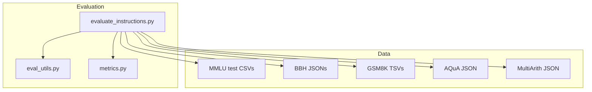
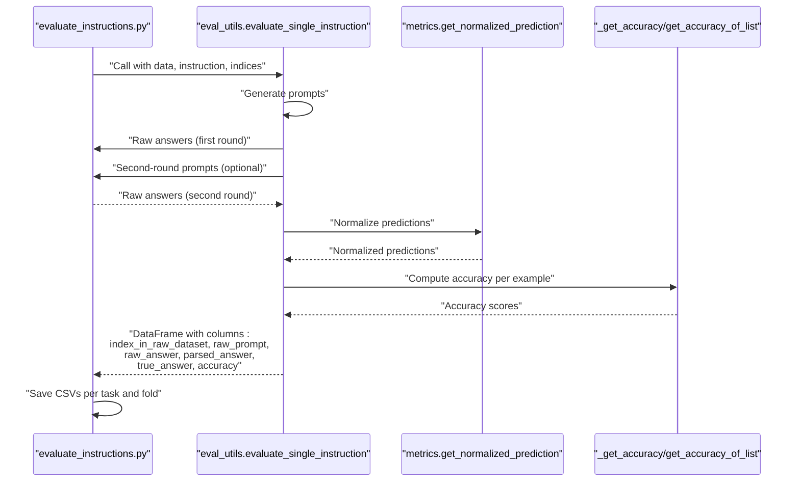
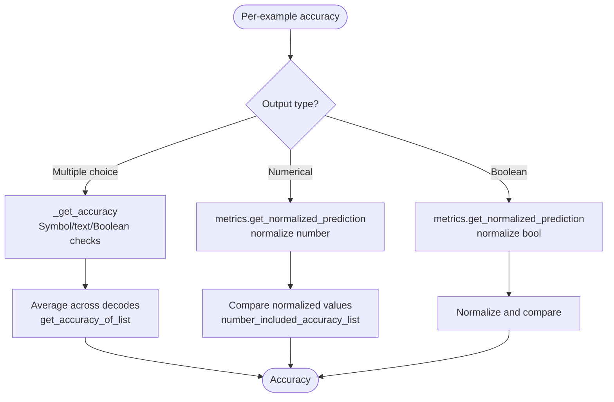
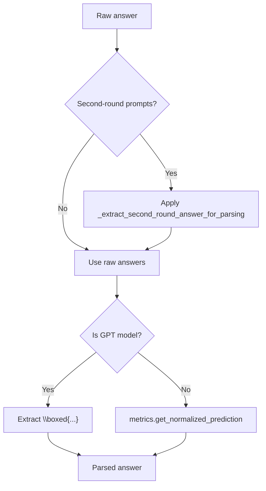
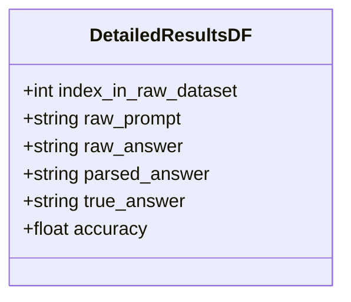
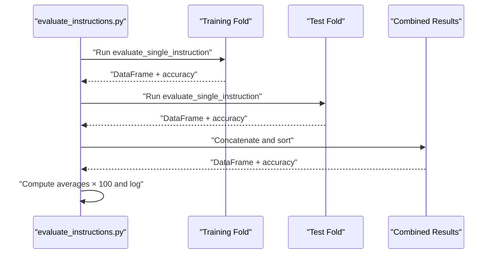
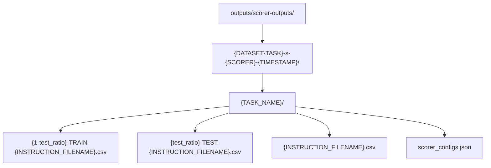
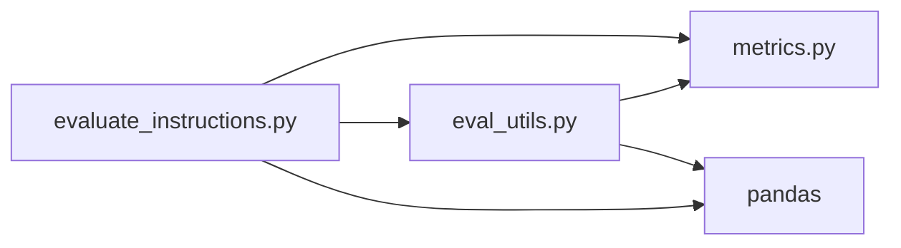

# Result Aggregation

<cite>
**Referenced Files in This Document**
- [eval_utils.py](file://opro/evaluation/eval_utils.py)
- [metrics.py](file://opro/evaluation/metrics.py)
- [evaluate_instructions.py](file://opro/evaluation/evaluate_instructions.py)
- [eval_utils_test.py](file://opro/evaluation/eval_utils_test.py)
- [README.md](file://README.md)
</cite>

## Table of Contents
1. [Introduction](#introduction)
2. [Project Structure](#project-structure)
3. [Core Components](#core-components)
4. [Architecture Overview](#architecture-overview)
5. [Detailed Component Analysis](#detailed-component-analysis)
6. [Dependency Analysis](#dependency-analysis)
7. [Performance Considerations](#performance-considerations)
8. [Troubleshooting Guide](#troubleshooting-guide)
9. [Conclusion](#conclusion)
10. [Appendices](#appendices)

## Introduction
This document explains the result aggregation phase in the evaluation loop. It covers how raw model outputs are parsed and normalized, how accuracy is computed across multiple output types (multiple choice, boolean, numerical), and how results are compiled into pandas DataFrames. It also documents the computation of average accuracy across training, test, and combined folds, the file naming conventions, and the output directory structure.

## Project Structure
The evaluation pipeline resides under opro/evaluation and integrates with the main evaluation script to produce aggregated results.

**Diagram sources**
- [evaluate_instructions.py](file://opro/evaluation/evaluate_instructions.py#L222-L236)
- [eval_utils.py](file://opro/evaluation/eval_utils.py#L536-L864)
- [metrics.py](file://opro/evaluation/metrics.py#L188-L343)

**Section sources**
- [README.md](file://README.md#L37-L45)
- [evaluate_instructions.py](file://opro/evaluation/evaluate_instructions.py#L222-L236)

## Core Components
- Result aggregation entrypoint: evaluate_single_instruction constructs detailed results and computes accuracy per example.
- Accuracy computation:
  - Multiple choice: _get_accuracy and get_accuracy_of_list handle symbol/text matching and Boolean conversions.
  - Numerical: metrics.get_normalized_prediction normalizes numeric predictions; number_included_accuracy supports numeric comparisons.
  - Boolean: metrics.get_normalized_prediction converts 0/1 and textual forms to standardized Booleans.
- Parsing and normalization:
  - Second-round extraction helper: _extract_second_round_answer_for_parsing.
  - Special handling for GPT models’ boxed format via eval_utils.
- Output DataFrame: columns include index_in_raw_dataset, raw_prompt, raw_answer, parsed_answer, true_answer, and accuracy.

**Section sources**
- [eval_utils.py](file://opro/evaluation/eval_utils.py#L536-L864)
- [metrics.py](file://opro/evaluation/metrics.py#L188-L343)
- [eval_utils_test.py](file://opro/evaluation/eval_utils_test.py#L144-L174)

## Architecture Overview
The evaluation loop orchestrates prompting, parsing, normalization, and accuracy computation, then aggregates results into DataFrames and writes CSVs.

**Diagram sources**
- [evaluate_instructions.py](file://opro/evaluation/evaluate_instructions.py#L673-L766)
- [eval_utils.py](file://opro/evaluation/eval_utils.py#L536-L864)
- [metrics.py](file://opro/evaluation/metrics.py#L188-L343)

## Detailed Component Analysis

### Accuracy Computation by Output Type
- Multiple choice:
  - _get_accuracy supports symbol matching (with or without brackets), exact text match, inclusion of the correct choice text while excluding others, and Boolean symbol matching.
  - get_accuracy_of_list averages accuracy across multiple decodes per example.
- Numerical:
  - metrics.get_normalized_prediction strips prefixes, delimiters, and units; converts spelled-out numbers; extracts the last numeric token or the first token after equals; rounds to specified decimals.
  - number_included_accuracy_list compares normalized numeric targets and predictions with tolerance.
- Boolean:
  - metrics.get_normalized_prediction converts 0/1 and textual forms to standardized Boolean strings and removes punctuation for comparison.

**Diagram sources**
- [eval_utils.py](file://opro/evaluation/eval_utils.py#L381-L534)
- [metrics.py](file://opro/evaluation/metrics.py#L188-L343)
- [metrics.py](file://opro/evaluation/metrics.py#L443-L496)

**Section sources**
- [eval_utils.py](file://opro/evaluation/eval_utils.py#L381-L534)
- [metrics.py](file://opro/evaluation/metrics.py#L188-L343)
- [metrics.py](file://opro/evaluation/metrics.py#L443-L496)
- [eval_utils_test.py](file://opro/evaluation/eval_utils_test.py#L144-L174)

### Raw Output Parsing and Special Cases
- Second-round extraction:
  - _extract_second_round_answer_for_parsing trims leading colons, whitespace, newline blocks, and text after “Q:” to isolate the final answer.
- GPT models’ boxed format:
  - When is_gpt_model is True, eval_utils parses predictions to extract content inside \boxed{...}.
- Normalization:
  - metrics.get_normalized_prediction handles answer indicators (“answer is”, “Answer:”), delimiters, units, and numeric token extraction.

**Diagram sources**
- [eval_utils.py](file://opro/evaluation/eval_utils.py#L757-L800)
- [eval_utils.py](file://opro/evaluation/eval_utils.py#L766-L777)
- [eval_utils.py](file://opro/evaluation/eval_utils.py#L791-L799)
- [metrics.py](file://opro/evaluation/metrics.py#L188-L343)

**Section sources**
- [eval_utils.py](file://opro/evaluation/eval_utils.py#L757-L800)
- [eval_utils.py](file://opro/evaluation/eval_utils.py#L766-L777)
- [eval_utils.py](file://opro/evaluation/eval_utils.py#L791-L799)
- [metrics.py](file://opro/evaluation/metrics.py#L188-L343)

### Aggregation into Pandas DataFrame
- Columns:
  - index_in_raw_dataset: original row index in the dataset.
  - raw_prompt: the prompt sent to the model.
  - raw_answer: raw model output from the first round.
  - parsed_answer: normalized answer string.
  - true_answer: ground truth label.
  - accuracy: per-example accuracy (averaged across decodes for multiple-choice).
- Optional second-round fields:
  - raw_prompt_second_round and raw_answer_second_round are inserted when second-round prompting is enabled.

**Diagram sources**
- [eval_utils.py](file://opro/evaluation/eval_utils.py#L834-L863)

**Section sources**
- [eval_utils.py](file://opro/evaluation/eval_utils.py#L834-L863)

### Average Accuracy Across Folds and Formatting
- Training, test, and combined folds:
  - For each instruction and task, the script evaluates training and/or test folds independently, computes average accuracy, and saves CSVs.
  - Combined fold concatenates training and test results and sorts by index_in_raw_dataset.
- Percentage formatting:
  - Averages are multiplied by 100 and formatted to one decimal place in the console logs.

**Diagram sources**
- [evaluate_instructions.py](file://opro/evaluation/evaluate_instructions.py#L673-L766)

**Section sources**
- [evaluate_instructions.py](file://opro/evaluation/evaluate_instructions.py#L701-L765)

### Result File Naming and Directory Structure
- Top-level result directory:
  - outputs/scorer-outputs/{DATASET-TASK}-s-{SCORER}-{TIMESTAMP}/
- Task-specific subdirectory:
  - Single-task result folder: {DATASET-TASK}-s-{SCORER}-{TIMESTAMP}/{TASK_NAME}/
- CSV naming convention:
  - TRAINING: {1-test_ratio}-TRAIN-{INSTRUCTION_FILENAME}.csv
  - TEST: {test_ratio}-TEST-{INSTRUCTION_FILENAME}.csv
  - COMBINED: {INSTRUCTION_FILENAME}.csv
- Scorer configuration:
  - Scorer configs JSON saved as scorer_configs.json in the task folder.

**Diagram sources**
- [evaluate_instructions.py](file://opro/evaluation/evaluate_instructions.py#L222-L236)
- [evaluate_instructions.py](file://opro/evaluation/evaluate_instructions.py#L637-L645)
- [evaluate_instructions.py](file://opro/evaluation/evaluate_instructions.py#L701-L765)

**Section sources**
- [evaluate_instructions.py](file://opro/evaluation/evaluate_instructions.py#L222-L236)
- [evaluate_instructions.py](file://opro/evaluation/evaluate_instructions.py#L637-L645)
- [evaluate_instructions.py](file://opro/evaluation/evaluate_instructions.py#L701-L765)

### Example Aggregated Results by Dataset and Instruction Configuration
- MMLU (multiple choice):
  - Columns: index_in_raw_dataset, raw_prompt, raw_answer, parsed_answer, true_answer, accuracy.
  - Accuracy computed via symbol/text/Boolean checks; average across decodes.
- GSM8K (numerical):
  - Columns: index_in_raw_dataset, raw_prompt, raw_answer, parsed_answer, true_answer, accuracy.
  - Numerical normalization and comparison; prediction treated as number.
- BBH (mixed):
  - Boolean tasks: parsed and compared as Boolean.
  - Numerical tasks: parsed and compared as numbers.
  - Multiple choice tasks: parsed and matched by symbol/text.
- AQuA (multiple choice):
  - Same as MMLU; accuracy computed accordingly.
- MultiArith (numerical):
  - Same as GSM8K; prediction treated as number.

**Section sources**
- [evaluate_instructions.py](file://opro/evaluation/evaluate_instructions.py#L505-L526)
- [evaluate_instructions.py](file://opro/evaluation/evaluate_instructions.py#L527-L542)
- [evaluate_instructions.py](file://opro/evaluation/evaluate_instructions.py#L543-L560)
- [evaluate_instructions.py](file://opro/evaluation/evaluate_instructions.py#L560-L630)
- [metrics.py](file://opro/evaluation/metrics.py#L188-L343)
- [eval_utils.py](file://opro/evaluation/eval_utils.py#L381-L534)

## Dependency Analysis
- evaluate_instructions depends on eval_utils for evaluation and metrics for normalization.
- eval_utils depends on metrics for normalization and on pandas for DataFrame construction.
- eval_utils_test validates accuracy computation logic.

**Diagram sources**
- [evaluate_instructions.py](file://opro/evaluation/evaluate_instructions.py#L59-L60)
- [eval_utils.py](file://opro/evaluation/eval_utils.py#L31-L34)
- [metrics.py](file://opro/evaluation/metrics.py#L188-L343)

**Section sources**
- [evaluate_instructions.py](file://opro/evaluation/evaluate_instructions.py#L59-L60)
- [eval_utils.py](file://opro/evaluation/eval_utils.py#L31-L34)
- [metrics.py](file://opro/evaluation/metrics.py#L188-L343)

## Performance Considerations
- Parallel prompting:
  - Multithreading pools are used to batch and distribute prompts across servers during the first round.
- Decoding strategy:
  - Second-round prompting uses shorter decoding steps to extract final answers efficiently.
- Normalization overhead:
  - Normalization routines include regex and string operations; batching reduces repeated overhead.

[No sources needed since this section provides general guidance]

## Troubleshooting Guide
- No output after retries:
  - _prompting_to_get_raw_answers asserts that outputs are produced after retries; verify server connectivity and keys.
- Incorrect accuracy for multiple choice:
  - Ensure input_text contains consecutive bracketed choices; verify true_answer is a lowercase letter or bracketed symbol.
- GPT boxed format not extracted:
  - Confirm is_gpt_model flag is True and predictions contain \boxed{...}.
- CSV not saved:
  - Verify task folder creation and write permissions; check instruction_to_filename for special characters.

**Section sources**
- [eval_utils.py](file://opro/evaluation/eval_utils.py#L338-L379)
- [eval_utils.py](file://opro/evaluation/eval_utils.py#L791-L799)
- [evaluate_instructions.py](file://opro/evaluation/evaluate_instructions.py#L637-L645)

## Conclusion
The result aggregation phase integrates raw model outputs, parsing, normalization, and accuracy computation tailored to each output type. It produces detailed per-example results and computes average accuracy across folds, saving structured CSVs with clear naming conventions and directory organization.

[No sources needed since this section summarizes without analyzing specific files]

## Appendices
- Quickstart usage for evaluation is documented in the repository README.

**Section sources**
- [README.md](file://README.md#L37-L45)