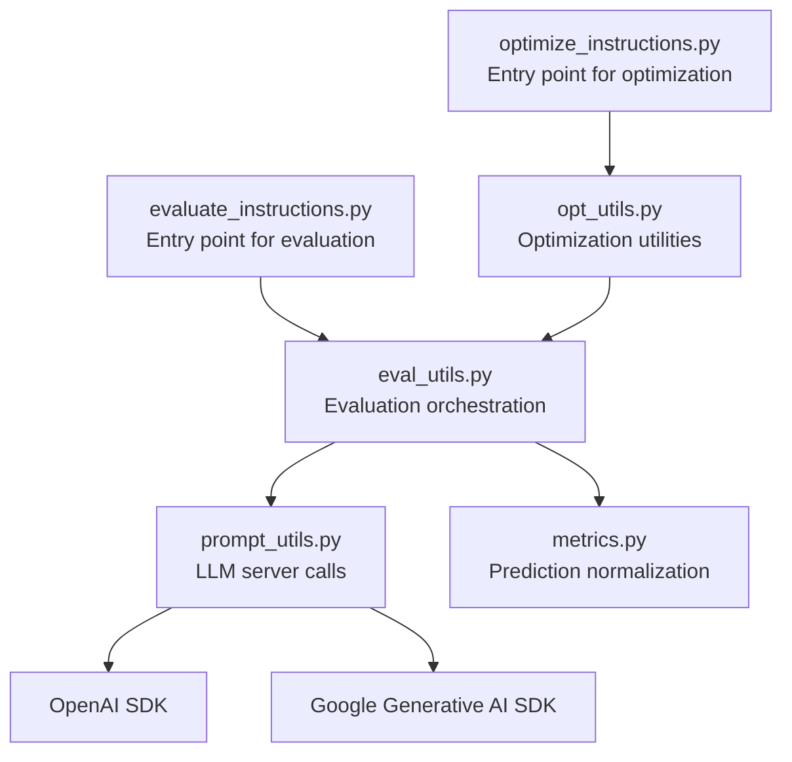
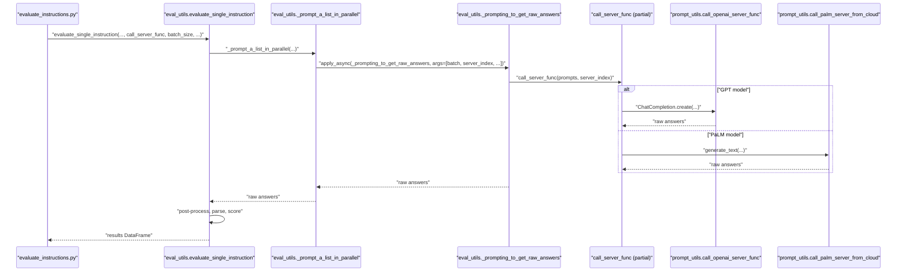
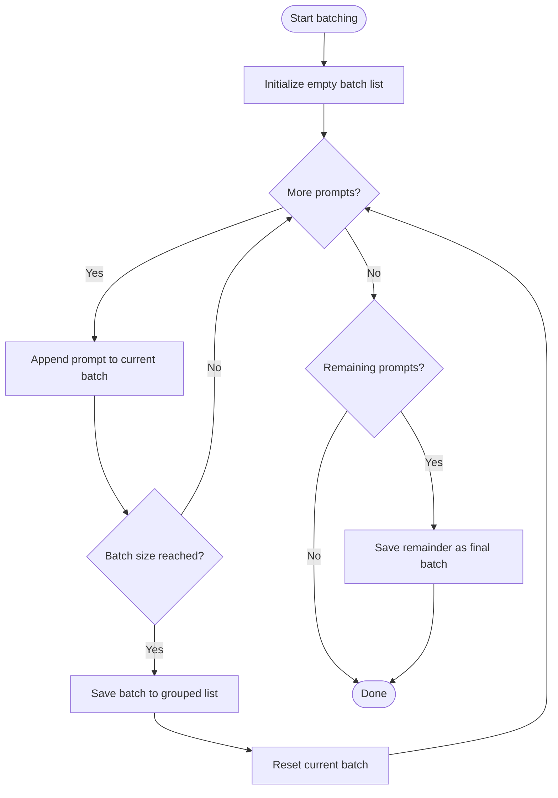
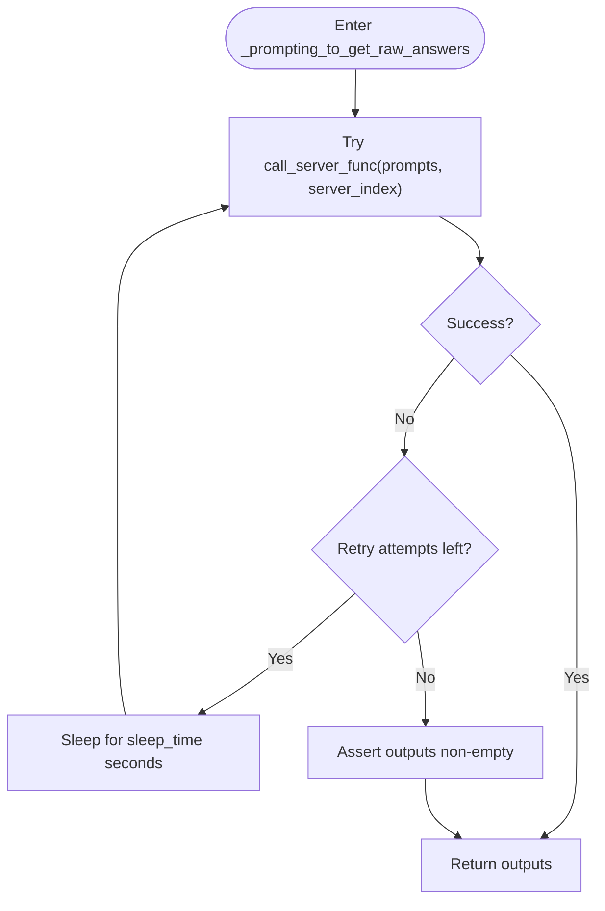
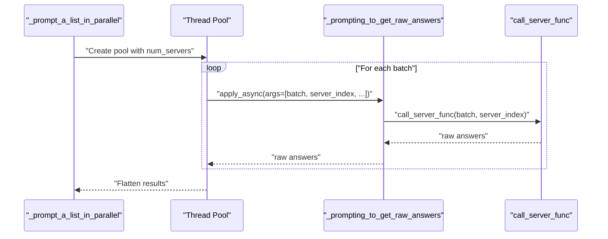
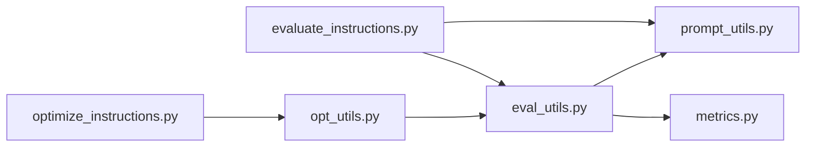

# Server Communication

<cite>
**Referenced Files in This Document**
- [README.md](file://README.md)
- [evaluate_instructions.py](file://opro/evaluation/evaluate_instructions.py)
- [eval_utils.py](file://opro/evaluation/eval_utils.py)
- [prompt_utils.py](file://opro/prompt_utils.py)
- [metrics.py](file://opro/evaluation/metrics.py)
- [optimize_instructions.py](file://opro/optimization/optimize_instructions.py)
- [opt_utils.py](file://opro/optimization/opt_utils.py)
</cite>

## Table of Contents
1. [Introduction](#introduction)
2. [Project Structure](#project-structure)
3. [Core Components](#core-components)
4. [Architecture Overview](#architecture-overview)
5. [Detailed Component Analysis](#detailed-component-analysis)
6. [Dependency Analysis](#dependency-analysis)
7. [Performance Considerations](#performance-considerations)
8. [Troubleshooting Guide](#troubleshooting-guide)
9. [Conclusion](#conclusion)

## Introduction
This document explains the server communication mechanism used in the evaluation loop. It focuses on how the call_server_func (configured for either OpenAI or Google PaLM) is invoked to query LLMs, how batching and retries are handled, and how parallel evaluation works. It also highlights differences between GPT models and PaLM in server communication, including handling of max_decode_steps and server_index, and documents error handling and rate-limiting sleep_time configuration.

## Project Structure
The evaluation pipeline is primarily implemented in the evaluation module, with server-side helpers in prompt_utils.py and scoring/normalization logic in metrics.py. The optimization module reuses evaluation utilities and prompt helpers.

**Diagram sources**
- [evaluate_instructions.py](file://opro/evaluation/evaluate_instructions.py#L238-L303)
- [eval_utils.py](file://opro/evaluation/eval_utils.py#L536-L863)
- [prompt_utils.py](file://opro/prompt_utils.py#L29-L146)
- [metrics.py](file://opro/evaluation/metrics.py#L188-L343)
- [optimize_instructions.py](file://opro/optimization/optimize_instructions.py#L104-L200)
- [opt_utils.py](file://opro/optimization/opt_utils.py#L1-L200)

**Section sources**
- [README.md](file://README.md#L14-L23)
- [evaluate_instructions.py](file://opro/evaluation/evaluate_instructions.py#L238-L303)

## Core Components
- call_server_func selection:
  - For GPT models: configured via a partial around prompt_utils.call_openai_server_func with model, max_decode_steps, and temperature.
  - For PaLM: configured via a partial around prompt_utils.call_palm_server_from_cloud with model, temperature, and max_decode_steps.
- Batch processing:
  - The evaluation loop passes batch_size to evaluate_single_instruction, which groups prompts into batches and dispatches them to call_server_func.
- Retry logic:
  - _prompting_to_get_raw_answers wraps call_server_func with a retry loop and sleep_time between attempts.
- Parallel evaluation:
  - _prompt_a_list_in_parallel uses multithreading to send batches to call_server_func concurrently across num_servers.

Key configuration points:
- Scorer model configuration and call_server_func creation are set in evaluate_instructions.py.
- Evaluation parameters like batch_size, num_servers, evaluate_in_parallel, max_retry, and sleep_time are passed to evaluate_single_instruction.

**Section sources**
- [evaluate_instructions.py](file://opro/evaluation/evaluate_instructions.py#L238-L303)
- [eval_utils.py](file://opro/evaluation/eval_utils.py#L536-L863)
- [prompt_utils.py](file://opro/prompt_utils.py#L29-L146)

## Architecture Overview
The evaluation loop orchestrates prompt generation, batching, parallel server calls, and answer parsing. The diagram below maps the actual code paths.

**Diagram sources**
- [evaluate_instructions.py](file://opro/evaluation/evaluate_instructions.py#L673-L745)
- [eval_utils.py](file://opro/evaluation/eval_utils.py#L646-L745)
- [prompt_utils.py](file://opro/prompt_utils.py#L29-L146)

## Detailed Component Analysis

### call_server_func configuration and usage
- GPT configuration:
  - The evaluator creates a partial around prompt_utils.call_openai_server_func with model, max_decode_steps, and temperature.
  - This partial is stored in call_scorer_server_func and passed to evaluate_single_instruction.
- PaLM configuration:
  - The evaluator creates a partial around prompt_utils.call_palm_server_from_cloud with model, temperature, and max_decode_steps.
  - This partial is stored in call_scorer_server_func and passed to evaluate_single_instruction.
- Usage in evaluation:
  - evaluate_single_instruction receives call_server_func and uses it to obtain raw answers for each prompt.
  - For GPT models, the evaluator sets evaluate_in_parallel=False by default in the evaluation script.

**Section sources**
- [evaluate_instructions.py](file://opro/evaluation/evaluate_instructions.py#L238-L303)
- [evaluate_instructions.py](file://opro/evaluation/evaluate_instructions.py#L527-L542)
- [evaluate_instructions.py](file://opro/evaluation/evaluate_instructions.py#L673-L745)
- [eval_utils.py](file://opro/evaluation/eval_utils.py#L536-L602)

### Batch processing through call_server_func
- The evaluation loop constructs raw_prompts_flattened and passes batch_size to evaluate_single_instruction.
- Inside evaluate_single_instruction, when evaluate_in_parallel is True, the code groups prompts into batches of size batch_size and dispatches them to call_server_func.
- The batching logic ensures that each batch is sent to the server as a list input to call_server_func.

**Diagram sources**
- [eval_utils.py](file://opro/evaluation/eval_utils.py#L646-L704)

**Section sources**
- [eval_utils.py](file://opro/evaluation/eval_utils.py#L646-L704)

### Retry logic with exponential backoff in _prompting_to_get_raw_answers
- _prompting_to_get_raw_answers iterates up to max_retry+1 times.
- On each retry iteration after the first, it sleeps for sleep_time seconds before attempting call_server_func again.
- The function catches exceptions from call_server_func and continues to the next retry until successful or exhausted.
- After all retries, it asserts that outputs are non-empty to guard against persistent failures.

**Diagram sources**
- [eval_utils.py](file://opro/evaluation/eval_utils.py#L338-L379)

**Section sources**
- [eval_utils.py](file://opro/evaluation/eval_utils.py#L338-L379)

### Parallel evaluation using multithreading in _prompt_a_list_in_parallel
- When evaluate_in_parallel is True, the function:
  - Groups prompts into batches of size batch_size.
  - Assigns a server_index to each batch (cycling across 1..num_servers).
  - Creates a thread pool with num_servers workers.
  - Asynchronously applies _prompting_to_get_raw_answers to each batch with its server_index.
  - Collects results and flattens them into a single list of raw answers.
- When evaluate_in_parallel is False, it calls call_server_func for each prompt individually.

**Diagram sources**
- [eval_utils.py](file://opro/evaluation/eval_utils.py#L646-L704)
- [eval_utils.py](file://opro/evaluation/eval_utils.py#L338-L379)

**Section sources**
- [eval_utils.py](file://opro/evaluation/eval_utils.py#L646-L704)

### Differences in server communication between GPT models and PaLM
- Model invocation:
  - GPT: Uses ChatCompletion.create with messages and max_tokens mapped to max_decode_steps.
  - PaLM: Uses generate_text with max_output_tokens mapped to max_decode_steps.
- Temperature and decoding:
  - Both support temperature configuration.
  - GPT supports temperature and num_decodes; PaLM uses temperature and max_output_tokens.
- server_index:
  - The evaluation code passes server_index to call_server_func for PaLM batching, enabling distribution across multiple servers.
- Configuration defaults:
  - The evaluation script sets batch_size=1 and num_servers=1 for both models, and evaluate_in_parallel=False for GPT models by default.

**Section sources**
- [prompt_utils.py](file://opro/prompt_utils.py#L29-L146)
- [evaluate_instructions.py](file://opro/evaluation/evaluate_instructions.py#L238-L303)
- [evaluate_instructions.py](file://opro/evaluation/evaluate_instructions.py#L527-L542)

### Error handling strategy for failed API calls and rate limiting
- OpenAI error handling:
  - call_openai_server_single_prompt handles Timeout, RateLimitError, APIError, APIConnectionError, ServiceUnavailableError, and OSError, with retry_time derived from retry_after when available or a fallback.
  - It retries the same single prompt recursively.
- PaLM error handling:
  - call_palm_server_from_cloud wraps the call in a try-except and retries after a fixed sleep_time.
- Evaluation-level retry:
  - _prompting_to_get_raw_answers provides a higher-level retry loop with configurable max_retry and sleep_time, independent of per-request SDK errors.

**Section sources**
- [prompt_utils.py](file://opro/prompt_utils.py#L29-L146)
- [eval_utils.py](file://opro/evaluation/eval_utils.py#L338-L379)

### sleep_time configuration for rate limiting
- The evaluation loop passes sleep_time to evaluate_single_instruction, which forwards it to _prompting_to_get_raw_answers.
- sleep_time controls the delay between retry attempts when call_server_func fails.

**Section sources**
- [evaluate_instructions.py](file://opro/evaluation/evaluate_instructions.py#L673-L745)
- [eval_utils.py](file://opro/evaluation/eval_utils.py#L338-L379)

### Examples of successful and failed communication patterns
- Successful pattern:
  - call_server_func returns a list of raw answers for a batch of prompts.
  - _prompting_to_get_raw_answers completes on the first attempt (or within max_retry).
  - Results are parsed and scored.
- Failed pattern:
  - call_server_func raises an exception; _prompting_to_get_raw_answers sleeps for sleep_time and retries up to max_retry times.
  - If all retries fail, the assertion enforces that outputs are non-empty, preventing silent failure.

Impact on evaluation results:
- Failures reduce throughput and may increase total runtime due to retries.
- Persistent failures can lead to missing outputs, causing evaluation to abort.

**Section sources**
- [eval_utils.py](file://opro/evaluation/eval_utils.py#L338-L379)
- [eval_utils.py](file://opro/evaluation/eval_utils.py#L820-L863)

## Dependency Analysis
- evaluate_instructions.py depends on prompt_utils for server calls and eval_utils for evaluation orchestration.
- eval_utils depends on prompt_utils for server calls and metrics for normalization.
- Optimization scripts reuse eval_utils and prompt_utils similarly.

**Diagram sources**
- [evaluate_instructions.py](file://opro/evaluation/evaluate_instructions.py#L238-L303)
- [eval_utils.py](file://opro/evaluation/eval_utils.py#L536-L863)
- [prompt_utils.py](file://opro/prompt_utils.py#L29-L146)
- [metrics.py](file://opro/evaluation/metrics.py#L188-L343)
- [optimize_instructions.py](file://opro/optimization/optimize_instructions.py#L104-L200)
- [opt_utils.py](file://opro/optimization/opt_utils.py#L1-L200)

**Section sources**
- [evaluate_instructions.py](file://opro/evaluation/evaluate_instructions.py#L238-L303)
- [eval_utils.py](file://opro/evaluation/eval_utils.py#L536-L863)
- [prompt_utils.py](file://opro/prompt_utils.py#L29-L146)
- [metrics.py](file://opro/evaluation/metrics.py#L188-L343)
- [optimize_instructions.py](file://opro/optimization/optimize_instructions.py#L104-L200)
- [opt_utils.py](file://opro/optimization/opt_utils.py#L1-L200)

## Performance Considerations
- Parallelism:
  - Multithreading is enabled via evaluate_in_parallel and num_servers. For GPT models, the evaluation script disables parallelism by default.
- Batching:
  - batch_size controls how many prompts are sent per call to call_server_func. Larger batches can improve throughput but may increase latency and memory usage.
- Retries and sleep:
  - max_retry and sleep_time influence robustness versus runtime. Higher values improve resilience at the cost of time.
- Model-specific limits:
  - GPT uses max_tokens mapped to max_decode_steps; PaLM uses max_output_tokens. Tune these to balance quality and cost.

[No sources needed since this section provides general guidance]

## Troubleshooting Guide
Common issues and remedies:
- API key errors:
  - Ensure openai_api_key or palm_api_key is provided and valid when using the respective models.
- Rate limits and timeouts:
  - Increase sleep_time and max_retry to handle throttling gracefully.
- Model mismatch:
  - Verify scorer_llm_name is one of the supported models and that the correct SDK is installed.
- Parallelism pitfalls:
  - For GPT models, keep evaluate_in_parallel=False to avoid concurrency-related issues.

**Section sources**
- [README.md](file://README.md#L14-L23)
- [evaluate_instructions.py](file://opro/evaluation/evaluate_instructions.py#L184-L193)
- [evaluate_instructions.py](file://opro/evaluation/evaluate_instructions.py#L527-L542)
- [eval_utils.py](file://opro/evaluation/eval_utils.py#L338-L379)

## Conclusion
The evaluation loop uses a flexible call_server_func abstraction to support both OpenAI and Google PaLM models. Batching and parallelism are controlled via batch_size and evaluate_in_parallel, while retries and sleep_time provide resilience against transient failures. Differences in server communication—particularly around max_decode_steps and server_index—are handled consistently through the call_server_func interface. Proper configuration of these parameters is essential for reliable and efficient evaluations.