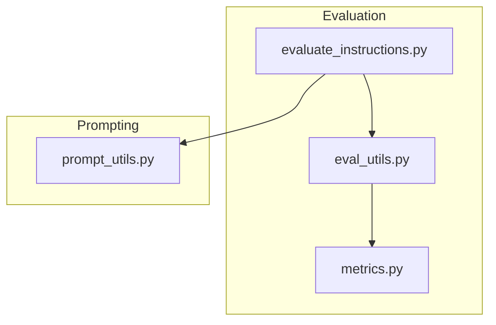
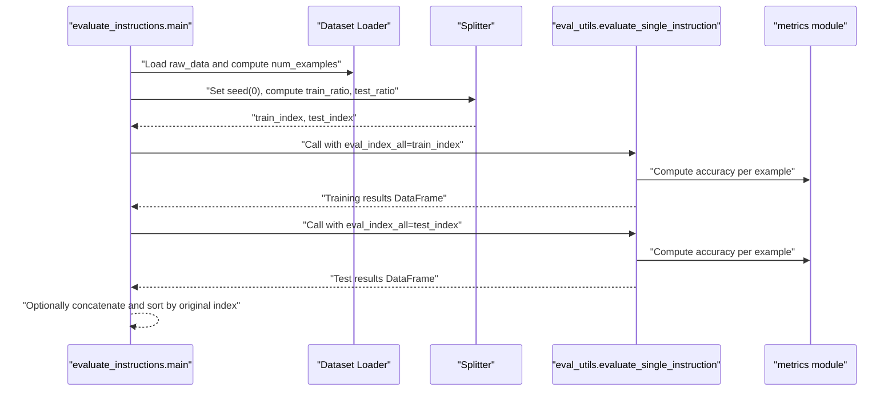
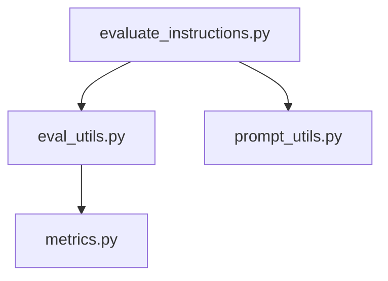

# Train-Test Splitting Strategy

<cite>
**Referenced Files in This Document**
- [evaluate_instructions.py](file://opro/evaluation/evaluate_instructions.py)
- [eval_utils.py](file://opro/evaluation/eval_utils.py)
- [metrics.py](file://opro/evaluation/metrics.py)
- [prompt_utils.py](file://opro/prompt_utils.py)
- [README.md](file://README.md)
</cite>

## Table of Contents
1. [Introduction](#introduction)
2. [Project Structure](#project-structure)
3. [Core Components](#core-components)
4. [Architecture Overview](#architecture-overview)
5. [Detailed Component Analysis](#detailed-component-analysis)
6. [Dependency Analysis](#dependency-analysis)
7. [Performance Considerations](#performance-considerations)
8. [Troubleshooting Guide](#troubleshooting-guide)
9. [Conclusion](#conclusion)

## Introduction
This document explains the train-test splitting strategy implemented in the evaluation pipeline. It focuses on how the system ensures reproducible splits using a fixed random seed, how train_ratio and test_ratio control allocation, how non-overlapping indices are generated using sampling without replacement, and how the complement set is used to form the test fold. Special handling for the math dataset preserves original indices after splitting. Finally, it describes how split indices are passed to the evaluation loop to process training and test data independently while maintaining result consistency.

## Project Structure
The evaluation workflow resides under opro/evaluation and integrates with prompt utilities and metrics.

**Diagram sources**
- [evaluate_instructions.py](file://opro/evaluation/evaluate_instructions.py#L1-L120)
- [eval_utils.py](file://opro/evaluation/eval_utils.py#L536-L760)
- [metrics.py](file://opro/evaluation/metrics.py#L188-L343)
- [prompt_utils.py](file://opro/prompt_utils.py#L29-L146)

**Section sources**
- [README.md](file://README.md#L37-L45)
- [evaluate_instructions.py](file://opro/evaluation/evaluate_instructions.py#L1-L120)

## Core Components
- Random seed initialization for reproducibility
- Ratio-based split computation
- Sampling without replacement to select train indices
- Complement-based selection of test indices
- Special handling for math dataset to preserve original indices
- Passing split indices to evaluation routines

Key implementation locations:
- Reproducible seed and split logic: [evaluate_instructions.py](file://opro/evaluation/evaluate_instructions.py#L646-L671)
- Evaluation loop using split indices: [evaluate_instructions.py](file://opro/evaluation/evaluate_instructions.py#L673-L766)
- Evaluation routine signature and index usage: [eval_utils.py](file://opro/evaluation/eval_utils.py#L536-L602)

**Section sources**
- [evaluate_instructions.py](file://opro/evaluation/evaluate_instructions.py#L646-L766)
- [eval_utils.py](file://opro/evaluation/eval_utils.py#L536-L602)

## Architecture Overview
The evaluation script orchestrates data loading, train-test split creation, and separate evaluation of training and test folds. The split indices are passed to the evaluation utility, which generates prompts and computes accuracy for each example.

**Diagram sources**
- [evaluate_instructions.py](file://opro/evaluation/evaluate_instructions.py#L646-L766)
- [eval_utils.py](file://opro/evaluation/eval_utils.py#L536-L760)
- [metrics.py](file://opro/evaluation/metrics.py#L443-L496)

## Detailed Component Analysis

### Reproducible Splits with Fixed Seed
- The script initializes the NumPy random seed at the start of the split phase to ensure deterministic shuffling across runs.
- This guarantees that the same train and test indices are produced for identical dataset sizes and ratios.

Implementation reference:
- [evaluate_instructions.py](file://opro/evaluation/evaluate_instructions.py#L646-L648)

**Section sources**
- [evaluate_instructions.py](file://opro/evaluation/evaluate_instructions.py#L646-L648)

### Ratio Control: train_ratio and test_ratio
- The script defines train_ratio and test_ratio and asserts that test_ratio is positive and at most one.
- When both training and test folds are evaluated, it asserts that train_ratio + test_ratio equals one.
- These ratios determine the proportion of examples assigned to each fold.

Implementation reference:
- [evaluate_instructions.py](file://opro/evaluation/evaluate_instructions.py#L110-L117)

**Section sources**
- [evaluate_instructions.py](file://opro/evaluation/evaluate_instructions.py#L110-L117)

### Non-Overlapping Indices via Sampling Without Replacement
- Train indices are sampled from the range of available indices using NumPy’s choice with replace=False, ensuring no duplicates.
- The resulting indices are sorted to maintain a consistent ordering.

Implementation reference:
- [evaluate_instructions.py](file://opro/evaluation/evaluate_instructions.py#L648-L656)

**Section sources**
- [evaluate_instructions.py](file://opro/evaluation/evaluate_instructions.py#L648-L656)

### Complement-Based Test Index Derivation
- The test index is derived as the set difference between the full index range and the selected train index set.
- The result is converted to a sorted array to ensure consistent indexing.

Implementation reference:
- [evaluate_instructions.py](file://opro/evaluation/evaluate_instructions.py#L657-L659)

**Section sources**
- [evaluate_instructions.py](file://opro/evaluation/evaluate_instructions.py#L657-L659)

### Special Handling for the math Dataset
- For the math dataset, the script preserves original integer keys as indices after splitting.
- After computing train_index and test_index, the code maps them back to the original index values before passing to evaluation.

Implementation reference:
- [evaluate_instructions.py](file://opro/evaluation/evaluate_instructions.py#L660-L662)

**Section sources**
- [evaluate_instructions.py](file://opro/evaluation/evaluate_instructions.py#L660-L662)

### Passing Split Indices to the Evaluation Loop
- The evaluation loop iterates over instructions and, when enabled, evaluates training and test folds separately.
- Training fold results are saved with a filename prefix reflecting the test ratio.
- Test fold results are saved with a filename prefix reflecting the test ratio.
- When both folds are evaluated, the results are concatenated and sorted by the original index to ensure consistent ordering across folds.

Implementation references:
- [evaluate_instructions.py](file://opro/evaluation/evaluate_instructions.py#L673-L766)

**Section sources**
- [evaluate_instructions.py](file://opro/evaluation/evaluate_instructions.py#L673-L766)

### Evaluation Routine Signature and Index Usage
- The evaluation utility accepts eval_index_all, which is the subset of indices to evaluate.
- The routine uses these indices to generate prompts and compute accuracy for each example.

Implementation reference:
- [eval_utils.py](file://opro/evaluation/eval_utils.py#L536-L602)

**Section sources**
- [eval_utils.py](file://opro/evaluation/eval_utils.py#L536-L602)

### Accuracy Computation and Consistency
- Accuracy is computed per example and aggregated to produce averages for training and test folds.
- Concatenation and sorting by original index ensures consistent ordering when combining results across folds.

Implementation references:
- [evaluate_instructions.py](file://opro/evaluation/evaluate_instructions.py#L700-L766)
- [metrics.py](file://opro/evaluation/metrics.py#L443-L496)

**Section sources**
- [evaluate_instructions.py](file://opro/evaluation/evaluate_instructions.py#L700-L766)
- [metrics.py](file://opro/evaluation/metrics.py#L443-L496)

## Dependency Analysis
The evaluation pipeline depends on:
- NumPy for reproducible random sampling and array operations
- Pandas for data loading and result storage
- Metrics module for normalization and accuracy computation
- Prompt utilities for model inference

**Diagram sources**
- [evaluate_instructions.py](file://opro/evaluation/evaluate_instructions.py#L52-L60)
- [eval_utils.py](file://opro/evaluation/eval_utils.py#L1-L40)
- [metrics.py](file://opro/evaluation/metrics.py#L1-L40)
- [prompt_utils.py](file://opro/prompt_utils.py#L1-L40)

**Section sources**
- [evaluate_instructions.py](file://opro/evaluation/evaluate_instructions.py#L52-L60)
- [eval_utils.py](file://opro/evaluation/eval_utils.py#L1-L40)
- [metrics.py](file://opro/evaluation/metrics.py#L1-L40)
- [prompt_utils.py](file://opro/prompt_utils.py#L1-L40)

## Performance Considerations
- Using replace=False in sampling ensures efficient, non-redundant index selection.
- Sorting indices improves consistency and enables predictable result ordering.
- For large datasets, ensure sufficient memory for storing results and consider batching strategies during inference.

[No sources needed since this section provides general guidance]

## Troubleshooting Guide
- If splits appear inconsistent across runs, verify that the random seed is initialized before sampling and that train_ratio and test_ratio remain constant.
- If math dataset indices seem misaligned, confirm that original indices are preserved and mapped back after splitting.
- If filenames reflect unexpected ratios, check the prefixes used for saving training and test results.

**Section sources**
- [evaluate_instructions.py](file://opro/evaluation/evaluate_instructions.py#L646-L766)

## Conclusion
The evaluation pipeline implements a robust, reproducible train-test splitting strategy. A fixed random seed ensures consistent splits, ratio parameters control allocation, and sampling without replacement guarantees non-overlapping indices. The complement-based derivation of test indices maintains correctness, and special handling for the math dataset preserves original indices. Split indices are passed to the evaluation loop to process training and test data separately, enabling consistent and comparable results across folds.