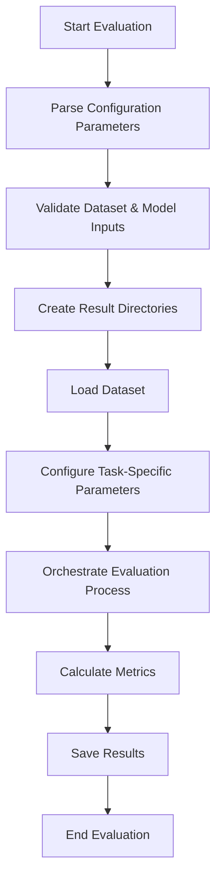
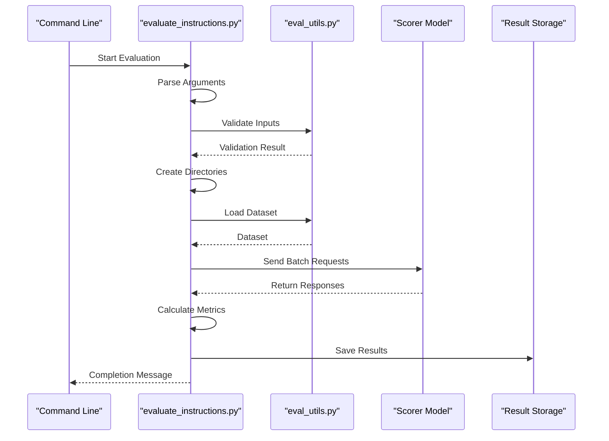

# Evaluation Workflow

<cite>
**Referenced Files in This Document**   
- [evaluate_instructions.py](file://opro/evaluation/evaluate_instructions.py)
- [eval_utils.py](file://opro/evaluation/eval_utils.py)
- [metrics.py](file://opro/evaluation/metrics.py)
- [prompt_utils.py](file://opro/prompt_utils.py)
- [README.md](file://README.md)
</cite>

## Table of Contents
1. [Introduction](#introduction)
2. [Evaluation Workflow Overview](#evaluation-workflow-overview)
3. [Configuration Initialization](#configuration-initialization)
4. [Dataset and Model Input Validation](#dataset-and-model-input-validation)
5. [Result Directory Management](#result-directory-management)
6. [Evaluation Orchestration Process](#evaluation-orchestration-process)
7. [Dataset Type Handling](#dataset-type-handling)
8. [Train-Test Split Functionality](#train-test-split-functionality)
9. [Output Organization and Timestamping](#output-organization-and-timestamping)
10. [Command-Line Interface](#command-line-interface)
11. [Troubleshooting Guide](#troubleshooting-guide)
12. [Conclusion](#conclusion)

## Introduction
The evaluation workflow system in the OPRO repository provides a comprehensive framework for assessing the performance of language model instructions across various benchmark datasets. This document details the complete execution flow of the evaluation process, focusing on the implementation in `evaluate_instructions.py`. The system supports multiple dataset types including MMLU, BBH, and GSM8K, with specialized handling for each format and evaluation metric. The workflow includes configuration initialization, input validation, directory creation, and systematic orchestration of the evaluation process.

**Section sources**
- [README.md](file://README.md#L38-L44)

## Evaluation Workflow Overview
The evaluation workflow follows a structured sequence of operations to ensure reliable and reproducible results. The process begins with parsing command-line arguments and initializing configuration parameters, followed by validation of dataset and model inputs. The system then creates timestamped result directories before orchestrating the evaluation process across specified datasets and model configurations. The workflow handles different dataset types through specialized loading functions and applies task-specific parameters for accurate evaluation. Results are systematically organized and stored for subsequent analysis.



**Diagram sources**
- [evaluate_instructions.py](file://opro/evaluation/evaluate_instructions.py)
- [eval_utils.py](file://opro/evaluation/eval_utils.py)

## Configuration Initialization
The evaluation process begins with the initialization of configuration parameters through command-line arguments. Key parameters include the scorer model (e.g., "text-bison"), dataset selection (e.g., "gsm8k"), task specification ("train" or "test"), instruction position ("Q_begin"), and API keys for model access. The system also configures batch processing parameters, retry mechanisms, and verbosity levels. Configuration initialization ensures that all necessary parameters are set before proceeding to the evaluation phase, with default values provided for optional parameters.

**Section sources**
- [evaluate_instructions.py](file://opro/evaluation/evaluate_instructions.py)
- [README.md](file://README.md#L43-L44)

## Dataset and Model Input Validation
Before executing the evaluation, the system performs comprehensive validation of dataset and model inputs. This includes verifying the existence and accessibility of dataset files in the designated data directory, confirming the correct format for each dataset type, and validating model availability through API connectivity tests. The validation process checks for proper API key configuration and ensures that the specified scorer model is supported by the system. For dataset validation, the system confirms that required files are present and properly formatted according to the expected schema for each dataset type.

**Section sources**
- [evaluate_instructions.py](file://opro/evaluation/evaluate_instructions.py)
- [eval_utils.py](file://opro/evaluation/eval_utils.py)

## Result Directory Management
The system creates organized result directories to store evaluation outputs. When initiating an evaluation run, the system generates a timestamped directory structure under the results folder to ensure unique identification of each evaluation session. The directory creation process includes establishing parent directories for different instruction types and creating subdirectories for specific evaluation configurations. The system checks for write permissions in the target directory and handles potential permission issues by providing descriptive error messages. Directory paths are constructed using a combination of dataset name, scorer model, and timestamp to ensure uniqueness and traceability.

**Section sources**
- [evaluate_instructions.py](file://opro/evaluation/evaluate_instructions.py)
- [eval_utils.py](file://opro/evaluation/eval_utils.py)

## Evaluation Orchestration Process
The evaluation orchestration process coordinates the execution of instruction evaluations across the specified dataset. The system loads the dataset into memory, applies necessary preprocessing transformations, and partitions the data according to the specified task (training or testing). For each instruction to be evaluated, the system invokes the scorer model through the appropriate API interface, processes the model responses, and computes performance metrics. The orchestration layer manages batch processing, handles API rate limiting through sleep intervals, and implements retry mechanisms for failed requests. Results are aggregated and stored in structured formats for subsequent analysis.



**Diagram sources**
- [evaluate_instructions.py](file://opro/evaluation/evaluate_instructions.py#L1-L100)
- [eval_utils.py](file://opro/evaluation/eval_utils.py#L1-L50)

## Dataset Type Handling
The evaluation system supports multiple dataset types, each with specialized handling mechanisms. For MMLU datasets, the system processes CSV files containing multiple-choice questions across various academic disciplines. BBH datasets are handled through specialized parsing that accommodates their unique format and reasoning tasks. GSM8K data is processed from TSV files with mathematical word problems, applying specific answer extraction techniques. The system identifies the dataset type from the configuration and loads the appropriate data format, applying task-specific preprocessing and evaluation metrics. Each dataset type has customized functions for loading, parsing, and evaluating responses according to its specific requirements.

**Section sources**
- [evaluate_instructions.py](file://opro/evaluation/evaluate_instructions.py)
- [eval_utils.py](file://opro/evaluation/eval_utils.py)
- [data/](file://data/)

## Train-Test Split Functionality
The system implements train-test split functionality to support different evaluation scenarios. When configured for training evaluation, the system processes the training fold of the dataset, while test configuration processes the test fold. The split functionality is controlled by boolean flags that determine which portions of the data to evaluate. For datasets with predefined train-test splits, the system respects the original partitioning. The evaluation process can be configured to evaluate both training and test folds simultaneously or independently, providing flexibility for different analysis requirements. The split functionality ensures that evaluation results are computed on the appropriate data subset as specified in the configuration.

**Section sources**
- [evaluate_instructions.py](file://opro/evaluation/evaluate_instructions.py)
- [eval_utils.py](file://opro/evaluation/eval_utils.py)

## Output Organization and Timestamping
Evaluation results are organized in a structured directory hierarchy with timestamped naming conventions. Each evaluation run creates a unique directory named with the current timestamp, ensuring that results from different runs do not overwrite each other. Within the timestamped directory, results are further organized by dataset, scorer model, and instruction type. The system saves detailed results in CSV format, including individual prediction accuracy, model responses, and metadata. Summary statistics and aggregated metrics are also stored in separate files for easy access. This organization enables systematic comparison of results across different evaluation runs and configurations.

**Section sources**
- [evaluate_instructions.py](file://opro/evaluation/evaluate_instructions.py)
- [eval_utils.py](file://opro/evaluation/eval_utils.py)

## Command-Line Interface
The evaluation system provides a command-line interface with configurable parameters for flexible execution. Key parameters include:

- `--scorer`: Specifies the model to use for evaluation (e.g., "text-bison")
- `--dataset`: Selects the dataset to evaluate (e.g., "gsm8k", "MMLU")
- `--task`: Defines the evaluation task ("train" or "test")
- `--instruction_pos`: Sets the position of instructions in prompts ("Q_begin" or other positions)
- `--evaluate_training_fold`: Boolean flag to enable training fold evaluation
- `--evaluate_test_fold`: Boolean flag to enable test fold evaluation
- `--palm_api_key`: Provides API key for PaLM model access
- `--openai_api_key`: Provides API key for OpenAI model access

Example invocation:
```
python evaluate_instructions.py --scorer="text-bison" --dataset="gsm8k" --task="test" --instruction_pos="Q_begin" --evaluate_training_fold=false --evaluate_test_fold=true --palm_api_key="<your_palm_api_key>"
```

Each parameter controls a specific aspect of the evaluation process, allowing users to customize the workflow according to their requirements.

**Section sources**
- [evaluate_instructions.py](file://opro/evaluation/evaluate_instructions.py)
- [README.md](file://README.md#L43-L44)

## Troubleshooting Guide
This section addresses common issues encountered during the evaluation workflow:

### API Key Configuration Issues
- **Problem**: Authentication failures when accessing scorer models
- **Solution**: Verify that the correct API key is provided for the specified scorer model. Check for typos and ensure the key has the necessary permissions. For PaLM API, confirm that the project is properly set up in Google Cloud Console.

### Dataset Path Errors
- **Problem**: "File not found" errors when loading datasets
- **Solution**: Verify that the dataset directory structure matches the expected format. Check that the data folder contains the required subdirectories (MMLU-data, gsm_data, etc.) with properly named files. Ensure the working directory is set correctly when executing the script.

### Permission Issues with Output Directories
- **Problem**: Unable to create result directories or write files
- **Solution**: Check write permissions in the target directory. Ensure the user has appropriate file system permissions. If running in a restricted environment, specify an alternative output directory with write access.

### Model Connectivity Problems
- **Problem**: Timeouts or connection failures when calling scorer APIs
- **Solution**: Verify internet connectivity and check the status of the model service. Implement appropriate retry logic and adjust sleep intervals between requests to avoid rate limiting.

### Dataset Format Incompatibility
- **Problem**: Parsing errors when loading dataset files
- **Solution**: Confirm that dataset files match the expected format (CSV for MMLU, TSV for GSM8K, JSON for MultiArith). Check for corrupted files or encoding issues that might affect parsing.

**Section sources**
- [evaluate_instructions.py](file://opro/evaluation/evaluate_instructions.py)
- [eval_utils.py](file://opro/evaluation/eval_utils.py)
- [README.md](file://README.md#L61-L62)

## Conclusion
The evaluation workflow system provides a robust framework for assessing instruction performance across diverse datasets and model configurations. By following a structured process of configuration, validation, execution, and result management, the system ensures reliable and reproducible evaluation outcomes. The support for multiple dataset types, flexible configuration options, and comprehensive error handling makes the system adaptable to various research and development scenarios. Proper understanding of the workflow and its components enables effective utilization of the evaluation capabilities for optimizing language model instructions.