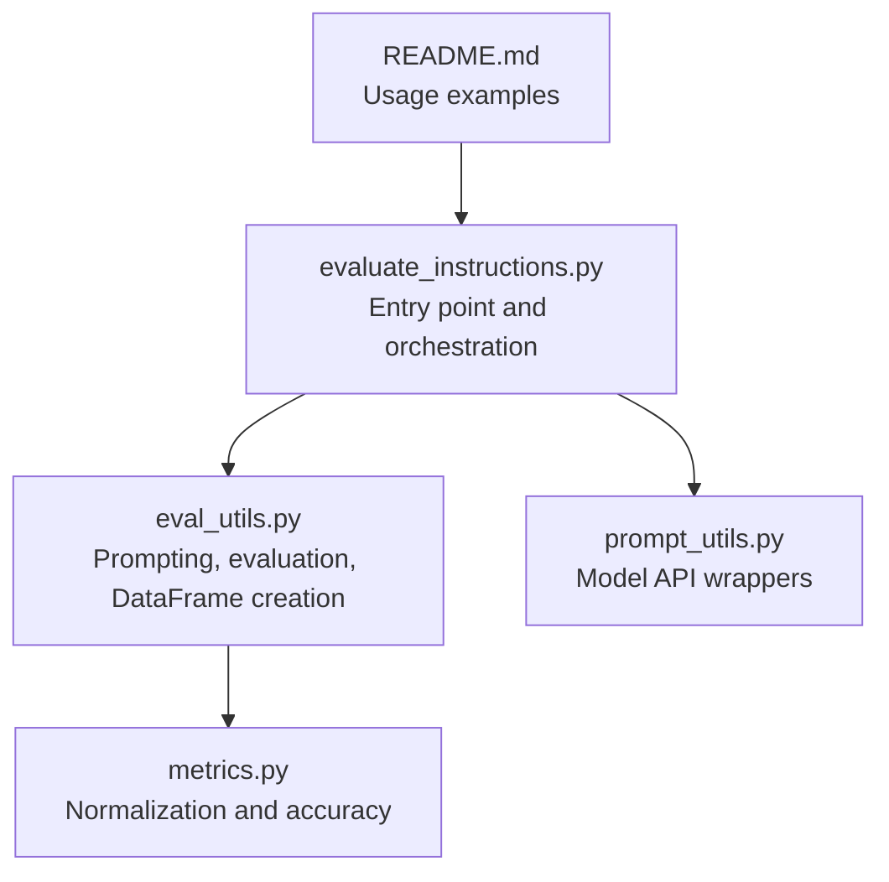
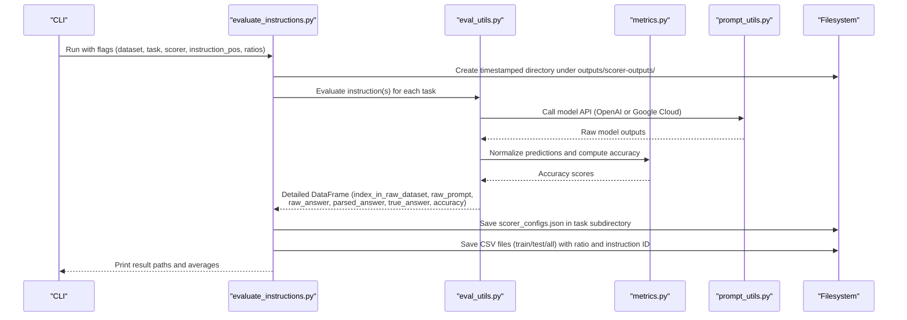
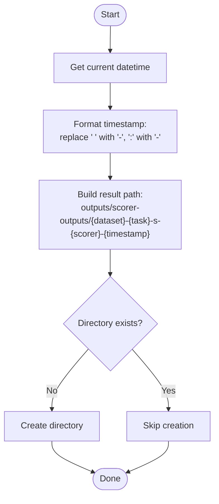
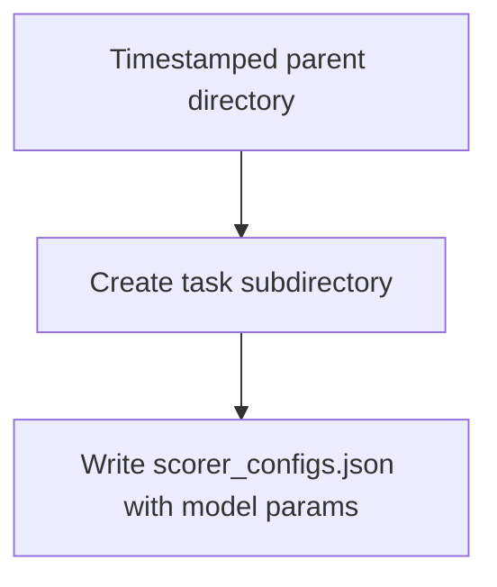
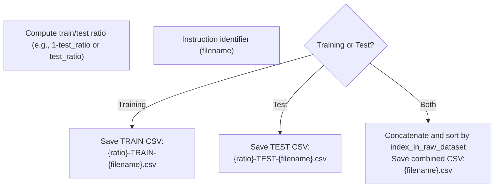
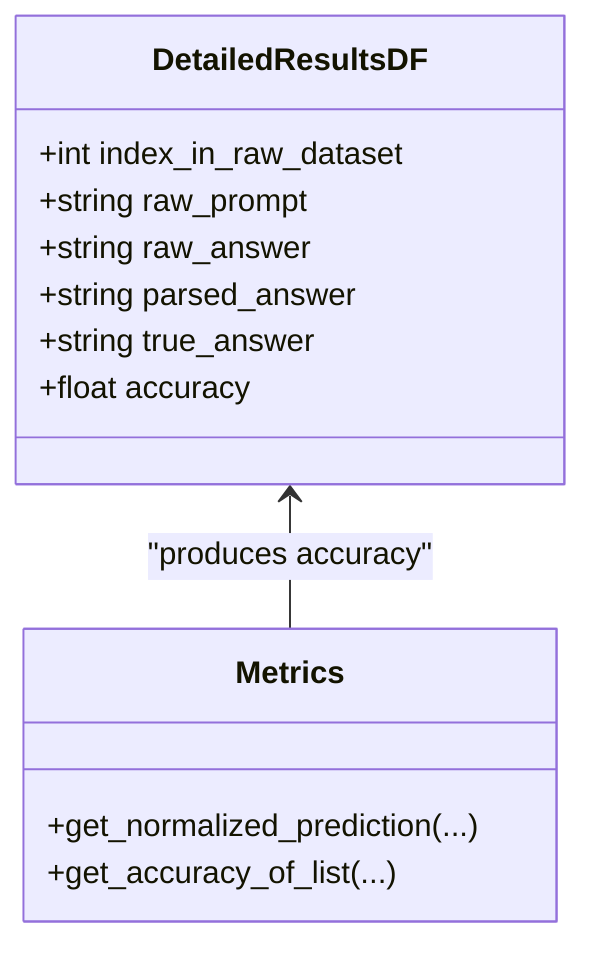
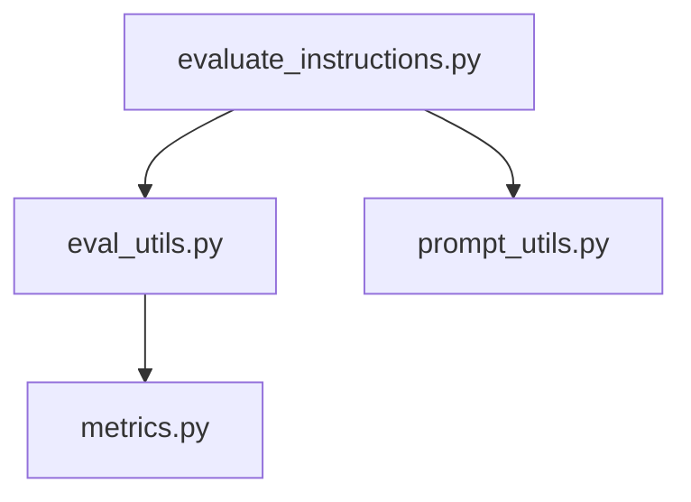

# Output Management

<cite>
**Referenced Files in This Document**
- [evaluate_instructions.py](file://opro/evaluation/evaluate_instructions.py)
- [eval_utils.py](file://opro/evaluation/eval_utils.py)
- [metrics.py](file://opro/evaluation/metrics.py)
- [prompt_utils.py](file://opro/prompt_utils.py)
- [README.md](file://README.md)
</cite>

## Table of Contents
1. [Introduction](#introduction)
2. [Project Structure](#project-structure)
3. [Core Components](#core-components)
4. [Architecture Overview](#architecture-overview)
5. [Detailed Component Analysis](#detailed-component-analysis)
6. [Dependency Analysis](#dependency-analysis)
7. [Performance Considerations](#performance-considerations)
8. [Troubleshooting Guide](#troubleshooting-guide)
9. [Conclusion](#conclusion)
10. [Appendices](#appendices)

## Introduction
This document explains the output management system for the evaluation pipeline. It focuses on how results are organized and persisted during evaluation, including:
- Timestamped result directories under outputs/scorer-outputs/
- Directory structure by dataset, task, scorer model, and timestamp
- Per-task subdirectories containing scorer configuration JSON files
- Naming conventions for output CSV files that encode train/test ratios and instruction identifiers
- How evaluation results are saved as DataFrames with accuracy metrics and detailed response information
- Practical guidance for locating and interpreting results
- Troubleshooting common output-related issues

## Project Structure
The evaluation pipeline resides under opro/evaluation/. The key files involved in output management are:
- opro/evaluation/evaluate_instructions.py: orchestrates evaluation, creates timestamped output directories, and saves CSV results
- opro/evaluation/eval_utils.py: constructs prompts, evaluates instructions, and returns detailed DataFrames
- opro/evaluation/metrics.py: normalization and accuracy computation for predictions
- opro/prompt_utils.py: low-level model calls for OpenAI and Google Cloud models
- README.md: usage examples and quickstarts

**Diagram sources**
- [evaluate_instructions.py](file://opro/evaluation/evaluate_instructions.py#L98-L769)
- [eval_utils.py](file://opro/evaluation/eval_utils.py#L536-L865)
- [metrics.py](file://opro/evaluation/metrics.py#L188-L496)
- [prompt_utils.py](file://opro/prompt_utils.py#L21-L133)
- [README.md](file://README.md#L37-L45)

**Section sources**
- [README.md](file://README.md#L37-L45)

## Core Components
- Timestamped result directory creation: The script builds a path under outputs/scorer-outputs/ using dataset, task, scorer model, and a timestamp derived from the current datetime.
- Per-task subdirectories: Within the timestamped directory, a subdirectory is created for each evaluated task.
- Scorer configuration JSON: A scorer_configs.json file is saved inside each task’s subdirectory, capturing model parameters used for evaluation.
- CSV naming convention: Output CSV files encode the train/test ratio and an instruction identifier derived from the instruction text.
- Evaluation results DataFrame: The evaluation produces a DataFrame with detailed response information and accuracy metrics, which is persisted to CSV.

**Section sources**
- [evaluate_instructions.py](file://opro/evaluation/evaluate_instructions.py#L222-L236)
- [evaluate_instructions.py](file://opro/evaluation/evaluate_instructions.py#L637-L645)
- [evaluate_instructions.py](file://opro/evaluation/evaluate_instructions.py#L701-L765)
- [eval_utils.py](file://opro/evaluation/eval_utils.py#L536-L865)
- [metrics.py](file://opro/evaluation/metrics.py#L188-L496)

## Architecture Overview
The evaluation pipeline follows a clear flow from orchestration to persistence:

**Diagram sources**
- [evaluate_instructions.py](file://opro/evaluation/evaluate_instructions.py#L98-L769)
- [eval_utils.py](file://opro/evaluation/eval_utils.py#L536-L865)
- [metrics.py](file://opro/evaluation/metrics.py#L188-L496)
- [prompt_utils.py](file://opro/prompt_utils.py#L21-L133)

## Detailed Component Analysis

### Timestamped Result Directory Creation
- Path composition: The script composes a path under outputs/scorer-outputs/ using uppercase dataset, lowercase task, scorer model name, and a timestamp string derived from the current datetime.
- Timestamp format: The timestamp replaces spaces with hyphens and colons with hyphens, ensuring filesystem-safe naming.
- Directory creation: The directory is created if it does not exist.

**Diagram sources**
- [evaluate_instructions.py](file://opro/evaluation/evaluate_instructions.py#L222-L236)

**Section sources**
- [evaluate_instructions.py](file://opro/evaluation/evaluate_instructions.py#L222-L236)

### Per-Task Subdirectory and Scorer Configuration JSON
- Task subdirectory: For each evaluated task, a subdirectory is created under the timestamped parent directory.
- Scorer configuration JSON: Inside each task subdirectory, a scorer_configs.json file is written with the scorer model parameters used during evaluation.

**Diagram sources**
- [evaluate_instructions.py](file://opro/evaluation/evaluate_instructions.py#L637-L645)

**Section sources**
- [evaluate_instructions.py](file://opro/evaluation/evaluate_instructions.py#L637-L645)

### CSV Naming Convention and File Persistence
- Train/Test CSV naming: For each instruction and fold, CSV files are named with the ratio prefix and an instruction identifier derived from the instruction text.
- Instruction identifier: The instruction identifier is computed using a function that converts the instruction string into a filename-friendly form.
- File contents: CSV files persist the detailed evaluation DataFrame with columns including index_in_raw_dataset, raw_prompt, raw_answer, parsed_answer, true_answer, and accuracy.

**Diagram sources**
- [evaluate_instructions.py](file://opro/evaluation/evaluate_instructions.py#L701-L765)
- [eval_utils.py](file://opro/evaluation/eval_utils.py#L76-L88)

**Section sources**
- [evaluate_instructions.py](file://opro/evaluation/evaluate_instructions.py#L701-L765)
- [eval_utils.py](file://opro/evaluation/eval_utils.py#L76-L88)

### Evaluation Results DataFrame Structure and Metrics
- DataFrame construction: The evaluation function builds a DataFrame with columns index_in_raw_dataset, raw_prompt, raw_answer, parsed_answer, true_answer, and accuracy.
- Accuracy computation: Accuracy is computed using a combination of exact match, choice text extraction, inclusion checks, and boolean matching depending on the dataset and question type.
- Indexing: The DataFrame is indexed by index_in_raw_dataset to preserve the original ordering from the raw dataset.

**Diagram sources**
- [eval_utils.py](file://opro/evaluation/eval_utils.py#L536-L865)
- [metrics.py](file://opro/evaluation/metrics.py#L188-L496)

**Section sources**
- [eval_utils.py](file://opro/evaluation/eval_utils.py#L536-L865)
- [metrics.py](file://opro/evaluation/metrics.py#L188-L496)

### Complete Output Directory Structure Example
Below is a conceptual example of the output directory structure produced by the evaluation pipeline. Replace placeholders with actual values from your run.

- outputs/
  - scorer-outputs/
    - DATASET-TASK-s-SCORER-YYYY-MM-DD-HH-MM-SS/
      - task_name/
        - scorer_configs.json
        - 1.0-TRAIN-<instruction_id>.csv
        - 1.0-TEST-<instruction_id>.csv
        - <instruction_id>.csv

Where:
- DATASET: uppercase dataset name (e.g., MMLU, GSM8K)
- TASK: lowercase task name (e.g., test, train)
- SCORER: scorer model name (e.g., text-bison, gpt-3.5-turbo, gpt-4)
- YYYY-MM-DD-HH-MM-SS: timestamp string
- task_name: dataset-specific task identifier
- instruction_id: filename derived from the instruction text

**Section sources**
- [evaluate_instructions.py](file://opro/evaluation/evaluate_instructions.py#L222-L236)
- [evaluate_instructions.py](file://opro/evaluation/evaluate_instructions.py#L637-L645)
- [evaluate_instructions.py](file://opro/evaluation/evaluate_instructions.py#L701-L765)

### Locating and Interpreting Results
- Finding the timestamped directory: Look under outputs/scorer-outputs/ for the most recent timestamped folder matching your dataset, task, and scorer.
- Per-task CSVs: Inside the task subdirectory, you will find CSV files named with the ratio and instruction identifier. The combined CSV (without ratio prefix) contains concatenated training and test results.
- Scorer configuration: scorer_configs.json contains the model parameters used for evaluation.
- Interpreting CSVs: Each row corresponds to an example from the raw dataset. The accuracy column reflects the computed accuracy for that example, and parsed_answer shows the normalized model response used for scoring.

**Section sources**
- [evaluate_instructions.py](file://opro/evaluation/evaluate_instructions.py#L222-L236)
- [evaluate_instructions.py](file://opro/evaluation/evaluate_instructions.py#L637-L645)
- [evaluate_instructions.py](file://opro/evaluation/evaluate_instructions.py#L701-L765)

## Dependency Analysis
The output management relies on the following dependencies:
- Orchestration depends on evaluation utilities and model API wrappers.
- Evaluation utilities depend on metrics for normalization and accuracy.
- Model API wrappers encapsulate OpenAI and Google Cloud calls.

**Diagram sources**
- [evaluate_instructions.py](file://opro/evaluation/evaluate_instructions.py#L98-L769)
- [eval_utils.py](file://opro/evaluation/eval_utils.py#L536-L865)
- [metrics.py](file://opro/evaluation/metrics.py#L188-L496)
- [prompt_utils.py](file://opro/prompt_utils.py#L21-L133)

**Section sources**
- [evaluate_instructions.py](file://opro/evaluation/evaluate_instructions.py#L98-L769)
- [eval_utils.py](file://opro/evaluation/eval_utils.py#L536-L865)
- [metrics.py](file://opro/evaluation/metrics.py#L188-L496)
- [prompt_utils.py](file://opro/prompt_utils.py#L21-L133)

## Performance Considerations
- Parallel evaluation: The evaluation supports multithreading for batching prompts and distributing across servers, which can reduce total runtime.
- Retry and sleep: The evaluation includes retry logic and sleep intervals to handle transient API issues.
- CSV write overhead: Writing multiple CSV files per instruction and fold can increase I/O overhead; consider consolidating results if needed.

[No sources needed since this section provides general guidance]

## Troubleshooting Guide
Common output-related issues and resolutions:

- Permission errors when creating directories or writing CSV files:
  - Ensure the process has write permissions to the repository root and the outputs/scorer-outputs/ directory.
  - Verify that the working directory is writable and that the user account has sufficient privileges.

- Disk space limitations:
  - Large datasets and multiple instructions can produce substantial CSV files. Monitor available disk space before running evaluations.
  - Consider reducing the number of instructions or folds evaluated in a single run.

- File naming conflicts:
  - The instruction identifier is derived from the instruction text. If two instructions produce identical identifiers, subsequent runs may overwrite earlier CSVs. To avoid this, use distinct instructions or manage the instruction lists accordingly.

- Timestamp collisions:
  - While extremely rare, identical timestamps could cause directory collisions. The code uses microsecond truncation and safe replacements; however, running multiple concurrent evaluations may still risk collisions. Consider adding a unique suffix or running evaluations sequentially.

- API rate limits and timeouts:
  - The model API wrappers include retry logic for rate limits and timeouts. If persistent failures occur, adjust retry parameters or reduce concurrency.

**Section sources**
- [prompt_utils.py](file://opro/prompt_utils.py#L21-L133)
- [evaluate_instructions.py](file://opro/evaluation/evaluate_instructions.py#L222-L236)
- [evaluate_instructions.py](file://opro/evaluation/evaluate_instructions.py#L701-L765)

## Conclusion
The output management system organizes evaluation results in a clear, reproducible structure. Timestamped directories group results by dataset, task, and scorer, with per-task CSV files encoded with train/test ratios and instruction identifiers. Detailed evaluation DataFrames capture raw prompts, raw answers, parsed answers, true answers, and accuracy metrics, enabling straightforward interpretation and comparison across instructions and folds.

[No sources needed since this section summarizes without analyzing specific files]

## Appendices

### Quickstart Usage Reference
- Use the evaluation script with appropriate flags to specify dataset, task, scorer, instruction position, and evaluation folds. The README provides quickstart examples.

**Section sources**
- [README.md](file://README.md#L37-L45)