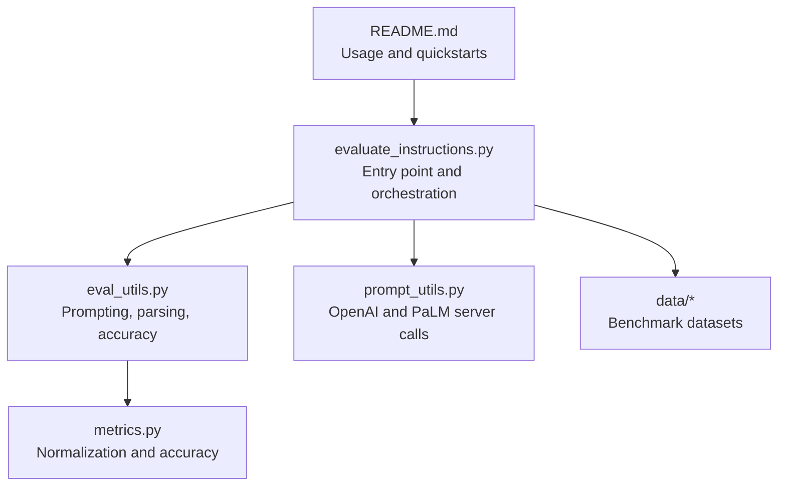
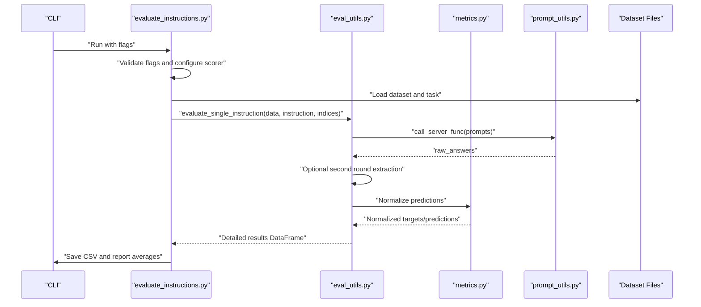
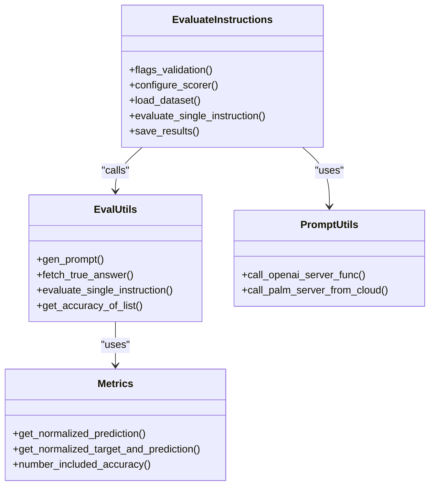
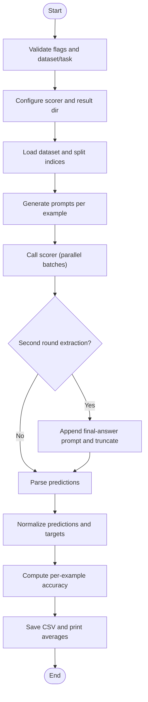
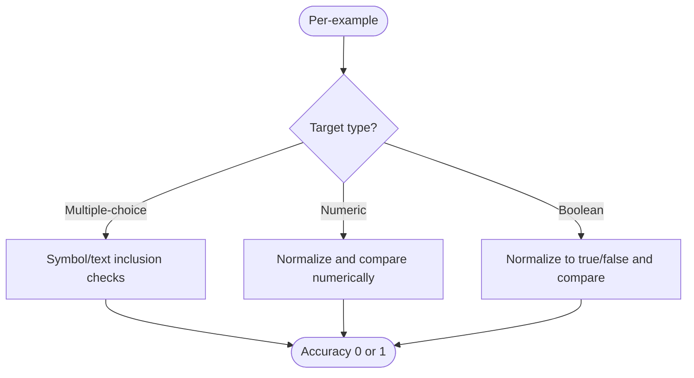
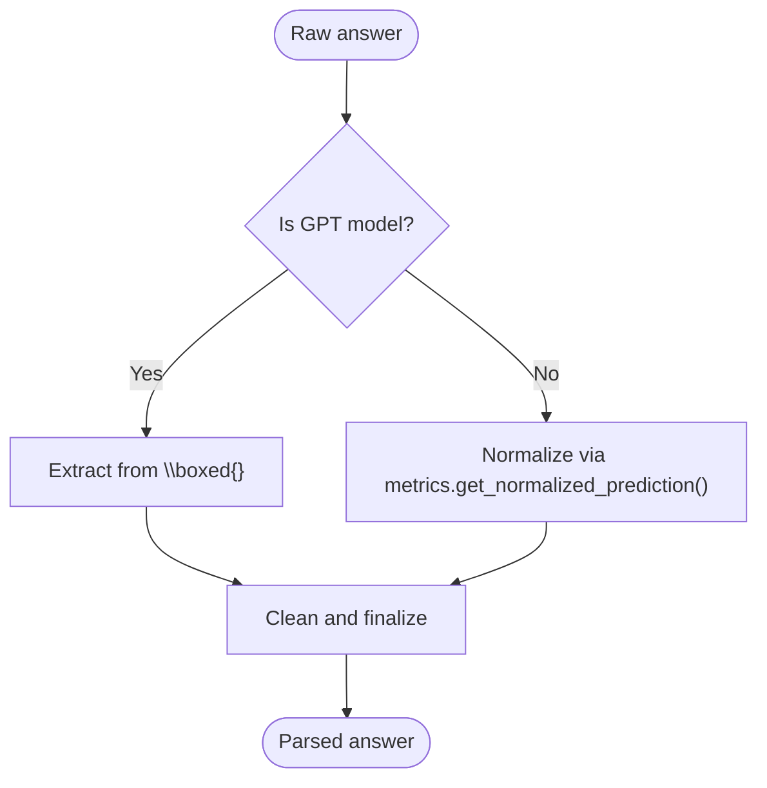
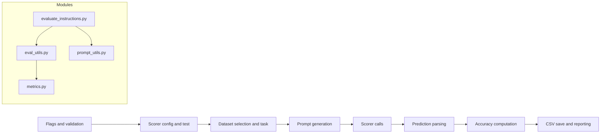

# Prompt Evaluation

<cite>
**Referenced Files in This Document**
- [README.md](file://README.md)
- [evaluate_instructions.py](file://opro/evaluation/evaluate_instructions.py)
- [eval_utils.py](file://opro/evaluation/eval_utils.py)
- [metrics.py](file://opro/evaluation/metrics.py)
- [prompt_utils.py](file://opro/prompt_utils.py)
- [eval_utils_test.py](file://opro/evaluation/eval_utils_test.py)
</cite>

## Table of Contents
1. [Introduction](#introduction)
2. [Project Structure](#project-structure)
3. [Core Components](#core-components)
4. [Architecture Overview](#architecture-overview)
5. [Detailed Component Analysis](#detailed-component-analysis)
6. [Dependency Analysis](#dependency-analysis)
7. [Performance Considerations](#performance-considerations)
8. [Troubleshooting Guide](#troubleshooting-guide)
9. [Conclusion](#conclusion)
10. [Appendices](#appendices)

## Introduction
This document explains the prompt evaluation system centered on evaluate_instructions.py. It measures how effectively a given instruction performs across benchmark datasets by prompting a scorer LLM (Google text-bison or OpenAI GPT models) and computing accuracy metrics. The system supports multiple datasets (MMLU, BBH, GSM8K, AQuA, MultiArith), configurable task modes (train/test or category filters), and flexible instruction positions (before question, at question begin/end, or at answer begin). It also handles diverse output formats from LLMs and normalizes predictions for fair comparison with ground truth.

## Project Structure
The evaluation pipeline lives under opro/evaluation and integrates with prompt utilities for model calls.

**Diagram sources**
- [evaluate_instructions.py](file://opro/evaluation/evaluate_instructions.py#L98-L120)
- [eval_utils.py](file://opro/evaluation/eval_utils.py#L536-L864)
- [metrics.py](file://opro/evaluation/metrics.py#L1-L496)
- [prompt_utils.py](file://opro/prompt_utils.py#L21-L133)
- [README.md](file://README.md#L37-L45)

**Section sources**
- [README.md](file://README.md#L37-L45)
- [evaluate_instructions.py](file://opro/evaluation/evaluate_instructions.py#L98-L120)

## Core Components
- evaluate_instructions.py: CLI-driven orchestrator that validates flags, loads datasets, constructs prompts, invokes the scorer, computes per-example accuracy, and saves CSV results.
- eval_utils.py: Core evaluation logic including prompt generation, true answer extraction, raw answer collection, optional second-round extraction, prediction parsing, and accuracy aggregation.
- metrics.py: Prediction normalization and accuracy computation tailored to multiple-choice, numeric, boolean, and chain-of-thought outputs.
- prompt_utils.py: Thin wrappers around OpenAI ChatCompletion and Google PaLM generate_text APIs with robust retry/error handling.

Key responsibilities:
- Dataset selection and task filtering
- Instruction placement strategies
- Scorer model configuration and testing
- Parallel prompting and retry logic
- Output parsing and metric computation
- Result persistence and reporting

**Section sources**
- [evaluate_instructions.py](file://opro/evaluation/evaluate_instructions.py#L98-L120)
- [eval_utils.py](file://opro/evaluation/eval_utils.py#L536-L864)
- [metrics.py](file://opro/evaluation/metrics.py#L1-L496)
- [prompt_utils.py](file://opro/prompt_utils.py#L21-L133)

## Architecture Overview
High-level flow:
1. Parse flags and validate configuration
2. Select dataset and task
3. Build result directory
4. Configure scorer (OpenAI or PaLM)
5. Load dataset and split into folds
6. For each instruction and fold:
   - Generate prompts with chosen instruction position
   - Call scorer (single or parallel batches)
   - Optionally extract final answer via second round
   - Normalize predictions and compute accuracy
   - Save detailed CSV per task/instruction

**Diagram sources**
- [evaluate_instructions.py](file://opro/evaluation/evaluate_instructions.py#L549-L766)
- [eval_utils.py](file://opro/evaluation/eval_utils.py#L536-L864)
- [metrics.py](file://opro/evaluation/metrics.py#L345-L496)
- [prompt_utils.py](file://opro/prompt_utils.py#L21-L133)

## Detailed Component Analysis

### evaluate_instructions.py
Purpose:
- Provides a command-line interface to evaluate a list of instructions across selected datasets and tasks.
- Supports training and test fold evaluation independently or combined.
- Configures scorer model settings and tests connectivity before evaluation.
- Saves per-task CSVs with raw prompts, raw answers, parsed answers, true answers, and per-example accuracy.

Key configuration flags:
- --scorer: text-bison, gpt-3.5-turbo, gpt-4
- --dataset: mmlu, bbh, gsm8k, multiarith, aqua
- --task: dataset-specific task or category
- --instruction_pos: before_Q, Q_begin, Q_end, A_begin
- --evaluate_training_fold / --evaluate_test_fold: toggle evaluation folds
- --openai_api_key / --palm_api_key: model credentials

Workflow highlights:
- Validates dataset/task combinations and instruction position
- Creates a timestamped result directory under outputs/scorer-outputs
- Builds scorer configurations and tests the server
- Loads dataset files and splits indices into training/test folds
- Iterates over instructions and folds, invoking eval_utils.evaluate_single_instruction
- Aggregates and prints average accuracy per instruction and fold

Output files:
- Per task: CSV with columns including index_in_raw_dataset, raw_prompt, raw_answer, parsed_answer, true_answer, accuracy
- Per task: scorer_configs.json with model parameters

Common pitfalls:
- Missing API keys for selected scorer
- Incorrect dataset/task combination
- Invalid instruction position
- No examples in selected task/fold

**Section sources**
- [evaluate_instructions.py](file://opro/evaluation/evaluate_instructions.py#L98-L120)
- [evaluate_instructions.py](file://opro/evaluation/evaluate_instructions.py#L120-L205)
- [evaluate_instructions.py](file://opro/evaluation/evaluate_instructions.py#L238-L303)
- [evaluate_instructions.py](file://opro/evaluation/evaluate_instructions.py#L304-L548)
- [evaluate_instructions.py](file://opro/evaluation/evaluate_instructions.py#L549-L766)

### eval_utils.py
Responsibilities:
- Prompt construction: gen_prompt supports four instruction positions and dataset-specific formatting.
- True answer extraction: fetch_true_answer reads gold labels from dataset files.
- Raw answer collection: _prompting_to_get_raw_answers wraps server calls with retries and sleeps.
- Final answer extraction: optional second round prompts to improve extraction quality.
- Prediction parsing: _parse_prediction handles LaTeX boxed answers for GPT and delegates to metrics.get_normalized_prediction otherwise.
- Accuracy computation: get_accuracy_of_list aggregates multiple decodes per example and applies dataset-specific matching rules.

Parallelization:
- Multithreading pool distributes batches across configured number of servers.
- Batch grouping respects batch_size and spreads across servers cyclically.

Second-round extraction:
- When enabled, appends “So the final answer is” to the first-round prompt plus the model’s raw answer, then truncates to first newline or before next question delimiter.

Accuracy logic:
- Multiple-choice: symbol match, exact text match, inclusion of correct text while excluding others, or boolean match variants.
- Numeric: normalization and rounding to match target precision.
- Boolean: normalize to true/false equivalents and compare.

**Section sources**
- [eval_utils.py](file://opro/evaluation/eval_utils.py#L164-L259)
- [eval_utils.py](file://opro/evaluation/eval_utils.py#L262-L286)
- [eval_utils.py](file://opro/evaluation/eval_utils.py#L338-L379)
- [eval_utils.py](file://opro/evaluation/eval_utils.py#L381-L497)
- [eval_utils.py](file://opro/evaluation/eval_utils.py#L536-L864)

### metrics.py
Normalization and accuracy:
- get_normalized_prediction strips answer indicators, removes trailing punctuation, handles bracketed choices, converts words to digits, strips units and thousands separators, rounds to target precision, and normalizes boolean-like strings.
- get_normalized_target_and_prediction determines treat_as_number and num_decimals from the target and normalizes both target and prediction consistently.
- number_included_accuracy_list compares normalized predictions with targets:
  - Exact match for non-numeric targets
  - Numerical comparison within epsilon tolerance for numeric targets
- number_included_accuracy returns two accuracy metrics: one with normalization and one with normalization plus calculation-based checks.

Supported patterns:
- Answer indicators like “answer is …”, “Answer: …”, “#### …”
- Delimiters across multiple languages
- Bracketed multiple choice letters
- Boolean symbols across multiple languages

**Section sources**
- [metrics.py](file://opro/evaluation/metrics.py#L1-L156)
- [metrics.py](file://opro/evaluation/metrics.py#L157-L343)
- [metrics.py](file://opro/evaluation/metrics.py#L345-L496)

### prompt_utils.py
Server wrappers:
- call_openai_server_func: iterates over prompts and returns a list of answers, with robust error handling for timeouts, rate limits, API errors, connection issues, service unavailability, and OS errors.
- call_palm_server_from_cloud: calls Google PaLM generate_text with retry logic.

These functions are used by evaluate_instructions.py to configure and call the scorer.

**Section sources**
- [prompt_utils.py](file://opro/prompt_utils.py#L21-L133)

## Architecture Overview

**Diagram sources**
- [evaluate_instructions.py](file://opro/evaluation/evaluate_instructions.py#L549-L766)
- [eval_utils.py](file://opro/evaluation/eval_utils.py#L536-L864)
- [metrics.py](file://opro/evaluation/metrics.py#L345-L496)
- [prompt_utils.py](file://opro/prompt_utils.py#L21-L133)

## Detailed Component Analysis

### Evaluation Workflow
End-to-end flow for a single instruction and fold:

**Diagram sources**
- [evaluate_instructions.py](file://opro/evaluation/evaluate_instructions.py#L549-L766)
- [eval_utils.py](file://opro/evaluation/eval_utils.py#L536-L864)
- [metrics.py](file://opro/evaluation/metrics.py#L345-L496)

### Accuracy Computation Details
- Multiple-choice: strict symbol match, exact text match, inclusion of correct text while excluding others, or boolean match.
- Numeric: normalize units and decimals, round to target precision, compare numerically.
- Boolean: normalize to true/false equivalents and compare.

**Diagram sources**
- [eval_utils.py](file://opro/evaluation/eval_utils.py#L381-L497)
- [metrics.py](file://opro/evaluation/metrics.py#L443-L496)

### Output Parsing and Extraction
- For GPT models, detection of LaTeX boxed answers is handled explicitly.
- For other models, metrics.get_normalized_prediction is used to extract final answers using answer indicators, delimiters, and bracketed choices.

**Diagram sources**
- [eval_utils.py](file://opro/evaluation/eval_utils.py#L788-L800)
- [metrics.py](file://opro/evaluation/metrics.py#L188-L343)

## Dependency Analysis

**Diagram sources**
- [evaluate_instructions.py](file://opro/evaluation/evaluate_instructions.py#L98-L120)
- [evaluate_instructions.py](file://opro/evaluation/evaluate_instructions.py#L238-L303)
- [evaluate_instructions.py](file://opro/evaluation/evaluate_instructions.py#L549-L766)
- [eval_utils.py](file://opro/evaluation/eval_utils.py#L536-L864)
- [metrics.py](file://opro/evaluation/metrics.py#L345-L496)
- [prompt_utils.py](file://opro/prompt_utils.py#L21-L133)

**Section sources**
- [evaluate_instructions.py](file://opro/evaluation/evaluate_instructions.py#L98-L120)
- [eval_utils.py](file://opro/evaluation/eval_utils.py#L536-L864)
- [metrics.py](file://opro/evaluation/metrics.py#L345-L496)
- [prompt_utils.py](file://opro/prompt_utils.py#L21-L133)

## Performance Considerations
- Parallel prompting: Multithreading pools distribute batches across servers to reduce wall-clock time. Tune num_servers and batch_size according to model throughput and quotas.
- Retry and sleep: Built-in retry loops mitigate transient API errors; adjust max_retry and sleep_time for stability vs. speed.
- Decoding strategy: num_decodes controls how many outputs are collected per prompt; higher values increase accuracy estimation reliability but cost more tokens.
- Output truncation: Second-round extraction reduces noise and improves parsing accuracy for models that produce long rationales.

[No sources needed since this section provides general guidance]

## Troubleshooting Guide
Common issues and resolutions:
- Missing API keys:
  - Ensure --openai_api_key or --palm_api_key is provided depending on the selected scorer.
- Invalid dataset/task:
  - Verify dataset and task combinations conform to supported sets and categories.
- Scorer connectivity:
  - The system tests the scorer server before evaluation; failures indicate credential or quota problems.
- Parsing failures:
  - For numeric targets, ensure predictions include numbers; normalization strips units and decimals.
  - For multiple-choice, ensure bracketed symbols or answer texts are present; inclusion checks require correct text exclusion.
  - For GPT models, ensure LaTeX boxed answers are present when expected.
- Retry storms:
  - Increase sleep_time or reduce batch_size to avoid rate limits.
- Slow evaluation:
  - Reduce dataset size by selecting a subset of examples or a single task.
  - Disable parallelization for GPT models if concurrency causes instability.

Interpreting outputs:
- CSV columns include index_in_raw_dataset, raw_prompt, raw_answer, parsed_answer, true_answer, and accuracy.
- Average accuracy per instruction and fold is printed to console and saved in filenames indicating train/test ratios.

**Section sources**
- [evaluate_instructions.py](file://opro/evaluation/evaluate_instructions.py#L184-L205)
- [evaluate_instructions.py](file://opro/evaluation/evaluate_instructions.py#L296-L303)
- [eval_utils.py](file://opro/evaluation/eval_utils.py#L338-L379)
- [eval_utils.py](file://opro/evaluation/eval_utils.py#L536-L864)
- [metrics.py](file://opro/evaluation/metrics.py#L345-L496)

## Conclusion
The prompt evaluation system provides a robust, configurable framework to assess instruction effectiveness across benchmarks. By separating concerns—prompt construction, scoring, parsing, and accuracy computation—it enables reproducible comparisons and scalable experimentation. Proper configuration of dataset/task, instruction position, and scorer settings yields reliable accuracy metrics and actionable insights for prompt optimization.

[No sources needed since this section summarizes without analyzing specific files]

## Appendices

### Configuration Options Summary
- Scorer: text-bison, gpt-3.5-turbo, gpt-4
- Dataset: mmlu, bbh, gsm8k, multiarith, aqua
- Task:
  - mmlu: category filter STEM/humanities/social sciences/other
  - bbh: specific task name
  - gsm8k: train/test
  - multiarith/self
  - aqua: self
- Instruction position: before_Q, Q_begin, Q_end, A_begin
- Fold evaluation: evaluate_training_fold, evaluate_test_fold
- Additional parameters: batch_size, num_servers, num_decodes, max_retry, sleep_time, prediction_treat_as_number/bool, prediction_num_decimals, is_gpt_model

**Section sources**
- [evaluate_instructions.py](file://opro/evaluation/evaluate_instructions.py#L120-L205)
- [evaluate_instructions.py](file://opro/evaluation/evaluate_instructions.py#L238-L303)
- [eval_utils.py](file://opro/evaluation/eval_utils.py#L536-L635)

### Example Evaluation Outputs and Interpretation
- Per task CSVs contain:
  - index_in_raw_dataset: original row index
  - raw_prompt/raw_answer/parsed_answer: prompt, first-round answer, and normalized answer
  - true_answer: ground truth label
  - accuracy: per-example correctness
- Averages are computed per instruction and fold and printed to console.

**Section sources**
- [evaluate_instructions.py](file://opro/evaluation/evaluate_instructions.py#L700-L766)
- [eval_utils.py](file://opro/evaluation/eval_utils.py#L834-L864)

### Running Rapid Tests on Subsets
- Limit dataset size by selecting a single task or a small subset of indices.
- Reduce num_decodes and batch_size to cut costs and speed up iteration.
- Use evaluate_training_fold=false and evaluate_test_fold=true to quickly test on held-out data.

**Section sources**
- [evaluate_instructions.py](file://opro/evaluation/evaluate_instructions.py#L107-L117)
- [eval_utils.py](file://opro/evaluation/eval_utils.py#L536-L635)